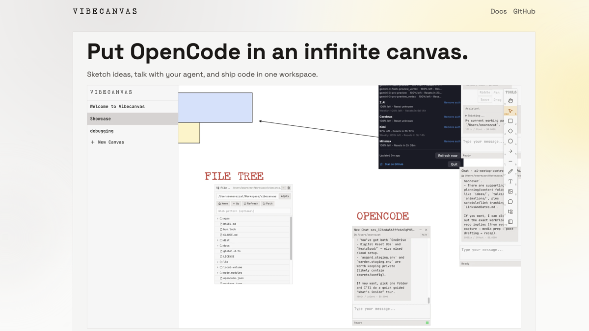

# Vibecanvas

Run your agents in an infinite drawing canvas.

Runs completly local. Reuses your llm subscriptions.



The project is organized as a monorepo and follows a **Functional Core / Imperative Shell** architecture.

## Features

- Infinite canvas UI for drawing, selecting, transforming, and grouping elements
- Canvas CLI for list/query/add/patch/move/group/ungroup/delete/reorder flows
- Agents can edit canvases too by calling the same CLI commands
- Real-time CRDT sync with Automerge for conflict-free collaboration
- Unified WebSocket API endpoint for app RPC (`/api`)
- Dedicated Automerge sync endpoint (`/automerge`)
- Native binary distribution for macOS, Linux, and Windows
- Auto-update checks in the CLI/server runtime

## Quick Start

### Install globally

```bash
# bun
bun add -g vibecanvas

# npm
npm i -g vibecanvas

# pnpm
pnpm add -g vibecanvas

# yarn
yarn global add vibecanvas
```

Then run:

```bash
vibecanvas
```

Open [http://localhost:7496](http://localhost:7496) to use the app.

You can edit the canvas from the UI, or from the CLI. Agents can use the same canvas CLI surface for scripted canvas changes.

The Vibecanvas skill for agents lives here:
- https://github.com/vibecanvas/skills

For common setup/runtime questions, see the FAQ:

- https://vibecanvas.dev/docs/faq

### Upgrade vibecanvas

Vibecanvas includes a built-in upgrade command from the server CLI (`apps/server/src/main.ts`).

```bash
# check for updates and install
vibecanvas upgrade

# check only (no install)
vibecanvas upgrade --check
```

Useful related commands:

```bash
vibecanvas --version
vibecanvas --help
vibecanvas canvas --help
```

### Uninstall

```bash
# bun
bun remove -g vibecanvas

# npm
npm uninstall -g vibecanvas

# pnpm
pnpm remove -g vibecanvas

# yarn
yarn global remove vibecanvas
```

If you installed using the install script (`curl ... | bash`) instead of a package manager, remove the installed files manually:

```bash
rm -rf ~/.vibecanvas
```

Also remove any PATH line you added for `~/.vibecanvas/bin` in your shell profile (`~/.zshrc`, `~/.bashrc`, `~/.profile`, or fish config).

## Database

- Default installed/compiled SQLite DB path: `~/.local/share/vibecanvas/vibecanvas.sqlite`
- Respects `XDG_DATA_HOME` on Linux/macOS-style XDG setups, so effective path is `"$XDG_DATA_HOME"/vibecanvas/vibecanvas.sqlite` when set
- `VIBECANVAS_CONFIG=/some/dir` changes DB path to `/some/dir/vibecanvas.sqlite`
- `VIBECANVAS_DB=/some/file.sqlite` sets an explicit SQLite file path
- Dev monorepo default DB path: `./local-volume/data/vibecanvas.sqlite`
- Schema source: `packages/service-db/src/schema.ts`

## Debugging the live app

The canvas runtime includes a built-in debug logger that can be enabled per plugin or per service from the browser devtools console.

Debug keys use this format:

```txt
vibecanvas:debug:<plugin|service>:<name>
```

Levels:
- `0`, `false`, `off`, or empty = disabled
- `1` = important lifecycle logs
- `2` = more detailed state/layout logs
- `3` = very noisy per-frame/per-event logs

Examples:

```js
// hosted component plugin logs
localStorage.setItem("vibecanvas:debug:plugin:hosted-component", "3")

// camera service logs
localStorage.setItem("vibecanvas:debug:service:camera", "1")
```

Then reload the page and inspect the browser console.

To turn a target back off:

```js
localStorage.setItem("vibecanvas:debug:plugin:hosted-component", "0")
```

Current log output includes prefixes like:

```txt
[vibecanvas][plugin:hosted-component][L2] ...
```

This is especially useful for debugging live layout, overlay, hydration, transform, and mount issues inside the running app.

## Contributing

Contributions are welcome.

**By submitting a pull request, you agree to transfer ownership of your contribution to the project maintainer.** This allows the project to be re-licensed or otherwise managed without needing to contact every individual contributor.

Recommended workflow:
1. Create a branch from `main`.
2. Make focused changes with tests.
3. Run relevant checks (`bun test`, package-specific tests, and build checks if needed).
4. Open a pull request with a clear summary.

For implementation conventions and deeper subsystem docs, read:
- `CLAUDE.md`
- `apps/spa/CLAUDE.md`
- `apps/spa/src/features/canvas-crdt/CLAUDE.md`
- `apps/spa/src/features/canvas-crdt/canvas/CLAUDE.md`
- `apps/spa/src/features/canvas-crdt/input-commands/CLAUDE.md`
- `apps/spa/src/features/canvas-crdt/managers/CLAUDE.md`
- `apps/spa/src/features/canvas-crdt/renderables/CLAUDE.md`

## License

MIT. See `LICENSE`.
