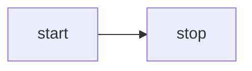

---
outline: deep
description: 'Learn how to initialize a canvas with hardware abstraction layers based on WebGL/WebGPU, design Canvas API, implement a plugin-based architecture, and create a rendering plugin. Build an extensible canvas framework supporting multiple renderers.'
head:
    - [
          'meta',
          { property: 'og:title', content: 'Lesson 1 - Initialize canvas' },
      ]
---

# Lesson 1 - Initialize canvas

In this lesson you will learn the following:

-   Hardware abstraction layers (HAL) based on WebGL1/2 and WebGPUs
-   Designing our Canvas API
-   Implementing a simple plug-in system
-   Implementing a rendering plugin based on the HAL

When you start the project you will see an empty canvas and you can change the aspect or switch between WebGL and WebGPU renderers.

```js eval code=false
width = Inputs.range([50, 300], { label: 'width', value: 100, step: 1 });
```

```js eval code=false
height = Inputs.range([50, 300], { label: 'height', value: 100, step: 1 });
```

```js eval code=false
renderer = Inputs.select(['webgl', 'webgpu'], { label: 'renderer' });
```

```js eval code=false
(async () => {
    const { Canvas } = Lesson1;

    const $canvas = document.createElement('canvas');
    $canvas.style.outline = 'none';
    $canvas.style.padding = '0px';
    $canvas.style.margin = '0px';
    $canvas.style.border = '1px solid black';

    const canvas = await new Canvas({
        canvas: $canvas,
        renderer,
        shaderCompilerPath:
            'https://unpkg.com/@antv/g-device-api@1.6.8/dist/pkg/glsl_wgsl_compiler_bg.wasm',
    }).initialized;

    const resize = (width, height) => {
        const scale = window.devicePixelRatio;
        $canvas.width = Math.floor(width * scale);
        $canvas.height = Math.floor(height * scale);
        $canvas.style.width = `${width}px`;
        $canvas.style.height = `${height}px`;
        canvas.resize(width, height);
    };
    resize(width, height);

    const animate = () => {
        canvas.render();
        requestAnimationFrame(animate);
    };
    animate();
    return $canvas;
})();
```

## Hardware abstraction layers

I want the canvas to use more low-level rendering APIs like WebGL and WebGPU, the successor to WebGL, which has a lot of feature enhancements, see [From WebGL to WebGPU]:

-   The underlying is based on a new generation of native GPU APIs, including Direct3D12 / Metal / Vulkan and more.
-   Stateless API, no more unmanageable global state.
-   Compute Shader support.
-   There is no longer a limit to the number of contexts created per `<canvas>`.
-   Developer experience improvements. Includes friendlier error messages and custom labels for GPU objects.

The WebGPU ecosystem now extends into JavaScript, C++, and Rust, and a number of web-side rendering engines (e.g. Three.js, Babylon.js) are in the process of, or have completed, accessing it. A special mention goes to [wgpu], which in addition to the game engine [bevy], has also been used in production by web-based creative design tools like [Modyfi], and has performed very well. The image below is from: [WebGPU Ecosystem]


Of course, given browser compatibility, we still need to be as compatible as possible with WebGL1/2. In the rendering engine, the Hardware Abstraction Layer (HAL) abstracts the details of the GPU hardware, allowing the upper layers to be independent of the specific hardware implementation.

We hope to provide a unified set of APIs based on WebGL1/2 and WebGPU as much as possible, along with Shader translation and modularization. The [@antv/g-device-api] implementation references [noclip] and builds on it to be compatible with WebGL1, which we also use in some of our visualization-related projects.

Since WebGL and WebGPU use different shader languages, and we don't want to maintain two sets of code, GLSL and WGSL, we choose to translate the shader at runtime:


All that is needed in the project is to maintain a set of shaders using GLSL 300 syntax, keyword replacements when downgrading to WebGL1, and conversion to GLSL 440 before handing it over to a WASM-formatted [compiler](https://github.com/antvis/g-device-api/tree/master/rust) (using naga and naga-oil) into WGSL. Not coincidentally, [Three.js Shading Language] also uses a higher level of abstraction, and also uses a compiler to output shader code for the target runtime platform.

The following shows the attribute declarations commonly used in the Vertex Shader. This is a very simple scenario, and the syntax actually varies a lot when it comes to the texture sampling part.

```glsl
// GLSL 300
layout(location = 0) in vec4 a_Position;

// compiled GLSL 100
attribute vec4 a_Position;

// compiled GLSL 440
layout(location = 0) in vec4 a_Position;

// compiled WGSL
var<private> a_Position_1: vec4<f32>;
@vertex
fn main(@location(0) a_Position: vec4<f32>) -> VertexOutput {
    a_Position_1 = a_Position;
}
```

Recently I came across this article: [Figma rendering: Powered by WebGPU], and discovered that Figma has also adopted a similar implementation approach to complete its WebGPU upgrade:

> We maintain our existing GLSL shaders, written in WebGL 1–compliant format. The shader processor then automatically handles translating them to WGSL. This involves parsing the shaders, making the necessary translations to convert them to a newer version of GLSL, then running the open-source tool naga to convert them to WGSL.

Well, enough about the hardware abstraction layer, if you are interested in the implementation details you can directly refer to the [@antv/g-device-api] source code. We will use some of this API in the last subsection of this lesson.

## Design the canvas API

Finally we get to the design part of our canvas API. The simple usage we're looking forward to is as follows:

-   Pass in an HTMLCanvasElement `<canvas>` to do the work of creating and initializing the canvas, including the creation of the Device (an abstract instance of the GPU) using the hardware abstraction layer.
-   Create a rendering loop that keeps calling the canvas rendering methods.
-   Support for resizing the canvas, e.g. in response to the `resize` event.
-   Destroy itself at proper time.

```ts
const canvas = new Canvas({
    canvas: $canvas,
});

const animate = () => {
    requestAnimationFrame(animate);
    canvas.render();
};
animate();

canvas.resize(500, 500);
canvas.destroy();
```

The use of render loops is very common in rendering engines such as [Rendering the scene] in Three.js and [Basic draw loop] in CanvasKit. See [Performant Game Loops in JavaScript] for more information on why `requestAnimationFrame` is used instead of `setTimeout`.

It looks like a very simple interface definition, but let's not rush to implement it yet, because there is an asynchronous initialization problem here.

```ts
interface Canvas {
    constructor(config: { canvas: HTMLCanvasElement });
    render(): void;
    destroy(): void;
    resize(width: number, height: number): void;
}
```

### Asynchronous initialization

This is also a significant difference between WebGPU and WebGL. In WebGL, obtaining the context is a synchronous process, whereas obtaining a Device in WebGPU is asynchronous:

```ts
// create a context in WebGL
const gl = $canvas.getContext('webgl');

// obtaining a device in WebGPU
const adapter = await navigator.gpu.requestAdapter();
const device = await adapter.requestDevice();
```

Therefore, when using the hardware abstraction layer we mentioned in the previous section, an asynchronous approach must also be used. This represents a breaking change for all rendering engines that wish to transition from WebGL to WebGPU, such as Babylon.js: [Creation of the WebGPU engine is asynchronous]：

```ts
import {
    WebGLDeviceContribution,
    WebGPUDeviceContribution,
} from '@antv/g-device-api';

// create a device in WebGL
const deviceContribution = new WebGLDeviceContribution({
    targets: ['webgl2', 'webgl1'],
});
// create a device in WebGPU
const deviceContribution = new WebGPUDeviceContribution({
    shaderCompilerPath: '/glsl_wgsl_compiler_bg.wasm',
});
// here's the asynchronous process
const swapChain = await deviceContribution.createSwapChain($canvas);
const device = swapChain.getDevice();
// create GPU objects with Device API
```

Since constructors in JavaScript do not support asynchronous operations, an asynchronous init method is added to the canvas to initialize it, and the rendering method is called after the initialization is complete:

```ts
const canvas = new Canvas();
await canvas.init();
canvas.render();
```

But I don't think this is a good approach. Firstly, the `new` keyword already implies initialization. Secondly, the init method seems to be callable multiple times, but in reality, it is not. Inspired by the [Async Constructor Pattern in JavaScript], I personally prefer the following syntax:

```ts
const canvas = await new Canvas().initialized;
```

In fact, this design pattern is also used by, for example, the [Animation: ready property] of the Web Animations API:

```ts
animation.ready.then(() => {});
```

### Implementation

In the implementation, we use a private variable to hold the Promise, and the getter also ensures that it is read-only:

```ts
export class Canvas {
    #instancePromise: Promise<this>;
    get initialized() {
        return this.#instancePromise.then(() => this);
    }
}
```

Use an Immediately Invoked Async Function Expression (IIAFE) within the constructor to perform the initialization:

```ts
constructor() {
  this.#instancePromise = (async () => {
    // Omit the specific implementation...
    return this;
  })();
}
```

Let's continue to optimize the current design.

## Plugin-based architecture

We could, of course, place the code that calls the hardware abstraction layer within the Canvas constructor and destroy it all together in the `destroy` method. However, as we add more tasks during the initialization, rendering, and destruction phases, the logic of the Canvas will continue to expand. It is difficult to think through all the functionalities that need to be supported at the very beginning, hence we want the canvas to be extensible.

```ts
destroy() {
  this.device.destroy();
  this.eventManager.destroy();
  // Omit other tasks...
}
```

A plugin-based architecture is a common design pattern that can be seen in webpack, VS Code, and even Chrome. It has the following characteristics:

-   Modularity. Each plugin is responsible for an independent part, with reduced coupling between them, making maintenance easier.
-   Extensibility. Plugins can be dynamically loaded and unloaded at runtime without affecting the structure of the core module, achieving dynamic expansion capabilities of the application.

This architecture typically consists of the following parts:

-   The main application. It provides the functionality to register plugins, calls plugins to execute at the appropriate stage, and provides the context needed for plugin execution.
-   The plugin interface. It serves as a bridge between the main application and the plugins.
-   The plugin collection. A set of independently executable modules, each plugin adheres to the principle of separation of duties, containing only the minimum required functionality.

How does the main application invoke plugin execution? Let's take a look at the approach of webpack first:

-   In the main application, a series of hooks are defined. These hooks can be synchronous or asynchronous, and can be serial or parallel. If they are synchronous and serial, they are similar to the common event listeners we are familiar with. In the example below, `run` is a synchronous serial hook.
-   Each plugin listens to the lifecycle events it cares about when it registers. In the example below, `apply` will be called during registration.
-   The main application triggers the hooks.

```ts
class ConsoleLogOnBuildWebpackPlugin {
    apply(compiler) {
        compiler.hooks.run.tap(pluginName, (compilation) => {
            console.log('webpack starting...');
        });
    }
}
```

webpack implements the [tapable] toolkit to provide these capabilities, and also uses `new Function` to improve performance in mass-call scenarios, as discussed in [Is the new Function performance really good?] But we can simply implement it along the same lines, e.g., the hooks for synchronized serial execution use an array of `callbacks`, and there's no black magic:

```ts
export class SyncHook<T> {
    #callbacks: ((...args: AsArray<T>) => void)[] = [];

    tap(fn: (...args: AsArray<T>) => void) {
        this.#callbacks.push(fn);
    }

    call(...argsArr: AsArray<T>): void {
        this.#callbacks.forEach(function (callback) {
            /* eslint-disable-next-line prefer-spread */
            callback.apply(void 0, argsArr);
        });
    }
}
```

We define the following hooks, with names that visually reflect which phase of the main application they will be called in:

```ts
export interface Hooks {
    init: SyncHook<[]>;
    initAsync: AsyncParallelHook<[]>;
    destroy: SyncHook<[]>;
    resize: SyncHook<[number, number]>; // When height or width changed.
    beginFrame: SyncHook<[]>;
    endFrame: SyncHook<[]>;
}
```

The plugin context containing these hooks is passed in during the plugin registration phase, and we will continue to extend the plugin context subsequently:

```ts
export interface PluginContext {
    hooks: Hooks;
    canvas: HTMLCanvasElement;
}
export interface Plugin {
    apply: (context: PluginContext) => void;
}
```

Calling the `apply` method on canvas initialization and passing in the context completes the registration of the plugin and triggers the initialization of both synchronous and asynchronous hooks, and the rendering plugin we implement in the next section completes the asynchronous initialization:

```ts{8}
import { Renderer } from './plugins';

this.#instancePromise = (async () => {
  const { hooks } = this.#pluginContext;
  [new Renderer()].forEach((plugin) => {
    plugin.apply(this.#pluginContext);
  });
  hooks.init.call();
  await hooks.initAsync.promise();
  return this;
})();
```

Now we have all the knowledge needed to implement the first plugin.

## Renderer Plugin

We want to support WebGL and WebGPU, so we support configuration via the `renderer` parameter in the canvas constructor, which is subsequently passed into the plugin context:

```ts{3}
constructor(config: {
  canvas: HTMLCanvasElement;
  renderer?: 'webgl' | 'webgpu';
}) {}

this.#pluginContext = {
  canvas,
  renderer,
};
```

Next we describe how to use the hardware abstraction layer in the rendering plugin.

### SwapChain

In OpenGL / WebGL [Default Framebuffer] is different from the usual Framebuffer Object (FBO), which is created automatically when initializing the context. If you don't specify an FBO when calling the draw command, OpenGL will automatically write the rendering result into the Default Framebuffer, where the Color Buffer will eventually be displayed on the screen.

This is not the case in Vulkan, instead we have [SwapChain], the following image from [Canvas Context and Swap Chain] shows how it works, the GPU writes the rendered result to the backbuffer, the frontbuffer is used for displaying it to the screen, and the two can be swapped.


Without this double-buffering mechanism, there is a good chance that the GPU will write the rendered results at the same time as the screen is refreshing, which can cause tearing. Therefore, it is also necessary to use vertical synchronization to force the display not to allow updates, and the following figure from [Canvas Context and Swap Chain] shows the timing of this process.


In WebGPUs the user does not usually have direct access to the SwapChain, which is integrated into [GPUCanvasContext]. The [wgpu], which also follows the WebGPU design, combines SwapChain into [Surface], which is also not directly accessible to the user. However, our hardware abstraction layer still uses this concept for encapsulation. This allows the SwapChain and Device to be created during plugin initialization based on the `renderer` parameter:

```ts{13}
import {
  WebGLDeviceContribution,
  WebGPUDeviceContribution,
} from '@antv/g-device-api';
import type { SwapChain, DeviceContribution, Device } from '@antv/g-device-api';

export class Renderer implements Plugin {
  apply(context: PluginContext) {
    const { hooks, canvas, renderer } = context;

    hooks.initAsync.tapPromise(async () => {
      let deviceContribution: DeviceContribution;
      if (renderer === 'webgl') {
        deviceContribution = new WebGLDeviceContribution();
      } else {
        deviceContribution = new WebGPUDeviceContribution();
      }
      const { width, height } = canvas;
      const swapChain = await deviceContribution.createSwapChain(canvas);
      swapChain.configureSwapChain(width, height);

      this.#swapChain = swapChain;
      this.#device = swapChain.getDevice();
    });
  }
}
```

### devicePixelRatio

The [devicePixelRatio] describes how many actual screen pixels should be used to draw a single CSS pixel. Typically we would set `<canvas>` with the following code:

```ts
const $canvas = document.getElementById('canvas');
$canvas.style.width = `${width}px`; // CSS Pixels
$canvas.style.height = `${height}px`;

const scale = window.devicePixelRatio;
$canvas.width = Math.floor(width * scale); // Screen Pixels
$canvas.height = Math.floor(height * scale);
```

We use CSS pixels when describing the canvas width and height, the graphic size, and the actual pixels on the screen when creating the SwapChain. The width and height passed in at `resize` also use CSS pixels, so they need to be converted:

```ts{3}
hooks.resize.tap((width, height) => {
  this.#swapChain.configureSwapChain(
    width * devicePixelRatio,
    height * devicePixelRatio,
  );
});
```

So how do we get [devicePixelRatio]? Of course we can use `window.devicePixelRatio` to get it, which is fine in most cases. But what if there is no `window` object in the running environment? For example:

-   Node.js server-side rendering. For example, using [headless-gl]
-   Rendering in a WebWorker, using [OffscreenCanvas].
-   Non-standard browser environments such as applets

So it's better to support passing in the canvas when it's created and trying to get it from [globalThis] when it's not. We modify the constructor parameters of the Canvas as follows:

```ts{2}
export interface CanvasConfig {
  devicePixelRatio?: number;
}

const { devicePixelRatio } = config;
const globalThis = getGlobalThis();
this.#pluginContext = {
  devicePixelRatio: devicePixelRatio ?? globalThis.devicePixelRatio,
};
```

Other hooks are implemented as follows:

```ts
hooks.destroy.tap(() => {
    this.#device.destroy();
});

hooks.beginFrame.tap(() => {
    this.#device.beginFrame();
});

hooks.endFrame.tap(() => {
    this.#device.endFrame();
});
```

Finally, add the plugin to the list of plugins in the canvas:

```ts{1}
[new Renderer(), ...plugins].forEach((plugin) => {
  plugin.apply(this.#pluginContext);
});
```

## Demo

Since we haven't drawn any graphics yet and the canvas is blank, how do we know what the underlying WebGL / WebGPU commands are calling? Debugging on the web side can be done using the Chrome plugins: [Spector.js] and [WebGPU Inspector].

The following image shows the first frame command captured using Spector.js, and you can see that we have created a series of GPU objects such as FrameBuffer, Texture, etc:


After switching to WebGPU rendering:

```ts{3}
const canvas = await new Canvas({
  canvas: $canvas,
  renderer: 'webgpu',
}).initialized;
```

Open WebGPU Inspector to see the current GPU objects we've created and the commands called for each frame:


## Extended reading

If you have no basic knowledge of WebGL at all, you can try to learn it first:

-   [WebGL Fundamentals]
-   [WebGPU Fundamentals]

More on the plug-in design pattern:

-   [Intro to Plugin Oriented Programming]
-   [Introducing: Penpot Plugin System]
-   [Extensions in Tiptap]

[WebGPU Ecosystem]: https://developer.chrome.com/blog/webgpu-ecosystem/
[From WebGL to WebGPU]: https://developer.chrome.com/blog/from-webgl-to-webgpu
[@antv/g-device-api]: https://github.com/antvis/g-device-api
[Intro to Plugin Oriented Programming]: https://pop-book.readthedocs.io/en/latest/index.html
[wgpu]: https://wgpu.rs/
[bevy]: https://bevyengine.org/
[noclip]: https://github.com/magcius/noclip.website
[Modyfi]: https://digest.browsertech.com/archive/browsertech-digest-how-modyfi-is-building-with/
[Async Constructor Pattern in JavaScript]: https://qwtel.com/posts/software/async-constructor-pattern/
[Animation: ready property]: https://developer.mozilla.org/en-US/docs/Web/API/Animation/ready
[Rendering the scene]: https://threejs.org/docs/index.html#manual/en/introduction/Creating-a-scene
[Creation of the WebGPU engine is asynchronous]: https://doc.babylonjs.com/setup/support/WebGPU/webGPUBreakingChanges#creation-of-the-webgpu-engine-is-asynchronous
[Spector.js]: https://spector.babylonjs.com/
[WebGPU Inspector]: https://github.com/brendan-duncan/webgpu_inspector
[tapable]: https://github.com/webpack/tapable
[Is the new Function performance really good?]: https://github.com/webpack/tapable/issues/162
[WebGL Fundamentals]: https://webglfundamentals.org/
[WebGPU Fundamentals]: https://webgpufundamentals.org/
[devicePixelRatio]: https://developer.mozilla.org/zh-CN/docs/Web/API/Window/devicePixelRatio
[headless-gl]: https://github.com/stackgl/headless-gl
[OffscreenCanvas]: https://developer.mozilla.org/zh-CN/docs/Web/API/OffscreenCanvas
[SwapChain]: https://vulkan-tutorial.com/Drawing_a_triangle/Presentation/Swap_chain
[Default Framebuffer]: https://www.khronos.org/opengl/wiki/Default_Framebuffer
[globalThis]: https://developer.mozilla.org/en-US/docs/Web/JavaScript/Reference/Global_Objects/globalThis
[Surface]: https://docs.rs/wgpu/latest/wgpu/struct.Surface.html
[GPUCanvasContext]: https://gpuweb.github.io/gpuweb/#canvas-context
[Canvas Context and Swap Chain]: https://carmencincotti.com/2022-12-19/how-to-render-a-webgpu-triangle-series-part-three-video/#bonus-content-swap-chain
[Introducing: Penpot Plugin System]: https://www.smashingmagazine.com/2024/11/open-source-meets-design-tooling-penpot/
[Performant Game Loops in JavaScript]: https://www.aleksandrhovhannisyan.com/blog/javascript-game-loop/
[Extensions in Tiptap]: https://tiptap.dev/docs/editor/core-concepts/extensions#what-are-extensions
[Basic draw loop]: https://skia.org/docs/user/modules/quickstart/#basic-draw-loop
[Three.js Shading Language]: https://github.com/mrdoob/three.js/wiki/Three.js-Shading-Language
[Figma rendering: Powered by WebGPU]: https://www.figma.com/blog/figma-rendering-powered-by-webgpu/


---
outline: deep
description: 'Learn how to add shapes to canvas and draw a circle using SDF (Signed Distance Field). Covers anti-aliasing techniques and dirty flag design pattern for performance optimization.'
head:
    - ['meta', { property: 'og:title', content: 'Lesson 2 - Draw a circle' }]
---

# Lesson 2 - Draw a circle

In this lesson you will learn the following:

-   Adding shapes to the canvas
-   Drawing a circle using SDF
-   Anti Aliasing
-   Dirty flag design pattern

When you start the project you will see a circle drawn in the canvas and you can modify the width and height or switch the WebGL / WebGPU renderer.

```js eval code=false
width = Inputs.range([50, 300], { label: 'width', value: 100, step: 1 });
```

```js eval code=false
height = Inputs.range([50, 300], { label: 'height', value: 100, step: 1 });
```

```js eval code=false
renderer = Inputs.select(['webgl', 'webgpu'], { label: 'renderer' });
```

```js eval code=false inspector=false
canvas = (async () => {
    const { Canvas, Circle } = Lesson2;

    const canvas = await Utils.createCanvas(Canvas, 100, 100, renderer);

    const circle = new Circle({
        cx: 100,
        cy: 100,
        r: 100,
        fill: 'red',
        antiAliasingType: 3,
    });
    canvas.appendChild(circle);

    let id;
    const animate = () => {
        canvas.render();
        id = requestAnimationFrame(animate);
    };
    animate();

    unsubscribe(() => {
        cancelAnimationFrame(id);
        canvas.destroy();
    });

    return canvas;
})();
```

```js eval code=false inspector=false
call(() => {
    Utils.resizeCanvas(canvas, width, height);
});
```

```js eval code=false
call(() => {
    return canvas.getDOM();
});
```

## Adding shapes to canvas

In the last lesson we created a blank canvas to which we will subsequently add various graphics, how to design such an API? As a front-end developer, you may want to draw on the familiar [Node API appendChild]:

```ts
canvas.appendChild(shape);
canvas.removeChild(shape);
```

Temporarily create a graphic base class, which will be inherited by Circle, Ellipse, Rect and so on:

```ts
export abstract class Shape {}
```

Use an array to store a list of shapes in the canvas:

```ts
#shapes: Shape[] = [];

appendChild(shape: Shape) {
  this.#shapes.push(shape);
}

removeChild(shape: Shape) {
  const index = this.#shapes.indexOf(shape);
  if (index !== -1) {
    this.#shapes.splice(index, 1);
  }
}
```

Iterate through the list of shapes in the canvas render method and call the render hook:

```ts{4}
render() {
  const { hooks } = this.#pluginContext;
  hooks.beginFrame.call();
  this.#shapes.forEach((shape) => {
    hooks.render.call(shape);
  });
  hooks.endFrame.call();
}
```

In the render plugin a `RenderPass` is created before the start of each frame, which is encapsulated in the hardware abstraction layer. there is no such concept in WebGL, but in WebGPU [beginRenderPass] returns [GPURenderPassEncoder], which records a series of commands, including `draw` commands, as we'll see later in the `render` hook. When creating `RenderPass` we provide the following parameters:

-   `colorAttachment`
-   `colorResolveTo`
-   `colorClearColor` This is implemented in WebGL with the [gl.clearColor] command; in WebGPU it is declared with the [clearValue] property, which we set to white here.

```ts{4}
hooks.beginFrame.tap(() => {
  this.#device.beginFrame();

  this.#renderPass = this.#device.createRenderPass({
    colorAttachment: [renderTarget],
    colorResolveTo: [onscreenTexture],
    colorClearColor: [TransparentWhite],
  });
});
```

Corresponding to creation, submitting `RenderPass` at the end of each frame, again the corresponding [submit] method is easy to find in the WebGPU, but of course the native API submits a coded command buffer, and the hardware abstraction layer simplifies these concepts.

```ts{2}
hooks.endFrame.tap(() => {
  this.#device.submitPass(this.#renderPass);
  this.#device.endFrame();
});
```

Finally, we come to the `render` hook, where each graph is responsible for implementing the logic to draw itself, and the plugin is responsible for passing in the required GPU objects such as Device and `RenderPass`.

```ts
hooks.render.tap((shape) => {});
```

## Draw a circle

The first thing we need to do is to define the basic attributes of a circle. Those of you who are familiar with SVG [circle] will know that you can define the geometry of a circle based on its center, `cx/cy`, and its radius, `r`, and that you can use the generic drawing attributes of `fill` and `stroke` to satisfy the basic needs.

```ts
export class Circle extends Shape {
    constructor(
        config: Partial<{
            cx: number;
            cy: number;
            r: number;
            fill: string;
        }> = {},
    ) {}
}
```

### Canvas coordinates

Since we're talking about positional attributes like the center of the `cx/cy` circle, it's important to be clear about the canvas coordinate system we're using. In both Canvas and SVG, the origin of the coordinate system is the upper-left corner, X-axis positive 👉, Y-axis positive 👇. However, the [cropping coordinate system] used in WebGL follows the OpenGL specification, with the origin at the center of the viewport, the X-axis pointing 👉, the Y-axis pointing 👆, and the Z-axis pointing inward toward the screen. The cube below, which has an aspect ratio of 2, is also known as normalized device coordinates (NDC):


However, WebGPU follows the Metal specification, which differs from WebGL in that the Y-axis is forward 👇 and the Z-axis is forward outward. There is also a difference in the cropping range of the Z-axis, which is `[-1, 1]` in WebGL and `[0, 1]` in WebGPU:


Our hardware abstraction layer tries to smooth out the differences between WebGL and WebGPU, but chooses to align with Canvas / SVG in terms of coordinate system, which we believe is more in line with what board users are used to.


So if our canvas has a width and height of 200, the `Circle` added in the following way will appear in the center of the canvas:

```ts
const circle = new Circle({
    cx: 100,
    cy: 100,
    r: 50,
    fill: 'red',
});
canvas.appendChild(circle);
```

The next question is how to convert `cx/cy` in the screen coordinate system into NDC for the render pipeline. We'll pass in the width and height of the canvas as a Uniform, and the position of the circle as an Attribute. Dividing the position by the width and height will give us a value in the range `[0, 1]`, which is multiplied by two and subtracted by one to convert to `[-1, 1]`, which is the range of values under NDC. Finally, flip down the Y-axis:

```glsl
layout(std140) uniform SceneUniforms {
  vec2 u_Resolution; // width & height of canvas
};
layout(location = 1) in vec2 a_Position; // cx & cy

// Pixel space to [0, 1] (Screen space)
vec2 zeroToOne = (a_Position + a_Size * a_FragCoord) / u_Resolution;

// Convert from [0, 1] to [0, 2]
vec2 zeroToTwo = zeroToOne * 2.0;

// Convert from [0, 2] to [-1, 1] (NDC/clip space)
vec2 clipSpace = zeroToTwo - 1.0;

// Flip Y axis
gl_Position = vec4(clipSpace * vec2(1, -1), 0.0, 1.0);
```

### Processing color values

Unlike Canvas or SVG, color values in string form can't be used directly in WebGL or WebGPU, but [d3-color] can be converted to `{ r, g, b, opacity }` format, which can then be passed directly into `attribute` as `vec4` or compressed. Finally, we only support RGB-space color values for now, which means that [hsl] and [oklch] are not available:

```ts
import * as d3 from 'd3-color';

set fill(fill: string) {
  this.#fill = fill;
  this.#fillRGB = d3.rgb(fill); // { r, g, b, opacity }
}
```

With the style issue out of the way, let's get back to the geometry. Triangle Mesh is a common representation of geometry in 3D rendering, and [CircleGeometry] in Three.js procedurally generates the geometry by splitting the circle into triangles from the center. Obviously, the more triangles there are, the smoother the circle will be, and if there are only two triangles, it will degenerate into a square. In order to get a smooth circle, more vertices are needed, which causes a significant increase in GPU memory as the number of circles goes up.


### SDF

Only four vertices are needed using a method called Signed Distance Functions (SDF). The following diagram visualizes the concept of SDFs, from the hands-on article [drawing-rectangles] by the emergent editor Zed. A point in the plane is a circle of radius 100 with a distance of 0 on the circle, and negative and positive values inside and outside the circle, respectively:


> The original article uses Lottie animations to show the definition of a directed distance field and the derivation of some formulas for the underlying graph. In Zed's GPUI, SDF is also used to draw the underlying graphs for better performance.

Normally we build the coordinate system in the Vertex Shader.

```glsl
layout(location = 0) in vec2 a_FragCoord;
out vec2 v_FragCoord;
void main() {
  v_FragCoord = a_FragCoord;
}
```

With the distance information, you can use the SDF formula of different graphics in the Fragment Shader to bring in the coordinates of the current pixel to determine whether the point is inside the graphic, if it is outside, it can be directly discarded, otherwise it will be colored, the GLSL code is as follows. Some effects do not care about partial transparency, but either want to show something or nothing at all based on the color value of a texture, see [Discarding fragments].

```glsl
float sdf_circle(vec2 p, float r) {
  return length(p) - r;
}

void main() {
  float distance = sdf_circle(v_FragCoord, 1.0);
  if (distance > 0.0) {
    discard;
  }
  outputColor = vec4(1.0, 0.0, 0.0, 1.0);
}
```

In addition to using fewer vertices, SDF offers the following advantages:

-   Easy anti-aliasing. We will cover it in the next subsection.
-   Easy to combine. Intersection and difference operations can be combined to complete complex graphs.
-   It is easy to realize some complex-looking effects. For example, strokes, rounded corners, shadows, of course, we will introduce some limitations of this method when we realize these effects.

An explanation and detailed derivation of the SDF can also be found in [distfunctions]. This method can be used to draw a variety of common 2D and even 3D shapes, and we'll continue to use it to draw rectangles and text.

Let's go back to the graphics base class and add a method that takes the required parameters to draw:

```ts{2}
export abstract class Shape {
  abstract render(device: Device, renderPass: RenderPass): void;
}
```

Called in the plugin's `render` hook and passed in the required parameters:

```ts
hooks.render.tap((shape) => {
    shape.render(this.#device, this.#renderPass);
});
```

Constructs a unitary coordinate system in the `render` method of `Circle`, consistent with clip space, containing four vertices split into two triangles (V0 -> V1 -> V2 and V0 -> V2 -> V3) via the `indexBuffer` index array:


```ts
this.#fragUnitBuffer = device.createBuffer({
    viewOrSize: new Float32Array([-1, -1, 1, -1, 1, 1, -1, 1]),
    usage: BufferUsage.VERTEX,
});

this.#indexBuffer = device.createBuffer({
    viewOrSize: new Uint32Array([0, 1, 2, 0, 2, 3]),
    usage: BufferUsage.INDEX,
});
```

Each of these four vertices can share the same style attributes, such as circle center, radius, fill color, etc. This reduces the size of the vertex array memory:

```ts
this.#instancedBuffer = device.createBuffer({
    viewOrSize: new Float32Array([
        this.#cx,
        this.#cy,
        this.#r,
        this.#r,
        this.#fillRGB.r / 255,
        this.#fillRGB.g / 255,
        this.#fillRGB.b / 255,
        this.#fillRGB.opacity,
    ]),
    usage: BufferUsage.VERTEX,
});
```

Next, specify how the array of vertices should be laid out, which is associated with the shader via `shaderLocation`.

```ts
this.#inputLayout = device.createInputLayout({
    vertexBufferDescriptors: [
        {
            arrayStride: 4 * 2,
            stepMode: VertexStepMode.VERTEX,
            attributes: [
                {
                    shaderLocation: 0, // layout(location = 0) in vec2 a_FragCoord;
                    offset: 0,
                    format: Format.F32_RG,
                },
            ],
        },
        {
            arrayStride: 4 * 8,
            stepMode: VertexStepMode.INSTANCE,
            attributes: [
                {
                    shaderLocation: 1, // layout(location = 1) in vec2 a_Position;
                    offset: 0,
                    format: Format.F32_RG,
                },
                {
                    shaderLocation: 2, // layout(location = 2) in vec2 a_Size;
                    offset: 4 * 2,
                    format: Format.F32_RG,
                },
                {
                    shaderLocation: 3, // layout(location = 3) in vec4 a_FillColor;
                    offset: 4 * 4,
                    format: Format.F32_RGBA,
                },
            ],
        },
    ],
    indexBufferFormat: Format.U32_R,
    program: this.#program,
});
```

SDFs can also be used to draw ellipses, rectangles, text, and so on, but we're not going to go ahead and add other shapes for now, and focus on another issue first.

## Antialiasing

If you look closely or zoom in, you can see that the edges are clearly jagged. After all, in the Fragment Shader we use a brute force decision for each pixel point: either color it or discard it, with no transition in between.

```js eval code=false
(async () => {
    const { Canvas, Circle } = Lesson2;

    const canvas = await Utils.createCanvas(Canvas, 200, 200);

    const circle = new Circle({
        cx: 100,
        cy: 100,
        r: 100,
        fill: 'red',
    });
    canvas.appendChild(circle);

    let id;
    const animate = () => {
        canvas.render();
        id = requestAnimationFrame(animate);
    };
    animate();

    unsubscribe(() => {
        cancelAnimationFrame(id);
        canvas.destroy();
    });
    return canvas.getDOM();
})();
```

Below we refer to the article [Smooth SDF Shape Edges] to use several different approaches and compare the results.

### Smoothstep

The first thing that comes to mind is that we can do smoothing with GLSL / WGSL's built-in function `smoothstep`, which generates a smoothed value for a specified range of values, similar to the effect of the easing function `ease-in/out`, compared to the `step` function. You can visualize its shape by modifying the parameters in [Smoothstep - thebookofshaders.com], e.g. in the following figure, y is 1 when x is greater than `0`, y is 0 when x is less than `-0.5`, and the area in between is smoothed:


The SDF distance calculated in the previous section is a negative value, and we pick a fixed smaller value of `0.01` so that the smaller range of distances at the edges can be smoothed, and the processed value can be treated as transparency.

```glsl
float alpha = smoothstep(0.0, 0.01, -distance);

outputColor = v_FillColor;
outputColor.a *= alpha;
```

The effect is as follows:

```js eval code=false
(async () => {
    const { Canvas, Circle } = Lesson2;

    const canvas = await Utils.createCanvas(Canvas, 200, 200);

    const circle = new Circle({
        cx: 100,
        cy: 100,
        r: 100,
        fill: 'red',
        antiAliasingType: 1,
    });
    canvas.appendChild(circle);

    let id;
    const animate = () => {
        canvas.render();
        id = requestAnimationFrame(animate);
    };
    animate();

    unsubscribe(() => {
        cancelAnimationFrame(id);
        canvas.destroy();
    });
    return canvas.getDOM();
})();
```

The problem with this method is that it slightly increases the radius of the circle, after all it is one percent more. Also when zoomed in (more on camera related features later) the edges are not sharp enough.

### Divide fixed

The `saturate` function is not available in GLSL and can be implemented using `clamp`:

```glsl
float alpha = clamp(-distance / 0.01, 0.0, 1.0);
```

```js eval code=false
(async () => {
    const { Canvas, Circle } = Lesson2;

    const canvas = await Utils.createCanvas(Canvas, 200, 200);

    const circle = new Circle({
        cx: 100,
        cy: 100,
        r: 100,
        fill: 'red',
        antiAliasingType: 2,
    });
    canvas.appendChild(circle);

    let id;
    const animate = () => {
        canvas.render();
        id = requestAnimationFrame(animate);
    };
    animate();

    unsubscribe(() => {
        cancelAnimationFrame(id);
        canvas.destroy();
    });
    return canvas.getDOM();
})();
```

### Screen space derivatives

Using `fwidth` for distance based anti-aliasing is described in [Using fwidth for distance based anti-aliasing]. What is `fwidth`?

[What are screen space derivatives and when would I use them?] and [What is fwidth and how does it work?] describe the concepts and calculations of the method in detail. In a nutshell, the Fragment shader processes a 2x2 quad at a time instead of a single pixel point. the GPU's reasoning for doing this is as follows from the [A trip through the Graphics Pipeline 2011, part 8]:

> Also, this is a good point to explain why we're dealing with quads of 2×2 pixels and not individual pixels. The big reason is derivatives. Texture samplers depend on screen-space derivatives of texture coordinates to do their mip-map selection and filtering (as we saw back in part 4); and, as of shader model 3.0 and later, the same machinery is directly available to pixel shaders in the form of derivative instructions.

Here's a look at how the partial derivatives are calculated in each 2x2 quad, e.g. for uv:


To make it easier for developers to get a sense of how drastically the pixel has changed for a given value, both OpenGL / WebGL and WebGPU provide the following methods. But WebGL1 requires enabling the `GL_OES_standard_derivatives` extension, while WebGL2 and WebGPU do not:

-   `dFdx` Calculates how much the value of a parameter attribute has changed over the span of one pixel in the horizontal direction of the screen.
-   `dFdy` Calculates how much the value of a parameter attribute has changed over a one-pixel span in the vertical direction of the screen.
-   `fwidth` calculates `abs(dFdx) + abs(dFdy)`

Therefore, we have two ways to calculate how much a parameter changes within a pixel - are there any differences between them?

```glsl
pixelSize = fwidth(dist);
/* or */
pixelSize = length(vec2(dFdx(dist), dFdy(dist)));
```

[AAA - Analytical Anti-Aliasing] points out that `fwidth` has less overhead compared to `length`, and while there is a slight deviation in the diagonal direction, it is almost negligible in our scenario.

> Fast LAA has a slight bias in the diagonal directions, making circular shapes appear ever so slightly rhombous and have a slightly sharper curvature in the orthogonal directions, especially when small. Sometimes the edges in the diagonals are slightly fuzzy as well.

We pass in the distance from the SDF calculation and calculate how much it has changed to be reflected in the transparency.

```glsl
float alpha = clamp(-distance / fwidth(-distance), 0.0, 1.0);
```

```js eval code=false
(async () => {
    const { Canvas, Circle } = Lesson2;

    const canvas = await Utils.createCanvas(Canvas, 200, 200);

    const circle = new Circle({
        cx: 100,
        cy: 100,
        r: 100,
        fill: 'red',
        antiAliasingType: 3,
    });
    canvas.appendChild(circle);

    let id;
    const animate = () => {
        canvas.render();
        id = requestAnimationFrame(animate);
    };
    animate();

    unsubscribe(() => {
        cancelAnimationFrame(id);
        canvas.destroy();
    });
    return canvas.getDOM();
})();
```

## Dirty flag

Previously, we wrote the style attributes such as fill color and center of circle into the vertex array, so when we want to modify the color, we also need to re-modify the data in the Buffer. For the continuous modification scenario in the example below, it would cause a lot of unnecessary overhead if the underlying API is called immediately every time a property is modified.

```ts
circle.fill = 'blue';
circle.fill = 'yellow';
circle.cx = 500;
```

We want to postpone time-consuming tasks such as modifying data and merge them at the right time, e.g. before rendering, by applying a common design pattern called "dirty flag": [Dirty Flag - Game Programming Patterns]. When modifying a property, we simply set a dirty flag and do not perform any other time-consuming operations:

```ts{4}
set cx(cx: number) {
  if (this.#cx !== cx) {
    this.#cx = cx;
    this.renderDirtyFlag = true;
  }
}
```

In the `render` method, the underlying buffer is updated only when a property modification is detected, so that no matter how many times a property modification occurs between renders, the buffer is only updated once:

```ts
if (this.renderDirtyFlag) {
    this.#instancedBuffer.setSubData(
        0,
        new Uint8Array(
            new Float32Array([
                this.#cx,
                this.#cy,
                this.#r,
                this.#r,
                this.#fillRGB.r / 255,
                this.#fillRGB.g / 255,
                this.#fillRGB.b / 255,
                this.#fillRGB.opacity,
            ]).buffer,
        ),
    );
}
```

Of course, don't forget to reset the dirty flag when the rendering is done:

```ts
this.renderDirtyFlag = false;
```

Try the effect:

```js eval code=false
cx2 = Inputs.range([50, 300], { label: 'cx', value: 100, step: 1 });
```

```js eval code=false
cy2 = Inputs.range([50, 300], { label: 'cy', value: 100, step: 1 });
```

```js eval code=false
r2 = Inputs.range([50, 300], { label: 'r', value: 100, step: 1 });
```

```js eval code=false
fill2 = Inputs.color({ label: 'fill', value: '#ff0000' });
```

```js eval code=false inspector=false
circle = (() => {
    const { Circle } = Lesson2;
    const circle = new Circle({
        cx: 100,
        cy: 100,
        r: 100,
        fill: 'red',
        antiAliasingType: 3,
    });
    return circle;
})();
```

```js eval code=false inspector=false
(() => {
    circle.cx = cx2;
    circle.cy = cy2;
    circle.r = r2;
    circle.fill = fill2;
})();
```

```js eval code=false
(async () => {
    const { Canvas } = Lesson2;

    const canvas = await Utils.createCanvas(Canvas, 200, 200);

    canvas.appendChild(circle);

    let id;
    const animate = () => {
        canvas.render();
        id = requestAnimationFrame(animate);
    };
    animate();

    unsubscribe(() => {
        cancelAnimationFrame(id);
        canvas.destroy();
    });
    return canvas.getDOM();
})();
```

In the subsequent introduction to scene graphs, we will also apply the dirty flag.

## Extended reading

-   [distfunctions]
-   [Leveraging Rust and the GPU to render user interfaces at 120 FPS]
-   [Sub-pixel Distance Transform - High quality font rendering for WebGPU]
-   [AAA - Analytical Anti-Aliasing]
-   [Learn Shader Programming with Rick and Morty]

[Node API appendChild]: https://developer.mozilla.org/en-US/docs/Web/API/Node/appendChild
[GPURenderPassEncoder]: https://developer.mozilla.org/en-US/docs/Web/API/GPURenderPassEncoder
[beginRenderPass]: https://developer.mozilla.org/en-US/docs/Web/API/GPUCommandEncoder/beginRenderPass
[submit]: https://developer.mozilla.org/en-US/docs/Web/API/GPUQueue/submit
[circle]: https://developer.mozilla.org/en-US/docs/Web/SVG/Element/circle
[d3-color]: https://github.com/d3/d3-color
[hsl]: https://developer.mozilla.org/en-US/docs/Web/CSS/color_value/hsl
[CircleGeometry]: https://threejs.org/docs/#api/en/geometries/CircleGeometry
[drawing-rectangles]: https://zed.dev/blog/videogame#drawing-rectangles
[distfunctions]: https://iquilezles.org/articles/distfunctions/
[Leveraging Rust and the GPU to render user interfaces at 120 FPS]: https://zed.dev/blog/videogame
[gl.clearColor]: https://developer.mozilla.org/en-US/docs/Web/API/WebGLRenderingContext/clearColor
[clearValue]: https://www.w3.org/TR/webgpu/#dom-gpurenderpasscolorattachment-clearvalue
[Using fwidth for distance based anti-aliasing]: http://www.numb3r23.net/2015/08/17/using-fwidth-for-distance-based-anti-aliasing/
[What is fwidth and how does it work?]: https://computergraphics.stackexchange.com/a/63
[What are screen space derivatives and when would I use them?]: https://gamedev.stackexchange.com/questions/130888/what-are-screen-space-derivatives-and-when-would-i-use-them
[Smoothstep - thebookofshaders.com]: https://thebookofshaders.com/glossary/?search=smoothstep
[Smooth SDF Shape Edges]: https://bohdon.com/docs/smooth-sdf-shape-edges/
[Sub-pixel Distance Transform - High quality font rendering for WebGPU]: https://acko.net/blog/subpixel-distance-transform/
[A trip through the Graphics Pipeline 2011, part 8]: https://fgiesen.wordpress.com/2011/07/10/a-trip-through-the-graphics-pipeline-2011-part-8/
[Discarding fragments]: https://learnopengl.com/Advanced-OpenGL/Blending
[AAA - Analytical Anti-Aliasing]: https://blog.frost.kiwi/analytical-anti-aliasing
[Learn Shader Programming with Rick and Morty]: https://danielchasehooper.com/posts/code-animated-rick/
[oklch]: https://github.com/d3/d3-color/issues/87


---
outline: deep
description: 'Implement transformations (translate, scale, rotate, skew) and scene graph architecture. Build a simple solar system model demonstrating hierarchical transformations and coordinate systems.'
head:
    - [
          'meta',
          {
              property: 'og:title',
              content: 'Lesson 3 - Scene graph and transform',
          },
      ]
---

# Lesson 3 - Scene graph and transform

In the last lesson we drew a circle, in this lesson you will learn the following:

-   Transformations. Make shapes support pan, zoom, rotate, and skew transformations.
-   Scene graph.

Finally, we will use the above features to realize a simple model of the Solar System.

```js eval code=false
(async () => {
    const { Canvas, Circle, Group } = Lesson3;
    const canvas = await Utils.createCanvas(Canvas, 400, 400);

    const solarSystem = new Group();
    const earthOrbit = new Group();
    const moonOrbit = new Group();

    const sun = new Circle({
        cx: 0,
        cy: 0,
        r: 100,
        fill: 'red',
    });
    const earth = new Circle({
        cx: 0,
        cy: 0,
        r: 50,
        fill: 'blue',
    });
    const moon = new Circle({
        cx: 0,
        cy: 0,
        r: 25,
        fill: 'yellow',
    });
    solarSystem.appendChild(sun);
    solarSystem.appendChild(earthOrbit);
    earthOrbit.appendChild(earth);
    earthOrbit.appendChild(moonOrbit);
    moonOrbit.appendChild(moon);

    solarSystem.position.x = 200;
    solarSystem.position.y = 200;
    earthOrbit.position.x = 100;
    moonOrbit.position.x = 100;

    canvas.appendChild(solarSystem);

    let id;
    const animate = () => {
        solarSystem.rotation += 0.01;
        earthOrbit.rotation += 0.02;
        canvas.render();
        id = requestAnimationFrame(animate);
    };
    animate();

    unsubscribe(() => {
        cancelAnimationFrame(id);
        canvas.destroy();
    });
    return canvas.getDOM();
})();
```

## Transform

[CSS Transform] provides these transforms: `translate` `scale` `rotate` and `skew`.
The matrices behind these transformations can be found in [Transformations - LearnOpenGL]. Since our scene contains only 2D graphics, we only need a 3x3 matrix, and since the last row of `[0, 0, 1]` is fixed, we actually only need to store 6 elements of the matrix:

```bash
| a | c | tx|
| b | d | ty|
| 0 | 0 | 1 |
```

We add a `transform` attribute to our graph base class directly using [@pixi/math], or of course [gl-matrix].

```ts
import { Transform } from '@pixi/math';

export abstract class Shape {
    transform = new Transform();
}
```

Before adding more methods, let's introduce an important concept.

### Local and world coordinates

Coordinate systems can be used to describe the position, rotation, and scaling of objects in a scene; the best known coordinate system is the Euclidean coordinate system. In graphics we also use the center of gravity coordinate system. Euclidean space can contain up to N dimensions, here we will only use two dimensions.

When we say "the moon revolves around the earth", we are actually ignoring objects other than the earth. In the moon's local coordinate system, it simply rotates around a point, even though in the world coordinate system of the entire solar system, the earth still rotates around the sun, and the moon ultimately follows the complex trajectory described above.

The concepts of local and world coordinate systems can be used in both 2D and 3D worlds. The image below from [playcanvas] shows the world coordinate system on the left, and you can see that the axes are always the same. The right side shows the local coordinate system of the cube, whose axes change as the object is transformed (in this case rotated), so if at this point this rotated object undergoes a translation in the positive direction of the X-axis (in red), it may run off the ground.


The world coordinate system is shared by all nodes in the scene graph, so it has a fixed origin `(0, 0)`, and the orientation of the XYZ axes (XY axes in the 2D scene) are fixed, even if the box in the scene rotates itself, the world coordinate system will not change for it. But for its own local coordinate system, its origin is no longer `(0, 0)` but the position of the object itself, and the axes naturally change, as the name suggests, it is associated with the object itself.

Imagine that the box is moved "10 units along the X-axis (red)", which has a completely different meaning in a different coordinate system. Therefore, when we want to transform an object, we first have to specify the coordinate system in which it is located.

In addition, the local coordinate system is also called **model coordinate system**, which is more convenient when describing the transformation of the model itself. If we want to make each soldier turn his head, it is obviously easier to do it in the local coordinate system, because the transformation "turn" is relative to the head of each model.


We add methods for transformations in local and world coordinate systems to the graph base class, provided in [@pixi/math]:

```ts
export abstract class Shape {
    get localTransform(): Matrix {
        return this.transform.localTransform;
    }
    get worldTransform(): Matrix {
        return this.transform.worldTransform;
    }
}
```

The following figure from [Fundamentals of Computer Graphics 4th Edition] shows the local (object) coordinate system being transformed by a model transformation to the world coordinate system, then by a camera transformation to the camera coordinate system, then by a projection transformation to the clipping coordinate system (clip space/NDC), and finally by a viewport transformation to the screen coordinate system (screen/pixel space). We will introduce the camera later, for now we only need to care about the model transformation.


Next we need to pass the model transformation matrix into the shader to transform the vertex positions.

### Alignment

In the Vertex Shader the model transformation matrix is passed in via Uniform and then left-multiplied with the position vector:

```glsl
layout(std140) uniform ShapeUniforms {
  mat3 u_ModelMatrix;
};

vec2 position = (u_ModelMatrix * vec3(a_Position + a_Size * a_FragCoord, 1)).xy;
```

Naturally, we create a `Float32Array` of length 9 (a matrix of 3 \* 3) directly:

```ts
this.#uniformBuffer = device.createBuffer({
    viewOrSize: Float32Array.BYTES_PER_ELEMENT * 9, // mat3
    usage: BufferUsage.UNIFORM,
    hint: BufferFrequencyHint.DYNAMIC,
});
```

But then the console will report an error that the Uniform Buffer we created is not long enough, what's going on?

```bash
[.WebGL-0x10800c78f00] GL_INVALID_OPERATION: It is undefined behaviour to use a uniform buffer that is too small.
```

Here we need to introduce the concept of [Memory layout], Uniform Block supports `packed` `shared` `std140` `std430` layout rules. Different layout rules will lead to different ways of storing and reading data in the buffer. The advantage of choosing `std140` is that there are no layout differences between Programs (compared to `packed`), and there are no differences between OpenGL implementations (compared to `shared`), but the disadvantage is that you need to deal with alignment manually, and the documentation on the official website gives a warning about this, reminding us that we should try to avoid `vec3` in order to circumvent the alignment:

> Warning: Implementations sometimes get the std140 layout wrong for vec3 components. You are advised to manually pad your structures/arrays out and avoid using vec3 at all.

So what is alignment? Let's take `vec3` as an example, which is `4 * 3` Bytes long but actually takes up 16. In practice the alignment rules are very complex, and here `mat3` actually takes `4 * 12` Bytes of storage:

```ts
this.#uniformBuffer = device.createBuffer({
    viewOrSize: Float32Array.BYTES_PER_ELEMENT * 12, // mat3
    usage: BufferUsage.UNIFORM,
});
```

[wgsl-offset-computer] is a great online tool to help understand alignment rules through visualization:


We need to manually add padding when writing data:

```bash
| a | c | tx|
| b | d | ty|
| 0 | 0 | 1 |
| padding | padding | padding |
```

```ts
const PADDING = 0;
const { a, b, c, d, tx, ty } = this.worldTransform;
this.#uniformBuffer.setSubData(
    0,
    new Uint8Array(
        new Float32Array([
            a,
            b,
            0,
            PADDING,
            c,
            d,
            0,
            PADDING,
            tx,
            ty,
            1,
            PADDING,
        ]).buffer,
    ),
);
```

It's worth noting that the same [Alignment of Uniform and Storage buffers] is available in WGSL, and there's [bytemuck] in the Rust ecosystem to help automate alignment, the following example is from [bevy]:

```rust
use bytemuck::{Pod, Zeroable};

#[repr(C)]
#[derive(Copy, Clone, Pod, Zeroable)]
pub struct UiMaterialVertex {
    pub position: [f32; 3],
    pub uv: [f32; 2],
    pub border_widths: [f32; 4],
}
```

Let's add translation APIs such as translation, rotation and zoom to the graphics.

### Translation

[WebGL 2D Translation]

```ts
export abstract class Shape {
    get position(): ObservablePoint {
        return this.transform.position;
    }
    set position(value: IPointData) {
        this.transform.position.copyFrom(value);
    }

    get x(): number {
        return this.position.x;
    }
    set x(value: number) {
        this.transform.position.x = value;
    }

    get y(): number {
        return this.position.y;
    }
    set y(value: number) {
        this.transform.position.y = value;
    }
}
```

Usage is consistent with PIXI.js:

```js eval code=false
circle = call(() => {
    const { Circle } = Lesson3;
    return new Circle({
        cx: 100,
        cy: 100,
        r: 50,
        fill: 'red',
    });
});
```

```js eval code=false
positionX = Inputs.range([0, 100], { label: 'position.x', value: 0, step: 1 });
```

```js eval code=false
positionY = Inputs.range([0, 100], { label: 'position.y', value: 0, step: 1 });
```

```js eval
call(() => {
    circle.position.x = positionX;
    circle.position.y = positionY;
});
```

```js eval code=false
(async () => {
    const { Canvas } = Lesson3;
    const canvas = await Utils.createCanvas(Canvas, 200, 200);
    canvas.appendChild(circle);

    let id;
    const animate = () => {
        canvas.render();
        id = requestAnimationFrame(animate);
    };
    animate();

    unsubscribe(() => {
        cancelAnimationFrame(id);
        canvas.destroy();
    });
    return canvas.getDOM();
})();
```

### Pivot {#pivot}

Rotation, scaling, and skew require that the transform center be specified. In Pixi.js we call it `pivot`. It is not the same as `transform-origin` in CSS, see: [PixiJS Positioning].


`pivot` also affects the offset of the location of the object.


```ts
export abstract class Shape {
    get pivot(): ObservablePoint {
        return this.transform.pivot;
    }
    set pivot(value: IPointData) {
        this.transform.pivot.copyFrom(value);
    }
}
```

### Rotation {#rotation}

```ts
export abstract class Shape {
    get rotation(): number {
        return this.transform.rotation;
    }
    set rotation(value: number) {
        this.transform.rotation = value;
    }
}
```

```js eval code=false
circle2 = call(() => {
    const { Circle } = Lesson3;
    const circle = new Circle({
        cx: 0,
        cy: 0,
        r: 50,
        fill: 'red',
    });
    circle.position = { x: 100, y: 100 };
    return circle;
});
```

```js eval code=false
pivotX = Inputs.range([0, 100], { label: 'pivot.x', value: 0, step: 1 });
```

```js eval code=false
pivotY = Inputs.range([0, 100], { label: 'pivot.y', value: 0, step: 1 });
```

```js eval
call(() => {
    circle2.pivot.x = pivotX;
    circle2.pivot.y = pivotY;
});
```

```js eval code=false
(async () => {
    const { Canvas } = Lesson3;
    const canvas = await Utils.createCanvas(Canvas, 200, 200);
    canvas.appendChild(circle2);

    let id;
    const animate = () => {
        circle2.rotation += 0.01;
        canvas.render();
        id = requestAnimationFrame(animate);
    };
    animate();

    unsubscribe(() => {
        cancelAnimationFrame(id);
        canvas.destroy();
    });
    return canvas.getDOM();
})();
```

### Scaling

```ts
export abstract class Shape {
    get scale(): ObservablePoint {
        return this.transform.scale;
    }
    set scale(value: IPointData) {
        this.transform.scale.copyFrom(value);
    }
}
```

```js eval code=false
circle3 = call(() => {
    const { Circle } = Lesson3;
    return new Circle({
        cx: 0,
        cy: 0,
        r: 50,
        fill: 'red',
    });
});
```

```js eval code=false
pivotX2 = Inputs.range([0, 100], { label: 'pivot.x', value: 0, step: 1 });
```

```js eval code=false
pivotY2 = Inputs.range([0, 100], { label: 'pivot.y', value: 0, step: 1 });
```

```js eval code=false
scaleX = Inputs.range([0, 5], { label: 'scale.x', value: 1, step: 0.1 });
```

```js eval code=false
scaleY = Inputs.range([0, 5], { label: 'scale.y', value: 1, step: 0.1 });
```

```js eval
call(() => {
    circle3.pivot.x = pivotX2;
    circle3.pivot.y = pivotY2;
    circle3.scale.x = scaleX;
    circle3.scale.y = scaleY;
    circle3.position.x = 100;
    circle3.position.y = 100;
});
```

```js eval code=false
(async () => {
    const { Canvas } = Lesson3;
    const canvas = await Utils.createCanvas(Canvas, 200, 200);
    canvas.appendChild(circle3);

    let id;
    const animate = () => {
        canvas.render();
        id = requestAnimationFrame(animate);
    };
    animate();

    unsubscribe(() => {
        cancelAnimationFrame(id);
        canvas.destroy();
    });
    return canvas.getDOM();
})();
```

### Skew

```ts
export abstract class Shape {
    get skew(): ObservablePoint {
        return this.transform.skew;
    }
    set skew(value: IPointData) {
        this.transform.skew.copyFrom(value);
    }
}
```

## SceneGraph

A [SceneGraph] is a data structure for organizing and managing 2D/3D virtual scenes and is a directed acyclic graph. SceneGraph provides two major capabilities:

1. describe parent-child relationships
2. automate some complex cascade calculations based on parent-child relationships.

The left panel in Figma shows the scene graph:


Imagine we need to build a simple solar system scenario with the following hierarchical relationships:

```bash
solarSystem
   |    |
   |   sun
   |
 earthOrbit
   |    |
   |  earth
   |
 moonOrbit
      |
     moon
```

Use this API description, where `Group` simply inherits the graphics base class and does not need to override the rendering methods:

```ts
const solarSystem = new Group();
const earthOrbit = new Group();
const moonOrbit = new Group();

const sun = new Circle({
    cx: 0,
    cy: 0,
    r: 100,
    fill: 'red',
});
const earth = new Circle({
    cx: 0,
    cy: 0,
    r: 50,
    fill: 'blue',
});
const moon = new Circle({
    cx: 0,
    cy: 0,
    r: 25,
    fill: 'yellow',
});
solarSystem.appendChild(sun);
solarSystem.appendChild(earthOrbit);
earthOrbit.appendChild(earth);
earthOrbit.appendChild(moonOrbit);
moonOrbit.appendChild(moon);
```

### Parent-child relationships

Add `parent` and `children` properties for graphics:

```ts
export abstract class Shape {
    parent: Shape;
    readonly children: Shape[] = [];
}
```

Then we add `append/removeChild` node method. If the child node has already had a parent node added before, it is removed first. The setting of `_parentID` here is related to the implementation of [@pixi/math], which is covered in the last subsection:

```ts{7}
export abstract class Shape {
  appendChild(child: Shape) {
    if (child.parent) {
      child.parent.removeChild(child);
    }
    child.parent = this;
    child.transform._parentID = -1;
    this.children.push(child);

    return child;
  }
}
```

### Traverse scene graph

With the hierarchy in place, we can traverse the entire scene graph using recursion, adding a util method here:

```ts
export function traverse(shape: Shape, callback: (shape: Shape) => void) {
    callback(shape);
    shape.children.forEach((child) => {
        traverse(child, callback);
    });
}
```

During canvas rendering, use the above util methods to render each graphic in turn:

```ts{6}
export class Canvas {
  render() {
    const { hooks } = this.#pluginContext;
    hooks.beginFrame.call();
    this.#shapes.forEach((shape) => {
      traverse(shape, (s) => {
        hooks.render.call(s);
      });
    });
    hooks.endFrame.call();
  }
}
```

### Update transform

In the scene graph, the transformation matrix of a child node in the world coordinate system is computed in the following way:

```bash
child's WorldTransform = parent's WorldTransform
    * child's LocalTransform
```

We complete the update of the transformation matrix before rendering each frame:

```ts{2}
hooks.render.tap((shape) => {
  shape.transform.updateTransform(
    shape.parent ? shape.parent.transform : IDENTITY_TRANSFORM,
  );
  shape.render(this.#device, this.#renderPass, this.#uniformBuffer);
});
```

You might be concerned that if the graph is not transformed, does it still need to be updated every frame? After all, the whole scene graph needs to perform operations on every graph, which is a lot of overhead. We introduced this design pattern in [Lesson 2 - Dirty flag](/guide/lesson-002.html#dirty-flag), but now let's analyze the implementation of [@pixi/math].

Each time a transformation occurs, the translation transformation, for example, just increments the version number `_localID`:

```ts
this.position = new ObservablePoint(this.onChange, this, 0, 0);

protected onChange(): void {
    this._localID++;
}
```

When updating the local transformation matrix, the version number is used to determine if the transformation has not occurred since the last time, otherwise the actual matrix operations are performed. When done, update the version number and force the world transformation matrix to be updated, which is done by resetting `_parentID`:

```ts{3}
updateTransform(parentTransform: Transform): void {
    const lt = this.localTransform;
    if (this._localID !== this._currentLocalID) {
        // Perform actual matrix operations
        lt.a = this._cx * this.scale.x;
        // ...
        this._currentLocalID = this._localID;
        this._parentID = -1;
    }
    if (this._parentID !== parentTransform._worldID) {
        this._parentID = parentTransform._worldID;
        this._worldID++;
    }
}
```

Remember the new `appendChild` method we added earlier? Since the parent has changed, we need to reset `_parentID` so that the matrix in the world coordinate system is recalculated when the next update comes:

```ts{2}
appendChild(child: Shape) {
    child.transform._parentID = -1;
}
```

This pattern is also used in PIXI.js for operations with high overhead such as calculating the enclosing box.

## Extended reading

-   [Scene Graph in Pixi.js]
-   [Scene Graph - LearnOpenGL]
-   [Inside PixiJS: Display objects and their hierarchy]
-   [Understanding 3D matrix transforms]

[CSS Transform]: https://developer.mozilla.org/en-US/docs/Web/CSS/transform
[Transformations - LearnOpenGL]: https://learnopengl.com/Getting-started/Transformations
[@pixi/math]: https://www.npmjs.com/package/@pixi/math
[gl-matrix]: https://github.com/toji/gl-matrix
[Fundamentals of Computer Graphics 4th Edition]: https://www.amazon.com/Fundamentals-Computer-Graphics-Steve-Marschner/dp/1482229390
[SceneGraph]: https://zh.wikipedia.org/zh-cn/%E5%9C%BA%E6%99%AF%E5%9B%BE
[Scene Graph - LearnOpenGL]: https://learnopengl.com/Guest-Articles/2021/Scene/Scene-Graph
[playcanvas]: https://developer.playcanvas.com/en/tutorials/manipulating-entities/
[WebGL 2D Translation]: https://webglfundamentals.org/webgl/lessons/webgl-2d-translation.html
[Memory layout]: https://www.khronos.org/opengl/wiki/Interface_Block_(GLSL)#Memory_layout
[Alignment of Uniform and Storage buffers]: https://sotrh.github.io/learn-wgpu/showcase/alignment/#alignment-of-uniform-and-storage-buffers
[bytemuck]: https://docs.rs/bytemuck/
[bevy]: https://bevyengine.org/
[Inside PixiJS: Display objects and their hierarchy]: https://medium.com/swlh/inside-pixijs-display-objects-and-their-hierarchy-2deef1c01b6e
[Understanding 3D matrix transforms]: https://medium.com/swlh/understanding-3d-matrix-transforms-with-pixijs-c76da3f8bd8
[PixiJS Positioning]: https://aphgames.io/docs/learning/tutorials/pixi_positions
[wgsl-offset-computer]: https://webgpufundamentals.org/webgpu/lessons/resources/wgsl-offset-computer.html#x=5d00000100b900000000000000003d888b0237284d3025f2381bcb288a92bedb79fca10c66815376fc2bf5fb30136b32803636d8a0cd1920b3c155315e5767b430151489cee2b64fbf433be601ac37b5c8a93419775b8ee51571e13b44c1d867e61e8a28bd0e628b80f99570f9d3feafad585f4517807268a20c783cb178401ab49f2e3742419fe1157f8f92396145394a631090a0189fffdc5e4000
[Scene Graph in Pixi.js]: https://pixijs.com/8.x/guides/basics/scene-graph


---
outline: deep
description: 'Understand camera concepts, projection transformations, and camera transformations. Implement camera animations with landmark transitions and interactive controls for panning, rotation, and zooming.'
head:
    - ['meta', { property: 'og:title', content: 'Lesson 4 - Camera' }]
---

# Lesson 4 - Camera

In this lesson you will learn the following:

-   What is a Camera?
-   Projection transformation.
-   Camera transformation.
-   Camera animation. Using Landmark transition between different camera states.

We can change the content displayed on the canvas by controlling the camera. Clicking and dragging the mouse allows for panning; holding down <kbd>Shift</kbd> and dragging enables rotation around a specified point; using the mouse wheel allows for zooming in and out on a specified point. Pressing the button resets to the initial state with a smooth transition effect.

```js eval code=false
$button = call(() => {
    const $button = document.createElement('button');
    $button.textContent = 'FlyTo origin';
    return $button;
});
```

```js eval code=false
(async () => {
    const { Canvas, Circle, Group } = Lesson4;
    const canvas = await Utils.createCanvas(Canvas, 400, 400);

    const solarSystem = new Group();
    const earthOrbit = new Group();
    const moonOrbit = new Group();

    const sun = new Circle({
        cx: 0,
        cy: 0,
        r: 100,
        fill: 'red',
    });
    const earth = new Circle({
        cx: 0,
        cy: 0,
        r: 50,
        fill: 'blue',
    });
    const moon = new Circle({
        cx: 0,
        cy: 0,
        r: 25,
        fill: 'yellow',
    });
    solarSystem.appendChild(sun);
    solarSystem.appendChild(earthOrbit);
    earthOrbit.appendChild(earth);
    earthOrbit.appendChild(moonOrbit);
    moonOrbit.appendChild(moon);

    solarSystem.position.x = 200;
    solarSystem.position.y = 200;
    earthOrbit.position.x = 100;
    moonOrbit.position.x = 100;

    canvas.appendChild(solarSystem);

    let id;
    const animate = () => {
        solarSystem.rotation += 0.01;
        earthOrbit.rotation += 0.02;
        canvas.render();
        id = requestAnimationFrame(animate);
    };
    animate();

    unsubscribe(() => {
        cancelAnimationFrame(id);
        canvas.destroy();
    });

    const landmark = canvas.camera.createLandmark({
        x: 0,
        y: 0,
        zoom: 1,
        rotation: 0,
    });
    $button.onclick = () => {
        canvas.camera.gotoLandmark(landmark, {
            duration: 1000,
            easing: 'ease',
        });
    };

    return canvas.getDOM();
})();
```

## What is a camera?

The camera describes the angle from which we view the world. The focalpoint and camera position both affect the final image. It is applicable to both 2D and 3D scenes. By controlling the camera, we can easily perform certain operations that previously required moving the entire canvas, and we can even achieve camera animations. The following diagram from [WebGL 3D - Cameras] shows the content of the XZ plane from a bird's-eye view. If you want to achieve the same visual effect, moving the camera (left image) as opposed to rotating all objects within the entire canvas (right image) is more intuitive and performs better in implementation. We will soon see this point:


Our canvas is situated on the XY plane, and the camera observes it from outside the screen, inward. The following image is from: [How to Create a Figma-like Infinite Canvas in WebGL]. When we want to pan the canvas to the left, the corresponding camera movement is to pan to the right:


Let's review the various stages of transforming an object from model space to screen space. In the previous lesson, we introduced model transformations. In this lesson, we will discuss projection transformations and camera transformations.


## Projection transformation

Let's first review the transformation from pixel space to clip space that we covered before:

```glsl
// Pixel space to [0, 1] (Screen space)
vec2 zeroToOne = position / u_Resolution;

// Convert from [0, 1] to [0, 2]
vec2 zeroToTwo = zeroToOne * 2.0;

// Convert from [0, 2] to [-1, 1] (NDC/clip space)
vec2 clipSpace = zeroToTwo - 1.0;

// Flip Y axis
gl_Position = vec4(clipSpace * vec2(1, -1), 0.0, 1.0);
```

If we can complete it with a single projection transformation, the code would be much more streamlined. For example, we could directly multiply by the model transformation matrix on the left:

```glsl
layout(std140) uniform SceneUniforms {
  mat3 u_ProjectionMatrix;
};

gl_Position = vec4((u_ProjectionMatrix
    * u_ModelMatrix
    * vec3(position, 1)).xy, 0, 1);
```

The 2D projection transformation is very easy to implement; you only need to provide `width` and `height`. Division by `u_Resolution` in the shader corresponds to `/ width` and `/ height` here:

```ts
[2 / width, 0, 0, 0, -2 / height, 0, -1, 1, 1];
```

We directly use the `projection` method provided by [gl-matrix]. If interested, you can view its source code, as the implementation is exactly the same. This method also needs to be called again to recalculate when the canvas is resized.

```ts
export class Camera {
    #projectionMatrix = mat3.create();

    get projectionMatrix() {
        return this.#projectionMatrix;
    }

    projection(width: number, height: number) {
        mat3.projection(this.#projectionMatrix, width, height);
    }
}
```

However, we cannot pass the `projectionMatrix` directly because of the [alignment issue] we mentioned in the last lesson. We need to add padding to the `mat3` before passing it into the shader:

```ts
export function paddingMat3(matrix: mat3) {
    return [
        matrix[0],
        matrix[1],
        matrix[2],
        0,
        matrix[3],
        matrix[4],
        matrix[5],
        0,
        matrix[6],
        matrix[7],
        matrix[8],
        0,
    ];
}
```

Finally, we create the camera in sync with the canvas initialization. Subsequently, we can access it through `canvas.camera`:

```ts
export class Canvas {
    #camera: Camera;
    get camera() {
        return this.#camera;
    }

    constructor() {
        const camera = new Camera(width / dpr, height / dpr);
        this.#camera = camera;
    }
}
```

Now let's consider the issue of camera transformations, such as translation.

## Camera transformation

Camera transformations can also be represented by matrices. After completing the transformations, we can use them in the shader as follows. Compared to computing and updating the model transformation matrix `u_ModelMatrix` for each graphic, a global one-time update of the camera transformation matrix is more efficient:

```glsl{3}
layout(std140) uniform SceneUniforms {
  mat3 u_ProjectionMatrix;
  mat3 u_ViewMatrix;
};

gl_Position = vec4((u_ProjectionMatrix
    * u_ViewMatrix
    * u_ModelMatrix
    * vec3(position, 1)).xy, 0, 1);
```

The camera transformation matrix should be the inverse of the camera's transformation in the world coordinate system. As mentioned in the example at the beginning, when the camera moves to the right, it corresponds to the scene moving to the left. Here we use the `invert` method provided by [gl-matrix] to calculate the inverse matrix. At the same time, add other getters such as `projectionMatrix * viewMatrix` for subsequent use:

```ts{4}
export class Camera {
  #matrix = mat3.create();
  private updateMatrix() {
    mat3.invert(this.#viewMatrix, this.#matrix);
    this.updateViewProjectionMatrix();
  }

  get viewMatrix() {
    return this.#viewMatrix;
  }

  get viewProjectionMatrix() {
    return this.#viewProjectionMatrix;
  }

  get viewProjectionMatrixInv() {
    return this.#viewProjectionMatrixInv;
  }
}
```

### Translation

In the definition of an infinite canvas in [infinitecanvas], "extensibility" is manifested through canvas-level translation:


Now, let's implement basic camera functionality. Compared to a 3D camera, it's much simpler, supporting translation `x/y`, rotation `rotation`, and scaling `zoom`. The reason for not using `scaling` as the naming is because `zoom` is more commonly used (for example, the [OrthographicCamera.zoom] in Three.js):

```ts
export class Camera {
    #zoom = 1;
    #x = 0;
    #y = 0;
    #rotation = 0;

    private updateMatrix() {
        const zoomScale = 1 / this.#zoom;
        mat3.identity(this.#matrix);
        mat3.translate(this.#matrix, this.#matrix, [this.#x, this.#y]);
        mat3.rotate(this.#matrix, this.#matrix, this.#rotation);
        mat3.scale(this.#matrix, this.#matrix, [zoomScale, zoomScale]);
        mat3.invert(this.#viewMatrix, this.#matrix);
        this.updateViewProjectionMatrix();
    }
}
```

When we translate the camera using `camera.x += 100;`, we need to recalculate the camera matrix:

```ts
export class Camera {
    set x(x: number) {
        if (this.#x !== x) {
            this.#x = x;
            this.updateMatrix();
        }
    }
}
```

Try it out by dragging the Slider to move the camera:

```js eval code=false inspector=false
canvas = call(() => {
    const { Canvas } = Lesson4;
    return Utils.createCanvas(Canvas, 400, 400);
});
```

```js eval code=false
positionX = Inputs.range([0, 100], { label: 'camera.x', value: 0, step: 1 });
```

```js eval code=false
positionY = Inputs.range([0, 100], { label: 'camera.y', value: 0, step: 1 });
```

```js eval code=false inspector=false
call(() => {
    const camera = canvas.camera;
    camera.x = positionX;
    camera.y = positionY;
});
```

```js eval code=false
(async () => {
    const { Circle, Group } = Lesson4;
    canvas.getDOM().style.pointerEvents = 'none';

    const solarSystem = new Group();
    const earthOrbit = new Group();
    const moonOrbit = new Group();

    const sun = new Circle({
        cx: 0,
        cy: 0,
        r: 100,
        fill: 'red',
    });
    const earth = new Circle({
        cx: 0,
        cy: 0,
        r: 50,
        fill: 'blue',
    });
    const moon = new Circle({
        cx: 0,
        cy: 0,
        r: 25,
        fill: 'yellow',
    });
    solarSystem.appendChild(sun);
    solarSystem.appendChild(earthOrbit);
    earthOrbit.appendChild(earth);
    earthOrbit.appendChild(moonOrbit);
    moonOrbit.appendChild(moon);

    solarSystem.position.x = 200;
    solarSystem.position.y = 200;
    earthOrbit.position.x = 100;
    moonOrbit.position.x = 100;

    canvas.appendChild(solarSystem);

    let id;
    const animate = () => {
        solarSystem.rotation += 0.01;
        earthOrbit.rotation += 0.02;
        canvas.render();
        id = requestAnimationFrame(animate);
    };
    animate();

    unsubscribe(() => {
        cancelAnimationFrame(id);
        canvas.destroy();
    });
    return canvas.getDOM();
})();
```

It looks good. It would be even more intuitive if you could interact by dragging with the mouse.

### Implement a plugin

We decide to implement this feature through a plugin:

```ts{3}
export class CameraControl implements Plugin {}

[new CameraControl(), new Renderer()].forEach((plugin) => {
  plugin.apply(this.#pluginContext);
});
```

Referencing [How to implement zoom from mouse in 2D WebGL], we convert the coordinates contained in the mouse event object from canvas coordinates to clip space coordinates:

```ts
function getClipSpaceMousePosition(e: MouseEvent): vec2 {
    // CSS space
    const rect = canvas.getBoundingClientRect();
    const cssX = e.clientX - rect.left;
    const cssY = e.clientY - rect.top;

    // Normalize to [0, 1]
    const normalizedX = cssX / canvas.clientWidth;
    const normalizedY = cssY / canvas.clientHeight;

    // Convert to clipspace
    const clipX = normalizedX * 2 - 1;
    const clipY = normalizedY * -2 + 1;

    return [clipX, clipY];
}
```

Next, we listen to the `mousedown` event and handle the subsequent `mousemove` and `mouseup` events, which are not global.

```ts
canvas.addEventListener('mousedown', (e) => {
    e.preventDefault();
    window.addEventListener('mousemove', handleMouseMove);
    window.addEventListener('mouseup', handleMouseUp);

    // the invert matrix of vp matrix
    mat3.copy(startInvertViewProjectionMatrix, camera.viewProjectionMatrixInv);
    // camera postion in world space
    startCameraX = camera.x;
    startCameraY = camera.y;
    // convert mouse position to world space
    startPos = vec2.transformMat3(
        startPos,
        getClipSpaceMousePosition(e),
        startInvViewProjMatrix,
    );
});
```

We need to record the following variables:

-   `startInvViewProjMatrix` - the inverse matrix of the camera's projection matrix
-   `startCameraX` - the camera's X coordinate in world space
-   `startCameraY` - the camera's Y coordinate in world space
-   `startPos` - the current mouse position in world space, which is obtained by transforming the coordinates in NDC (Normalized Device Coordinates) space with the inverse of the camera's projection matrix

When the mouse is released, unbind the event listeners which will end the drag interaction.

```ts
function handleMouseUp(e) {
    window.removeEventListener('mousemove', handleMouseMove);
    window.removeEventListener('mouseup', handleMouseUp);
}
```

When the mouse moves, the camera is moved as well. Similarly, it needs to be converted to world space coordinates. Then, the current mouse position is subtracted from the mouse position saved during the previous `mousedown`, obtaining the distance moved.

```ts
function handleMouseMove(e: MouseEvent) {
    moveCamera(e);
}

function moveCamera(e: MouseEvent) {
    const pos = vec2.transformMat3(
        vec2.create(),
        getClipSpaceMousePosition(e),
        startInvertViewProjectionMatrix,
    );

    camera.x = startCameraX + startPos[0] - pos[0];
    camera.y = startCameraY + startPos[1] - pos[1];
}
```

You can try to drag canvas in the example at the top of this page.

### Rotation

Rotation is not an essential feature for the canvas, but a FigJam user once inquired in the forums about its support: [Rotate canvas], as a slight rotation of the canvas aligns more with their usual usage habits.

We intend to facilitate canvas rotation by holding down the <kbd>Shift</kbd> key while dragging the mouse. In the `mousedown` event listener, we can determine whether to enter rotation mode by checking [KeyboardEvent: shiftKey]:

```ts{2}
canvas.addEventListener('mousedown', (e) => {
  rotate = e.shiftKey;
});

function handleMouseMove(e: MouseEvent) {
  if (rotate) {
    rotateCamera(e);
  } else {
    moveCamera(e);
  }
}
```

In the camera rotation mode, the distance moved by the mouse will be taken as the angle of rotation. Next, we construct a transformation matrix for rotation around a specified point in the world coordinate system; this can be referenced from [transform-origin]. Then, this transformation is applied to the camera matrix, and finally, various parameters are extracted from the matrix:

```ts
function rotateCamera(e: MouseEvent) {
    // convert moved distance to rotation
    const delta = (e.clientX - startMousePos[0]) / 100;

    // create matrix with pivot
    const camMat = mat3.create();
    mat3.translate(camMat, camMat, [startPos[0], startPos[1]]);
    mat3.rotate(camMat, camMat, delta);
    mat3.translate(camMat, camMat, [-startPos[0], -startPos[1]]);

    // apply transformation
    camera.x = startCameraX;
    camera.y = startCameraY;
    camera.rotation = startCameraRotation;
    mat3.multiply(camMat, camMat, camera.matrix);

    // Reset camera params
    camera.x = camMat[6];
    camera.y = camMat[7];
    camera.rotation = startCameraRotation + delta;
}
```

You can return to the example at the top of the page and try holding down <kbd>Shift</kbd> and dragging the canvas.

### Rotate around pivot

In an infinite canvas, aside from panning, zooming is also a very common operation, especially zooming around a specific point:


Listen to the `wheel` event, first recording the position of the mouse before zooming. After zooming and updating the camera matrix, calculate the difference in positions. This difference is the distance the camera needs to move:

```ts
canvas.addEventListener('wheel', (e) => {
    e.preventDefault();
    const position = getClipSpaceMousePosition(e);

    // mouse position in world space before zooming
    const [preZoomX, preZoomY] = vec2.transformMat3(
        vec2.create(),
        position,
        camera.viewProjectionMatrixInv,
    );

    // calculate zoom factor
    const newZoom = camera.zoom * Math.pow(2, e.deltaY * -0.01);
    camera.zoom = Math.max(MIN_ZOOM, Math.min(MAX_ZOOM, newZoom));

    // mouse position in world space after zooming
    const [postZoomX, postZoomY] = vec2.transformMat3(
        vec2.create(),
        position,
        camera.viewProjectionMatrixInv,
    );

    // move camera
    camera.x += preZoomX - postZoomX;
    camera.y += preZoomY - postZoomY;
});
```

### PointerEvent

So far, we've been listening to [MouseEvent]. In the future, when we implement the event system, we will introduce [PointerEvent]. At that time, we will come back and modify the code for the event listener part of the `CameraControl` plugin to make it support input devices like touch screens, etc.


Now, let's move on to the next topic: how to make the movement of the camera more natural.

## Camera animation

Mapbox provides [flyTo - Mapbox] method which can move between different locations smoothly. We will refer to [WebGL Insights - 23.Designing Cameras for WebGL Applications] to implement camera animations, allowing smooth transitions between any camera states.


The expected usage of the related API is as follows:

1. Create a `Landmark`, which can represent the current state of the camera, and can also set parameters such as position, rotation angle, and scale.
2. Make the camera transition from its current state to a specified `Landmark`, including a smooth transition effect during the process.

```ts
const landmark = camera.createLandmark({ zoom: 2 });
camera.gotoLandmark(landmark, { duration: 300 });
```

### Create Landmark

`Landmark` needs to store camera's states:

```ts
export interface Landmark {
    zoom: number;
    x: number;
    y: number;
    rotation: number;
}
```

Creating a `Landmark` is essentially just about simply storing camera parameters, which will be overwritten if the user provides them:

```ts
export class Camera {
    createLandmark(params: Partial<Landmark>): Landmark {
        return {
            zoom: this.#zoom,
            x: this.#x,
            y: this.#y,
            rotation: this.#rotation,
            ...params,
        };
    }
}
```

### Animation effects

We use [bezier-easing] to implement [Cubic Bézier easing functions]：

```ts
import BezierEasing from 'bezier-easing';
export const EASING_FUNCTION = {
    linear: BezierEasing(0, 0, 1, 1),
    ease: BezierEasing(0.25, 0.1, 0.25, 1),
    'ease-in': BezierEasing(0.42, 0, 1, 1),
    'ease-out': BezierEasing(0, 0, 0.58, 1),
    'ease-in-out': BezierEasing(0.42, 0, 0.58, 1),
};
```

Now, let's design the API for switching to `Landmark`. Referencing the [Web Animations API], we support the following parameters:

-   `easing` Supports `ease` `linear` same as CSS
-   `duration` Passing `0` will skip animation.
-   `onframe` Callback at each frame during the animation
-   `onfinish` Callback when animation ends

```ts
export class Camera {
    gotoLandmark(
        landmark: Landmark,
        options: Partial<{
            easing: string;
            duration: number;
            onframe: (t: number) => void;
            onfinish: () => void;
        }> = {},
    ) {}
}
```

If `duration` is passed in as `0`, there is no animation effect; the camera parameters contained in the `Landmark` are used to update directly and trigger the end callback:

```ts{14}
const { zoom, x, y, rotation } = landmark;

const endAnimation = () => {
  this.#zoom = zoom;
  this.#x = x;
  this.#y = y;
  this.#rotation = rotation;
  this.updateMatrix();
  if (onfinish) {
    onfinish();
  }
};

if (duration === 0) {
  endAnimation();
  return;
}
```

Any ongoing animations should be stopped before starting a new one (if applicable). Next, we implement the logic for each frame during the animation process. If the `duration` exceeds, the animation should end immediately:

```ts{11}
this.cancelLandmarkAnimation();

let timeStart: number | undefined;
const destPosition: vec2 = [x, y];
const destZoomRotation: vec2 = [zoom, rotation];
const animate = (timestamp: number) => {
  if (timeStart === undefined) {
    timeStart = timestamp;
  }
  const elapsed = timestamp - timeStart;
  if (elapsed > duration) {
    endAnimation();
    return;
  }

  // Omit calculation for now.

  if (elapsed < duration) {
    if (onframe) {
      onframe(t);
    }
    this.#landmarkAnimationID = requestAnimationFrame(animate);
  }
};
requestAnimationFrame(animate);
```

Using the previously defined easing function to obtain the time value, we then use `vec2.lerp` for interpolation to derive the current camera parameters, which are finally applied to update the camera matrix:

```ts
// use the same ease function in animation system
const t = EASING_FUNCTION[easing](elapsed / duration);

const interPosition = vec2.create();
const interZoomRotation = vec2.fromValues(1, 0);

vec2.lerp(interPosition, [this.#x, this.#y], destPosition, t);
vec2.lerp(interZoomRotation, [this.zoom, this.#rotation], destZoomRotation, t);

this.#x = interPosition[0];
this.#y = interPosition[1];
this.#zoom = interZoomRotation[0];
this.#rotation = interZoomRotation[1];
this.updateMatrix();
```

There's a small optimization that can be made here: during the process, you can calculate the displacement of the camera position. If the distance is smaller than a certain threshold, there's no need to carry out the subsequent animation, and you can end it directly:

```ts
const dist = vec2.dist(interPosition, destPosition);
if (dist <= EPSILON) {
    endAnimation();
    return;
}
```

Go back to the example at the top of the page and give it a try. Click the button to return the camera to its initial state.

## Extended reading

-   [WebGL Insights - 23.Designing Cameras for WebGL Applications]
-   [LearnWebGL - Introduction to Cameras]
-   [WebGL 3D - Cameras]

[LearnWebGL - Introduction to Cameras]: https://learnwebgl.brown37.net/07_cameras/camera_introduction.html#a-camera-definition
[How to Create a Figma-like Infinite Canvas in WebGL]: https://betterprogramming.pub/how-to-create-a-figma-like-infinite-canvas-in-webgl-8be94f65674f
[WebGL Insights - 23.Designing Cameras for WebGL Applications]: https://github.com/lnickers2004/WebGL-Insights
[WebGL 3D - Cameras]: https://webglfundamentals.org/webgl/lessons/webgl-3d-camera.html
[How to implement zoom from mouse in 2D WebGL]: https://webglfundamentals.org/webgl/lessons/webgl-qna-how-to-implement-zoom-from-mouse-in-2d-webgl.html
[gl-matrix]: https://github.com/toji/gl-matrix
[alignment issue]: /guide/lesson-003.html#alignment
[OrthographicCamera.zoom]: https://threejs.org/docs/#api/en/cameras/OrthographicCamera.zoom
[Rotate canvas]: https://forum.figma.com/t/rotate-canvas/42818
[infinitecanvas]: https://infinitecanvas.tools
[KeyboardEvent: shiftKey]: https://developer.mozilla.org/en-US/docs/Web/API/KeyboardEvent/shiftKey
[MouseEvent]: https://developer.mozilla.org/zh-CN/docs/Web/API/MouseEvent
[PointerEvent]: https://developer.mozilla.org/zh-CN/docs/Web/API/PointerEvent
[transform-origin]: https://developer.mozilla.org/en-US/docs/Web/CSS/transform-origin
[flyTo - Mapbox]: https://docs.mapbox.com/mapbox-gl-js/example/flyto/
[bezier-easing]: https://github.com/gre/bezier-easing
[Cubic Bézier easing functions]: https://www.w3.org/TR/css-easing-1/#cubic-bezier-easing-functions
[Web Animations API]: https://developer.mozilla.org/en-US/docs/Web/API/Web_Animations_API


---
outline: deep
description: 'Learn to draw straight lines using line geometry and screen-space techniques. Implement grid and dots patterns, and add wireframe rendering for geometric shapes.'
head:
    - ['meta', { property: 'og:title', content: 'Lesson 5 - Grid' }]
---

# Lesson 5 - Grid

In this lesson, you will learn about the following:

-   Drawing straight lines using Line Geometry or screen-space techniques.
-   Drawing dots grid.
-   Drawing wireframe for Geometry.

```js eval code=false
$button = call(() => {
    const $button = document.createElement('button');
    $button.textContent = 'FlyTo origin';
    return $button;
});
```

```js eval code=false
checkboardStyle = Inputs.radio(['none', 'grid', 'dots'], {
    label: 'Checkboard Style',
    value: 'grid',
});
```

```js eval code=false inspector=false
canvas = call(() => {
    const { Canvas } = Lesson5;
    return Utils.createCanvas(Canvas, 400, 400);
});
```

```js eval code=false inspector=false
call(() => {
    const styles = ['none', 'grid', 'dots'];
    canvas.setCheckboardStyle(styles.indexOf(checkboardStyle));
});
```

```js eval code=false
(async () => {
    const { Canvas, Circle, Group } = Lesson5;

    const solarSystem = new Group();
    const earthOrbit = new Group();
    const moonOrbit = new Group();

    const sun = new Circle({
        cx: 0,
        cy: 0,
        r: 100,
        fill: 'red',
    });
    const earth = new Circle({
        cx: 0,
        cy: 0,
        r: 50,
        fill: 'blue',
    });
    const moon = new Circle({
        cx: 0,
        cy: 0,
        r: 25,
        fill: 'yellow',
    });
    solarSystem.appendChild(sun);
    solarSystem.appendChild(earthOrbit);
    earthOrbit.appendChild(earth);
    earthOrbit.appendChild(moonOrbit);
    moonOrbit.appendChild(moon);

    solarSystem.position.x = 200;
    solarSystem.position.y = 200;
    earthOrbit.position.x = 100;
    moonOrbit.position.x = 100;

    canvas.appendChild(solarSystem);

    let id;
    const animate = () => {
        solarSystem.rotation += 0.01;
        earthOrbit.rotation += 0.02;
        canvas.render();
        id = requestAnimationFrame(animate);
    };
    animate();

    unsubscribe(() => {
        cancelAnimationFrame(id);
        canvas.destroy();
    });

    const landmark = canvas.camera.createLandmark({
        x: 0,
        y: 0,
        zoom: 1,
        rotation: 0,
    });
    $button.onclick = () => {
        canvas.camera.gotoLandmark(landmark, {
            duration: 1000,
            easing: 'ease',
        });
    };

    return canvas.getDOM();
})();
```

In Figma and FigJam, grids appear when zooming in to a certain level, with the former displaying as lines and the latter as dots.


Miro supports switching between lines and dots:


Let's start with lines grid.

## Lines grid {#lines-grid}

Firstly, the grid should not be part of the scene graph. We do not want the grid to scale up and down as the canvas is zoomed. However, we do want it to have a fade-in and fade-out effect as zooming occurs. Therefore, we first render the grid in the `beginFrame` hook, passing in necessary information from the scene, such as the camera:

```ts
hooks.initAsync.tapPromise(async () => {
    this.#grid = new Grid();
});
hooks.beginFrame.tap(() => {
    this.#grid.render(
        this.#device,
        this.#renderPass,
        this.#uniformBuffer,
        camera,
    );
});
```

### Line Geometry {#line-geometry}

The most straightforward approach is similar to [GridHelper - Three.js], where a set of lines is created based on the grid size:

```ts
// https://github.com/mrdoob/three.js/blob/master/src/helpers/GridHelper.js#L25-L37
for (var i = 0, j = 0, k = -halfSize; i <= divisions; i++, k += step) {
    vertices.push(-halfSize, 0, k, halfSize, 0, k);
    vertices.push(k, 0, -halfSize, k, 0, halfSize);
}

var geometry = new BufferGeometry();
geometry.addAttribute('position', new Float32BufferAttribute(vertices, 3));
geometry.addAttribute('color', new Float32BufferAttribute(colors, 3));

var material = new LineBasicMaterial({ vertexColors: VertexColors });
LineSegments.call(this, geometry, material);
```

In the [thetamath] project by Figma CTO Evan, the grid is also implemented in this manner, constructing the necessary lines for the grid from both horizontal and vertical directions:

```ts
for (let x = left; x < right; x++) {
    const tx = ox + (x * zoom) / step;
    this.strokeLine();
}
for (let y = top; y < bottom; y++) {
    const ty = oy - (y * zoom) / step;
    this.strokeLine();
}
```

How do we draw straight lines in WebGL? I have previously written a piece on [Drawing Straight Lines in WebGL (Chinese)]. In a nutshell, if we don't consider the joints, we only need to stretch outwards on both sides along the normal direction, using two triangles to draw:


[thetamath] also employs two small tricks. The first one is the use of [Triangle strip] which, compared to regular `Triangles`, can save on the number of vertices, reducing from `3N` to `N + 2`, where `N` is the number of triangles:

```ts{5}
this.#pipeline = device.createRenderPipeline({
    inputLayout: this.#inputLayout,
    program: this.#program,
    colorAttachmentFormats: [Format.U8_RGBA_RT],
    topology: PrimitiveTopology.TRIANGLE_STRIP,
});
```

Secondly, it stores the color in four `Bytes`:

```ts
255 | (255 << 8) | (255 << 16) | (127 << 24);
```

Along with [vertexAttribPointer], it declares that each component is `gl.UNSIGNED_BYTE` and needs to be normalized:

```ts{13}
this.#inputLayout = device.createInputLayout({
  vertexBufferDescriptors: [
    {
      arrayStride: 4 * 5,
      stepMode: VertexStepMode.VERTEX,
      attributes: [
        {
          format: Format.F32_RGBA,
          offset: 0,
          shaderLocation: 0,
        },
        {
          format: Format.U8_RGBA_NORM,
          offset: 4 * 4,
          shaderLocation: 1,
        },
      ],
    },
  ],
  indexBufferFormat: null,
  program: this.#program,
});
```

Let's try it out:

```js eval code=false
(async () => {
    const { Canvas, Circle, Group } = Lesson5;
    const canvas = await Utils.createCanvas(Canvas, 400, 400);
    const $canvas = canvas.getDOM();

    canvas.setGridImplementation(0);

    const solarSystem = new Group();
    const earthOrbit = new Group();
    const moonOrbit = new Group();

    const sun = new Circle({
        cx: 0,
        cy: 0,
        r: 100,
        fill: 'red',
    });
    const earth = new Circle({
        cx: 0,
        cy: 0,
        r: 50,
        fill: 'blue',
    });
    const moon = new Circle({
        cx: 0,
        cy: 0,
        r: 25,
        fill: 'yellow',
    });
    solarSystem.appendChild(sun);
    solarSystem.appendChild(earthOrbit);
    earthOrbit.appendChild(earth);
    earthOrbit.appendChild(moonOrbit);
    moonOrbit.appendChild(moon);

    solarSystem.position.x = 200;
    solarSystem.position.y = 200;
    earthOrbit.position.x = 100;
    moonOrbit.position.x = 100;

    canvas.appendChild(solarSystem);

    let id;
    const animate = () => {
        solarSystem.rotation += 0.01;
        earthOrbit.rotation += 0.02;
        canvas.render();
        id = requestAnimationFrame(animate);
    };
    animate();

    unsubscribe(() => {
        cancelAnimationFrame(id);
        canvas.destroy();
    });

    return $canvas;
})();
```

In this method, the larger the canvas size and the higher the grid density, the more vertices are needed. Is there a way to achieve this with fewer vertices? Since the grid always fills the entire screen, can it be accomplished in screen space?

### Patterns in fragment shader {#patterns-in-fragment-shader}

Just as [Building Flexible and Powerful Cross-Sections with GridPaper and WebGL] says：

> Instead of rendering all these lines as geometry, we can use a WebGL fragment shader to generate the lines on a per-pixel basis.

The advantage of implementing it in screen space is that only a single Quad that fills the screen is needed, requiring only four vertices, into which coordinates under the clip coordinate system are passed. Of course, it's also possible to use a fullscreen triangle, which only requires three vertices. This approach is quite common in post-processing:

```ts
this.appendVertex(-1, -1);
this.appendVertex(-1, 1);
this.appendVertex(1, -1);
this.appendVertex(1, 1);
```

This way, in the Vertex Shader, you can use them directly without any transformations:

```glsl
layout(location = 0) in vec4 a_Position;
void main() {
  gl_Position = vec4(a_Position.xy, 0, 1);
}
```

To draw the grid in the Fragment Shader, you will need the coordinates of the pixel points in the world coordinate system. Therefore, by using the inverse of the camera's projection transformation matrix, you can convert the coordinates from the clip coordinate system to the world coordinate system:

```glsl{4}
layout(std140) uniform SceneUniforms {
  mat3 u_ProjectionMatrix;
  mat3 u_ViewMatrix;
  mat3 u_ViewProjectionInvMatrix;
};

out vec2 v_Position;

vec2 project_clipspace_to_world(vec2 p) {
  return (u_ViewProjectionInvMatrix * vec3(p, 1.0)).xy;
}

void main() {
  v_Position = project_clipspace_to_world(a_Position.xy);
}
```

In Canvas2D and SVG, grids are commonly implemented using Patterns. The basic idea in implementing this with a Fragment Shader is also similar, which involves using the built-in function `fract` to draw a Pattern. By scaling the initial coordinate space by a factor of n, and then using `fract` to obtain the fractional part, you only need to consider a small block with coordinate range `0-1`. For more information, you can refer to [the book of shaders - Patterns].


The following code is from Evan's [Anti-Aliased Grid Shader]:

```ts
vec4 render_grid_checkerboard(vec2 coord) {
  // Compute anti-aliased world-space grid lines
  vec2 grid = abs(fract(coord / gridSize - 0.5) - 0.5) / fwidth(coord) * gridSize;
  float line = min(grid.x, grid.y);
  float alpha = 1.0 - min(line, 1.0);
}
```

We want to draw two sets of grids with different thicknesses, where the spacing of the fine grid is `1/5` of the coarse grid. At the same time, we check if the current pixel point is closer to the coarse grid:

```glsl
vec2 size = scale_grid_size(u_ZoomScale);
float gridSize1 = size.x;
float gridSize2 = gridSize1 / 5.0;
```

### Texture-based grid {#texture-based}

[The Best Darn Grid Shader (Yet)] describes another texture based scheme. Especially when we want the lines themselves to have perspective, this scheme works better than a fixed-width grid in screen space. For example, in the image below, there is a clear “moiré” phenomenon on the right side, while the color of the lines farther to the left will be thinner and darker.


In the original article, the author made a number of improvements to the perspective thickness, alleviate the “moire” patterns, etc. Examples on Shadertoy are shown below:

<iframe width="640" height="360" frameborder="0" src="https://www.shadertoy.com/embed/mdVfWw?gui=true&t=10&paused=true&muted=false" allowfullscreen></iframe>

## Dots grid

For a dot grid, we still opt to handle it within the Fragment Shader in screen space. While it's possible to draw circles using the Signed Distance Field (SDF) method we discussed before, doing so would require a large number of vertices. Therefore, we continue to reuse the Pattern for straight line grids, only here we employ SDF to determine whether a pixel point is within a circle, a method we've already covered in the second lesson:

```glsl
vec2 grid2 = abs(fract(coord / gridSize2 - 0.5) - 0.5) / fwidth(coord) * gridSize2;
alpha = 1.0 - smoothstep(0.0, 1.0, length(grid2) - BASE_DOT_SIZE * u_ZoomScale / zoomStep);
```

To support switching between straight line grids and dot grids, we can introduce a new uniform variable to differentiate the grid styles.

```glsl{6}
layout(std140) uniform SceneUniforms {
  mat3 u_ProjectionMatrix;
  mat3 u_ViewMatrix;
  mat3 u_ViewProjectionInvMatrix;
  float u_ZoomScale;
  float u_CheckboardStyle;
};
```

Now we can draw different grids in Fragment Shader like this:

```glsl
const int CHECKERBOARD_STYLE_NONE = 0;
const int CHECKERBOARD_STYLE_GRID = 1;
const int CHECKERBOARD_STYLE_DOTS = 2;

vec4 render_grid_checkerboard(vec2 coord) {
  int checkboardStyle = int(floor(u_CheckboardStyle + 0.5));
  if (checkboardStyle == CHECKERBOARD_STYLE_GRID) {
    // lines grid
  } else if (checkboardStyle == CHECKERBOARD_STYLE_DOTS) {
    // dots grid
  }
}
```

You can go back to the example at the beginning of the page and switch between different grid styles.

Finally an interesting example incorporating mouse interaction is provided: [How to Code a Subtle Shader Background Effect with React Three Fiber]

<video autoplay="" controls="" loop="" muted="" src="https://codrops-1f606.kxcdn.com/codrops/wp-content/uploads/2024/10/shaderbackground.mp4?x39556" playsinline=""></video>

## Adjusting Brightness

In the shaders used in Figma / FigJam, the brightness of colors is also calculated, and based on the brightness values, the colors are adjusted. Specifically, it employs a brightness-based color adjustment algorithm designed to improve the visual appeal of colors, making text or graphics more clearly visible against brighter backgrounds.

A weight vector `weights` has been defined, with weights set according to the non-linear characteristics of the human eye's perception of brightness for different colors. This is commonly used to calculate brightness values in the RGB color space.

```glsl{2}
vec3 gridColor; // Store the final adjusted color value
vec3 weights = vec3(0.299, 0.587, 0.114);
float c2 = dot(rgb * rgb, weights); // Calculate weighted sum of squares of RGB, c2 is an estimate of color brightness
float luminance = sqrt(c2);
```

If the brightness value is greater than 0.5, this indicates that the color itself is already quite bright. The code will calculate an adjustment factor target, and use it to modify the color value rgb, making the color slightly darker. This change ensures that the color is easier to observe against a bright background. If the brightness value is not greater than 0.5, the color itself is comparatively dark, and the code will take an alternative strategy to adjust the color.

First, it calculates a new brightness target value target, and then uses the `mix` function to blend the rgb color with pure white `vec3(1)`, based on the calculation results of `b` and `a`. The final color mix ratio is determined by the relation of `b` to `a`. Here, `a` and `b` are calculated based on the original color's brightness value, and are used to control the color adjustment process.

```glsl
if (luminance > 0.5) {
    float target = (luminance - 0.05) / luminance;
    gridColor = rgb * target;
}
else {
    float target = luminance * 0.8 + 0.15;
    float c1 = dot(rgb, weights);
    float a = 1.0 - 2.0 * c1 + c2;
    float b = c2 - c1;
    gridColor = mix(rgb, vec3(1), (b + sqrt(b * b - a * (c2 - target * target))) / a);
}
rgb = mix(rgb, gridColor, gridWeight);
```

## Draw wireframe {#wireframe}

Draw wireframe also uses similar techniques, which can be used for debugging complex Geometry, such as [Draw polyline].

### Barycentric coordinates {#barycentric-coordinates}

The idea is actually quite simple. We want to draw wireframe on each triangle during rasterization, so we need to know how far the current fragment is from the three sides of the triangle. Once it is less than the width of the border, we will color the current fragment with the border color. So the key is how to calculate the distance of the fragment from the three sides of the triangle. We can use barycentric coordinates. Since we only care about the triangle where the current fragment is located, we can use the barycentric coordinates of the three vertices to build a barycentric coordinate system, and then use the interpolation of the fragment shader to get the barycentric coordinates of the current fragment.

In fact, the rendering pipeline also uses barycentric coordinates as weights to determine the color of the fragment, as shown in the figure below. You can continue to read the article on rasterization implementation on scratchapixel: [Rasterization].


Let's look at the specific implementation. First, pass in the barycentric coordinates to the vertices. We need to ensure that the coordinates of the three vertices of the triangle are `(1,0,0)`, `(0,1,0)`, and `(0,0,1)`. If you are using `gl.drawArrays()` during drawing, you only need to pass in the coordinates of the three vertices in order, and repeat them multiple times (the number of triangles), for example:

```glsl
layout(location = BARYCENTRIC) in vec3 a_Barycentric;
out vec3 v_Barycentric;

void main() {
  v_Barycentric = a_Barycentric;
}
```

Then in the fragment shader, when any component of the barycentric coordinates is less than the threshold of the border width, it can be considered as a border. Here, the built-in glsl function `any()` and `lessThan()` are used:

```glsl
in vec3 v_Barycentric;
void main() {
  // less than border width
  if (any(lessThan(v_Barycentric, vec3(0.1)))) {
    // border color
    gl_FragColor = vec4(0.0, 0.0, 0.0, 1.0);
  } else {
    // fill background color
    gl_FragColor = vec4(0.5, 0.5, 0.5, 1.0);
  }
}
```

And like the previous example of drawing straight line grids, we want the line width to remain constant regardless of the camera zoom, so we continue to use `fwidth()`:

```glsl
float edgeFactor() {
  vec3 d = fwidth(v_Barycentric);
  vec3 a3 = smoothstep(vec3(0.0), d * u_WireframeLineWidth, v_Barycentric);
  return min(min(a3.x, a3.y), a3.z);
}
```

### Reallocate vertex data {#reallocate-vertex-data}

In the previous example, we used `gl.drawArrays()` during drawing, but if we use `gl.drawElements()` which is more space efficient, that is, sharing some vertices (for example, a plane only uses 4 rather than 6 vertices), we cannot simply allocate barycentric coordinates based on the vertex order, but need to allocate them based on the vertex index. However, not all allocation methods are this simple. For example, the problem on Stack Overflow: [Issue with Barycentric coordinates when using shared vertices], you will find that the `?` cannot be allocated. The fundamental reason is that in the case of shared vertices, once the barycentric coordinates are allocated for one triangle, the remaining one vertex coordinate of the next triangle sharing the same side is actually already determined:


Therefore, when wireframe is enabled, the reused indices need to be expanded. For example, the original 6 vertices using 4 indices `[0, 1, 2, 0, 2, 3]` will be expanded to `[0, 1, 2, 3, 4, 5]`, and the data in the vertex array needs to be reallocated.

```ts
let cursor = 0;
const uniqueIndices = new Uint32Array(indiceNum); // Reallocate indices
for (let i = 0; i < indiceNum; i++) {
    const ii = this.#indexBufferData[i];
    for (let j = 0; j < bufferDatas.length; j++) {
        const { arrayStride } = this.#vertexBufferDescriptors[j];
        const size = arrayStride / 4;
        for (let k = 0; k < size; k++) {
            bufferDatas[j][cursor * size + k] =
                originalVertexBuffers[j][ii * size + k]; // Reallocate vertex data
        }
    }
    uniqueIndices[i] = cursor;
    cursor++;
}
```

The effect is as follows, and more drawing methods for graphics will be introduced later.

<script setup>
import Wireframe from '../components/Wireframe.vue'
</script>

<Wireframe />

## Extended reading

-   [thetamath]
-   [The Best Darn Grid Shader (Yet)]
-   [Drawing Grid in WebGL (Chinese)]
-   [How to Draw Plane Grid Lines with WebGL (Chinese)]
-   [How to Code a Subtle Shader Background Effect with React Three Fiber]
-   [Love, derivatives and loops]

[thetamath]: http://thetamath.com/app/y=x%5E(3)-x
[GridHelper - Three.js]: https://threejs.org/docs/#api/en/helpers/GridHelper
[Drawing Grid in WebGL (Chinese)]: https://zhuanlan.zhihu.com/p/66637363
[How to Draw Plane Grid Lines with WebGL (Chinese)]: https://www.zhihu.com/question/325261675/answer/3149510989
[Drawing Straight Lines in WebGL (Chinese)]: https://zhuanlan.zhihu.com/p/59541559
[Triangle strip]: https://en.wikipedia.org/wiki/Triangle_strip
[Building Flexible and Powerful Cross-Sections with GridPaper and WebGL]: https://medium.com/life-at-propeller/building-flexible-and-powerful-cross-sections-with-gridpaper-and-webgl-c5b3b9929c71
[vertexAttribPointer]: https://developer.mozilla.org/en-US/docs/Web/API/WebGLRenderingContext/vertexAttribPointer
[the book of shaders - Patterns]: https://thebookofshaders.com/09/?lan=ch
[Anti-Aliased Grid Shader]: https://madebyevan.com/shaders/grid/
[The Best Darn Grid Shader (Yet)]: https://bgolus.medium.com/the-best-darn-grid-shader-yet-727f9278b9d8
[Draw polyline]: /guide/lesson-012
[Rasterization]: https://www.scratchapixel.com/lessons/3d-basic-rendering/rasterization-practical-implementation/rasterization-stage.html
[Issue with Barycentric coordinates when using shared vertices]: https://stackoverflow.com/questions/24839857/wireframe-shader-issue-with-barycentric-coordinates-when-using-shared-vertices
[How to Code a Subtle Shader Background Effect with React Three Fiber]: https://tympanus.net/codrops/2024/10/31/how-to-code-a-subtle-shader-background-effect-with-react-three-fiber/
[Love, derivatives and loops]: https://medium.com/@akella/love-derivatives-and-loops-f4a0da6e2458


---
outline: deep
description: 'Implement a DOM-compatible event system with shape picking, drag-and-drop functionality, and gesture support. Learn how to handle pointer, mouse, and touch events for interactive canvas applications.'
head:
    - ['meta', { property: 'og:title', content: 'Lesson 6 - Event system' }]
---

# Lesson 6 - Event system

In this lesson, you will learn the following:

-   Implement an event system compatible with DOM Event API
-   How to pick a circle
-   Implement a drag-and-drop plugin based on our event system
-   Support for pinch zoom gestures

```js eval code=false
$button = call(() => {
    const $button = document.createElement('button');
    $button.textContent = 'FlyTo origin';
    return $button;
});
```

```js eval code=false inspector=false
canvas = call(() => {
    const { Canvas } = Lesson6;
    return Utils.createCanvas(Canvas, 400, 400);
});
```

```js eval code=false
(async () => {
    const { Canvas, Circle, Group } = Lesson6;

    const solarSystem = new Group();
    const earthOrbit = new Group();
    const moonOrbit = new Group();

    const sun = new Circle({
        cx: 0,
        cy: 0,
        r: 100,
        fill: 'red',
        cursor: 'pointer',
    });
    const earth = new Circle({
        cx: 0,
        cy: 0,
        r: 50,
        fill: 'blue',
    });
    const moon = new Circle({
        cx: 0,
        cy: 0,
        r: 25,
        fill: 'yellow',
    });
    solarSystem.appendChild(sun);
    solarSystem.appendChild(earthOrbit);
    earthOrbit.appendChild(earth);
    earthOrbit.appendChild(moonOrbit);
    moonOrbit.appendChild(moon);

    solarSystem.position.x = 200;
    solarSystem.position.y = 200;
    earthOrbit.position.x = 100;
    moonOrbit.position.x = 100;

    canvas.appendChild(solarSystem);

    sun.addEventListener('pointerenter', () => {
        sun.fill = 'green';
    });
    sun.addEventListener('pointerleave', () => {
        sun.fill = 'red';
    });

    let id;
    const animate = () => {
        solarSystem.rotation += 0.01;
        earthOrbit.rotation += 0.02;
        canvas.render();
        id = requestAnimationFrame(animate);
    };
    animate();

    unsubscribe(() => {
        cancelAnimationFrame(id);
        canvas.destroy();
    });

    const landmark = canvas.camera.createLandmark({
        x: 0,
        y: 0,
        zoom: 1,
        rotation: 0,
    });
    $button.onclick = () => {
        canvas.camera.gotoLandmark(landmark, {
            duration: 1000,
            easing: 'ease',
        });
    };

    return canvas.getDOM();
})();
```

Currently, the interactions we support are at the canvas level. However, we definitely need to support editing features for individual shapes in the future. For instance, when using a mouse to select shapes, how do we know which shape has been selected after detecting a click event on the canvas? We aim to change the color of a red circle when the mouse enters or leaves it, as demonstrated by the following code:

```ts
sun.addEventListener('pointerenter', () => {
    sun.fill = 'green';
});
sun.addEventListener('pointerleave', () => {
    sun.fill = 'red';
});
```

This requires the implementation of a complete event system.

## Design a event system

When designing the event system, we wish to adhere to the following principles:

-   Stay as consistent as possible with the DOM Event API, not only to reduce the learning curve but also to integrate with the existing ecosystem (such as gesture libraries).
-   Provide only standard events. Advanced events like drag-and-drop and gestures should be defined through extensions.

The implementation we introduce below is entirely based on the [PIXI.js Events Design Documents], which PIXI.js v8 is still using. If you wish to delve deeper into the details, you are encouraged to read its source code.

### PointerEvent

Browser support for interactive events has evolved through the following stages, for more details see: [The brief history of PointerEvent]

-   Initially, support was provided for mouse events.
-   As mobile devices gained popularity, touch events emerged and also triggered mouse events.
-   Later, new input devices were introduced, such as pens, leading to a variety of event structures, which made handling them quite painful. For example, see [hammer.js compatibility handling for various events].
-   A new standard, [PointerEvent], was proposed, aiming to cover all the aforementioned input devices.


As a result, Level 2 [PointerEvent] is now supported by all mainstream browsers. Hammer.js has supported it since 2016 [hammer.js issue].


So we want to normalize Mouse / Touch / PointerEvent. The expected usage is as follows:

```ts
circle.addEventListener('pointerdown', (e) => {
    e.target; // circle
    e.preventDefault();
    e.stopPropagation();
});
```

### DOMEventListener

First, we need to listen for a series of interactive events on the canvas, still achieved through a plugin implementation:

```ts
export class DOMEventListener implements Plugin {}
```

To detect whether current environment supports Pointer and Touch event:

```ts
const supportsPointerEvents = !!globalThis.PointerEvent;
const supportsTouchEvents = 'ontouchstart' in globalThis;
```

Once the current environment supports PointerEvent, we can start listening. It is important to note that not all events can be listened to on the `HTMLCanvasElement`. For instance, the listener for the `pointermove` event must be bound to the `window` or `document`. Otherwise, if an event is triggered outside of the canvas DOM element, it would not be detected.

```ts
const addPointerEventListener = ($el: HTMLCanvasElement) => {
    globalThis.document.addEventListener('pointermove', onPointerMove, true);
    $el.addEventListener('pointerdown', onPointerDown, true);
    $el.addEventListener('pointerleave', onPointerOut, true);
    $el.addEventListener('pointerover', onPointerOver, true);
    globalThis.addEventListener('pointerup', onPointerUp, true);
    globalThis.addEventListener('pointercancel', onPointerCancel, true);
};
```

If PointerEvent is not supported, then switch to listening to MouseEvent, but it will call processing functions such as `onPointerDown`, triggering the corresponding hook functions internally:

```ts
const addMouseEventListener = ($el: HTMLCanvasElement) => {
    globalThis.document.addEventListener('mousemove', onPointerMove, true);
    $el.addEventListener('mousedown', onPointerDown, true);
    $el.addEventListener('mouseout', onPointerOut, true);
    $el.addEventListener('mouseover', onPointerOver, true);
    globalThis.addEventListener('mouseup', onPointerUp, true);
};
const onPointerMove = (ev: InteractivePointerEvent) => {
    hooks.pointerMove.call(ev);
};
const onPointerUp = (ev: InteractivePointerEvent) => {
    hooks.pointerUp.call(ev);
};
```

We add more hooks to the canvas, listening for plugins to trigger them, and the subsequent event system processing plugins will respond to them:

```ts
export interface Hooks {
    pointerDown: SyncHook<[InteractivePointerEvent]>;
    pointerUp: SyncHook<[InteractivePointerEvent]>;
    pointerMove: SyncHook<[InteractivePointerEvent]>;
    pointerOut: SyncHook<[InteractivePointerEvent]>;
    pointerOver: SyncHook<[InteractivePointerEvent]>;
    pointerWheel: SyncHook<[InteractivePointerEvent]>;
    pointerCancel: SyncHook<[InteractivePointerEvent]>;
}
```

### Add listeners to shape

Our base shape class should extend `EventEmitter` which provides `on` `once` `off` methods:

```ts
import EventEmitter from 'eventemitter3';
export abstract class Shape
    extends EventEmitter
    implements FederatedEventTarget {}
```

Taking [addEventListener] as an example, we need to implement it according to the DOM API standard using existing methods. For instance, for event listeners that are intended to be triggered only once, specify it at registration time using the [once] parameter:

```ts{10}
export abstract class Shape {
  addEventListener(
    type: string,
    listener: EventListenerOrEventListenerObject,
    options?: boolean | AddEventListenerOptions,
  ) {
    const once = isObject(options) && options.once;
    const listenerFn = isFunction(listener) ? listener : listener.handleEvent;

    if (once) {
      this.once(type, listenerFn, context);
    } else {
      this.on(type, listenerFn, context);
    }
  }
}
```

Due to space limitations, other methods will not be elaborated here. Detailed implementations can be referenced in the PIXI.js source code:

-   `removeEventListener` for removing event listeners
-   `removeAllListeners` for removing all event listeners
-   `dispatchEvent` for dispatching custom events

With this, we can use the following API to listen for events, and next, we'll need to implement the event object `e` passed to the listener:

```ts
circle.addEventListener('pointerenter', (e) => {
    circle.fill = 'green';
});
```

### Event object

In order to fully comply with the DOM Event API, PIXI.js uses `FederatedEvent` to reflect its universality, allowing it to implement the [UIEvent] interface. Some methods can directly invoke native events, for example, `preventDefault`.

```ts
export class FederatedEvent<N extends UIEvent | PixiTouch = UIEvent | PixiTouch>
    implements UIEvent
{
    preventDefault(): void {
        if (this.nativeEvent instanceof Event && this.nativeEvent.cancelable) {
            this.nativeEvent.preventDefault();
        }

        this.defaultPrevented = true;
    }
}
```

So how does one convert a native event object into `FederatedEvent`? PIXI.js first formats them into `PointerEvent`. Especially for multi-touch points in `TouchEvent`, each Touch object in `changedTouches` is formatted into a separate `PointerEvent`.

```ts
function normalizeToPointerEvent(
    event: InteractivePointerEvent,
): PointerEvent[] {
    if (supportsTouchEvents && event instanceof TouchEvent) {
        for (let i = 0; i < event.changedTouches.length; i++) {
            const touch = event.changedTouches[i] as PixiTouch;
        }
    }
}
```

Next we need to convert `PointerEvent` to `FederatedPointerEvent`.

```ts
function bootstrapEvent(
    event: FederatedPointerEvent,
    nativeEvent: PointerEvent,
): FederatedPointerEvent {}
```

Most of the attributes can be copied directly from the native event, but there are two types of properties that need special handling:

-   The position of the event within the canvas coordinate system.
-   [target] The target object of the event dispatch, namely, which graphic object on the canvas the event occurs on.

Let's first look at the first type of property.

### Coordinates

When we talk about "position," it is always relative to a certain coordinate system. Client, Screen, and Page are coordinate systems natively supported by the browser. We have added two new coordinate systems: canvas and viewport.

The Canvas coordinate system can be likened to the browser's Screen coordinate system, also known as the world coordinate system, where the positions we specify when creating graphics are all relative to this coordinate system. It uses the top-left corner of the canvas DOM element as the origin, with the X-axis pointing to the right of the screen and the Y-axis pointing to the bottom of the screen. It is also called the "world coordinate system," and when it comes to rotation, we set the rotation direction to be clockwise along the positive direction of the coordinate axis.

The Viewport coordinate system can be likened to the browser's Client coordinate system. The camera determines the angle from which we observe the world. If the camera has not moved, the Viewport coordinate system and the Canvas coordinate system will completely coincide. Therefore, within our visible range, the top-left corner coordinates of the viewport are the same as the origin of the Canvas coordinate system, both are `[0, 0]`. But if the camera has moved, rotated, or zoomed, the viewport will change accordingly, and at this time, the top-left corner `[0, 0]` in the viewport corresponds to a different position in the Canvas coordinate system than `[0, 0]`.

We provide methods for their conversion and incorporate them into the context of the plugin:

```ts
interface PluginContext {
    api: {
        client2Viewport({ x, y }: IPointData): IPointData;
        viewport2Client({ x, y }: IPointData): IPointData;
        viewport2Canvas({ x, y }: IPointData): IPointData;
        canvas2Viewport({ x, y }: IPointData): IPointData;
    };
}
```

Before proceeding with subsequent event processing, we convert the coordinates from the native event to the viewport coordinate system, and then to the world coordinate system. This is done within the `Event` plugin:

```ts
export class Event implements Plugin {
    private bootstrapEvent(
        event: FederatedPointerEvent,
        nativeEvent: PointerEvent,
    ): FederatedPointerEvent {
        const { x, y } = this.getViewportXY(nativeEvent);
        event.client.x = x;
        event.client.y = y;
        const { x: canvasX, y: canvasY } = this.viewport2Canvas(event.client);
        event.screen.x = canvasX;
        event.screen.y = canvasY;
    }
}
```

With this, the coordinates on the event object are established. Temporarily skipping the issue of "which graphic object the event occurs on," let’s first take a look at how to implement a complete event propagation process.

### Event propagation process

Developers familiar with the DOM event flow will certainly recognize the following concepts:

-   The `target` property of the event object points to the target element, which in the context of the DOM API is naturally a DOM element, while in our canvas, it is a specific graphic object. We will introduce this in the next section.
-   The event flow includes both capturing and bubbling phases, and certain methods on the event object allow intervention in these phases.
-   One can add one or more listeners for a specific event, and they are triggered in the order they were registered.

[Bubbling and capturing] demonstrate the three stages of event propagation: during the capturing phase, listeners are triggered in a top-down manner, reaching the target node and then bubbling upward. Within the listener, the `eventPhase` can be used to obtain the current phase.


PIXI.js implements these in `EventBoundary`.

```ts
propagate(e: FederatedEvent, type?: string): void {
  const composedPath = e.composedPath();

  // Capturing phase
  e.eventPhase = e.CAPTURING_PHASE;
  for (let i = 0, j = composedPath.length - 1; i < j; i++) {
    e.currentTarget = composedPath[i];
    this.notifyTarget(e, type);
    if (e.propagationStopped || e.propagationImmediatelyStopped) return;
  }

  // At target phase
  e.eventPhase = e.AT_TARGET;
  e.currentTarget = e.target;
  this.notifyTarget(e, type);
  if (e.propagationStopped || e.propagationImmediatelyStopped) return;

  // Bubbling phase
  e.eventPhase = e.BUBBLING_PHASE;
  for (let i = composedPath.length - 2; i >= 0; i--) {
    e.currentTarget = composedPath[i];
    this.notifyTarget(e, type);
    if (e.propagationStopped || e.propagationImmediatelyStopped) return;
  }
}
```

## Picking

Determining which graphic object an event occurs in is accomplished through the picking function. The DOM API offers the [elementsFromPoint] method that returns a list of elements corresponding to a specified point under the viewport coordinate system. However, since we are not using an SVG renderer, this method is not applicable to us. We have the following two choices:

-   Geometric method. For example, determining whether a point is within a circle.
-   Method based on GPU color coding. This will be detailed later.

From the perspective of the picking criteria, aspects such as the visibility of the graphic, stroke, and fill can all be considered, similar to how CSS provides the [pointer-events] property. We also add a `pointerEvents` property to the graphic base class:

```ts{2}
export abstract class Shape {
  pointerEvents: PointerEvents = 'auto';
}

type PointerEvents =
  | 'none'
  | 'auto'
  | 'stroke'
  | 'fill'
  | 'painted'
  | 'visible'
  | 'visiblestroke'
  | 'visiblefill'
  | 'visiblepainted'
  | 'all'
  | 'non-transparent-pixel';
```

### Picking plugin {#picking-plugin}

Create a picking plugin that traverses the scene graph starting from the root node, sequentially determining whether the point under the world coordinate system is within a graphic object. It's important to note that upon a hit, the item needs to be added to the front of the list, because elements rendered later appear on a higher layer due to their render order. Of course, later on, we will introduce a `zIndex` attribute to adjust the rendering order.

```ts{10}
export class Picker implements Plugin {
  private pick(result: PickingResult, root: Group) {
    const {
      position: { x, y },
    } = result;

    const picked: Shape[] = [];
    traverse(root, (shape: Shape) => {
      if (this.hitTest(shape, x, y)) {
        picked.unshift(shape);
      }
    });

    result.picked = picked;
    return result;
  }
}
```

During detection, the first step is to transform the target point from the world coordinate system to the model coordinate system, which is achieved by using the inverse of the model transformation matrix. Transforming to the model coordinate system simplifies the subsequent geometric determination methods to the greatest extent:

```ts
export class Picker implements Plugin {
    private hitTest(shape: Shape, wx: number, wy: number): boolean {
        // skip testing
        if (shape.pointerEvents === 'none') {
            return false;
        }

        shape.worldTransform.applyInverse({ x: wx, y: wy }, tempLocalMapping);
        const { x, y } = tempLocalMapping;
        return shape.containsPoint(x, y);
    }
}
```

Now let's implement `containsPoint` method.

### Geometric method

To determine whether a point is inside a circle, we can use the familiar Signed Distance Field (SDF) method, but this time we also take into account the `strokeWidth` and `pointerEvents` attributes:

```ts
class Circle {
    containsPoint(x: number, y: number) {
        const halfLineWidth = this.#strokeWidth / 2;
        const absDistance = vec2.length([this.#cx - x, this.#cy - y]);

        const [hasFill, hasStroke] = isFillOrStrokeAffected(
            this.pointerEvents,
            this.#fill,
            this.#stroke,
        );
        if (hasFill) {
            return absDistance <= this.#r;
        }
        if (hasStroke) {
            return (
                absDistance >= this.#r - halfLineWidth &&
                absDistance <= this.#r + halfLineWidth
            );
        }
        return false;
    }
}
```

It looks good, but it requires starting the traversal from the root node of the scene graph each time. If there are numerous graphic objects in the scene, the cost is significant when events are frequently triggered. In the next lesson, we will introduce related optimization methods.

### hitArea

Sometimes, we might want to change the interactive area of a graphic, such as slightly enlarging it for easier clicking when the graphic is small, or adding interactive areas to a `Group` that does not have a tangible entity.

```ts
export interface FederatedEventTarget {
    hitArea?: Rectangle;
}
```

We can modify the previously created `CameraControl` plugin by first adding an infinitely large interactive area to the root node. Here, we cannot directly set the rectangle's top-left coordinate to `[-Infinity, -Infinity]` because doing so would result in the width and height calculations becoming `NaN`, which would prevent subsequent detections:

```ts
root.hitArea = new Rectangle(
    -Number.MAX_VALUE,
    -Number.MAX_VALUE,
    Infinity,
    Infinity,
);
```

We listen to `FederatedPointerEvent` instead of native MouseEvent.

```ts
canvas.addEventListener('mousedown', (e: MouseEvent) => {}); // [!code --]
root.addEventListener('pointerdown', (e: FederatedPointerEvent) => {}); // [!code ++]
```

### Picking with API

The picking functionality can not only be achieved through interactive events but can also be exposed as an API for explicit calls, similar to [elementsFromPoint]. This will be utilized when we implement the drag-and-drop plugin in the next section.

```ts
class Canvas {
    elementsFromPoint(x: number, y: number): Shape[] {}
    elementFromPoint(x: number, y: number): Shape {}
}
```

## Dragndrop plugin

We can implement a dragndrop plugin according to [Drag'n'Drop with mouse events] with PointerEvent.

```ts
export class Dragndrop implements Plugin {}
```

To determine the conditions for initiating a "drag start," the following configuration options are provided, based on dragging distance and time, respectively. Only when these conditions are fully met will a series of drag-and-drop events like `dragstart` be triggered.

-   `dragstartDistanceThreshold`: This configuration item is used to set the detection threshold for the drag distance, in pixels. Only distances greater than this value will be considered a valid start. The default value is `0`.
-   `dragstartTimeThreshold`: This configuration item is used to set the detection threshold for the drag time, in milliseconds. Only times greater than this threshold will be considered a valid start. The default value is `0`.

In the HTML Drag and Drop API implementation, either a `click` event or a `drag` event is triggered, but never both for the same action. This behavior is evident from the [example](https://plnkr.co/edit/5mdl7oTg0dPWXIip) provided.

Retaining this setting in your implementation, where a `click` event does not fire after a `dragend` event, aligns with how users typically understand and interact with draggable elements. This approach ensures a consistent and predictable behavior that enhances the user experience by clearly distinguishing between dragging and clicking actions.

```ts
if (!e.detail.preventClick) {
    this.dispatchEvent(clickEvent, 'click');
}
```

## Modify CameraControl plugin

To implement the `CameraControl` plugin with drag functionality, you'll begin by making the root node draggable and then switch from listening to `pointerdown` and similar events to listening to drag-related events.

```ts
root.draggable = true;
root.addEventListener('dragstart', (e: FederatedPointerEvent) => {});
root.addEventListener('drag', (e: FederatedPointerEvent) => {});
root.addEventListener('dragend', (e: FederatedPointerEvent) => {});
```

Currently, our camera does not support gesture operations. In addition to zooming the canvas with the mouse wheel, we want to add the common `pinch` gesture for two-finger interactions, similar to [pixi-viewport].

### Support pinch gesture

To simulate gesture events during PC development, we can use [hammer-touchemulator], which is part of the [hammer.js] ecosystem. By using the mouse along with the <kbd>Shift</kbd> key, it's possible to emulate the triggering of multiple PointerEvents. Of course, you can also use the iOS simulator in Xcode, which allows for gesture interaction testing, such as pinch-to-zoom with two fingers. [Interacting with your app in the iOS and iPadOS simulator]

> Two-finger pinch, zoom, or rotate: Click and drag while pressing the Option key.

Save the position of each touch object when listening to `pointerdown` event.

```ts
this.#touches[event.pointerId] = { last: null };
```

When listening to the `pointermove` event, record the distance between two touch points and compare it with the previous distance. As the two points move closer together, it corresponds to zooming out, and as they move further apart, it corresponds to zooming in.

```ts
zoomByPoint(point.x, point.y, (last / dist - 1) * PINCH_FACTOR);
```

Here's the effect on iOS simulator.


## Extended reading

-   [The brief history of PointerEvent]
-   [Bubbling and capturing]
-   [Drag'n'Drop with mouse events]:

[The brief history of PointerEvent]: https://javascript.info/pointer-events#the-brief-history
[hammer.js compatibility handling for various events]: https://github.com/hammerjs/hammer.js/tree/master/src/input
[hammer.js issue]: https://github.com/hammerjs/hammer.js/issues/946
[PointerEvent]: https://www.w3.org/TR/pointerevents2/
[PIXI.js Events Design Documents]: https://docs.google.com/document/d/1RyXrhrcZly2oPHPApKahE8pC7mEIDvuCPbE9VeYvmZw/edit
[addEventListener]: https://developer.mozilla.org/zh-CN/docs/Web/API/EventTarget/addEventListener
[pointer-events]: https://developer.mozilla.org/en-US/docs/Web/CSS/pointer-events
[elementsFromPoint]: https://developer.mozilla.org/en-US/docs/Web/API/Document/elementsFromPoint
[Interacting with your app in the iOS and iPadOS simulator]: https://developer.apple.com/documentation/xcode/interacting-with-your-app-in-the-ios-or-ipados-simulator#Interact-with-your-interface
[pixi-viewport]: https://github.com/davidfig/pixi-viewport
[hammer-touchemulator]: https://github.com/hammerjs/touchemulator
[hammer.js]: https://hammerjs.github.io/
[UIEvent]: https://developer.mozilla.org/en-US/docs/Web/API/UIEvent/UIEvent
[once]: https://developer.mozilla.org/en-US/docs/Web/API/EventTarget/addEventListener#once
[target]: https://developer.mozilla.org/en-US/docs/Web/API/Event/target
[Bubbling and capturing]: https://javascript.info/bubbling-and-capturing#capturing
[Drag'n'Drop with mouse events]: https://javascript.info/mouse-drag-and-drop


---
outline: deep
description: 'Build framework-agnostic Web UI components using Lit and Shoelace. Create reusable canvas components and zoom toolbar with proper lifecycle management and async task handling.'
head:
    - ['meta', { property: 'og:title', content: 'Lesson 7 - Web UI' }]
---

# Lesson 7 - Web UI

In this lesson, you will learn the following:

-   Developing Web UI with Lit and Shoelace
-   Implementing a canvas component
-   Implementing a zoom toolbar component

<div style="width: 100%; height: 200px;">
  <ic-canvas-lesson7 />
</div>

## Web UI with Lit and Shoelace

When choosing a component library, I didn't want it to be tied to a specific framework implementation, see [Web Components are not Framework Components — and That’s Okay]. Web components is a good choice, and [Lit] provides reactive state, scoped styles, and a declarative template system to make the development process easier. [Shoelace] is an UI library based on [Lit], [Web Awesome] is the fancy pants new name for it. Using them, we can make our canvas components framework-agnostic by supporting React, Vue, and Angular at the same time. It's worth noting that the [spectrum-web-components] component library used by Photoshop Web is also based on Lit, see: [Photoshop is now on the web!]

> Photoshop is part of Adobe’s broader Creative Cloud ecosystem. Using a standardized Web Components strategy built on Lit allows UI consistency across applications.

Since this tutorial static site is written using [VitePress], [Vue instructions] is used in the example pages, but no Vue syntax will be used in the components.

Next, we'll take the simple functionality that we already have and wrap it into UI components.

## Canvas component

A canvas component is declared using [Lit], and to avoid potential naming conflicts, we use `ic` as the component prefix:

```ts
import { LitElement } from 'lit';

@customElement('ic-canvas')
export class InfiniteCanvas extends LitElement {}
```

We define `renderer` property with decorator, so that we can use it with such syntax: `<ic-canvas renderer="webgl" />`.

```ts
import { property } from 'lit/decorators.js';

export class InfiniteCanvas extends LitElement {
    @property()
    renderer = 'webgl';
}
```

We want the canvas to follow the page's width and height, and Shoelace provides an out-of-the-box [Resize Observer] that throws a custom event `sl-resize` when the element's width or height changes. We declare the HTML in the `render` lifecycle provided by [Lit], and the actual HTMLCanvasElement can be quickly queried via [query]:

```ts
export class InfiniteCanvas extends LitElement {
    @query('canvas', true)
    $canvas: HTMLCanvasElement;

    render() {
        return html`
            <sl-resize-observer>
                <canvas></canvas>
            </sl-resize-observer>
        `;
    }
}
```

Listens for size changes during the [connectedCallback] lifecycle and unlistsens during the [disconnectedCallback] lifecycle:

```ts
export class InfiniteCanvas extends LitElement {
    connectedCallback() {
        this.addEventListener('sl-resize', this.resize);
    }
    disconnectedCallback() {
        this.removeEventListener('sl-resize', this.resize);
    }
}
```

### Lifecycle for canvas initialization {#lifecycle-for-canvas-initialization}

The question of when to create the canvas has been bugging me for a while, trying to get `<canvas>` in the [connectedCallback] lifecycle would return `undefined` since the CustomElement had not been added to the document yet, so naturally I couldn't query it via the DOM API. In the end I found that [firstUpdated] was a good time to trigger the custom event `ic-ready` after creating the canvas and bring the canvas instance in the event object, and to trigger the custom event `ic-frame` on each tick:

```ts
export class InfiniteCanvas extends LitElement {
    async firstUpdated() {
        this.#canvas = await new Canvas({
            canvas: this.$canvas,
            renderer: this.renderer as 'webgl' | 'webgpu',
        }).initialized;

        this.dispatchEvent(
            new CustomEvent('ic-ready', { detail: this.#canvas }),
        );

        const animate = (time?: DOMHighResTimeStamp) => {
            this.dispatchEvent(new CustomEvent('ic-frame', { detail: time }));
            this.#canvas.render();
            this.#rafHandle = window.requestAnimationFrame(animate);
        };
        animate();
    }
}
```

Is there a better solution than this hack?

### Use async task {#async-task}

For this kind of scenario where an asynchronous task is executed and then rendered, React provides [\<Suspense\>]:

```tsx
<Suspense fallback={<Loading />}>
    <SomeComponent />
</Suspense>
```

Lit also provides similar [Async Tasks] so that we can display the loading and error states before the asynchronous task completes and when it errors out. When creating an asynchronous task with `Task`, you need to specify the parameters and include the created `<canvas>` as a return value, so that it can be retrieved and rendered in the `complete` hook of the render function.

```ts
private initCanvas = new Task(this, {
    task: async ([renderer]) => {
      return canvas.getDOM();
    },
    args: () => [this.renderer as 'webgl' | 'webgpu'] as const,
});

render() {
  return this.initCanvas.render({
    pending: () => html`<sl-spinner></sl-spinner>`,
    complete: ($canvas) => html`
      <sl-resize-observer>
        ${$canvas}
        <ic-zoom-toolbar-lesson7 zoom=${this.zoom}></ic-zoom-toolbar-lesson7>
      </sl-resize-observer>
    `,
    error: (e) => html`<sl-alert variant="danger" open>${e}</sl-alert>`,
  });
}
```

For example, in Safari, which does not support WebGPU, the following error message will be displayed:

<sl-alert variant="danger" open>
  <sl-icon slot="icon" name="exclamation-octagon"></sl-icon>
  <strong>Initialize canvas failed</strong><br />
  WebGPU is not supported by the browser.
</sl-alert>

So our canvas component is written. the framework-agnostic nature of web components allows us to use them in a consistent way. Take Vue and React for example:

```vue
<template>
    <ic-canvas renderer="webgl"></ic-canvas>
</template>
```

```tsx
<div>
    <ic-canvas renderer="webgl"></ic-canvas>
</div>
```

Get the canvas instance by listening to the `ic-ready` custom event when the canvas is loaded:

```ts
const $canvas = document.querySelector('ic-canvas');
$canvas.addEventListener('ic-ready', (e) => {
    const canvas = e.detail;
    // 创建场景图
    canvas.appendChild(circle);
});
```

Here we will implement the camera zoom component.

## Zoom component

The following figure shows the zoom component of Miro:


Let's create an `ic-zoom-toolbar` first:

```ts
@customElement('ic-zoom-toolbar')
export class ZoomToolbar extends LitElement {}
```

Add it to canvas component:

```html
<sl-resize-observer>
    <canvas></canvas>
    <ic-zoom-toolbar zoom="${this.zoom}"></ic-zoom-toolbar> // [!code ++]
</sl-resize-observer>
```

The internal structure of this component looks like this, and you can see that Lit uses a template syntax that is very close to Vue:

```html
<sl-button-group label="Zoom toolbar">
    <sl-tooltip content="Zoom out">
        <sl-icon-button
            name="dash-lg"
            label="Zoom out"
            @click="${this.zoomOut}"
        ></sl-icon-button>
    </sl-tooltip>
    <span>${this.zoom}%</span>
    <sl-tooltip content="Zoom in">
        <sl-icon-button
            name="plus-lg"
            label="Zoom in"
            @click="${this.zoomIn}"
        ></sl-icon-button>
    </sl-tooltip>
</sl-button-group>
```

In order to pass the canvas instance from the canvas component to its children, we use [Lit Context], which is saved to the context after instantiation:

```ts{9}
const canvasContext = createContext<Canvas>(Symbol('canvas'));

export class InfiniteCanvas extends LitElement {
    #provider = new ContextProvider(this, { context: canvasContext });

    private initCanvas = new Task(this, {
      task: async ([renderer]) => {
        // ...省略实例化画布过程
        this.#provider.setValue(this.#canvas);
      }
    });
}
```

It can then be consumed in the child component via the context, and since the canvas creation is asynchronous, it needs to be `subscribe` to allow us to keep track of the context in real time:

```ts
export class ZoomToolbar extends LitElement {
    @consume({ context: canvasContext, subscribe: true })
    canvas: Canvas;
}
```

Add a callback function to the camera that is triggered every time the camera or projection matrix changes:

```ts
export class Camera {
    onchange: () => void;
    private updateViewProjectionMatrix() {
        if (this.onchange) {
            this.onchange();
        }
    }
}
```

The responsive variable `zoom` is modified when the callback is triggered.

```ts
this.#canvas.camera.onchange = () => {
    this.zoom = Math.round(this.#canvas.camera.zoom * 100);
};
```

## Theme {#theme}

Theme needs to be applied to UI components and the canvas. Let's start with the former.

### UI components {#theme-in-ui}

Shoelace provides [Themes] functionality, which can be easily switched. First, import the style sheets for the two themes:

```ts
import '@shoelace-style/shoelace/dist/themes/light.css';
import '@shoelace-style/shoelace/dist/themes/dark.css';
```

When switching to the dark theme, simply add an identifier class to the root element:

```ts
this.classList.toggle('sl-theme-dark', this.theme === 'dark');
```

Finally, when writing component styles, use CSS variables instead of fixed values, so that they can be automatically applied when switching themes:

```ts
:host {
    background: var(--sl-panel-background-color);
}
```

In the follow-up [Lesson 18 - Refactor with ECS], we replaced the Web Components implementation from Shoelace to Spectrum, which also provides a light/dark theme toggle feature:


### Canvas background and grid {#theme-in-canvas}

The background and [Grid] of the canvas also need to be associated with the theme color. Reference [Theme colors in DGM.js], we support passing in the color values for the light and dark themes when creating the canvas:

```ts
enum Theme {
    LIGHT,
    DARK,
}

interface ThemeColors {
    background: string;
    grid: string;
}

interface CanvasConfig {
    themeColors?: Partial<{
        [Theme.LIGHT]: Partial<ThemeColors>; // [!code ++]
        [Theme.DARK]: Partial<ThemeColors>; // [!code ++]
    }>; // [!code ++]
}
```

Support switching at runtime:

```ts
canvas.theme = Theme.DARK;
```

We won't go into the details of the UI implementation later.

## Internationalization {#i18n}

Lit provides [Localization] solution, it can be automated with the right tools.

### Build localized template {#build-localized-template}

First, you need to wrap strings requiring internationalization using the `msg` method. Taking the main menu as an example:

```ts
import { msg, str } from '@lit/localize';

<sp-tooltip slot="tooltip" self-managed placement="bottom">
    ${msg(str`Main menu`)}
</sp-tooltip>;
```

Then execute the following command to extract the language strings used from the source code:

```bash
lit-localize extract
```

At this point, you will obtain a series of `xlf` files. Send these `xlf` files to a translation service (or translate them manually, of course), and you will receive results similar to the following:

```xml
<?xml version="1.0" encoding="UTF-8"?>
<xliff version="1.2" xmlns="urn:oasis:names:tc:xliff:document:1.2">
<file target-language="zh-Hans" source-language="en" original="lit-localize-inputs" datatype="plaintext">
<body>
<trans-unit id="sa10f310edb35fa9f">
  <source>Main menu</source>
  <target>主菜单</target>
</trans-unit>
</body>
</file>
</xliff>
```

Then execute the following command to compile the translated strings into components and place them in the source code folder:

```bash
lit-localize build
```

### Switch locale {#switch-locale}

This website is built using VitePress. You can find a language switch component in the top-right corner.

```ts
import { localized } from '@lit/localize';

@customElement('ic-spectrum-top-navbar')
@localized()
export class TopNavbar extends LitElement {}
```

Can be loaded on demand at runtime:

```ts
import { configureLocalization } from '@lit/localize';
// Generated via output.localeCodesModule
import { sourceLocale, targetLocales } from './generated/locale-codes.js';

export const { getLocale, setLocale } = configureLocalization({
    sourceLocale,
    targetLocales,
    loadLocale: (locale) => import(`/locales/${locale}.js`),
});
```

For demonstration purposes, we've opted to use [static imports]. Of course, this approach loads all language files, impacting the time to first content.

## Composite with slot {#composite-with-slot}

In the subsequent [Lesson 18 - Refactor with ECS], we implemented a toolbar on the left side of the canvas. If we want to add a new tool to the toolbar, we can easily achieve this using the `<slot>` element from Web Components.

In many extensible plugins (such as the [Eraser plugin]), we've implemented similar usage:

```html
<ic-spectrum-canvas>
    <ic-spectrum-penbar-eraser slot="penbar-item"><ic-spectrum-penbar-eraser />
</ic-spectrum-canvas>
```

Reserve expandable positions within Lit components using `<slot>`:

```ts
export class Penbar extends LitElement {
    render() {
        return html`<sp-action-group class="penbar">
            <slot name="penbar-item"></slot>
        </sp-action-group>`;
    }
}
```

It is worth noting that when passing a `<slot>` through the component tree, a named slot must be used in the parent component.

```html
<!-- ic-spectrum-canvas -->
<ic-spectrum-penbar>
    <slot name="penbar-item" slot="penbar-item"></slot>
</ic-spectrum-penbar>
```

## Extended reading {#extended-reading}

-   [Discussion about Lit on HN]
-   [Change themes in Figma]
-   [Using templates and slots]

[Shoelace]: https://shoelace.style/
[VitePress]: https://vitepress.dev/
[Vue instructions]: https://shoelace.style/frameworks/vue
[Resize Observer]: https://shoelace.style/components/resize-observer
[Lit]: https://lit.dev/
[connectedCallback]: https://lit.dev/docs/components/lifecycle/#connectedcallback
[disconnectedCallback]: https://lit.dev/docs/components/lifecycle/#disconnectedCallback
[query]: https://lit.dev/docs/api/decorators/#query
[firstUpdated]: https://lit.dev/docs/components/lifecycle/#firstupdated
[Lit Context]: https://lit.dev/docs/data/context/
[Async Tasks]: https://lit.dev/docs/data/task/#overview
[\<Suspense\>]: https://react.dev/reference/react/Suspense
[Web Components are not Framework Components — and That’s Okay]: https://lea.verou.me/blog/2024/wcs-vs-frameworks/
[Photoshop is now on the web!]: https://medium.com/@addyosmani/photoshop-is-now-on-the-web-38d70954365a
[spectrum-web-components]: https://opensource.adobe.com/spectrum-web-components/
[Web Awesome]: https://www.kickstarter.com/projects/fontawesome/web-awesome
[Themes]: https://shoelace.style/getting-started/themes
[Grid]: /guide/lesson-005
[Theme colors in DGM.js]: https://dgmjs.dev/api-core/variables/themecolors
[Discussion about Lit on HN]: https://news.ycombinator.com/item?id=45112720
[Lesson 18 - Refactor with ECS]: /guide/lesson-018
[Change themes in Figma]: https://help.figma.com/hc/en-us/articles/5576781786647-Change-themes-in-Figma
[Localization]: https://lit.dev/docs/localization/overview/
[static imports]: https://lit.dev/docs/localization/runtime-mode/#static-imports
[Using templates and slots]: https://developer.mozilla.org/en-US/docs/Web/API/Web_components/Using_templates_and_slots
[Eraser plugin]: /reference/eraser


---
outline: deep
description: 'Optimize rendering performance by understanding draw calls, implementing viewport culling, draw call batching, spatial indexing for picking, and GPU-based color picking techniques.'
head:
    - [
          'meta',
          { property: 'og:title', content: 'Lesson 8 - Optimize performance' },
      ]
---

# Lesson 8 - Optimize performance

In this lesson you will learn the following:

-   What is a draw call
-   Reducing draw calls with culling
-   Reducing draw calls by combining batches
-   Using spatial indexing to improve pickup efficiency
-   GPU-based color picking

Performance optimization is a complex and long-term task that I tend to focus on early in a project. Earlier we learned how to draw circles using SDF, now let's do a performance test and draw 1000 circles with an FPS of about 35:

```js eval code=false
$icCanvas = call(() => {
    return document.createElement('ic-canvas-lesson7');
});
```

```js eval code=false inspector=false
call(() => {
    const { Canvas, Circle } = Lesson7;

    const stats = new Stats();
    stats.showPanel(0);
    const $stats = stats.dom;
    $stats.style.position = 'absolute';
    $stats.style.left = '0px';
    $stats.style.top = '0px';

    $icCanvas.parentElement.style.position = 'relative';
    $icCanvas.parentElement.appendChild($stats);

    $icCanvas.addEventListener('ic-ready', (e) => {
        const canvas = e.detail;

        for (let i = 0; i < 100; i++) {
            const circle = new Circle({
                cx: Math.random() * 400,
                cy: Math.random() * 200,
                r: Math.random() * 20,
                fill: 'red',
            });
            canvas.appendChild(circle);
        }
    });

    $icCanvas.addEventListener('ic-frame', (e) => {
        stats.update();
    });
});
```

We're using [stats.js] to measure FPS, creating panels that are placed in the upper left corner of the canvas, which obviously isn't smooth at the moment:

```ts
const stats = new Stats();
stats.showPanel(0); // Only show FPS panel

const animate = () => {
    // Trigger updating
    if (stats) {
        stats.update();
    }
    canvas.render();
    requestAnimationFrame(animate);
};
```

Using [Spector.js], which was introduced in the first lesson, you can see that there are a large number of drawing commands. I've filtered down to the `drawElements` command, and in fact each circle corresponds to a number of WebGL commands (including the creation of buffers, etc.).


## What is a draw call {#draw-call}

These draw commands are called Draw calls, and the following graphic from [Draw calls in a nutshell] explains why an increase in the number of Draw calls affects performance. This is because all draw calls are initiated from the CPU, and as the number of draw calls increases, the CPU takes longer to prepare for them, and the GPU, while rendering faster, still has to wait and has a lot of idle time, so the bottleneck is on the CPU.


So how to reduce Draw call? There are usually two ways of thinking:

-   Viewport culling.
-   Draw call batching.

## Viewport culling {#culling}

Graphics outside the viewport do not need to be rendered. The image below from Unreal [How Culling Works] shows the culled red objects outside the camera's view cone from a God's perspective, and you can see that this greatly reduces the number of unnecessary draw calls.


In 3D scenes there are many optimizations based on the camera view cone culling algorithm, as described in [Efficient View Frustum Culling], e.g., scene graph information can be used so that if a graph is already completely inside the view cone, its child nodes do not need to be detected.

Rendering engines are provided with corresponding features, for example:

-   Cesium [Fast Hierarchical Culling]
-   Babylon.js [Changing Mesh Culling Strategy]
-   [pixi-cull]

Compared to a 3D scene, our 2D canvas is much simpler to implement. So how do you determine if a shape is in the viewport? This is where the concept of a bounding box comes in. Of course, you don't have to use a bounding box, you can use a bounding sphere instead in a 3D scene.

### Axis-Aligned Bounding Box {#aabb}

An Axis-Aligned Bounding Box, or AABB for short, is a simple bounding box commonly used in 3D graphics that is parallel to the axes of the world coordinate system. In other words, its sides are oriented in the same direction as the coordinate axes. An axis-aligned bounding box is usually rectangular, and its purpose is to represent the area in space occupied by an object or group of objects as a simplified box. In our 2D scene it is a rectangle, and we only need to store its top-left `minX/Y` and bottom-right `maxX/Y` coordinates:

```ts
export class AABB {
    minX: number;
    minY: number;
    maxX: number;
    maxY: number;
    matrix: Matrix;

    isEmpty() {
        return this.minX > this.maxX || this.minY > this.maxY;
    }
}
```

Next add a way to get the enclosing box for the graph. Take a circle as an example and take the center, radius and line width into account. Also here [Dirty flag] is used so that recalculation is done only when the relevant attributes are changed:

```ts
export class Circle extends Shape {
    getRenderBounds() {
        if (this.renderBoundsDirtyFlag) {
            const halfLineWidth = this.#strokeWidth / 2;
            this.renderBoundsDirtyFlag = false;
            this.renderBounds = new AABB(
                this.#cx - this.#r - halfLineWidth,
                this.#cy - this.#r - halfLineWidth,
                this.#cx + this.#r + halfLineWidth,
                this.#cy + this.#r + halfLineWidth,
            );
        }
        return this.renderBounds;
    }
}
```

### Add a culling plugin {#culling-plugin}

Add a culling plugin that saves the viewport's corresponding enclosing box, and subsequently intersects with each graph's enclosing box. Considering the camera transformation, we get the coordinates of the four vertices of the viewport in the world coordinate system and frame them with a bounding box. The bounding box is updated every time the camera changes.

```ts
export class Culling implements Plugin {
    #viewport: AABB = new AABB();

    private updateViewport() {
        const {
            camera,
            api: { viewport2Canvas },
        } = this.#context;
        const { width, height } = camera;

        // tl, tr, br, bl
        const tl = viewport2Canvas({
            x: 0,
            y: 0,
        });

        this.#viewport.minX = Math.min(tl.x, tr.x, br.x, bl.x);
        this.#viewport.minY = Math.min(tl.y, tr.y, br.y, bl.y);
        this.#viewport.maxX = Math.max(tl.x, tr.x, br.x, bl.x);
        this.#viewport.maxY = Math.max(tl.y, tr.y, br.y, bl.y);
    }
}
```

Iterate through the scene graph at the start of each frame to determine if the graphics enclosing box intersects the viewport, and if it doesn't set `culled` to `true` so that it can be skipped during rendering:

```ts
hooks.beginFrame.tap(() => {
    const { minX, minY, maxX, maxY } = this.#viewport;

    traverse(root, (shape) => {
        if (shape.renderable && shape.cullable) {
            const bounds = shape.getBounds();
            shape.culled =
                bounds.minX >= maxX ||
                bounds.minY >= maxY ||
                bounds.maxX <= minX ||
                bounds.maxY <= minY;
        }

        return shape.culled;
    });
});
```

To see the effect, the number of rejected graphics changes as you zoom in and out, and the more graphics that are rejected, the higher the FPS:

```js eval code=false
$total = call(() => {
    return document.createElement('div');
});
```

```js eval code=false
$culled = call(() => {
    return document.createElement('div');
});
```

```js eval code=false
$icCanvas2 = call(() => {
    return document.createElement('ic-canvas-lesson8');
});
```

```js eval code=false inspector=false
call(() => {
    const { Canvas, Circle } = Lesson8;

    const stats = new Stats();
    stats.showPanel(0);
    const $stats = stats.dom;
    $stats.style.position = 'absolute';
    $stats.style.left = '0px';
    $stats.style.top = '0px';

    $icCanvas2.parentElement.style.position = 'relative';
    $icCanvas2.parentElement.appendChild($stats);

    const circles = [];
    $icCanvas2.addEventListener('ic-ready', (e) => {
        const canvas = e.detail;

        for (let i = 0; i < 500; i++) {
            const circle = new Circle({
                cx: Math.random() * 1000,
                cy: Math.random() * 1000,
                r: Math.random() * 20,
                fill: `rgb(${Math.floor(Math.random() * 255)},${Math.floor(
                    Math.random() * 255,
                )},${Math.floor(Math.random() * 255)})`,
                batchable: false,
                // cullable: false,
            });
            canvas.appendChild(circle);
            circles.push(circle);
        }
    });

    $icCanvas2.addEventListener('ic-frame', (e) => {
        stats.update();
        const total = circles.length;
        const culled = circles.filter((circle) => circle.culled).length;

        $total.innerHTML = `total: ${total}`;
        $culled.innerHTML = `culled: ${culled}`;
    });
});
```

When the viewport contains all the shapes, there is no way to eliminate any of the shapes, so we have to use other means to reduce the draw calls.

## Batch rendering {#batch-rendering}

Draw calls that can be merged require certain conditions to be met, such as having similar Geometry, same Shader, etc. [Draw call batching - Unity] provides two ways to do this:

-   [Static batching] For stationary objects, transform them to the world coordinate system, using a shared vertex array. Once done, transformations cannot be applied to individual objects.
-   [Dynamic batching] For moving objects. Transforms vertices to the world coordinate system on the CPU side, but the transformation itself has overhead.

Pixi.js also has a built-in batch rendering system, which has been used until the V8 version currently in development: [Inside PixiJS: Batch Rendering System].

First we separate the rendering logic from the graphics, which makes sense; the graphics shouldn't care about how they are rendered:

```ts
class Circle {
    render(device: Device, renderPass: RenderPass, uniformBuffer: Buffer) {} // [!code --]
}
```

Previously, when traversing the scene graph, we would immediately trigger the rendering logic for the graphs, but now the graphs are added to the pending render queue and wait to be merged and output together:

```ts
hooks.render.tap((shape) => {
    shape.render(); // [!code --]
    if (shape.renderable) {
        this.#batchManager.add(shape); // [!code ++]
    }
});
```

Then we abstract the Drawcall class and let the previously implemented SDF inherit it. It contains the following life cycle:

```ts
export abstract class Drawcall {
    abstract createGeometry(): void;
    abstract createMaterial(uniformBuffer: Buffer): void;
    abstract render(renderPass: RenderPass): void;
    abstract destroy(): void;
}

export class SDF extends Drawcall {}
```

### Instanced

For large numbers of similar shapes, [WebGL2 Optimization - Instanced Drawing] can significantly reduce the number of draw calls. This is called [InstancedMesh] in Three.js. Babylon.js also provides [Instances], where per-instance-specific attributes such as transformation matrices, colors, etc. can be passed in as vertex arrays:


```glsl
#ifdef INSTANCES
  attribute vec4 world0;
  attribute vec4 world1;
  attribute vec4 world2;
  attribute vec4 world3;

  finalWorld = mat4(world0, world1, world2, world3);
#endif
```

Since we only consider 2D scenes, the transformation matrix only needs to store 6 components:

```glsl
#ifdef USE_INSTANCES
  layout(location = 14) in vec4 a_Abcd;
  layout(location = 15) in vec2 a_Txty;

  model = mat3(a_Abcd.x, a_Abcd.y, 0, a_Abcd.z, a_Abcd.w, 0, a_Txty.x, a_Txty.y, 1);
#endif
```

It is worth mentioning that the transformation matrices of individual instances can be stored in the data texture in addition to being stored directly in the vertex data, referenced by indexes in the vertex array:
[Drawing Many different models in a single draw call]

We add a flag `instanced` for Drawcall:

```ts
export abstract class Drawcall {
    constructor(protected device: Device, protected instanced: boolean) {}
}
```

Adds a `define` precompile directive to the shader header based on this flag:

```ts{5}
export class SDF extends Drawcall {
  createMaterial(uniformBuffer: Buffer): void {
    let defines = '';
    if (this.instanced) {
      defines += '#define USE_INSTANCES\n';
    }
  }
}
```

This way the model transformation matrix can be computed from the attribute or uniform:

```glsl
void main() {
  mat3 model;
  #ifdef USE_INSTANCES
    model = mat3(a_Abcd.x, a_Abcd.y, 0, a_Abcd.z, a_Abcd.w, 0, a_Txty.x, a_Txty.y, 1);
  #else
    model = u_ModelMatrix;
  #endif
}
```

At this point you can use [Spector.js] to see that even if there are 1000 circles in the viewport, it can be done with a single draw call:


We can also limit the maximum number of instances in a Drawcall by checking it before each creation and recreating it if it is exceeded:

```ts
export abstract class Drawcall {
    protected maxInstances = Infinity;
    validate() {
        return this.count() <= this.maxInstances - 1;
    }
}
```

### Rendering order {#rendering-order}

Since we're drawing multiple shapes with a single draw call, we need to pay attention to the drawing order. The position of each element in the instances array does not necessarily equate to the final draw order, so we need to assign a value to each figure before we actually draw it, and then normalize that value to `[0, 1]` and pass it into the shader as the depth value:

```ts{4}
export class Renderer implements Plugin {
  apply(context: PluginContext) {
    hooks.render.tap((shape) => {
      shape.globalRenderOrder = this.#zIndexCounter++;
    });

    hooks.beginFrame.tap(() => {
      this.#zIndexCounter = 0;
    });
  }
}
```

Then we turn on [Depth testing], and the test method is changed to: Depth values greater than the current Depth buffer storage value (in the range `[0, 1]`) will be written (WebGL defaults to `gl.LESS`). In our scenario the graphics with the larger ZIndex will overwrite the smaller ones.

```ts
export class SDF extends Drawcall {
    createMaterial(uniformBuffer: Buffer): void {
        this.#pipeline = this.device.createRenderPipeline({
            megaStateDescriptor: {
                depthWrite: true, // [!code ++]
                depthCompare: CompareFunction.GREATER, // [!code ++]
            },
        });
    }
}
```

Finally an additional Depth RenderTarget is created when the RenderPass is created:

```ts
this.#renderPass = this.#device.createRenderPass({
    colorAttachment: [this.#renderTarget],
    colorResolveTo: [onscreenTexture],
    colorClearColor: [TransparentWhite],
    depthStencilAttachment: this.#depthRenderTarget, // [!code ++]
    depthClearValue: 1, // [!code ++]
});
```

See how it works, drawing 5000 circles with culling and batch optimization turned on at the same time:

```js eval code=false
$icCanvas3 = call(() => {
    return document.createElement('ic-canvas-lesson8');
});
```

```js eval code=false
$total2 = call(() => {
    return document.createElement('div');
});
```

```js eval code=false
$culled2 = call(() => {
    return document.createElement('div');
});
```

```js eval code=false inspector=false
call(() => {
    const { Canvas, Circle } = Lesson8;

    const stats = new Stats();
    stats.showPanel(0);
    const $stats = stats.dom;
    $stats.style.position = 'absolute';
    $stats.style.left = '0px';
    $stats.style.top = '0px';

    $icCanvas3.parentElement.style.position = 'relative';
    $icCanvas3.parentElement.appendChild($stats);

    const circles = [];
    $icCanvas3.addEventListener('ic-ready', (e) => {
        const canvas = e.detail;

        for (let i = 0; i < 5000; i++) {
            const circle = new Circle({
                cx: Math.random() * 1000,
                cy: Math.random() * 1000,
                r: Math.random() * 20,
                fill: `rgb(${Math.floor(Math.random() * 255)},${Math.floor(
                    Math.random() * 255,
                )},${Math.floor(Math.random() * 255)})`,
                batchable: true,
                cullable: true,
            });
            canvas.appendChild(circle);
            circles.push(circle);
        }
    });

    $icCanvas3.addEventListener('ic-frame', (e) => {
        stats.update();
        const total = circles.length;
        const culled = circles.filter((circle) => circle.culled).length;

        $total2.innerHTML = `total: ${total}`;
        $culled2.innerHTML = `culled: ${culled}`;
    });
});
```

### Disable culling {#disable-culling}

Enabling culling may actually increase performance overhead in certain scenarios.

[Wikipedia Datamap]

## Optimizing picking performance {#optimizing-picking-perf}

Next, we'll measure the pickup performance by adding a pointerenter/leave event listener to each Circle:

```ts
circle.addEventListener('pointerenter', () => {
    circle.fill = 'red';
});
circle.addEventListener('pointerleave', () => {
    circle.fill = fill;
});
```

20000 Circle pickups took the following time:


AABB for graphs can be used for viewport-based culling, which allows for quicker approximation judgments compared to mathematical methods.

### Using spatial indexing {#using-spatial-indexing}

A Spatial Index is a data structure used for efficient handling of spatial data and query operations, especially in Geographic Information Systems (GIS), computer graphics, 3D game development and database technology. The main purpose of spatial indexing is to reduce the amount of computation and time required to search for specific spatial objects in large amounts of data. There are various data structures for spatial indexing, such as Quadtree, Octree, R-tree, K-d tree, etc. Each structure has its specific application scenarios and advantages.

In the PIXI.js ecosystem there are libraries like [pixi-spatial-hash] that create new spatial indexes in each frame. However, there seems to be a lack of maintenance at the moment.

We use [rbush], which supports batch insertion, which is usually 2-3 times faster than inserting frame-by-frame, and is also used in mapbox.

```ts
import RBush from 'rbush';
const rBushRoot = new RBush<RBushNodeAABB>();

export interface RBushNodeAABB {
    shape: Shape;
    minX: number;
    minY: number;
    maxX: number;
    maxY: number;
}
```

### RBush search {#rbush-search}

RBush provides a region query function [search], which is passed a query box to return a list of hit graphs:

```ts
export class Canvas {
    elementsFromBBox(
        minX: number,
        minY: number,
        maxX: number,
        maxY: number,
    ): Shape[] {
        const { rBushRoot } = this.#pluginContext;
        const rBushNodes = rBushRoot.search({ minX, minY, maxX, maxY });

        const hitTestList: Shape[] = [];
        rBushNodes.forEach(({ shape }) => {
            // Omit the process of handling the visibility and pointerEvents properties of shape.
        });
        // Sort by global render order.
        hitTestList.sort((a, b) => a.globalRenderOrder - b.globalRenderOrder);

        return hitTestList;
    }
}
```

In [picking plugin] we use the above region lookup method, but of course a point is passed in instead of an AABB:

```ts{9}
export class Picker implements Plugin {
  apply(context: PluginContext) {
    hooks.pickSync.tap((result: PickingResult) => {
      const {
        position: { x, y },
      } = result;

      const picked: Shape[] = [root];
      elementsFromBBox(x, y, x, y).forEach((shape) => {
        if (this.hitTest(shape, x, y)) {
          picked.unshift(shape);
        }
      });
      result.picked = picked;
      return result;
    });
  }
}
```

Let's re-measure that, 20,000 Circle picking time becomes 0.088ms, an improvement of about 20 times!


### GPU-based color picking {#color-picking}

In the previous section [Picking], we mentioned an alternative to mathematical-based picking: GPU-based color picking. This is called [Color Picking] in deck.gl.

## Extended reading {#extended-reading}

-   [Inside PixiJS: Batch Rendering System]
-   [Depth testing]
-   [The Depth Texture | WebGPU]
-   Three.js [BatchedMesh: Proposal]

[stats.js]: https://github.com/mrdoob/stats.js
[Spector.js]: https://spector.babylonjs.com/
[Draw calls in a nutshell]: https://toncijukic.medium.com/draw-calls-in-a-nutshell-597330a85381
[Draw call batching - Unity]: https://docs.unity3d.com/Manual/DrawCallBatching.html
[Static batching]: https://docs.unity3d.com/Manual/static-batching.html
[Dynamic batching]: https://docs.unity3d.com/Manual/dynamic-batching.html
[pixi-cull]: https://github.com/davidfig/pixi-cull
[pixi-spatial-hash]: https://github.com/ShukantPal/pixi-spatial-hash
[rbush]: https://github.com/mourner/rbush
[How Culling Works]: https://dev.epicgames.com/documentation/en-us/unreal-engine/visibility-and-occlusion-culling-in-unreal-engine#howcullingworks
[Efficient View Frustum Culling]: https://old.cescg.org/CESCG-2002/DSykoraJJelinek/
[Fast Hierarchical Culling]: https://cesium.com/blog/2015/08/04/fast-hierarchical-culling/
[Changing Mesh Culling Strategy]: https://doc.babylonjs.com/features/featuresDeepDive/scene/optimize_your_scene#changing-mesh-culling-strategy
[Inside PixiJS: Batch Rendering System]: https://medium.com/swlh/inside-pixijs-batch-rendering-system-fad1b466c420
[BatchedMesh: Proposal]: https://github.com/mrdoob/three.js/issues/22376
[InstancedMesh]: https://threejs.org/docs/?q=instanced#api/en/objects/InstancedMesh
[WebGL2 Optimization - Instanced Drawing]: https://webgl2fundamentals.org/webgl/lessons/webgl-instanced-drawing.html
[Drawing Many different models in a single draw call]: https://webglfundamentals.org/webgl/lessons/webgl-qna-drawing-many-different-models-in-a-single-draw-call.html
[Instances]: https://doc.babylonjs.com/features/featuresDeepDive/mesh/copies/instances
[Dirty flag]: /guide/lesson-002#dirty-flag
[Depth testing]: https://learnopengl.com/Advanced-OpenGL/Depth-testing
[The Depth Texture | WebGPU]: https://carmencincotti.com/2022-06-13/webgpu-the-depth-texture/
[picking plugin]: /guide/lesson-006#picking-plugin
[search]: https://github.com/mourner/rbush?tab=readme-ov-file#search
[Picking]: /guide/lesson-006#picking
[Color Picking]: https://deck.gl/docs/developer-guide/custom-layers/picking
[Wikipedia Datamap]: /example/wikipedia-datamap


---
outline: deep
description: 'Derive SDF representations for ellipses and rounded rectangles. Learn to add drop shadows and inner shadows to shapes, and implement point-in-shape testing for complex geometries.'
head:
    - [
          'meta',
          {
              property: 'og:title',
              content: 'Lesson 9 - Drawing ellipse and rectangle',
          },
      ]
---

# Lesson 9 - Drawing ellipse and rectangle

In this lesson, you will learn the following:

-   Derive the SDF representations for ellipse and rounded rectangle
-   Add drop and inner shadows to rounded rectangle and other SDFs
-   Determine whether any point is inside an ellipse or a rounded rectangle

In [Lesson 2], we used SDFs to draw circles, and it is easy to extend this to ellipse and rectangle. [2D distance functions] provide more SDF expressions for 2D graphics:

```glsl
float sdf_ellipse(vec2 p, vec2 r) {}
float sdf_rounded_box(vec2 p, vec2 b, vec4 r) {}
```

In the Shader, use the `shape` variable to distinguish between these three shapes, so we can draw them with the same set of Shaders:

```glsl
if (shape < 0.5) {
  outerDistance = sdf_circle(v_FragCoord, 1.0);
  innerDistance = sdf_circle(v_FragCoord, r.x);
} else if (shape < 1.5) {
  outerDistance = sdf_ellipse(v_FragCoord, vec2(wh, 1.0));
  innerDistance = sdf_ellipse(v_FragCoord, r);
} else if (shape < 2.5) {
  outerDistance = sdf_rounded_box(v_FragCoord, vec2(wh, 1.0), 0.0);
  innerDistance = sdf_rounded_box(v_FragCoord, r, 0.0);
}
```

Next, let's look at how the SDF is derived.

## Rectangle {#rect}

[The SDF of a Box] and [Leveraging Rust and the GPU to render user interfaces at 120 FPS] have demonstrated the derivation process in the form of videos and animations.

Based on the symmetry of the rectangle, by placing its center at the origin, we can transform the problem of the distance from any point to the rectangle edge to the first quadrant using the `abs()` function, where `p` is the coordinate of any point, `b` is the coordinate of the top right corner of the rectangle, and since the center coincides with the origin, it is `[width / 2, height / 2]`, `q` represents the vector from the point to the top right corner:

```glsl
float sdf_box(vec2 p, vec2 b) {
  vec2 q = abs(p) - b;
}
```


Then consider the case where the point is outside the rectangle. Extending outward from the top right corner of the rectangle, it can be divided into four quadrants. In the first quadrant shown in the figure below, the distance is the length of the `q` vector `length(q)`. If the point falls in the second quadrant, the distance is `q.y` because `q.x` is negative, and similarly, if it falls in the fourth quadrant, the distance is `q.x`.


The original author cleverly used `length(max(q, 0.0))` to unify these three cases, using `max()` to eliminate the negative components, reducing the branch judgment in the Shader to the greatest extent. Then consider the case where the point is inside the rectangle, that is, in the third quadrant of the above figure, at this time, both components of `q` are negative, `max(q.x, q.y)` can obtain the absolute value of the closer distance, and the outermost `min()` can unify the case where the point is inside with the previous three, still in order to reduce branch judgment. The complete SDF is as follows:

```glsl
float sdf_box(vec2 p, vec2 b) {
  vec2 q = abs(p) - b;
  return length(max(q, 0.0)) + min(max(q.x, q.y), 0.0);
}
```

So far, we can draw rectangles, and refer to [SVG \<rect\>] to add the following properties:

```js
const rect = new Rect({
    x,
    y,
    width,
    height,
    fill,
});
```

### Add Rounded Corners {#rounded-rect}

The following figure comes from [Rounding Corners in SDFs]. If we observe the distance field visualized by contour lines, we can find that the rectangle itself is rounded. Taking the points near the top right corner of the rectangle as an example, there are not only one point with equal distance, but they are just distributed on the circle with the top right corner as the center.


In fact, not only rectangles, but all graphics represented by SDFs can be converted into "rounded" versions. The following figure comes from [2D distance functions]:

```glsl
float opRound( in vec2 p, in float r ) {
  return sdShape(p) - r;
}
```


So the complete SDF representation of the rounded rectangle is as follows:

```glsl
float sdf_rounded_box(vec2 p, vec2 b, float r) {
  vec2 q = abs(p) - b + r;
  return length(max(q, 0.0)) + min(max(q.x, q.y), 0.0) - r;
}
```

Referencing Figma's naming, we use `cornerRadius`, but SDF alone cannot achieve the `smoothing` effect, see [Adjust corner radius and smoothing] and [Desperately seeking squircles] for details. In addition, it is also possible to support different corner radii for each corner, refer to [Zed Blade WGSL], which is a Shader written by Zed based on [blade] renderer, using WGSL syntax.

```js eval code=false
$icCanvas2 = call(() => {
    return document.createElement('ic-canvas-lesson9');
});
```

```js eval code=false inspector=false
call(() => {
    const { Canvas, Rect } = Lesson9;

    const stats = new Stats();
    stats.showPanel(0);
    const $stats = stats.dom;
    $stats.style.position = 'absolute';
    $stats.style.left = '0px';
    $stats.style.top = '0px';

    $icCanvas2.parentElement.style.position = 'relative';
    $icCanvas2.parentElement.appendChild($stats);

    $icCanvas2.addEventListener('ic-ready', (e) => {
        const canvas = e.detail;

        for (let i = 0; i < 1000; i++) {
            const fill = `rgb(${Math.floor(Math.random() * 255)},${Math.floor(
                Math.random() * 255,
            )},${Math.floor(Math.random() * 255)})`;
            const rect = new Rect({
                x: Math.random() * 1000,
                y: Math.random() * 1000,
                fill,
                cornerRadius: 10,
            });
            // rect.x = Math.random() * 1000;
            // rect.y = Math.random() * 1000;
            rect.width = Math.random() * 40;
            rect.height = Math.random() * 40;
            canvas.appendChild(rect);

            rect.addEventListener('pointerenter', () => {
                rect.fill = 'red';
            });
            rect.addEventListener('pointerleave', () => {
                rect.fill = fill;
            });
        }
    });

    $icCanvas2.addEventListener('ic-frame', (e) => {
        stats.update();
    });
});
```

### Add Drop Shadow {#drop-shadow}

When it comes to shadows, you may have heard of [box-shadow] and `filter: drop-shadow()` in CSS. The following figure is from the article [Drop-Shadow: The Underrated CSS Filter], which intuitively shows the difference between the two:


The latter is usually more commonly used, such as [tailwindcss - Drop Shadow]. So we add the following properties to the rectangle:

```ts
rect.dropShadowColor = 'black';
rect.dropShadowOffsetX = 10;
rect.dropShadowOffsetY = 10;
rect.dropShadowBlurRadius = 5;
```


Next, we will use WebGL / WebGPU to draw shadows for 2D graphics. The usual approach is to use Gaussian blur in post-processing, such as Pixi.js's [DropShadowFilter]. The 2D Gaussian blur effect can be decomposed into two 1D effects for horizontal and vertical processing, but the convolution operation still requires sampling of adjacent pixel points (depending on the size of the convolution kernel).

Figma's CTO Evan Wallace introduced a faster approximation method in the article [Fast Rounded Rectangle Shadows], which does not require sampling of textures, and the article [Leveraging Rust and the GPU to render user interfaces at 120 FPS] also provided a more detailed introduction. The convolution of the Gaussian function with the step function is equivalent to the integral of the Gaussian function, which results in the error function [Error function] (also known as erf). Therefore, generating a blurred rectangle is equivalent to blurring each dimension separately and then taking the intersection of the two results, without considering the corner radius.

Gaussian function:

$$ f(x) = \frac{\exp(-x^2 / (2 \sigma^2))}{(\sigma \sqrt{2 \pi})} $$

The error function is the integral of a Gaussian function used to describe the cumulative distribution function of a normal distribution.

$$ ∫f(x)dx=F(x) $$

$$ F(x) = \frac{(1 + erf(\frac{x}{\sigma \sqrt2}))}{2} $$

A common approximation to the error function comes from [Abramowitz and Stegun. Handbook of Mathematical Functions.]

$$ erf(x) ≈ \frac{x}{1 + ax^2 + bx^4 + cx^6 + dx^8 + ex^{10}} $$

where the coefficients of the polynomial terms are:

$$
\displaylines{
a =0.278393, \\
b =0.230389, \\
c =0.000972, \\
d =0.078108, \\
e =2.03380×10^{−4}
}
$$

The following implementation is from [Zed Blade WGSL], which we have rewritten in GLSL. [Blurred rounded rectangles] also gives another verion of erf.

```glsl
vec2 erf(vec2 x) {
  vec2 s = sign(x), a = abs(x);
  x = 1.0 + (0.278393 + (0.230389 + 0.078108 * (a * a)) * a) * a;
  x *= x;
  return s - s / (x * x);
}
```

Disregard the rounded corners for now and calculate the final shadow mask value. Here the boundary of the shadow is determined by the difference between `integral_x` and `integral_y`. `integral_x.x - integral_x.y` calculates the width of the shadow on the x-axis and `integral_y.x - integral_y.y` calculates the height of the shadow on the y-axis. Multiply these two values to get the final shadow mask value.

```glsl
// Return the mask for the shadow of a box from lower to upper
float rect_shadow(vec2 pixel_position, vec2 origin, vec2 size, float sigma) {
  vec2 bottom_right = origin + size;
  vec2 x_distance = vec2(pixel_position.x - origin.x, pixel_position.x - bottom_right.x);
  vec2 y_distance = vec2(pixel_position.y - origin.y, pixel_position.y - bottom_right.y);
  vec2 integral_x = 0.5 + 0.5 * erf(x_distance * (sqrt(0.5) / sigma));
  vec2 integral_y = 0.5 + 0.5 * erf(y_distance * (sqrt(0.5) / sigma));
  return (integral_x.x - integral_x.y) * (integral_y.x - integral_y.y);
}
```

A closed-form solution like the one above, however, doesn't exist for the 2D convolution of a rounded rectangle with a Gaussian, because the formula for a rounded rectangle is not separable. The cleverness of Evan Wallace's approximation comes from performing a closed-form, exact convolution along one axis, and then manually sliding the Gaussian along the opposite axis a finite amount of times:

```glsl
float blur_along_x(float x, float y, float sigma, float corner, vec2 half_size) {
  float delta = min(half_size.y - corner - abs(y), 0.);
  float curved =
  half_size.x - corner + sqrt(max(0., corner * corner - delta * delta));
  vec2 integral =
  0.5 + 0.5 * erf((x + vec2(-curved, curved)) * (sqrt(0.5) / sigma));
  return integral.y - integral.x;
}
```

```glsl
// The signal is only non-zero in a limited range, so don't waste samples
float low = center_to_point.y - half_size.y;
float high = center_to_point.y + half_size.y;
float start = clamp(-3. * blur_radius, low, high);
float end = clamp(3. * blur_radius, low, high);

// Accumulate samples (we can get away with surprisingly few samples)
float step = (end - start) / 4.;
float y = start + step * 0.5;

for (int i = 0; i < 4; i++) {
  alpha += blur_along_x(center_to_point.x, center_to_point.y - y, blur_radius,
                        cornerRadius, half_size) *
          gaussian(y, blur_radius) * step;
  y += step;
}
```

In the implementation, the shadows need to be drawn individually for each rectangle, which breaks the effect of the previous combined batch. The reason for this is that we have to do it in a strict drawing order, even reordering before each repaint. The following code comes from this article: [Fast Rounded Rectangle Shadows]. Before drawing you need to sort all rectangles by a pre-set depth and then draw the shadows and body in turn:

```ts
render() {
  boxes.sort(function(a, b) {
    return a.depth - b.depth;
  });
  for (var i = 0; i < boxes.length; i++) {
    boxes[i].callback(); // Draw shadow first and then the rectangle itself.
  }
}
```

As an example, the following two rectangles are drawn in the following order: green rectangle shadow, green rectangle, red rectangle shadow, red rectangle. If we follow the previous idea of merging the two shadows and the two rectangle bodies into two separate batches of drawings, we won't be able to get the shadows of the red rectangles to cast on the green rectangles. So when using it, we need to set `batchable = false` for the rectangles with shadows

```js eval code=false
$icCanvas3 = call(() => {
    return document.createElement('ic-canvas-lesson9');
});
```

```js eval code=false inspector=false
call(() => {
    const { Canvas, Rect } = Lesson9;

    const stats = new Stats();
    stats.showPanel(0);
    const $stats = stats.dom;
    $stats.style.position = 'absolute';
    $stats.style.left = '0px';
    $stats.style.top = '0px';

    $icCanvas3.parentElement.style.position = 'relative';
    $icCanvas3.parentElement.appendChild($stats);

    $icCanvas3.addEventListener('ic-ready', (e) => {
        const canvas = e.detail;

        const rect = new Rect({
            x: 50,
            y: 50,
            fill: 'green',
            cornerRadius: 50,
            batchable: false,
            dropShadowColor: 'black',
            dropShadowOffsetX: 10,
            dropShadowOffsetY: 10,
            dropShadowBlurRadius: 10,
        });
        rect.width = 400;
        rect.height = 100;
        canvas.appendChild(rect);

        const rect2 = new Rect({
            x: 100,
            y: 100,
            fill: 'red',
            batchable: false,
            cornerRadius: 50,
            dropShadowColor: 'black',
            dropShadowBlurRadius: 10,
        });
        rect2.width = 400;
        rect2.height = 100;
        canvas.appendChild(rect2);
    });

    $icCanvas3.addEventListener('ic-frame', (e) => {
        stats.update();
    });
});
```

One more thing to note is that due to the shadow blur radius, you need to make the rectangle flare out a circle from its original size, which is here set to `3 * dropShadowBlurRadius`.

```glsl
float margin = 3.0 * dropShadow.z;
origin += dropShadow.xy;
v_Origin = origin;
v_Size = size;

origin -= margin;
size += 2.0 * margin;
vec2 center = origin + size / 2.0;
v_Point = center + a_FragCoord * (size / 2.0);
```

Finally shadows also affect the `RenderBounds` calculation, otherwise rectangles will be incorrectly rejected when their body is outside the viewport but their shadows are inside:

```ts
this.renderBounds.addBounds(
    new AABB(
        x + dropShadowOffsetX - dropShadowBlurRadius,
        y + dropShadowOffsetY - dropShadowBlurRadius,
        x + dropShadowOffsetX + width + dropShadowBlurRadius,
        y + dropShadowOffsetY + height + dropShadowBlurRadius,
    ),
);
```

Based on this approach, some interesting effects can also be realized, see: [Shape Lens Blur Effect with SDFs and WebGL].

Obviously the above method only works for rounded rectangles, but is there a more general method for circles, ellipses, and other SDF representations? There is an example on Shader toy: [Drop shadow of rounded rect], and interestingly, there is another example based on this example that allows for both outer and inner shadow implementations. Below we focus on the inner shadow implementation.

### Add Inner Shadow {#inner-shadow}

The image below shows the inner shadow effect of Figma, which is often used in UI components like Button.


Let's add the following attribute:

```ts
rect.innerShadowColor = 'black';
rect.innerShadowOffsetX = 10;
rect.innerShadowOffsetY = 10;
rect.innerShadowBlurRadius = 5;
```

Referring to the example on Shader toy: [Inner shadow of rounded rect] we similarly add shadow drawing logic for each of the three current shapes. We use `sigmoid` here for smoothing purpose:

```glsl
float make_shadow(vec2 pos, vec2 halfSize, float cornerRd, float blurRd, float distMul, float shape) {
  float distance;
  if (shape < 0.5) {
    distance = sdf_circle(pos, halfSize.x);
  } else if (shape < 1.5) {
    distance = sdf_ellipse(pos, halfSize);
  } else if (shape < 2.5) {
    distance = sdf_rounded_box(pos, halfSize, cornerRd + blurRd);
  }
  float dist = sigmoid(distMul * distance / blurRd);
  return clamp(dist, 0.0, 1.0);
}
```

```js eval code=false
$icCanvas4 = call(() => {
    return document.createElement('ic-canvas-lesson9');
});
```

```js eval code=false inspector=false
call(() => {
    const { Canvas, Rect, Circle, Ellipse } = Lesson9;

    const stats = new Stats();
    stats.showPanel(0);
    const $stats = stats.dom;
    $stats.style.position = 'absolute';
    $stats.style.left = '0px';
    $stats.style.top = '0px';

    $icCanvas4.parentElement.style.position = 'relative';
    $icCanvas4.parentElement.appendChild($stats);

    $icCanvas4.addEventListener('ic-ready', (e) => {
        const canvas = e.detail;
        for (let i = 0; i < 10; i++) {
            const fill = `rgb(${Math.floor(Math.random() * 255)},${Math.floor(
                Math.random() * 255,
            )},${Math.floor(Math.random() * 255)})`;

            const rect = new Rect({
                x: Math.random() * 1000,
                y: Math.random() * 1000,
                fill,
                cornerRadius: 50,
                innerShadowColor: 'black',
                innerShadowOffsetX: Math.random() * 20 - 10,
                innerShadowOffsetY: Math.random() * 20 - 10,
                innerShadowBlurRadius: Math.random() * 10,
            });
            rect.width = 200;
            rect.height = 100;
            canvas.appendChild(rect);

            const circle = new Circle({
                cx: Math.random() * 1000,
                cy: Math.random() * 1000,
                r: 100,
                fill,
                innerShadowColor: 'black',
                innerShadowOffsetX: Math.random() * 20 - 10,
                innerShadowOffsetY: Math.random() * 20 - 10,
                innerShadowBlurRadius: Math.random() * 10,
            });
            canvas.appendChild(circle);

            const ellipse = new Ellipse({
                cx: Math.random() * 1000,
                cy: Math.random() * 1000,
                rx: 100,
                ry: 50,
                fill,
                innerShadowColor: 'blue',
                innerShadowOffsetX: Math.random() * 20 - 10,
                innerShadowOffsetY: Math.random() * 20 - 10,
                innerShadowBlurRadius: Math.random() * 10,
            });
            canvas.appendChild(ellipse);
        }
    });

    $icCanvas4.addEventListener('ic-frame', (e) => {
        stats.update();
    });
});
```

## Ellipse {#ellipse}

Unlike determining the closest distance from an arbitrary point to a circle, the exact method of analyzing an ellipse is much more complex, and [Distance to an ellipse] gives two methods: the quadratic equation and the Newton method.

### Quadratic equation {#quartic-equation}

An ellipse is represented using $q(\omega) = \{ a⋅cos \omega, b⋅sin \omega \}$ where the distance squared from any point $p$ to a point on the ellipse is:

$$ s^2(\omega) = \left| q(\omega) - p \right|^2 $$

Unfolded:

$$ a^2cos^2\omega + b^2sin^2\omega + x^2 + y^2 - 2(axcos \omega - bysin \omega) $$

Derived from $\omega$:

$$ −2a^2sin\omega ⋅cos\omega + 2b^2cos\omega ⋅sin\omega + 2axsin\omega − 2bycos\omega $$

The nearest point derivative is 0, obtained by bringing $\lambda=cos\omega$ in:

$$ \sqrt{1-\lambda^{2}}\left(\left(b^{2}-a^{2}\right) \lambda+a x\right)=b y \lambda $$

This is a one-dimensional quadratic equation for $\lambda$ with coefficients in each term:

$$
\displaylines{
  a_4=\left(b^{2}-a^{2}\right)^{2} \\
  a_3=2 a x\left(b^{2}-a^{2}\right) \\
  a_2=\left(a^{2} x^{2}+b^{2} y^{2}\right)-\left(b^{2}-a^{2}\right)^{2} \\
  a_1=-2 a x\left(b^{2}-a^{2}\right) \\
  a_0=-a^{2} x^{2}
}
$$

To reduce the coefficients of the quadratic term to 1 to get [Monic Polynomial], divide each of the above coefficients by $a_4$, and don't worry about dividing by 0 because it's an ellipse. Also use $m n$ substitution:

$$ m=x \frac{a}{b^{2}-a^{2}} \quad n=y \frac{b}{b^{2}-a^{2}} $$

This gives [Quartic Equation] with the following coefficients:

$$
\displaylines{
  a_4=1\\
  a_3=2m \\
  a_2=m^2 + n^2  - 1 \\
  a_1=-2m \\
  a_0=-m^2
}
$$

Since the highest sub-coefficient is 1, this can be transformed into a problem of solving a cubic equation [Cubic Formula], using [Resolvent Cubic]:

$$
\displaylines{
f(x)=x^4+a_3x^3+a_2x^2+a_1x+a_0 \\
g(x)=x^3+b_2x^2+b_1x+b_0
}
$$

where the coefficients correspond to:

$$
b_2 = -a_2 \quad
b_1 = a_1a_3-4a_0 \quad
b_0 = 4a_0a_2-a_1^2-a_0a_3^2
$$

Substituting gives:

$$
b_2 = -(m^2+n^2-1) \quad
b_1 = 0 \quad
b_0 = -4m^2n^2
$$

Solving [Cubic Formula] involves trying to eliminate the binomial coefficients, which can be done by making $z=x-1/3k_2$. This yields the standard form: $x^3+px=q$ where:

$$
p = (3k_1-k_2^2)/3 \quad
q = (9k_1k_2-27k_0-2k_2^3)/27
$$

Substituting $b_0 b_1 b_2$ gives:

$$
\displaylines{
p = -(m^2+n^2-1)^2/3 \\
q = 4m^2n^2+2(m^2+n^2-1)^3/27
}
$$

Continuing to simplify the above equation, let:

$$
\displaylines{
Q = (\frac{m^2+n^2-1}{3})^2 \\
R = 2m^2n^2 + (\frac{m^2+n^2-1}{3})^3
}
$$

The standardized form becomes: $x^3 - 3Qx + 2R = 0$

This method is computationally expensive, and the example written on ShaderToy shown in [Distance to an ellipse] has a much lower FPS than the two methods described below.

### Newton method {#newton-method}

The vector formed by any point $p$ to the nearest point $q$ on the ellipse must be perpendicular to the tangent to the ellipse at point $q$.

$$ <p-q(\omega), q'(\omega)> = 0 $$

Among them:

$$ q'(\omega) = (-a⋅sin \omega, b⋅cos \omega) $$

Substitution gives:

$$
\displaylines{
  f(\omega) = -a⋅sin \omega ⋅(x-a⋅cos \omega) + b⋅cos \omega ⋅(y-b⋅sin \omega) = 0 \\
  f'(\omega) = -<p-u,v> - <v,v> \\

  u = ( a⋅cos \omega, b⋅sin \omega ) \\
  v = (-a⋅sin \omega, b⋅cos \omega )
}
$$

[Newton's method], which is a method for solving equations approximately over the domains of real and complex numbers.

$$x_{n+1} =x_n-{\frac {f(x_n)}{f'(x_n)}} $$

Substitution gives:

$$\omega_{n+1} = \omega_n + {\frac {<p-u,v>}{<p-u,u> + <v,v>}} $$

[Distance to an ellipse] The original author used 5 iterations to achieve a very good result:

```glsl
for (int i=0; i<5; i++) {
  vec2 cs = vec2(cos(w),sin(w));
  vec2 u = ab*vec2( cs.x,cs.y);
  vec2 v = ab*vec2(-cs.y,cs.x);
  w = w + dot(p-u,v)/(dot(p-u,u)+dot(v,v));
}
```

All that is needed below is to find $\omega_0$. Still using symmetry and only considering the case where the point is in the first quadrant, first determine if the point is inside the ellipse and substitute into the elliptic equation:

```glsl
bool s = dot(p/ab,p/ab)>1.0;
```

If outside the ellipse, it can be stretched into a circle (the method described in the following subsection will also be used), where $\omega_0 = atan(y / x)$, and then stretched back into the ellipse in the reverse direction: $\omega_0 = atan(a⋅y / b⋅x)$

If inside the ellipse, choose either the half-length axis $0$ or the short axis $\pi/2$ as the starting point:

```glsl
float w = s ? atan(p.y*ab.x, p.x*ab.y) :
  ((ab.x*(p.x-ab.x)<ab.y*(p.y-ab.y))? 1.5707963 : 0.0);
```

Compared to the previous method of solving a quadratic equation in one variable, this method has less overhead. But after all, it still contains a for loop with a fixed number of iterations, which is stretched out when compiling GLSL, see: [Loop performance in a shader].
Finally, we will present an approximate estimation method with minimal overhead.

### Stretch approximately method {#stretch-approximately-method}

[Ellipsoid SDF] describes this method of stretching into a unit circle and then recovering into an ellipse. But how do you choose the stretching coefficients when recovering? If the point is on the X-axis, the coefficient is `r.x`, and on the Y-axis it is `r.y`, and the smaller of the two is chosen first:

```glsl
float sdf_ellipse_V1( in vec2 p, in vec2 r )
{
  float k1 = length(p/r);
  return (k1-1.0)*min(r.x,r.y);
}
```

The actual rendering reveals that this approach has significant problems at the long axis and doesn't fit well:


The original author gave an improved version:

```glsl
float sdf_ellipse_V3( in vec3 p, in vec3 r )
{
  float k1 = length(p/r);
  return length(p)*(1.0-1.0/k1);
}
```

However, the actual rendering reveals that this approach has significant jaggedness at the edges:


Eventually the authors added consideration of gradients, which we also use:

```glsl
float sdf_ellipse_V2( in vec2 p, in vec2 r )
{
  float k1 = length(p/r);
  float k2 = length(p/(r*r));
  return k1*(k1-1.0)/k2;
}
```

You can see the results are much better.

```js eval code=false
$icCanvas = call(() => {
    return document.createElement('ic-canvas-lesson9');
});
```

```js eval code=false inspector=false
call(() => {
    const { Canvas, Ellipse } = Lesson9;

    const stats = new Stats();
    stats.showPanel(0);
    const $stats = stats.dom;
    $stats.style.position = 'absolute';
    $stats.style.left = '0px';
    $stats.style.top = '0px';

    $icCanvas.parentElement.style.position = 'relative';
    $icCanvas.parentElement.appendChild($stats);

    $icCanvas.addEventListener('ic-ready', (e) => {
        const canvas = e.detail;

        for (let i = 0; i < 1000; i++) {
            const fill = `rgb(${Math.floor(Math.random() * 255)},${Math.floor(
                Math.random() * 255,
            )},${Math.floor(Math.random() * 255)})`;
            const ellipse = new Ellipse({
                cx: Math.random() * 1000,
                cy: Math.random() * 1000,
                rx: Math.random() * 20,
                ry: Math.random() * 20,
                fill,
            });
            canvas.appendChild(ellipse);
            ellipse.addEventListener('pointerenter', () => {
                ellipse.fill = 'red';
            });
            ellipse.addEventListener('pointerleave', () => {
                ellipse.fill = fill;
            });
        }
    });

    $icCanvas.addEventListener('ic-frame', (e) => {
        stats.update();
    });
});
```

## Picking {#picking}

Currently our pickup plugin uses [Geometric method], so we need to implement separate determination methods for ellipses and rounded rectangles, and we will introduce a more general color-coded GPU-based pickup method later. In the above two examples, you can hover your mouse over any shape to experience the pickup effect.

### Ellipse {#picking-ellipse}

The ellipse picking decisions are simpler, for example, the fill and stroke areas are taken into account by default:

```ts
function isPointInEllipse(
    x: number,
    y: number,
    h: number,
    k: number,
    a: number,
    b: number,
) {
    const dx = x - h;
    const dy = y - k;

    const squaredDistance = (dx * dx) / (a * a) + (dy * dy) / (b * b);

    // Inside ellipse
    return squaredDistance <= 1;
}
```

### Rounded rect {#picking-rounded-rect}

It is also very simple if rounded corners are not considered.

```ts
function isPointInRoundedRectangle(
    x: number,
    y: number,
    x1: number,
    y1: number,
    x2: number,
    y2: number,
    r: number,
) {
    // Determine if a point is inside the corners of a rectangle.
    function isInsideCorner(
        x: number,
        y: number,
        cornerX: number,
        cornerY: number,
        r: number,
    ) {
        const distance = Math.sqrt(
            Math.pow(x - cornerX, 2) + Math.pow(y - cornerY, 2),
        );
        return distance <= r;
    }

    // Determine if a point is inside a rounded rectangle
    if (x >= x1 && x <= x2 && y >= y1 && y <= y2) {
        // Points inside the rectangle
        if (
            isInsideCorner(x, y, x1 + r, y1 + r, r) || // top-left
            isInsideCorner(x, y, x2 - r, y1 + r, r) || // top-right
            isInsideCorner(x, y, x2 - r, y2 - r, r) || // bottom-right
            isInsideCorner(x, y, x1 + r, y2 - r, r) // bottom-left
        ) {
            return true; // Points inside the corner
        }
        return !(
            x <= x1 + r ||
            x >= x2 - r || // The point is on the non-circular boundary of the rectangle
            y <= y1 + r ||
            y >= y2 - r
        );
    }
    return false; // Points outside the rectangle
}
```

## Extended reading {#extended-reading}

-   [Distance to an ellipse]
-   [Distance from a Point to an Ellipse, an Ellipsoid, or a
    Hyperellipsoid]
-   [Fast Rounded Rectangle Shadows]
-   [Blurred rounded rectangles]
-   [Desperately seeking squircles]

[Lesson 2]: /guide/lesson-002
[2D distance functions]: https://iquilezles.org/articles/distfunctions2d/
[Distance to an ellipse]: https://iquilezles.org/articles/ellipsedist/
[Ellipsoid SDF]: https://iquilezles.org/articles/ellipsoids/
[The SDF of a Box]: https://www.youtube.com/watch?v=62-pRVZuS5c&t=18s&ab_channel=InigoQuilez
[Rounding Corners in SDFs]: https://www.youtube.com/watch?v=s5NGeUV2EyU&t=110s
[Leveraging Rust and the GPU to render user interfaces at 120 FPS]: https://zed.dev/blog/videogame
[Blurred rounded rectangles]: https://raphlinus.github.io/graphics/2020/04/21/blurred-rounded-rects.html
[Shape Lens Blur Effect with SDFs and WebGL]: https://tympanus.net/codrops/2024/06/12/shape-lens-blur-effect-with-sdfs-and-webgl/
[Quartic Equation]: https://mathworld.wolfram.com/QuarticEquation.html
[Cubic Formula]: https://mathworld.wolfram.com/CubicFormula.html
[Monic Polynomial]: https://mathworld.wolfram.com/MonicPolynomial.html
[Resolvent Cubic]: https://mathworld.wolfram.com/ResolventCubic.html
[Newton's method]: https://en.wikipedia.org/wiki/Newton%27s_method
[Distance from a Point to an Ellipse, an Ellipsoid, or a Hyperellipsoid]: https://www.geometrictools.com/Documentation/DistancePointEllipseEllipsoid.pdf
[Loop performance in a shader]: https://computergraphics.stackexchange.com/questions/2153/loop-performance-in-a-shader
[SVG \<rect\>]: https://developer.mozilla.org/en-US/docs/Web/SVG/Element/rect
[Adjust corner radius and smoothing]: https://help.figma.com/hc/en-us/articles/360050986854-Adjust-corner-radius-and-smoothing
[Fast Rounded Rectangle Shadows]: https://madebyevan.com/shaders/fast-rounded-rectangle-shadows/
[DropShadowFilter]: https://pixijs.io/filters/docs/DropShadowFilter.html
[Error function]: https://en.wikipedia.org/wiki/Error_function
[Geometric method]: /guide/lesson-006#geometric-method
[Abramowitz and Stegun. Handbook of Mathematical Functions.]: https://personal.math.ubc.ca/~cbm/aands/page_299.htm
[box-shadow]: https://developer.mozilla.org/en-US/docs/Web/CSS/box-shadow
[Zed Blade WGSL]: https://github.com/zed-industries/zed/blob/main/crates/gpui/src/platform/blade/shaders.wgsl
[blade]: https://github.com/kvark/blade
[Drop-Shadow: The Underrated CSS Filter]: https://css-irl.info/drop-shadow-the-underrated-css-filter/
[tailwindcss - Drop Shadow]: https://tailwindcss.com/docs/drop-shadow
[Drop shadow of rounded rect]: https://www.shadertoy.com/view/NtVSW1
[Inner shadow of rounded rect]: https://www.shadertoy.com/view/mssGzn
[Desperately seeking squircles]: https://www.figma.com/blog/desperately-seeking-squircles/


---
outline: deep
description: 'Learn to export canvas content to PNG, JPEG, and SVG formats. Implement image rendering in canvas and extend SVG capabilities with features like stroke-alignment for enhanced design tools.'
head:
    - [
          'meta',
          {
              property: 'og:title',
              content: 'Lesson 10 - Importing and Exporting Images',
          },
      ]
---

# Lesson 10 - Importing and Exporting Images

Image import and export is a very important feature in Infinite Canvas, and through the exported image it can be interfaced with other tools. So while our canvas drawing capabilities are currently limited, it's good to think ahead about issues related to images. In this lesson you will learn the following:

-   Exporting canvas content to PNG, JPEG and SVG formats
-   Rendering images in the canvas
-   Extending the capabilities of SVG, using `stroke-alignment` as an example.

## Exporting canvas contents to image {#export-canvas-to-image}

First, let's look at how to export the contents of a canvas to an image. The article [Export from Figma] describes how to export a canvas to various formats including PNG using the slice tool in Figma.


Some charting libraries based on Canvas2D implementations also provide the ability to save content to an image. The image below is from Highcharts, and you can see that it also provides the ability to export images in a variety of formats, which triggers the browser's download behavior immediately after clicking:


We would like to implement the following export functionality:

-   Support for multiple image formats: PNG, JPEG and SVG.
-   Support for specifying the cropping area
-   Support for selecting whether to include a grid or not

To do this we have designed the image exporter to be used in the following way:

```ts
const exporter = new ImageExporter({
    canvas,
});

const canvas = await exporter.toCanvas(); // HTMLCanvasElement
const dataURL = canvas.toDataURL(); // data:...

exporter.downloadImage({
    dataURL,
    name: 'my-file',
});
```

However, there is a “slight” difference for different formats of images, below we first introduce the way of exporting PNG / JPEG format images.

### Export PNG / JPEG {#to-raster-image}

[HTMLCanvasElement.toDataURL()] 可以获取画布内容对应的图片 [DataURI]，通过 `type` 参数可以指定图片格式，支持 PNG / JPEG 和 WebP。

```js
var canvas = document.getElementById('canvas');
var dataURL = canvas.toDataURL(); // 默认为 PNG
console.log(dataURL);
// "data:image/png;base64,iVBORw0KGgoAAAANSUhEUgAAAAUAAAAFCAYAAACNby
// blAAAADElEQVQImWNgoBMAAABpAAFEI8ARAAAAAElFTkSuQmCC"
```

So we add a `toCanvas` method to the image exporter. This method is used to draw the canvas content of the specified area into an additional HTMLCanvasElement, which can then be further manipulated as needed, e.g. by adding a background color, a watermark, etc. The full method signature is below. It's worth noting that this method is asynchronous, and we'll explain why later:

```ts
toCanvas(options: Partial<CanvasOptions> = {}): Promise<HTMLCanvasElement>;

interface CanvasOptions {
  grid: boolean;
  clippingRegion: Rectangle;
  beforeDrawImage: (context: CanvasRenderingContext2D) => void;
  afterDrawImage: (context: CanvasRenderingContext2D) => void;
}
```

The meaning of each configuration item is as follows:

-   `grid` Whether to include a grid
-   `clippingRegion` The canvas clipping region, represented by a rectangle.
-   `beforeDrawImage` Called before drawing the content of the canvas, suitable for drawing the background color.
-   `afterDrawImage` Called after drawing the content of the canvas, suitable for drawing watermarks.

The complete usage example is as follows:

```ts
const canvas = await exporter.toCanvas({
    clippingRegion: new Rectangle(
        clippingRegionX,
        clippingRegionY,
        clippingRegionWidth,
        clippingRegionHeight,
    ),
    beforeDrawImage: (context) => {
        // Customize background-color
        context.fillStyle = backgroundColor;
        context.fillRect(0, 0, clippingRegionWidth, clippingRegionHeight);
    },
    afterDrawImage: (context) => {
        // Watermark
        context.font = '24px Times New Roman';
        context.fillStyle = '#FFC82C';
        context.fillText('Watermark', 20, 20);
    },
});
```

We have placed the Export Image dropdown in the top right corner of the canvas, if interested in components you can refer to: [Web UI with Lit and Shoelace].

```js eval code=false
$icCanvas = call(() => {
    return document.createElement('ic-canvas-lesson10');
});
```

```js eval code=false inspector=false
call(() => {
    const { Canvas, Circle } = Lesson10;

    const stats = new Stats();
    stats.showPanel(0);
    const $stats = stats.dom;
    $stats.style.position = 'absolute';
    $stats.style.left = '0px';
    $stats.style.top = '0px';

    $icCanvas.parentElement.style.position = 'relative';
    $icCanvas.parentElement.appendChild($stats);

    $icCanvas.addEventListener('ic-ready', (e) => {
        const canvas = e.detail;

        for (let i = 0; i < 100; i++) {
            const fill = `rgb(${Math.floor(Math.random() * 255)},${Math.floor(
                Math.random() * 255,
            )},${Math.floor(Math.random() * 255)})`;
            const circle = new Circle({
                cx: Math.random() * 600,
                cy: Math.random() * 400,
                r: Math.random() * 40,
                fill,
            });
            canvas.appendChild(circle);

            circle.addEventListener('pointerenter', () => {
                circle.fill = 'red';
            });
            circle.addEventListener('pointerleave', () => {
                circle.fill = fill;
            });
        }
    });

    $icCanvas.addEventListener('ic-frame', (e) => {
        stats.update();
    });
});
```

Now let's answer why the `toCanvas` method is designed to be asynchronous. Since WebGL / WebGPU uses the [SwapChain] double buffering mechanism, and the default value of [preserveDrawingBuffer] is `false` when creating the context, you need to make sure that the rendering is not cleared (e.g., by calling `gl.clear()`) when calling `toDataURL`, otherwise you will get a blank image. We add the following logic to the `endFrame` hook in [Plugin-based architecture] to save the contents of the canvas as soon as the export command is received, before the end of the current frame, in case it is cleared when the next frame arrives, which would cause the behavior to become asynchronous.

```ts
hooks.endFrame.tap(() => {
    this.#device.endFrame();

    // capture here since we don't preserve drawing buffer
    if (this.#enableCapture && this.#resolveCapturePromise) {
        const { type, encoderOptions } = this.#captureOptions;
        const dataURL = (
            this.#swapChain.getCanvas() as HTMLCanvasElement
        ).toDataURL(type, encoderOptions);
        this.#resolveCapturePromise(dataURL);
        this.#enableCapture = false;
        this.#captureOptions = undefined;
        this.#resolveCapturePromise = undefined;
    }
});
```

In addition, you can choose whether or not to include [Grid] in the exported image. For the time being, we don't use the cropping and watermarking functions for subsequent processing. Since the implementation of a Figma-like “slicing” feature requires a box-select interaction, it will be introduced in a later implementation. Now let's go back to another special image format.

### Export SVG {#to-vector-image}

The advantages of vector graphics over bitmaps are:

-   Infinite scaling without distortion. This means that they can be scaled up or down indefinitely without losing clarity, making them ideal for situations where multiple resolutions are required.
-   Editability: SVGs are text files that can be edited with any text editor, making it easy to modify the attributes and style of the graphic.
-   SVGs are text files that can be edited with any text editor, making it easy to modify the attributes and styles of graphics.

Therefore, design tools must provide support for conversion to this format. For our infinite canvas, we can convert the problem to: **How to serialize the scene graph**, including the drawing attributes of each node, transformations and so on. As for the format of the serialization, besides JSON, since the design of the drawing properties of our 2D graphs itself heavily references SVG implementations, it's only natural to export to SVG.

Interestingly, Three.js also provides [toJSON] to save the current state of the scene (including objects, transforms, materials, etc.) as [JSON-Object-Scene-format-4]. It even includes a [SVGRenderer] to render 3D graphics as best as possible under limited conditions (no complex shading, shadows).

#### Shape to SerializedNode {#shape-to-serialized-node}

Many whiteboard tools also provide custom graphic serialization formats, such as [JSON objects in tldraw] and [JSON schema in excalidraw].

Traversed from the root node of the scene graph, recursively called on child elements. Attributes such as `transform` with complex structural values (`position/scale/rotation`) require further processing:

```ts
function serializeNode(node: Shape): SerializedNode {
    const [type, attributes] = typeofShape(node);
    const data: SerializedNode = {
        type,
        attributes,
    };
    data.attributes.transform = serializeTransform(node.transform);
    data.children = node.children.map(serializeNode);
    return data;
}
```

Take the Circle below as an example, we get its serialized object:

```js eval code=true
serializedCircle = call(() => {
    const { Circle, serializeNode } = Lesson10;
    const circle = new Circle({
        cx: 100,
        cy: 100,
        r: 50,
        fill: 'red',
    });
    circle.transform.position.x = 100;
    return serializeNode(circle);
});
```

It can be imported into the canvas via the deserialize method, `deserializeNode` creates the corresponding graph based on the `type` attribute of the serialized node, assigning values to the drawing attributes:

```js eval code=false inspector=false
canvas2 = (async () => {
    const { Canvas } = Lesson10;

    const canvas = await Utils.createCanvas(Canvas, 200, 200);

    let id;
    const animate = () => {
        canvas.render();
        id = requestAnimationFrame(animate);
    };
    animate();

    unsubscribe(() => {
        cancelAnimationFrame(id);
        canvas.destroy();
    });

    return canvas;
})();
```

```js eval code=true
call(async () => {
    const { deserializeNode } = Lesson10;
    const circle = await deserializeNode(serializedCircle);
    canvas2.root.appendChild(circle);
    return canvas2.getDOM();
});
```

The serialization and deserialization methods for the entire canvas can just be applied to the root node, but of course event listeners cannot be serialized:

```ts
const json = JSON.stringify(serializeNode(canvas.root)); // {}
canvas.root = (await deserializeNode(JSON.parse(json))) as Group;
```

#### From SerializedNode to SVGElement {#serialized-node-to-svgelement}

At this point it is easy to convert the serialized node to [SVG Element]. We add the following tool method:

```ts
export function toSVGElement(node: SerializedNode): SVGElement;
```

Most of the attributes such as `fill / stroke / opacity` are SVG attributes with the same name, so they can be assigned directly using [setAttribute], but there are some special attributes that need to be handled in a special way, for example:

-   `transform` We use the `Transform` object in `@pixi/math`, and we need its `position / rotation / scale` to be converted to `matrix()`.
-   `transform-origin` corresponds to the `pivot` attribute in `transform`.
-   `innerShadow` does not have the SVG property of the same name, it needs to be implemented using a filter.
-   `outerShadow` Same as above

The following example shows the effect of a serialized circle converted to a `<circle>`, which needs to be embedded in [\<svg\>] in order to be displayed on an HTML page, with the same dimensions as the canvas:

```js eval code=true
call(() => {
    const { toSVGElement } = Lesson10;

    const $circle = toSVGElement(serializedCircle);
    const $svg = document.createElementNS('http://www.w3.org/2000/svg', 'svg');
    $svg.setAttribute('width', '200');
    $svg.setAttribute('height', '200');
    $svg.appendChild($circle);

    return $svg;
});
```

#### From SVGElement to SerializedNode {#svgelement-to-serialized-node}

Naturally, we also need a conversion method from SVGElement to SerializedNode:

```ts
export function fromSVGElement(element: SVGElement): SerializedNode;
```

Note that this conversion is not fully reversible, for example, in the [StrokeAlignment implementation](#stroke-alignment-export-svg) we'll cover later, one Circle corresponds to two `<circle>`s. The same is true in Figma, where the following image shows the import of a previously exported Ellipse effect, and you can see that the two shapes are not identical.


[@pixi-essentials/svg] also wants to convert SVGElement to shapes in Pixi.js, see [Vector rendering of SVG content with PixiJS].

#### SceneGraph in SVG {#scene-graph-in-svg}

Another thing to note is that while any graph in our scene graph can have child nodes, only `<g>` can have children in SVG, and other than that, e.g. `<circle>` cannot have children. The solution is simple: for non-Group elements that have children, generate the SVG with a `<g>` outside it, and apply the `transform` that would have been applied to it. Assuming we have support for rendering text in the future, the SVG for a Circle with text children would look like this:

```html
<g transform="matrix(1,0,0,0,1,0)">
    <circle cx="100" cy="100" r="100" fill="red" />
    <text />
</g>
```

#### Export inner & outerShadow {#export-inner-outer-shadow}

Referring to [Adding Shadows to SVG Icons With CSS and SVG Filters], we use [filter primitive] to realize inner and outer shadows. Example of outer shadows:

```ts
const $feDropShadow = createSVGElement('feDropShadow', doc);
$feDropShadow.setAttribute('dx', `${(dropShadowOffsetX || 0) / 2}`);
$feDropShadow.setAttribute('dy', `${(dropShadowOffsetY || 0) / 2}`);
$feDropShadow.setAttribute(
    'stdDeviation',
    `${(dropShadowBlurRadius || 0) / 4}`,
);
$feDropShadow.setAttribute('flood-color', dropShadowColor);
$filter.appendChild($feDropShadow);
```

The inner shadows are a bit more complicated, so I won't expand on that for the sake of space. You can download the SVG to see it in the example below:

```js eval code=false
$icCanvas4 = call(() => {
    return document.createElement('ic-canvas-lesson10');
});
```

```js eval code=false inspector=false
call(() => {
    const { Canvas, Rect } = Lesson10;

    const stats = new Stats();
    stats.showPanel(0);
    const $stats = stats.dom;
    $stats.style.position = 'absolute';
    $stats.style.left = '0px';
    $stats.style.top = '0px';

    $icCanvas4.parentElement.style.position = 'relative';
    $icCanvas4.parentElement.appendChild($stats);

    $icCanvas4.addEventListener('ic-ready', (e) => {
        const canvas = e.detail;

        const rect = new Rect({
            x: 50,
            y: 50,
            fill: 'green',
            cornerRadius: 50,
            batchable: false,
            innerShadowColor: 'black',
            innerShadowOffsetX: 10,
            innerShadowOffsetY: 10,
            innerShadowBlurRadius: 10,
            dropShadowColor: 'black',
            dropShadowOffsetX: 10,
            dropShadowOffsetY: 10,
            dropShadowBlurRadius: 10,
        });
        rect.width = 400;
        rect.height = 100;
        canvas.appendChild(rect);
    });

    $icCanvas4.addEventListener('ic-frame', (e) => {
        stats.update();
    });
});
```

#### Export image as value of fill {#export-image-as-fill-value}

Although we haven't covered the implementation of the fill image yet, directly serializing the Image value of the `fill` property would result in the following:

```html
<circle fill="[object ImageBitmap]" />
```

This obviously won't display properly, we need to serialize the Image object to a DataURL, just draw the image into `<canvas>` and use the `toDataURL` method we introduced in the previous section. Referring to [Convert ImageBitmap to Blob], I first tried [ImageBitmapRenderingContext], ImageBitmap can asynchronously decode the image without blocking the main thread, which helps to improve the performance and responsiveness of the application.

```ts
async function imageBitmapToURL(bmp: ImageBitmap) {
    const canvas = document.createElement('canvas');
    // resize it to the size of our ImageBitmap
    canvas.width = bmp.width;
    canvas.height = bmp.height;
    // get a bitmaprenderer context
    const ctx = canvas.getContext('bitmaprenderer');
    ctx.transferFromImageBitmap(bmp);
    const blob = await new Promise<Blob>((res) => canvas.toBlob(res));
    return canvas.toDataURL();
}
```

Unfortunately we get the following error. The reason for this is that we have already created a texture using this ImageBitmap and we can't transfer control of it to the new `<canvas>`.

> [!CAUTION]
> The input ImageBitmap has been detached

So we can only use the regular `drawImage` method to draw the image into the `<canvas>`.

#### Grid in SVG {#export-grid}

Finally, let's look at how to implement a grid using SVG. Referring to [How to draw grid using HTML5 and canvas or SVG], we use `<pattern>` tiling: for the straight grid, we use two sets of one and one set of two; for the dot grid, we place a circle in each of the four corners of the “tile”:

<svg width="100%" height="100%" xmlns="http://www.w3.org/2000/svg">
  <defs>
    <pattern id="small-grid" width="10" height="10" patternUnits="userSpaceOnUse">
      <path d="M 10 0 L 0 0 0 10" fill="none" stroke="rgba(221,221,221,1)" stroke-width="1"/>
    </pattern>
    <pattern id="grid" width="100" height="100" patternUnits="userSpaceOnUse">
      <rect width="100" height="100" fill="url(#small-grid)"/>
      <path d="M 100 0 L 0 0 0 100" fill="none" stroke="rgba(221,221,221,1)" stroke-width="2"/>
    </pattern>
  </defs>
  <rect width="100%" height="100%" fill="url(#grid)" />
</svg>

<svg width="100%" height="100%" xmlns="http://www.w3.org/2000/svg">
  <defs>
    <circle id="dot-tl" cx="0" cy="0" r="2" fill="rgba(221,221,221,1)" />
    <circle id="dot-br" cx="20" cy="20" r="2" fill="rgba(221,221,221,1)" />
    <circle id="dot-bl" cx="0" cy="20" r="2" fill="rgba(221,221,221,1)" />
    <circle id="dot-tr" cx="20" cy="0" r="2" fill="rgba(221,221,221,1)" />
  </defs>
  <pattern id="dots-grid" patternUnits="userSpaceOnUse" width="20" height="20">
    <use xlink:href="#dot-tl" />
    <use xlink:href="#dot-tr" />
    <use xlink:href="#dot-bl" />
    <use xlink:href="#dot-br" />
  </pattern>
  <rect width="100%" height="100%" fill="url(#dots-grid)" />
</svg>

Another interesting implementation is through the `stroke-dasharray` of `<line>`, which uses fewer SVG elements than the massively repeated `<circle>`, see [Dot Grid With pattern].

Then add a judgment at the draw grid logic: it stays the same in non-screenshot mode, and draws in screenshot mode only when the include grid option is turned on:

```ts
hooks.beginFrame.tap(() => {
    if (
        !this.#enableCapture ||
        (this.#enableCapture && this.#captureOptions.grid)
    ) {
        this.#grid.render(this.#device, this.#renderPass, this.#uniformBuffer);
    }
});
```

#### Reflecting camera parameters with viewBox {#use-viewbox}

We can place the width and height of the canvas on the `<svg>` element, but how should the camera's transformation parameters such as translation `x/y` and `zoom` (we don't support camera rotation export yet) be reflected in the resulting SVG element?

Here you can use the [viewBox]:

```ts
const { x, y, rotation, zoom } = cameras[0].read(ComputedCamera);
$namespace.setAttribute(
    'viewBox',
    `${x} ${y} ${width / zoom} ${height / zoom}`,
);
```

#### SVG Optimizer {#svg-optimizer}

If you look closely at current SVG products, you'll see that there are some redundant attributes, such as `opacity=“1”`, which is a default value and doesn't need to be explicitly present in the product. In fact, this is one of the tools used by SVG optimization tools such as [svgo]:

> SVG files, especially those exported from vector editors, usually contain a lot of redundant information. This includes editor metadata, comments, hidden elements, **default or suboptimal values**, and other stuff that can be safely removed or converted without impacting rendering.

So we need to maintain a set of mapping tables for default attribute values, and if the attribute value happens to be equal to the default value, we don't need to call `setAttribute` to set it:

```ts
const defaultValues = {
    opacity: 1,
    fillOpacity: 1,
    strokeOpacity: 1,
    fill: 'black',
    stroke: 'none',
};

Object.entries(rest).forEach(([key, value]) => {
    if (`${value}` !== '' && `${defaultValues[key]}` !== `${value}`) {
        element.setAttribute(camelToKebabCase(key), `${value}`);
    }
});
```

#### [WIP] Inlined Web font {#inlined-web-font}

When exporting to SVG, if web fonts are used, we aim to inline them within the file. Naturally, due to font file size constraints, some on-demand trimming is required during runtime. Below is Excalidraw's processing flow, detailed at: [Font subsetting in excalidraw]


### Export PDF {#to-pdf}

Now that pixels and vectors are available, if you still want to export to PDF you can use [jsPDF], which provides an API for adding images, which I won't cover here for lack of space.

Let's look at another topic, how to render an image in the canvas.

## Render Image {#render-image}

In WebGL / WebGPU it is often necessary to load images and use them as textures. Since loading different types of resources is a complex asynchronous process, most rendering engines provide a resource loader. Often there is also support for other data types besides the different types of images, such as audio, JSON, glTF, etc. Below is an example of how [PIXI Assets] is used:

```ts
import { Sprite, Assets } from 'pixi.js';
// load the texture we need
const texture = await Assets.load('bunny.png');

// This creates a texture from a 'bunny.png' image
const bunny = new Sprite(texture);
```

So how to implement a resource loader?

### Image loader {#image-loader}

[loaders.gl] provides a range of loaders for different types of resources, such as:

-   JSON, CSV, GeoJSON, GeoTiles, etc. commonly used in visualization applications.
-   3D model formats such as glTF
-   Various compressed texture formats, which are loaded and parsed in WebWorker using [CompressedTextureLoader].

These loaders provide great convenience for the development of upper layer applications, we can directly use [ImageLoader], which supports these image formats: PNG, JPEG, GIF, WEBP, AVIF, BMP, SVG, and so on. core` ensures uniformity in API calls and extensibility for different types of loaders:

```ts
import { ImageLoader } from '@loaders.gl/images';
import { load } from '@loaders.gl/core';

const image = await load(url, ImageLoader, options);
```

In addition to setting the `fill` attribute directly, you also need to restore the DataURL to an Image object during deserialization:

```ts
async function deserializeNode(data: SerializedNode) {
    // data:image/png:base64...
    if (fill && isString(fill) && isDataUrl(fill)) {
        shape.fill = (await load(fill, ImageLoader)) as ImageBitmap;
    }
}
```

### API Design {#image-api}

Going back to the design of our API, we can of course add a new graphic to the image, modeled after Circle / Ellipse / Rect, which corresponds to [\<image\>] in SVG:

```ts
const image = new Image({
    x: 0,
    y: 0,
    width: 100,
    height: 100,
    src: 'data:image...',
});
```

But if you think about it, an Image should have all the capabilities of a Rect, such as strokes, rounded corners, shadows and so on. Interestingly in Figma if we choose to insert a 1920 \* 1920 image into the canvas and export it as an SVG, we get a `<rect>` element with the following structure (some attribute values are omitted), and the `fill` attribute references a [\<pattern\>], which is indirectly using the image tiling fill:

```html
<svg>
    <rect width="500" height="500" fill="url(#pattern0_2442_3)" />
    <defs>
        <pattern id="pattern0_2442_3">
            <use xlink:href="#image0_2442_3"
            <!-- 0.000520833 = 1 / 1920 -->
            transform="matrix(0.000520833 0 0 0.000527058 0 -0.0059761)" />
        </pattern>
        <image
            id="image0_2442_3"
            width="1920"
            height="1920"
            xlink:href="data:image/png;base64,iVBO..."
        />
    </defs>
</svg>
```

This gives us a bit of an idea that images don't need to exist as separate shapes, as long as the `fill` attribute of other shapes supports mapping, so that Circle / Rect etc. can use images as fill. Imagine we need to implement a circle icon with a stroke, the original design would require an Image graphic with something like [\<clipPath\>], but now we just need to fill the existing Circle graphic with an image:

```ts
circle.fill = image;
circle.stroke = 'black';
```

### Implementation {#implementation}

So as a first step we extend the types supported by `fill` from color strings to more texture sources:

```ts
export interface IRenderable {
    fill: string; // [!code --]
    fill: string | TexImageSource; // [!code ++]
}

type TexImageSource =
    | ImageBitmap
    | ImageData
    | HTMLImageElement
    | HTMLCanvasElement
    | HTMLVideoElement
    | OffscreenCanvas
    | VideoFrame;
```

A field in the vertex data is needed to indicate if a texture is used, and if so to sample the texture, where `SAMPLER_2D()` is not the standard GLSL syntax, but our customized markup for replacing it with the GLSL100 / GLSL300 / WGSL sampling syntax at the Shader compilation stage. Also, textures are currently uploaded images, and gradients created using the Canvas2D API such as [createLinearGradient] will be supported later:

```glsl
// vert
out vec2 v_Uv;
v_Uv = (a_FragCoord * radius / size + 1.0) / 2.0;

// frag
in vec2 v_Uv;
uniform sampler2D u_Texture;

if (useFillImage) {
    fillColor = texture(SAMPLER_2D(u_Texture), v_Uv);
}
```

The use of `uniform` breaks our previous batch rendering logic. The [Inside PixiJS: Batch Rendering System] article describes the logic of the BatchRenderer implementation of Pixi.js, and as you can see from the runtime-compiled Shader template below, the maximum number of samplers that can be supported at the same time is a set of `%count%` samplers, where each instance selects from the set of samplers using the vertex data `aTextureId` is used by each instance to select from the set of samplers.

```glsl
// Shader template in Pixi.js BatchRenderer
// vert
attribute int aTextureId;
varying int vTextureId;
vTextureId = aTextureId;

// frag
uniform sampler2D uSamplers[%count%];
varying int vTextureId;
```

For simplicity, let's simplify the merge logic as follows:

1. `fill` with a color string that cannot be combined with an Image.
2. `fill` with a different Image value cannot be combined.

So the following three circles will be drawn in the same batch.

```js eval code=false
$icCanvas3 = call(() => {
    return document.createElement('ic-canvas-lesson10');
});
```

```js eval code=false inspector=false
call(() => {
    const { Canvas, Circle } = Lesson10;

    const stats = new Stats();
    stats.showPanel(0);
    const $stats = stats.dom;
    $stats.style.position = 'absolute';
    $stats.style.left = '0px';
    $stats.style.top = '0px';

    $icCanvas3.parentElement.style.position = 'relative';
    $icCanvas3.parentElement.appendChild($stats);

    $icCanvas3.addEventListener('ic-ready', async (e) => {
        const image = await Utils.loadImage(
            'https://infinitecanvas.cc/canvas.png',
        );

        const canvas = e.detail;

        const circle1 = new Circle({
            cx: 200,
            cy: 200,
            r: 50,
            fill: image,
            stroke: 'black',
            strokeWidth: 20,
            strokeOpacity: 0.5,
            strokeAlignment: 'inner',
        });
        canvas.appendChild(circle1);

        const circle2 = new Circle({
            cx: 320,
            cy: 200,
            r: 50,
            fill: image,
            stroke: 'black',
            strokeWidth: 20,
            strokeOpacity: 0.5,
        });
        canvas.appendChild(circle2);

        const circle3 = new Circle({
            cx: 460,
            cy: 200,
            r: 50,
            fill: image,
            stroke: 'black',
            strokeWidth: 20,
            strokeOpacity: 0.5,
            strokeAlignment: 'outer',
        });
        canvas.appendChild(circle3);
    });

    $icCanvas3.addEventListener('ic-frame', (e) => {
        stats.update();
    });
});
```

### Render cache {#render-cache}

We haven't considered caching GPU objects like Program, Bindings, Sampler, etc. before. For this reason, we add a resource cache manager to enable reuse, and implement hit logic according to the resource type. Take Sampler as an example, if the properties in `SamplerDescriptor` are identical, the cache will be hit, and the comparison logic is in `samplerDescriptorEquals`.

```ts
import { samplerDescriptorEquals } from '@antv/g-device-api';

export class RenderCache {
    device: Device;
    private samplerCache = new HashMap<SamplerDescriptor, Sampler>(
        samplerDescriptorEquals,
        nullHashFunc,
    );

    createSampler(descriptor: SamplerDescriptor): Sampler {
        // 优先从缓存中取
        let sampler = this.samplerCache.get(descriptor);
        if (sampler === null) {
            // 未命中，创建并添加缓存
            sampler = this.device.createSampler(descriptor);
            this.samplerCache.add(descriptor, sampler);
        }
        return sampler;
    }
}
```

## Enhanced SVG: Stroke alignment {#stroke-alignment}

Finally, let's introduce an interesting topic. We can implement features that are not currently supported by the SVG specification.

Let's start with the difference between `opacity` `stroke-opacity` and `fill-opacity` in SVG. The circle on the left has `opacity=“0.5”` and the circle on the right has `fill-opacity=“0.5” stroke-opacity=“0.5”`. You can see that the stroke stroke is half inside the circle and half outside:

<svg viewBox="0 0 400 100" xmlns="http://www.w3.org/2000/svg">
  <circle cx="50" cy="50" r="40" fill="red" stroke="black" stroke-width="20" opacity="0.5" />
  <circle cx="150" cy="50" r="40" fill="red" stroke="black" stroke-width="20" fill-opacity="0.5" stroke-opacity="0.5" />
</svg>

The corresponding Stroke position in Figma is `Center`, and other options include `Inside` and `Outside`, each of which is shown below. In SVG, this is called `stroke-alignment`, but it is currently in draft form, see [Specifying stroke alignment]. Pixi.js also provide [PIXI.LineStyle alignment] in WebGL mode.


We add the `strokeAlignment` property to all shapes:

```ts
export interface IRenderable {
    strokeAlignment: 'center' | 'inner' | 'outer'; // [!code ++]
}
```

### Stroke alignment in Shader {#stroke-alignment-rendering}

The implementation in the Shader section only needs to distinguish between these three values and mix the fill and stroke colors in different ways:

```glsl
if (strokeAlignment < 0.5) { // center
    d1 = distance + strokeWidth;
    d2 = distance + strokeWidth / 2.0;
    color = mix_border_inside(over(fillColor, strokeColor), fillColor, d1);
    color = mix_border_inside(strokeColor, color, d2);
} else if (strokeAlignment < 1.5) { // inner
    d1 = distance + strokeWidth;
    d2 = distance;
    color = mix_border_inside(over(fillColor, strokeColor), fillColor, d1);
    color = mix_border_inside(strokeColor, color, d2);
} else if (strokeAlignment < 2.5) { // outer
    d2 = distance + strokeWidth;
    color = mix_border_inside(strokeColor, color, d2); // No need to use fillColor at all
}
```

Here is our implementation, you can see that the rendering is consistent with Figma:

```js eval code=false
$icCanvas2 = call(() => {
    return document.createElement('ic-canvas-lesson10');
});
```

```js eval code=false inspector=false
call(() => {
    const { Canvas, Circle } = Lesson10;

    const stats = new Stats();
    stats.showPanel(0);
    const $stats = stats.dom;
    $stats.style.position = 'absolute';
    $stats.style.left = '0px';
    $stats.style.top = '0px';

    $icCanvas2.parentElement.style.position = 'relative';
    $icCanvas2.parentElement.appendChild($stats);

    $icCanvas2.addEventListener('ic-ready', (e) => {
        const canvas = e.detail;

        const circle1 = new Circle({
            cx: 200,
            cy: 200,
            r: 50,
            fill: '#F67676',
            stroke: 'black',
            strokeWidth: 20,
            strokeOpacity: 0.5,
            strokeAlignment: 'inner',
        });
        canvas.appendChild(circle1);

        const circle2 = new Circle({
            cx: 320,
            cy: 200,
            r: 50,
            fill: '#F67676',
            stroke: 'black',
            strokeWidth: 20,
            strokeOpacity: 0.5,
        });
        canvas.appendChild(circle2);

        const circle3 = new Circle({
            cx: 460,
            cy: 200,
            r: 50,
            fill: '#F67676',
            stroke: 'black',
            strokeWidth: 20,
            strokeOpacity: 0.5,
            strokeAlignment: 'outer',
        });
        canvas.appendChild(circle3);
    });

    $icCanvas2.addEventListener('ic-frame', (e) => {
        stats.update();
    });
});
```

This property also needs to be taken into account when calculating the rendering bounding box and pickup determination. The function below reflects how far out from the graphic itself the stroke should extend for different values.

```ts
function strokeOffset(
    strokeAlignment: 'center' | 'inner' | 'outer',
    strokeWidth: number,
) {
    if (strokeAlignment === 'center') {
        return strokeWidth / 2;
    } else if (strokeAlignment === 'inner') {
        return 0;
    } else if (strokeAlignment === 'outer') {
        return strokeWidth;
    }
}
```

### Export SVG {#stroke-alignment-export-svg}

As mentioned earlier, SVG does not currently support `stroke-alignment`, so it can only be simulated by hacking at the moment. If the drawing is simple, it is possible to draw the fill and stroke in two passes. Here is Figma's export of `stroke-alignment: 'inner'`, which also uses this approach:

```html
<circle cx="200" cy="200" r="200" fill="#F67676" />
<circle
    cx="200"
    cy="200"
    r="160"
    stroke="black"
    stroke-opacity="0.5"
    stroke-width="100"
/>
```

<div style="display:flex;justify-content:center;align-items:center;">
    <svg width="100" height="100" viewBox="0 0 443 443" fill="none" xmlns="http://www.w3.org/2000/svg">
    <circle cx="221.5" cy="221.5" r="221.5" fill="#F67676"/>
    <circle cx="221.5" cy="221.5" r="171.5" stroke="black" stroke-opacity="0.5" stroke-width="100"/>
    </svg>
    <svg width="120" height="120" viewBox="0 0 643 643" fill="none" xmlns="http://www.w3.org/2000/svg">
    <circle cx="321.5" cy="321.5" r="221.5" fill="#F67676"/>
    <circle cx="321.5" cy="321.5" r="271.5" stroke="black" stroke-opacity="0.5" stroke-width="100"/>
    </svg>
</div>

In addition to this, the Figma documentation in [StrokeAlign in Figma widget] gives another idea, which does not require creating two similar elements. [How to simulate stroke-align (stroke-alignment) in SVG] tries this idea by enlarging the stroke width to twice its original width and eliminating the excess with clipPath and mask:

> Inside and outside stroke are actually implemented by doubling the stroke weight and masking the stroke by the fill. This means inside-aligned stroke will never draw strokes outside the fill and outside-aligned stroke will never draw strokes inside the fill.

For simplicity of implementation, we choose the first approach, creating two similar elements to draw the fill and stroke respectively, which can be tried to export SVG in the above example.

With the richness of the canvas functionality, it is necessary to introduce tests to verify that the import/export functionality works properly, that the rendering is correct, and that the UI components are interactive. We will introduce it in the next section.

## Extended reading {#extended-reading}

-   [Export from Figma]
-   [Specifying stroke alignment]
-   [How to simulate stroke-align (stroke-alignment) in SVG]
-   [Vector rendering of SVG content with PixiJS]

[Export from Figma]: https://help.figma.com/hc/en-us/articles/360040028114-Export-from-Figma#h_01GWB002EPWMFSXKAEC62GS605
[How to simulate stroke-align (stroke-alignment) in SVG]: https://stackoverflow.com/questions/74958705/how-to-simulate-stroke-align-stroke-alignment-in-svg
[HTMLCanvasElement.toDataURL()]: https://developer.mozilla.org/en-US/docs/Web/API/HTMLCanvasElement/toDataURL
[preserveDrawingBuffer]: https://developer.mozilla.org/en-US/docs/Web/API/HTMLCanvasElement/getContext#preservedrawingbuffer
[DataURI]: https://developer.mozilla.org/en-US/docs/Web/HTTP/Basics_of_HTTP/Data_URLs
[SwapChain]: /guide/lesson-001#swapchain
[Web UI with Lit and Shoelace]: /guide/lesson-007
[Plugin-based architecture]: /guide/lesson-001#plugin-based-architecture
[SVGRenderer]: https://threejs.org/docs/#examples/en/renderers/SVGRenderer
[toJSON]: https://threejs.org/docs/#api/en/core/Object3D.toJSON
[JSON-Object-Scene-format-4]: https://github.com/mrdoob/three.js/wiki/JSON-Object-Scene-format-4
[Grid]: /guide/lesson-005
[SVG Element]: https://developer.mozilla.org/en-US/docs/Web/SVG/Element
[\<svg\>]: https://developer.mozilla.org/en-US/docs/Web/SVG/Element/svg
[setAttribute]: https://developer.mozilla.org/en-US/docs/Web/API/Element/setAttribute
[jsPDF]: https://github.com/parallax/jsPDF
[loaders.gl]: https://github.com/visgl/loaders.gl
[ImageLoader]: https://loaders.gl/docs/modules/images/api-reference/image-loader
[CompressedTextureLoader]: https://loaders.gl/docs/modules/textures/api-reference/compressed-texture-loader
[PIXI Assets]: https://pixijs.download/release/docs/assets.html
[Specifying stroke alignment]: https://www.w3.org/TR/svg-strokes/#SpecifyingStrokeAlignment
[StrokeAlign in Figma widget]: https://www.figma.com/widget-docs/api/component-SVG/#strokealign
[How to draw grid using HTML5 and canvas or SVG]: https://stackoverflow.com/questions/14208673/how-to-draw-grid-using-html5-and-canvas-or-svg
[Convert ImageBitmap to Blob]: https://stackoverflow.com/questions/52959839/convert-imagebitmap-to-blob
[ImageBitmapRenderingContext]: https://developer.mozilla.org/en-US/docs/Web/API/ImageBitmapRenderingContext
[@pixi-essentials/svg]: https://github.com/ShukantPal/pixi-essentials/tree/master/packages/svg
[Vector rendering of SVG content with PixiJS]: https://medium.com/javascript-in-plain-english/vector-rendering-of-svg-content-with-pixijs-6f26c91f09ee
[svgo]: https://github.com/svg/svgo
[Dot Grid With pattern]: https://www.smashingmagazine.com/2024/09/svg-coding-examples-recipes-writing-vectors-by-hand/#dot-grid-with-pattern
[Adding Shadows to SVG Icons With CSS and SVG Filters]: https://css-tricks.com/adding-shadows-to-svg-icons-with-css-and-svg-filters/
[filter primitive]: https://developer.mozilla.org/en-US/docs/Web/SVG/Element#filter_primitive_elements
[JSON objects in tldraw]: https://tldraw.dev/docs/shapes#The-shape-object
[JSON schema in excalidraw]: https://docs.excalidraw.com/docs/codebase/json-schema
[viewBox]: https://developer.mozilla.org/en-US/docs/Web/SVG/Reference/Attribute/viewBox
[Font subsetting in excalidraw]: https://github.com/excalidraw/excalidraw/issues/1972#issuecomment-2417744618


---
outline: deep
description: 'Set up comprehensive testing with Jest including unit tests, visual regression testing, server-side rendering with headless-gl, E2E testing with Playwright, and browser compatibility testing.'
head:
    - [
          'meta',
          {
              property: 'og:title',
              content: 'Lesson 11 - Test and server-side rendering',
          },
      ]
---

# Lesson 11 - Test and server-side rendering

Currently our canvas functionality is getting progressively more complex and it's time to introduce tests to improve the quality of the project. In this lesson you will learn the following:

-   Jest-based test environment setup, including local and CI environments
-   Using unit tests to improve code coverage
-   Visual regression testing
    -   Server-side rendering based on headless-gl, targets WebGL1
    -   E2E testing base on Playwright, targets WebGL2 & WebGPU
-   E2E UI testing
-   Browser Compatibility Test based on BrowserStack
-   Render in WebWorker

All of the above project related code can be found under the [\_\_tests\_\_] folder of our project.

## Test environment {#test-environment}

We choose Jest for our testing framework and add test commands in `package.json` to count code coverage:

```json
"scripts": {
    "cov": "jest --coverage"
}
```

Execute the test command `pnpm cov` in GitHub workflow, preceded by the `xvfb-run` command when introduced to server-side rendering:

```yaml
- name: Cov
run: |
    xvfb-run -s "-ac -screen 0 1280x1024x16" pnpm cov
env:
    CI: true
- name: Coveralls
uses: coverallsapp/github-action@master
with:
    github-token: ${{ secrets.GITHUB_TOKEN }}
```

With `d3-color`, we run into a common problem. Since D3 only provides ESM output by default, we can't run it directly in Node.js. We have two options.

1. Jest provides a [transformIgnorePatterns] configuration that allows you to add `d3-color` and even D3-related dependencies and compile them into CJS.
2. Use the D3 replacement library [victory-vendor], which is functionally identical but provides additional CJS output, see [d3-color issue in recharts].

We choose the first approach:

```js
const esm = ['d3-*'].map((d) => `_${d}|${d}`).join('|');
module.exports = {
    transformIgnorePatterns: [`<rootDir>/node_modules/(?!(?:.pnpm/)?(${esm}))`],
};
```

The test environment is ready and you can now start writing your first test case.

## Unit test {#unit-test}

Let's start with the easiest to implement unit tests, which are good for testing non-rendering related functionality, such as setting graphical properties, calculating the size of the bounding box, picking up determinations, various util methods, and so on.

```ts
// __tests__/unit/circle.spec.ts
import { Circle } from '../../packages/core/src';

describe('Circle', () => {
    it('should get/set attributes correctly.', () => {
        const circle = new Circle({
            cx: 50,
            cy: 50,
            r: 50,
            fill: '#F67676',
        });
        expect(circle.cx).toBe(50);
    });
});
```

Looks good. We've increased Circle's test coverage to 100%.

```bash
------------------------------|---------|----------|---------|---------|-----------------------
File                          | % Stmts | % Branch | % Funcs | % Lines | Uncovered Line #s
------------------------------|---------|----------|---------|---------|-----------------------
All files                     |   14.21 |    10.44 |    8.18 |   14.29 |
 src/shapes                   |   26.81 |    22.64 |   21.62 |   28.15 |
  Circle.ts                   |     100 |      100 |     100 |     100 |
```

But unit testing has its limitations. After all, it only targets a small part of the code, and cannot guarantee that the whole system as a whole is working properly. For example, we might be able to tell if one circle is drawn correctly, but what if there are 100? Writing test assertions would be much more time consuming and difficult.

## Visual regression testing {#visual-regression-testing}

In the testing world, "golden image" is a term used to describe a standard or reference image in a set of test cases. The term is often used in Visual Regression Testing, an automated testing methodology that detects visual changes by comparing screenshots of an application or website with a set of pre-defined reference images.

For rendering engines, it is easier to verify the correctness of rendering results than unit testing, and can greatly reduce the need to write manual assertions. [pixelmatch] makes it easy to compare images and highlight the differences:


There are two ways to think about getting screenshots in Node.js:

1. server-side rendering. Depending on the rendering technique, you can choose the Node.js implementation:

    - [node-canvas] Cairo-based implementation of Canvas
    - [jsdom] Pure JS implementation of DOM and HTML.
    - [headless-gl] supports creating a WebGL context, but only supports WebGL1. 2.

2. headless browsers. Examples include early puppeteer, electron, or the newer Playwright.

It's interesting to see what popular rendering engines are currently using:

-   [Three.js Puppeteer]
-   Babylon.js use Jest + Puppeteer once but use Playwright now, see: [Move visualization testing to playwright]
-   luma.gl use [headless-gl], see: [Register devices]
-   plot use [mocha + JSDOM]

Let's explore both options separately.

### Server-side rendering {#server-side-rendering}

Although server-side rendering based on the headless-gl implementation only supports WebGL1, there are scenarios where server-side rendering is appropriate:

-   Scenarios with little or no interaction
-   Weakly interactive or even non-interactive scenes that do not require high real-time performance and can be generated offline without runtime performance issues.
-   The output is a pixel or vector image that can be displayed across multiple sites.

To support server-side rendering, we need to ensure that our code runs in a Node.js environment, so how should we handle DOM API calls in our code? The first idea is to judge by the environment, for example, only register event listeners in the browser environment and call the `addEventListener()` method:

```ts{2}
const plugins = [
    isBrowser ? new DOMEventListener() : undefined,
    //...
];
```

Another way of thinking about this can be found in [d3-selector], where we note that it doesn't assume the existence of the global variable `document`, but instead chooses to fetch it from the context, so that the upper layers have the opportunity to pass in a pure JS implementation of the DOM API like `jsdom`, which will also work on the server side.

```ts{3}
function creatorInherit(name) {
  return function() {
    var document = this.ownerDocument,
        uri = this.namespaceURI;
    return uri === xhtml && document.documentElement.namespaceURI === xhtml
        ? document.createElement(name)
        : document.createElementNS(uri, name);
  };
}
```

The same idea can be seen in [react-reconciler], where different environments such as DOM, Canvas, console, etc. only need to implement the interfaces agreed upon in the configuration:

> A "host config" is an object that you need to provide, and that describes how to make something happen in the "host" environment (e.g. DOM, canvas, console, or whatever your rendering target is). It looks like this:

```ts
const HostConfig = {
    createInstance(type, props) {
        // e.g. DOM renderer returns a DOM node
    },
    // ...
    appendChild(parent, child) {
        // e.g. DOM renderer would call .appendChild() here
    },
    // ...
};
```

Vite's [Environment API] tries to solve a similar problem:

> The changes started by the Runtime API are now prompting a complete review of the way Vite handles environments (client, SSR, workerd, etc).

Returning to our scenario, the following configuration items need to be provided for the Node.js environment:

```ts
export interface CanvasConfig {
    /**
     * @see https://developer.mozilla.org/en-US/docs/Web/API/Window/devicePixelRatio
     */
    devicePixelRatio?: number;
    /**
     * There is no `style.cursor = 'pointer'` in WebWorker.
     */
    setCursor?: (cursor: Cursor | string) => void;
}
```

#### Generate PNG {#ssr-png}

Using [headless-gl] you can create a WebGLRenderingContext and encapsulate it into an object of class HTMLCanvasElement. You can use it later to create a canvas normally:

```ts
export function getCanvas(width = 100, height = 100) {
    let gl = _gl(width, height, {
        antialias: false,
        preserveDrawingBuffer: true,
        stencil: true,
    });

    const mockedCanvas: HTMLCanvasElement = {
        width,
        height,
        getContext: () => {
            gl.canvas = mockedCanvas;
            return gl;
        },
        addEventListener: () => {},
    };

    return mockedCanvas;
}
```

Once you have the WebGLRenderingContext, you can call [readPixels] to get the pixel values in the specified area, and then write them to the PNG to get the base image.

```ts
async function writePNG(gl: WebGLRenderingContext, path: string) {
    const width = gl.canvas.width;
    const height = gl.canvas.height;

    const pixels = new Uint8Array(width * height * 4);
    gl.readPixels(0, 0, width, height, gl.RGBA, gl.UNSIGNED_BYTE, pixels);

    await createPNGFromRawdata(path, width, height, pixels);
}
```

Each time you run a test, you can compare the baseline image with the image generated by this test using [pixelmatch], and write the differences to a file for easy viewing. This is done using a custom assertion extension provided by Jest:

```ts
// useSnapshotMatchers.ts
// @see https://jestjs.io/docs/26.x/expect#expectextendmatchers
expect.extend({
    toMatchWebGLSnapshot,
    toMatchSVGSnapshot,
});

// Diff with golden image in test case.
expect($canvas.getContext()).toMatchWebGLSnapshot(dir, 'rect');
```

The full code is detailed: [toMatchWebGLSnapshot.ts]

#### Generate SVG {#ssr-svg}

In order to test our image export functionality, we need to provide [jsdom] and [xmlserializer] as alternatives to the browser environment for ImageExporter. The former is used to create SVGElement in the Node.js environment and the latter is used to serialize it into a string:

```ts{6,7}
import xmlserializer from 'xmlserializer';
import { JSDOM } from 'jsdom';

const exporter = new ImageExporter({
    canvas,
    document: new JSDOM().window._document,
    xmlserializer,
});
```

Once you have the SVGElement string, you can write it to a file, and before doing so, you can format it with prettier to make it easier to read:

```ts{11}
import xmlserializer from 'xmlserializer';
import { format } from 'prettier';

export function toMatchSVGSnapshot(
    dom: SVGElement | null,
    dir: string,
    name: string,
    options: ToMatchSVGSnapshotOptions = {},
) {
    let actual = dom
      ? format(xmlserializer.serializeToString(dom), {
          parser: 'babel',
        })
}
```

The full code is detailed: [toMatchSVGSnapshot.ts]

#### How to simulate interaction events {#how-to-mock-event}

Using JSDOM, you can simulate interaction events like `MouseEvent` and trigger the corresponding Hook directly after creation, thus bypassing the limitation of having to listen to events via the DOM API:

```ts
const window = new JSDOM().window;

const pointerdownEvent = new window.MouseEvent('pointerdown', {
    clientX: 100,
    clientY: 100,
});
canvas.pluginContext.hooks.pointerDown.call(pointerdownEvent);
```

This also makes it easy to simulate a combination of events like drag and drop. The following test case demonstrates the testing of the [Drag & Drop Plugin] decision threshold. We simulate a set of consecutive `pointerdown` `pointermove` and `pointerup` events, but the `dragstart` event will not be triggered due to the short interval and proximity of the neighboring events:

```ts
const dragstartHandler = jest.fn();

canvas.root.addEventListener('dragstart', dragstartHandler);
canvas.pluginContext.hooks.pointerDown.call(
    createMouseEvent('pointerdown', { clientX: 100, clientY: 100 }),
);
canvas.pluginContext.hooks.pointerMove.call(
    createMouseEvent('pointermove', { clientX: 101, clientY: 101 }),
);
canvas.pluginContext.hooks.pointerUp.call(
    createMouseEvent('pointerup', { clientX: 101, clientY: 101 }),
);
expect(dragstartHandler).not.toBeCalled();
```

#### SSR in CI {#ssr-ci}

[How can I use headless-gl with a continuous integration service?]

```yaml
- name: Install headless-gl dependencies
    run: |
        sudo apt-get update
        sudo apt-get install -y mesa-utils xvfb libgl1-mesa-dri libglapi-mesa libosmesa6

- name: Cov
    run: |
        xvfb-run -s "-ac -screen 0 1280x1024x16" pnpm cov
```

The full code is detailed: [github workflows - test]

### Headless browser {#headless-browser}

As good as server-side rendering is, headless browser solutions have their own irreplaceable advantages in testing, using Playwright as an example:

-   WebGL 1/2 and even WebGPU support with the latest Chrome.
-   Official assertions like toHaveScreenshot are provided directly, pixel-level comparisons are built-in, and diffs are shown in the report when they fail, see [Visual comparisons] for details.
-   Support for [sharding] supports multi-machine parallelism on CI.

#### Run devserver {#run-webserver}

The Playwright browser needs to access the test cases deployed on the development server, and we chose Vite as the test server:

```ts{6}
import { devices, defineConfig } from '@playwright/test';

export default defineConfig({
    // Run your local dev server before starting the tests
    webServer: {
        command: 'npm run dev:e2e', // vite dev
        url: 'http://localhost:8080',
        reuseExistingServer: !process.env.CI,
        stdout: 'ignore',
        stderr: 'pipe',
    },
});
```

#### Browse testcase {#browse-testcase}

Access the URL corresponding to the test case after starting the server:

```ts
test(name, async ({ page, context }) => {
    const url = `./infinitecanvas/?name=${name}`;
    await page.goto(url);
    await readyPromise;

    await expect(page.locator('canvas')).toHaveScreenshot(`${name}.png`);
});
```

The comparison between this result and the benchmark image is visualized in the generated test report:


In practice, I've found that locally generated screenshots are often slightly different from the CI environment. For example, on the left side of the image below is a screenshot generated by my local environment, while on the right side is a screenshot generated by the CI environment, with some rectangles having weird slashes.
In this case, you can use the CI environment instead of the locally generated baseline image to ensure consistency. You can upload GitHub workflow artifacts to get a screenshot of your CI environment and download it locally as a baseline image.


#### WebGL2 & WebGPU {#webgl2-webgpu}

The biggest advantage of an end-to-end test solution over [headless-gl] server-side rendering is that it supports both WebGL2 and WebGPU, allowing us to write just one set of test cases, create a canvas based on the renderer configurations in the URLs, and generate the baseline images for WebGL2 and WebGPU, respectively.

```ts
['webgl', 'webgpu'].forEach((renderer) => {
    test(`${name} with ${renderer}`, async ({ page, context }) => {
        const url = `./infinitecanvas/?name=${name}`; // [!code --]
        const url = `./infinitecanvas/?name=${name}&renderer=${renderer}`; // [!code ++]
        await page.goto(url);
        await expect(page.locator('canvas')).toHaveScreenshot([
            renderer,
            `${name}.png`,
        ]);
    });
});
```

#### CI configuration {#e2e-ci}

As I mentioned before, [sharding] supports multiple machine parallelism on CI, and each machine can have multiple threads enabled. For example, let's use 4 machines, each with 10 workers in parallel, and merge the reports into a single one at the end.

```yaml
jobs:
    e2e:
        timeout-minutes: 60
        runs-on: ubuntu-latest
        strategy:
            fail-fast: false
            matrix:
                shard: [1/4, 2/4, 3/4, 4/4]
```

Runs as follows, for details: [E2E action]


#### AWS lambda function

Now we need to create a Lambda function on AWS that performs server-side rendering using a custom Layer containing `headless-gl`.


Let's build the Layer locally using the Amazon Linux 2023 image, since our target runtime environment is Node.js 20.x:

```bash
# Lambda runtime compatible base
FROM amazonlinux:2023

# Enable Node.js 20 and essential build tools
RUN yum update -y && \
    yum install -y \
      gcc \
      gcc-c++ \
      make \
      python3 \
      pkgconf-pkg-config \
      mesa-libGL-devel \
      mesa-libEGL-devel \
      mesa-libGLU-devel \
      mesa-libOSMesa-devel \
      libXi-devel \
      libXext-devel \
      libX11-devel \
      libxcb-devel \
      libXau-devel \
      libXdmcp-devel && \
    ln -sf /usr/bin/python3 /usr/bin/python

WORKDIR /build

# Create nodejs directory (Lambda Layer structure)
RUN mkdir -p nodejs

# Install Node.js (Amazon Linux 2023 default no Node)
RUN curl -fsSL https://rpm.nodesource.com/setup_20.x | bash - && \
    yum install -y nodejs

# Install headless-gl and dependencies
RUN npm install --prefix ./nodejs gl --build-from-source

# Copy mesa libraries (optional but helps ensure runtime success)
RUN mkdir -p lib64 && \
    cp /usr/lib64/libGL.so.* lib64/ && \
    cp /usr/lib64/libGLU.so.* lib64/ && \
    cp /usr/lib64/libOSMesa.so.* lib64/ && \
    cp /usr/lib64/libX11.so.* lib64/ && \
    cp /usr/lib64/libXau.so.* lib64/ && \
    cp /usr/lib64/libXi.so.* lib64/ && \
    cp /usr/lib64/libxcb.so.* lib64/ && \
    cp /usr/lib64/libXdmcp.so.* lib64/ && \
    cp /usr/lib64/libXext.so.* lib64/ || true

# Package final layer zip (AWS expects nodejs/ at root)
RUN zip -r9 /opt/headless-gl-layer.zip nodejs lib64

CMD ["bash"]
```

Then upload to S3 to complete the creation of the layer:

```bash
aws lambda publish-layer-version \
  --layer-name headless-gl-layer \
  --description "Headless GL for Node.js on AL2 arm64" \
  --compatible-runtimes nodejs20.x \
  --compatible-architectures arm64 \
  --content S3Bucket=<your-bucket>,S3Key=headless-gl-layer.zip
```

You can now select this Layer in the AWS console to add it to your function.

## E2E test {#e2e-test}

[Playwright Components (experimental)] supports component-level testing of UI frameworks such as React, Svelte, Vue, and others. Compared to writing test cases using `@playwright/test`, a `mount` method has been added to the parameter object:

```ts{3}
import { test, expect } from '@playwright/experimental-ct-react';

test('should work', async ({ mount }) => {
  const component = await mount(<HelloWorld msg="greetings" />);
  await expect(component).toContainText('Greetings');
});
```

The recommended testing framework in [Lit Testing] does not include Playwright, but we can test our [Web Components] using [Playwright Web component testing] in the community.

```ts
import { defineConfig } from '@playwright/test'; // [!code --]
import { defineConfig } from '@sand4rt/experimental-ct-web'; // [!code ++]

export default defineConfig({});
```

Now it's time to write tests against our Web Component component.

### Test Web Component {#webcomponent-test}

Using the camera zoom toolbar component as an example, we can test whether the `zoom` property is being displayed correctly:

```ts
import { test, expect } from '@sand4rt/experimental-ct-web';
import { ZoomToolbar } from '../../packages/ui/src';

test('should display zoom correctly.', async ({ mount }) => {
    const component = await mount(ZoomToolbar, {
        props: {
            zoom: 100,
        },
    });
    await expect(component).toContainText('100%');
});
```

## Browser compatibility test {#browser-compatibility-test}

BrowserStack is a cloud testing platform that provides a range of tools and services for testing web and mobile applications across different browsers, operating systems, devices, and real-world environments.BrowserStack allows developers and QA (quality assurance) teams to test their applications on a variety of configurations to ensure compatibility, performance, and user experience.

Babylon.js uses [browserstack-local] for compatibility testing.

## Rendering in WebWorker {#rendering-in-webworker}

In addition to the server side, WebWorker is also considered a special runtime environment. Running your rendering code in a WebWorker avoids blocking the main thread and improves performance. Use cases are provided by well-known rendering engines:

-   [Three.js OffscreenCanvas]
-   [Babylon.js OffscreenCanvas]

In our [WebWorker example], the main thread is not busy and therefore does not show its advantages. However, it is possible to experience canvas interactions such as zooming, panning and rotating the camera, picking up shapes, and so on.

### Create OffscreenCanvas {#offscreen-canvas}

First, you need to make sure that your operating environment supports OffscreenCanvas, see [Can I use OffscreenCanvas?]：

```ts
if ('OffscreenCanvas' in window && 'transferControlToOffscreen' in mainCanvas) {
    // Ok to use offscreen canvas
}
```

Then we need to make our canvas support creation from OffscreenCanvas:

```ts
export interface CanvasConfig {
    canvas: HTMLCanvasElement; // [!code --]
    canvas: HTMLCanvasElement | OffscreenCanvas; // [!code ++]
}
```

The main thread code is as follows:

1. first transfer the control of the main canvas to the OffscreenCanvas by [transferControlToOffscreen]
2. Create a WebWorker, using the method provided by Vite. This listens for messages that are passed to it, such as setting the mouse style.
3. Normally we would pass the first parameter of [postMessage] to the WebWorker, but since OffscreenCanvas is [Transferable], we need to use the second parameter here.

```ts
// @see https://vitejs.dev/guide/features.html#import-with-query-suffixes
import Worker from './worker.js?worker&inline';

// 1.
const offscreenCanvas = mainCanvas.transferControlToOffscreen();

// 2.
worker = new Worker();
worker.onmessage = function (event) {
    // TODO: Handle message from WebWorker later.
};

// 3.
worker.postMessage(
    {
        type: 'init',
        offscreenCanvas,
        devicePixelRatio,
        boundingClientRect: mainCanvas.getBoundingClientRect(),
    },
    [offscreenCanvas],
);
```

The WebWorker code is as follows:

1. Get the OffscreenCanvas passed from the main thread in the event object. 2.
2. Create a canvas with the OffscreenCanvas and set the devicePixelRatio.
3. Create a [Render Loop] that creates the graphics and adds them to the canvas normally.

```ts
// worker.js
self.onmessage = function (event) {
    const { type } = event.data;
    if (type === 'init') {
        // 1.
        const { offscreenCanvas, devicePixelRatio } = event.data;

        (async () => {
            // 2.
            const canvas = await new Canvas({
                canvas: offscreenCanvas,
                devicePixelRatio,
            }).initialized;

            // 3.
            const animate = () => {
                canvas.render();
                self.requestAnimationFrame(animate);
            };
            animate();
        })();
    }
    // ...Handle other messages.
};
```

In practice, it is inevitable that communication between the main thread and the WebWorker needs to be handled manually. for example:

1. interaction events. The [event system] relies on the DOM API, but it is not available in WebWorker, so you need to listen to the main thread canvas interaction events and notify WebWorker.
2. canvas size change. Same as above. 3.
3. set the main canvas mouse style.

### Events in WebWorker {#events-in-webworker}

Taking the `pointerdown` event as an example, we listen for it on the main canvas, and since the native Event is not [Transferable], we need to serialize it and pass it to the WebWorker:

```ts
mainCanvas.addEventListener(
    'pointerdown',
    (e) => {
        worker.postMessage({
            type: 'event',
            name: 'pointerdown',
            event: clonePointerEvent(e), // Simple copy of common properties on event objects
        });
    },
    true,
);
```

The corresponding Hook is triggered directly when the WebWorker receives a message of this type:

```ts
self.onmessage = function (event) {
    const { type } = event.data;
    if (type === 'event') {
        const { name, event: ev } = event.data;
        if (name === 'pointerdown') {
            canvas.pluginContext.hooks.pointerDown.call(ev);
        }
    }
};
```

Handling the canvas size change event is the same as above, so we omit it.

### Set cursor style {#set-cursor}

The WebWorker also needs to pass messages to the main thread during rendering, for example:

-   Notify the main thread every frame that rendering is complete, passing statistics such as the actual rendered graphics, the number of rejected graphics, etc.
-   Setting the mouse style when the graphic is picked up

```ts
setCursor: (cursor) => {
    self.postMessage({ type: 'cursor', cursor });
},
```

The main thread receives the message and sets the canvas mouse style:

```ts
worker.onmessage = function (event) {
    if (event.data.type === 'cursor') {
        mainCanvas.style.cursor = event.data.cursor;
    }
};
```

Anyway, rendering the canvas in WebWorker requires additional handling of communication with the main thread, interaction events, styles, and UI components all need to be designed with corresponding events. I guess this is the reason why most Web 3D rendering engines only provide simple examples or guidelines.

## Extended reading {#extended-reading}

-   [How can I use headless-gl with a continuous integration service?]
-   [Playwright Components (experimental)]
-   [Canvas Lambda Layer]

[node-canvas]: https://github.com/Automattic/node-canvas
[headless-gl]: https://github.com/stackgl/headless-gl
[jsdom]: https://github.com/jsdom/jsdom
[Lit Testing]: https://lit.dev/docs/tools/testing/
[transformIgnorePatterns]: https://jestjs.io/docs/configuration#transformignorepatterns-arraystring
[d3-color issue in recharts]: https://github.com/recharts/recharts/commit/bcb199c0d60b79fa09704413ed9a440cc0a7b1c9
[victory-vendor]: https://www.npmjs.com/package/victory-vendor
[Three.js Puppeteer]: https://github.com/mrdoob/three.js/blob/dev/test/e2e/puppeteer.js
[Move visualization testing to playwright]: https://github.com/BabylonJS/Babylon.js/pull/15149
[Register devices]: https://github.com/visgl/luma.gl/blob/master/modules/test-utils/src/register-devices.ts#L7
[pixelmatch]: https://github.com/mapbox/pixelmatch
[sharding]: https://playwright.dev/docs/test-sharding
[d3-selector]: https://github.com/d3/d3-selection/blob/main/src/creator.js#L6
[mocha + JSDOM]: https://github.com/observablehq/plot/blob/main/test/jsdom.js
[Can I use OffscreenCanvas?]: https://caniuse.com/#feat=offscreencanvas
[react-reconciler]: https://www.npmjs.com/package/react-reconciler
[Environment API]: https://github.com/vitejs/vite/discussions/16358
[Transferable]: https://developer.mozilla.org/en-US/docs/Web/API/Web_Workers_API/Transferable_objects
[postMessage]: https://developer.mozilla.org/en-US/docs/Web/API/Window/postMessage
[Three.js OffscreenCanvas]: https://threejs.org/examples/webgl_worker_offscreencanvas.html
[Babylon.js OffscreenCanvas]: https://doc.babylonjs.com/features/featuresDeepDive/scene/offscreenCanvas
[transferControlToOffscreen]: https://developer.mozilla.org/en-US/docs/Web/API/HTMLCanvasElement/transferControlToOffscreen
[Render Loop]: /guide/lesson-001#design-the-canvas-api
[event system]: /guide/lesson-006
[WebWorker example]: /example/webworker
[readPixels]: https://developer.mozilla.org/en-US/docs/Web/API/WebGLRenderingContext/readPixels
[toMatchWebGLSnapshot.ts]: https://github.com/xiaoiver/infinite-canvas-tutorial/blob/master/__tests__/toMatchWebGLSnapshot.ts
[toMatchSVGSnapshot.ts]: https://github.com/xiaoiver/infinite-canvas-tutorial/blob/master/__tests__/toMatchSVGSnapshot.ts
[xmlserializer]: https://www.npmjs.com/package/xmlserializer
[github workflows - test]: https://github.com/xiaoiver/infinite-canvas-tutorial/blob/master/.github/workflows/test.yml
[How can I use headless-gl with a continuous integration service?]: https://github.com/stackgl/headless-gl?tab=readme-ov-file#how-can-i-use-headless-gl-with-a-continuous-integration-service
[Drag & Drop Plugin]: /guide/lesson-006#dragndrop-plugin
[E2E action]: https://github.com/xiaoiver/infinite-canvas-tutorial/actions/runs/10282078732
[\_\_tests\_\_]: https://github.com/xiaoiver/infinite-canvas-tutorial/tree/master/__tests__
[Visual comparisons]: https://playwright.dev/docs/test-snapshots
[Playwright Web component testing]: https://github.com/sand4rt/playwright-ct-web
[Playwright Components (experimental)]: https://playwright.dev/docs/test-components
[Web Components]: /guide/lesson-007
[browserstack-local]: https://github.com/browserstack/browserstack-local-nodejs
[Canvas Lambda Layer]: https://github.com/ShivamJoker/Canvas-Lambda-Layer


---
outline: deep
description: 'Implement polylines with advanced features including arbitrary line widths, stroke joints and caps, dashed lines, and anti-aliasing. Learn mesh construction in CPU vs GPU and bounding box calculations.'
head:
    - ['meta', { property: 'og:title', content: 'Lesson 12 - Polylines' }]
---

<script setup>
import Wireframe from '../components/Wireframe.vue';
</script>

# Lesson 12 - Draw polyline

Let's continue adding basic shapes: polylines. In this lesson, you will learn the following:

-   Why not use `gl.LINES` directly?
-   Building Mesh in CPU or Shader
-   Analyzing Shader details, including:
    -   Stretching vertices and joints
    -   Anti-aliasing
    -   Drawing dashed lines
-   How to calculate the bounding box of a polyline?

```js eval code=false
$icCanvas = call(() => {
    return document.createElement('ic-canvas-lesson12');
});
```

```js eval code=false inspector=false
call(() => {
    const { Canvas, Polyline, Rect } = Lesson12;

    const stats = new Stats();
    stats.showPanel(0);
    const $stats = stats.dom;
    $stats.style.position = 'absolute';
    $stats.style.left = '0px';
    $stats.style.top = '0px';

    $icCanvas.parentElement.style.position = 'relative';
    $icCanvas.parentElement.appendChild($stats);

    $icCanvas.addEventListener('ic-ready', (e) => {
        const canvas = e.detail;

        const polyline1 = new Polyline({
            points: [
                [100, 100],
                [100, 200],
                [200, 100],
            ],
            stroke: 'red',
            strokeWidth: 20,
            fill: 'none',
        });
        canvas.appendChild(polyline1);

        const polyline2 = new Polyline({
            points: [
                [220, 100],
                [220, 200],
                [320, 100],
            ],
            stroke: 'red',
            strokeWidth: 20,
            strokeLinejoin: 'bevel',
            fill: 'none',
        });
        canvas.appendChild(polyline2);

        const polyline3 = new Polyline({
            points: [
                [340, 100],
                [340, 200],
                [440, 100],
            ],
            stroke: 'red',
            strokeWidth: 20,
            strokeLinejoin: 'round',
            strokeLinecap: 'round',
            fill: 'none',
        });
        canvas.appendChild(polyline3);

        const polyline4 = new Polyline({
            points: [
                [100, 300],
                [200, 300],
                [300, 210],
                [400, 300],
                [500, 300],
            ],
            stroke: 'red',
            strokeWidth: 20,
            strokeLinejoin: 'round',
            strokeLinecap: 'round',
            strokeDasharray: [10, 5],
            fill: 'none',
        });
        canvas.appendChild(polyline4);

        const rect2 = new Rect({
            x: 500,
            y: 100,
            fill: 'black',
            fillOpacity: 0.5,
            stroke: 'red',
            strokeWidth: 10,
            dropShadowBlurRadius: 10,
            dropShadowColor: 'black',
            dropShadowOffsetX: 10,
            dropShadowOffsetY: 10,
            strokeDasharray: [5, 5],
        });
        rect2.width = 100;
        rect2.height = 100;
        canvas.appendChild(rect2);
    });

    $icCanvas.addEventListener('ic-frame', (e) => {
        stats.update();
    });
});
```

## Limitations of gl.LINES {#limitation-of-gl-lines}

The `gl.LINES` and `gl.LINE_STRIP` provided by WebGL are often not very practical in real scenarios:

-   Do not support width. If we try to use [lineWidth], common browsers such as Chrome will throw a warning:

> [!WARNING]
> As of January 2017 most implementations of WebGL only support a minimum of 1 and a maximum of 1 as the technology they are based on has these same limits.

-   Unable to define the connection shape between adjacent line segments [lineJoin] and the shape of the endpoints [lineCap]
-   The default implementation has noticeable jaggies, requiring additional anti-aliasing

It should be noted that the solution in [Lesson 5 - Line Grid] is not suitable for drawing arbitrary line segments; it can't even define the two endpoints of a line segment arbitrarily. In addition, the biggest difference between line segments and polylines is the treatment at the joints, for which deck.gl provides [LineLayer] and [PathLayer] respectively.

Now let's clarify the features we want to implement for polylines:

-   Support for arbitrary line widths
-   Support for defining an arbitrary number of endpoints. Similar to the SVG [points] attribute.
-   Support for connection shapes between adjacent line segments [stroke-linejoin] and endpoint shapes [stroke-linecap]
-   Support for dashed lines. [stroke-dashoffset] and [stroke-dasharray]
-   Good anti-aliasing effect
-   Support for instanced drawing, see the previously introduced [instanced drawing]

Our designed API is as follows:

```ts
const line = new Polyline({
  points: [
    [0, 0],
    [100, 100]
  ],
  strokeWidth: 100,
  strokeLinejoin: 'round'
  strokeLinecap: 'round',
  strokeMiterlimit: 4,
  strokeDasharray: [4, 1],
  strokeDashoffset: 10
});
```

Let's first look at the first question: how to implement arbitrary values of `strokeWidth`.

## Building mesh {#construct-mesh}

The following image comes from the WebGL meetup shared by Pixi.js: [How 2 draw lines in WebGL]. This article will heavily reference screenshots from it, and I will label the page numbers in the PPT. Since native methods are not available, we can only return to the traditional drawing scheme of building Mesh.


The common practice is to stretch and triangulate in the direction of the normal of the line segment. The following image comes from [Drawing Antialiased Lines with OpenGL]. The two endpoints of the line segment are stretched to both sides along the red dashed line normal, forming 4 vertices, triangulated into 2 triangles, so `strokeWidth` can be any value.


### Building on CPU {#construct-mesh-on-cpu}

The stretching of the line segment and the Mesh construction of `strokeLinejoin` and `strokeLinecap` can be done in the CPU or Shader. Implementations following the former approach include:

-   [Instanced Line Rendering Part I]
-   [Instanced Line Rendering Part II]
-   [regl-gpu-lines]


It can be seen that when `strokeLinejoin` and `strokeLinecap` take the value of `round`, in order to make the rounded corners look smooth, the Mesh construction requires the most vertices. In [regl-gpu-lines], each segment requires up to `32 * 4 + 6 = 134` vertices:

```ts
// @see https://github.com/rreusser/regl-gpu-lines/blob/main/src/index.js#L81
cache.indexBuffer = regl.buffer(
    new Uint8Array([...Array(MAX_ROUND_JOIN_RESOLUTION * 4 + 6).keys()]), // MAX_ROUND_JOIN_RESOLUTION = 32
);
```

`strokeLinecap` and line segments need to be drawn in different Drawcall, still taking the [instanced example] of [regl-gpu-lines] as an example, it requires compiling two Programs and using 3 Drawcall to draw, among which:

-   The two endpoints use the same Program, but the Uniform `orientation` is different. The number of vertices is `cap + join`
-   All middle line segments are drawn using one Drawcall, the number of vertices is `join + join`, and the number of instances is the number of line segments

```ts
const computeCount = isEndpoints
    ? // Draw a cap
      (props) => [props.capRes2, props.joinRes2]
    : // Draw two joins
      (props) => [props.joinRes2, props.joinRes2];
```

If there are multiple polylines, the conditions for merging are the same values of `strokeLinecap` and `strokeLinejoin` and the number of line segments. The following figure shows the situation of drawing 5 polylines, among which each polyline's middle segment part contains 8 `instance`, so the total number of `instance` is 40:


### Building in shader {#construct-mesh-on-shader}

From the WebGL meetup shared by Pixi.js, building Mesh in Shader:

-   [How 2 draw lines in WebGL]
-   [pixijs/graphics-smooth]

Compared with building on the CPU, its advantages include:

-   Only one Drawcall is needed to draw `strokeLinecap` `strokeLineJoin` and the middle segment
-   The vertices are fixed at 9, where vertices 1234 form two triangles for drawing the line segment part, and vertices 56789 form three triangles for drawing the joint part
-   When `strokeLinecap` `strokeLinejoin` take the value of `round`, it is smoother because a method similar to SDF drawing circles is used in the Fragment Shader
-   Good anti-aliasing effect


```glsl
layout(location = ${Location.PREV}) in vec2 a_Prev;
layout(location = ${Location.POINTA}) in vec2 a_PointA;
layout(location = ${Location.POINTB}) in vec2 a_PointB;
layout(location = ${Location.NEXT}) in vec2 a_Next;
layout(location = ${Location.VERTEX_JOINT}) in float a_VertexJoint;
layout(location = ${Location.VERTEX_NUM}) in float a_VertexNum;
```

The Buffer layout is as follows, with each Stride size being `4 * 3`. In the Buffer, the same continuous data such as `x1 y1 t1` is read as `A_0` in the first instance, and as `Prev_1` in the second instance. This intersecting layout can save the maximum amount of Buffer size:

```ts
const vertexBufferDescriptors: InputLayoutBufferDescriptor[] = [
    {
        arrayStride: 4 * 3,
        stepMode: VertexStepMode.INSTANCE,
        attributes: [
            {
                format: Format.F32_RG,
                offset: 4 * 0,
                shaderLocation: Location.PREV,
            },
            {
                format: Format.F32_RG,
                offset: 4 * 3,
                shaderLocation: Location.POINTA,
            },
            {
                format: Format.F32_R,
                offset: 4 * 5,
                shaderLocation: Location.VERTEX_JOINT,
            },
            {
                format: Format.F32_RG,
                offset: 4 * 6,
                shaderLocation: Location.POINTB,
            },
            {
                format: Format.F32_RG,
                offset: 4 * 9,
                shaderLocation: Location.NEXT,
            },
        ],
    },
];
```

Unfortunately, if we switch to the WebGPU renderer, we will get the following error:

> [!WARNING]
> Attribute offset (12) with format VertexFormat::Float32x2 (size: 8) doesn't fit in the vertex buffer stride (12).

The reason is that WebGPU has the following verification rule for VertexBufferLayout, and our arrayStride is `4 * 3`. [WebGPU instancing problem] and [spec: It is useful to allow GPUVertexBufferLayout.arrayStride to be less than offset + sizeof(attrib.format)] also mention this.

> attrib.offset + byteSize(attrib.format) ≤ descriptor.arrayStride.
>
> 4 _3 + 4_ 2 ≤ 4 \* 3 // Oops!

Therefore, we have to change the layout of the Buffer. First, in the Layout, we split the layout from one Buffer containing multiple Attributes to multiple Buffers, each containing only one Attribute:

```ts
const vertexBufferDescriptors: InputLayoutBufferDescriptor[] = [
    {
        arrayStride: 4 * 3,
        stepMode: VertexStepMode.INSTANCE,
        attributes: [
            {
                format: Format.F32_RG,
                offset: 4 * 0,
                shaderLocation: Location.PREV,
            },
        ],
    },
    {
        arrayStride: 4 * 3,
        stepMode: VertexStepMode.INSTANCE,
        attributes: [
            {
                format: Format.F32_RG,
                offset: 4 * 0,
                shaderLocation: Location.POINTA,
            },
        ],
    },
    // Omit VERTEX_JOINT
    // Omit POINTB
    // Omit NEXT
];
```

Although split into multiple BufferLayout declarations, the actual reference is to the same Buffer, only the corresponding Attribute is read via `offset`, see details: [Offset in bytes into buffer where the vertex data begins]。

```ts
const buffers = [
    {
        buffer: this.#segmentsBuffer, // PREV
    },
    {
        buffer: this.#segmentsBuffer, // POINTA
        offset: 4 * 3,
    },
    {
        buffer: this.#segmentsBuffer, // VERTEX_JOINT
        offset: 4 * 5,
    },
    {
        buffer: this.#segmentsBuffer, // POINTB
        offset: 4 * 6,
    },
    {
        buffer: this.#segmentsBuffer, // NEXT
        offset: 4 * 9,
    },
];
renderPass.setVertexInput(this.#inputLayout, buffers, {
    buffer: this.#indexBuffer,
});
```

Other features will also be implemented based on this scheme later.

<Wireframe />

## Shader implementation analysis {#shader-implementation}

First, let's see how to stretch vertices at the main body and joints of the line segment.

### Extrude segment {#extrude-segment}

Let's focus on vertices 1 to 4, that is, the main part of the line segment. Considering the angle at which the line segment and its adjacent line segments present, there are the following four forms `/-\` `\-/` `/-/` and `\-\`:


Before calculating the unit normal vector, convert the position of each vertex to the model coordinate system:

```glsl
vec2 pointA = (model * vec3(a_PointA, 1.0)).xy;
vec2 pointB = (model * vec3(a_PointB, 1.0)).xy;

vec2 xBasis = pointB - pointA;
float len = length(xBasis);
vec2 forward = xBasis / len;
vec2 norm = vec2(forward.y, -forward.x);

xBasis2 = next - base;
float len2 = length(xBasis2);
vec2 norm2 = vec2(xBasis2.y, -xBasis2.x) / len2;
float D = norm.x * norm2.y - norm.y * norm2.x;
```

In the first form, for example, vertices 1 and 2 are stretched outward along the normal, and vertices 3 and 4 are stretched inward along the angle bisectors (`doBisect()`) of the joints:

```glsl
if (vertexNum < 3.5) { // Vertex #1 ~ 4
    if (abs(D) < 0.01) {
        pos = dy * norm;
    } else {
        if (flag < 0.5 && inner < 0.5) { // Vertex #1, 2
            pos = dy * norm;
        } else { // Vertex #3, 4
            pos = doBisect(norm, len, norm2, len2, dy, inner);
        }
    }
}
```

### Extrude linejoin {#extrude-linejoin}

Next, we focus on vertices 5~9 at the joint, the stretching direction and distance varies according to the shape of the joint, the original author's implementation is very complex, in which `bevel` and `round` share the same stretching method, and the latter in the Fragment Shader and then through the SDF to complete the rounded corners of the drawing.


Let's start our analysis with the simplest `miter`, which by definition converts to `bevel` if `strokeMiterlimit` is exceeded.

```glsl
if (length(pos) > abs(dy) * strokeMiterlimit) {
    type = BEVEL;
} else {
    if (vertexNum < 4.5) {
        dy = -dy;
        pos = doBisect(norm, len, norm2, len2, dy, 1.0);
    } else if (vertexNum < 5.5) {
        pos = dy * norm;
    } else if (vertexNum > 6.5) {
        pos = dy * norm2;
    }
    v_Type = 1.0;
    dy = -sign * dot(pos, norm);
    dy2 = -sign * dot(pos, norm2);
    hit = 1.0;
}
```

It is worth mentioning that in Cairo, whether to use round or bevel joints needs to be determined based on `arc height`. The following figure comes from: [Cairo - Fix for round joins]


### Anti-aliasing {#anti-aliasing}

Finally, let's see how to anti-alias the edges of the line segment. We have introduced [anti-aliasing in SDF] before, and here we use a similar approach:

1. Calculate the vertical unit vector from the vertex to the line segment in the Vertex Shader and pass it to the Fragment Shader through `varying` for automatic interpolation
2. The interpolated vector is no longer a unit vector. Calculate its length, which is the perpendicular distance from the current pixel point to the line segment, within the range `[0, 1]`
3. Use this value to calculate the final transparency of the pixel point, completing anti-aliasing. `smoothstep` occurs at the edge of the line segment, that is, within the interval `[linewidth - feather, linewidth + feather]`. The following figure comes from: [Drawing Antialiased Lines with OpenGL], and the specific calculation logic will be introduced later.


How much should this "feather" be? In the previous [drawing rectangle outer shadow], we expanded the original size of the rectangle by `3 * dropShadowBlurRadius`. The following figure still comes from [How 2 draw lines in WebGL], expanding one pixel outward (from `w` -> `w+1`) is enough. At the other side, the distance of the two vertices (#3 and #4 vertices) is negative:

```glsl
const float expand = 1.0;
lineWidth *= 0.5;

float dy = lineWidth + expand; // w + 1
if (vertexNum >= 1.5) { // Vertex #3 & #4
  dy = -dy; // -w - 1
}
```

From the bottom right figure, it can also be seen that when we zoom in to look at every pixel in the Fragment Shader, using this directed distance `d`, we can calculate the coverage of the line segment and the current pixel (the area of the triangle in the following figure), achieving an anti-aliasing effect.


So how to use this distance to calculate coverage? This needs to be divided into the main body of the line segment and the joint situation.

First, let's look at the situation of the main body of the line segment, which can be further simplified into the case of a vertical line segment. The original author also provided a calculation method considering rotation, which is not much different from the simplified estimation version. Use `clamp` to calculate the coverage on one side, and also consider the case of a very thin line width, subtract the left side from the right side to get the final coverage, as the transparency coefficient of the final color.


Of course, calculating the intersection area between the line segment part and the straight line is the simplest case. The treatment at the joints and endpoints will be very complex. Taking the Miter joint as an example, still ignore the rotation and only consider the case where the adjacent line segments are perpendicular (note the red box area on the right side of the following figure). Unlike the line segment above, which only has one directed distance `d`, here there are two directed distances `d1` and `d2` representing the front and back two line segments at the joint. Similarly, considering a very thin line within a pixel area, the coverage area is the area difference between the two squares (`a2 * b2 - a1 * b1`):


The calculation method for the Bevel joint is roughly the same as the Miter (the middle situation in the following figure). `d3` represents the distance from the center of the pixel to the "bevel line", and it can be used to calculate the coverage on the right side of the following figure. You can take the minimum value of these two situations to get an approximate calculation result.


Finally, let's come to the case of rounded joints. It requires an additional distance `d3` from the center of the circle to the pixel point (similar to SDF drawing circles) passed from the Vertex Shader.


The original author also provided an exact version of `pixelLine` implementation, which will not be expanded due to space limitations.

### Support for stroke-alignment {#stroke-alignment}

We previously implemented [Enhanced SVG: Stroke alignment] on Circle, Ellipse, and Rect drawn with SDF. Now let's add this attribute to polylines. The following figure comes from the `lineStyle.alignment` effect in Pixi.js, where the red line represents the geometric position of the polyline, and it floats up and down according to different values:


In the Shader, we reflect this attribute in the offset along the normal stretch. If the `strokeAlignment` takes the value of `center`, the offset is `0`:

```glsl
float shift = strokeWidth * strokeAlignment;
pointA += norm * shift;
pointB += norm * shift;
```

From left to right are the effects of `outer`, `center`, and `inner`:

```js eval code=false
$icCanvas2 = call(() => {
    return document.createElement('ic-canvas-lesson12');
});
```

```js eval code=false inspector=false
call(() => {
    const { Canvas, Polyline } = Lesson12;

    const stats = new Stats();
    stats.showPanel(0);
    const $stats = stats.dom;
    $stats.style.position = 'absolute';
    $stats.style.left = '0px';
    $stats.style.top = '0px';

    $icCanvas2.parentElement.style.position = 'relative';
    $icCanvas2.parentElement.appendChild($stats);

    $icCanvas2.addEventListener('ic-ready', (e) => {
        const canvas = e.detail;

        const polyline1 = new Polyline({
            points: [
                [100, 100],
                [100, 200],
                [200, 200],
                [200, 100],
            ],
            stroke: 'black',
            strokeWidth: 20,
            strokeAlignment: 'outer',
            fill: 'none',
            cursor: 'pointer',
        });
        canvas.appendChild(polyline1);
        const polyline4 = new Polyline({
            points: [
                [100, 100],
                [100, 200],
                [200, 200],
                [200, 100],
            ],
            stroke: 'red',
            strokeWidth: 2,
            // strokeAlignment: 'outer',
            fill: 'none',
        });
        canvas.appendChild(polyline4);

        const polyline2 = new Polyline({
            points: [
                [220, 100],
                [220, 200],
                [320, 200],
                [320, 100],
            ],
            stroke: 'black',
            strokeWidth: 20,
            cursor: 'pointer',
            fill: 'none',
        });
        canvas.appendChild(polyline2);
        const polyline5 = new Polyline({
            points: [
                [220, 100],
                [220, 200],
                [320, 200],
                [320, 100],
            ],
            stroke: 'red',
            strokeWidth: 2,
            fill: 'none',
        });
        canvas.appendChild(polyline5);

        const polyline3 = new Polyline({
            points: [
                [360, 100],
                [360, 200],
                [460, 200],
                [460, 100],
            ],
            stroke: 'black',
            strokeWidth: 20,
            strokeAlignment: 'inner',
            fill: 'none',
            cursor: 'pointer',
        });
        canvas.appendChild(polyline3);
        const polyline6 = new Polyline({
            points: [
                [360, 100],
                [360, 200],
                [460, 200],
                [460, 100],
            ],
            stroke: 'red',
            strokeWidth: 2,
            fill: 'none',
        });
        canvas.appendChild(polyline6);

        polyline1.addEventListener('pointerenter', () => {
            polyline1.stroke = 'green';
        });
        polyline1.addEventListener('pointerleave', () => {
            polyline1.stroke = 'black';
        });
        polyline2.addEventListener('pointerenter', () => {
            polyline2.stroke = 'green';
        });
        polyline2.addEventListener('pointerleave', () => {
            polyline2.stroke = 'black';
        });
        polyline3.addEventListener('pointerenter', () => {
            polyline3.stroke = 'green';
        });
        polyline3.addEventListener('pointerleave', () => {
            polyline3.stroke = 'black';
        });
    });

    $icCanvas2.addEventListener('ic-frame', (e) => {
        stats.update();
    });
});
```

Finally, there are two points to note:

1. Since `stroke-alignment` is not a standard SVG attribute, it is necessary to recalculate `points` when exporting to SVG, which is consistent with the logic of stretching along the normal and angle bisector in the Shader, which will not be expanded due to space limitations
2. The picking determination method, that is, `containsPoint`, also needs to be calculated based on the offset vertices of `points`. You can try to change the color of the polyline by moving the mouse in and out of the above example

### Dashed lines {#dash}

First, calculate the distance each vertex has traveled from the starting point. Taking the polyline of `[[0, 0], [100, 0], [200, 0]]` as an example, the `a_Travel` values of the three instances are `[0, 100, 200]`. Calculate the stretched vertex distance in the Vertex Shader:

```glsl
layout(location = ${Location.TRAVEL}) in float a_Travel;
out float v_Travel;

v_Travel = a_Travel + dot(pos - pointA, vec2(-norm.y, norm.x));
```

In the Fragment Shader, pass in the values of `stroke-dasharray` and `stroke-dashoffset`. Different from the SVG standard, we only support `stroke-dasharray` of length 2 for the time being, that is, dashed lines like `[10, 5, 2]` are not supported.

```glsl
in float v_Travel;

/**
虚线模式重复单元：
┌─────────────────┬─────────┬─────────────────┐
│   Gap/2         │  Dash   │   Gap/2         │
│  (Transparent)  │ (Opaque)│  (Transparent)  │
└─────────────────┴─────────┴─────────────────┘
       ↑                          ↑
      -0.5                   Dash+0.5
   (antialias)            (antialias)
 */
float u_Dash = u_StrokeDash.x;
float u_Gap = u_StrokeDash.y;
float u_DashOffset = u_StrokeDash.z;
if (u_Dash + u_Gap > 1.0) {
    /**
    value of travel:
  < -0.5          : gap region (alpha = 0)
  -0.5 ~ 0        : dash start edge (smooth transition)
  0 ~ Dash        : dash segment (alpha = 1)
  Dash ~ Dash+0.5 : dash end edge (smooth transition)
  > Dash+0.5      : gap region (alpha = 0)
     */
  float travel = mod(v_Travel + u_Gap * v_ScalingFactor * 0.5 + u_DashOffset, u_Dash * v_ScalingFactor + u_Gap * v_ScalingFactor) - (u_Gap * v_ScalingFactor * 0.5);
  float left = max(travel - 0.5, -0.5);
  float right = min(travel + 0.5, u_Gap * v_ScalingFactor + 0.5);
  alpha *= antialias(max(0.0, right - left));
}
```

We can also change (increment) `stroke-dashoffset` in real-time to achieve an ant line effect. Such animation effects are usually implemented through the SVG attribute of the same name, see: [How to animate along an SVG path at the same time the path animates?]

```js eval code=false
$icCanvas3 = call(() => {
    return document.createElement('ic-canvas-lesson12');
});
```

```js eval code=false inspector=false
call(() => {
    const { Canvas, Polyline } = Lesson12;

    const stats = new Stats();
    stats.showPanel(0);
    const $stats = stats.dom;
    $stats.style.position = 'absolute';
    $stats.style.left = '0px';
    $stats.style.top = '0px';

    $icCanvas3.parentElement.style.position = 'relative';
    $icCanvas3.parentElement.appendChild($stats);

    let polyline1;
    $icCanvas3.addEventListener('ic-ready', (e) => {
        const canvas = e.detail;

        polyline1 = new Polyline({
            points: [
                [100, 100],
                [100, 200],
                [200, 200],
                [200, 100],
            ],
            stroke: 'black',
            strokeWidth: 20,
            strokeDasharray: [10, 10],
            strokeDashoffset: 0,
            fill: 'none',
            cursor: 'pointer',
        });
        canvas.appendChild(polyline1);

        const polyline2 = new Polyline({
            points: [
                [300, 100],
                [300, 200],
                [500, 200],
                [500, 100],
            ],
            stroke: 'black',
            strokeWidth: 10,
            strokeDasharray: [2, 10],
            strokeDashoffset: 0,
            strokeLinecap: 'round',
            strokeLinejoin: 'round',
            fill: 'none',
            cursor: 'pointer',
        });
        canvas.appendChild(polyline2);

        polyline1.addEventListener('pointerenter', () => {
            polyline1.stroke = 'green';
        });
        polyline1.addEventListener('pointerleave', () => {
            polyline1.stroke = 'black';
        });
    });

    $icCanvas3.addEventListener('ic-frame', (e) => {
        stats.update();
        polyline1.strokeDashoffset += 0.1;
    });
});
```

Another implementation method uses `fract()`, see: [Pure WebGL Dashed Line].

According to the SVG specification, the attributes `stroke-dasharray` and `stroke-dashoffset` can also be applied to other shapes such as Circle / Ellipse / Rect. Therefore, when these two attributes have reasonable values, the outline drawn with SDF originally needs to be changed to Polyline implementation. Taking Rect as an example, up to 3 drawcalls may be needed to draw the outer shadow, the main body of the rectangle, and the dashed outline:

```ts
SHAPE_DRAWCALL_CTORS.set(Rect, [ShadowRect, SDF, SmoothPolyline]);
```

Taking Rect as an example, we need to artificially construct a polyline based on the `x / y / width / height` attributes, which includes 6 vertices. It is worth noting that the first 5 can actually complete the closure, but we add an extra `[x + epsilon, y]` to complete the final `strokeLinejoin`. Circle and Ellipse are similar, only adding more sampling points to ensure smoothness (here we use `64`):

```ts
if (object instanceof Polyline) {
    points = object.points.reduce((prev, cur) => {
        prev.push(cur[0], cur[1]);
        return prev;
    }, [] as number[]);
} else if (object instanceof Rect) {
    const { x, y, width, height } = object;
    points = [
        x,
        y,
        x + width,
        y,
        x + width,
        y + height,
        x,
        y + height,
        x,
        y,
        x + epsilon,
        y,
    ];
}
```

```js eval code=false
$icCanvas5 = call(() => {
    return document.createElement('ic-canvas-lesson12');
});
```

```js eval code=false inspector=false
call(() => {
    const { Canvas, Rect, Circle, Ellipse } = Lesson12;

    const stats = new Stats();
    stats.showPanel(0);
    const $stats = stats.dom;
    $stats.style.position = 'absolute';
    $stats.style.left = '0px';
    $stats.style.top = '0px';

    $icCanvas5.parentElement.style.position = 'relative';
    $icCanvas5.parentElement.appendChild($stats);

    $icCanvas5.addEventListener('ic-ready', (e) => {
        const canvas = e.detail;

        const rect = new Rect({
            x: 50,
            y: 50,
            fill: 'black',
            fillOpacity: 0.5,
            dropShadowBlurRadius: 10,
            dropShadowColor: 'black',
            dropShadowOffsetX: 10,
            dropShadowOffsetY: 10,
            stroke: 'red',
            strokeWidth: 10,
        });
        rect.width = 100;
        rect.height = 100;
        canvas.appendChild(rect);

        const rect2 = new Rect({
            x: 200,
            y: 50,
            fill: 'black',
            fillOpacity: 0.5,
            stroke: 'red',
            strokeWidth: 10,
            dropShadowBlurRadius: 10,
            dropShadowColor: 'black',
            dropShadowOffsetX: 10,
            dropShadowOffsetY: 10,
            strokeDasharray: [5, 5],
        });
        rect2.width = 100;
        rect2.height = 100;
        canvas.appendChild(rect2);

        const circle = new Circle({
            cx: 400,
            cy: 100,
            r: 50,
            fill: 'black',
            stroke: 'red',
            strokeWidth: 20,
            strokeDasharray: [5, 5],
        });
        canvas.appendChild(circle);

        const circle2 = new Circle({
            cx: 550,
            cy: 100,
            r: 50,
            fill: 'black',
            stroke: 'red',
            strokeWidth: 20,
            strokeDasharray: [5, 20],
            strokeAlignment: 'inner',
        });
        canvas.appendChild(circle2);

        const ellipse = new Ellipse({
            cx: 150,
            cy: 250,
            rx: 100,
            ry: 50,
            fill: 'black',
            stroke: 'red',
            strokeWidth: 20,
            strokeDasharray: [5, 5],
        });
        canvas.appendChild(ellipse);
    });

    $icCanvas5.addEventListener('ic-frame', (e) => {
        stats.update();
    });
});
```

## Calculating the bounding box {#geometry-bounds}

Let's temporarily step out of rendering and do some geometric calculations. As introduced in previous lessons, bounding boxes need to be calculated in both picking and culling.

Ignoring drawing attributes such as line width, the calculation of the geometric bounding box is very simple. Just find the minimum and maximum coordinates of all vertices of the polyline:

```ts
const minX = Math.min(...points.map((point) => point[0]));
const maxX = Math.max(...points.map((point) => point[0]));
const minY = Math.min(...points.map((point) => point[1]));
const maxY = Math.max(...points.map((point) => point[1]));

return new AABB(minX, minY, maxX, maxY);
```

Once line width, endpoints, and joints are involved, calculating the bounding box of a polyline becomes more complex. If a precise result is not required, you can simply extend the aforementioned bounding box outward by half the line width. [Calculate bounding box of line with thickness] uses the [cairo-stroke-extents] method provided by Cairo. If the line width is `0`, it will degrade into [cairo-path-extents]:

> Computes a bounding box in user coordinates covering the area that would be affected, (the "inked" area)

Continuing to delve into the Cairo source code, it can be found that for stroke bounding boxes, it also provides two methods (omitting a large number of parameters here), the former uses an estimation method and is therefore faster, while the latter will consider the specific shapes of endpoints and joints for precise calculation:

```c
cairo_private void
_cairo_path_fixed_approximate_stroke_extents ();

cairo_private cairo_status_t
_cairo_path_fixed_stroke_extents ();
```

### Quick Estimation {#approximate-stroke-extents}

This estimation refers to expanding a certain distance outward along the horizontal and vertical directions on the basis of the geometric bounding box: `style_expansion * strokeWidth`.

```c
/*
 * For a stroke in the given style, compute the maximum distance
 * from the path that vertices could be generated.  In the case
 * of rotation in the ctm, the distance will not be exact.
 */
void
_cairo_stroke_style_max_distance_from_path (const cairo_stroke_style_t *style,
         const cairo_path_fixed_t *path,
                                            const cairo_matrix_t *ctm,
                                            double *dx, double *dy)
{
    double style_expansion = 0.5;

    if (style->line_cap == CAIRO_LINE_CAP_SQUARE)
 style_expansion = M_SQRT1_2;

    if (style->line_join == CAIRO_LINE_JOIN_MITER &&
 ! path->stroke_is_rectilinear &&
 style_expansion < M_SQRT2 * style->miter_limit)
    {
 style_expansion = M_SQRT2 * style->miter_limit;
    }

    style_expansion *= style->line_width;
}
```

Considering the case of `stroke-linecap="square"`, the following figure shows that in the most ideal situation, `style_expansion` equals `0.5`, that is, extending `0.5 * strokeWidth` from the red body, and the black area is the bounding box of the `<polyline>`.

<svg xmlns="http://www.w3.org/2000/svg" width="400" height="30">
  <g>
    <polyline
      fill="none"
      stroke="black"
      stroke-width="20"
      stroke-linecap="square"
      points="10,10 300,10"
    />
    <polyline
      fill="none"
      stroke="red"
      stroke-width="2"
      points="10,10 300,10"
    />
  </g>
</svg>

But if the polyline is slightly tilted at 45 degrees, the distance extended outward at this time is `sqrt(2) / 2 * strokeWidth`:

<svg xmlns="http://www.w3.org/2000/svg" width="240" height="240">
  <g>
    <polyline
      fill="none"
      stroke="black"
      stroke-width="20"
      stroke-linecap="square"
      points="30,30 200,200"
    />
    <polyline
      fill="none"
      stroke="red"
      stroke-width="2"
      points="30,30 200,200"
    />
    <polygon
      fill="none"
      stroke="red"
      stroke-width="2"
      points="15,15 215,15 215,215 15,215"
    />
  </g>
</svg>

Similarly, the case of `stroke-linejoin="miter"` also needs to be considered. It can be seen that this estimation method will not precisely consider every vertex and joint, but only make the most optimistic estimate to ensure that the bounding box can accommodate the polyline.

Below we draw the bounding box of the polyline in real time, showing the different values of `strokeLinecap` from left to right:

```js eval code=false
$icCanvas6 = call(() => {
    return document.createElement('ic-canvas-lesson12');
});
```

```js eval code=false inspector=false
call(() => {
    const { Canvas, Polyline, Rect } = Lesson12;

    const stats = new Stats();
    stats.showPanel(0);
    const $stats = stats.dom;
    $stats.style.position = 'absolute';
    $stats.style.left = '0px';
    $stats.style.top = '0px';

    $icCanvas6.parentElement.style.position = 'relative';
    $icCanvas6.parentElement.appendChild($stats);

    function drawBounds(canvas, polyline) {
        const { minX, minY, maxX, maxY } = polyline.getBounds();
        const bounds = new Rect({
            x: minX,
            y: minY,
            stroke: 'red',
            fill: 'none',
        });
        bounds.width = maxX - minX;
        bounds.height = maxY - minY;
        canvas.appendChild(bounds);
    }

    $icCanvas6.addEventListener('ic-ready', (e) => {
        const canvas = e.detail;
        const polyline1 = new Polyline({
            points: [
                [100, 100],
                [200, 200],
            ],
            stroke: 'black',
            strokeWidth: 20,
            fill: 'none',
            cursor: 'pointer',
        });
        canvas.appendChild(polyline1);
        drawBounds(canvas, polyline1);

        const polyline2 = new Polyline({
            points: [
                [300, 100],
                [400, 200],
            ],
            stroke: 'black',
            strokeWidth: 20,
            strokeLinecap: 'round',
            fill: 'none',
            cursor: 'pointer',
        });
        canvas.appendChild(polyline2);
        drawBounds(canvas, polyline2);

        const polyline3 = new Polyline({
            points: [
                [500, 100],
                [600, 200],
            ],
            stroke: 'black',
            strokeWidth: 20,
            strokeLinecap: 'square',
            fill: 'none',
            cursor: 'pointer',
        });
        canvas.appendChild(polyline3);
        drawBounds(canvas, polyline3);
    });

    $icCanvas6.addEventListener('ic-frame', (e) => {
        stats.update();
    });
});
```

### Precise calculation {#stroke-extents}

If you really want to calculate precisely? Cairo's idea is to first convert it into a Polygon, and then calculate its bounding box:


```c
cairo_status_t
_cairo_path_fixed_stroke_extents (const cairo_path_fixed_t *path,
      const cairo_stroke_style_t *stroke_style,
      const cairo_matrix_t  *ctm,
      const cairo_matrix_t  *ctm_inverse,
      double    tolerance,
      cairo_rectangle_int_t  *extents)
{
    cairo_polygon_t polygon;
    cairo_status_t status;
    cairo_stroke_style_t style;

    _cairo_polygon_init (&polygon, NULL, 0);
    status = _cairo_path_fixed_stroke_to_polygon (path,
        stroke_style,
        ctm, ctm_inverse,
        tolerance,
        &polygon);
    _cairo_box_round_to_rectangle (&polygon.extents, extents);
    _cairo_polygon_fini (&polygon);

    return status;
}
```

## Performance testing {#perf}

Let's test the performance, showing several polylines each containing 20,000 points:

```js eval code=false
$icCanvas4 = call(() => {
    return document.createElement('ic-canvas-lesson12');
});
```

```js eval code=false inspector=false
call(() => {
    const { Canvas, Polyline } = Lesson12;

    const stats = new Stats();
    stats.showPanel(0);
    const $stats = stats.dom;
    $stats.style.position = 'absolute';
    $stats.style.left = '0px';
    $stats.style.top = '0px';

    $icCanvas4.parentElement.style.position = 'relative';
    $icCanvas4.parentElement.appendChild($stats);

    let polyline1;
    $icCanvas4.addEventListener('ic-ready', (e) => {
        const canvas = e.detail;
        const data = new Array(20000)
            .fill(undefined)
            .map((_, i) => [i, Math.random() * 50]);
        polyline1 = new Polyline({
            points: data,
            stroke: 'black',
            strokeWidth: 2,
            fill: 'none',
            cursor: 'pointer',
        });
        canvas.appendChild(polyline1);

        const data2 = new Array(20000)
            .fill(undefined)
            .map((_, i) => [i, Math.random() * 50 + 100]);
        polyline2 = new Polyline({
            points: data2,
            stroke: 'black',
            strokeWidth: 2,
            strokeLinejoin: 'round',
            fill: 'none',
            cursor: 'pointer',
        });
        canvas.appendChild(polyline2);

        const data3 = new Array(20000)
            .fill(undefined)
            .map((_, i) => [i, Math.random() * 50 + 200]);
        polyline3 = new Polyline({
            points: data3,
            stroke: 'black',
            strokeWidth: 2,
            strokeDasharray: [4, 4],
            fill: 'none',
            cursor: 'pointer',
        });
        canvas.appendChild(polyline3);
    });

    $icCanvas4.addEventListener('ic-frame', (e) => {
        stats.update();
    });
});
```

It seems not bad, but after careful consideration, there are still the following issues, which can be considered as future improvement directions:

-   Due to the fact that each Instance uses 15 vertices, and the Buffer has a size limit, the actual number of vertices contained in a single polyline is limited
-   Currently, one polyline corresponds to one Drawcall. What if there are a large number of similar repeated polylines? [regl-gpu-lines] provides two ideas:
    -   One Drawcall can also draw multiple polylines, using `[NaN, NaN]` to indicate breakpoints, example: [Multiple lines]
    -   If the vertex data of multiple polylines is the same, and only the offset is different, then each polyline can be regarded as an Instance. Of course, the vertices inside each polyline need to be expanded, example: [Fake instancing]
-   Simplify vertices based on current camera zoom level

Below we continue to optimize along the above lines.

### Polyline with multiple segments {#polyline-with-multiple-segments}

Along the lines of the previous optimization to reduce the number of Drawcalls, we can splice multiple folds together, but of course we need to use some kind of separator, cf. [regl-gpu-lines] we use `[NaN, NaN]` And we'll soon use it when drawing paths later: a path may contain several subpaths!

```bash
Polyline1: [[0, 0], [100, 100]]
Polyline2: [[100, 0], [200, 100]]
MultiPolyline: [[0, 0], [100, 100], [NaN, NaN], [100, 0], [200, 100]]
```

After splitting by separator, the vertex array is still constructed for each segment in the same way as above:

```ts
const subPaths = [];
let lastNaNIndex = 0;
for (let i = 0; i < points.length; i += stridePoints) {
    if (isNaN(points[i]) || isNaN(points[i + 1])) {
        subPaths.push(points.slice(lastNaNIndex, i));
        lastNaNIndex = i + 2;
    }
}
subPaths.push(points.slice(lastNaNIndex));
subPaths.forEach((points) => {
    // Omit constructing each segments
});
```

The effect is as follows, with the following notes:

-   Since the multiple fold lines are merged into one, the pickup will also follow a whole. Try hovering the mouse over the three sets of lines below.
-   When exporting to SVG, it is no longer possible to export directly to the corresponding `<polyline>` element.

```js eval code=false
$icCanvas7 = call(() => {
    return document.createElement('ic-canvas-lesson12');
});
```

```js eval code=false inspector=false
call(() => {
    const { Canvas, Polyline } = Lesson12;

    const stats = new Stats();
    stats.showPanel(0);
    const $stats = stats.dom;
    $stats.style.position = 'absolute';
    $stats.style.left = '0px';
    $stats.style.top = '0px';

    $icCanvas7.parentElement.style.position = 'relative';
    $icCanvas7.parentElement.appendChild($stats);

    $icCanvas7.addEventListener('ic-ready', (e) => {
        const canvas = e.detail;
        const data = new Array(200).fill(undefined).map((_, i) => [
            [Math.random() * 200, Math.random() * 200],
            [Math.random() * 200, Math.random() * 200],
            [NaN, NaN],
        ]);
        const polyline = new Polyline({
            points: data.flat(1),
            stroke: 'black',
            strokeWidth: 2,
            strokeLinecap: 'round',
            cursor: 'pointer',
        });
        canvas.appendChild(polyline);
        polyline.addEventListener(
            'pointerenter',
            () => (polyline.stroke = 'red'),
        );
        polyline.addEventListener(
            'pointerleave',
            () => (polyline.stroke = 'black'),
        );

        const data2 = new Array(200).fill(undefined).map((_, i) => [
            [Math.random() * 200 + 200, Math.random() * 200],
            [Math.random() * 200 + 200, Math.random() * 200],
            [NaN, NaN],
        ]);
        const polyline2 = new Polyline({
            points: data2.flat(1),
            stroke: 'black',
            strokeWidth: 2,
            strokeLinecap: 'round',
            cursor: 'pointer',
        });
        canvas.appendChild(polyline2);
        polyline2.addEventListener(
            'pointerenter',
            () => (polyline2.stroke = 'green'),
        );
        polyline2.addEventListener(
            'pointerleave',
            () => (polyline2.stroke = 'black'),
        );

        const data3 = new Array(200).fill(undefined).map((_, i) => [
            [Math.random() * 200 + 400, Math.random() * 200],
            [Math.random() * 200 + 400, Math.random() * 200],
            [NaN, NaN],
        ]);
        const polyline3 = new Polyline({
            points: data3.flat(1),
            stroke: 'black',
            strokeWidth: 2,
            strokeLinecap: 'round',
            cursor: 'pointer',
        });
        canvas.appendChild(polyline3);
        polyline3.addEventListener(
            'pointerenter',
            () => (polyline3.stroke = 'blue'),
        );
        polyline3.addEventListener(
            'pointerleave',
            () => (polyline3.stroke = 'black'),
        );
    });

    $icCanvas7.addEventListener('ic-frame', (e) => {
        stats.update();
    });
});
```

### [WIP] Merge similar polylines {#merge-similar-polylines}

### Simplify polyline {#simplify-polyline}

For polylines (and subsequently Paths and Polygons) that contain a large number of vertices, an important optimization is to simplify them according to the current zoom level, reducing the amount of rendered data as much as possible. The basis for simplification is twofold:

1. Segments that are too short and polygons that are too small can be filtered out.
2. Vertices in a polyline that have little impact on the overall shape can be filtered out.

The basic algorithm for segment vertex simplification is the [Ramer–Douglas–Peucker algorithm], which works as follows:

1. First keep the first and last vertices of the polyline and connect them.
2. Find the furthest vertex from the segment among the remaining vertices, and keep that distance.
3. If the distance is less than a threshold, discard it.
4. If the distance is greater than the threshold, keep it. If the distance is less than the threshold, discard it. If the distance is greater than the threshold, keep it.
5. The partitioning method handles the two sub-segments, going back to 1.

The diagram below (from wiki) demonstrates the process: the red dots are discarded and the green dots are kept.


Obviously, the larger the threshold (ε) is chosen, the fewer the number of vertices (n) left after the final simplification, and the less smooth the Polyline will be:


There are many JS implementations based on this algorithm: [simplify-js], [turf-simplify], [geojson-vt], etc. Let's take the geojson-vt implementation as an example:

```ts
export default function simplify(coords, first, last, sqTolerance) {
    let maxSqDist = sqTolerance;
    const mid = (last - first) >> 1;
    let minPosToMid = last - first;
    let index; // index of maximum distance

    const ax = coords[first];
    const ay = coords[first + 1];
    const bx = coords[last];
    const by = coords[last + 1];

    // Find the point with the greatest distance from the line segment
    for (let i = first + 3; i < last; i += 3) {
        const d = getSqSegDist(coords[i], coords[i + 1], ax, ay, bx, by);
        if (d > maxSqDist) {
            index = i;
            maxSqDist = d;
        }
    }

    if (maxSqDist > sqTolerance) {
        // Recursively process the first half of the line segment
        if (index - first > 3) simplify(coords, first, index, sqTolerance);
        // Preserving the maximum distance indicates that this vertex needs to be preserved
        coords[index + 2] = maxSqDist;
        // Half of the line segments after recursive processing
        if (last - index > 3) simplify(coords, index, last, sqTolerance);
    }
}
```

We'll use this method later in [Lesson 25 - Use polyline in brush mode].

## Other Issues {#followup-issues}

So far, we have completed the basic drawing work of polylines. Finally, let's take a look at other related issues. Due to space limitations, some issues will be detailed in future lessons.

### SizeAttenuation {#size-attenuation}

In some scenarios, we do not want the graphics to change size with the camera zoom, such as the bounding box wireframe and the size labels below it when selecting a shape in Figma:


This is called `sizeAttenuation` in Three.js. In Perspective projection mode, Sprites become smaller as the camera depth increases. We will implement this later when we implement the selected UI.

### Line Path and Polygon {#line-path-polygon}

In SVG, there are still three elements: `<line>` `<path>` and `<polygon>`, among which:

-   `<line>` does not need to consider `strokeLinejoin`, so the number of vertices used can be simplified
-   The filling part of `<polygon>` can be drawn after triangulation using some algorithms such as earcut, and the outline part is exactly the same as the polyline
-   `<path>` can also be sampled on the path in a similar way to `<rect>` `<circle>`, and finally drawn with polylines, but there will be such a problem: [Draw arcs, arcs are not smooth ISSUE]

We will introduce in detail how to draw them in the next lesson.

## Extended Reading {#extended-reading}

-   [How 2 draw lines in WebGL]
-   [regl-gpu-lines]
-   [Drawing Instanced Lines with regl]
-   [Instanced Line Rendering Part I]
-   [Instanced Line Rendering Part II]
-   [pixijs/graphics-smooth]
-   [Polar Stroking: New Theory and Methods for Stroking Paths]

[Lesson 5 - Line Grid]: /guide/lesson-005#lines-grid
[lineJoin]: https://developer.mozilla.org/en-US/docs/Web/API/CanvasRenderingContext2D/lineJoin
[lineCap]: https://developer.mozilla.org/en-US/docs/Web/API/CanvasRenderingContext2D/lineCap
[lineWidth]: https://developer.mozilla.org/en-US/docs/Web/API/WebGLRenderingContext/lineWidth
[points]: https://developer.mozilla.org/en-US/docs/Web/SVG/Attribute/points
[stroke-linejoin]: https://developer.mozilla.org/en-US/docs/Web/SVG/Attribute/stroke-linejoin
[stroke-linecap]: https://developer.mozilla.org/en-US/docs/Web/SVG/Attribute/stroke-linecap
[stroke-dashoffset]: https://developer.mozilla.org/en-US/docs/Web/SVG/Attribute/stroke-dashoffset
[stroke-dasharray]: https://developer.mozilla.org/en-US/docs/Web/SVG/Attribute/stroke-dasharray
[Instanced Line Rendering Part I]: https://wwwtyro.net/2019/11/18/instanced-lines.html
[Instanced Line Rendering Part II]: https://wwwtyro.net/2021/10/01/instanced-lines-part-2.html
[LineLayer]: https://deck.gl/docs/api-reference/layers/line-layer
[PathLayer]: https://deck.gl/docs/api-reference/layers/path-layer
[Drawing Antialiased Lines with OpenGL]: https://blog.mapbox.com/drawing-antialiased-lines-with-opengl-8766f34192dc
[regl-gpu-lines]: https://github.com/rreusser/regl-gpu-lines
[instanced example]: https://rreusser.github.io/regl-gpu-lines/docs/instanced.html
[Drawing Instanced Lines with regl]: https://observablehq.com/@rreusser/drawing-instanced-lines-with-regl
[pixijs/graphics-smooth]: https://github.com/pixijs/graphics-smooth
[How 2 draw lines in WebGL]: https://www.khronos.org/assets/uploads/developers/presentations/Crazy_Panda_How_to_draw_lines_in_WebGL.pdf
[instanced drawing]: /guide/lesson-008#instanced
[Anti-aliasing in SDF]: /guide/lesson-002#antialiasing
[Drawing rectangle outer shadow]: /guide/lesson-009#drop-shadow
[WebGPU instancing problem]: https://github.com/pixijs/pixijs/issues/7511#issuecomment-2247464973
[spec: It is useful to allow GPUVertexBufferLayout.arrayStride to be less than offset + sizeof(attrib.format)]: https://github.com/gpuweb/gpuweb/issues/2349
[Draw arcs, arcs are not smooth ISSUE]: https://github.com/pixijs/graphics-smooth/issues/23
[Enhanced SVG: Stroke alignment]: /guide/lesson-010#stroke-alignment
[Calculate bounding box of line with thickness]: https://stackoverflow.com/questions/51210467/calculate-bounding-box-of-line-with-thickness
[cairo-stroke-extents]: https://cairographics.org/manual/cairo-cairo-t.html#cairo-stroke-extents
[cairo-path-extents]: https://cairographics.org/manual/cairo-Paths.html#cairo-path-extents
[Cairo - Fix for round joins]: https://gitlab.freedesktop.org/cairo/cairo/-/merge_requests/372#note_1698225
[Pure WebGL Dashed Line]: https://webgl2fundamentals.org/webgl/lessons/webgl-qna-pure-webgl-dashed-line.html
[How to animate along an SVG path at the same time the path animates?]: https://benfrain.com/how-to-animate-along-an-svg-path-at-the-same-time-the-path-animates/
[Fake instancing]: https://rreusser.github.io/regl-gpu-lines/docs/instanced.html
[Multiple lines]: https://rreusser.github.io/regl-gpu-lines/docs/multiple.html
[Offset in bytes into buffer where the vertex data begins]: https://www.w3.org/TR/webgpu/#dom-gpurendercommandsmixin-setvertexbuffer-slot-buffer-offset-size-offset
[simplify-js]: https://github.com/mourner/simplify-js
[geojson-vt]: https://github.com/mapbox/geojson-vt
[turf-simplify]: https://github.com/Turfjs/turf/tree/master/packages/turf-simplify
[Ramer–Douglas–Peucker algorithm]: https://en.wikipedia.org/wiki/Ramer%E2%80%93Douglas%E2%80%93Peucker_algorithm
[Lesson 25 - Use polyline in brush mode]: /zh/guide/lesson-025#use-polyline
[Polar Stroking: New Theory and Methods for Stroking Paths]: https://developer.download.nvidia.com/video/siggraph/2020/presentations/sig03-polar-stroking-new-theory-and-methods-for-stroking-paths.pdf


---
outline: deep
description: 'Learn to draw complex paths and implement hand-drawn styles. Experiment with SDF for paths, use triangulation methods for fills, and create sketchy rendering effects with rough.js.'
head:
    - [
          'meta',
          {
              property: 'og:title',
              content: 'Lesson 13 - Drawing path and sketchy style',
          },
      ]
---

<script setup>
import Holes from '../components/Holes.vue';
import FillRule from '../components/FillRule.vue';
</script>

# Lesson 13 - Drawing path and sketchy style

In the previous lesson we introduced the drawing of a polyline, the stroke part of a Path can theoretically be converted to a polyline by sampling, [p5js - bezierDetail()] does this, but for a smooth effect you need to add more sampling points. But the fill part still needs to be implemented. We'll cover that in this lesson:

-   Experimenting with SDF
-   Trying to draw fills using some triangulating methods and strokes using polylines.
-   Draw some hand-drawn shapes

```js eval code=false
$icCanvas = call(() => {
    return document.createElement('ic-canvas-lesson13');
});
```

```js eval code=false inspector=false
call(() => {
    const {
        Canvas,
        Path,
        RoughCircle,
        RoughRect,
        deserializeNode,
        fromSVGElement,
        TesselationMethod,
    } = Lesson13;

    const stats = new Stats();
    stats.showPanel(0);
    const $stats = stats.dom;
    $stats.style.position = 'absolute';
    $stats.style.left = '0px';
    $stats.style.top = '0px';

    $icCanvas.parentElement.style.position = 'relative';
    $icCanvas.parentElement.appendChild($stats);

    $icCanvas.addEventListener('ic-ready', (e) => {
        const canvas = e.detail;

        const circle = new RoughCircle({
            cx: 600,
            cy: 100,
            r: 50,
            fill: 'black',
            strokeWidth: 2,
            stroke: 'red',
            fillStyle: 'zigzag',
        });
        canvas.appendChild(circle);

        const rect = new RoughRect({
            x: 550,
            y: 200,
            fill: 'black',
            strokeWidth: 2,
            stroke: 'red',
            fillStyle: 'dots',
        });
        rect.width = 100;
        rect.height = 50;
        canvas.appendChild(rect);

        fetch(
            '/Ghostscript_Tiger.svg',
            // '/photo-camera.svg',
        ).then(async (res) => {
            const svg = await res.text();
            const $container = document.createElement('div');
            $container.innerHTML = svg;
            const $svg = $container.children[0];
            for (const child of $svg.children) {
                const group = await deserializeNode(fromSVGElement(child));
                group.children.forEach((path) => {
                    path.cullable = false;
                });
                group.position.x = 100;
                group.position.y = 75;
                canvas.appendChild(group);

                const group2 = await deserializeNode(fromSVGElement(child));
                group2.children.forEach((path) => {
                    path.tessellationMethod = TesselationMethod.LIBTESS;
                    path.cullable = false;
                });
                group2.position.x = 300;
                group2.position.y = 75;
                canvas.appendChild(group2);
            }
        });
    });

    $icCanvas.addEventListener('ic-frame', (e) => {
        stats.update();
    });
});
```

## Some basic concepts {#basic-concepts}

### Differences with Polyline {#diff-with-polyline}

First of all, let's clarify the definition of [Paths] in SVG, especially the difference between it and `<polyline>` from MDN.

> The \<path\> element is the most powerful element in the SVG library of basic shapes. It can be used to create lines, curves, arcs, and more.
>
> While \<polyline\> and \<path\> elements can create similar-looking shapes, \<polyline\> elements require a lot of small straight lines to simulate curves and don't scale well to larger sizes.

Therefore, there is a lack of smoothing when the curve is represented by `<polyline>`, as shown in the figure below: [Draw arcs, arcs are not smooth ISSUE]


But using Path the other way around, it is possible to realize a line with something like `d=“M 100 100 L 200 200 L 200 100”`.

### SubPath {#subpath}

In addition to simple paths such as a line or curve, a single `<path>` can also contain a series of lines or curves, which can be called subpaths.

Each subpath begins with a moveto command, usually M or m, which tells the drawing tool to move to a new position in the coordinate system without drawing a line. This can be followed by a series of drawing commands, such as line segments (L or l), horizontal line segments (H or h), vertical line segments (V or v), curves (C, S, Q, T, etc.), and arcs (A or a).

## Using SDF {#sdf-path}

We've used SDF to draw Circle Ellipse and Rect before, can we do the same for Path?

It seems to work for simple paths, for example [Quadratic Bezier - distance 2D] on shadertoy as mentioned in the original author's PPT in the previous lesson, but it does work for individual Bezier curves, but it doesn't work for complex paths, and the performance can be affected by overly complex mathematical operations in the Fragment Shader. math in the Fragment Shader can also affect performance.


<iframe width="640" height="360" frameborder="0" src="https://www.shadertoy.com/embed/MlKcDD?gui=true&t=10&paused=true&muted=false" allowfullscreen></iframe>

### Path2D {#path2d}

Another idea is given by [svg-path-sdf] , and interestingly it is almost identical to the idea of drawing text that we will introduce later. there is an online example on OB: [SDF Points with regl]


The `fill()` and `stroke()` in the Canvas2D API can take [Path2D] as an argument, the latter can be created directly from SVG path definitions. The Canvas2D API is then used to generate an SDF to be passed as a texture, see [tiny-sdf] for details on how to do this, and we'll talk more about it later when we introduce text drawing.

```ts
// @see https://github.com/dy/svg-path-sdf/blob/master/index.js#L61C3-L63C31
var path2d = new Path2D(path);
ctx.fill(path2d);
ctx.stroke(path2d);

var data = bitmapSdf(ctx);
```

Of course, Path2D is a natively supported API for browser environments, so if you want to use it for server-side rendering, you'll need to use polyfill, as described in more detail here: [Support Path2D API]。

## Using mesh {#use-mesh}

So the usual way to triangulate a Path, either in 2D or 3D, is the following example from: [SVG loader in three.js]. The SVG text is first converted to a set of `ShapePath`s, then a set of `ShapeGeometry`s is created and rendered:

```ts
const shapes = SVGLoader.createShapes(path);
for (const shape of shapes) {
    const geometry = new THREE.ShapeGeometry(shape);
    const mesh = new THREE.Mesh(geometry, material);
    mesh.renderOrder = renderOrder++;

    group.add(mesh);
}
```

Let's implement our own version below:

-   Normalize path definitions to absolute commands
-   Sampling on curves
-   Drawing strokes with Polyline
-   Use earcut and libtess triangulation to draw fills.

### Normalize to absolute commands {#convert-to-absolute-commands}

SVG path commands are both absolute and relative, e.g. `M 100 100 L 200 100` is equivalent to `M 100 100 l 100 0`. For ease of processing, we'll convert all relative commands to absolute first. For ease of processing, we first convert all relative commands to absolute commands, and the Canvas2D API also uses this style, similar to [lineTo], we refer to the [ShapePath] implementation of Three.js, which implements a series of [CanvasRenderingContext2D] methods such as `moveTo / lineTo / bezierCurveTo` and so on.

```ts
import { path2Absolute } from '@antv/util';

const path = new ShapePath();
const commands = path2Absolute(d);
commands.forEach((command) => {
    const type = command[0];
    const data = command.slice(1);
    switch (type) {
        case 'M':
            path.moveTo();
        case 'L':
            path.lineTo();
        //...
    }
});
```

Let's briefly introduce the methods provided by [ShapePath], which consists of a set of subPaths corresponding to multiple commands in the path definition. Take `moveTo` and `lineTo` for example, the former creates a new subPath and sets the starting point, the latter completes the line to the next point.

```ts
export class ShapePath {
    currentPath: Path | null;
    subPaths: Path[];

    moveTo(x: number, y: number) {
        this.currentPath = new Path();
        this.subPaths.push(this.currentPath);
        this.currentPath.moveTo(x, y);
        return this;
    }

    lineTo(x: number, y: number) {
        this.currentPath.lineTo(x, y);
        return this;
    }
}
```

Here's a look at the structure of each subPath.

```ts
export class Path extends CurvePath {}
```

### Sampling on a curve {#sample-on-curve}

Sample straight lines and bezier curves with different precision. This is understandable: for Bezier curves, the only way to make the line look smoother is to add more samples; for straight lines, there is no need to add any additional samples.

```ts
export class CurvePath extends Curve {
    getPoints(divisions = 12) {
        const resolution =
            curve instanceof EllipseCurve
                ? divisions * 2
                : curve instanceof LineCurve
                ? 1
                : divisions;
        const pts = curve.getPoints(resolution);
    }
}
```

Taking a third-order Bessel curve as an example, given the normalized `t`, the sampling points can be obtained by its definition: [Bézier_curve]

```ts
export class CubicBezierCurve extends Curve {
    getPoint(t: number) {
        const point = vec2.create();
        const { v0, v1, v2, v3 } = this;

        vec2.set(
            point,
            CubicBezier(t, v0[0], v1[0], v2[0], v3[0]),
            CubicBezier(t, v0[1], v1[1], v2[1], v3[1]),
        );

        return point;
    }
}
```

Here is an example of a circular Path with the following list of sampled vertices:

```js eval
points = call(() => {
    const { Path } = Lesson13;
    return new Path({
        d: 'M40,0A40,40 0 1,1 0,-40A40,40 0 0,1 40,0Z',
        fill: 'black',
        opacity: 0.5,
    }).points;
});
```

### Drawing strokes with polyline {#use-polyline-to-draw-stroke}

Now that we have all the sampled points on the subPath, we can draw fills and strokes, respectively. We'll get to the former in a moment, and the latter can be done directly using the Polyline implemented in the previous lesson, [polyline with multiple segments] which just so happens to support a range of subPaths.

```ts
SHAPE_DRAWCALL_CTORS.set(Path, [Mesh, SmoothPolyline]);
```

### Triangulation with earcut {#earcut}


So how do you split a triangle? One common method is called `ear clipping`. A vertex is `ear` if the line connecting two of its neighboring vertices does not intersect any side of the polygon.
Let's take the left-hand side of the figure below as an example. Under this criterion, v2 v4 and v5 are `ear`. We then remove the found `ear` such as v4 and proceed to determine its neighbors v5 and v3, where v5 constitutes an `ear`. Eventually all `ear`s are removed, and the polygon is eventually split into triangles.


The detailed algorithm can be found in the paper: [Triangulation By Ear Clipping], while [earcut] provides a JS implementation:

```ts
function isEar(ear) {
    var a = ear.prev,
        b = ear,
        c = ear.next;

    if (area(a, b, c) >= 0) return false; // reflex, can't be an ear

    // now make sure we don't have other points inside the potential ear
    var p = ear.next.next;

    while (p !== ear.prev) {
        // If the poing is in triangle, it's not an ear.
        if (
            pointInTriangle(a.x, a.y, b.x, b.y, c.x, c.y, p.x, p.y) &&
            area(p.prev, p, p.next) >= 0
        )
            return false;
        p = p.next;
    }

    return true;
}
```

Triangulation is done using [earcut], which inputs the coordinates of the sampling points to get an index array, and even calculates the error. As you'll see later when comparing it to other triangulation methods, earcut greatly improves the speed of the calculation but loses some accuracy:

```ts
import earcut, { flatten, deviation } from 'earcut';

const { d } = path;
const { subPaths } = parsePath(d);
const points = subPaths
    .map((subPath) => subPath.getPoints().map((point) => [point[0], point[1]]))
    .flat(2); // [100, 100, 200, 200, 300, 100, 100, 100]

const { vertices, holes, dimensions } = flatten(points);
const indices = earcut(vertices, holes, dimensions); // [1, 3, 2]
const err = deviation(vertices, holes, dimensions, indices); // 0
```

We can then use `gl.drawElements()` or `passEncoder.drawIndexed()` to do the drawing. In the image below, the left Path is defined as follows. Comparing it to the circle on the right, which was drawn using SDF, you can see that the edges are not really smooth, and this is even more obvious when the camera zooms in:

```ts
const path = new Path({
    d: 'M40,0A40,40 0 1,1 0,-40A40,40 0 0,1 40,0Z',
    fill: 'black',
    opacity: 0.5,
});
```

```js eval code=false
$icCanvas2 = call(() => {
    return document.createElement('ic-canvas-lesson13');
});
```

```js eval code=false inspector=false
call(() => {
    const { Canvas, Path, Circle } = Lesson13;

    const stats = new Stats();
    stats.showPanel(0);
    const $stats = stats.dom;
    $stats.style.position = 'absolute';
    $stats.style.left = '0px';
    $stats.style.top = '0px';

    $icCanvas2.parentElement.style.position = 'relative';
    $icCanvas2.parentElement.appendChild($stats);

    $icCanvas2.addEventListener('ic-ready', (e) => {
        const canvas = e.detail;
        canvas.camera.zoom = 2;

        const path = new Path({
            d: 'M40,0A40,40 0 1,1 0,-40A40,40 0 0,1 40,0Z',
            fill: 'black',
            opacity: 0.5,
        });
        path.position.x = 100;
        path.position.y = 100;
        canvas.appendChild(path);

        const circle = new Circle({
            cx: 0,
            cy: 0,
            r: 40,
            fill: 'black',
            opacity: 0.5,
        });
        circle.position.x = 200;
        circle.position.y = 100;
        canvas.appendChild(circle);
    });

    $icCanvas2.addEventListener('ic-frame', (e) => {
        stats.update();
    });
});
```

I've found that many 2D rendering engines such as [vello] use [Ghostscript Tiger.svg] to test the rendering of the Path, as you can see in the example at the beginning of this article. But if you compare it to the original SVG (remember the export feature we implemented?, you'll see that it's in the top right corner of the canvas.), you'll see that something is missing.

### Other triangulation techniques {#other-tesselation-techniques}

Pixi.js uses [earcut] for triangulation of polygons. Other triangulation libraries include [cdt2d] and [libtess.js], the latter of which is less powerful but more accurate, especially for paths with a lot of `holes` and self-intersections. As [earcut] mentions in their documentation, see: [Ability to substitute earcut for libtess.js for a given Graphics object]：

> If you want to get correct triangulation even on very bad data with lots of self-intersections and earcut is not precise enough, take a look at libtess.js.

The effect of earcut and [libtess.js] is compared in [Polygon Tesselation]. Unlike earcut, which returns an array of indices, libtess.js returns an array of vertices, as shown in the example in the repository. This means that we need to generate the index array manually, but of course this is very simple: since we don't need to think about reusing vertices, we can just use an incremental array starting from `0`.

```ts
export function triangulate(contours: [number, number][][]) {
    tessy.gluTessNormal(0, 0, 1);

    const triangleVerts = [];
    tessy.gluTessBeginPolygon(triangleVerts);
    // Omit...
    return triangleVerts;
}

triangulate(points); // [100, 0, 0, 100, 0, 0, 0, 100, 100, 0, 100, 100]
// indices: [0, 1, 2, 3, 4, 5]
```

You can go back to the “two tigers” example at the beginning of the article and compare it to the one generated with earcut on the left and libtess.js on the right. We've added a `tessellationMethod` attribute to Path to switch between the two methods of triangulation:

```ts
export enum TesselationMethod {
    EARCUT,
    LIBTESS,
}
export interface PathAttributes extends ShapeAttributes {
    tessellationMethod?: TesselationMethod;
}
```

### Draw holes {#draw-holes}

In SVG, holes can be defined with a different clockwise direction than the outline. For example, in the path below, the outline is clockwise `M0 0 L100 0 L100 100 L0 100 Z`, and the two subsequent holes are counterclockwise:

```bash
M0 0 L100 0 L100 100 L0 100 Z M50 50 L50 75 L75 75 L75 50 Z M25 25 L25
```

You can also reverse the clockwise direction in your definition, for example: [Draw a hollow circle in SVG]. The key is that the hole's direction should be opposite to the outline's direction.

<Holes />

### Fill rule {#fill-rule}

The [fill-rule] in SVG is used to determine the fill area of a Path. In the example below, the left one uses nonzero rule, while the right one uses evenodd rule.

<FillRule />

Taking a point in the center hollow area as an example, the ray intersects with the shape an even number of times, therefore it is determined to be outside the shape and does not need to be filled. See details at [how does fill-rule="evenodd" work on a star SVG]。


Since earcut doesn't support self-intersecting paths, we use libtess.js for path triangulation.

```ts
tessy.gluTessProperty(
    libtess.gluEnum.GLU_TESS_WINDING_RULE,
    fillRule === 'evenodd'
        ? libtess.windingRule.GLU_TESS_WINDING_ODD
        : libtess.windingRule.GLU_TESS_WINDING_NONZERO,
);
```

## Bounding box and picking {#bounding-box-picking}

The bounding box can be estimated in the same way as in the previous lesson for polyline. We focus on the implementation of how to determine if a point is inside a Path.

### Use native methods {#native-methods}

CanvasRenderingContext2D provides two out-of-the-box methods, [isPointInPath] and [isPointInStroke], which can be easily used in conjunction with [Path2D], which we introduced earlier.

```ts
const canvas = document.getElementById('canvas');
const ctx = canvas.getContext('2d');
const isPointInPath = ctx.isPointInPath(new Path2D(d), x, y);
```

We introduced [OffscreenCanvas] earlier, and it's particularly good for calculations like picking decisions that are unrelated to the main thread's rendering task. We do the initialization in [PickingPlugin], and then pass in `containsPoint` to be called on demand for specific graphics:

```ts
export class Picker implements Plugin {
    private ctx: OffscreenCanvasRenderingContext2D | CanvasRenderingContext2D;

    private hitTest(shape: Shape, wx: number, wy: number): boolean {
        if (shape.hitArea || shape.renderable) {
            shape.worldTransform.applyInverse(
                { x: wx, y: wy },
                tempLocalPosition,
            );
            const { x, y } = tempLocalPosition;

            return shape.containsPoint(x, y); // [!code --]
            return shape.containsPoint(x, y, this.ctx); // [!code ++]
        }

        return false;
    }
}
```

### Geometry method {#geometry-method}

Each subPath of a Path can perform geometric operations on its position in relation to a point. For example, Pixi.js implements [GraphicsContext - containsPoint], read more about it.

## Hand-drawn style drawing {#hand-drawn-style-drawing}

[excalidraw] uses [rough] for hand-drawn style drawing. We don't need the actual Canvas2D or SVG based drawing functionality that rough provides by default, so using [RoughGenerator] is a better choice.


### Generate hand-drawn path definitions {#generate-rough-path-definitions}

RoughGenerator provides generation methods for common shapes, using rectangles as an example:

```ts
const generator = rough.generator();
const rect = generator.rectangle(0, 0, 100, 100);
```

It generates a set of subPath-like structures for us based on the input parameters, called OpSet, which contains the `move` `lineTo` and `bcurveTo` operators. We can easily convert this to a command with an absolute path, then sample it and continue drawing with Polyline!

```ts
import { AbsoluteArray } from '@antv/util';
import { OpSet } from 'roughjs/bin/core';

export function opSet2Absolute(set: OpSet) {
    const array = [];
    set.ops.forEach(({ op, data }) => {
        if (op === 'move') {
            array.push(['M', data[0], data[1]]);
        } else if (op === 'lineTo') {
            array.push(['L', data[0], data[1]]);
        } else if (op === 'bcurveTo') {
            array.push([
                'C',
                data[0],
                data[1],
                data[2],
                data[3],
                data[4],
                data[5],
            ]);
        }
    });
    return array as AbsoluteArray;
}
```

### Rough Mixin {rough-mixin}

We would like to reuse the non-hand-drawn version for these functions of the envelope box calculation and pickup for the following reasons:

-   This stylized rendering should only affect the rendering effect, it does not change its physical properties.
-   A hand-drawn graphic actually consists of several sets of Paths, so it is a waste of performance to calculate the bounding box exactly.
-   When picking up, it should be taken as a whole, and judging by the Paths will give wrong results, e.g. if the mouse is hovering inside the graphic, but is in the empty space between the lines, and thus is not inside the graphic.
    So we create a new Mixin with all the parameters supported by rough such as `seed` `roughness` etc. and redraw it as soon as these parameters change:

```ts
import { Drawable, Options } from 'roughjs/bin/core';
import { GConstructor } from '.';
import { parsePath } from '../../utils';

export interface IRough
    extends Omit<Options, 'stroke' | 'fill' | 'strokeWidth'> {
    /**
     * @see https://github.com/rough-stuff/rough/wiki#roughness
     */
    roughness: Options['roughness'];
}
export function Rough<TBase extends GConstructor>(Base: TBase) {
    abstract class Rough extends Base implements IRough {
        get roughness() {
            return this.#roughness;
        }
        set roughness(roughness: number) {
            if (this.#roughness !== roughness) {
                this.#roughness = roughness;
                this.renderDirtyFlag = true;
                this.generate();
            }
        }
    }
}
```

This way we can get hand-drawn effects by wrapping our already supported shapes in it. The way to use it is as follows, taking RoughRect as an example, which inherits from Rect:

```ts
import { RectWrapper, RectAttributes } from './Rect';

export class RoughRect extends Rough(RectWrapper(Shape)) {}
```

### fillStyle solid {#fill-style-solid}

To support the `fillStyle = 'solid'` case:

```ts
SHAPE_DRAWCALL_CTORS.set(RoughRect, [
    ShadowRect,
    Mesh, // fillStyle === 'solid' // [!code ++]
    SmoothPolyline, // fill
    SmoothPolyline, // stroke
]);
```

```js eval code=false
$icCanvas3 = call(() => {
    return document.createElement('ic-canvas-lesson13');
});
```

```js eval code=false inspector=false
call(() => {
    const { Canvas, RoughCircle } = Lesson13;

    const stats = new Stats();
    stats.showPanel(0);
    const $stats = stats.dom;
    $stats.style.position = 'absolute';
    $stats.style.left = '0px';
    $stats.style.top = '0px';

    $icCanvas3.parentElement.style.position = 'relative';
    $icCanvas3.parentElement.appendChild($stats);

    const circle1 = new RoughCircle({
        cx: 100,
        cy: 100,
        r: 50,
        fill: 'black',
        strokeWidth: 2,
        stroke: 'red',
        fillStyle: 'dots',
    });

    const circle2 = new RoughCircle({
        cx: 200,
        cy: 100,
        r: 50,
        fill: 'black',
        strokeWidth: 2,
        stroke: 'red',
        fillStyle: 'hachure',
    });

    const circle3 = new RoughCircle({
        cx: 300,
        cy: 100,
        r: 50,
        fill: 'black',
        strokeWidth: 2,
        stroke: 'red',
        fillStyle: 'zigzag',
    });

    const circle4 = new RoughCircle({
        cx: 400,
        cy: 100,
        r: 50,
        fill: 'black',
        strokeWidth: 2,
        stroke: 'red',
        fillStyle: 'cross-hatch',
    });

    const circle5 = new RoughCircle({
        cx: 500,
        cy: 100,
        r: 50,
        fill: 'black',
        strokeWidth: 2,
        stroke: 'red',
        fillStyle: 'solid',
    });

    const circle6 = new RoughCircle({
        cx: 100,
        cy: 200,
        r: 50,
        fill: 'black',
        strokeWidth: 2,
        stroke: 'red',
        fillStyle: 'dashed',
    });

    const circle7 = new RoughCircle({
        cx: 200,
        cy: 200,
        r: 50,
        fill: 'black',
        strokeWidth: 2,
        stroke: 'red',
        fillStyle: 'zigzag-line',
    });

    $icCanvas3.addEventListener('ic-ready', (e) => {
        const canvas = e.detail;

        canvas.appendChild(circle1);
        canvas.appendChild(circle2);
        canvas.appendChild(circle3);
        canvas.appendChild(circle4);
        canvas.appendChild(circle5);
        canvas.appendChild(circle6);
        canvas.appendChild(circle7);
    });

    $icCanvas3.addEventListener('ic-frame', (e) => {
        stats.update();
    });
});
```

### Export SVG {#export-svg}

As you can see the graphics generated by rough are made up of a set of Paths. Therefore you need to use `<path>` when exporting to SVG. You can try exporting in the example above:

```ts
export function exportRough(
    node: SerializedNode,
    $g: SVGElement,
    doc: Document,
) {
    const {
        attributes: { drawableSets, stroke, fill },
    } = node;

    drawableSets.forEach((drawableSet) => {
        const { type } = drawableSet;
        const commands = opSet2Absolute(drawableSet);
        const d = path2String(commands, 2); // retain two decimal places
        const $path = createSVGElement('path', doc);
        $path.setAttribute('d', d);
        $g.appendChild($path);
        if (type === 'fillSketch') {
            $path.setAttribute('stroke', fill as string);
            $path.setAttribute('fill', 'none');
        }
    });
}
```

## Extended reading {#extended-reading}

-   [Rendering SVG Paths in WebGL]
-   [Shaping Curves with Parametric Equations]
-   [WebGL 3D Geometry - Lathe]
-   [Fun with WebGL 2.0 : 027 : Bezier Curves in 3D]
-   [GPU-accelerated Path Rendering]
-   [Making plot sketchy]

[Paths]: https://developer.mozilla.org/en-US/docs/Web/SVG/Tutorial/Paths
[Quadratic Bezier - distance 2D]: https://www.shadertoy.com/view/MlKcDD
[Path2D]: https://developer.mozilla.org/en-US/docs/Web/API/Path2D
[svg-path-sdf]: https://github.com/dy/svg-path-sdf/
[SDF Points with regl]: https://observablehq.com/@rreusser/sdf-points-with-regl
[WebGL 3D Geometry - Lathe]: https://webglfundamentals.org/webgl/lessons/webgl-3d-geometry-lathe.html
[Fun with WebGL 2.0 : 027 : Bezier Curves in 3D]: https://www.youtube.com/watch?v=s3k8Od9lZBE
[Shaping Curves with Parametric Equations]: https://mattdesl.svbtle.com/shaping-curves-with-parametric-equations
[Rendering SVG Paths in WebGL]: https://css-tricks.com/rendering-svg-paths-in-webgl/
[GPU-accelerated Path Rendering]: https://developer.download.nvidia.com/devzone/devcenter/gamegraphics/files/opengl/gpupathrender.pdf
[p5js - bezierDetail()]: https://p5js.org/reference/p5/bezierDetail/
[rough]: https://github.com/rough-stuff/rough
[excalidraw]: https://github.com/excalidraw/excalidraw/blob/master/packages/excalidraw/scene/ShapeCache.ts#L2
[Draw arcs, arcs are not smooth ISSUE]: https://github.com/pixijs/graphics-smooth/issues/23
[SVG loader in three.js]: https://github.com/mrdoob/three.js/blob/dev/examples/webgl_loader_svg.html#L156
[earcut]: https://github.com/mapbox/earcut
[cdt2d]: https://github.com/mikolalysenko/cdt2d
[libtess.js]: https://github.com/brendankenny/libtess.js
[Ability to substitute earcut for libtess.js for a given Graphics object]: https://github.com/pixijs/pixijs/issues/4151
[lineTo]: https://developer.mozilla.org/en-US/docs/Web/API/CanvasRenderingContext2D/lineTo
[Support Path2D API]: https://github.com/Automattic/node-canvas/issues/1116
[tiny-sdf]: https://github.com/mapbox/tiny-sdf
[ShapePath]: https://github.com/mrdoob/three.js/blob/dev/src/extras/core/ShapePath.js
[CanvasRenderingContext2D]: https://developer.mozilla.org/en-US/docs/Web/API/CanvasRenderingContext2D
[Bézier_curve]: https://en.wikipedia.org/wiki/B%C3%A9zier_curve
[Ghostscript Tiger.svg]: https://en.m.wikipedia.org/wiki/File:Ghostscript_Tiger.svg
[vello]: https://github.com/linebender/vello
[Polygon Tesselation]: https://andrewmarsh.com/software/tesselation-web/
[polyline with multiple segments]: /guide/lesson-012#polyline-with-multiple-segments
[RoughGenerator]: https://github.com/rough-stuff/rough/wiki/RoughGenerator
[isPointInPath]: https://developer.mozilla.org/en-US/docs/Web/API/CanvasRenderingContext2D/isPointInPath
[isPointInStroke]: https://developer.mozilla.org/en-US/docs/Web/API/CanvasRenderingContext2D/isPointInStroke
[GraphicsContext - containsPoint]: https://github.com/pixijs/pixijs/blob/dev/src/scene/graphics/shared/GraphicsContext.ts#L1072
[OffscreenCanvas]: /guide/lesson-011#offscreen-canvas
[PickingPlugin]: /guide/lesson-006#picking-plugin
[Draw a hollow circle in SVG]: https://stackoverflow.com/questions/8193675/draw-a-hollow-circle-in-svg
[fill-rule]: https://developer.mozilla.org/en-US/docs/Web/SVG/Attribute/fill-rule
[how does fill-rule="evenodd" work on a star SVG]: https://stackoverflow.com/a/46145333/4639324
[Triangulation By Ear Clipping]: https://www.geometrictools.com/Documentation/TriangulationByEarClipping.pdf
[Making plot sketchy]: https://observablehq.com/@jwolondon/making-plot-sketchy


---
outline: deep
description: 'Implement canvas modes and auxiliary UI including zIndex and sizeAttenuation properties. Add hand mode for canvas manipulation and selection mode for shape editing with property panels.'
head:
    - [
          'meta',
          {
              property: 'og:title',
              content: 'Lesson 14 - Canvas mode and auxiliary UI',
          },
      ]
---

# Lesson 14 - Canvas mode and auxiliary UI

Previously, we implemented some canvas UI components using Web Components, including camera zooming and image downloading. In this lesson, we will expose more canvas capabilities through components and implement some new drawing properties:

-   Implement `zIndex` and `sizeAttenuation` drawing properties
-   Move, rotate, and scale the canvas in hand mode
-   Select, drag, and move shapes in selection mode, and display the shape property panel

Before implementing canvas modes, we need to do some preparatory work to support the `zIndex` and `sizeAttenuation` drawing properties.

## Implementing zIndex {#z-index}

The mask layer displayed after selecting a shape needs to be displayed above all shapes, which involves the use of display order, controlled by `zIndex`:

```ts
mask.zIndex = 999;
```

In CSS [z-index], the value only makes sense within the same [Stacking context]. For example, in the figure below, although `DIV #4` has a higher `z-index` than `DIV #1`, it is still rendered lower due to being in the context of `DIV #3`:


Since sorting is a very performance-consuming operation, we add a `sortDirtyFlag` property to Shape, which is set to `true` whenever `zIndex` changes:

```ts
class Sortable {
    get zIndex() {
        return this.#zIndex;
    }
    set zIndex(zIndex: number) {
        if (this.#zIndex !== zIndex) {
            this.#zIndex = zIndex;
            this.renderDirtyFlag = true;
            if (this.parent) {
                this.parent.sortDirtyFlag = true; // [!code ++]
            }
        }
    }
}
```

We also need to consider this when `appendChild` and `removeChild`:

```ts
class Shapable {
    appendChild(child: Shape) {
        if (child.parent) {
            child.parent.removeChild(child);
        }

        child.parent = this;
        child.transform._parentID = -1;
        this.children.push(child);

        if (!isUndefined(child.zIndex)) {
            this.sortDirtyFlag = true; // [!code ++]
        }

        return child;
    }
}
```

Then, in each tick of the rendering loop, perform a dirty check and sort if necessary. We also do not want to directly change `children`, but use `sorted` to store the sorting results, after all, `z-index` should only affect the rendering order, not the actual order in the scene graph:

```ts
traverse(this.#root, (shape) => {
    if (shape.sortDirtyFlag) {
        shape.sorted = shape.children.slice().sort(sortByZIndex); // [!code ++]
        shape.sortDirtyFlag = false; // [!code ++]
    }
    // Omit rendering each shape.
});
```

The implementation of `sortByZIndex` is as follows: if `zIndex` is set, sort in descending order, otherwise maintain the original order in the parent node. This also shows why we do not change `children`, it retains the default sorting basis:

```ts
export function sortByZIndex(a: Shape, b: Shape) {
    const zIndex1 = a.zIndex ?? 0;
    const zIndex2 = b.zIndex ?? 0;
    if (zIndex1 === zIndex2) {
        const parent = a.parent;
        if (parent) {
            const children = parent.children || [];
            return children.indexOf(a) - children.indexOf(b);
        }
    }
    return zIndex1 - zIndex2;
}
```

```js eval code=false
circle1Zindex = Inputs.range([-10, 10], {
    label: 'z-index of red circle',
    value: 0,
    step: 1,
});
```

```js eval code=false
circle2Zindex = Inputs.range([-10, 10], {
    label: 'z-index of green circle',
    value: 0,
    step: 1,
});
```

```js eval code=false
$icCanvas3 = call(() => {
    return document.createElement('ic-canvas');
});
```

```js eval code=false inspector=false
circle1 = call(() => {
    const { Circle } = Core;
    return new Circle({
        cx: 100,
        cy: 100,
        r: 50,
        fill: 'red',
    });
});
```

```js eval code=false inspector=false
circle2 = call(() => {
    const { Circle } = Core;
    return new Circle({
        cx: 150,
        cy: 150,
        r: 50,
        fill: 'green',
    });
});
```

```js eval code=false inspector=false
call(() => {
    circle1.zIndex = circle1Zindex;
    circle2.zIndex = circle2Zindex;
});
```

```js eval code=false inspector=false
call(() => {
    $icCanvas3.setAttribute('modes', '[]');

    $icCanvas3.style.width = '100%';
    $icCanvas3.style.height = '250px';

    $icCanvas3.addEventListener('ic-ready', (e) => {
        const canvas = e.detail;
        canvas.appendChild(circle1);
        canvas.appendChild(circle2);
    });
});
```

When exporting to SVG, `z-index` cannot be directly mapped to element properties because SVG is rendered based on the order in which elements appear in the document, see: [How to use z-index in svg elements?]

> In SVG, z-index is defined by the order the element appears in the document.

Therefore, we need to perform additional sorting work when exporting, and the sorting implementation for `SerializedNode` is almost the same as for `Shape`, which is not shown here:

```ts
export function toSVGElement(node: SerializedNode, doc?: Document) {
    // Omit handling other attributes.
    [...children]
        .sort(sortByZIndex) // [!code ++]
        .map((child) => toSVGElement(child, doc))
        .forEach((child) => {
            $g.appendChild(child);
        });

    return $g;
}
```

## Implementing sizeAttenuation {#size-attenuation}

We previously mentioned [sizeAttenuation of polylines], when displaying a mask layer and anchor points after selecting a shape, we do not want them to change size with camera zooming. For example, in excalidraw, auxiliary UIs such as drag handles (handle) adjust the line width according to the zoom level, using the Canvas2D API:

```ts
const renderTransformHandles = (): void => {
    context.save();
    context.lineWidth = 1 / appState.zoom.value; // [!code ++]
};
```

Of course, we have already passed `u_ZoomScale` into the Shader for adjustment.

### Vertex compression {#vertex-compression}

For flag bits like `sizeAttenuation` that only have 0 and 1, vertex compression technology can be used. In short, we try to use vec4 to store these vertex data and use certain compression techniques, which can reduce the time it takes to transfer data from the CPU side to the GPU side and save a lot of GPU memory. In addition, there is an upper limit to the number of attributes supported by OpenGL. The compression scheme is also very simple, compress in JS on the CPU side, and decompress in the vertex shader. It is applied in both mapbox and Cesium, see: [Graphics Tech in Cesium - Vertex Compression]. Let's see how to compress two values into one `float` below:

In GLSL, float is a single-precision floating-point number [Scalars], that is, IEEE-754 [Single-precision floating-point format]


We can compress `sizeAttenuation` and `type` into one `float`, where `sizeAttenuation` occupies 1 bit, and `type` occupies 23 bits.

```ts
const LEFT_SHIFT23 = 8388608.0;
const compressed = (sizeAttenuation ? 1 : 0) * LEFT_SHIFT23 + type;

const u_Opacity = [opacity, fillOpacity, strokeOpacity, type]; // [!code --]
const u_Opacity = [opacity, fillOpacity, strokeOpacity, compressed]; // [!code ++]
```

When decoding in the shader, it is also necessary to maintain the same order as encoding:

```glsl
#define SHIFT_RIGHT23 1.0 / 8388608.0
#define SHIFT_LEFT23 8388608.0

// unpack data(sizeAttenuation(1-bit), type(23-bit))
float compressed = a_Opacity;

// sizeAttenuation(1-bit)
float sizeAttenuation = floor(compressed * SHIFT_RIGHT23);
compressed -= sizeAttenuation * SHIFT_LEFT23;

// type(23-bit)
float type = compressed;
```

After obtaining `sizeAttenuation`, use it in the vertex shader to adjust the vertex coordinates, taking the SDF implementation as an example:

```glsl
float scale = 1.0;
if (sizeAttenuation > 0.5) {
    scale = 1.0 / u_ZoomScale;
}
gl_Position = vec4((u_ProjectionMatrix
    * u_ViewMatrix
    * model
    * vec3(position + v_FragCoord, 1)).xy, zIndex, 1); // [!code --]
    * vec3(position + v_FragCoord * scale, 1)).xy, zIndex, 1); // [!code ++]
```

### Exporting SVG {#export-svg}

Since this property is related to camera zooming, additional processing is required when exporting SVG, which provides [vector-effect]:

-   `non-scaling-size` -> `sizeAttenuation`, but these have no implementations and are considered at-risk.
-   `non-scaling-stroke` -> `strokeAttenuation`

## Canvas mode {#canvas-mode}

Infinite canvases usually support many modes, such as selection mode, hand mode, pen mode, etc., you can refer to [Excalidraw ToolType] and [rnote].

The same interaction action corresponds to different operations under different modes. For example, dragging on the canvas corresponds to the selection operation in selection mode; in hand mode, it drags the entire canvas; in pen mode, it is free drawing of pen traces.

First, let's add selection and hand modes to the canvas, which can be expanded in the future:

```ts
export enum CanvasMode {
    SELECT,
    HAND,
    DRAW_RECT,
}

class Canvas {
    #mode: CanvasMode = CanvasMode.HAND;
    get mode() {
        return this.#mode;
    }
    set mode(mode: CanvasMode) {
        this.#mode = mode;
    }
}
```

Let's implement a new UI component to switch between these modes.

## Mode selection toolbar {#mode-toolbar}

Using Lit's [Dynamic classes and styles], we can achieve an effect similar to [clsx] (if you have used [tailwindcss] in your project, you will definitely be familiar with it), managing `className`, such as generating based on conditions. Here we use it to implement the highlighted style under the selected mode:

```ts
@customElement('ic-mode-toolbar')
export class ModeToolbar extends LitElement {
    render() {
        const items = [
            { name: CanvasMode.HAND, label: 'Move', icon: 'arrows-move' },
            { name: CanvasMode.SELECT, label: 'Select', icon: 'cursor' },
            {
                name: CanvasMode.DRAW_RECT,
                label: 'Draw rectangle',
                icon: 'sqaure',
            },
        ];
        return html`
            <sl-button-group label="Zoom toolbar">
                ${map(items, ({ name, label, icon }) => {
                    const classes = { active: this.mode === name }; // [!code ++]
                    return html`<sl-tooltip content=${label}>
                        <sl-icon-button
                            class=${classMap(classes)}
                            name=${icon}
                            label=${label}
                            @click="${() => this.changeCanvasMode(name)}"
                        ></sl-icon-button>
                    </sl-tooltip>`;
                })}
            </sl-button-group>
        `;
    }
}
```

In addition, to reduce the amount of template code, we used Lit's [Built-in directives - map]. The effect is as follows:

```js eval code=false
call(() => {
    const $canvas = document.createElement('ic-canvas');
    $canvas.style.width = '100%';
    $canvas.style.height = '100px';
    return $canvas;
});
```

## Hand mode {#hand-mode}

As the name suggests, in this mode, users can only pan, rotate, and zoom the entire canvas. We have previously implemented [CameraControlPlugin], now let's combine it with the canvas mode, and in hand mode, the behavior is consistent with the original, that is, moving or rotating the canvas. It's just that at the start of the drag and during the process, the mouse style is changed to `grab` and `grabbing`:

```ts
export class CameraControl implements Plugin {
    apply(context: PluginContext) {
        root.addEventListener('drag', (e: FederatedPointerEvent) => {
            const mode = getCanvasMode();
            if (mode === CanvasMode.HAND) {
                setCursor('grabbing'); // [!code ++]

                if (rotate) {
                    rotateCamera(e);
                } else {
                    moveCamera(e);
                }
            }
        });
    }
}
```

### Panning the canvas with wheel {#pan-with-wheel}

I have always mistakenly confused `wheel` with scrolling behavior or the `scroll` event. Here is MDN's explanation for [Element: wheel event]:

> A wheel event doesn't necessarily dispatch a scroll event. For example, the element may be unscrollable at all. Zooming actions using the wheel or trackpad also fire wheel events.

During the use of Figma and Excalidraw, I found that in addition to dragging, using the wheel can also quickly complete the canvas panning operation. In Excalidraw, it also supports holding down `Space` to drag in other canvas modes, see: [handleCanvasPanUsingWheelOrSpaceDrag]. Therefore, let's modify the original zoom logic first:

```ts
root.addEventListener('wheel', (e: FederatedWheelEvent) => {
    e.preventDefault();

    // zoomByClientPoint(  // [!code --]
    //     { x: e.nativeEvent.clientX, y: e.nativeEvent.clientY }, // [!code --]
    //     e.deltaY, // [!code --]
    // ); // [!code --]
    camera.x += e.deltaX / camera.zoom; // [!code ++]
    camera.y += e.deltaY / camera.zoom; // [!code ++]
});
```

It is worth noting that the distance moved each time needs to consider the current zoom level of the camera, and the distance moved each time should be smaller when zoomed in.

### Zooming the canvas with wheel {#zoom-with-wheel}

Of course, the zoom behavior still needs to be retained, triggered when `Command` or `Control` is pressed. If you have enabled the `pinch to zoom` function on the Mac trackpad, the `wheel` event triggered will automatically carry the `ctrlKey`, see: [Catching Mac trackpad zoom]:


In this way, we can easily distinguish the different behaviors corresponding to the `wheel` event in the zoom and pan scenarios:

```ts
root.addEventListener('wheel', (e: FederatedWheelEvent) => {
    e.preventDefault();

    if (e.metaKey || e.ctrlKey) {
        zoomByClientPoint(
            { x: e.nativeEvent.clientX, y: e.nativeEvent.clientY },
            e.deltaY,
        );
    } else {
        camera.x += e.deltaX / camera.zoom;
        camera.y += e.deltaY / camera.zoom;
    }
});
```

It is worth mentioning that Excalidraw also supports holding down <kbd>Shift</kbd> to horizontally scroll the canvas. However, we have already assigned the rotation operation to this behavior of the canvas, so it will not be implemented here.

## Selection mode {#select-mode}

In selection mode, users can select shapes on the canvas by clicking. In the selected state, a helper UI will be overlaid on the original shape, which usually consists of a mask layer and several anchor points. Dragging on the mask layer can move the shape, and dragging on the anchor points can change the shape size in various directions. We will also add an anchor point outside the top shape for rotation.


### Clicking to select shapes {#select-shape}

Let's implement the Selector plugin below, and the following interface will also be exposed to Canvas:

```ts
export class Selector implements Plugin {
    selectShape(shape: Shape): void;
    deselectShape(shape: Shape): void;
}
```

After listening to the `click` event in this plugin, we need to handle the following situations:

-   Clicking on a shape displays the UI in the selected state. If other shapes have been selected before, first cancel the selection.
-   Clicking on a blank area of the canvas cancels the currently selected shape.
-   Holding down <kbd>Shift</kbd> enters multi-select mode.

```ts
const handleClick = (e: FederatedPointerEvent) => {
    const mode = getCanvasMode();
    if (mode !== CanvasMode.SELECT) {
        return;
    }

    const selected = e.target as Shape;

    if (selected === root) {
        if (!e.shiftKey) {
            this.deselectAllShapes();
            this.#selected = [];
        }
    } else if (selected.selectable) {
        if (!e.shiftKey) {
            this.deselectAllShapes();
        }
        this.selectShape(selected);
    } else if (e.shiftKey) {
        // Multi select
    }
};
root.addEventListener('click', handleClick);
```

```js eval code=false
$icCanvas = call(() => {
    return document.createElement('ic-canvas');
});
```

```js eval code=false inspector=false
call(() => {
    const { Canvas, CanvasMode, RoughEllipse } = Core;

    const stats = new Stats();
    stats.showPanel(0);
    const $stats = stats.dom;
    $stats.style.position = 'absolute';
    $stats.style.left = '0px';
    $stats.style.top = '0px';

    // $icCanvas.setAttribute('zoom', '200');
    $icCanvas.setAttribute('mode', CanvasMode.SELECT);
    $icCanvas.style.width = '100%';
    $icCanvas.style.height = '200px';

    $icCanvas.parentElement.style.position = 'relative';
    $icCanvas.parentElement.appendChild($stats);

    $icCanvas.addEventListener('ic-ready', (e) => {
        const canvas = e.detail;

        const ellipse = new RoughEllipse({
            cx: 200,
            cy: 100,
            rx: 50,
            ry: 50,
            fill: 'black',
            strokeWidth: 2,
            stroke: 'red',
            fillStyle: 'zigzag',
        });
        canvas.appendChild(ellipse);

        // setTimeout(() => {
        canvas.selectShape(ellipse);
        // }, 1000);
    });

    $icCanvas.addEventListener('ic-frame', (e) => {
        stats.update();
    });
});
```

### Dragging to move shapes {#dragndrop-move}

HTML natively supports dragging, of course, we can also implement it using lower-level events such as `pointermove / up / down`, see: [Drag'n'Drop with mouse events], our implementation also draws on the ideas in this article. In the `dragstart` event, record the offset of the mouse on the canvas, note that here we use the `screen` coordinate system because the camera zoom needs to be considered:

```ts
let shiftX = 0;
let shiftY = 0;
this.addEventListener('dragstart', (e: FederatedPointerEvent) => {
    const target = e.target as Shape;
    if (target === this.mask) {
        shiftX = e.screen.x;
        shiftY = e.screen.y;
    }
});
```

In the `drag` event, adjust the mask layer position according to the offset, using the `position` property does not need to modify the mask path definition, reflecting in the underlying rendering only `u_ModelMatrix` will change:

```ts
const moveAt = (canvasX: number, canvasY: number) => {
    const { x, y } = this.mask.position;
    const dx = canvasX - shiftX - x;
    const dy = canvasY - shiftY - y;

    this.mask.position.x += dx;
    this.mask.position.y += dy;
};

this.addEventListener('drag', (e: FederatedPointerEvent) => {
    const target = e.target as Shape;
    const { x, y } = e.screen;

    if (target === this.mask) {
        moveAt(x, y);
    }
});
```

In the `dragend` event, synchronize the mask layer position to the shape, at this time the mask path will be modified:

```ts
this.addEventListener('dragend', (e: FederatedEvent) => {
    const target = e.target as Shape;
    if (target === this.mask) {
        this.tlAnchor.cx += this.mask.position.x;
        this.tlAnchor.cy += this.mask.position.y;

        const { cx: tlCx, cy: tlCy } = this.tlAnchor;

        this.mask.position.x = 0;
        this.mask.position.y = 0;
        this.mask.d = `M${tlCx} ${tlCy}L${trCx} ${trCy}L${brCx} ${brCy}L${blCx} ${blCy}Z`;
    }
});
```

### Displaying the property panel {#property-panel}

When a shape is selected, we want to display the property panel corresponding to the shape, see [Drawer - Contained to an Element], which will not be expanded here. Taking the `stroke` property as an example, we perform two-way binding, listening to the currently selected shape, and after the user manually modifies it, synchronize the new value to the shape:

```html
<sl-color-picker
    hoist
    size="small"
    value="${this.shape?.stroke}"
    @sl-input="${this.handleStrokeChange}"
    opacity
></sl-color-picker>
```

It should be noted that for colors, we want to separate the transparency, so we need to use the `getFormattedValue` method of [sl-color-picker] to get the color value, and then use the `d3-color` library to parse it, and assign values to `stroke` and `strokeOpacity` respectively:

```ts
const strokeAndOpacity = (e.target as any).getFormattedValue('rgba') as string;
const { rgb, opacity } = rgbaToRgbAndOpacity(strokeAndOpacity); // with d3-color
```

Of course, there are many functions that need to be implemented under the selection mode, such as merging selections into groups, rotating shapes, etc., which we will continue to improve in subsequent courses. In addition, under the drawing mode, we hope to support drawing rectangles, lines, polygons, etc., which we will also implement in subsequent courses.

## Extended reading {#extended-reading}

-   [Excalidraw ToolType]
-   [Introducing the CSS anchor positioning API]
-   [Drag'n'Drop with mouse events]

[Introducing the CSS anchor positioning API]: https://developer.chrome.com/blog/anchor-positioning-api
[Excalidraw ToolType]: https://github.com/excalidraw/excalidraw/blob/master/packages/excalidraw/types.ts#L120-L135
[rnote]: https://github.com/flxzt/rnote
[Dynamic classes and styles]: https://lit.dev/docs/components/styles/#dynamic-classes-and-styles
[Built-in directives - map]: https://lit.dev/docs/templates/directives/#map
[CameraControlPlugin]: /guide/lesson-004#implement-a-plugin
[clsx]: https://github.com/lukeed/clsx
[tailwindcss]: https://tailwindcss.com/
[handleCanvasPanUsingWheelOrSpaceDrag]: https://github.com/excalidraw/excalidraw/blob/57cf577376e283beae08eb46192cfea7caa48d0c/packages/excalidraw/components/App.tsx#L6561
[Element: wheel event]: https://developer.mozilla.org/en-US/docs/Web/API/Element/wheel_event
[Catching Mac trackpad zoom]: https://stackoverflow.com/a/28685082/4639324
[z-index]: https://developer.mozilla.org/en-US/docs/Web/CSS/z-index
[Stacking context]: https://developer.mozilla.org/en-US/docs/Web/CSS/CSS_positioned_layout/Understanding_z-index/Stacking_context
[How to use z-index in svg elements?]: https://stackoverflow.com/questions/17786618/how-to-use-z-index-in-svg-elements
[Scalars]: https://www.khronos.org/opengl/wiki/Data_Type_(GLSL)#Scalars
[Single-precision floating-point format]: https://en.wikipedia.org/wiki/Single-precision_floating-point_format
[Graphics Tech in Cesium - Vertex Compression]: https://cesium.com/blog/2015/05/18/vertex-compression/
[Drag'n'Drop with mouse events]: https://javascript.info/mouse-drag-and-drop
[Drawer - Contained to an Element]: https://shoelace.style/components/drawer#contained-to-an-element
[sl-color-picker]: https://shoelace.style/components/color-picker
[vector-effect]: https://developer.mozilla.org/en-US/docs/Web/SVG/Reference/Attribute/vector-effect


---
outline: deep
description: 'Master complex text rendering including TextMetrics, shaping with HarfBuzz, text segmentation, BiDi support, SDF atlas generation, and emoji handling for international typography.'
head:
    - ['meta', { property: 'og:title', content: 'Lesson 15 - Text rendering' }]
---

<script setup>
import MSDFText from '../components/MSDFText.vue';
import BitmapFont from '../components/BitmapFont.vue';
import Emoji from '../components/Emoji.vue';
import Bidi from '../components/Bidi.vue';
import TextBaseline2 from '../components/TextBaseline2.vue';
</script>

# Lesson 15 - Text rendering

Text rendering is a highly complex process, and the [State of Text Rendering 2024] provides a very detailed introduction, which is highly recommended for reading.

In this lesson, you will learn the following:

-   What is TextMetrics and how to obtain it on the server and browser sides
-   What is Shaping
-   Text segmentation and automatic line breaking, BiDi, and composite characters
-   How to generate an SDF atlas and use it for drawing
-   How to handle emoji

For developers accustomed to using browser-provided Canvas 2D [Drawing text] or SVG, the complexity of text rendering may exceed your imagination. The following image from [Modern text rendering with Linux: Overview] shows the data flow of text rendering, from text to glyphs, to rasterization, and finally drawing on the screen. The [HarfBuzz], [FreeType], Bidi, and OpenType, which is currently the most popular font format, will be briefly introduced later. Interestingly, HarfBuzz is the Persian name for "open type".


Based on my previous experience in web-based visualization projects, [Text rendering in mapbox] may be more practically instructive, as we will not directly engage with most of the tools in the aforementioned chain. However, understanding as much of the process as possible will help you grasp the essence of text rendering.

## Shaping

Let's start with our input, given a piece of text and a font, which is provided in `fontstack` form, thus an array:

```json
{
    "text-field": "Hey",
    "text-font": ["Open Sans Semibold", "Arial Unicode MS Bold"]
}
```

::: info fontstack
A fontstack is an ordered list consisting of a primary font and optional fallback font(s).
<https://docs.mapbox.com/help/troubleshooting/manage-fontstacks/>
:::

What is Shaping? The following image from [Text rendering in mapbox], in short, is about placing the position of each character in sequence, of course, considering many situations, such as encountering line breaks:


The following image is from [Modern text rendering with Linux: Overview]


To correctly place the characters, we need to obtain TextMetrics. Even with the simplest side-by-side placement, we at least need to know the width of each character. Below we focus on how to obtain it on the browser side.

### TextMetrics

The HTML specification provides a definition of [TextMetrics], divided into horizontal and vertical sets:

```ts
// @see https://html.spec.whatwg.org/multipage/canvas.html#textmetrics
interface TextMetrics {
  // x-direction
  readonly attribute double width; // advance width
  readonly attribute double actualBoundingBoxLeft;
  readonly attribute double actualBoundingBoxRight;

  // y-direction
  readonly attribute double fontBoundingBoxAscent;
  readonly attribute double fontBoundingBoxDescent;
  readonly attribute double actualBoundingBoxAscent;
  readonly attribute double actualBoundingBoxDescent;
  readonly attribute double emHeightAscent;
  readonly attribute double emHeightDescent;
  readonly attribute double hangingBaseline;
  readonly attribute double alphabeticBaseline;
  readonly attribute double ideographicBaseline;
};
```

Let's focus on the three horizontal attributes first. The following image from [Differences between width and actualBoundingBoxLeft(Right)], it can be seen that there is a difference between `width` and `actualBoundingBoxLeft/Right`. In short, the latter represents the maximum boundary of the character (the same applies to `actualBoundingBoxAscent/Descent` in the vertical direction), while the former (blue) is entirely possible to be less than the sum of the latter (red + green), for example, the italic `f` on the right side of the figure, considering font-kerning, if the next character is still `f`, these two `f` can be interleaved side by side.


Let's look at the vertical attributes. The following image is from [Meaning of top, ascent, baseline, descent, bottom, and leading in Android's FontMetrics]. First, find `text-baseline`, properties ending with `Ascent/Descent` are based on it:


The value of `text-baseline` can refer to [text-baseline], as shown in the figure below. For example, when taking the `hanging` value, the value of `hangingBaseline` is `0`, and the value of `alphabeticBaseline` is the distance from `alphabetic` to `hanging`.


Finally, `fontBoundingBoxAscent/Descent` is the maximum boundary of the font itself, and `actualBoundingBoxAscent/Descent` is the maximum boundary of the font when actually drawn, so the former is suitable for drawing a consistent background for text, which will not appear unevenly high or low with content changes.

<TextBaseline2 />

### measureText

How to obtain [TextMetrics]? The Canvas 2D API provides [measureText], but in actual use, it is necessary to consider the situation where only `width` is available. Taking [PIXI.TextMetrics] as an example, it takes this into account in the implementation, if `actualBoundingBoxLeft/Right` are both `0`, then use `width`:

```ts
let textMetrics = PIXI.TextMetrics.measureText('Your text', style);

// @see https://github.com/pixijs/pixijs/blob/dev/src/scene/text/canvas/CanvasTextMetrics.ts#L334
const metrics = context.measureText(text);
let metricWidth = metrics.width;
const actualBoundingBoxLeft = -metrics.actualBoundingBoxLeft;
const actualBoundingBoxRight = metrics.actualBoundingBoxRight;
let boundsWidth = actualBoundingBoxRight - actualBoundingBoxLeft;
return Math.max(metricWidth, boundsWidth);
```

For font-related attributes, a few representative characters are selected to ensure that `Ascent/Descent` can be measured, and if it is not obtained, the `fontSize` value manually entered by the user is used.

```ts
// @see https://github.com/pixijs/pixijs/blob/dev/src/scene/text/canvas/CanvasTextMetrics.ts#L779
context.font = font;
const metrics = context.measureText(
    CanvasTextMetrics.METRICS_STRING + // |ÉqÅ
        CanvasTextMetrics.BASELINE_SYMBOL, // M
);

const properties = {
    ascent: metrics.actualBoundingBoxAscent,
    descent: metrics.actualBoundingBoxDescent,
    fontSize:
        metrics.actualBoundingBoxAscent + metrics.actualBoundingBoxDescent,
};

if (fontProperties.fontSize === 0) {
    fontProperties.fontSize = style.fontSize as number;
    fontProperties.ascent = style.fontSize as number;
}
```

In addition to using the Canvas 2D API, there are also the following options on the browser side:

-   [opentype.js]
-   use-gpu uses an [ab-glyph](https://github.com/alexheretic/ab-glyph) based [use-gpu-text]
-   More and more applications are using [harfbuzzjs], see: [State of Text Rendering 2024]

> Using HarfBuzz on the web has been on the rise, first transpiled to JavaScript, and more recently cross-compiled to WebAssembly, through harfbuzzjs. Apps like Photopea, an online photo editor, use it that way. Crowbar by Simon Cozens is an OpenType shaping debugger web-app built using the HarfBuzz buffer-messaging API. Sploot is another web-app by Simon, a font inspector. Prezi and [Figma](https://www.figma.com/) also use HarfBuzz in their web-apps.

As stated in [What HarfBuzz doesn't do], solving the measurement problem of individual characters is far from enough, next we consider `letterSpacing`.

> HarfBuzz can tell you how wide a shaped piece of text is, which is useful input to a justification algorithm, but it knows nothing about paragraphs, lines or line lengths. Nor will it **adjust the space between words** to fit them proportionally into a line.

### letterSpacing

The Canvas 2D API provides [letterSpacing], which can be used to adjust the spacing between characters. We set it before measuring the text:

```ts
measureText(
    text: string,
    letterSpacing: number, // [!code ++]
    context: ICanvasRenderingContext2D
) {
    context.letterSpacing = `${letterSpacing}px`; // [!code ++]
    // Omitted measurement process
}
```

Subsequently, when arranging the position of each character, it is also necessary to consider, which we will introduce in [Generate quads](#generate-quads).

## Paragraph layout

Individual characters combine to form sentences, and sentences form paragraphs. The following image from [Text layout is a loose hierarchy of segmentation] shows the hierarchical structure of text layout from the bottom up.


The Canvas 2D API does not provide paragraph-related capabilities in text drawing, only the most basic [Drawing text] function. CanvasKit, based on Skia, has extended this and additionally provides a `drawParagraph` method, see: [CanvasKit Text Shaping]

> One of the biggest features that CanvasKit offers over the HTML Canvas API is **paragraph shaping**.

```ts
const paragraph = builder.build();
paragraph.layout(290); // width in pixels to use when wrapping text
canvas.drawParagraph(paragraph, 10, 10);
```

Let's start with paragraph segmentation.

### Paragraph segmentation {#paragraph-segmentation}

The simplest basis for segmentation is explicit line breaks.

```ts
const newlines: number[] = [
    0x000a, // line feed
    0x000d, // carriage return
];
```

In addition, automatic line breaking also needs to be considered. At the same time, let each line be as close to the same length as possible, see: [Beautifying map labels with better line breaking]

```ts
const breakingSpaces: number[] = [
    0x0009, // character tabulation
    0x0020, // space
    0x2000, // en quad
    0x2001, // em quad
    0x2002, // en space
    0x2003, // em space
    0x2004, // three-per-em space
    0x2005, // four-per-em space
    0x2006, // six-per-em space
    0x2008, // punctuation space
    0x2009, // thin space
    0x200a, // hair space
    0x205f, // medium mathematical space
    0x3000, // ideographic space
];
```

In CJK, some characters cannot appear at the beginning of a line, and some cannot appear at the end. For example, in Chinese, most punctuation marks cannot appear at the beginning of a line. For specific rules, see: [Line breaking rules in East Asian languages]. [pixi-cjk] handles these situations:


### BiDi {#bidi}

HarfBuzz will not handle [BiDi], see [What HarfBuzz doesn't do]:

> HarfBuzz won't help you with bidirectionality.

::: info BiDi
support for handling text containing a mixture of left to right (English) and right to left (Arabic or Hebrew) data.
:::

For example, for this mixed LTR and RTL content `ABCאבגDEF`, we need to manually change the order of RTL text to display the correct effect:

```ts
'ABCאבגDEF'.split(''); // ['A', 'B', 'C', 'ג' ,'ב' ,'א', 'D', 'E', 'F']
```

This issue is not easy to solve in the browser, see: [BiDi in Pixi.js]. [mapbox-gl-rtl-text] and [rtl-text] ported [International Components for Unicode (ICU)] to WASM which will increase the JS bundle size. However, currently we can use [bidi-js] to handle it, when encountering RTL characters, we need to manually reverse them:

```ts
import bidiFactory from 'bidi-js';

this.#bidi = bidiFactory();
const embeddingLevels = this.#bidi.getEmbeddingLevels(text);
let bidiChars = '';
for (const segment of segmentStack[0]!) {
    const { text, direction } = segment;
    bidiChars += direction === 'ltr' ? text : text.split('').reverse().join('');
}
```

In printed Arabic, each character can have an “isolated,” “initial,” “medial,” and “final” form. As an example, here are the four forms for the Arabic letter “meem” (U+0645), see: [Improving Arabic and Hebrew text in map labels].


We choose [JavaScript-Arabic-Reshaper] which is much more light-weighted compared with ICU.

```ts
import ArabicReshaper from 'arabic-reshaper';

if (direction === 'ltr') {
    bidiChars += text;
} else {
    bidiChars += ArabicReshaper.convertArabic(text)
        .split('')
        .reverse()
        .join('');
}
```

<Bidi />

After solving BiDi, we now need to address the issue of compound characters. The following example comes from [cosmic-text](https://github.com/pop-os/cosmic-text/blob/166b59f560c551dab391a864f7c1f503c1e18446/examples/editor-test/src/main.rs#L97-L101), a multi-line text processing library implemented in Rust.

```rust
for line in BidiParagraphs::new(&text) {
    for grapheme in line.graphemes(true) {
        for c in grapheme.chars() {}
    }
}
```

### Composite characters {#cluster}

Not all characters are composed of a single character, [clusters] is the term used by HarfBuzz to handle composite characters

> In text shaping, a cluster is a sequence of characters that needs to be treated as a single, indivisible unit.

For example, emoji are, if we process them as a single character (for example, using `split('')`), whether it is measurement or subsequent drawing will result in incorrect truncation:

```ts
'🌹'.length; // 2
'🌹'[0]; // '\uD83C'
'🌹'[1]; //'\uDF39'
```

On the browser side, we can use a library like [grapheme-splitter], the usage is as follows:

```ts
var splitter = new GraphemeSplitter();
// plain latin alphabet - nothing spectacular
splitter.splitGraphemes('abcd'); // returns ["a", "b", "c", "d"]
// two-char emojis and six-char combined emoji
splitter.splitGraphemes('🌷🎁💩😜👍🏳️‍🌈'); // returns ["🌷","🎁","💩","😜","👍","🏳️‍🌈"]
```

But its size (still 22kB after compression) is not negligible, see [BundlePhobia grapheme-splitter]. Therefore, in Pixi.js, the browser's own [Intl.Segmenter] is used by default to handle composite characters, and this feature is supported by most modern browsers:

```ts
// @see https://github.com/pixijs/pixijs/blob/dev/src/scene/text/canvas/CanvasTextMetrics.ts#L121C19-L131C10
const splitGraphemes: (s: string) => string[] = (() => {
    if (typeof (Intl as IIntl)?.Segmenter === 'function') {
        const segmenter = new (Intl as IIntl).Segmenter();

        return (s: string) => [...segmenter.segment(s)].map((x) => x.segment);
    }

    return (s: string) => [...s];
})();
```

We also adopt this solution, which will be used when generating SDF for characters later.

### text-align {#text-align}

Implementing [text-align] is simple:


```ts
let offsetX = 0;
if (textAlign === 'center') {
    offsetX -= width / 2;
} else if (textAlign === 'right' || textAlign === 'end') {
    offsetX -= width;
}
```

But implementing vertical alignment is not so simple, [text-baseline] is only for single-line text, and in many scenarios, we want the entire paragraph to be centered. We will introduce it when we discuss flex layout later.

## Rendering {#rendering}

The following image shows the position of the [FreeType] font rendering engine in the process:


Let's focus on the specific text rendering techniques. For Latin characters with a limited character set, it is entirely possible to generate a glyph atlas offline and upload it to the GPU at runtime, [freetype-gl] is implemented this way.

> The glyph atlas is a single image that will be uploaded as a texture to the GPU along with the rest of the data for the tile. Here’s a visual representation of a glyph atlas:

The following image is from: [Drawing Text with Signed Distance Fields in Mapbox GL]


But the problem with this non-vector approach is that the characters will be very blurry when enlarged, the following image is from [Distance field fonts]


The mainstream SDF-based solution currently comes from Valve's paper [Improved Alpha-Tested Magnification for Vector Textures and Special Effects], the advantages of this solution include:

-   It remains clear after scaling
-   It is easy to implement anti-aliasing, Halo, shadows, and other features

But the problem is that the edges are not sharp enough, although in visualization scenarios, the tolerance is higher, and it can also be optimized through methods such as msdf. In addition, SDF also cannot support [font hinting].

Let's first look at the SDF generation situation for a single character.

### SDF generation {#generate-sdf}

The following image is from [msdf-atlas-gen], we focus on SDF and MSDF these two types of atlases:

|                | Hard mask | Soft mask | SDF | PSDF | MSDF | MTSDF |
| -------------- | --------- | --------- | --- | ---- | ---- | ----- |
| Channels:      | 1 (1-bit) | 1         | 1   | 1    | 3    | 4     |
| Anti-aliasing: | -         | Yes       | Yes | Yes  | Yes  | Yes   |
| Scalability:   | -         | -         | Yes | Yes  | Yes  | Yes   |
| Sharp corners: | -         | -         | -   | -    | Yes  | Yes   |
| Soft effects:  | -         | -         | Yes | -    | -    | Yes   |
| Hard effects:  | -         | -         | -   | Yes  | Yes  | Yes   |

If offline generation is allowed, you can use [msdf-atlas-gen] or [node-fontnik] (mapbox uses it to generate protocol buffer encoded SDF on the server side). But considering CJK characters, you can use [tiny-sdf] for runtime generation, the usage is as follows, after passing in the font-related attributes, you get pixel data.

```ts
const tinySdf = new TinySDF({
    fontSize: 24,
    fontFamily: 'sans-serif',
});
const glyph = tinySdf.draw('泽'); // Contains pixel data, width and height, character metrics, etc.
```

Let's briefly analyze its generation principle. First, it uses the browser Canvas2D API [getImageData] to obtain pixel data, but when writing, there is a buffer margin, which is considered for the implementation of Halo.

```ts
const size = (this.size = fontSize + buffer * 4);
```

The most violent traversal method $O(n^2)$ is definitely unacceptable, a 300K image means 90 billion times of distance calculation, we need an efficient $O(n)$ algorithm to complete it at runtime.

For a two-dimensional grid, the "distance" in the distance field is the Euclidean distance, so the EDT (Euclidean Distance Transform) is defined as follows. Where $(x',y')$ is the set of points that make up the shape, and $f(x, y)$ is the sampled function. In the grid, if $(x,y) \in P$ then $f(x, y) = 0$, otherwise it is $\infty$:

$$ \mathcal{D}_f(x,y) = \min_{x',y'} \left( (x - x')^2 + (y - y')^2 + f(x', y') \right) $$

Where the first part is irrelevant to $y'$, it can be expanded into two one-dimensional DT calculations, where the first trip fixes $x'$:

$$
\begin{align*}
\mathcal{D}_f(x,y) &= \min_{x'} \left( (x - x')^2 + \min_{y'} \left( (y - y')^2 + f(x', y') \right) \right), \\
&= \min_{x'} \left( (x - x')^2 + \mathcal{D}_{f_{|x'}}(y) \right),
\end{align*}
$$

Therefore, we only need to consider the one-dimensional distance squared:

$$ \mathcal{D}_f(p) = \min_{q \in \mathcal{G}} \left( (p - q)^2 + f(q) \right) $$

If we understand the above one-dimensional distance squared field calculation formula from a geometric perspective, it is actually a set of parabolas, each parabola has its lowest point at $(q, f(q))$, the following image is from the original paper [Distance Transforms of Sampled Functions]:


Therefore, the lower bound of this set of parabolas, that is, the solid line part in the following image represents the calculation result of EDT:


To find this lower bound, we need to calculate the intersection points of any two parabolas, for example, for the two parabolas $(x=r, x=q)$, the intersection point abscissa $s$ is:

$$ s = \frac{(f(r) + r^2) - (f(q) + q^2)}{2r - 2q} $$

Now that we have the knowledge to calculate EDT 1D, save the sequence number of the rightmost parabola in the lower bound in $v[]$. The boundary of each segment of the lower bound parabola is saved in $z[]$. In this way, when calculating the next parabola $x=q$, you only need to find the intersection with the $v[k]$ parabola, and there are only two possible relationships between the intersection point abscissa and the position of $z[k]$:


The complete algorithm is as follows, [tiny-sdf] implements it (EDT 1D), even the variable names are consistent:


[Sub-pixel Distance Transform] introduces the idea of this algorithm in detail, calculating the outer distance field separately, and then combining the two:

> To make a signed distance field, you do this for both the inside and outside separately, and then combine the two as inside – outside or vice versa.

It starts with the most basic 1D, first assuming that our input only has black and white, that is, the Hard mask mentioned above, first calculate the outer distance field:


$$ O = [\infty, \infty, \infty, 0, 0, 0, 0, 0, \infty, 0, 0, 0, \infty, \infty, \infty] $$
$$ P = [3, 2, 1, 0, 0, 0, 0, 0, 1, 0, 0, 0, 1, 2, 3] $$

Next, calculate the inner distance field, `I` reverses `O`:

$$ I = [0, 0, 0, \infty, \infty, \infty, \infty, \infty, 0, \infty, \infty, \infty, 0, 0, 0] $$
$$ N = [0, 0, 0, 1, 2, 3, 2, 1, 0, 1, 2, 1, 0, 0, 0] $$

Finally, combine, using the outer distance field minus the inner distance field:

$$ P - N = [3, 2, 1,-1,-2,-3,-2,-1, 1,-1,-2,-1, 1, 2, 3] $$

In the implementation of [tiny-sdf], the above process corresponds to the processing logic when `a` is `1`:

```ts
// @see https://github.com/mapbox/tiny-sdf/blob/main/index.js#L85
gridOuter.fill(INF, 0, len);
gridInner.fill(0, 0, len);

for (let y = 0; y < glyphHeight; y++) {
    for (let x = 0; x < glyphWidth; x++) {
        if (a === 1) {
            // fully drawn pixels
            gridOuter[j] = 0;
            gridInner[j] = INF;
        } else {
        }
    }
}

edt(outer, 0, 0, wp, hp, wp, this.f, this.z, this.v);
edt(inner, pad, pad, w, h, wp, this.f, this.z, this.v);

for (let i = 0; i < np; i++) {
    const d = Math.sqrt(outer[i]) - Math.sqrt(inner[i]);
    out[i] = Math.max(
        0,
        Math.min(255, Math.round(255 - 255 * (d / this.radius + this.cutoff))),
    );
}
```

For the calculation of 2D EDT, as we introduced at the beginning of this section, it is decomposed into two passes of 1D distance squared, and finally the square root is obtained. Similar to the Gaussian blur effect in post-processing:

> Like a Fourier Transform, you can apply it to 2D images by applying it horizontally on each row X, then vertically on each column Y (or vice versa).

Here you can also directly see that for a grid of `height * width` size, the complexity is $O(n)$:

```ts
// @see https://github.com/mapbox/tiny-sdf/blob/main/index.js#L110
function edt(data, width, height, f, d, v, z) {
    // Pass 1
    for (var x = 0; x < width; x++) {
        for (var y = 0; y < height; y++) {
            f[y] = data[y * width + x];
        }
        // Fix x and calculate 1D distance squared
        edt1d(f, d, v, z, height);
        for (y = 0; y < height; y++) {
            data[y * width + x] = d[y];
        }
    }
    // Pass 2
    for (y = 0; y < height; y++) {
        for (x = 0; x < width; x++) {
            f[x] = data[y * width + x];
        }
        edt1d(f, d, v, z, width);
        for (x = 0; x < width; x++) {
            // Take the square root to get the Euclidean distance
            data[y * width + x] = Math.sqrt(d[x]);
        }
    }
}
```

Solving the problem of SDF generation for a single character, the next step is to merge all character SDFs into a large image, which will be used as a texture later.

### Glyph atlas {#glyph-atlas}

The single SDF needs to be merged into a large image to be used as a texture later, similar to CSS Sprite. This kind of problem is called: [Bin packing problem], putting a small box into a large box, using space reasonably to reduce gaps. We choose [potpack], this algorithm can get a result close to a square as much as possible, the disadvantage is that after generating the layout, it is not allowed to modify, only re-generate.


It should be noted that this atlas contains all the fonts used in the scene, so when `fontFamily/Weight` changes, old text changes, and new text is added, it needs to be re-generated, but the font size change should not re-generate. Therefore, to avoid frequent re-generation, for each font, the default is to generate SDF for commonly used characters from 32 to 128.

This texture only needs to use one channel, if it is in WebGL, you can use `gl.ALPHA` format, but there is no corresponding format in WebGPU. Therefore, we use `Format.U8_R_NORM` format, which is `gl.LUMINANCE` in WebGL and [r8unorm] in WebGPU.

```ts
this.glyphAtlasTexture = device.createTexture({
    ...makeTextureDescriptor2D(Format.U8_R_NORM, atlasWidth, atlasHeight, 1),
    pixelStore: {
        unpackFlipY: false,
        unpackAlignment: 1,
    },
});
```

Then in the Shader, the signed distance is obtained from the `r` channel:

```glsl
uniform sampler2D u_SDFMap; // glyph atlas
varying vec2 v_UV;

float dist = texture2D(u_SDFMap, v_UV).r;
```

The above is the drawing logic in the fragment shader, let's take a look at how to calculate the position of each character passed into the vertex shader.

### Generate quads {#generate-quads}

First, we need to convert each glyph from glyph data to two triangles (called "quad"), containing four vertices:


The simplified glyph data `SymbolQuad` is defined as follows:

```ts
// @see https://github.com/mapbox/mapbox-gl-js/blob/main/src/symbol/quads.ts#L42
export type SymbolQuad = {
    tl: Point; // The coordinates of the four vertices in local coordinates
    tr: Point;
    bl: Point;
    br: Point;
    tex: {
        x: number; // Texture coordinates
        y: number;
        w: number;
        h: number;
    };
};
```

For each glyph data, split it into four vertices, where uv and offset are combined into one stride, and then accessed in the vertex shader through `a_UvOffset`:

```ts
glyphQuads.forEach((quad) => {
    charUVOffsetBuffer.push(quad.tex.x, quad.tex.y, quad.tl.x, quad.tl.y);
    charUVOffsetBuffer.push(
        quad.tex.x + quad.tex.w,
        quad.tex.y,
        quad.tr.x,
        quad.tr.y,
    );
    charUVOffsetBuffer.push(
        quad.tex.x + quad.tex.w,
        quad.tex.y + quad.tex.h,
        quad.br.x,
        quad.br.y,
    );
    charUVOffsetBuffer.push(
        quad.tex.x,
        quad.tex.y + quad.tex.h,
        quad.bl.x,
        quad.bl.y,
    );
    charPositionsBuffer.push(x, y, x, y, x, y, x, y);

    indexBuffer.push(0 + i, 2 + i, 1 + i);
    indexBuffer.push(2 + i, 0 + i, 3 + i);
    i += 4;
});
```

In the vertex shader, divide uv by the texture size to get the texture coordinates passed into the fragment shader to sample the glyph atlas. At the same time, multiply the offset by the font scale to get the offset relative to the anchor point, and finally add the position and offset to get the final vertex position:

```glsl
v_Uv = a_UvOffset.xy / u_AtlasSize;

vec2 offset = a_UvOffset.zw * fontScale;
gl_Position = vec4((u_ProjectionMatrix
    * u_ViewMatrix
    * u_ModelMatrix
    * vec3(a_Position + offset, 1)).xy, zIndex, 1);
```

Finally, let's see how to calculate the glyph data. After paragraph segmentation in the previous section, we got an array of strings for multiple lines `lines`, combined with `textAlign` `letterSpacing` and `fontMetrics` to calculate the position information of each character relative to the anchor point.

```ts
function layout(
    lines: string[], // after paragraph segmentation
    fontStack: string,
    lineHeight: number,
    textAlign: CanvasTextAlign,
    letterSpacing: number,
    fontMetrics: globalThis.TextMetrics & { fontSize: number },
): PositionedGlyph[] {}
```

Here we refer to the implementation of [mapbox-gl-js shaping.ts]:

```ts
export type PositionedGlyph = {
    glyph: number; // charCode
    x: number;
    y: number;
    scale: number; // The scale ratio calculated according to the zoom level
    fontStack: string;
};
```

```ts
lines.forEach((line) => {
    const lineStartIndex = positionedGlyphs.length;

    canvasTextMetrics.splitGraphemes(line).forEach((char) => {});
});
```

## Improvements {#improvements}

The text rendered currently has obvious "artificial traces" when enlarged, one obvious reason is the resolution of the generated SDF. In the current implementation of Mapbox, `SDF_SCALE` is used to control it, the higher the resolution of the generated SDF, the more delicate it is, but it also brings a decline in performance.

<https://github.com/mapbox/mapbox-gl-js/blob/main/src/render/glyph_manager.ts#L34>

> The choice of SDF_SCALE is a trade-off between performance and quality.
> Glyph generation time grows quadratically with the the scale, while quality
> improvements drop off rapidly when the scale is higher than the pixel ratio
> of the device. The scale of 2 buys noticeable improvements on HDPI screens
> at acceptable cost.

The following image shows the comparison effect when zoomed in with `SDF_SCALE` values of 1 and 4:

|          SDF_SCALE = 1           |          SDF_SCALE = 4           |
| :------------------------------: | :------------------------------: |
|  |  |

But first, let's not adjust the SDF resolution. The current implementation of [tiny-sdf] still has problems.

### Sub-pixel Distance Transform {#sub-pixel-distance-transform}

[Sub-pixel Distance Transform] points out that there are problems with the implementation of [tiny-sdf], and provides an improved implementation.

First, we use Canvas to generate not just black and white Hard mask, but a grayscale image:


In the implementation of [tiny-sdf], when `a` is not 1, it is processed as follows:

```ts
// @see https://github.com/mapbox/tiny-sdf/blob/main/index.js#L89
if (a === 1) {
} else {
    const d = 0.5 - a; // aliased pixels
    gridOuter[j] = d > 0 ? d * d : 0;
    gridInner[j] = d < 0 ? d * d : 0;
}
```


### MSDF {#msdf}

When using a low-resolution distance field for reconstruction, the corners of the characters are too smooth and cannot maintain their original sharpness. Now let's solve this problem.


The distance field can be subjected to set operations. The following image is from [Shape Decomposition for Multi-channel Distance Fields], we store the two distance fields in two components of the bitmap (R, G), respectively. When reconstructing, although these two distance fields are smooth at the corners, the intersection can be used to get a sharp restoration effect:


The decomposition algorithm can refer to the original paper [Shape Decomposition for Multi-channel Distance Fields] in section 4.4: Direct multi-channel distance field construction. In actual use, the author provides [msdfgen], it can be seen that MSDF has a much better effect at low resolution, even better than higher resolution SDF.

In terms of generating tools, online tools include [MSDF font generator], and CLI tools include [msdf-bmfont-xml]. These tools generate an MSDF atlas at the same time, and also generate an `fnt` or `json` file, which contains the layout information of each character for subsequent drawing. [pixi-msdf-text] is a complete example using Pixi.js, which uses [BitmapFontLoader] to load the `fnt` file, and our project also references its implementation.

When reconstructing with `median` in the Fragment Shader:

```glsl
float median(float r, float g, float b) {
  return max(min(r, g), min(max(r, g), b));
}

#ifdef USE_MSDF
    vec3 s = texture(SAMPLER_2D(u_Texture), v_Uv).rgb;
    float dist = median(s.r, s.g, s.b);
#else
```

In the example below, you can see that the characters remain sharp even when zoomed in:

<MSDFText />

### font-kerning {#font-kerning}

In pre-generated Bitmap fonts, `kernings` can be included, which can adjust the spacing between two characters in a fixed sequence.

For example <https://pixijs.com/assets/bitmap-font/desyrel.xml>

```xml
<kernings count="1816">
    <kerning first="102" second="102" amount="2" />
    <kerning first="102" second="106" amount="-2" />
</kernings>
```

Both bounding box calculation and layout need to take it into account. The following example shows the differences:

<BitmapFont />

In runtime, if we want to get [font-kerning], we can refer to the way given by <https://github.com/mapbox/tiny-sdf/issues/6#issuecomment-1532395796>:


```ts
const unkernedWidth =
    tinySdf.ctx.measureText('A').width + tinySdf.ctx.measureText('V').width;
const kernedWidth = tinySdf.ctx.measureText('AV').width;
const kerning = kernedWidth - unkernedWidth; // a negative value indicates you should adjust the SDFs closer together by that much
```

### emoji {#emoji}

In some emoji rendering implementations, such as [EmojiEngine], a pre-generated emoji atlas approach is used. However, this approach not only has texture size limitations but also cannot maintain the platform-specific emoji appearance across different platforms. Therefore, similar to SDF, we want to generate emojis on-demand at runtime on the current platform.

The biggest difference between this approach and SDF is that we cannot only preserve the alpha channel, but need to retain all three RGB channels for subsequent distance field reconstruction.

<Emoji />

## Extended reading {#extended-reading}

-   [State of Text Rendering 2024]
-   [Signed Distance Field Fonts - basics]
-   [Approaches to robust realtime text rendering in threejs (and WebGL in general)]
-   [Easy Scalable Text Rendering on the GPU]
-   [Text Visualization Browser]
-   [Rive Text Overview]
-   [Texture-less Text Rendering]
-   [Text layout is a loose hierarchy of segmentation]
-   [End-To-End Tour of Text Layout/Rendering]
-   [Text rendering in mapbox]
-   [Rendering Crispy Text On The GPU]
-   [Localization, languages, and listening]
-   [RTL languages in Figma]

[Drawing text]: https://developer.mozilla.org/en-US/docs/Web/API/Canvas_API/Tutorial/Drawing_text
[FreeType]: https://freetype.org/
[freetype-gl]: https://github.com/rougier/freetype-gl
[Easy Scalable Text Rendering on the GPU]: https://medium.com/@evanwallace/easy-scalable-text-rendering-on-the-gpu-c3f4d782c5ac
[use-gpu-text]: https://gitlab.com/unconed/use.gpu/-/tree/master/rust/use-gpu-text
[Text Visualization Browser]: https://textvis.lnu.se
[State of Text Rendering 2024]: https://behdad.org/text2024/
[Rive Text Overview]: https://rive.app/community/doc/text-overview/docSfhykWoWu
[Texture-less Text Rendering]: https://poniesandlight.co.uk/reflect/debug_print_text/
[Text layout is a loose hierarchy of segmentation]: https://raphlinus.github.io/text/2020/10/26/text-layout.html
[End-To-End Tour of Text Layout/Rendering]: https://litherum.blogspot.com/2015/02/end-to-end-tour-of-text-rendering.html
[Text rendering in mapbox]: https://github.com/mapbox/mapbox-gl-native/wiki/Text-Rendering
[HarfBuzz]: https://harfbuzz.github.io/what-is-harfbuzz.html
[harfbuzzjs]: https://github.com/harfbuzz/harfbuzzjs
[EmojiEngine]: https://github.com/trishume/EmojiEngine
[What HarfBuzz doesn't do]: https://harfbuzz.github.io/what-harfbuzz-doesnt-do.html
[Modern text rendering with Linux: Overview]: https://mrandri19.github.io/2019/07/24/modern-text-rendering-linux-overview.html
[Beautifying map labels with better line breaking]: https://blog.mapbox.com/beautifying-map-labels-with-better-line-breaking-2a6ce3ed432
[Improving Arabic and Hebrew text in map labels]: https://blog.mapbox.com/improving-arabic-and-hebrew-text-in-map-labels-fd184cf5ebd1
[mapbox-gl-js shaping.ts]: https://github.com/mapbox/mapbox-gl-js/blob/main/src/symbol/shaping.ts
[Drawing Text with Signed Distance Fields in Mapbox GL]: https://blog.mapbox.com/drawing-text-with-signed-distance-fields-in-mapbox-gl-b0933af6f817
[font hinting]: http://en.wikipedia.org/wiki/Font_hinting
[potpack]: https://github.com/mapbox/potpack
[BiDi]: https://en.wikipedia.org/wiki/Bidirectional_text
[bidi-js]: https://github.com/lojjic/bidi-js
[mapbox-gl-rtl-text]: https://github.com/mapbox/mapbox-gl-rtl-text
[Approaches to robust realtime text rendering in threejs (and WebGL in general)]: https://github.com/harfbuzz/harfbuzzjs/discussions/30
[TextMetrics]: https://developer.mozilla.org/en-US/docs/Web/API/TextMetrics
[Differences between width and actualBoundingBoxLeft(Right)]: https://stackoverflow.com/a/66846914/4639324
[Meaning of top, ascent, baseline, descent, bottom, and leading in Android's FontMetrics]: https://stackoverflow.com/questions/27631736/meaning-of-top-ascent-baseline-descent-bottom-and-leading-in-androids-font
[node-fontnik]: https://github.com/mapbox/node-fontnik
[opentype.js]: https://github.com/opentypejs/opentype.js
[msdfgen]: https://github.com/Chlumsky/msdfgen
[msdf-atlas-gen]: https://github.com/Chlumsky/msdf-atlas-gen?tab=readme-ov-file#atlas-types
[measureText]: https://developer.mozilla.org/en-US/docs/Web/API/CanvasRenderingContext2D/measureText
[text-baseline]: https://developer.mozilla.org/en-US/docs/Web/API/CanvasRenderingContext2D/textBaseline
[text-align]: https://developer.mozilla.org/en-US/docs/Web/API/CanvasRenderingContext2D/textAlign
[PIXI.TextMetrics]: https://api.pixijs.io/@pixi/text/PIXI/TextMetrics.html
[letterSpacing]: https://developer.mozilla.org/en-US/docs/Web/API/CanvasRenderingContext2D/letterSpacing
[grapheme-splitter]: https://github.com/orling/grapheme-splitter
[BundlePhobia grapheme-splitter]: https://bundlephobia.com/package/grapheme-splitter@1.0.4
[CanvasKit Text Shaping]: https://skia.org/docs/user/modules/quickstart/#text-shaping
[pixi-cjk]: https://github.com/huang-yuwei/pixi-cjk
[Line breaking rules in East Asian languages]: https://en.wikipedia.org/wiki/Line_breaking_rules_in_East_Asian_languages
[clusters]: https://harfbuzz.github.io/clusters.html
[Intl.Segmenter]: https://developer.mozilla.org/en-US/docs/Web/JavaScript/Reference/Global_Objects/Intl/Segmenter
[Improved Alpha-Tested Magnification for Vector Textures and Special Effects]: https://steamcdn-a.akamaihd.net/apps/valve/2007/SIGGRAPH2007_AlphaTestedMagnification.pdf
[Signed Distance Field Fonts - basics]: https://www.redblobgames.com/x/2403-distance-field-fonts/
[Bin packing problem]: https://en.wikipedia.org/wiki/Bin_packing_problem
[msdf-bmfont-xml]: https://github.com/soimy/msdf-bmfont-xml
[pixi-msdf-text]: https://github.com/soimy/pixi-msdf-text
[Distance field fonts]: https://libgdx.com/wiki/graphics/2d/fonts/distance-field-fonts
[Distance Transforms of Sampled Functions]: https://cs.brown.edu/people/pfelzens/papers/dt-final.pdf
[tiny-sdf]: https://github.com/mapbox/tiny-sdf
[r8unorm]: https://gpuweb.github.io/gpuweb/#dom-gputextureformat-r8unorm
[Shape Decomposition for Multi-channel Distance Fields]: https://dspace.cvut.cz/bitstream/handle/10467/62770/F8-DP-2015-Chlumsky-Viktor-thesis.pdf
[Sub-pixel Distance Transform]: https://acko.net/blog/subpixel-distance-transform
[getImageData]: https://developer.mozilla.org/en-US/docs/Web/API/CanvasRenderingContext2D/getImageData
[BitmapFontLoader]: https://api.pixijs.io/@pixi/text-bitmap/PIXI/BitmapFontLoader.html
[MSDF font generator]: https://msdf-bmfont.donmccurdy.com/
[font-kerning]: https://developer.mozilla.org/en-US/docs/Web/CSS/font-kerning
[BiDi in Pixi.js]: https://github.com/pixijs/pixijs/issues/4482
[Rendering Crispy Text On The GPU]: https://osor.io/text
[Localization, languages, and listening]: https://www.figma.com/blog/expanding-figmas-international-presence/
[RTL languages in Figma]: https://help.figma.com/hc/en-us/articles/4972283635863-Add-right-to-left-text
[International Components for Unicode (ICU)]: http://site.icu-project.org/
[rtl-text]: https://www.jsdelivr.com/package/npm/rtl-text
[JavaScript-Arabic-Reshaper]: https://github.com/louy/JavaScript-Arabic-Reshaper


---
outline: deep
description: 'Explore advanced text features including Bezier curve rendering, text strokes, decorations, shadows, text-on-path, and interactive text editing with selection and accessibility support.'
head:
    - [
          'meta',
          {
              property: 'og:title',
              content: 'Lesson 16 - Text advanced features',
          },
      ]
---

<script setup>
import WebFontLoader from '../components/WebFontLoader.vue';
import Opentype from '../components/Opentype.vue';
import Harfbuzz from '../components/Harfbuzz.vue';
import TeXMath from '../components/TeXMath.vue';
import TextDropShadow from '../components/TextDropShadow.vue';
import TextStroke from '../components/TextStroke.vue';
import TextDecoration from '../components/TextDecoration.vue';
import TextPath from '../components/TextPath.vue';
import PhysicalText from '../components/PhysicalText.vue';
import TextEditor from '../components/TextEditor.vue';
</script>

# Lesson 16 - Text advanced features

In the previous lesson, we introduced the principles of SDF-based text rendering, experimented with ESDT and MSDF to improve rendering quality, and mentioned the advanced text rendering features that CanvasKit provides compared to Canvas.

In this lesson, we'll first look at rendering methods beyond SDF, then discuss and try to implement features like: decorative lines, shadows, text following paths. Finally, text should not only be renderable but also have good interaction - we'll discuss topics like input boxes, text selection, and A11y.

Let's first look at what text rendering methods are available besides SDF.

## Rendering Text with Bezier Curves {#render-text-with-bezier-curve}

Using Figma's SVG export feature, you can see that its text is also rendered using Paths. If we don't consider rendering performance and CJK characters, using Bezier curves to render text is indeed a good choice. To obtain vector information for characters in a browser environment, we can use:

-   [opentype.js]
-   use-gpu uses [use-gpu-text] which is wrapped based on [ab-glyph](https://github.com/alexheretic/ab-glyph)
-   More and more applications are using [harfbuzzjs], see: [State of Text Rendering 2024]. For example, [font-mesh-pipeline] is a simple demonstration

Below we'll show examples of rendering text using opentype.js and harfbuzzjs, both of which support the `ttf` font format.

### opentype.js {#opentypejs}

opentype.js provides the `getPath` method, which completes Shaping and obtains SVG [path-commands] given text content, position, and font size.

```ts
opentype.load('fonts/Roboto-Black.ttf', function (err, font) {
    const path = font.getPath('Hello, World!', 0, 0, 32); // x, y, fontSize
    // convert to svg path definition
});
```

<Opentype />

### harfbuzzjs {#harfbuzzjs}

First initialize harfbuzzjs WASM using Vite's ?init syntax. Then load the font file and create a font object.

```ts
import init from 'harfbuzzjs/hb.wasm?init';
import hbjs from 'harfbuzzjs/hbjs.js';

const instance = await init();
hb = hbjs(instance);

const data = await (
    await window.fetch('/fonts/NotoSans-Regular.ttf')
).arrayBuffer();
blob = hb.createBlob(data);
face = hb.createFace(blob, 0);
font = hb.createFont(face);
font.setScale(32, 32); // Set font size
```

Then create a buffer object and add text content. As mentioned before, harfbuzz doesn't handle BiDi, so we need to manually set the text direction. Finally, call hb.shape method to perform Shaping calculation.

```ts
buffer = hb.createBuffer();
buffer.addText('Hello, world!');
buffer.guessSegmentProperties();
// TODO: use BiDi
// buffer.setDirection(segment.direction);

hb.shape(font, buffer);
const result = buffer.json(font);
```

Now we have the glyph data, and we can use Path to draw it

```ts
result.forEach(function (x) {
    const d = font.glyphToPath(x.g);
    const path = new Path({
        d,
        fill: '#F67676',
    });
});
```

<Harfbuzz />

### TeX math rendering {#tex-math-rendering}

We can use [MathJax] to render TeX mathematical formulas, convert them to SVG, and then render them using Path. Here we follow the approach from [LaTeX in motion-canvas] to get SVGElement:

```ts
const JaxDocument = mathjax.document('', {
    InputJax: new TeX({ packages: AllPackages }),
    OutputJax: new SVG({ fontCache: 'local' }),
});

const svg = Adaptor.innerHTML(JaxDocument.convert(formula));
const parser = new DOMParser();
const doc = parser.parseFromString(svg, 'image/svg+xml');
const $svg = doc.documentElement;
```

Then use the method introduced in [Lesson 10 - From SVGElement to Serialized Node] to convert SVGElement to graphics and add them to the canvas.

```ts
const root = await deserializeNode(fromSVGElement($svg));
```

<TeXMath />

## Text stroke {#text-stroke}

Both [strokeText] in Canvas and [-webkit-text-stroke] in CSS provide text strokes. The good news is that strokes are naturally easy to implement in SDF:

```glsl
if (strokeWidth > 0.0 && strokeColor.a > 0.0) {
    float fillAlpha = smoothstep(buff - gamma_scaled, buff + gamma_scaled, dist);
    float strokeThreshold = buff - strokeWidth / fontSize;
    float strokeAlpha = smoothstep(strokeThreshold - gamma_scaled, strokeThreshold + gamma_scaled, dist);

    vec4 finalColor = mix(strokeColor, fillColor, fillAlpha);
    outputColor = finalColor;
    opacity *= strokeAlpha;
}
```

The following shows renderings based on SDF and MSDF, and you can see that MSDF stays sharp even when stroked:

<TextStroke />

## Text Decoration {#text-decoration}

In CSS, early browsers had a crude implementation of [text-decoration], as exemplified by `underline`, from which the following image is taken: [Crafting link underlines on Medium]


> The perfect underline should be visible, but unobtrusive — allowing people to realize what’s clickable, but without drawing too much attention to itself. It should be positioned at just the right distance from the text, sitting comfortably behind it for when descenders want to occupy the same space:


Current browsers have perfected this implementation. In addition, Canvas does not provide this feature, and CanvasKit enhances it with a set of properties that correspond to CSS `text-decoration`:

```ts
// @see https://developer.mozilla.org/en-US/docs/Web/CSS/text-decoration#constituent_properties
// @see https://skia.org/docs/dev/design/text_shaper/#principles
const paraStyle = new CanvasKit.ParagraphStyle({
    textStyle: {
        decoration: CanvasKit.UnderlineDecoration,
        decorationColor,
        decorationThickness,
        decorationStyle: CanvasKit.DecorationStyle.Solid,
    },
});
```

Another interesting implementation [underlineJS] is based on Canvas.

### Use polyline {#use-polyline}

The decoration line style is controlled by the `decorationStyle` property:

```ts
export type TextDecorationStyle =
  | 'solid'
  | 'double'
  | 'dotted'
  | 'dashed'
  | 'wavy';
: TextDecorationStyle;
```

In the simplest `solid` style, for example, we pass in `decorationColor` and `decorationThickness` as `strokeColor` and `strokeWidth`:

```ts
if (instance instanceof Text) {
    const {
        decorationColorRGB,
        decorationThickness,
        decorationStyle,
        metrics,
    } = instance;
    u_StrokeColor = [
        decorationColorRGB.r / 255,
        decorationColorRGB.g / 255,
        decorationColorRGB.b / 255,
        fo,
    ];
    u_ZIndexStrokeWidth[1] = decorationThickness;
}
```

### Decoration style {#decoration-style}

Polyline itself supports `strokeDasharray`, so both `dotted` and `dashed` can be realized by it. Here we refer to Skia's implementation to set the ratio of `dash` to `gap`:

```c++
// @see https://github.com/google/skia/blob/main/modules/skparagraph/src/Decorations.cpp#L187
SkScalar scaleFactor = textStyle.getFontSize() / 14.f;
switch (textStyle.getDecorationStyle()) {
    case TextDecorationStyle::kDotted: {
        dashPathEffect.emplace(1.0f * scaleFactor, 1.5f * scaleFactor);
        break;
    }
    case TextDecorationStyle::kDashed: {
        dashPathEffect.emplace(4.0f * scaleFactor, 2.0f * scaleFactor);
        break;
    }
    default: break;
}
```

To be specific, we need to calculate and sample the `wavy` lines, which we'll do here by generating an SVG Path and using the method described in [Lesson 13 - Sampling on a curve]:

```c++
// @see https://github.com/google/skia/blob/main/modules/skparagraph/src/Decorations.cpp#L215
let d = 'M 0 0';
while (x_start + quarterWave * 2 < line.width) {
    d += ` Q ${x_start + quarterWave} ${
        wave_count % 2 != 0 ? quarterWave : -quarterWave
    } ${x_start + quarterWave * 2} 0`;

    x_start += quarterWave * 2;
    ++wave_count;
}
```

The effect is as follows:

<TextDecoration />

### Calculate position {#calculate-position}

The position is controlled by the property `decorationLine`:

```ts
export type TextDecorationLine =
    | 'underline'
    | 'overline'
    | 'line-through'
    | 'none';
```

We refer to the Skia [Decorations::calculatePosition] implementation for `underline` as an example:

```c++
void Decorations::calculatePosition(TextDecoration decoration, SkScalar ascent) {
    switch (decoration) {
        case TextDecoration::kUnderline:
            if ((fFontMetrics.fFlags & SkFontMetrics::FontMetricsFlags::kUnderlinePositionIsValid_Flag) &&
                fFontMetrics.fUnderlinePosition > 0) {
                fPosition  = fFontMetrics.fUnderlinePosition;
            } else {
                fPosition = fThickness;
            }
            fPosition -= ascent;
            break;
    }
}
```

### Export SVG {#export-svg-text-decoration}

Unfortunately, as of now (2025.7.9), SVG does not fully support [text-decoration]. In the right image below, text-decoration-color does not respect the blue color we set, but is overridden by the text color, and text-decoration-style is not supported at all. See: [Text decoration of a text svg in html].

> Apparentrly, text-decoration-color does not apply to SVG text elements

This is circumvented in Figma by exporting as `<path>`. We still want to keep `<text>`, so when exporting SVGs, we can only use `<foreignObject>` wrappers, see below left:

```html
<foreignObject width="50" height="20">
    <span style="text-decoration: underline; text-decoration-color: blue;">
        Text
    </span>
</foreignObject>
```

<svg viewBox="0 0 100 20">
  <foreignObject width="50" height="20">
    <span style="text-decoration: underline; text-decoration-color: blue;">
      Text
    </span>
  </foreignObject>
  <text x="50" y="17" style="text-decoration: underline; text-decoration-color: blue;"  >
    Text
  </text>
</svg>

## Shadows {#dropshadow}

Pixi.js provides [DropShadowFilter], but we can implement it directly in SDF without using post-processing. Use `shadowOffset` and `shadowBlurRadius` to control the offset and blurring of the SDF texture.

```glsl
// @see https://github.com/soimy/pixi-msdf-text/blob/master/src/msdf.frag#L49
vec3 shadowSample = texture2D(uSampler, vTextureCoord - shadowOffset).rgb;
float shadowDist = median(shadowSample.r, shadowSample.g, shadowSample.b);
float distAlpha = smoothstep(0.5 - shadowSmoothing, 0.5 + shadowSmoothing, shadowDist);
vec4 shadow = vec4(shadowColor, shadowAlpha * distAlpha);
gl_FragColor = mix(shadow, text, text.a);
```

<TextDropShadow />

## Text Along Path {#text-along-path}

In the Figma community, many users are looking forward to this feature, for example: [Make text follow a path or a circle]. This feature was recently officially supported: [Type text on a path].


In SVG, this can be achieved through [textPath], see: [Curved Text Along a Path]

```html
<path
    id="curve"
    d="M73.2,148.6c4-6.1,65.5-96.8,178.6-95.6c111.3,1.2,170.8,90.3,175.1,97"
/>
<text width="500">
    <textPath xlink:href="#curve"> Dangerous Curves Ahead </textPath>
</text>
```

Skia provides the `MakeOnPath` method, see [Draw text along a path]:

```ts
const textblob = CanvasKit.TextBlob.MakeOnPath(text, skPath, skFont);
canvas.drawTextBlob(textblob, 0, 0, textPaint);
```

In Mapbox, placing labels along roads and rivers is a common scenario, see [Map Label Placement in Mapbox GL]


Kittl provides a [Easily Type Text On Any Path] tool.

A more appropriate reference implementation comes from Fabricjs, see: [fabricjs - text on path].

We refer to the implementation from Fabricjs: [fabricjs - text on path], which adds a stage after the regular layout to compute the position of the current character on the path, using the method we introduced [Lesson 13 - Sampling on a curve]:

```ts
const centerPosition = positionInPath + positionedGlyph.width / 2;
const ratio = centerPosition / totalPathLength;
const point = path.getPointAt(ratio);
```

In addition, you need to use the Path method when calculating the bounding box.


### Adjust rotation {#adjust-rotation}

The normal/tangent direction also needs to be calculated and passed into the shader for text rotation.

```ts
const tangent = path.getTangentAt(ratio);
const rotation = Math.atan2(tangent[1], tangent[0]);
```

We can optionally add a component to `a_Position` to store the `rotation`, and later construct the rotation matrix in the vertex shader:

```ts
this.vertexBufferDescriptors = [
    {
        arrayStride: 4 * 3, // [!code --]
        arrayStride: 4 * 4, // [!code ++]
        stepMode: VertexStepMode.VERTEX,
        attributes: [
            {
                shaderLocation: Location.POSITION, // a_Position
                offset: 0,
                format: Format.F32_RGB, // [!code --]
                format: Format.F32_RGBA, // [!code ++]
            },
        ],
    },
];
```

Optionally, the Quad four-vertex transformation can be done on the CPU side.

<TextPath />

### Export SVG {#export-svg-text-path}

In SVG this can be achieved with [textPath], see: [Curved Text Along a Path].

```html
<path
    id="MyPath"
    fill="none"
    stroke="red"
    d="M10,90 Q90,90 90,45 Q90,10 50,10 Q10,10 10,40 Q10,70 45,70 Q70,70 75,50"
></path>
<text>
    <textPath href="#MyPath">Quick brown fox jumps over the lazy dog.</textPath>
</text>
```

<svg viewBox="0 0 100 100" xmlns="http://www.w3.org/2000/svg" width="200" height="200">
  <!-- to hide the path, it is usually wrapped in a <defs> element -->
  <!-- <defs> -->
  <path id="MyPath" fill="none" stroke="red" d="M10,90 Q90,90 90,45 Q90,10 50,10 Q10,10 10,40 Q10,70 45,70 Q70,70 75,50"></path>
  <!-- </defs> -->

  <text>
    <textPath href="#MyPath">Quick brown fox jumps over the lazy dog.</textPath>
  </text>
</svg>

## More Friendly Interaction {#more-friendly-interaction}

Browser-native `<textarea>`s provide convenient features such as blinking cursors, selections, keyboard control, copy and paste, etc. If you wish to implement these features from scratch based on `<canvas>`, it would be a very tedious task, e.g. [fabricjs - loading custom fonts] and google docs, so we won't be choosing this option.

<TextEditor />

### Text Input {#textarea}

Below, from Figma, you can see that the native `<textarea>` element is used to position itself on the canvas, and when Text is double-clicked, the input box is displayed:


This is also used in excalidraw, see: [textWysiwyg.tsx]。


We also add a `<ic-text-editor>` element to make it fit the Text rendering in the canvas as closely as possible. The native `<textarea>` element is stylistically reset, e.g. not showing borders and backgrounds. The `fontFamily`, `fontSize`, and `color` properties all have corresponding CSS properties that can be set directly, but there are a number of factors that need to be taken into account when using absolute positioning:

```ts
@customElement('ic-text-editor')
export class TextEditor extends LitElement {
    static styles = css`
        :host {
            position: absolute;
        }
        textarea {
            position: absolute;
            display: none;
            margin: 0;
            padding: 0;
            border: 0;
            outline: 0;
            resize: none;
            background: transparent;
        }
    `;

    @query('textarea')
    editable: HTMLTextAreaElement;

    render() {
        return html`<textarea></textarea>`;
    }
}
```

First you need to convert the mouse event position coordinates of the double click to the viewport coordinate system:

```ts
const { x, y } = this.api.canvas2Viewport({
    x: this.node.x,
    y: this.node.y,
});

this.editable.style.left = `${x}px`;
this.editable.style.top = `${y}px`;
```

The current zoom level of the camera then needs to be taken into account:

```ts
const { zoom } = this.api.getCamera().read(ComputedCamera);
this.editable.style.transform = `scale(${zoom})`;
this.editable.style.transformOrigin = `left top`;
```

Finally, we want scrolling on the `<textarea>` element not to trigger the browser's default behavior, but to cut through it and trigger it on the `<canvas>` element, which performs the camera pan and zoom operations:

```ts
handleWheel = (event: WheelEvent) => {
    event.preventDefault();
    event.stopPropagation();

    const newWheelEvent = new WheelEvent('wheel', {});
    $canvas.dispatchEvent(newWheelEvent);
};
```

The effect is as follows:


### Calculate size when text changed {#calculate-size}

The width and height of `<textarea>` needs to be recalculated and set when typing and pasting text in real time.

### Handle Tab {#in-and-outdent}

The default behavior of pressing the Tab key in `<textarea>` is to switch focus to the next element. We want it to be the same as the code editor.

[excalidraw - handle tab]

### Text Selection {#text-selection}

Once you have support for overlaying textarea on Text, it's easy to implement this feature.

## Special Effects {#special-effects}

### Loading Web Fonts {#load-web-font}

For solutions using Canvas2D API to generate SDF, just use [webfontloader] to load fonts first, then specify the font using `fontFamily`.

```ts
import WebFont from 'webfontloader';
WebFont.load({
    google: {
        families: ['Gaegu'], // specify font
    },
    active: () => {
        const text = new Text({
            x: 150,
            y: 150,
            content: 'Hello, world',
            fontFamily: 'Gaegu', // specify font
            fontSize: 55,
            fill: '#F67676',
        });
    },
});
```

<WebFontLoader />

You can also switch to Text mode and select the `Gaegu` custom font in the home page example:


### Material Design on the GPU {#material-design-on-the-gpu}

[Material Design on the GPU] introduce a material effect based on SDF text, using normal maps and lighting to simulate ink spreading on paper. We don't need to consider lighting, just use simplex noise to implement it, and add multiple absorption effects:

```js
import { simplex_2d } from './simplex-2d';
import { aastep } from './aastep';
export const absorb = /* wgsl */ `
  ${aastep}
  ${simplex_2d}
  float absorb(float sdf, vec2 uv, float scale, float falloff) {
    float distort = sdf + snoise(uv * scale) * falloff;
    return aastep(0.5, distort);
  }
`;
```

<PhysicalText />

## Extended Reading {#extended-reading}

-   [Material Design on the GPU]
-   [Make text follow a path or a circle]
-   [Curved Text Along a Path]
-   [Draw text along a path]
-   [textPath]
-   [Map Label Placement in Mapbox GL]

[Material Design on the GPU]: https://mattdesl.svbtle.com/material-design-on-the-gpu
[Make text follow a path or a circle]: https://forum.figma.com/t/make-text-follow-a-path-or-a-circle/23476/34
[Curved Text Along a Path]: https://css-tricks.com/snippets/svg/curved-text-along-path/
[Draw text along a path]: https://fiddle.skia.org/c/@Canvas_drawTextRSXform
[textPath]: https://developer.mozilla.org/en-US/docs/Web/SVG/Element/textPath
[Map Label Placement in Mapbox GL]: https://blog.mapbox.com/map-label-placement-in-mapbox-gl-c6f843a7caaa
[font-mesh-pipeline]: https://github.com/beanandbean/font-mesh-pipeline
[opentype.js]: https://github.com/opentypejs/opentype.js
[use-gpu-text]: https://gitlab.com/unconed/use.gpu/-/tree/master/rust/use-gpu-text
[harfbuzzjs]: https://github.com/harfbuzz/harfbuzzjs
[State of Text Rendering 2024]: https://behdad.org/text2024/
[webfontloader]: https://github.com/typekit/webfontloader
[DropShadowFilter]: https://pixijs.io/filters/docs/DropShadowFilter.html
[MathJax]: https://github.com/mathjax/MathJax-src
[LaTeX in motion-canvas]: https://github.com/motion-canvas/motion-canvas/issues/190
[Lesson 10 - From SVGElement to Serialized Node]: /guide/lesson-010#svgelement-to-serialized-node
[path-commands]: https://github.com/opentypejs/opentype.js?tab=readme-ov-file#path-commands
[text-decoration]: https://developer.mozilla.org/en-US/docs/Web/CSS/text-decoration
[Easily Type Text On Any Path]: https://www.kittl.com/article/easily-type-text-on-any-path
[textWysiwyg.tsx]: https://github.com/excalidraw/excalidraw/blob/master/packages/excalidraw/wysiwyg/textWysiwyg.tsx
[fabricjs - text on path]: https://fabricjs.com/demos/text-on-path/
[fabricjs - loading custom fonts]: https://fabricjs.com/demos/loading-custom-fonts/
[excalidraw - handle tab]: https://github.com/excalidraw/excalidraw/blob/master/packages/excalidraw/wysiwyg/textWysiwyg.tsx#L412-L429
[underlineJS]: https://github.com/wentin/underlineJS
[Crafting link underlines on Medium]: https://medium.design/crafting-link-underlines-on-medium-7c03a9274f9
[-webkit-text-stroke]: https://developer.mozilla.org/en-US/docs/Web/CSS/-webkit-text-stroke
[strokeText]: https://developer.mozilla.org/en-US/docs/Web/API/CanvasRenderingContext2D/strokeText
[Decorations::calculatePosition]: https://github.com/google/skia/blob/main/modules/skparagraph/src/Decorations.cpp#L161-L185
[Lesson 13 - Sampling on a curve]: /guide/lesson-013#sample-on-curve
[Text decoration of a text svg in html]: https://stackoverflow.com/questions/76894327/text-decoration-of-a-text-svg-in-html
[Type text on a path]: https://help.figma.com/hc/en-us/articles/360039956434-Guide-to-text-in-Figma-Design#h_01JTH0B6GEA7AVVXVS72X7ANHK


---
outline: deep
description: 'Implement gradients and patterns using CanvasGradient API, create mesh gradients with shaders including noise effects, and build gradient editor panels. Support CSS gradient syntax and repeating patterns.'
head:
    - [
          'meta',
          { property: 'og:title', content: 'Lesson 17 - Gradient and pattern' },
      ]
---

<script setup>
import Gradient from '../components/Gradient.vue';
import MeshGradient from '../components/MeshGradient.vue';
import DeclarativeGradient from '../components/DeclarativeGradient.vue';
import Pattern from '../components/Pattern.vue';
import Voronoi from '../components/Voronoi.vue';
import FractalBrownianMotion from '../components/FractalBrownianMotion.vue';
import DomainWarping from '../components/DomainWarping.vue';
</script>

# Lesson 17 - Gradient and pattern

In this lesson, we'll explore how to implement gradients and repeating patterns.

-   Use CanvasGradient to implement gradients
    -   Imperative. Create textures using the Device API
    -   Declarative. Supports CSS gradient syntax: `linear-gradient`, `radial-gradient`, `conic-gradient`
    -   Use Shoelace to implement gradient configuration panel
-   Use Shader to implement Mesh Gradient
    -   Simulate random
    -   Value Noise and Gradient Noise
    -   Voronoi, FBM and Domain Warping
-   Export SVG
-   Use CanvasPattern to implement repeating patterns

## Use CanvasGradient {#canvas-gradient}

We can use the [CanvasGradient] API to create various gradient effects, which can then be consumed as textures. We'll introduce both imperative and declarative implementations.

### Creating Gradient Textures Imperatively {#create-gradient-texture}

Taking linear gradient as an example, after creating a `<canvas>` and getting its context, [createLinearGradient] requires start and end points that define the gradient's direction. Then add multiple color stops, draw to the `<canvas>`, and use it as a source for creating textures:

```ts
const gradient = ctx.createLinearGradient(0, 0, 1, 0); // x1, y1, x2, y2

gradient.addColorStop(0, 'red');
gradient.addColorStop(1, 'blue');

ctx.fillStyle = gradient;
ctx.fillRect(0, 0, 256, 1);
```

Create a texture object using the [Device] API, and finally pass it to the shape's `fill` property to complete the drawing.

```ts
// 0. Create gradient data
const ramp = generateColorRamp({
    colors: [
        '#FF4818',
        '#F7B74A',
        '#FFF598',
        '#91EABC',
        '#2EA9A1',
        '#206C7C',
    ].reverse(),
    positions: [0, 0.2, 0.4, 0.6, 0.8, 1.0],
});

// 1. Get canvas device
const device = canvas.getDevice();

// 2. Create texture object
const texture = device.createTexture({
    format: Format.U8_RGBA_NORM,
    width: ramp.width,
    height: ramp.height,
    usage: TextureUsage.SAMPLED,
});
texture.setImageData([ramp.data]); // Pass the previously created <canvas> data to texture

// 3. Pass the texture object to the shape's `fill` property
rect.fill = { texture };
```

<Gradient />

However, we want to support declarative syntax to improve usability and facilitate serialization.

### Declarative CSS Gradient Syntax {#css-gradient-syntax}

Following CSS gradient syntax, we can use [gradient-parser] to obtain structured results, which can then be used to call APIs like [createLinearGradient]:

```ts
rect.fill = 'linear-gradient(0deg, blue, green 40%, red)';
rect.fill = 'radial-gradient(circle at center, red, blue, green 100%)';
```

The parsing results are as follows:

```js eval code=false
linearGradient = call(() => {
    const { parseGradient } = Core;
    return parseGradient('linear-gradient(0deg, blue, green 40%, red)');
});
```

```js eval code=false
radialGradient = call(() => {
    const { parseGradient } = Core;
    return parseGradient(
        'radial-gradient(circle at center, red, blue, green 100%)',
    );
});
```

There are several common gradient types, and we currently support the first three:

-   [linear-gradient] Supported by CSS and Canvas
-   [radial-gradient] Supported by CSS and Canvas
-   [conic-gradient] Supported by CSS and Canvas
-   [repeating-linear-gradient] Supported by CSS, can be hacked with Canvas, see [How to make a repeating CanvasGradient]
-   [repeating-radial-gradient] Supported by CSS
-   [sweep-gradient] Supported in CanvasKit / Skia

<DeclarativeGradient />

Additionally, we support overlaying multiple gradients, for example:

```ts
rect.fill = `linear-gradient(217deg, rgba(255,0,0,.8), rgba(255,0,0,0) 70.71%),
    linear-gradient(127deg, rgba(0,255,0,.8), rgba(0,255,0,0) 70.71%),
    linear-gradient(336deg, rgba(0,0,255,.8), rgba(0,0,255,0) 70.71%)`;
```

### Gradient Editor Panel {#gradient-editor}

Inspired by Figma's gradient editing panel, we've implemented a similar editor. You can trigger the editing panel by selecting a shape in the example above.


## Implementing Gradients with Mesh {#mesh-gradient}

The gradients implemented based on Canvas and SVG have limited expressiveness and cannot display complex effects. Some design tools like Sketch / Figma have many Mesh-based implementations in their communities, such as:

-   [Mesh gradients plugin for Sketch]
-   [Mesh Gradient plugin for Figma]
-   [Photo gradient plugin for Figma]
-   [Noise & Texture plugin for Figma]

We referenced some open-source implementations, some implemented in Vertex Shader, others in Fragment Shader. We chose the latter:

-   [meshgradient]
-   [Mesh gradient generator]
-   [react-mesh-gradient]

<MeshGradient />

Due to WebGL1 GLSL100 syntax compatibility, we need to avoid using `switch`, otherwise we'll get errors like:

> [!CAUTION]
> ERROR: 0:78: 'switch' : Illegal use of reserved word

Also, in `for` loops, we cannot use Uniform as the termination condition for `index`:

> [!CAUTION]
> ERROR: 0:87: 'i' : Loop index cannot be compared with non-constant expression

Therefore, we can only use constant `MAX_POINTS` to limit loop iterations, similar to Three.js chunks handling light sources:

```glsl
#define MAX_POINTS 10

for (int i = 0; i < MAX_POINTS; i++) {
    if (i < int(u_PointsNum)) {
        // ...
    }
}
```

Now let's dive into the details of Shaders. You can refer to [The Book of Shaders - Generative Design] to learn more details.

### Random {#random}

To implement noise effects, we need a random function. However, GLSL does not have a built-in `random` function, so we need to simulate this behavior. Since it's a simulation, for the same `random(x)`, we always get the same return value, so it's a pseudo-random number.

If we want to get a `random` function that returns a value between 0 and 1, we can use `y = fract(sin(x)*1.0);`, which only retains the decimal part.


Observing this function, we can find that if we reduce the period to be extremely short, the values corresponding to the same x can be considered approximately random (pseudo-random). The specific method is to increase the coefficient, for example `y = fract(sin(x)*10.0);`.


Further increasing to 100000, we can no longer distinguish the waveform of `sin`. It's important to note again that unlike `Math.random()` in JS, this method is deterministic random, and its essence is actually a hash function.

We need to apply the `random` function to a 2D scene, where the input changes from a single `x` to an `xy` coordinate. We need to map the 2D vector to a single value. The book of shaders uses the `dot` built-in function to multiply a specific vector, but it doesn't explain why.

```glsl
float random (vec2 st) {
    return fract(sin(
        dot(st.xy,vec2(12.9898,78.233)))*
        43758.5453123);
}
```

After searching online, we found this answer [What's the origin of this GLSL rand() one-liner?]。It's said that it originally came from a paper, and there's no explanation for why the three Magic Numbers are chosen. Anyway, the generated effect is good, similar to the "snow screen" of a black and white TV. You can see this effect by increasing the `NoiseRatio` in the example above.

### Value noise {#value-noise}

Using our defined `random` function, and `floor`, we can get a step-like function.

```glsl
float i = floor(x);
y = random(i);
```


If we want to interpolate between adjacent "steps", we can use a linear function or a smooth interpolation function `smoothstep`:

```glsl
float i = floor(x);
float f = fract(x);
y = mix(rand(i), rand(i + 1.0), f);
// y = mix(rand(i), rand(i + 1.0), smoothstep(0.,1.,f));
```


In one dimension, we chose `i+1`, and in two dimensions, we can choose the 4 adjacent points. The corresponding mixing function also needs to be modified. The mixing function in the original text is the expanded form, which is a bit difficult to understand, but the benefit is that it calls `mix` twice less.

```glsl
float noise (in vec2 st) {
    vec2 i = floor(st);
    vec2 f = fract(st);

    // Four corners in 2D of a tile
    float a = random(i);
    float b = random(i + vec2(1.0, 0.0));
    float c = random(i + vec2(0.0, 1.0));
    float d = random(i + vec2(1.0, 1.0));

    vec2 u = smoothstep(0.,1.,f);

    // Mix 4 coorners percentages
    return mix(a, b, u.x) +
            (c - a)* u.y * (1.0 - u.x) +
            (d - b) * u.x * u.y;

    // It's actually the expanded form below
    return mix( mix( a, b , u.x),
                mix( c, d, u.x), u.y);
}
```

The above method of generating noise is interpolation between random values, so it's called "value noise". Carefully observing it, we can find that this method generates results with obvious blocky traces, such as the left part in the example below.

<iframe width="640" height="360" frameborder="0" src="https://www.shadertoy.com/embed/lsf3WH?gui=true&t=10&paused=true&muted=false" allowfullscreen></iframe>

### Gradient noise {#gradient-noise}

> In 1985, Ken Perlin developed another noise algorithm called Gradient Noise. Ken solved how to insert random gradients (gradients, gradients) instead of a fixed value. These gradient values come from a two-dimensional random function, which returns a direction (a vector in vec2 format) instead of a single value (float format).

The specific algorithm is as follows, and the biggest difference from value noise is the use of `dot` to interpolate the four directions:

```glsl
float noise( in vec2 st ) {
    vec2 i = floor(st);
    vec2 f = fract(st);

 vec2 u = smoothstep(0., 1., f);

    return mix( mix( dot( random( i + vec2(0.0,0.0) ), f - vec2(0.0,0.0) ),
                     dot( random( i + vec2(1.0,0.0) ), f - vec2(1.0,0.0) ), u.x),
                mix( dot( random( i + vec2(0.0,1.0) ), f - vec2(0.0,1.0) ),
                     dot( random( i + vec2(1.0,1.0) ), f - vec2(1.0,1.0) ), u.x), u.y);
}
```

> For Ken Perlin, the success of his algorithm was far from enough. He felt it could be better. At the Siggraph in 2001, he showed "simplex noise".

The specific implementation can be found in: [2d-snoise-clear], and there's also a 3D version.

### Voronoi noise {#voronoi-noise}

We already learned how to divide space into small grid areas in the "Drawing Pattern" section. We can generate a random feature point for each grid, and for a fragment within a grid, we only need to calculate the minimum distance to the feature points in the 8 adjacent grids, which greatly reduces the amount of computation. This is the main idea of Steven Worley's paper.

The random feature points use the `random` method we learned earlier, since it's deterministic random, the feature points within each grid are fixed.

```glsl
// Divide the grid
vec2 i_st = floor(st);
vec2 f_st = fract(st);
float m_dist = 1.;
// 8 directions
for (int y= -1; y <= 1; y++) {
    for (int x= -1; x <= 1; x++) {
        // Current adjacent grid
        vec2 neighbor = vec2(float(x),float(y));
        // Feature point in adjacent grid
        vec2 point = random2(i_st + neighbor);
        // Distance from fragment to feature point
        vec2 diff = neighbor + point - f_st;
        float dist = length(diff);
        // Save the minimum value
        m_dist = min(m_dist, dist);
    }
}
color += m_dist;
```

<Voronoi />

The voronoi noise implementation based on this idea can be found in [lygia/generative].

### fBM {#fbm}

See [Inigo Quilez's fBM], the `noise` can be value noise or gradient noise:

> So we are going to use some standard fBM (Fractional Brownian Motion) which is a simple sum of noise waves with increasing frequencies and decreasing amplitudes.

The original text also explains in detail the reason for using `gain = 0.5`, which corresponds to `H = 1`. `H` reflects the "self-similarity" of the curve, used in procedural generation to simulate natural shapes like clouds, mountains, and oceans:

$$ G=2^{-H} $$

```glsl
const int octaves = 6;
float lacunarity = 2.0;
float gain = 0.5;

float amplitude = 0.5;
float frequency = 1.;

for (int i = 0; i < octaves; i++) {
 y += amplitude * noise(frequency*x);
 frequency *= lacunarity;
 amplitude *= gain;
}
```

<FractalBrownianMotion />

See [Inigo Quilez's Domain Warping] and [Mike Bostock's Domain Warping]. Call `fbm` recursively:

```glsl
f(p) = fbm( p )
f(p) = fbm( p + fbm( p ) )
f(p) = fbm( p + fbm( p + fbm( p )) )
```

<DomainWarping />

## Implementing Patterns {#pattern}

We can use Canvas API's [createPattern] to create patterns, supporting the following syntax:

```ts
export interface Pattern {
    image: string | CanvasImageSource;
    repetition?: 'repeat' | 'repeat-x' | 'repeat-y' | 'no-repeat';
    transform?: string;
}

rect.fill = {
    image,
    repetition: 'repeat',
};
```

The string-based `transform` needs to be parsed into `mat3`, and then passed to [setTransform].

<Pattern />

## Exporting Gradients to SVG {#export-gradient-to-svg}

### Linear Gradient {#linear-gradient}

SVG provides [linearGradient] and [radialGradient], but their supported attributes are quite different from [CanvasGradient].

### Conic Gradient {#conic-gradient}

Refer to [SVG angular gradient] for an approximate implementation. The [CSS conic-gradient() polyfill] approach is to render using Canvas and export as dataURL, then reference it with `<image>`.

### Multiple Gradient Overlay {#multiple-gradient-overlay}

For multiple gradient overlays, in Canvas API, you can set `fillStyle` multiple times for overlaying. In declarative SVG, you can use multiple `<feBlend>` to achieve this.

## Extended Reading {#extended-reading}

-   [A flowing WebGL gradient, deconstructed]
-   [Static Mesh Gradient]

[CanvasGradient]: https://developer.mozilla.org/en-US/docs/Web/API/CanvasGradient
[Device]: /reference/canvas#getdevice
[linear-gradient]: https://developer.mozilla.org/en-US/docs/Web/CSS/gradient/linear-gradient
[radial-gradient]: https://developer.mozilla.org/en-US/docs/Web/CSS/gradient/radial-gradient
[repeating-linear-gradient]: https://developer.mozilla.org/en-US/docs/Web/CSS/gradient/repeating-linear-gradient
[repeating-radial-gradient]: https://developer.mozilla.org/en-US/docs/Web/CSS/gradient/repeating-radial-gradient
[conic-gradient]: https://developer.mozilla.org/en-US/docs/Web/CSS/gradient/conic-gradient
[sweep-gradient]: https://stackoverflow.com/questions/44912075/sweep-gradient-what-it-is-and-its-examples
[gradient-parser]: https://github.com/rafaelcaricio/gradient-parser
[Mesh gradients plugin for Sketch]: https://www.meshgradients.com/
[Mesh Gradient plugin for Figma]: https://www.figma.com/community/plugin/958202093377483021/mesh-gradient
[Photo gradient plugin for Figma]: https://www.figma.com/community/plugin/1438020299097238961/photo-gradient
[Noise & Texture plugin for Figma]: https://www.figma.com/community/plugin/1138854718618193875
[meshgradient]: https://meshgradient.com/
[Mesh gradient generator]: https://kevingrajeda.github.io/meshGradient/
[react-mesh-gradient]: https://github.com/JohnnyLeek1/React-Mesh-Gradient
[Inigo Quilez's fBM]: https://iquilezles.org/articles/fbm/
[Inigo Quilez's Domain Warping]: https://iquilezles.org/articles/warp/
[Mike Bostock's Domain Warping]: https://observablehq.com/@mbostock/domain-warping
[linearGradient]: https://developer.mozilla.org/en-US/docs/Web/SVG/Element/linearGradient
[radialGradient]: https://developer.mozilla.org/en-US/docs/Web/SVG/Element/radialGradient
[createLinearGradient]: https://developer.mozilla.org/en-US/docs/Web/API/CanvasRenderingContext2D/createLinearGradient
[SVG angular gradient]: https://stackoverflow.com/questions/2465405/svg-angular-gradient
[How to make a repeating CanvasGradient]: https://stackoverflow.com/questions/56398519/how-to-make-a-repeating-canvasgradient
[CSS conic-gradient() polyfill]: https://projects.verou.me/conic-gradient/
[createPattern]: https://developer.mozilla.org/zh-CN/docs/Web/API/CanvasRenderingContext2D/createPattern
[setTransform]: https://developer.mozilla.org/zh-CN/docs/Web/API/CanvasPattern/setTransform
[What's the origin of this GLSL rand() one-liner?]: https://stackoverflow.com/questions/12964279/whats-the-origin-of-this-glsl-rand-one-liner
[The Book of Shaders - Generative Design]: https://thebookofshaders.com/10/
[2d-snoise-clear]: https://thebookofshaders.com/edit.php#11/2d-snoise-clear.frag
[lygia/generative]: https://lygia.xyz/generative
[A flowing WebGL gradient, deconstructed]: https://alexharri.com/blog/webgl-gradients
[Static Mesh Gradient]: https://shaders.paper.design/static-mesh-gradient


---
outline: deep
description: 'Refactor the architecture with Entity-Component-System (ECS) using Becsy. Replace TypeScript mixins with composition-based approach, implement plugins, components, and systems for better modularity.'
head:
    - [
          'meta',
          { property: 'og:title', content: 'Lesson 18 - Refactor with ECS' },
      ]
---

<script setup>
import Spectrum from '../components/Spectrum.vue'
</script>

# Lesson 18 - Refactor with ECS

I've decided to refactor at this point. Starting in this lesson, we will implement the following two npm packages:

-   [@infinite-canvas-tutorial/ecs] Implements ECS with [Becsy], includes built-in Plugins, Components and Systems.
-   [@infinite-canvas-tutorial/webcomponents] Implements UIs based on [Spectrum], replacing the Shoelace used in [Lesson 7], but don't worry, they're both based on the Lit implementation.

<Spectrum />

Currently, we're using [TypeScript Mixins] to implement components, but this inheritance-based approach has obvious problems, namely that layered component classes are difficult to maintain:

```ts
// Current approach
export const Shape = Shapable(Renderable(Sortable(Transformable(EventTarget))));
const shape = new Shape();

// ECS approach
const shape = world.spawn(Renderable, Sortable, Transformable);
```

ECS handles composition well, allowing flexible enhancement of entity capabilities as needed, as emphasized in [Entity-Component-System in A-Frame].

> The benefits of ECS include:
>
> -   Greater flexibility when defining objects by mixing and matching reusable parts.
> -   Eliminates the problems of long inheritance chains with complex interwoven functionality.

It's worth mentioning that A-Frame is a well-known Three.js framework with an impressive declarative ECS usage.
In game engines, ECS is used more widely, such as [ECS for Unity] and [Bevy ECS], which we're primarily referencing in our implementation.

## What is ECS architecture {#what-is-ecs}

[ecs-faq] compiles common questions, resources, and implementations in various languages, which is worth checking out. Here we quote the introduction from [Bevy ECS]:

> All app logic in Bevy uses the Entity Component System paradigm, which is often shortened to ECS. ECS is a software pattern that involves breaking your program up into **Entities**, **Components**, and **Systems**. Entities are unique "things" that are assigned groups of Components, which are then processed using Systems.

The following diagram from [ECSY Architecture] visually shows the relationship between these parts:


The relationship between Entity and Component can be understood from a relational database table view, where the former corresponds to rows of data and the latter to fields:


From the caller's perspective, it's easier to understand the principle of [Composition over inheritance]. At the same time, we can see that Entity and Component don't contain specific processing logic, only associated data.

```rs
commands.spawn(Position(10, 20), Color(255, 0, 0)); // Entity #1
commands.spawn(Position(30, 40), Color(0, 255, 0)); // Entity #2
```

Each System selects a list of Entities with specific Components it cares about through a Query, comparable to using SQL to query a data table:

```rs
// @see https://bevyengine.org/learn/quick-start/getting-started/ecs/#your-first-query
fn print_position_system(query: Query<&Position>) {
    for position in &query {
        println!("position: {} {}", position.x, position.y);
    }
}
```

From a global perspective, the entire application is divided into multiple Systems:


In real applications rather than simple demos, the following issues arise, which we'll expand on later, and which form the basis for our choice of ECS implementation:

1. How to build a complex Query with intuitive, friendly syntax?
2. How to control the execution order of multiple Systems?
3. How do Systems communicate with each other?

Let's first look at some supplements to ECS.

### Plugins {#plugins}

In Chapter 2 [Plugin System], we used this approach to demonstrate high cohesion and improve extensibility. [Bevy Plugins] also uses a similar approach to organize built-in functionality, with each Plugin containing Components and Systems. Users can also develop their own plugins this way:

> One of Bevy's core principles is modularity. All Bevy engine features are implemented as plugins---collections of code that modify an App.

In practice, it's easy to extend:

```rs
fn main() {
    App::new()
        .add_plugins(DefaultPlugins) // Default plugin set provided by the official team
        .add_systems(Startup, add_people)
        .add_systems(Update, (hello_world, (update_people, greet_people).chain()))
        .run();
}
```

In our project, the built-in plugins are stored under `/plugins` and exposed as a collection of plugins via `DefaultPlugins`, which can be used at initialization time. Of course, you can also customize plugins to extend them:

```ts
import { App, DefaultPlugins } from '@infinite-canvas-tutorial/ecs';

new App().addPlugins(...DefaultPlugins, MyPlugin).run();
```

### Resources {#resources}

We've introduced how Entity and Component combinations form a data table-like structure, but applications will inevitably use some globally unique objects, see: [Bevy Resources]. In our subsequent implementation, we'll use the concept of `singleton`.

## Frontend ECS Implementation {#ecs-implementation-in-frontend}

There are several ready-to-use ECS implementations in the frontend. Although I really likes the diagrams in the [ECSY Architecture] documentation (which I've referenced above), I found it's not suitable for the current project. After comparing [koota] and [Becsy], I decided to use the latter in the project. Below I'd like to introduce some features I care about.

| Feature                | Becsy | koota | ECSY | bitECS |
| ---------------------- | ----- | ----- | ---- | ------ |
| Query modifiers        | ✅    | ✅    | ❌   | ❌     |
| Reactive Query         | ✅    | ✅    | ✅   | ✅     |
| System execution order | ✅    | ❌    | ✅   | ✅     |
| System communication   | ✅    | ❌    | ❌   | ❌     |

### Query modifiers {#query-modifiers}

Simple Query construction is supported in both ECSY and [bitECS]:

```ts
// https://ecsyjs.github.io/ecsy/docs/#/manual/Architecture?id=queries
SystemName.queries = {
    boxes: { components: [Box] },
    spheres: { components: [Sphere] },
};

// https://github.com/NateTheGreatt/bitECS/blob/master/docs/API.md#defineQuery
const movementQuery = defineQuery([Position, Velocity]);
```

So what is a complex Query? Simply put, it supports combining multiple query conditions through modifiers like `Not`, `Or`, `And`. For example, in [koota] and [Becsy]:

```ts
// https://github.com/pmndrs/koota?tab=readme-ov-file#query-modifiers
const staticEntities = world.query(Position, Not(Velocity));

// https://lastolivegames.github.io/becsy/guide/architecture/queries#basic-query-syntax
private activeEnemies = this.query(
    q => q.current.with(Enemy).and.withAny(stateEnum).but.without(Dead));
```

Another important feature is reactive Query, which automatically updates when an Entity's Components are added, modified, or deleted.

```ts
// koota
const Added = createAdded();
const newPositions = world.query(Added(Position));

// https://lastolivegames.github.io/becsy/guide/architecture/queries#reactive-queries
private boxes = this.query(q => q.added.and.removed.with(Box, Transform));
```

### System execution order {#system-execution-order}

In the simple case, [Becsy]'s scheduler will calculate the final execution order based on each System's read/write relationship to the Component. However, if both Systems need to write to the same type of Component, then you need to explicitly specify the order in which they should be executed. In addition to `before/after` constraints, you can also use some more intuitive constraints.

For example, we want the System `ComputeCamera` to run after all the Systems that write to `Camera`:

```ts
// CameraPlugin
system((s) => s.afterWritersOf(Camera))(ComputeCamera);
```

Finally, in development mode, [Becsy] prints the current system execution order on the console and reports an error if a loop exists.

### System communication {#system-communication}

Ideally each System would only need to be concerned with its own reads and writes to Components, but [Attaching systems] gives us the ability to reference other Systems more directly:

```ts
export class ZoomLevel extends System {
    private readonly cameraControl = this.attach(CameraControl);
}
```

Let's take a look at an example of the convenience of the ECS design pattern.

## Hierarchy {#hierarchy}

In [Lesson 3] we introduced tree structures like scene graphs, where parent-child structures are maintained in the form of references, which are the basis for properties like computational transformations, cascade visibility, etc:

```ts
export abstract class Shape {
    parent: Shape;
    readonly children: Shape[] = [];
}
```

Whereas in the ECS architecture, it is linear whether the underlying layer stores entities in the form of AoS or SoA. How do we represent such a hierarchical structure in a flat data structure?


### Define component {define-component}

[Hierarchical relationships in an Entity Component System] provides several approaches:

1. Hierarchical entities, aka "scene graph with components". Store hierarchical relationships in entities and traverse top-down as usual.
2. Hierarchical components. Store hierarchical relationships in components.

We choose the second approach, implementing it using Becsy's [Referencing entities] capability:

```ts
import { Entity, field } from '@lastolivegames/becsy';

export class Parent {
    @field.backrefs(Children, 'parent') declare children: Entity[];
}
export class Children {
    @field.ref declare parent: Entity;
}
```

When adding a child node, you only need to associate the Parent entity on the Child side, and the association will take effect on the other side:

```ts
// addChild(parent, child)
if (!parent.has(Parent)) {
    parent.add(Parent);
}
child.add(Children, {
    parent,
});

// getChildren()
parent.read(Parent).children; // [child]
```

It's worth mentioning that Bevy has used the new [ECS Relationships] since version 0.16:

```rs
commands.spawn(ChildOf(some_parent));
commands.entity(some_entity).insert(ChildOf(new_parent));
```

In our implementation, we refer to [Bevy Hierarchy] and encapsulate EntityCommand on top of Entity to provide the construction of the above parent-child relationship in a more user-friendly way. The `AddChild` contains the above implementation:

```ts
export class EntityCommands {
    appendChild(child: EntityCommands) {
        this.commands.add(new AddChild(this.id(), child.id()));
        return this;
    }
}

parent.appendChild(child);
```

Finally, we finish registering the two Components in the plugin:

```ts
import { component } from '@lastolivegames/becsy';

export const HierarchyPlugin: Plugin = () => {
    component(Parent);
    component(Children);
};
```

### Calculate world transform {#calculate-world-transform}

System's Query syntax is very self explanatory. For example, here we want to select all entities containing `Transform` and `Parent`, and compute and update the `GlobalTransform` (of the child nodes) when they are first added and changed.

```ts
import { System } from '@lastolivegames/becsy';

export class PropagateTransforms extends System {
    queries = this.query(
        (q) =>
            q
                .with(Transform, Parent)
                .addedOrChanged.trackWrites.using(GlobalTransform).write,
    );
}
```

## Response to events {#response-to-an-event}

If a System is called every frame, how do we respond to asynchronous events?

### Bevy events {#bevy-events}

Let's look at an example of responding to window resize events in Bevy: [window-resizing], using an `EventReader` to read data carried by the `WindowResized` event:

```rs
fn on_resize_system(
    mut text: Single<&mut Text, With<ResolutionText>>,
    mut resize_reader: EventReader<WindowResized>,
) {
    for e in resize_reader.read() {
        // When resolution is being changed
    }
}
```

The `WindowResized` event is written by an `EventWriter`:

```rs
// https://github.com/bevyengine/bevy/blob/main/crates/bevy_winit/src/state.rs#L945-L949
// window_resized: &mut EventWriter<WindowResized>,
window_resized.write(WindowResized {
    window: window_entity,
    width: window.width(),
    height: window.height(),
});
```

We can see that the event mechanism provides convenience for inter-system communication, see [Bevy Events] for details.

### Becsy coroutines {#becsy-coroutines}

Listen to events through DOM API in the EventWriter System:

```ts
$el.addEventListener('pointerup', onPointerUp, true);
const onPointerUp = (e: PointerEvent) => {
    this.setInputTrigger(input, 'pointerUpTrigger');
};
```

When an event is triggered, the corresponding event flag is written to the Input component. This component also records the trigger state of other events, <kbd>Ctrl</kbd>, <kbd>Shift</kbd> key states, and event coordinates. These states will be used for subsequent interaction behaviors, such as clicking to select shapes, dragging to select shapes, etc:

```ts
export class Input {
    @field.boolean declare pointerUpTrigger: boolean;
}
```

So how do we ensure that the state is only written once in a frame? Becsy provides [coroutines] to handle logic that spans multiple frames, including the ability to wait for a certain number of frames or seconds. Here we use the most basic usage:

```ts
@co private *setInputTrigger(entity: Entity, triggerKey: string): Generator {
    const input = entity.write(Input);

    if (!(triggerKey in input)) return;
    Object.assign(input, { [triggerKey]: true });

    yield;

    {
      const input = entity.hold().write(Input);
      Object.assign(input, { [triggerKey]: false });
    }

    yield;
}
```

Finally, in systems like CameraControl that need to handle events, we can process the corresponding events in the current frame through flags:

```ts
execute() {
    const input = canvas.write(Input);
    if (input.pointerDownTrigger) {}
    if (input.pointerUpTrigger) {}
}
```

## Extended reading {#extended-reading}

-   [babylon.js coroutines]

[Bevy ECS]: https://bevyengine.org/learn/quick-start/getting-started/ecs/
[Bevy Plugins]: https://bevyengine.org/learn/quick-start/getting-started/plugins/
[Bevy Resources]: https://bevyengine.org/learn/quick-start/getting-started/resources/
[Becsy]: https://lastolivegames.github.io/becsy/
[koota]: https://github.com/pmndrs/koota
[coroutines]: https://lastolivegames.github.io/becsy/guide/architecture/systems#coroutines
[babylon.js coroutines]: https://doc.babylonjs.com/features/featuresDeepDive/events/coroutines/
[window-resizing]: https://bevyengine.org/examples/window/window-resizing/
[Bevy Events]: https://bevy-cheatbook.github.io/programming/events.html
[Entity-Component-System in A-Frame]: https://aframe.io/docs/1.7.0/introduction/entity-component-system.html
[TypeScript Mixins]: https://www.typescriptlang.org/docs/handbook/mixins.html
[ECS for Unity]: https://unity.com/ecs
[Composition over inheritance]: https://en.wikipedia.org/wiki/Composition_over_inheritance
[ecs-faq]: https://github.com/SanderMertens/ecs-faq
[ECSY Architecture]: https://ecsyjs.github.io/ecsy/docs/#/manual/Architecture?id=overview
[Plugin System]: /guide/lesson-001#plugin-based-architecture
[bitECS]: https://github.com/NateTheGreatt/bitECS
[Hierarchical relationships in an Entity Component System]: https://gamedev.stackexchange.com/questions/206715/hierarchical-relationships-in-an-entity-component-system
[Referencing entities]: https://lastolivegames.github.io/becsy/guide/architecture/components#referencing-entities
[Lesson 3]: /guide/lesson-003#scene-graph
[@infinite-canvas-tutorial/ecs]: https://www.npmjs.com/package/@infinite-canvas-tutorial/ecs
[@infinite-canvas-tutorial/webcomponents]: https://www.npmjs.com/package/@infinite-canvas-tutorial/webcomponents
[Spectrum]: https://opensource.adobe.com/spectrum-web-components
[Attaching systems]: https://lastolivegames.github.io/becsy/guide/architecture/systems#attaching-systems
[Lesson 7]: /guide/lesson-007
[Bevy Hierarchy]: https://bevy-cheatbook.github.io/fundamentals/hierarchy.html
[ECS Relationships]: https://bevyengine.org/news/bevy-0-16/#ecs-relationships


---
outline: deep
description: 'Implement undo/redo functionality with history management. Learn about state snapshots, incremental updates, and recording history entries for collaborative editing support.'
head:
    - ['meta', { property: 'og:title', content: 'Lesson 19 - History' }]
---

<script setup>
import History from '../components/History.vue';
</script>

# Lesson 19 - History

In this lesson, we will explore how to implement features related to history.

<History />

Whether you are a text or graphical editor, the history and undo redo functionality is a must. As implemented in [JavaScript-Undo-Manager], we can use an undoStack to save each operation and its inverse:

```ts
function createPerson(id, name) {
    // first creation
    addPerson(id, name);

    // make undoable
    undoManager.add({
        undo: () => removePerson(id),
        redo: () => addPerson(id, name),
    });
}
```

We can also use two stacks to manage undo and redo operations separately, see: [UI Algorithms: A Tiny Undo Stack]. The last section of [How Figma's multiplayer technology works] introduces Figma's implementation approach:

> This is why in Figma an undo operation modifies redo history at the time of the undo, and likewise a redo operation modifies undo history at the time of the redo.

Referring to [Excalidraw HistoryEntry], we add a History class to manage undo and redo operations.

```ts
export class History {
    #undoStack: HistoryStack = [];
    #redoStack: HistoryStack = [];

    clear() {
        this.#undoStack.length = 0;
        this.#redoStack.length = 0;
    }
}
```

Each entry in the history stack contains two types of modifications to the system state, which we describe below:

```ts
type HistoryStack = HistoryEntry[];
export class HistoryEntry {
    private constructor(
        public readonly appStateChange: AppStateChange,
        public readonly elementsChange: ElementsChange,
    ) {}
}
```

## Design states {#design-states}

Referring to Excalidraw, we split the system state into `AppState` and `Elements`. The former includes the state of the canvas as well as the UI components, such as the current theme, the camera zoom level, the toolbar configurations and selections, etc.

```ts
export interface AppState {
    theme: Theme;
    checkboardStyle: CheckboardStyle;
    cameraZoom: number;
    penbarAll: Pen[];
    penbarSelected: Pen;
    taskbarAll: Task[];
    taskbarSelected: Task[];
    layersSelected: SerializedNode['id'][];
    propertiesOpened: SerializedNode['id'][];
}
```

As you can see, we prefer to use a flat data structure rather than a nested object structure like `{ penbar: { all: [], selected: [] } }`, in order to allow for quicker and easier state diff considerations that don't require recursion, see: [distinctKeysIterator].

The latter is the array of shapes in the canvas, which we previously covered in [Lesson 10] in the context of serializing shapes. Here we use a flat array instead of a tree structure, move the attributes in the `attributes` object up to the top level, and represent the parent-child relationship slightly differently, using `parentId` to associate the parent node with the `id`. However, we can't just traverse the tree structure and render it, we need to sort the graph array according to some rules, which we'll cover later:

```ts
// before
interface SerializedNode {
    id: string;
    children: [];
    attributes: {
        fill: string;
        stroke: string;
    };
}

// after
interface SerializedNode {
    id: string;
    parentId?: string;
    fill: string;
    stroke: string;
}
```

Consider collaboration we'll add more attributes like `version` later on.

## State as a snapshot {#state-as-a-snapshot}

The following image from [State as a Snapshot] shows how the React render function executes and then takes a snapshot before updating the DOM tree:


Our snapshot contains the two types of system states defined above, there will only be one snapshot of the system at any given moment, and each time the state changes, you can calculate with the current snapshot to get the corresponding modification of the state, e.g., "A graphic was deleted" in `ElementsChange`, "A layer was selected" in `AppStateChange`, and so on.

```ts
class Snapshot {
    private constructor(
        public readonly elements: Map<string, SerializedNode>,
        public readonly appState: AppState,
    ) {}
}
```

So how should the system update the snapshot? Strategically you can choose to directly overwrite, or compute an incremental update. excalidraw provides [captureUpdate] to describe these two behaviors, which are suitable for different scenarios, for example, direct overwrite is suitable for scene initialization, after all, at this time, there is no need to fall back to a blank canvas state:

```ts
class Store {
    private _snapshot = Snapshot.empty();

    commit(
        elements: Map<string, SerializedNode> | undefined,
        appState: AppState | undefined,
    ) {
        try {
            // Capture has precedence since it also performs update
            if (this.#scheduledActions.has(CaptureUpdateAction.IMMEDIATELY)) {
                this.captureIncrement(elements, appState);
            } else if (this.#scheduledActions.has(CaptureUpdateAction.NEVER)) {
                this.updateSnapshot(elements, appState);
            }
        } finally {
            // Defensively reset all scheduled actions, potentially cleans up other runtime garbage
            this.#scheduledActions = new Set();
        }
    }
}
```

Let's focus on how to calculate the increment and use it to create a `HistoryEntry`.

```ts
class Store {
    captureIncrement(
        elements: Map<string, SerializedNode> | undefined,
        appState: AppState | undefined,
    ) {
        const prevSnapshot = this.snapshot;
        const nextSnapshot = this.snapshot.maybeClone(elements, appState);
        const elementsChange = nextSnapshot.meta.didElementsChange
            ? ElementsChange.calculate(
                  prevSnapshot.elements,
                  nextSnapshot.elements,
                  this.api,
              )
            : ElementsChange.empty();
        // AppStateChange 同理

        // Use history.record to create HistoryEntry
    }
}
```

Let's see how to add a history entry.

## Record a history entry {#record-history-entry}

In the example at the top of this section, we used the API to insert two histories for updating the fill color of the rectangle, which you can do using the undo and redo operations in the top toolbar:

```ts
api.updateNode(node, {
    fill: 'red',
});
api.record();

api.updateNode(node, {
    fill: 'blue',
});
api.record();
```

Each call to `api.record` updates the snapshot with the current `AppState` and `Elements` state:

```ts
class API {
    record(
        captureUpdateAction: CaptureUpdateActionType = CaptureUpdateAction.IMMEDIATELY,
    ) {
        if (
            captureUpdateAction === CaptureUpdateAction.NEVER ||
            this.#store.snapshot.isEmpty()
        ) {
            this.#store.shouldUpdateSnapshot();
        } else {
            this.#store.shouldCaptureIncrement();
        }
        this.#store.commit(arrayToMap(this.getNodes()), this.getAppState());
    }
}
```

Each call to `api.record` adds a history record because the state of the graph did change, but it is important to note that only AppState changes should not reset the redoStack. when a change occurs we add the inverse operation of the change to the undoStack:

```ts
export class History {
    record(elementsChange: ElementsChange, appStateChange: AppStateChange) {
        const entry = HistoryEntry.create(appStateChange, elementsChange);

        if (!entry.isEmpty()) {
            // 添加逆操作
            this.#undoStack.push(entry.inverse());
            if (!entry.elementsChange.isEmpty()) {
                this.#redoStack.length = 0;
            }
        }
    }
}
```

Now we can look at how to design the `AppStateChange` and `ElementsChange` data structures for `Change`, allowing us to use a generic `entry.inverse()` instead of describing each changeable attribute with `add/removeFill` `add/removeStroke` and so on.

## Design change structure {#design-change-structure}

The `Change` interface in Excalidraw is very simple:

```ts
export interface Change<T> {
    /**
     * Inverses the `Delta`s inside while creating a new `Change`.
     */
    inverse(): Change<T>;

    /**
     * Applies the `Change` to the previous object.
     *
     * @returns a tuple of the next object `T` with applied change, and `boolean`, indicating whether the applied change resulted in a visible change.
     */
    applyTo(previous: T, ...options: unknown[]): [T, boolean];

    /**
     * Checks whether there are actually `Delta`s.
     */
    isEmpty(): boolean;
}
```

Changes to the two types of state can be described by generics, where `SceneElementsMap` is a `Map<SerializedNode[‘id’], SerializedNode>`:

```ts
class AppStateChange implements Change<AppState> {}
class ElementsChange implements Change<SceneElementsMap> {}
```

Let's start with the simpler `AppStateChange`, whose constructor is a `Delta` instance that accepts deleted and added/modified attributes, and if you need to reverse them just swap the order of the two:

```ts
class AppStateChange implements Change<AppState> {
    private constructor(private readonly delta: Delta<AppState>) {}

    inverse(): AppStateChange {
        const inversedDelta = Delta.create(
            this.delta.inserted,
            this.delta.deleted,
        );
        return new AppStateChange(inversedDelta);
    }
}

class Delta<T> {
    private constructor(
        public readonly deleted: Partial<T>,
        public readonly inserted: Partial<T>,
    ) {}
}
```

## Apply changes {#apply-changes}

```ts
export class ElementsChange implements Change<SceneElementsMap> {
    applyTo(
        elements: SceneElementsMap,
        snapshot: Map<string, SerializedNode>,
    ): [SceneElementsMap, boolean] {
        this.updated.forEach((delta, id) => {
            const { inserted, deleted } = delta;
            const element = nextElements.get(id);
            if (element) {
                Object.keys(deleted).forEach((key) => {
                    delete element[key];
                });
                Object.assign(element, inserted);
                this.api.updateNode(element, delta.inserted);
            }
        });
    }
}
```

[UI Algorithms: A Tiny Undo Stack]: https://blog.julik.nl/2025/03/a-tiny-undo-stack
[JavaScript-Undo-Manager]: https://github.com/ArthurClemens/JavaScript-Undo-Manager
[distinctKeysIterator]: https://github.com/excalidraw/excalidraw/blob/dff69e91912507bbfcc68b35277cc6031ce5b437/packages/excalidraw/change.ts#L359
[Lesson 10]: /guide/lesson-010#shape-to-serialized-node
[State as a Snapshot]: https://react.dev/learn/state-as-a-snapshot
[Excalidraw HistoryEntry]: https://github.com/excalidraw/excalidraw/blob/master/packages/excalidraw/history.ts#L160-L164
[captureUpdate]: https://docs.excalidraw.com/docs/@excalidraw/excalidraw/api/props/excalidraw-api#captureupdate


---
outline: deep
description: 'Enable multi-user collaborative editing with CRDT (Conflict-free Replicated Data Types). Implement local-first software principles using Loro, fractional indexing, and real-time synchronization.'
head:
    - ['meta', { property: 'og:title', content: 'Lesson 20 - Collaboration' }]
---

<script setup>
import LoroCRDT from '../components/LoroCRDT.vue';
import YjsCRDT from '../components/YjsCRDT.vue';
import PerfectCursors from '../components/PerfectCursors.vue';
</script>

# Lesson 20 - Collaboration

In this lesson, we'll explore how to implement multi-user collaborative editing functionality.

-   Classification and implementation of CRDTs
-   Using Loro / Yjs and [BroadcastChannel] to simulate collaboration on localhost
-   Using [liveblocks] to implement collaborative editing between servers and multiple clients
-   End-to-end encrypted CRDTs
-   Awareness and presence, including multiplayer cursors and comments

## CRDT {#crdt}

What is CRDT? The following introduction comes from [What are CRDTs]. The collaborative features of Google Docs / Figma / Tiptap are all implemented based on it. This article also compares the characteristics of CRDT and OT in detail:

> CRDT (conflict-free replicated data type) is a data structure that can be replicated across multiple computers in a network, where replicas can be updated independently and in parallel, without the need for coordination between replicas, and with a guarantee that no conflicts will occur.

The following image from [What are CRDTs] shows that under the CAP theorem, CRDT doesn't provide "perfect consistency" but eventual consistency. Although real-time consistency cannot be guaranteed, when two nodes synchronize messages, they will return to a consistent state.


[How Figma's multiplayer technology works] explains why Figma didn't choose OT like Google Docs.

> It's also worth noting that Figma's data structure isn't a single CRDT. Instead it's inspired by multiple separate CRDTs and uses them in combination to create the final data structure that represents a Figma document (described below).

### Two Types of CRDTs {#two-types-of-crdts}

There are two types of CRDTs: Op-based and State-based. The principle of the former is that if two users execute the same sequence of operations, the final state of the document should also be the same. To achieve this, each user maintains all operations executed on the data and synchronizes these operations with other users to ensure the final state. The latter requires transferring the entire state between nodes. While the former appears to require less bandwidth as it only transmits operation descriptions, it requires complex implementation to ensure idempotent operations and handle operation order issues. Comparatively, the latter's implementation is simpler.

Now let's understand State-based CRDT through this tutorial series:

-   [An Interactive Intro to CRDTs]
-   [Building a Collaborative Pixel Art Editor with CRDTs]
-   [Making CRDTs 98% More Efficient]

The tutorial provides a generic data structure for CRDT that includes a merge function that must satisfy associativity, commutativity, and idempotency. This merge function can be a Last-Writer Wins(LWW) Register, which compares its own timestamp with the input data's timestamp each time, and updates its own data if the input data's timestamp is larger:

```ts
interface CRDT<T, S> {
    value: T;
    state: S;
    merge(state: S): void;
}
```

Key-value style sheets are well-suited for using LWW Register. [Designing Data Structures for Collaborative Apps] introduces the `{bold: true}` style used by the Quill editor.

More helpful for our scenario is [How Figma's multiplayer technology works], where Figma's CTO introduces the DOM-like tree structure (scene graph) used internally. Each object has an ID and a set of property values, which can be seen as a two-level mapping: `Map<ObjectID, Map<Property, Value>>`. Different merge strategies are adopted when handling object properties, object addition/deletion, order, and other issues:

-   Modifying the same property of an object. For example, when two users modify the property value of the same text object to AB and BC respectively, Figma won't use a merge algorithm to get ABC as the result, but depends on when the server receives the messages.
-   Object addition/deletion. Creating objects directly uses LWW Register. The difference from the CRDT model is in the behavior when deleting objects - Figma's server doesn't save the properties of deleted objects but lets the client handle storage for potential undo operations.
-   Scene graph structure changes. Child nodes reference parent node IDs through properties, and positions in the node list are implemented using Fractional indexing. The advantage is that changing position only requires updating one value, see: [Realtime editing of ordered sequences]. One defect of this solution, interleaving, is also not considered.

### Local-first Software {#local-first-software}

[Local-first software - You own your data, in spite of the cloud]

> In this article we propose "local-first software": a set of principles for software that enables both collaboration and ownership for users. Local-first ideals include the ability to work offline and collaborate across multiple devices, while also improving the security, privacy, long-term preservation, and user control of data.

The following image from [The past, present, and future of local-first] shows that this software development and data management philosophy of Local first can also be implemented based on CRDT.


[How Figma's multiplayer technology works]

> Figma lets you go offline for an arbitrary amount of time and continue editing. When you come back online, the client downloads a fresh copy of the document, reapplies any offline edits on top of this latest state, and then continues syncing updates over a new WebSocket connection.

Rich text editors and code editors also support this, see [TipTap offline support] and [The Full Spectrum of Collaboration].

### Implementation of CRDTs {#implementation-of-crdts}

Y.js and its ports to other languages are undoubtedly the most famous CRDT implementations. The following text is from <https://tiptap.dev/docs/collaboration/getting-started/overview#about-yjs>

> As a CRDT, Y.js ensures that the sequence of changes does not impact the final state of the document, similar to how Git operates with commits. This guarantees that all copies of the data remain consistent across different environments.

Since we don't need to deal with merging text or rich text in collaborative states, we only need simple data structures to store the canvas state, such as [Y.Map]. Other CRDT implementations also provide similar APIs, for example:

-   Liveblocks provides `LiveObject/List/Map`, see: [Data Structures in Liveblocks]
-   Automerge provides [Simple Values], supporting all legal types in JSON, even including `Date`
-   Loro also provides [Map]

## Simulate with BroadcastChannel {#simulate-with-broadcast-channel}

Now let's refer to [Loro Excalidraw Example] and [dgmjs-plugin-yjs], using [BroadcastChannel]'s feature of supporting communication between multiple tabs under the same origin to simulate the effect of multiple users collaborating.

### Example with Loro {#example-with-loro}

In Excalidraw, you can use the `onChange` hook to monitor changes to all shapes in the scene:

```tsx
<Excalidraw
    onChange={(elements) => {
        const v = getVersion(elements);
    }}
/>
```

When the history records changed, we invoke this hook:

```ts
export class API {
    onchange: (snapshot: {
        appState: AppState;
        nodes: SerializedNode[];
    }) => void;
}

api.onchange = (snapshot) => {
    const { appState, nodes } = snapshot;
};
```

Referring to [Excalidraw updateScene], we can also provide an `updateNodes` method to update the scene graph.

```ts
api.updateNodes(nodes);
```

Below, we use Loro as an example to simulate the effect of multiple users collaborating on editing. We leverage the [BroadcastChannel] feature to enable communication between multiple tabs within the same origin. Whenever the canvas content changes, a message is sent to other pages. Upon receiving a message from another page, synchronization is completed. Therefore, each page must simultaneously act as both a message sender and receiver.

First, let's examine the code implementation for the message receiver: First, create a [LoroDoc] instance. Use a [List] structure to store the graphic list. Upon receiving a message, import the data into the LoroDoc. For reference, see [Exporting and Importing].

```ts
import { LoroDoc } from 'loro-crdt';

const channel = new BroadcastChannel('loro-crdt');
const doc = new LoroDoc();
const docNodes = doc.getList('nodes');

channel.onmessage = (e) => {
    const bytes = new Uint8Array(e.data);
    doc.import(bytes);
};
```

Furthermore, after converting `docNodes` into a JavaScript object, call the canvas API `updateNodes` to complete the scene update:

```ts
doc.subscribe((e) => {
    if (e.by !== 'local') {
        api.updateNodes(docNodes.toJSON());
    }
});
```

Now let's examine the implementation on the message-sending side. By subscribing to changes in the canvas scene graph via the `onchange` hook, changes are recorded to the document and submitted. This triggers the previous scene update in other windows:

```ts
api.onchange = (snapshot) => {
    const { appState, nodes } = snapshot;
    if (recordLocalOps(docElements, nodes)) {
        doc.commit();
    }
};
```

During the submission of local changes:

```ts
function recordLocalOps(
    loroList: LoroList,
    nodes: readonly { version?: number; isDeleted?: boolean }[],
): boolean {
    nodes = nodes.filter((e) => !e.isDeleted); // 首先排除掉被删除的图形
}
```

In the example below, you can freely drag, resize, or change the color of the rectangle in either the left or right window, and the other window will synchronize these modifications: [Example with Loro]

<div style="display:flex;flex-direction:row;">
<div style="flex: 1;">
<LoroCRDT />
</div>
<div style="flex: 1;">
<LoroCRDT />
</div>
</div>

### Example with Yjs {#example-with-yjs}

First, monitor changes to the local canvas and synchronize the list of shapes and their property objects to the local `Y.Doc`:

```ts
api.onchange = (snapshot) => {
    const { appState, nodes } = snapshot;
    doc.transact(() => {
        // 写入 Y.Doc
    }, local);
};
```

Then listen for changes to `Y.Doc`, distinguishing between local and remote changes via `origin`. If the change originates locally, send a synchronization message; if it originates remotely, update the canvas content.

```ts
doc.on('update', (update, origin) => {
    if (origin === local) {
        channel.postMessage(update);
    }

    if (origin !== local) {
        const nodes = yArray.toArray().map((node) => node.toJSON());
        api.updateNodes(nodes);
    }
});
```

[Example with Yjs]

<div style="display:flex;flex-direction:row;">
<div style="flex: 1;">
<YjsCRDT />
</div>
<div style="flex: 1;">
<YjsCRDT />
</div>
</div>

## Use Liveblocks as backend {#use-liveblocks-as-backend}

The implementation based on BroadcastChannel above is, after all, just a simple example. Next we will implement a more practical example with [liveblocks] and Yjs.

```ts
import { createClient } from '@liveblocks/client';
import { getYjsProviderForRoom } from '@liveblocks/yjs';

const client = createClient({});
const { room, leave } = client.enterRoom('my-room-id', {});

const yProvider = getYjsProviderForRoom(room, {
    // Enable V2 encoding for better performance with LiveMaps
    // https://liveblocks.io/docs/guides/yjs-best-practices-and-tips#Enable-experimental-V2-encoding-for-Y.Maps
    useV2Encoding_experimental: true,
});
const yDoc = yProvider.getYDoc();
```

You can open this example in multiple browser windows: [Example with Liveblocks]


## Offline support with IndexedDB {#offline-support-with-indexeddb}

When creating a room, [liveblocks] also provides the `offlineSupport_experimental` configuration option to conveniently enable offline functionality:

> Enable offline support using IndexedDB. This means the after the first load, documents will be stored locally and load instantly.

```ts
import { getYjsProviderForRoom } from '@liveblocks/yjs';

const yProvider = getYjsProviderForRoom(room, {
    offlineSupport_experimental: true,
});
```

## End to end encryption {#end-to-end-encryption}

Now we can store documents as CRDTs and use some kind of synchronization server to merge updates and forward them, while ensuring this file remains private.

In the paper [End-to-End Encryption in the Browser], Excalidraw introduces a simple end-to-end encryption approach that enables communication between various clients while preventing the server from reading the content. The encrypted data is placed in the link hash portion, which the server cannot read, and is decoded only on the client side: <https://excalidraw.com/#json=5645858175451136,8w-G0ZXiOfRYAn7VWpANxw>

Next, we'll analyze how Excalidraw utilizes the Web Crypto API to implement its functionality.

### Generate key {#generate-key}

Use the [generateKey] API to select the [AES-GCM] algorithm and generate a random key. The `extractable` parameter indicates that the key can later be exported in an externally portable format via the [exportKey] API. For example, here we select the [JSON Web Key] `‘jwk’` format:

```ts
// @see https://github.com/excalidraw/excalidraw/blob/7f66e1fe897873713ba04410534be2d97b9139af/packages/excalidraw/data/encryption.ts#L17
export const generateEncryptionKey = async <
    T extends 'string' | 'cryptoKey' = 'string',
>(
    returnAs?: T,
): Promise<T extends 'cryptoKey' ? CryptoKey : string> => {
    const key = await window.crypto.subtle.generateKey(
        {
            name: 'AES-GCM',
            length: ENCRYPTION_KEY_BITS,
        },
        true, // extractable
        ['encrypt', 'decrypt'],
    );
    return (
        returnAs === 'cryptoKey'
            ? key
            : (await window.crypto.subtle.exportKey('jwk', key)).k
    ) as T extends 'cryptoKey' ? CryptoKey : string;
};
```

### Encrypt decrypt data {#encrypt-decrypt-data}

First, generate cryptographically secure random numbers:

```ts
export const createIV = () => {
    const arr = new Uint8Array(IV_LENGTH_BYTES);
    return window.crypto.getRandomValues(arr);
};
```

Then use this private key to encrypt the serialized scene data, and upload it from the client to cloud storage such as [firestore] or AWS S3:

```ts
// @see https://github.com/excalidraw/excalidraw/blob/7f66e1fe897873713ba04410534be2d97b9139af/excalidraw-app/components/ExportToExcalidrawPlus.tsx#L42
const encryptionKey = (await generateEncryptionKey())!;
const encryptedData = await encryptData(
    // 使用 iv 加密
    encryptionKey,
    serializeAsJSON(elements, appState, files, 'database'), // 序列化数据
);
const blob = new Blob(
    [encryptedData.iv, new Uint8Array(encryptedData.encryptedBuffer)],
    {
        type: MIME_TYPES.binary,
    },
);

// Upload blob to Firebase / AWS S3
```

### Homomorphically Encrypting CRDT {#homomorphically-encrypting-crdt}

[Homomorphically Encrypting CRDTs]

## Awareness & Presence {#awareness-presence}

Yjs provides an [Awareness & Presence] feature to share cursor position and status information, enabling users to perceive the presence of other collaborative participants. This information is not stored within Yjs documents, as it does not require cross-session persistence. However, it can be propagated to all users as a JSON object, and users will remove their own status when offline.


### Use Liveblocks as backend {#backend}

As a Provider implementation for Yjs, [liveblocks] also provides the Presence feature in the Room API. We can listen for `pointermove` events on the canvas and broadcast them using [updatePresence]. It is important to note that you must convert to the world coordinate system before saving. For details, see [Lesson 6 - Coordinates]::

```ts
function onPointerMove(event) {
    const { x, y } = api.viewport2Canvas({
        x: event.offsetX,
        y: event.offsetY,
    });
    room.updatePresence({
        cursor: {
            x
            y,
        },
    });
}
```

This allows clients to subscribe to other users' status changes, which are used to render their mouse positions. Here, the mouse position needs to be converted from the world coordinate system to the viewport coordinate system:

```ts
room.subscribe('others', (others) => {
    others.forEach((other) => {
        // [{ cursor: {} }, { cursor: {} }, ...]
        const { x, y } = api.canvas2Viewport({
            x: other.presence.cursor.x,
            y: other.presence.cursor.y,
        });
        // Render cursor with [x, y]
    });
});
```

Of course, we can reduce the update frequency through throttling—after all, there's no real need to display others' mouse positions in “real time.” But this raises the next issue.

```ts
const client = createClient({
    throttle: 16, // [!code ++]
    publicApiKey:
        'pk_dev_MYcFNShiwPwRDvuvhklopMg6SAkdASzz6QrOMQIlu86NkcuXVNxP06aXrxi9qo7M',
});
```

### Smoothly rendering cursors {#smoothly-rendering-cursors}

[How to animate multiplayer cursors] demonstrates how other users experience mouse cursor stuttering after throttling reduces the update frequency, similar to dropping the refresh rate from 60FPS to 20FPS.


The solution is to make the mouse move smoothly between adjacent positions rather than in steps. Fortunately, tldraw provides the [perfect-cursors] feature that handles all of this for us.

[Example with perfect-cursors]

<div style="display:flex;flex-direction:row;">
<div style="flex: 1;">
<PerfectCursors />
</div>
<div style="flex: 1;">
<PerfectCursors />
</div>
</div>

Additionally, we can use [framer-motion], which supports declarative syntax (compatible with React/Vue) and employs its built-in Spring easing function to achieve similar effects. For details, see: [Example with framer-motion].

```vue
// Cursor.vue
<script lang="ts" setup>
import { motion } from 'motion-v';
</script>
<template>
    <motion.div
        class="Cursor"
        aria-hidden="true"
        :initial="{ x, y }"
        :animate="{ x, y }"
        :transition="{
            type: 'spring',
            damping: 20,
            mass: 0.4,
            stiffness: 400,
        }"
    >
        <svg path="..."></svg>
    </motion.div>
</template>
```

## Comments overlay {#comments-overlay}

In collaborative editing scenarios, real-time chat and comments are crucial. Within Figma, comment bubbles can be placed anywhere on the canvas. Additionally, at low zoom levels, comments are aggregated to provide an overview of the comment cluster. As the zoom level increases, more granular clusters appear, ultimately revealing the distribution of each individual comment bubble. For details, see: [Guide to comments in Figma].


### Data structure {#data-structure}

Next, we'll implement similar functionality based on [Liveblocks Comments]. First, let's examine the data structure: Thread and Comment maintain a one-to-many relationship.


```ts
interface Thread {
    id: string;
    roomId: string; // liveblocks room
    createdAt: Date;
    comments: Comment[];
    metadata: {
        x: number; // x position in canvas coordinates
        y: number;
    };
}
```

### Cluster {#cluster}

In the above point aggregation scenarios, we need to address two key challenges:

1. How to aggregate? Given a point, how do we find all points within a specified radius centered on that point?
2. After aggregation, given a bounding box (e.g., the current viewport), how do we locate all aggregated features contained within it?

For these two problems (radius & range queries), brute-force traversal of every point is inherently inefficient when dealing with massive point datasets. To achieve efficient search, we must employ spatial indexes like [kdbush]. Although we are not in a GIS context, we can still draw inspiration from the implementation of [supercluster].

In point aggregation scenarios, k-d tree nodes contain not only the original Point features but also aggregated point sets. The latter require an aggregated center point, whose data structure is as follows:

```ts
// createPointCluster
data.push(
    x,
    y, // projected point coordinates
    Infinity, // the last zoom the point was processed at
    i, // index of the source feature in the original input array
    -1, // parent cluster id
    1, // number of points in a cluster
);
```

During the index creation phase, we need to construct a k-d tree for each zoom level:

```ts
// supercluster/index.js

// maxZoom
// minZoom
let clusters = [];
for (let i = 0; i < points.length; i++) {
    clusters.push(createPointCluster(points[i], i));
}
// Create root k-d tree
this.trees[maxZoom + 1] = new KDBush(
    clusters,
    getX,
    getY,
    nodeSize,
    Float32Array,
);
for (let z = maxZoom; z >= minZoom; z--) {
    clusters = this._cluster(clusters, z);
    this.trees[z] = new KDBush(clusters, getX, getY, nodeSize, Float32Array);
}
```

Aggregating points within a specified range requires addressing two issues:

1. Querying all neighbors within a given radius using the radius of a k-d tree. The `within` method provided in kdbush serves this purpose.
2. Generating the coordinates of the aggregated point using the coordinates of points within the range, weighted by the number of points contained in each subset.

```ts
getClusters(bbox, zoom) {
// Get k-d tree on current zoom level
    const tree = this.trees[this._limitZoom(zoom)];
// Query the index array of features contained within the bounding box
    const ids = tree.range(minX, minY, maxX, maxY);
    const clusters = [];
    for (const id of ids) {
// Locate a k-d tree node via index
        const c = tree.points[id];
// If the node is a point set, create the corresponding GeoJSON feature; if it is a single point, return it directly.
        clusters.push(c.numPoints ? getClusterJSON(c) : this.points[c.index]);
    }
    return clusters;
}
```

### Display clusters {#display-clusters}

Query aggregated points within the viewport range:

```ts
const { cameraZoom } = this.api.getAppState();
const { minX, minY, maxX, maxY } = this.api.getViewportBounds();
this.clusters = this.cluster.getClusters([minX, minY, maxX, maxY], cameraZoom);
```


## fractional-indexing

As mentioned earlier, the scene graph can be viewed as a "movable tree", with possible conflicts including three scenarios: addition, deletion, and movement. [Movable tree CRDTs and Loro's implementation] details Loro's implementation approach for these three scenarios. For instance, when deleting and moving the same node, both results are acceptable, depending on the order in which the server receives the messages. However, some operation scenarios may create cycles after synchronization, such as when two users perform `B -> C` and `C -> B` operations respectively, breaking the tree's structural definition.


```ts
import { Loro, LoroTree, LoroTreeNode } from 'loro-crdt';

let doc = new Loro();
let tree: LoroTree = doc.getTree('tree');
let root: LoroTreeNode = tree.createNode();
```

[Realtime editing of ordered sequences] introduces how Figma uses [fractional-indexing] to reflect element positions in the scene graph.


Excalidraw also uses the same implementation:

```ts
// @see https://github.com/excalidraw/excalidraw/blob/9ee0b8ffcbd3664a47748a93262860321a203821/packages/excalidraw/fractionalIndex.ts#L380
import { generateNKeysBetween } from 'fractional-indexing';
const fractionalIndices = generateNKeysBetween(
    elements[lowerBoundIndex]?.index,
    elements[upperBoundIndex]?.index,
    indices.length,
) as FractionalIndex[];
```

Loro's built-in Tree includes the Fractional Index algorithm, see: [Movable tree CRDTs and Loro's implementation].

> We integrated the Fractional Index algorithm into Loro and combined it with the movable tree, making the child nodes of the movable tree sortable.

In [Lesson 14], we aim to manipulate the rendering order through `ZIndex`. In the editor UI, this functionality manifests as features like “Adjust Layer Order,” “Move Up,” and “Move Down.” Therefore, when `ZIndex` is first added or modified, we first traverse the scene graph, sorting child nodes by `ZIndex`. After obtaining the sorted array, we update the current node's fractional index based on its two immediate sibling nodes.

```ts
class ComputeZIndex extends System {
    private readonly zIndexes = this.query(
        (q) => q.addedOrChanged.with(ZIndex).trackWrites,
    );

    execute() {
        this.zIndexes.addedOrChanged.forEach((entity) => {
            // Travese scenegraph, sort children by z-index
            const descendants = getDescendants(
                getSceneRoot(entity),
                sortByZIndex,
            );
            const index = descendants.indexOf(entity);
            const prev = descendants[index - 1] || null;
            const next = descendants[index + 1] || null;
            const prevFractionalIndex =
                (prev?.has(FractionalIndex) &&
                    prev.read(FractionalIndex)?.value) ||
                null;
            const nextFractionalIndex =
                (next?.has(FractionalIndex) &&
                    next.read(FractionalIndex)?.value) ||
                null;

            // Generate fractional index with prev and next node
            const key = generateKeyBetween(
                prevFractionalIndex, // a0
                nextFractionalIndex, // a2
            );

            if (!entity.has(FractionalIndex)) {
                entity.add(FractionalIndex);
            }
            entity.write(FractionalIndex).value = key; // a1
        });
    }
}
```

This allows sorting based on fractional indices before rendering. It's worth noting that you cannot directly use [localeCompare] for comparison:

```ts
export function sortByFractionalIndex(a: Entity, b: Entity) {
    if (a.has(FractionalIndex) && b.has(FractionalIndex)) {
        const aFractionalIndex = a.read(FractionalIndex).value;
        const bFractionalIndex = b.read(FractionalIndex).value;

        // Can't use localeCompare here.
        // @see https://github.com/rocicorp/fractional-indexing/issues/20
        if (aFractionalIndex < bFractionalIndex) return -1;
        if (aFractionalIndex > bFractionalIndex) return 1;
        return 0;
    }

    return 0;
}
```

## Extended Reading {#extended-reading}

-   [How Figma's multiplayer technology works]
-   [Movable tree CRDTs and Loro's implementation]
-   [Learn Yjs]
-   [CRDTs: The Hard Parts]
-   [An Interactive Intro to CRDTs]
-   [The Full Spectrum of Collaboration]
-   [Building Figma Multiplayer Cursors]

[What are CRDTs]: https://loro.dev/docs/concepts/crdt
[CRDTs: The Hard Parts]: https://www.youtube.com/watch?v=x7drE24geUw
[Local-first software - You own your data, in spite of the cloud]: https://www.inkandswitch.com/local-first/
[Loro Excalidraw Example]: https://github.com/loro-dev/loro-excalidraw
[The past, present, and future of local-first]: https://speakerdeck.com/ept/the-past-present-and-future-of-local-first
[TipTap offline support]: https://tiptap.dev/docs/guides/offline-support
[An Interactive Intro to CRDTs]: https://jakelazaroff.com/words/an-interactive-intro-to-crdts/
[Building a Collaborative Pixel Art Editor with CRDTs]: https://jakelazaroff.com/words/building-a-collaborative-pixel-art-editor-with-crdts/
[Making CRDTs 98% More Efficient]: https://jakelazaroff.com/words/making-crdts-98-percent-more-efficient/
[Learn Yjs]: https://learn.yjs.dev/
[dgmjs-plugin-yjs]: https://github.com/dgmjs/dgmjs/tree/main/packages/dgmjs-plugin-yjs
[Designing Data Structures for Collaborative Apps]: https://mattweidner.com/2022/02/10/collaborative-data-design.html
[The Full Spectrum of Collaboration]: https://zed.dev/blog/full-spectrum-of-collaboration
[Data Structures in Liveblocks]: https://liveblocks.io/docs/api-reference/liveblocks-client#Data-structures
[Y.Map]: https://docs.yjs.dev/api/shared-types/y.map
[Simple Values]: https://automerge.org/docs/documents/values/
[Map]: https://loro.dev/docs/tutorial/map
[How Figma's multiplayer technology works]: https://www.figma.com/blog/how-figmas-multiplayer-technology-works/
[Realtime editing of ordered sequences]: https://www.figma.com/blog/realtime-editing-of-ordered-sequences/#fractional-indexing
[BroadcastChannel]: https://developer.mozilla.org/en-US/docs/Web/API/BroadcastChannel
[Excalidraw updateScene]: https://docs.excalidraw.com/docs/@excalidraw/excalidraw/api/props/excalidraw-api#updatescene
[fractional-indexing]: https://github.com/rocicorp/fractional-indexing
[Movable tree CRDTs and Loro's implementation]: https://loro.dev/blog/movable-tree
[Lesson 14]: /guide/lesson-014#z-index
[localeCompare]: https://developer.mozilla.org/en-US/docs/Web/JavaScript/Reference/Global_Objects/String/localeCompare
[Homomorphically Encrypting CRDTs]: https://jakelazaroff.com/words/homomorphically-encrypted-crdts/
[End-to-End Encryption in the Browser]: https://plus.excalidraw.com/blog/end-to-end-encryption
[Building Figma Multiplayer Cursors]: https://mskelton.dev/blog/building-figma-multiplayer-cursors
[How to animate multiplayer cursors]: https://liveblocks.io/blog/how-to-animate-multiplayer-cursors
[List]: https://loro.dev/docs/tutorial/list
[LoroDoc]: https://loro.dev/docs/tutorial/loro_doc
[Exporting and Importing]: https://loro.dev/docs/tutorial/loro_doc#exporting-and-importing
[generateKey]: https://developer.mozilla.org/en-US/docs/Web/API/SubtleCrypto/generateKey
[exportKey]: https://developer.mozilla.org/en-US/docs/Web/API/SubtleCrypto/exportKey
[AES-GCM]: https://developer.mozilla.org/en-US/docs/Web/API/SubtleCrypto/encrypt#aes-gcm
[JSON Web Key]: https://developer.mozilla.org/zh-CN/docs/Web/API/SubtleCrypto/importKey#json_web_key
[firestore]: https://firebase.google.com/docs/firestore
[liveblocks]: https://liveblocks.io/multiplayer-editing
[Awareness & Presence]: https://docs.yjs.dev/getting-started/adding-awareness
[Example with Loro]: /example/loro
[Example with Yjs]: /example/yjs
[Example with Liveblocks]: /example/liveblocks
[updatePresence]: https://liveblocks.io/docs/api-reference/liveblocks-client#Room.updatePresence
[perfect-cursors]: https://github.com/steveruizok/perfect-cursors
[Lesson 6 - Coordinates]: /guide/lesson-006#coordinates
[Example with perfect-cursors]: /example/perfect-cursors
[Example with framer-motion]: https://liveblocks.io/examples/overlay-comments/nextjs-comments-overlay
[Liveblocks Comments]: https://liveblocks.io/docs/ready-made-features/comments
[framer-motion]: https://www.npmjs.com/package/framer-motion
[Guide to comments in Figma]: https://help.figma.com/hc/en-us/articles/360039825314-Guide-to-comments-in-Figma
[kdbush]: https://github.com/mourner/kdbush
[supercluster]: https://github.com/mapbox/supercluster


---
outline: deep
description: 'Implement shape transformer with resize and rotation capabilities. Learn about anchor points, coordinate system conversion, CSS cursor customization, and hit area expansion for intuitive shape editing.'
head:
    - ['meta', { property: 'og:title', content: 'Lesson 21 - Transformer' }]
---

# Lesson 21 - Transformer

In [Lesson 14], we briefly introduced the "selection mode" in canvas mode. In this mode, after selecting a shape, an operation layer is overlaid on the shape, allowing it to be moved through drag behavior. In this lesson, we will provide more shape editing capabilities, including resize and rotation.

In Konva, the operation layer on selected shapes is called [Transformer], which provides the following examples:

-   [HTML5 Canvas Shape select, resize and rotate]
-   [Limit Dragging and Resizing]

We also chose to use the name Transformer, which looks very similar to the shape's AABB. In fact, it's called OBB (oriented bounding box), which is a rectangle with a rotation angle under the world coordinate.

## Serializing Transform Matrix and Dimension Information {#serialize-transform-dimension}

In Figma, the local transform matrix and dimension information for shapes are as follows. We know that for 2D shapes, the mat3 transform matrix can be decomposed into translation, scale, and rotation parts. Among them, X/Y corresponds to translation, and scale will be introduced in the [flip](#flip) section. [fig-file-parser]


Therefore, we chose to modify the [SerializedNode] structure to make it describe multiple shapes as much as possible, while removing some shape position attributes, such as `cx/cy` for Circle, since we can calculate `cx/cy` through `x/y` and `width/height`.

```ts
export interface TransformAttributes {
    // Transform
    x: number;
    y: number;
    rotation: number;
    scaleX: number;
    scaleY: number;
    // Dimension
    width: number;
    height: number;
}
```

`<circle cx="100" cy="100" r="50" />` is serialized as follows, using `ellipse` to represent it for more flexible resizing in the future:

```js eval code=false
call(() => {
    const { createSVGElement, svgElementsToSerializedNodes } = ECS;
    const $circle = createSVGElement('circle');
    $circle.setAttribute('cx', '100');
    $circle.setAttribute('cy', '100');
    $circle.setAttribute('r', '50');
    const nodes = svgElementsToSerializedNodes([$circle]);
    return nodes[0];
});
```

For shapes like Polyline and Path that are defined through `point` and `d` attributes, we cannot delete these attributes. Instead, we need to calculate their AABB and recalculate these attributes. Taking `<polyline points="50,50 100,100, 100,50" />` as an example:

```js eval code=false
call(() => {
    const { createSVGElement, svgElementsToSerializedNodes } = ECS;
    const $polyline = createSVGElement('polyline');
    $polyline.setAttribute('points', '50,50 100,100, 100,50');
    const nodes = svgElementsToSerializedNodes([$polyline]);
    return nodes[0];
});
```

## Anchors {#anchors}

Transformer's anchors are divided into two categories: Resize and rotation, with two common combinations in terms of number.

One is adopted by Excalidraw and Konva, using 8 anchors around the perimeter for Resize, plus an independent rotation anchor:


The other is adopted by tldraw and Figma, using 4 anchors. When approaching these 4 anchors from the outside, it becomes rotation, while horizontal and vertical Resize is achieved by dragging the four edges:


We chose this seemingly more concise solution: a `Rect` mask as the parent node, and four child nodes `Circle` anchors:

```ts
const mask = this.commands.spawn(
    new UI(UIType.TRANSFORMER_MASK),
    new Transform(),
    new Renderable(),
    new Rect(), // Using Rect component
);
const tlAnchor = this.createAnchor(0, 0, AnchorName.TOP_LEFT); // Using Circle component
const trAnchor = this.createAnchor(width, 0, AnchorName.TOP_RIGHT);
const blAnchor = this.createAnchor(0, height, AnchorName.BOTTOM_LEFT);
const brAnchor = this.createAnchor(width, height, AnchorName.BOTTOM_RIGHT);

this.commands
    .entity(mask)
    .appendChild(this.commands.entity(tlAnchor))
    .appendChild(this.commands.entity(trAnchor))
    .appendChild(this.commands.entity(blAnchor))
    .appendChild(this.commands.entity(brAnchor));
```

### Transformer Coordinate System {#transformer-coordinates}

In [Lesson 6 - Coordinate System Conversion], we implemented the conversion between Viewport, Canvas, and Client coordinate systems. Here we need to introduce a new coordinate system, the local coordinate system of the mask. For example, when the mask has transformations (such as rotation), the anchor points as child nodes need to know their position in the world coordinate system. We add this set of conversion methods:

```ts
transformer2Canvas(camera: Entity, point: IPointData) {
    const { mask } = camera.read(Transformable);
    const matrix = Mat3.toGLMat3(mask.read(GlobalTransform).matrix);
    const [x, y] = vec2.transformMat3(
      vec2.create(),
      [point.x, point.y],
      matrix,
    );
    return {
      x,
      y,
    };
}
canvas2Transformer(camera: Entity, point: IPointData) {}
```

### Display CSS Cursor {#display-css-cursor}

When hovering over an anchor point, the mouse style needs to intuitively show the corresponding function, implemented by modifying the `<canvas>` style in the web end. The default [CSS cursor] has limited supported icons, for example, there is no icon for rotation semantics, and in Excalidraw and Konva, we can only use `grab` instead. Another example is that there are indeed 8 icons for Resize, but because shapes can be rotated, when the rotation angle is not an integer multiple of 45, even if we calculate and choose the appropriate icon like Konva does, we cannot accurately represent it:

```ts
function getCursor(anchorName: string, rad: number) {
    rad += DEG_TO_RAD * (ANGLES[anchorName] || 0);
    const angle = (((RAD_TO_DEG * rad) % 360) + 360) % 360;

    if (inRange(angle, 315 + 22.5, 360) || inRange(angle, 0, 22.5)) {
        return 'ns-resize';
    }
}
```

Therefore, we need to use custom mouse styles and be able to dynamically adjust based on rotation angle. [How can I rotate a css cursor] provides a way using SVG, and tldraw adds logic for dynamic angle calculation on this basis, see: [useCursor]. Taking the top-right anchor point as an example:


Apply the rotation transformation to the SVG icon to get the Cursor value at this time:

```ts
`url("data:image/svg+xml,<svg height='32' width='32'>...
    <g fill='none' transform='rotate(${
      r + tr // rotation angle
    } 16 16)>
```

And when the mouse gets closer to the anchor point, it changes from rotation to Resize interaction:


How to trigger picking when approaching the anchor point from far away?

### Expand Hit Area {#hit-area}

First, we thought of allowing shapes to expand or even customize the hit area, for example, Pixi.js provides [hitArea]. We can also add this field to the Renderable component:

```ts
export class Renderable {
    @field({ type: Type.object, default: null }) declare hitArea: Circle | Rect;
}
```

Consider this property when computing bounds in the ComputeBounds System, so we can set a circular detection area that's larger than the anchor point:

```ts
if (hitArea instanceof Circle) {
    renderBounds = Circle.getRenderBounds(hitArea);
}
```

But this approach has an obvious problem: even if we set the hit area to be 5 times larger than the anchor point, when the camera zooms, we still need to hover over the anchor point to trigger picking. Therefore, we need to consider picking outside the Canvas world coordinate system.

### Picking in Viewport Coordinates {#picking-in-viewport-coordinates}

We need to perform picking detection in the Viewport coordinate system, so we can ignore camera zoom.

First, we need to calculate the positions of the four anchor points in the Canvas world coordinate system, rather than directly using the anchor points' `cx/cy`, otherwise it will go wrong when the Transformer itself has rotation (we'll see this soon):

```ts
hitTest(api: API, { x, y }: IPointData) {
    const { tlAnchor, trAnchor, blAnchor, brAnchor } = camera.read(Transformable);

    const { x: tlX, y: tlY } = api.canvas2Viewport(
        // Need to consider Transformer's own transformation, such as rotation
        api.transformer2Canvas(camera, {
            x: tlAnchor.read(Circle).cx,
            y: tlAnchor.read(Circle).cy,
        }),
    );
    // Omit calculation of other anchor positions

    const distanceToTL = distanceBetweenPoints(x, y, tlX, tlY);
}
```

Then first determine if the minimum distance to the four anchor points meets the threshold for Resize interaction, if it does, return the corresponding mouse style icon name, add the rotation angle to get the rotated SVG:

```ts
if (minDistanceToAnchors <= TRANSFORMER_ANCHOR_RESIZE_RADIUS) {
    if (minDistanceToAnchors === distanceToTL) {
        return {
            anchor: AnchorName.TOP_LEFT,
            cursor: 'nwse-resize',
        };
    }
}
```

Next, enter the rotation interaction detection. At this time, the detection point cannot be inside the Transformer, you can use the detection method introduced in [Check if Point Is Inside A Polygon]:

```ts
else if (
    !isInside &&
    minDistanceToAnchors <= TRANSFORMER_ANCHOR_ROTATE_RADIUS
) {
    if (minDistanceToAnchors === distanceToTL) {
        return {
            anchor: AnchorName.TOP_LEFT,
            cursor: 'nwse-rotate',
        };
    }
}
```

Finally, come to the Resize detection of the four edges of the Transformer, here we need to calculate the distance from the detection point to the line segment, refer to [Gist - point to line 2d]:

```ts
import distanceBetweenPointAndLineSegment from 'point-to-segment-2d';

const distanceToTopEdge = distanceBetweenPointAndLineSegment(
    point,
    [tlX, tlY],
    [trX, trY],
);
// Omit calculation of distance to other 3 edges

if (minDistanceToEdges <= TRANSFORMER_ANCHOR_RESIZE_RADIUS) {
    if (minDistanceToEdges === distanceToTopEdge) {
        return {
            anchor: AnchorName.TOP_CENTER,
            cursor: 'ns-resize',
        };
    }
}
```

## Single Shape Resize {#resize-single-shape}

In Figma / FigJam, besides being able to freely change size by dragging the four corner anchor points and four edges, you can also:

-   Press <kbd>Option</kbd> or <kbd>Alt</kbd> while dragging to scale from the geometric center
-   Press <kbd>Shift</kbd> while dragging to fix the opposite corner/edge, scale proportionally along horizontal and vertical directions
-   Combine these keys

The effect is as follows, from: [Resize, rotate, and flip objects in FigJam]


Let's first look at how to implement free size change. Taking the top-left anchor point as an example, when dragging, the bottom-right anchor point is fixed:

```ts
private handleSelectedResizing(
    api: API,
    canvasX: number,
    canvasY: number,
    anchorName: AnchorName,
) {
    const { x, y } = api.canvas2Transformer({
      x: canvasX,
      y: canvasY,
    });
    if (anchorName === AnchorName.TOP_LEFT) {
        // Set top-left anchor point position
        Object.assign(tlAnchor.write(Circle), {
            cx: x,
            cy: y,
        });
    }
    // Omit other anchor point handling logic
    {
        const { cx: tlCx, cy: tlCy } = tlAnchor.read(Circle);
        const { cx: brCx, cy: brCy } = brAnchor.read(Circle);
        const width = brCx - tlCx;
        const height = brCy - tlCy;
        const { x, y } = api.transformer2Canvas({ x: tlCx, y: tlCy });
        // Recalculate selected shape position and size
        this.fitSelected(api, {
            x,
            y,
            width,
            height,
            rotation: this.#rotation,
        });
    }
}
```

Finally, transform the selected shape based on the top-left and bottom-right anchor points.

### Transform Shape {#transform-shape}

Now that we know the properties before and after resize (transform and dimension information), it's easy to calculate the transition matrix between these two states:

```plaintext
// @see https://github.com/konvajs/konva/blob/master/src/shapes/Transformer.ts#L1106

[delta transform] = [new transform] * [old transform inverted]
```

```ts
const baseSize = 10000000;
const oldTr = mat3.create();
mat3.translate(oldTr, oldTr, [oldAttrs.x, oldAttrs.y]);
mat3.rotate(oldTr, oldTr, oldAttrs.rotation);
mat3.scale(oldTr, oldTr, [
    oldAttrs.width / baseSize,
    oldAttrs.height / baseSize,
]);
const newTr = mat3.create();
mat3.translate(newTr, newTr, [newAttrs.x, newAttrs.y]);
mat3.rotate(newTr, newTr, newAttrs.rotation);
mat3.scale(newTr, newTr, [
    newAttrs.width / baseSize,
    newAttrs.height / baseSize,
]);

const delta = mat3.multiply(newTr, newTr, mat3.invert(mat3.create(), oldTr));
```

But we can't apply this matrix directly to the selected shape, we also need to consider the transformation of the parent node in the scene graph in the world coordinate system:

```plaintext
[delta transform] * [parent transform] * [old local transform] = [parent transform] * [new local transform]
```

We can get the new transformation of selected shape in local coordinate system after left-multiplying its parent's world transform:

```plaintext
[new local] = [parent inverted] * [delta] * [parent] * [old local]
```

Finally the new matrix under the local coordinate system is applied to the selected shape.

### Lock Aspect Ratio {#lock-aspect-ratio}

Still taking the top-left anchor point as an example, when locking the aspect ratio, we can't directly set its position. We need to recalculate the top-left anchor point's position based on the shape's aspect ratio at the start of dragging, while keeping the bottom-right anchor point position unchanged.

First, record the selected shape's OBB and aspect ratio when starting to drag the anchor point, equivalent to the diagonal slope:

```ts
if (input.pointerDownTrigger) {
    if (type === UIType.TRANSFORMER_ANCHOR) {
        this.#obb = this.getSelectedOBB();
        const { width, height } = this.#obb;
        const hypotenuse = Math.sqrt(Math.pow(width, 2) + Math.pow(height, 2));
        this.#sin = Math.abs(height / hypotenuse);
        this.#cos = Math.abs(width / hypotenuse);
    }
}
```

During dragging:

1. Keep the bottom-right anchor point position unchanged
2. Calculate the diagonal distance from top-left to bottom-right at this time
3. Recalculate the top-left anchor point position based on the previously saved aspect ratio

```ts
if (lockAspectRatio) {
    // 1.
    const comparePoint = {
        x: brAnchor.read(Circle).cx,
        y: brAnchor.read(Circle).cy,
    };
    // 2.
    newHypotenuse = Math.sqrt(
        Math.pow(comparePoint.x - x, 2) + Math.pow(comparePoint.y - y, 2),
    );
    const { cx, cy } = tlAnchor.read(Circle);
    const reverseX = cx > comparePoint.x ? -1 : 1;
    const reverseY = cy > comparePoint.y ? -1 : 1;
    // 3.
    Object.assign(tlAnchor.write(Circle), {
        cx: comparePoint.x - newHypotenuse * this.#cos * reverseX,
        cy: comparePoint.y - newHypotenuse * this.#sin * reverseY,
    });
}
```

It's worth noting that Konva.js does not support dragging all four edges while preserving the aspect ratio. In such cases, you need to disable these four anchor points. For details, see: [Is there a way to keep the image aspect ratio on transform?].

However, we can easily achieve this. Taking dragging the right edge anchor point as an example:

1. First, set the X coordinate of the bottom-right anchor point
2. Since the X coordinate of the top-left anchor point remains unchanged, the transformed width can be calculated
3. With the aspect ratio locked, the transformed height is also determined, allowing calculation of the transformed height
4. Based on the height difference before and after transformation, set the Y coordinates of the top-left and bottom-right anchor points

```ts
if (anchorName === AnchorName.MIDDLE_RIGHT) {
    // 1.
    brAnchor.write(Circle).cx = x;

    if (lockAspectRatio) {
        // 2.
        const newWidth = brAnchor.read(Circle).cx - tlAnchor.read(Circle).cx;
        const tan = sin / cos;
        const newHeight = newWidth * tan; // 3.
        const deltaY = newHeight - (prevBrAnchorY - prevTlAnchorY);
        // 4.
        brAnchor.write(Circle).cy = brAnchor.read(Circle).cy + deltaY / 2;
        tlAnchor.write(Circle).cy = tlAnchor.read(Circle).cy - deltaY / 2;
    }
}
```

During dragging, we can show the diagonal line in real-time to give users a clear hint (usually a dashed line).

### Centered Scaling {#centered-scaling}

Still taking the top-left anchor point as an example, at this time the fixed reference point changes from the bottom-right anchor point to the geometric center point, also recorded at the start of dragging:

```ts
const comparePoint = centeredScaling
    ? {
          x: this.#obb.width / 2, // [!code ++]
          y: this.#obb.height / 2, // [!code ++]
      }
    : {
          x: brAnchor.read(Circle).cx,
          y: brAnchor.read(Circle).cy,
      };
```

Then recalculate the bottom-right anchor point position, symmetrical to the top-left anchor point about the center point:

```ts
if (centeredScaling) {
    const tlOffsetX = tlAnchor.read(Circle).cx - prevTlAnchorX;
    const tlOffsetY = tlAnchor.read(Circle).cy - prevTlAnchorY;
    Object.assign(brAnchor.write(Circle), {
        cx: brAnchor.read(Circle).cx - tlOffsetX,
        cy: brAnchor.read(Circle).cy - tlOffsetY,
    });
}
```

### [WIP] Flip {#flip}

When dragging an anchor point or edge to the opposite direction, flipping occurs. The following is the effect in Figma, note the change in Rotation:


We use a gradient background to show this flipping effect more clearly:


## [WIP] Rotation {#rotation}

Figma

> Hover just outside one of the layer's bounds until the icon appears.
> Click and drag to rotate your selection:
> Drag clockwise to create a negative angle (towards -180° ).
> Drag counterclockwise to create a positive angle (towards 180° )
> Hold down Shift to snap rotation values to increments of 15.

### Change the Rotation Origin {#change-the-rotation-origin}

The following is the effect of Figma's [Change the rotation origin]:


## Move Shapes with Arrow Keys {#nudge-the-position}

Figma provides the [Nudge layers] feature, allowing you to move shapes using the up, down, left, and right arrow keys, and you can also use <kbd>Shift</kbd> for larger movements. In our implementation, we'll use fixed distances:

```ts
if (e.key === 'ArrowUp') {
    e.preventDefault();
    this.api.updateNodeOBB(selected, { y: selected.y - 10 });
    this.api.record();
}
```

## Transformer for line {#transformer-for-line}

Finally, a straight line requires only two anchor points, allowing the series of operations based on the bounding rectangle we previously introduced to be significantly simplified.

```ts
export class Transformable {
    @field.ref declare lineMask: Entity;
    @field.ref declare x1y1Anchor: Entity;
    @field.ref declare x2y2Anchor: Entity;
}
```


## Extended Reading {#extended-reading}

-   [Graphics Editor Development: Custom Cursor]

[Lesson 14]: /guide/lesson-014
[Limit Dragging and Resizing]: https://konvajs.org/docs/sandbox/Limited_Drag_And_Resize.html
[HTML5 Canvas Shape select, resize and rotate]: https://konvajs.org/docs/select_and_transform/Basic_demo.html
[Transformer]: https://konvajs.org/api/Konva.Transformer.html
[Change the rotation origin]: https://help.figma.com/hc/en-us/articles/360039956914-Adjust-alignment-rotation-position-and-dimensions#h_01JTK11ERHCSVFRSE9F4125HAZ
[Resize, rotate, and flip objects in FigJam]: https://help.figma.com/hc/en-us/articles/1500006206242-Resize-rotate-and-flip-objects-in-FigJam
[Nudge layers]: https://help.figma.com/hc/en-us/articles/360039956914-Adjust-alignment-rotation-position-and-dimensions#h_01HNBH5565CW1S5FTNP6RZF00C
[How can I rotate a css cursor]: https://stackoverflow.com/questions/44817022/how-can-i-rotate-a-css-cursor
[Graphics Editor Development: Custom Cursor]: https://zhuanlan.zhihu.com/p/667709457
[useCursor]: https://github.com/tldraw/tldraw/blob/324a049abe8f414f96fdcbca68bb95396b6c1a46/packages/editor/src/lib/hooks/useCursor.ts#L12
[CSS cursor]: https://developer.mozilla.org/en-US/docs/Web/CSS/cursor
[hitArea]: https://pixijs.com/8.x/examples/events/custom-hitarea
[Check if Point Is Inside A Polygon]: https://stackoverflow.com/questions/22521982/check-if-point-is-inside-a-polygon
[Gist - point to line 2d]: https://gist.github.com/mattdesl/47412d930dcd8cd765c871a65532ffac
[Lesson 6 - Coordinate System Conversion]: /guide/lesson-006#coordinates
[SerializedNode]: /guide/lesson-010#shape-to-serialized-node
[fig-file-parser]: https://madebyevan.com/figma/fig-file-parser
[Is there a way to keep the image aspect ratio on transform?]: https://github.com/konvajs/react-konva/issues/407


---
outline: deep
description: 'Explore VectorNetwork as an advanced alternative to SVG paths. Learn about topology definitions, shared vertices and edges, filling algorithms, and topological operators for complex vector graphics editing.'
head:
    - ['meta', { property: 'og:title', content: 'Lesson 22 - VectorNetwork' }]
---

# Lesson 22 - VectorNetwork

In this lesson, you will learn about:

-   Limitations of SVG Path
-   What is VectorNetwork?
-   Using the Pen tool to modify Path

## Limitations of SVG Path {#limitations-of-svg-path}

In [Lesson 13], we learned about Path drawing. Figma also provides the [VectorPath API], which supports a subset of SVG Path commands (see: [VectorPath-data]) and [fillRule] (called windingRule in Figma).

```ts
node.vectorPaths = [
    {
        windingRule: 'EVENODD',
        data: 'M 0 100 L 100 100 L 50 0 Z',
    },
];
```

So why introduce the [VectorNetwork API]? The reason is that SVG Path has some inherent limitations. [The Engineering behind Figma's Vector Networks] article vividly demonstrates this. The following shape cannot be described using just one Path:


It can only be described by splitting into multiple Paths. While this is possible, certain intuitive operations cannot be achieved in editing scenarios. For example, when dragging the center vertex at the bottom left, only one vertex will follow because it consists of two independent Paths:


Besides vertices not being able to have more than 2 edges, edges cannot be shared either. The original paper and PPT of [Vector Graphics Complexes] compare SVG and Planar maps, neither of which can support overlapping, shared vertices, and edges, leading to a new geometric representation (hereinafter referred to as VGC):


[vpaint] is implemented based on VGC. You can see how natural the interactive effects are during editing after merging points and edges:


Or using the example of dragging an edge of a cube from [The Engineering behind Figma's Vector Networks]:


It's worth mentioning that the [Discussion in HN] points out the remarkable similarity between VGC and Figma's VectorNetwork. Considering that both started exploring around the same time, they arrived at similar solutions through different paths, hence we'll use the term VectorNetwork in the following text.

> CEO of Figma here. Most of the original insights around vector networks were in 2013, though we continued to polish the implementation over time. We didn't exit stealth and ship the closed beta of Figma until December 2015 which is why there isn't blog content before then.
> At first glance, this thesis looks super neat! I'm excited to check it out! I don't believe I've seen it before which is surprising given the overlap.

Let's look at how VectorNetwork is defined.

## Topology Definition of VectorNetwork {#topology-of-vector-network}

The definition of VectorNetwork/VGC is much more complex than Path. Its data structure is a graph consisting of vertices, edges, and faces (filled regions). The following image is from the original [Vector Graphics Complexes] paper.


Here we only discuss the topology definition. Other drawing attributes can remain consistent with Path:

> On top of this core structure, more drawing attributes can be added for fine control on rendering. For instance, we added vertex radius, variable edge width, cell color (possibly transparent), and edge junctions style (mitre join or bevel join).

Vertices are easy to understand. In VGC, edges consist of a pair of `start` and `end` vertex indices, forming a self-loop when they coincide.


Filled regions are defined by closed loops of vertices. In VGC, they are defined using a set of halfedges:


The following triangle example is from the [VectorNetwork API]. You can see it's basically consistent with VGC, except that filled regions are defined by vertex indices and fillRule. Other non-geometric attributes like `strokeCap` remain consistent with Path:

```ts
node.vectorNetwork = {
    // The vertices of the triangle
    vertices: [
        { x: 0, y: 100 },
        { x: 100, y: 100 },
        { x: 50, y: 0 },
    ],

    // The edges of the triangle. 'start' and 'end' refer to indices in the vertices array.
    segments: [
        {
            start: 0,
            tangentStart: { x: 0, y: 0 }, // optional
            end: 1,
            tangentEnd: { x: 0, y: 0 }, // optional
        },
        {
            start: 1,
            end: 2,
        },
        {
            start: 2,
            end: 0,
        },
    ],

    // The loop that forms the triangle. Each loop is a
    // sequence of indices into the segments array.
    regions: [{ windingRule: 'NONZERO', loops: [[0, 1, 2]] }],
};
```

In editing scenarios, vertices and edges are defined by users, while filled regions need to be automatically calculated by the system. So how do we find these filled regions?

## Filling

In operations like `click to fill`, we need to find the minimum loop formed by vertices.


## Bending

The following is from [Introducing Vector Networks - Bending]. For Bezier curve editing, it's common in both Path and VectorNetwork:

> Vector graphics today are based on cubic bezier splines, which are curves with two extra points called control handles that are positioned away from the curve itself and that control how much it bends, sort of like how a magnet might bend a wire towards it. Changing the shape of a curve involves dragging a control handle off in space instead of dragging the curve directly.


In VectorNetwork's edge definition, `tangentStart` and `tangentEnd` can define the two control points of a cubic Bezier curve. When both are `[0, 0]`, it degenerates into a straight line.

## Topological operators

### Creation & delete

[Delete and Heal for Vector Networks]

### Glue & unglue


### Cut & uncut


## Extended reading {#extended-reading}

-   [Introducing Vector Networks]
-   [The Engineering behind Figma's Vector Networks]
-   [Vector Graphics Complexes]
-   [图形编辑器开发：钢笔工具的实现]
-   [vpaint]
-   [penpot]

[Introducing Vector Networks]: https://www.figma.com/blog/introducing-vector-networks/
[Introducing Vector Networks - Bending]: https://www.figma.com/blog/introducing-vector-networks/#bending
[Delete and Heal for Vector Networks]: https://www.figma.com/blog/delete-and-heal-for-vector-networks/
[VectorNetwork API]: https://www.figma.com/plugin-docs/api/VectorNetwork/
[VectorPath API]: https://www.figma.com/plugin-docs/api/VectorPath/
[VectorPath-data]: https://www.figma.com/plugin-docs/api/properties/VectorPath-data/
[Vector Graphics Complexes]: https://www.borisdalstein.com/research/vgc/
[The Engineering behind Figma's Vector Networks]: https://alexharri.com/blog/vector-networks
[Discussion in HN]: https://news.ycombinator.com/item?id=39241825
[vpaint]: https://github.com/dalboris/vpaint
[penpot]: https://github.com/penpot/penpot
[图形编辑器开发：钢笔工具的实现]: https://zhuanlan.zhihu.com/p/694407842
[Lesson 13]: /guide/lesson-013
[fillRule]: /guide/lesson-013#fill-rule


---
outline: deep
description: 'Implement mind map functionality with tree layout algorithms. Study the evolution from d3-tree to d3-flextree, complexity analysis, and extension to N-ary trees for flexible mind mapping.'
head:
    - ['meta', { property: 'og:title', content: 'Lesson 23 - Mindmap' }]
---

<script setup>
import Tree from '../components/Tree.vue';
import FlexTree from '../components/FlexTree.vue';
import Mindmap from '../components/Mindmap.vue';
</script>

# Lesson 23 - Mindmap

Many infinite canvas applications provide support for mind maps, such as [miro], [excalidraw], [canva], [xmind], etc.
I really like [excalidraw]'s categorization approach, which subdivides mind maps into three subtypes:

-   [Spider mapping] is suitable for brainstorming scenarios, extending from the central core theme like a spider web. From a rendering perspective, [mermaid] also provides this type.
-   [Tree mapping]
-   [Flow map]

|                                                                          Spider mapping                                                                          |                                                                         Tree mapping                                                                         |                                                                             Flow map                                                                             |
| :--------------------------------------------------------------------------------------------------------------------------------------------------------------: | :----------------------------------------------------------------------------------------------------------------------------------------------------------: | :--------------------------------------------------------------------------------------------------------------------------------------------------------------: |
|  |  |  |

Here we only discuss the last type.

Although mind maps can vary greatly in their final presentation, from a data structure perspective, mind maps are tree structures consisting of nodes and edges. [markmap] and [mermaid] convert markdown into this structure. Trees are a special type of graph structure, and there are also some layout algorithms for directed graphs such as [dagre] and [elkjs], but we won't consider them here.

```json
{
    "id": "Modeling Methods",
    "children": [
        {
            "id": "Classification",
            "children": []
        }
    ]
}
```

For this type of data, [d3-hierarchy] provides a series of ready-to-use algorithms, and we focus only on [d3-tree].

## d3-tree

Let's first add two constraints that we'll later introduce how to break: the target is a binary tree, and all nodes have the same size (or no size).

[d3-tree]'s implementation approach comes from: [Tidier Drawings of Trees], which proposes several aesthetic standards based on previous research:

> -   Aesthetic 1: Nodes at the same level of the tree should lie
>     along a straight line, and the straight lines defining the levels
>     should be parallel.
> -   Aesthetic 2: A left son should be positioned to the left of
>     its father and a right son to the right.
> -   Aesthetic 3: A father should be centered over its sons.
> -   Aesthetic 4: A tree and its mirror image should produce drawings that are reflections of one another; moreover, a subtree should be drawn the same way regardless of where it occurs in the tree.

The evolutionary improvement process of the first three standards can be read in [Drawing Presentable Trees], which uses Python code and diagrams to show in detail the algorithmic thinking of previous papers. For example, implementing the third standard is simple: use post-order traversal and set the parent node's x-coordinate to the midpoint between the leftmost and rightmost child nodes:

```ts
// @see https://github.com/d3/d3-hierarchy/blob/main/src/tree.js#L150
var midpoint = (children[0].z + children[children.length - 1].z) / 2;
```

You can clearly see that it's still not symmetric enough, with an overall rightward bias, which leads to the fourth standard:

|                                As narrowly as possible                                |                                A parent should be centered over its children                                |
| :-----------------------------------------------------------------------------------: | :---------------------------------------------------------------------------------------------------------: |
|  |  |

The operation of centering the parent node may conflict with the position of its sibling nodes. At this point, we need to move the entire subtree, but if we use the following recursive approach, the algorithm complexity would become $O(n^2)$:

```python
def move_right(branch, n):
    branch.x += n
    for c in branch.children:
        move_right(c, n)
```

At this point, we need to add a `mod` attribute to nodes, so that the parent centering operation can temporarily ignore conflicts and move later. This avoids recursion and brings the algorithm complexity back to $O(n)$. We also need to add a new `prelim` attribute, whose name comes from: [A Node-Positioning Algorithm for General Trees]:

```ts
// @see https://github.com/d3/d3-hierarchy/blob/main/src/tree.js#L67
function TreeNode(node, i) {
    this._ = node; // final position: _.x
    this.parent = null;
    this.children = null;
    this.z = 0; // prelim // [!code ++]
    this.m = 0; // mod // [!code ++]
}
```

Because of using post-order traversal:

```ts
function tree(root) {
    var t = treeRoot(root);
    t.eachAfter(firstWalk);
    t.eachBefore(secondWalk);
}
```

In the second pre-order traversal, recursively accumulate `mod` to complete the rightward shift and get the final position `_.x`. This corresponds to the `PETRIFY` step in the original paper:

```ts
// @see https://github.com/d3/d3-hierarchy/blob/main/src/tree.js#L164
function secondWalk(v) {
    v._.x = v.z + v.parent.m; // final x
    v.m += v.parent.m;
}
```

Here we need to introduce the concept of `contour`. For example, the right contour of the left tree below is `[1, 1, 2]`, and the left contour of the right tree is `[1, 0, 1]`. When we need to prevent these two subtrees from overlapping, we only need to compare these two contours to determine how much distance the right tree needs to move to the right. In this example, the movement distance is 2.


```python
def push_right(left, right):
    wl = contour(left, lt)
    wr = contour(right, gt)
    return max(x-y for x,y in zip(wl, wr)) + 1
```

The algorithm for obtaining subtree contours still requires recursion, so the complexity is $O(n^2)$. To optimize this, the concept of `thread` is introduced. In the figure below, the dashed lines represent this relationship that differs from parent-child, outlining the contours of each subtree that might not actually exist:


```ts
function TreeNode(node, i) {
    this.t = null; // thread // [!code ++]
}
```

This way, when calculating `contour`, we can cross the actual hierarchical structure and directly obtain it through `thread`, reducing the complexity to $O(n)$:

```ts
// @see https://github.com/d3/d3-hierarchy/blob/main/src/tree.js#L15C1-L24C2
function nextLeft(v) {
    var children = v.children;
    return children ? children[0] : v.t;
}
function nextRight(v) {
    var children = v.children;
    return children ? children[children.length - 1] : v.t;
}
```

### Complexity Analysis {#math-analysis}

Let's review the algorithm. First, perform a post-order traversal to calculate the relative coordinates and `thread` of nodes, then perform a pre-order traversal to accumulate `mod` and determine the absolute coordinate position of each node. It's clear that each node is visited only once in these two traversals. Therefore, we only need to determine the complexity of contour scanning in the first traversal.

The original paper also provides a mathematical analysis of the complexity of this step. $F(T)$ represents "In the entire tree T, how many nodes does contour scanning need to visit in total?" where $h(T)$ of subtrees represents the maximum depth from root to leaf nodes, i.e., the number of path nodes - 1. It represents the worst-case access depth during contour scanning. When comparing the spacing of two contours layer by layer, once either contour reaches the bottom (no deeper layers), the scanning stops, so $min()$ is used here:


Next, we only need to prove $F(T) ≤ n(T)$, where $n(T)$ represents the total number of nodes in the subtree. This confirms that the overall algorithm complexity is $O(n)$.

The author proposes the hypothesis: $F(T) = n(T) - h(T)$. The reasoning is that each internal node (non-leaf) participates in contour comparison at most once, while leaf nodes don't need scanning because there are no subtrees to compare. The entire tree has $n(T)$ nodes, of which at least $h(T)$ leaves are on the deepest path, so at most only $n(T) − h(T)$ nodes need to participate in contour scanning. This actually determines the upper bound of scanning access nodes, and next we only need to prove that for any tree $T$, the number of nodes accessed by contour scanning $Scan(T) ≤ F(T)$

Using induction, it holds for $N = 0$ (no scanning needed) and $N = 1$. Assume $Scan(T) ≤ F(T) = n(T) − h(T)$.

According to the definition (adding the root node):

$$
\begin{align*}
n(T) &= 1 + n(T_l) + n(T_r) \\
h(T) &= 1 + max(h(T_r), h(T_r))
\end{align*}
$$

Substituting:

$$
\begin{align*}
F(T) &= n(T) − h(T) \\
    &= 1 + n(T_l) + n(T_r) − [1 + max(h(T_l), h(T_r))] \\
    &= [n(T_l) − h_l] + [n(T_r) − h_r] + [h_l + h_r − max(h_l, h_r)] \\
    &≥ F(T_l) + F(T_r) + min(h_l, h_r)
\end{align*}
$$

Therefore: $F(T) ≥ F(T_l) + F(T_r) + min(h(T_l), h(T_r)) ≥ Scan(T)$

### Extension to N-ary Trees {#n-ary-tree}

We can process the shifting subtrees from left to right sequentially, but this results in figure (a) below. We could also add a right-to-left traversal, but this would result in situation (b). We want to achieve the effect of (d):

![source: [Improving Walker's Algorithm to Run in Linear Time]](/n-ary.png)

[A Node-Positioning Algorithm for General Trees] proposed a solution. It's worth noting that [d3-tree]'s code structure and variable names basically reuse this paper. The figure below shows the relayout effect during the subtree addition process:

![source: [Improving Walker's Algorithm to Run in Linear Time]](/n-ary-2.png)

The `apportion` function is the core "inter-subtree alignment logic" of the entire layout. It's responsible for comparing the contours of the current subtree with the previous subtree; if they overlap, it adds a `shift` to the current subtree; updates the modifier so that descendant nodes also adjust accordingly; and smooths the intermediate modifiers to avoid "gaps".

```plaintext
function apportion(v):
    leftMost = firstChild(v)
    rightMost = lastChild(v)
    defaultAncestor = leftMost

    for each child w from second to last:
        leftSibling = previousSibling(w)

        # Initialize contour pointers
        vip = w
        vim = leftSibling
        sip = vip.mod
        sim = vim.mod

        # Compare right contour of vim and left contour of vip
        while vim ≠ null and vip ≠ null:
            shift = (vim.prelim + sim + separation) - (vip.prelim + sip)

            if shift > 0:
                # Move current subtree right
                moveSubtree(ancestor(w, v, defaultAncestor), v, shift)
                sip += shift

            # move to next lower level
            vim = rightmostChild(vim)
            vip = leftmostChild(vip)

            sim += vim?.mod or 0
            sip += vip?.mod or 0

        # update default ancestor
        if rightMostChild(vim) ≠ null and leftMostChild(vip) == null:
            defaultAncestor = ancestor(w, v, defaultAncestor)

```

Continue adding attributes to nodes to store `shift`:

```ts
function TreeNode(node, i) {
    this.c = 0; // change  // [!code ++]
    this.s = 0; // shift  // [!code ++]
    this.A = null; // default ancestor // [!code ++]
    this.a = this; // ancestor // [!code ++]
}
```

Where `moveSubtree` moves the entire subtree rooted at `wp` to the right by `shift` units.

```ts
// @see https://github.com/d3/d3-hierarchy/blob/main/src/tree.js#L28C10-L28C21
function moveSubtree(wm, wp, shift) {
    var change = shift / (wp.i - wm.i);
    wp.c -= change;
    wp.s += shift;
    wm.c += change;
    wp.z += shift;
    wp.m += shift;
}
```

This implementation has a complexity of $O(n^2)$. [Improving Walker's Algorithm to Run in Linear Time] attempts to optimize it to $O(n)$.

If you need to display horizontally, simply transpose the coordinate system by swapping the x/y coordinates of nodes.

<Tree />

## d3-flextree

The above algorithm has an obvious limitation: it requires all nodes to have the same width and height, just like many d3-tree examples use circles of the same size as nodes. I highly recommend reading [Drawing Non-layered Tidy Trees in Linear Time] and [High-performance tidy trees visualization].


[d3-flextree] was created to solve this problem, and [markmap] uses it.

> A limitation of that algorithm is that it applies to trees in which all of the nodes are the same size. This is adequate for many applications, but a more general solution, allowing variable node sizes, is often preferable.

The effect is as follows:

<FlexTree />

## @antv/hierarchy

The `mindmap` algorithm in [@antv/hierarchy] and [mindmap-layouts] propose the following aesthetic requirements:

-   Root node centered
-   Child nodes can be distributed left and right (usually symmetrically, or set according to `getSide`)
-   Nodes at the same level are evenly arranged vertically

It also supports defining node sizes and doesn't use the contour scanning approach. The general steps are as follows, with an overall algorithm complexity of $O(n)$:

-   First pass: Quickly set a basic x-coordinate.
-   Second pass: Calculate the vertical space needed for each subtree from bottom to top.
-   Third pass (adjustment phase): From top to bottom, use the calculated space information to arrange non-overlapping y-coordinates for all child nodes.
-   Fourth pass: Again from bottom to top, based on the final layout of child nodes, fine-tune the parent node positions to achieve vertical centering.

The effect is as follows:

<Mindmap />

## [WIP] Interaction {#interaction}

Mind maps have many special interactions, including clicking nodes to expand/collapse child nodes.

## Extended Reading {#extended-reading}

-   [HN discussion]
-   [Drawing Presentable Trees]
-   [A Node-Positioning Algorithm for General Trees]
-   [Improving Walker's Algorithm to Run in Linear Time]
-   [Drawing Non-layered Tidy Trees in Linear Time]
-   [High-performance tidy trees visualization]

[markmap]: https://github.com/markmap/markmap
[@antv/hierarchy]: https://github.com/antvis/hierarchy/
[xmind]: https://xmind.com/
[miro]: https://miro.com/mind-map/
[excalidraw]: https://plus.excalidraw.com/use-cases/mind-map
[canva]: https://www.canva.com/graphs/mind-maps/
[Spider mapping]: https://en.wikipedia.org/wiki/Spider_mapping
[mermaid]: https://mermaid.js.org/syntax/mindmap.html
[Tree mapping]: https://en.wikipedia.org/wiki/Treemapping
[Flow map]: https://en.wikipedia.org/wiki/Flow_map
[d3-hierarchy]: https://d3js.org/d3-hierarchy
[d3-tree]: https://d3js.org/d3-hierarchy/tree
[d3-flextree]: https://github.com/Klortho/d3-flextree
[Tidier Drawings of Trees]: https://reingold.co/tidier-drawings.pdf
[Drawing Presentable Trees]: https://llimllib.github.io/pymag-trees/
[HN discussion]: https://news.ycombinator.com/item?id=10366299
[Improving Walker's Algorithm to Run in Linear Time]: https://link.springer.com/content/pdf/10.1007/3-540-36151-0_32.pdf
[A Node-Positioning Algorithm for General Trees]: https://www.cs.unc.edu/techreports/89-034.pdf
[High-performance tidy trees visualization]: https://www.zxch3n.com/tidy/tidy/
[Drawing Non-layered Tidy Trees in Linear Time]: https://github.com/Klortho/d3-flextree/blob/master/papers/van-der-ploeg-2013.pdf
[mindmap-layouts]: https://github.com/leungwensen/mindmap-layouts
[dagre]: https://github.com/dagrejs/dagre
[elkjs]: https://github.com/kieler/elkjs


---
outline: deep
description: 'Implementing context menu and clipboard functionality. Adjust z-index with bring forward and send back.  Writes and reads clipboard content, supports pasting serialized graphics, non-vector images, SVG and plain text. Drag-and-drop import of image files from file systems and pages.'
head:
    - [
          'meta',
          {
              property: 'og:title',
              content: 'Lesson 24 - Context menu and clipboard',
          },
      ]
---

<script setup>
import ZIndex from '../components/ZIndex.vue';
import DragNDropImage from '../components/DragNDropImage.vue';
</script>

# Lesson 24 - Context menu and clipboard

In this lesson, we will introduce the following contents:

-   How to implement context menu
-   Adjust z-index with bring forward and send back
-   Writes and reads clipboard content, supports pasting serialized graphics, non-vector images, SVG and plain text
-   Drag-and-drop import of image files from file systems and pages


## Implementing Context Menu {#context-menu}

Context menus are typically triggered by right-click or long-press interactions. Browsers implement default menu content by default, for example, triggering on `<canvas>` will show "Save as" and other options.
Therefore, the first step is to listen for the [contextmenu] event and prevent the browser's default behavior, reference: [radix - Context Menu].

```ts
private handleContextMenu = async (event: MouseEvent) => {
    event.preventDefault();
    event.stopPropagation();

    // ...show Overlay
};

this.api.element.addEventListener('contextmenu', this.handleContextMenu);
```

Next, we need to display the menu UI component at the specified position. In [Lesson 18 - Implementing UI with Spectrum], we use the imperative API of Overlay, combined with [Using a virtual trigger]:

```ts
import { html, render } from '@spectrum-web-components/base';
import { VirtualTrigger, openOverlay } from '@spectrum-web-components/overlay';

private handleContextMenu = async (event: MouseEvent) => {
    // ...prevent browser default behavior

    // Trigger at current position
    const trigger = event.target as LitElement;
    const virtualTrigger = new VirtualTrigger(event.clientX, event.clientY);

    // Render Lit template
    const fragment = document.createDocumentFragment();
    render(this.contextMenuTemplate(), fragment);

    // Show Overlay
    const popover = fragment.querySelector('sp-popover') as HTMLElement;
    const overlay = await openOverlay(popover, {
        trigger: virtualTrigger,
        placement: 'right-start',
        offset: 0,
        notImmediatelyClosable: true,
        type: 'auto',
    });
    trigger.insertAdjacentElement('afterend', overlay);
    this.renderRoot.appendChild(overlay);
}
```

In the example below, after invoking the context menu on a selected shape, you can adjust the `z-index`. Alternatively, you can use keyboard shortcuts. In Figma, these are <kbd>[</kbd> and <kbd>]</kbd>. Here, I've referenced Photoshop Web and used <kbd>⌘[</kbd> and <kbd>⌘]</kbd>.

<ZIndex />

## Writing to Clipboard {#clipboard-write-text}

Our goal is to write a serialized list of shapes to the clipboard. Users can trigger this behavior in two ways: through the [copy] event (such as <kbd>Ctrl+C</kbd>); through the context menu. Let's first look at the first case, listening for the [copy] event. The [passive] option here can inform the browser that we might call `preventDefault` in the event handler:

```ts
document.addEventListener('copy', this.handleCopy, { passive: false });
```

At this point, we need to ensure the canvas is in the currently active state through `activeElement`, then disable the browser's default behavior and prevent event bubbling:

```ts
private handleCopy = (event: ClipboardEvent) => {
    const { layersSelected } = this.appState;
    if (
        document.activeElement !== this.api.element ||
        layersSelected.length === 0
    ) {
        return;
    }

    this.executeCopy(event); // Pass ClipboardEvent

    event.preventDefault();
    event.stopPropagation();
};
```

In scenarios triggered through the context menu, there is no [ClipboardEvent]. Referencing the implementation of [excalidraw clipboard] and [actionClipboard], try browser APIs from newest to oldest:

```ts
export async function copyTextToClipboard(
    text: string,
    clipboardEvent?: ClipboardEvent,
) {
    // 1.
    await navigator.clipboard.writeText(text);
    // 2.
    if (clipboardEvent) {
        clipboardEvent.clipboardData?.setData(MIME_TYPES.text, text);
    }
    // 3.
    document.execCommand('copy');
}
```

## Reading from Clipboard {#clipboard-read}

The implementation of reading from the clipboard determines which common file types we support. From MIME types, this includes: images and text. Text can contain serialized shapes, SVG, URLs, or even mermaid syntax, among others. We'll start with the simplest case, accepting serialized shape list text from the previous section.

```ts
document.addEventListener('paste', this.handlePaste, { passive: false });
```

Like writing to the clipboard, first try the [read] method, which only works under HTTPS and theoretically supports all types of data, not limited to plain text. Almost all modern browsers support this method, though they have limitations on data types, typically including text, HTML, and images. If this method is not supported, fall back to [readText]

```ts
export const readSystemClipboard = async () => {
    const types: { [key in AllowedPasteMimeTypes]?: string | File } = {};
    // 1.
    const clipboardItems = await navigator.clipboard?.read();
    // 2.
    const readText = await navigator.clipboard?.readText();
    if (readText) {
        return { [MIME_TYPES.text]: readText };
    }
};
```

Alternatively, we can use this method to determine if the clipboard is empty at the moment, and disable the `Paste` menu item if it is empty. The last thing to note is that the read clipboard method needs to be focused on the document, if the focus is on the browser address bar or developer tools when triggered, the following error will be reported. So you can use `document.hasFocus()` to determine the success before reading:

> [!CAUTION]
> Uncaught (in promise) NotAllowedError: Failed to execute 'read' on 'Clipboard': Document is not focused

### Deserializing Shapes {#deserialize}

After deserialization, we only need to regenerate the `id`:

```ts
if (data.elements) {
    const nodes = data.elements.map((node) => {
        node.id = uuidv4();
        return node;
    });

    this.api.runAtNextTick(() => {
        this.api.updateNodes(nodes);
        this.api.record();
    });
}
```

However, the copied shapes will overlap this way. We can adopt the following two strategies:

1. Create following the mouse position, which requires recording the mouse's most recent movement position
2. Add an offset to the original shape position

The second is simpler:

```ts
const nodes = data.elements.map((node) => {
    node.id = uuidv4();
    node.x += 10; // [!code ++]
    node.y += 10; // [!code ++]
    return node;
});
```

And the first one needs to record the position of the context menu when it is triggered or the most recent mouse movement:

```ts
private handleContextMenu = async (event: MouseEvent) => {
    this.lastContextMenuPosition = { x: event.clientX, y: event.clientY }; // [!code ++]
}
private handlePointerMove = (event: PointerEvent) => {
    this.lastPointerMovePosition = { x: event.clientX, y: event.clientY }; // [!code ++]
};
```

We've already covered [Lesson 6 - Coordinates], converting Client coordinates to the Canvas coordinate system:

```ts
if (position) {
    const { x, y } = api.viewport2Canvas(api.client2Viewport(position)); // [!code ++]
    node.x = x; // [!code ++]
    node.y = y; // [!code ++]
} else {
    node.x += 10;
    node.y += 10;
}
```

### Non-vector image {#non-vector-image}

Let's look at copying non-vector images first. As we've seen before in [Lesson 10 - Render image], using `@loaders.gl` you can load an image file from the clipboard, then get the original width and height and `dataURL`, then go through a series of adjustments to get the final width and height, and then finally create a rectangle and set its `fill` to the `dataURL`:

```ts
import { load } from '@loaders.gl/core';
import { ImageLoader } from '@loaders.gl/images';

async function createImage(api: ExtendedAPI, appState: AppState, file: File) {
    const [image, dataURL] = await Promise.all([
        load(file, ImageLoader),
        getDataURL(file),
    ]);

    // 省略计算宽高

    updateAndSelectNodes(api, appState, [
        {
            id: uuidv4(),
            type: 'rect',
            x: position?.x ?? 0,
            y: position?.y ?? 0,
            width,
            height,
            fill: dataURL,
            lockAspectRatio: true,
        },
    ]);
}
```

Why can't we just use the width and height of the original image? The width and height of the created rectangle is in the world coordinate system and it should be affected by the canvas size, the current camera zoom level and the original image size.Excalidraw uses a heuristic algorithm:

```ts
// Heuristic to calculate the size of the image.
// @see https://github.com/excalidraw/excalidraw/blob/master/packages/excalidraw/components/App.tsx#L10059
const minHeight = Math.max(canvas.height - 120, 160);
// max 65% of canvas height, clamped to <300px, vh - 120px>
const maxHeight = Math.min(
    minHeight,
    Math.floor(canvas.height * 0.5) / canvas.zoom,
);
const height = Math.min(image.height, maxHeight);
const width = height * (image.width / image.height);
```

### SVG {#svg}

When pasting images, Excalidraw does not perform special processing on SVG-type images, which results in the loss of the possibility to continue editing their internal elements.

Figma can convert SVG elements to canvas graphics and make the elements editable, see [Convert SVG to frames]. We covered this in [Lesson 10 - SVGElement to Serialized Node], but before that you need to use `DOMParser` to convert a string to an SVGElement:

```ts
import {
    DOMAdapter,
    svgElementsToSerializedNodes,
} from '@infinite-canvas-tutorial/ecs';

if (data.text) {
    const string = data.text.trim();
    if (string.startsWith('<svg') && string.endsWith('</svg>')) {
        const doc = DOMAdapter.get()
            .getDOMParser()
            .parseFromString(string, 'image/svg+xml');
        const $svg = doc.documentElement;
        const nodes = svgElementsToSerializedNodes(
            Array.from($svg.children) as SVGElement[],
        );

        this.updateAndSelectNodes(nodes);
        return;
    }
}
```

Of course you can also use the `innerHTML` approach, but it's not recommended for complex SVGs (you may lose namespace):

```ts
const container = document.createElement('div');
container.innerHTML = svgString.trim();
const svgElement = container.firstChild;
```

最后一种情况也是最简单的，如果此时剪贴板中的内容是纯文本，我们就创建对应的 `text`。值得一提的是在 Excalidraw 中会使用当前用户设置的字体、颜色等属性：

```ts
function createText(
    api: ExtendedAPI,
    appState: AppState,
    text: string,
    position?: { x: number; y: number },
) {
    updateAndSelectNodes(api, appState, [
        {
            id: uuidv4(),
            type: 'text',
            anchorX: position?.x ?? 0,
            anchorY: position?.y ?? 0,
            content: text,
            fontSize: 16,
            fontFamily: 'system-ui',
            fill: 'black',
        },
    ]);
}
```

## Drag and drop to import images {#drag-n-drop}

Many file upload components support dragging and dropping files from a file manager or other location to a specified zone to complete the upload, such as [react-dropzone]. Excalidraw also supports [handleAppOnDrop], which makes it very easy to drag and drop images, export products, and even videos into the canvas to complete the import:

```tsx
<div onDrop={this.handleAppOnDrop} />
```

In order for the `drop` event to fire properly on `<canvas>`, we also need to listen for `dragover` and disable the browser's default behavior, see: [HTML5/Canvas onDrop event isn't firing?] and [Prevent the browser's default drag behavior].

```ts
this.api.element.addEventListener('dragover', this.handleDragOver);
this.api.element.addEventListener('drop', this.handleDrop);
```

Then we can try to read the files dragged from the file system from [files]:

```ts
private handleDrop = async (event: DragEvent) => {
    for (const file of Array.from(event.dataTransfer.files)) {}
}
```

We can also support text and images dragged from the page, the text can be read directly from the `dataTransfer`. For images, refer to [Dragging Images], it is recommended to write the image URL into `dataTransfer`. In the following example we do this in the `dragstart` of the image:

```ts
const text = event.dataTransfer.getData('text/plain');
if (text) {
    createText(this.api, this.appState, text, canvasPosition);
}

img.addEventListener('dragstart', (ev) => {
    const dt = ev.dataTransfer;
    dt?.setData('text/uri-list', img.src);
    dt?.setData('text/plain', img.src);
});
```

In the following example, you can drag and drop the image on the right side or the text in this page into the canvas directly.

<DragNDropImage />

## Uploading from the file system {#upload-from-filesystem}

Of course, there's also the most traditional way to upload from the filesystem: the `<input type="file">` that front-ends are most familiar with. Here we take a page from Excalidraw's [filesystem] implementation and use [browser-fs-access] to try to use the more imperative [File System API], which is automatically downgraded if the browser doesn't support it.

```ts
if (pen === Pen.IMAGE) {
    try {
        const file = await fileOpen({
            extensions: ['jpg', 'png', 'svg'],
            description: 'Image to upload',
        });
        if (file) {
            createImage(this.api, this.appState, file);
            this.api.setAppState({ penbarSelected: Pen.SELECT });
            this.api.record();
        }
    } catch (e) {
        // User cancels upload and returns to selection mode
        this.api.setAppState({ penbarSelected: Pen.SELECT });
    }
}
```

You can experience this feature by clicking the “Image” button in the left toolbar.

## Export selected shapes {#export-selected-shapes}

Beyond [Lesson 10 - Exporting canvas contents to image], the more commonly used export functionality targets selected graphics. We continue using the [File System API] to export selected graphics as SVG and PNG format images and save them locally.

### Export to SVG {#export-selected-shapes-to-svg}

Unlike exporting the entire canvas, we need to calculate the bounding box of the selected shapes. By adjusting the SVG's viewport to an appropriate size via `viewBox`, we ensure that all selected shapes are inherently contained within the viewport.

```ts
import { serializeNodesToSVGElements } from '@infinite-canvas-tutorial/ecs';
import { fileSave } from './filesystem';

// 1. Calculate bounds of SVG
const bounds = api.getBounds(nodes);
const width = bounds.maxX - bounds.minX;
const height = bounds.maxY - bounds.minY;
const $svg = createSVGElement('svg');
$svg.setAttribute('width', `${width}`);
$svg.setAttribute('height', `${height}`);
$svg.setAttribute(
    'viewBox',
    `${bounds.minX - padding} ${bounds.minY - padding} ${width + padding * 2} ${
        height + padding * 2 // add padding with viewBox
    }`,
);

// 2. SerializedNodes -> SVGElement[]
serializeNodesToSVGElements(nodes).forEach((element) => {
    $svg.appendChild(element);
});

// 3. Create blob and save to filesystem
fileSave(
    new Blob([toSVG($svg)], {
        type: MIME_TYPES.svg,
    }),
);
```

### Export to PNG {#export-selected-shapes-to-png}

To export non-vector graphics, we still use `HTMLCanvasElement.toDataURL()`, but the drawing must be done on a temporary `<canvas>` element.

### Embed scene matadata {#embed-scene-metadata}

In addition to graphical information, scene matadata can also be embedded into the exported output. The image below is from Excalidraw.


```ts
// https://github.com/excalidraw/excalidraw/blob/master/packages/excalidraw/data/index.ts#L176-L178
encodePngMetadata({
    blob,
    metadata: serializeAsJSON(elements, appState, files, 'local'),
});
```

## Extended Reading {#extended-reading}

-   [Interact with the clipboard]
-   [Prevent the browser's default drag behavior]

[contextmenu]: https://developer.mozilla.org/en-US/docs/Web/API/Element/contextmenu_event
[radix - Context Menu]: https://www.radix-ui.com/primitives/docs/components/context-menu
[Lesson 18 - Implementing UI with Spectrum]: /guide/lesson-018
[Using a virtual trigger]: https://opensource.adobe.com/spectrum-web-components/components/imperative-api/#using-a-virtual-trigger
[copy]: https://developer.mozilla.org/en-US/docs/Web/API/Element/copy_event
[Interact with the clipboard]: https://developer.mozilla.org/en-US/docs/Mozilla/Add-ons/WebExtensions/Interact_with_the_clipboard
[excalidraw clipboard]: https://github.com/excalidraw/excalidraw/blob/master/packages/excalidraw/clipboard.ts
[actionClipboard]: https://github.com/excalidraw/excalidraw/blob/master/packages/excalidraw/actions/actionClipboard.tsx#L62
[ClipboardEvent]: https://developer.mozilla.org/en-US/docs/Web/API/ClipboardEvent
[passive]: https://developer.mozilla.org/en-US/docs/Web/API/EventTarget/addEventListener#passive
[read]: https://developer.mozilla.org/en-US/docs/Web/API/Clipboard/read
[readText]: https://developer.mozilla.org/en-US/docs/Web/API/Clipboard/readText
[Convert SVG to frames]: https://forum.figma.com/ask-the-community-7/convert-svg-to-frames-18578
[Lesson 6 - Coordinates]: /guide/lesson-006#coordinates
[Lesson 10 - Render image]: /guide/lesson-010#render-image
[Lesson 10 - SVGElement to Serialized Node]: /guide/lesson-010#svgelement-to-serialized-node
[react-dropzone]: https://github.com/react-dropzone/react-dropzone
[handleAppOnDrop]: https://github.com/excalidraw/excalidraw/blob/master/packages/excalidraw/components/App.tsx#L1560C9-L1560C38
[HTML5/Canvas onDrop event isn't firing?]: https://stackoverflow.com/questions/7699987/html5-canvas-ondrop-event-isnt-firing
[files]: https://developer.mozilla.org/en-US/docs/Web/API/DataTransfer/files
[Dragging Images]: https://developer.mozilla.org/en-US/docs/Web/API/HTML_Drag_and_Drop_API/Recommended_drag_types#dragging_images
[Prevent the browser's default drag behavior]: https://developer.mozilla.org/en-US/docs/Web/API/HTML_Drag_and_Drop_API/File_drag_and_drop#prevent_the_browsers_default_drag_behavior
[filesystem]: https://github.com/excalidraw/excalidraw/blob/master/packages/excalidraw/data/filesystem.ts
[browser-fs-access]: https://www.npmjs.com/package/browser-fs-access
[File System API]: https://developer.mozilla.org/en-US/docs/Web/API/File_System_API
[Lesson 10 - Exporting canvas contents to image]: /guide/lesson-010#export-canvas-to-image


---
outline: deep
description: 'Draw rectangle mode. Implementation of brush features, including line drawing algorithms to eliminate jitter and silky smooth drawing experience. Learn the implementation principles and optimization techniques of brush libraries such as p5.brush.'
head:
    - [
          'meta',
          {
              property: 'og:title',
              content: 'Lesson 25 - Drawing mode and brush',
          },
      ]
---

<script setup>
import DrawRect from '../components/DrawRect.vue'
import DrawArrow from '../components/DrawArrow.vue'
import Pencil from '../components/Pencil.vue'
import PencilFreehand from '../components/PencilFreehand.vue'
import Brush from '../components/Brush.vue'
import BrushWithStamp from '../components/BrushWithStamp.vue'
import LaserPointer from '../components/LaserPointer.vue'
import Eraser from '../components/Eraser.vue'
</script>

# Lesson 25 - Drawing mode and brush

In [Lesson 14 - Canvas mode and auxiliary UI] we introduced hand and selection modes, and in this lesson we'll introduce drawing modes: rectangles, ellipses, and arrows, as well as the more free-form brush modes.

## Draw rect mode {#draw-rect-mode}

<DrawRect />

First add the following canvas mode. The implementation of drawing ellipses is almost identical, so I won't repeat the introduction:

```ts
export enum Pen {
    HAND = 'hand',
    SELECT = 'select',
    DRAW_RECT = 'draw-rect', // [!code ++]
    DRAW_Ellipse = 'draw-ellipse', // [!code ++]
}
```

In [Lesson 18 - Refactor with ECS] we introduced the ECS architecture, where a `DrawRect` System is created, and once in that mode, the cursor style is set to `crosshair`:

```ts
import { System } from '@lastolivegames/becsy';

export class DrawRect extends System {
    execute() {
        if (pen !== Pen.DRAW_RECT) {
            return;
        }

        const input = canvas.write(Input);
        const cursor = canvas.write(Cursor);

        cursor.value = 'crosshair';
        //...
    }
}
```

Then as the mouse is dragged, the rectangle is continually redrawn in the target area, similar to the box selection effect in selection mode. When the mouse is lifted to complete the creation of the rectangle, it switches from draw rectangle mode to selection mode:

```ts
export class DrawRect extends System {
    execute() {
        //...
        // Draw rect brush when dragging
        this.handleBrushing(api, x, y);

        if (input.pointerUpTrigger) {
            // Create rect when pointerup event triggered
            const node: RectSerializedNode = {
                id: uuidv4(),
                type: 'rect', // Change to 'ellipse' in draw-ellipse mode
                x,
                y,
                width,
                height,
            };
            api.setAppState({ penbarSelected: Pen.SELECT }); // Switch canvas mode
            api.updateNode(node);
            api.record(); // Save to history
        }
    }
}
```

Next we look at what happens during the drag and drop process.

### Redraw rect {#redraw-rect}

Similar to box selection, in order to avoid dragging a small distance and starting to draw, we need to set a threshold, calculated in the Viewport coordinate system:

```ts
handleBrushing(api: API, viewportX: number, viewportY: number) {
    const camera = api.getCamera();
    const {
        pointerDownViewportX,
        pointerDownViewportY,
    } = camera.read(ComputedCameraControl);

    // Use a threshold to avoid showing the selection brush when the pointer is moved a little.
    const shouldShowSelectionBrush =
        distanceBetweenPoints(
            viewportX,
            viewportY,
            pointerDownViewportX,
            pointerDownViewportY,
        ) > 10;
}
```

The `x/y` coordinates of the auxiliary rectangle are where the `pointerdown` was triggered, and the coordinates of the `pointermove` event object need to be converted to the Canvas coordinate system to compute the width and height:

```ts
const { x: cx, y: cy } = api.viewport2Canvas({
    x: viewportX,
    y: viewportY,
});

let x = pointerDownCanvasX;
let y = pointerDownCanvasY;
let width = cx - x;
let height = cy - y;

api.updateNode(
    selection.brush,
    {
        visibility: 'visible',
        x,
        y,
        width,
        height,
    },
    false,
);
```

It is worth to consider the scenario of reverse dragging, where the calculated `width/height` may be negative, and the corresponding `x/y` will no longer be at the position of the `pointerdown` and will have to be recalculated. Figma does the same:

```ts
if (width < 0) {
    x += width;
    width = -width;
}
if (height < 0) {
    y += height;
    height = -height;
}
```

### Size label {#size-label}

We want to show the dimensions of the rectangle in real time during the drawing process, like Figma does:


Similarly, annotations in this type of viewport space are well-suited for placement within SVG containers, as demonstrated by the laser pointer and eraser tools described below. Rectangular labels utilize CSS styles to set background color, padding, centering, and other properties, while text content employs the bounding box's width and height:

```ts
label.style.visibility = 'visible';
label.style.top = `${y + height}px`;
label.style.left = `${x + width / 2}px`;
label.innerText = `${Math.round(width)} × ${Math.round(height)}`;
```

If drawing a straight line, labels can rotate along the line's direction while ensuring text always faces forward. You can experience this in the arrow example in the next section:

```ts
label.style.top = `${y + height / 2}px`;
const rad = Math.atan2(height, width);
let deg = rad * (180 / Math.PI);
if (deg >= 90 && deg <= 180) {
    deg = deg - 180;
} else if (deg <= -90 && deg >= -180) {
    deg = deg + 180;
}
label.style.transform = `translate(-50%, -50%) rotate(${deg}deg)`;
```

### Draw perfect square with shift {#draw-square-with-shift}

Hold down <kbd>Shift</kbd> when dragging to create perfect squares, circles and polygons. At this point, the minimum absolute value of the width and height is used as the side length of the square.

```ts
if (isSquare) {
    if (Math.abs(width) > Math.abs(height)) {
        width = Math.sign(width) * Math.abs(height);
    } else {
        height = Math.sign(height) * Math.abs(width);
    }
}
```

## Draw arrow {#draw-arrow}

Beyond basic shapes like rectangles, ellipses, and polylines, composite shapes such as arrows are also commonly used. We will not cover arrow binding relationships (where the arrow's direction changes when the shapes connected by its head and tail move) at this time; this topic will be addressed in a separate chapter. Here, we focus solely on how arrows are drawn.

Arrows are first declared in SVG using a `<marker>`, usually a `<path>`, and then associated with arrows via the [marker-start] and [marker-end] attributes of the target graphic:

```html
<defs>
    <!-- arrowhead marker definition -->
    <marker
        id="arrow"
        viewBox="0 0 10 10"
        refX="5"
        refY="5"
        markerWidth="6"
        markerHeight="6"
        orient="auto-start-reverse"
    >
        <path d="M 0 0 L 10 5 L 0 10 z" />
    </marker>
</defs>
<!-- Coordinate axes with a arrowhead in both direction -->
<polyline
    points="10,10 10,90 90,90"
    fill="none"
    stroke="black"
    marker-start="url(#arrow)"
    marker-end="url(#arrow)"
/>
```

This way of separating the arrow endpoints from the body is very flexible. However, in a graphical editor scenario, it is sufficient to provide some preset common styles. For example, the arrow in Figma is realized by attaching it to the two endpoints of the Path (`start/end point`), with several preset styles such as `line/triangle/diamond`, see [How to Curve an Arrow in Figma].


So in declarative usage, it's perfectly acceptable to sacrifice the feature of custom arrow styles and provide a set of built-in arrow style literals that generate the arrow endpoints along with the body when constructing the Polyline / Path. This idea can also be seen in [plot - arrow] rendered using SVG, which doesn't use `<marker>`, but a full `<path>` definition.

```ts
export interface MarkerAttributes {
    markerStart: Marker['start'];
    markerEnd: Marker['end'];
}
```

Next, let's look at the geometry construction process.

### Start and end point {#start-end-point}

First you need to find the start and end points of the arrows.

However, the orientation needs to be calculated manually, which is not complicated, along the tangent line.

<DrawArrow />

### Export arrow to SVG {#export-arrow-to-svg}

In SVG, you can adjust the orientation of `<marker>` using the [orient] attribute, but note that this attribute only has two literal values: `‘auto’` and `‘auto-start-reverse’`.

```ts
if (isEnd) {
    $marker.setAttribute('orient', 'auto');
} else {
    $marker.setAttribute('orient', 'auto-start-reverse');
}
```

Then create a `<path>` based on the marker type, allowing it to inherit properties such as `stroke` from the target graphic. You can find the whole SVG in [export arrow] test case:

```ts
if (marker === 'line') {
    const points = lineArrow(0, 0, arrowRadius, Math.PI);
    const $path = createSVGElement('path');
    $path.setAttribute('fill', 'none');
    $path.setAttribute('stroke', stroke);
    $path.setAttribute('stroke-width', `${strokeWidth}`);
    $marker.appendChild($path);
}
```

In contrast, exported SVG files must also support re-importing into the canvas.

## [WIP] Draw polygon {#draw-polygon}

[Shape tools - polygons]

## Pencil tool {#pencil-tool}

Let's start by looking at the simplest implementation, using a folded line display, called a Pencil in Figma.

In order to minimize the number of vertices generated by dragging and dropping, and especially the number of duplicated vertices or vertices in close proximity to each other, we will simplify the polyline using the method described in [Lesson 12 - Simplify polyline], by choosing the [simplify-js] implementation. It is worth noting the definition of the `tolerance` parameter, which affects the degree of simplification:

> Affects the amount of simplification (in the same metric as the point coordinates).

We want to set the `tolerance` differently depending on the current camera zoom level, otherwise the jitter caused by oversimplification at high zoom levels will be easily visible:


```ts
import simplify from 'simplify-js';

export class DrawPencil extends System {
    private handleBrushing() {
        // choose tolerance based on the camera zoom level
        const tolerance = 1 / zoom;
        selection.points = simplify(selection.pointsBeforeSimplify, tolerance);
    }
}
```

<Pencil />

### Perfect freehand {#perfect-freehand}

Since the line width is fixed, it lacks a sense of “flexibility.” To create a hand-drawn feel, lines can be made to vary with pressure. For this purpose, we can use [perfect-freehand]. It's worth noting that this feature is not yet integrated into Excalidraw; see: [Perfect Freehand Drawing Issue].
Because the line width is variable, the final drawn shape is no longer a Polyline but a Path:

```ts
import { getStroke } from 'perfect-freehand';

const outlinePoints = getStroke(points);
const d = getSvgPathFromStroke(outlinePoints); // 'M 0 0 L...'
```

<PencilFreehand />

By default, [perfect-freehand] simulates the speed of brushstrokes by calculating variable line widths based on the distance between adjacent points. To use real [pressure], such as that from a pen or stylus, provide the pressure as the third number for each input point:

```ts
export class Input {
    @field.float32 declare pressure: number; // [!code ++]
}
```

And set the simulatePressure option to false.

```ts
const outlinePoints = getStroke(inputPoints, {
    simulatePressure: false,
});
```

## Brush mode {#brush-mode}

You can select this sub-tool when you enter Paint mode in Photoshop Web and draw strokes by dragging and dropping continuously:


In Figma it is called [Draw with illustration tools].

If we look closely at this type of stroke, we can see that it consists of a set of consecutive dots, which, if they have different radii, can give the effect of variable thickness. This can be realized by mapping the pressure of the brush to the radius:


Here we refer to [Brush Rendering Tutorial] to realize this effect.

### Basic implementation {#basic-implementation}

The underlying data structure is as follows:

```ts
interface BrushPoint {
    x: number;
    y: number;
    radius: number;
}
```

The $N$ vertices of a polyline form $N-1$ segments, each consisting of two triangles and four vertices. In [Lesson 12 - Extrude segment], we introduced the use of 9 vertices. Here we use the exact same method, but we don't need to take into account the joints of the segments, so we only need to use 4 vertices and draw them using instanced:

```ts
renderPass.drawIndexed(6, points.length - 1); // indices: [0, 1, 2, 0, 2, 3]
```

As we saw in [Lesson 12 - Extrude segment], you can pass `a_VertexNum` into the Vertex Shader, or you can use `gl_VertexID` directly as in [Brush Rendering Tutorial] if you don't want to take into account WebGL 1 compatibility:

```glsl
layout(location = ${Location.POINTA}) in vec3 a_PointA;
layout(location = ${Location.POINTB}) in vec3 a_PointB;
layout(location = ${Location.VERTEX_NUM}) in float a_VertexNum; // [0, 1, 2, 3]
```

By the way the other `attributes`, `a_PointA` and `a_PointB` store variable radii in addition to vertex position coordinates. Again we use `vertexBufferOffsets` to multiplex the same Buffer, and `a_PointB` reads from an offset of `4 * 3`. This way we have the vertex numbers to stretch in the Vertex Shader:


```glsl
vec2 position;
vec2 offsetSign;
float r;
if (vertexNum < 0.5) {
    position = p0;
    r = r0;
    offsetSign = vec2(-1.0, -1.0);
} else if (vertexNum < 1.5) {
    position = p0;
    r = r0;
    offsetSign = vec2(-1.0, 1.0);
}
```

In order to support variable widths, the stretched distance is not always equal to the radius of the current point, but needs to be calculated based on the slope of the line segment:


```glsl
int MAX_i = 128; float currIndex = startIndex;
float A = 0.0;
for(int i = 0; i < MAX_i; i++){
    // Blend opacity
    A = A * (1.0-opacity) + opacity;
}
```

The effect is as follows:

<Brush />

### Stamp {#stamp}

This doesn't quite work like a real brushstroke. We add `brushStamp` property for stamp image url, but it just control the opacity of the brush, `stroke` still effects the color.

```ts
api.updateNodes([
    {
        id: '1',
        type: 'brush',
        brushType: BrushType.STAMP,
        brushStamp: '/stamp.png',
        points: position.map(([x, y], i) => `${x},${y},${radius[i]}`).join(' '),
        stroke: 'grey',
    },
]);
```

<BrushWithStamp />

Currently, all textures are applied in a fixed orientation. We can add random rotation angles to textures:

```glsl
float angle = rotationFactor*radians(360.0*fract(sin(currIndex)*1.0));
pToCurrStamp *= rotate(angle);
```

We can also use noise factor when blend opacity:

```glsl
float opacityNoise = noiseFactor*fbm(textureCoordinate*50.0);
```

### [WIP] Export SVG {#export-brush-to-svg}

Figma is able to export Brush to SVG.

## Laser pointer {#laser-pointer}

When implementing presentation features on the canvas, a laser pointer is an essential function. Excalidraw supports this capability, as detailed in: [laser pointer]. We can directly utilize its encapsulated [@excalidraw/laser-pointer] module, which generates a trajectory path based on a set of input point coordinates. This functionality also leverages [perfect-freehand] at its core.

This feature differs from previously drawn shapes on the canvas in the following ways:

1. Laser pointer trajectory rendering occurs within the viewport coordinate system, independent of the current canvas zoom level. This allows implementation within a standalone HTML container. See: [Lesson 29 - HTML container]
2. Traces automatically fade after a set duration
3. Designed for multi-user collaboration scenarios. See: [Lesson 20 - Awareness and Presence]

<LaserPointer />

## Eraser {#eraser}

Excalidraw supports the [freedraw eraser]. After selecting the eraser tool, shapes traced by the mouse cursor will appear “faded,” indicating they are about to be erased. Lifting the mouse completes the erasure.

In the implementation, we use the Perfect freehand technique introduced in the previous section to draw the drag path, but only store the most recent 4 points. Simultaneously, we detect the shapes passed over in real time, setting their opacity (but remember to save the original opacity for restoration upon cancellation), and remove the selected shapes when the mouse is lifted:

```ts
export class DrawEraser extends System {
    execute() {
        if (input.pointerUpTrigger) {
            api.runAtNextTick(() => {
                api.updateNode(brush, { visibility: 'hidden' }, false);
                api.setAppState({
                    penbarSelected: Pen.SELECT,
                });
                api.deleteNodesById(
                    Array.from(selected).map((e) => api.getNodeByEntity(e)?.id),
                );
                api.record();
            });
        }
    }
}
```

<Eraser />

### Non-atomic {#non-atomic}

Erasing entire shapes is sufficient for most scenarios, but non-atomic erasing proves more practical in freehand drawing contexts—such as breaking a straight line midway. Excalidraw currently lacks this feature; see: [non-atomic erasing for linear & freedraw shapes]. FigJam shares this limitation. If the canvas is rendered using Canvas or SVG, achieving this pixel-level erasure effect is indeed impossible.

Since our canvas is implemented using WebGL/WebGPU, the most suitable technique is the stencil buffer. First, draw the eraser's path onto the stencil buffer, then use it as a mask to redraw the scene. Taking OpenGL as an example (WebGL is entirely analogous):

```c++
// 1. Disable color/depth writes, enable stencil, and draw the eraser shape:
//    This writes “1” into the stencil where the eraser stamp is drawn.
glColorMask(false,false,false,false);
glDepthMask(false);
glEnable(GL_STENCIL_TEST);
glStencilFunc(GL_ALWAYS, 1, 0xFF);
glStencilOp(GL_REPLACE, GL_REPLACE, GL_REPLACE);
// draw eraser brush geometry here (e.g. a textured quad or circle)

glColorMask(true,true,true,true);
glDepthMask(true);
// 2. Now render the shapes with stencil test=EQUAL, so only pixels where stencil==1 pass:
glStencilFunc(GL_EQUAL, 1, 0xFF);
glStencilOp(GL_KEEP, GL_KEEP, GL_KEEP);
// draw all scene objects (they will only appear where eraser just wrote 1)
```

We'll introduce this later in [Lesson 34 - Frame and clip].

## Extended reading {#extended-reading}

-   [Draw with illustration tools]
-   [Brush Rendering Tutorial]
-   [p5.brush]
-   [Real-Time Paint System with WebGL]
-   [简简单单实现画笔工具，轻松绘制丝滑曲线]

[Lesson 14 - Canvas mode and auxiliary UI]: /guide/lesson-014
[Lesson 18 - Refactor with ECS]: /guide/lesson-018
[Draw with illustration tools]: https://help.figma.com/hc/en-us/articles/31440438150935-Draw-with-illustration-tools
[p5.brush]: https://github.com/acamposuribe/p5.brush
[Real-Time Paint System with WebGL]: https://chrisarasin.com/paint-system-webgl
[简简单单实现画笔工具，轻松绘制丝滑曲线]: https://zhuanlan.zhihu.com/p/701668081
[Lesson 12 - Simplify polyline]: /guide/lesson-012#simplify-polyline
[simplify-js]: https://github.com/mourner/simplify-js
[Brush Rendering Tutorial]: https://shenciao.github.io/brush-rendering-tutorial/
[Lesson 12 - Extrude segment]: /zh/guide/lesson-012#extrude-segment
[How to Curve an Arrow in Figma]: https://imagy.app/how-to-curve-an-arrow-in-figma/
[marker-start]: https://developer.mozilla.org/en-US/docs/Web/SVG/Reference/Attribute/marker-start
[marker-end]: https://developer.mozilla.org/en-US/docs/Web/SVG/Reference/Attribute/marker-end
[Shape tools - polygons]: https://help.figma.com/hc/en-us/articles/360040450133-Shape-tools#polygons
[plot - arrow]: https://github.com/observablehq/plot/blob/main/src/marks/arrow.js
[orient]: https://developer.mozilla.org/en-US/docs/Web/SVG/Reference/Attribute/orient
[export arrow]: https://github.com/xiaoiver/infinite-canvas-tutorial/blob/master/__tests__/ecs/snapshots/export-arrow.svg
[perfect-freehand]: https://github.com/steveruizok/perfect-freehand
[Perfect Freehand Drawing Issue]: https://github.com/excalidraw/excalidraw/issues/4802
[pressure]: https://developer.mozilla.org/docs/Web/API/PointerEvent/pressure
[freedraw eraser]: https://github.com/excalidraw/excalidraw/issues/3682
[non-atomic erasing for linear & freedraw shapes]: https://github.com/excalidraw/excalidraw/issues/4904
[laser pointer]: https://github.com/excalidraw/excalidraw/issues/5351
[@excalidraw/laser-pointer]: https://www.npmjs.com/package/@excalidraw/laser-pointer
[Lesson 29 - HTML container]: /guide/lesson-029#create-html-container
[Lesson 20 - Awareness and Presence]: /guide/lesson-020#awareness-presence
[Lesson 34 - Frame and clip]: /guide/lesson-034


---
outline: deep
description: 'Implement selection tools.'
publish: false
---

<script setup>
import MultiSelection from '../components/MultiSelection.vue'
import Lasso from '../components/Lasso.vue'
</script>

# Lesson 26 - Selection tool

In [Lesson 14 - Selection Mode] we only implemented simple click-to-select functionality for individual shapes. In this lesson, we will continue to improve the selection tool by adding multi-selection, marquee selection, and lasso functionality.

## Multi-selection {#multi-selection}

Based on individual click selection, holding <kbd>Shift</kbd> allows adding/removing additional shapes to the current selection.


In selection mode, we determine whether to preserve the current selection based on the `input.shiftKey` state (whether <kbd>Shift</kbd> is pressed): if not pressed, switch to single selection; if pressed, add the target shape to the existing selection:

```ts
if (selection.mode === SelectionMode.SELECT) {
    if (layersSelected.length > 1 && layersSelected.includes(selected.id)) {
        // deselect if already selected in a group
        api.deselectNodes([selected]);
    } else {
        api.selectNodes([selected], input.shiftKey); // whether to add to existed selection
    }
}
```

In [Lesson 21 - Transformer] we implemented single shape selection. Next, we need to add a Group display for multiple selected shapes. Unlike the single-selection Transformer, the multi-selection Group doesn't need to consider `rotation` and `scale`.

```ts
export class RenderTransformer extends System {
    getOBB(camera: Entity): OBB {
        const { selecteds } = camera.read(Transformable);

        // Single selected, keep the original OBB include rotation & scale.
        if (selecteds.length === 1 && selecteds[0].has(ComputedBounds)) {
            const { obb } = selecteds[0].read(ComputedBounds);
            return obb;
        }

        // [!code ++]
        if (selecteds.length > 1) {
            // [!code ++]
        }
    }
}
```

The effect is as follows. The logic for transforming all selected shapes during resize was already introduced in [Lesson 21 - Transform Shapes], so we won't repeat it here:

<MultiSelection />

## Marquee selection {#marquee-selection}

The following image is from [Select layers and objects in Figma]


This marquee selection tool is called "marquee", see: [Make selections with the Rectangular Marquee tool]. We call the formed rectangular area a Brush.

When marquee selection ends (mouse up), we first need to hide the Brush rectangle (we'll see its implementation in the next section), then use the fast picking method introduced in [Lesson 8 - Using Spatial Indexing for Acceleration]. It's worth noting that since the rectangle's width and height might be negative (depending on drag direction), we need to perform some calculations to ensure the BBox is valid:

```ts
if (input.pointerUpTrigger) {
    if (selection.mode === SelectionMode.BRUSH) {
        // Hide Brush...

        if (selection.brush) {
            const { x, y, width, height } = selection.brush.read(Rect);
            // Make a valid BBox
            const minX = Math.min(x, x + width);
            const minY = Math.min(y, y + height);
            const maxX = Math.max(x, x + width);
            const maxY = Math.max(y, y + height);
            const selecteds = api
                .elementsFromBBox(minX, minY, maxX, maxY) // Use space index
                .filter((e) => !e.has(UI))
                .map((e) => api.getNodeByEntity(e));
            api.selectNodes(selecteds); // Finish selection
        }
    }
}
```

During the marquee selection process, we also want to show the selection status in real-time through highlighting and Transformer. Based on the picking and selection logic above, we add highlighting:


```ts
api.selectNodes(selecteds);
// [!code ++]
if (needHighlight) {
    api.highlightNodes(selecteds); // [!code ++]
}
```

Of course, for components within the viewport space, we can also implement them using SVG, as we'll see in the subsequent Lasso tool.

## Deselect with Esc {#deselect-with-esc}

Pressing <kbd>Esc</kbd> in selected state will cancel the selection. Additionally, during marquee selection, we need to hide the Brush:

```ts
if (input.key === 'Escape') {
    api.selectNodes([]);
    if (selection.mode === SelectionMode.BRUSH) {
        this.hideBrush(selection);
    }
}
```

## Lock and unlock layers {#lock-and-unlock-layers}

Locked layers cannot be selected. For details, see: [Lock and unlock layers]

## Lasso selection {#lasso-selection}

Compared to the Rectangular Marquee Tool, the Lasso Tool enables more precise selections by creating irregular polygons.

-   [Feature Request: Lasso Selection (free selection) in Excalidraw]
-   [lasso-tool-figma]

In AI-based image editing, the lasso tool can also create masks with greater precision to perform inpainting. The image below shows the effect in Figma, where selected areas can be erased or separated into layers:


### Draw lasso {#draw-lasso}

In [Lesson 25 - Pencil Tool], we covered how to freely draw polyline paths. We continue to draw lasso paths within the SVG container, typically represented by dashed lines with animation effects (ant line).

```html
<path d="...">
    <animate
        attribute-name="stroke-dashoffset"
        stroke-dasharray="7 7"
        stroke-dashoffset="10"
        from="0"
        to="-14"
        dur="0.3s"
    />
</path>
```

First, convert the point coordinates from the viewport coordinate system to the canvas coordinate system. Then simplify the path based on the current camera zoom level—obviously requiring finer selection granularity at high zoom levels and vice versa. Additionally, fewer vertices improve both rendering performance and the efficiency of subsequent intersection detection:

```ts
import simplify from 'simplify-js';

let lassoPath = super
    .getCurrentTrail()
    ?.originalPoints?.map((p) => ({ x: p[0], y: p[1] }));

const simplifyDistance = 5 / this.api.getAppState().cameraZoom;
selectByLassoPath(simplify(lassoPath, simplifyDistance).map((p) => [p.x, p.y]));
```

<Lasso />

### Intersection detection of polygons {#polygon-intersection}

Now that we've created a Path, we need to retrieve the geometry intersecting it in the scene. As before, we'll start by using [Lesson 8 - Using Spatial Indexing for Acceleration].

```ts
function selectByLassoPath(api: API, lassoPath: [number, number][]) {
    const lassoBounds = lassoPath.reduce(
        (acc, item) => {
            return [
                Math.min(acc[0], item[0]),
                Math.min(acc[1], item[1]),
                Math.max(acc[2], item[0]),
                Math.max(acc[3], item[1]),
            ];
        },
        [Infinity, Infinity, -Infinity, -Infinity],
    ) as [number, number, number, number];

    // Hit-test with rbush
    const elements = api.elementsFromBBox(
        lassoBounds[0],
        lassoBounds[1],
        lassoBounds[2],
        lassoBounds[3],
    );

    // TODO: filter locked elements
}
```

After passing the rapid bounding box detection, two scenarios must be handled: the lasso is entirely within the graphic; the lasso intersects with the graphic.

```ts
function isPolygonsIntersect(points1: number[][], points2: number[][]) {
    let isIn = false;
    // Determine whether a point lies inside a polygon. If any point is inside another polygon, return true.
    points2.forEach((point) => {
        if (isPointInPolygon(points1, point[0], point[1])) {
            isIn = true;
            return false;
        }
    });
    if (isIn) {
        return true;
    }
}
```

## Extended reading {#extended-reading}

-   [How do I determine if two convex polygons intersect?]

[Lesson 14 - Selection Mode]: /guide/lesson-014#select-mode
[Lesson 21 - Transformer]: /guide/lesson-021
[Lesson 21 - Transform Shapes]: /guide/lesson-021#transform-shape
[Select layers and objects in Figma]: https://help.figma.com/hc/en-us/articles/360040449873-Select-layers-and-objects
[Make selections with the Rectangular Marquee tool]: https://helpx.adobe.com/photoshop/using/tool-techniques/rectangular-marquee-tool.html
[Lesson 8 - Using Spatial Indexing for Acceleration]: /guide/lesson-008#using-spatial-indexing
[lasso-tool-figma]: https://github.com/kernel-picnic/lasso-tool-figma
[Feature Request: Lasso Selection (free selection) in Excalidraw]: https://github.com/excalidraw/excalidraw/issues/6350
[Lesson 25 - Pencil tool]: /guide/lesson-025#pencil-tool
[How do I determine if two convex polygons intersect?]: https://stackoverflow.com/questions/753140/how-do-i-determine-if-two-convex-polygons-intersect
[Lock and unlock layers]: https://help.figma.com/hc/en-us/articles/360041596573-Lock-and-unlock-layers


---
outline: deep
description: 'Snap and align'
head:
    - ['meta', { property: 'og:title', content: 'Lesson 27 - Snap and align' }]
---

<script setup>
import SnapToPixelGrid from '../components/SnapToPixelGrid.vue'
import SnapToObjects from '../components/SnapToObjects.vue'
</script>

# Lesson 27 - Snap and align

Snapping is a common feature in graphics editor applications. The core idea is to automatically align element boundaries or anchor points to the nearest pixel grid lines or other graphics when moving, drawing, or scaling elements. In this lesson, we'll introduce their implementation.

## Snap to pixel grid {#snap-to-pixel-grid}

In [Lesson 5 - Drawing grids], we introduced how to efficiently draw straight-line grids. In some drag interactions such as moving and drawing, snapping to the minimum unit of the grid ensures that the position or geometric information of graphics are integers. This feature is called "Snap to pixel grid" in Figma and can be enabled in "User Preferences".

![source: [Snap to grid in Excalidraw] ](https://user-images.githubusercontent.com/490574/85198268-4ff5f300-b322-11ea-897e-602ef5936995.gif)

```ts
export interface AppState {
    snapToPixelGridEnabled: boolean; // [!code ++]
    snapToPixelGridSize: number; // [!code ++]
}
```

To implement this feature, we first need to calculate the coordinates of points in the world coordinate system. When users drag, scale, or draw graphics, we get the current coordinates (such as x, y), then round these coordinates to the nearest integer (pixel point) or the specified grid spacing:

```ts
// Snap to custom grid (e.g. 10px)
function snapToGrid(value, gridSize = 10) {
    return Math.round(value / gridSize) * gridSize;
}
```

Then apply this processing function in all Systems that need to calculate coordinates of points in the world coordinate system (such as Select, DrawRect):

```ts
let { x: sx, y: sy } = api.viewport2Canvas({
    x: prevX,
    y: prevY,
});
let { x: ex, y: ey } = api.viewport2Canvas({
    x,
    y,
});
const { snapToPixelGridEnabled, snapToPixelGridSize } = api.getAppState(); // [!code ++]
// [!code ++]
if (snapToPixelGridEnabled) {
    // [!code ++]
    sx = snapToGrid(sx, snapToPixelGridSize);
    // [!code ++]
    sy = snapToGrid(sy, snapToPixelGridSize);
    // [!code ++]
    ex = snapToGrid(ex, snapToPixelGridSize);
    // [!code ++]
    ey = snapToGrid(ey, snapToPixelGridSize);
    // [!code ++]
}
```

In the example below, we set `snapToPixelGridSize` to 10. You can experience the effect by dragging, moving, and drawing:

<SnapToPixelGrid />

## Object-level snapping {#snap-to-objects}

The implementation of snapping functionality in Excalidraw is divided into the following key steps:

-   Check if the current operation allows snapping ([isSnappingEnabled]).
-   Calculate all snappable points and gaps ([getPointSnaps]).
-   Real-time calculation of snap offsets and guide lines during drag/scale operations ([snapDraggedElements] / [snapResizingElements]).
-   Pass snapLines to the UI layer and render guide lines on the canvas ([renderSnaps]).

Below, we will implement this by following the steps outlined above.

### Is snapping enabled {#is-snapping-enabled}

We have added the following configuration options to the application settings, which can also be enabled in the “Preferences Menu”:

```ts
export interface AppState {
    snapToObjectsEnabled: boolean; // [!code ++]
}
```

Triggered when dragging and moving or drawing shapes:


### Get point snaps {#get-point-snaps}

Snap points are divided into two categories: selected shapes and other shapes. For one or more selected shapes, common snap points include the four corners and the center of the bounding box:

```ts
const { minX, minY, maxX, maxY } = api.getGeometryBounds(
    elements.map((id) => api.getNodeById(id)),
);
const boundsWidth = maxX - minX;
const boundsHeight = maxY - minY;
return [
    [minX, minY], // corners
    [maxX, minY],
    [minX, maxY],
    [maxX, maxY],
    [minX + boundsWidth / 2, minY + boundsHeight / 2], // center
] as [number, number][];
```

Considering performance, we should minimize the number of times we detect the attachment points of the selected shape relative to all other shapes. We've already covered similar issues in [Lesson 8 - Using spatial indexing], where we only retrieve shapes within the viewport.

```ts
const unculledAndUnselected = api
    .getNodes()
    .map((node) => api.getEntity(node))
    .filter((entity) => !entity.has(Culled) && !entity.has(Selected));
```

Similarly, calculate the reference points for these shapes:

```ts
const referenceSnapPoints: [number, number][] = unculledAndUnselected
    .map((entity) => getElementsCorners(api, [api.getNodeByEntity(entity).id]))
    .flat();
```

Next, compare the snap points of the selected shape with those of other shapes one by one. Identify the pair of points that are closer horizontally or vertically, and record the distance difference between them as the subsequent snap distance:

```ts
nearestSnapsX.push({
    type: 'point',
    points: [thisSnapPoint, otherSnapPoint],
    offset: offsetX,
});
minOffset[0] = Math.abs(offsetX);
```

Once all snap points have been calculated, this minimum distance can be used as the snap distance. It is important to note that the graph has not yet moved according to the snap distance at this stage. Therefore, we need to assume the graph has already moved to its final position and perform another round of calculations:

```ts
// 1st round
getPointSnaps();
const snapOffset: [number, number] = [
    nearestSnapsX[0]?.offset ?? 0,
    nearestSnapsY[0]?.offset ?? 0,
];

// Clear the min offset
minOffset[0] = 0;
minOffset[1] = 0;
nearestSnapsX.length = 0;
nearestSnapsY.length = 0;
const newDragOffset: [number, number] = [
    round(dragOffset[0] + snapOffset[0]),
    round(dragOffset[1] + snapOffset[1]),
];

// 2nd round, a new offset must be considered.
getPointSnaps(newDragOffset);

// Render snap lines
```

### Get gap snaps {#get-gap-snaps}

Beyond the currently selected shape on the canvas, other shapes may form pairs with gaps between them. The diagram in the Excalidraw code illustrates this well—take `horizontalGap` as an example:

```ts
// https://github.com/excalidraw/excalidraw/blob/f55ecb96cc8db9a2417d48cd8077833c3822d64e/packages/excalidraw/snapping.ts#L65C1-L81C3
export type Gap = {
    //  start side ↓     length
    // ┌───────────┐◄───────────────►
    // │           │-----------------┌───────────┐
    // │  start    │       ↑         │           │
    // │  element  │    overlap      │  end      │
    // │           │       ↓         │  element  │
    // └───────────┘-----------------│           │
    //                               └───────────┘
    //                               ↑ end side
    startBounds: Bounds;
    endBounds: Bounds;
    startSide: [GlobalPoint, GlobalPoint];
    endSide: [GlobalPoint, GlobalPoint];
    overlap: InclusiveRange;
    length: number;
};
```

If the bounding box of the selected shape does not overlap with the gap, skip the detection.

```ts
for (const gap of horizontalGaps) {
    if (!rangesOverlap([minY, maxY], gap.overlap)) {
        continue;
    }
}
```

Detect the center point, right edge, and left edge in sequence:

```ts
// center
if (gapIsLargerThanSelection && Math.abs(centerOffset) <= minOffset[0]) {
}
// side right
if (Math.abs(sideOffsetRight) <= minOffset[0]) {
}
// side left
if (Math.abs(sideOffsetLeft) <= minOffset[0]) {
}
```

If the condition is met, record it. During the process, continuously record the minimum distance:

```ts
const snap: GapSnap = {
    type: 'gap',
    direction: 'center_horizontal',
    gap,
    offset: centerOffset,
};
nearestSnapsX.push(snap);
```

### Render snap lines {#render-snap-lines}

Render snap lines in SVG container, see: [Lesson 26 - Lasso selection].

Snap points are typically represented by a “cross,” and the lines connecting these points can be rendered using `<line>`.

```ts
renderSnapLines(
    api: API,
    snapLines: { type: string; points: [number, number][] }[],
) {
    const { svgSVGElement } = this.selections.get(api.getCamera().__id);
    this.clearSnapLines(api);

    snapLines.forEach(({ type, points }) => {
        if (type === 'points') {
            const pointsInViewport = points.map((p) =>
                api.canvas2Viewport({ x: p[0], y: p[1] }),
            );
            const line = createSVGElement('polyline') as SVGPolylineElement;
            svgSVGElement.appendChild(line);
        }
    });
}
```

Regarding the display of gap snap lines, Excalidraw's documentation is highly illustrative. Building upon this, we can add text labels indicating distance below auxiliary lines (horizontal direction) or to the right of them (vertical direction), similar to how Figma handles it:

```ts
// a horizontal gap snap line
// |–––––––||–––––––|
// ^    ^   ^       ^
// \    \   \       \
// (1)  (2) (3)     (4)
```


You can move the middle rectangle in the example below to experience the effect:

<SnapToObjects />

## Extended reading {#extended-reading}

-   [How to snap shapes positions on dragging with Konva?]
-   [Custom snapping in tldraw]

[Lesson 5 - Draw grids]: /guide/lesson-005
[How to snap shapes positions on dragging with Konva?]: https://konvajs.org/docs/sandbox/Objects_Snapping.html
[Snap to grid in Excalidraw]: https://github.com/excalidraw/excalidraw/issues/521
[Custom snapping in tldraw]: https://tldraw.dev/examples/bounds-snapping-shape
[isSnappingEnabled]: https://github.com/excalidraw/excalidraw/blob/master/packages/excalidraw/snapping.ts#L162C14-L162C31
[getPointSnaps]: https://github.com/excalidraw/excalidraw/blob/master/packages/excalidraw/snapping.ts#L636
[snapDraggedElements]: https://github.com/excalidraw/excalidraw/blob/master/packages/excalidraw/snapping.ts#L692
[snapResizingElements]: https://github.com/excalidraw/excalidraw/blob/master/packages/excalidraw/snapping.ts#L1108C14-L1108C34
[renderSnaps]: https://github.com/excalidraw/excalidraw/blob/master/packages/excalidraw/renderer/renderSnaps.ts
[Lesson 8 - Using spatial indexing]: /guide/lesson-008#using-spatial-indexing
[Lesson 26 - Lasso selection]: /guide/lesson-026#lasso-selection


---
outline: deep
description: 'Integrating with AI, using chat dialogs with image generation models such as GPT 4o and Nano banana. Use SAM to segment image in WebWorker, use LaMa for inpainting and upscale image with UpscalerJS.'
head:
    - [
          'meta',
          { property: 'og:title', content: 'Lesson 28 - Integrating with AI' },
      ]
---

<script setup>
import WhenCanvasMeetsChat from '../components/WhenCanvasMeetsChat.vue'
</script>

# Lesson 28 - Integrating with AI

Today, GPT 4o (gpt-image-1) and Nano banana (gemini-2.5-flash-image) have significantly lowered the barrier to image editing. From a human-computer interaction perspective, the combination of chat interfaces and canvas is becoming increasingly popular. Chat history with models naturally reflects the modification history of images, while freely draggable canvas makes image selection and parallel processing natural. For more details, see [UI for AI].

The image below shows Lovart's product interface, which uses Konva.js mentioned in our [Lesson 21 - Transformer] as the underlying technology. Although primarily focused on image editing, it doesn't abandon common features from graphic editors, such as the layer list hidden by default in the bottom left corner, and the left toolbar can also insert some basic shapes.


Recraft is also testing chat functionality. In my observation, canvas and chat are becoming the two main entry points for this type of editor:


In this lesson, we'll combine with Nano banana to enrich our image editing functionality.

<WhenCanvasMeetsChat />

## Integrating Models {#client-sdk}

To use Nano banana, I chose [fal.ai] over Google's official [generative-ai]. The reason is that a unified API makes it easier for me to compare the effects of other image generation models, such as [qwen-image-edit] or [FLUX.1 Kontext].

There are many other aggregated SDKs like [OpenRouter]. Taking the image generation interface as an example, you only need to pass in a prompt to receive the URL for the generated image and the original model text response:

```ts
import { fal } from '@fal-ai/client';

const result = await fal.subscribe('fal-ai/gemini-25-flash-image', {
    input: {
        prompt: '',
    },
});
console.log(result.data); // { image: [{ url: 'https://...' }]; description: 'Sure, this is your image:' }
```

The image edit API also accepts a set of image URLs as parameters. Even when passing encoded DataURLs, warnings like “Unable to read image information” may still appear. Therefore, [fal.ai] provides a file upload interface, allowing us to enable uploads when local images are added to the canvas.

### API Design {#api-design}

We require an API responsible for generating and modifying images. In both scenarios, the parameters should be identical: a prompt and a list of reference images.

```ts
import { fal } from '@fal-ai/client';

api.createOrEditImage = async (
    isEdit: boolean,
    prompt: string,
    image_urls: string[],
): Promise<{ images: { url: string }[]; description: string }> => {
    const result = await fal.subscribe(
        isEdit
            ? 'fal-ai/gemini-25-flash-image/edit'
            : 'fal-ai/gemini-25-flash-image',
        {
            input: {
                prompt,
                image_urls,
            },
        },
    );
    return result.data;
};
```

### Chatbox {#chatbox}

The chat box provides another starting point beyond the canvas.

### Remove background {#remove-background}

Double click image to enter edit mode:

```ts
private async removeBackground() {
    this.removingBackground = true;
    const { images } = await createOrEditImage(
        true,
        'Remove background from the image',
        [this.node.fill],
    );
    if (images.length > 0) {
        this.api.runAtNextTick(() => {
        this.api.updateNode(newImage, { fill: images[0].url });

        this.api.record();
        this.removingBackground = false;
        });
    }
}
```

## Inpainting {#inpainting}

Suitable for erasing or modifying selected existing objects in an image while ensuring other parts remain unchanged.

<https://www.recraft.ai/docs#inpaint-image>

> Inpainting replaces or modifies specific parts of an image. It uses a mask to identify the areas to be filled in, where white pixels represent the regions to inpaint, and black pixels indicate the areas to keep intact, i.e. the white pixels are filled based on the input provided in the prompt.

When users draw a closed area using a simple editor, it needs to be converted into a mask parameter to pass to the API. This mask is essentially a grayscale image:


This is where the importance of editors becomes apparent. Even simple editing features have value. Recraft mentions three points: <https://www.recraft.ai/blog/inpainting-with-ai-how-to-edit-images-with-precision-using-recraft>

1. Ease of zooming in and out - After all, it's a precision operation, so canvas zooming is crucial.
2. AI inpainting using segmentation models like SAM automatically
3. Creative flexibility

### Create mask {#create-mask}

We offer multiple interactive methods for users to generate masks:

1. [Lesson 26 - Selection tool]
2. [Lesson 25 - Drawing mode and brush]

### Using SAM via WebGPU {#use-sam-via-webgpu}

In addition to allowing users to define the modification area as precisely as possible, it would be even better if area selection could be accomplished through simpler methods, such as clicking to select.


In [Lesson 1 - Hardware abstraction layers], we introduced the advantages of WebGPU (Figma also recently upgraded its rendering engine). Beyond rendering, it makes browser-side GPGPU possible with Compute Shader support. ONNX provides a web-based runtime, enabling real-time inference directly in the browser without consuming any tokens. For details, see: [How to add machine learning to your web application with ONNX Runtime].

We refer to this article: [Image Segmentation in the Browser with Segment Anything Model 2] and implemented the following optimizations:

-   Utilized the [ORT model format] to reduce the size of downloaded models during runtime
-   Employed WebGPU for faster inference speeds. For details, see: [Using the WebGPU Execution Provider]
-   Executed within WebWorkers to avoid blocking the main thread

We wrap them up in [SAM plugin]. Here's our example: [Use SAM in WebWorker].


For other practices and SAM3-related materials, please refer to:

-   [Segment Anything 2, in WebGPU]
-   [Request for Official ONNX Export + TensorRT Conversion Scripts for SAM3]

The mask obtained through SAM can be used as a reference image to feed into the raw image model.

### Using LaMa {#use-lama}

[Client-Side Image Inpainting with ONNX and Next.js] explains how to use the [LaMa] model on the client side.

### Combining Multiple Images {#combine-multiple-images}

Using canvas allows us to obtain additional positional information about images, which is often difficult to describe with language. For example, we can drag a teacup to any position on a desktop and composite an image.

## Outpainting {#outpainting}

This feature doesn't have a corresponding API implementation from OpenAI yet. Let's first see how Recraft does it. <https://www.recraft.ai/blog/ai-outpainting-how-to-expand-images>

> Outpainting allows users to expand an image beyond its original frame — especially useful for completing cropped images or adding more background scenery.

Suitable for keeping selected objects in the image unchanged, such as changing the background:


Or expanding outward:


Currently, GPT 4o only supports three fixed sizes, while Nano banana needs some hack methods to achieve arbitrary image size output, such as passing in a blank image of a specified size as a reference and emphasizing it in the prompt. We can make this very natural through canvas operations: users only need to drag to the appropriate size, and the application automatically generates this blank reference image through the Canvas API.

## Layer separation {#layer-separation}

-   [Editing Text in Images with AI]
-   [Move Anything with Layered Scene Diffusion]

### Raster to vector {#raster-to-vector}

Many online and open-source tools offer solutions based on traditional image processing:

-   Recraft [AI image vectorizer]
-   Lottiefiles [Raster to Vector converter]
-   [vtracer]

However, this approach does not yield satisfactory results for text processing:


The reason is that this algorithm is typically divided into the following stages, with the first stage not distinguishing between text and graphics suitable for vectorization:

1. “Path walking” converts pixels into paths
2. Paths are simplified into polygons
3. Attempts are made to smooth the polygons


### Split background and text {#split-background-text}

First, use an OCR-like tool to identify text regions and generate a mask. Then, remove the mask and have the model regenerate the image through a standard inpainting process to obtain a background image without text.

[FLUX-Text: A Simple and Advanced Diffusion Transformer Baseline for Scene Text Editing]


Using the open-source [Qwen-Image-Layered] enables layer decomposition. In the [fal.ai plugin], we achieved the following effect:


### Font recognition {#font-recognition}

Next, we need to identify the style attributes such as font and font size within the text area.

[TextStyleBrush: Transfer of Text Aesthetics from a Single Example]

Adobe Photoshop provides [Match fonts]:


[whatfontis] provides a public API that matches the closest font in its font library to a specified area within an image.

```json
[
    {
        "title": "Abril Fatface",
        "url": "https://www.whatfontis.com/FF_Abril-Fatface.font",
        "image": "https://www.whatfontis.com/img16/A/B/FF_Abril-FatfaceA.png"
    }
]
```

Finally, overlay all the layers.

## Upscale image {#upscale-image}

We can upscale image with model, the following diff picture comes from [Topaz Gigapixel]:


We can use [fal-ai/topaz/upscale/image] or [SeedVR2] in fal.ai. In browser side, we can use [UpscalerJS] in webworker, see our [upscaler plugin], which uses `@upscalerjs/esrgan-medium 4x` model by default.


### Other browser runtime {#other-browser-runtime}

[UpscalerJS] uses tensorflow.js, you can choose [super-resolution-js] with ONNX runtime, or a new runtime called LiteRT:


## [WIP] MCP

[MCP: What It Is and Why It Matters]：

> Instead of only having a GUI or API that humans use, you get an AI interface “for free.” This idea has led to the concept of “MCP-first development”, where you build the MCP server for your app before or alongside the GUI.

### pencil.dev

The bi-directional MCP vector canvas you’ve been dreaming about. see [pencil.dev]

> Pencil doesn’t provide just MCP reading tools, but also full write access + many other handy tools to fully operate the canvas. This is the real magic. You can plug-in the whole world of MCPs, bring in data from other sources like databases, APIs, chart data, Playwright/Puppeteer or plugin other agents easily. You are in charge!

[Figma MCP Server] can manipulate [Figma API].

[Lesson 21 - Transformer]: /guide/lesson-021
[UI for AI]: https://medium.com/ui-for-ai
[Lesson 1 - Hardware abstraction layers]: /guide/lesson-001#hardware-abstraction-layers
[Image Segmentation in the Browser with Segment Anything Model 2]: https://medium.com/@geronimo7/in-browser-image-segmentation-with-segment-anything-model-2-c72680170d92
[fal.ai]: https://fal.ai/
[OpenRouter]: https://openrouter.ai/
[qwen-image-edit]: https://fal.ai/models/fal-ai/qwen-image-edit
[FLUX.1 Kontext]: https://fal.ai/models/fal-ai/flux-pro/kontext
[generative-ai]: https://cloud.google.com/vertex-ai/generative-ai/docs/learn/model-versions
[Lesson 26 - Selection tool]: /guide/lesson-026#marquee-selection
[Lesson 25 - Drawing mode and brush]: /guide/lesson-025#brush-mode
[MCP: What It Is and Why It Matters]: https://addyo.substack.com/p/mcp-what-it-is-and-why-it-matters
[Figma MCP Server]: https://github.com/GLips/Figma-Context-MCP
[Figma API]: https://www.figma.com/developers/api
[Editing Text in Images with AI]: https://medium.com/data-science/editing-text-in-images-with-ai-03dee75d8b9c
[whatfontis]: https://www.whatfontis.com/API-identify-fonts-from-image.html#font_Examples_good
[Match fonts]: https://helpx.adobe.com/photoshop/desktop/text-typography/select-manage-fonts/match-fonts.html
[FLUX-Text: A Simple and Advanced Diffusion Transformer Baseline for Scene Text Editing]: https://arxiv.org/pdf/2505.03329
[TextStyleBrush: Transfer of Text Aesthetics from a Single Example]: https://arxiv.org/pdf/2106.08385
[Move Anything with Layered Scene Diffusion]: https://openaccess.thecvf.com/content/CVPR2024/papers/Ren_Move_Anything_with_Layered_Scene_Diffusion_CVPR_2024_paper.pdf
[Raster to Vector converter]: https://lottiefiles.com/tools/raster-to-vector
[AI image vectorizer]: https://www.recraft.ai/ai-image-vectorizer
[vtracer]: https://github.com/visioncortex/vtracer
[Segment Anything 2, in WebGPU]: https://lucasgelfond.online/software/webgpu-sam2/
[LaMa]: https://github.com/advimman/lama
[Client-Side Image Inpainting with ONNX and Next.js]: https://medium.com/@geronimo7/client-side-image-inpainting-with-onnx-and-next-js-3d9508dfd059
[Request for Official ONNX Export + TensorRT Conversion Scripts for SAM3]: https://github.com/facebookresearch/sam3/issues/224
[Use SAM in WebWorker]: /experiment/sam-in-worker
[SAM plugin]: /reference/sam
[fal.ai plugin]: /reference/fal
[upscaler plugin]: /reference/upscaler
[How to add machine learning to your web application with ONNX Runtime]: https://onnxruntime.ai/docs/tutorials/web/
[ORT model format]: https://onnxruntime.ai/docs/performance/model-optimizations/ort-format-models.html
[Using the WebGPU Execution Provider]: https://onnxruntime.ai/docs/tutorials/web/ep-webgpu.html
[Qwen-Image-Layered]: https://arxiv.org/pdf/2512.15603
[SeedVR2]: https://huggingface.co/ByteDance-Seed/SeedVR2-7B
[UpscalerJS]: https://upscalerjs.com/documentation/guides/browser/performance/webworker
[super-resolution-js]: https://github.com/josephrocca/super-resolution-js
[Topaz Gigapixel]: https://www.topazlabs.com/topaz-gigapixel
[fal-ai/topaz/upscale/image]: https://fal.ai/models/fal-ai/topaz/upscale/image/api
[pencil.dev]: https://www.pencil.dev/


---
outline: deep
description: ''
head:
    - [
          'meta',
          {
              property: 'og:title',
              content: 'Lesson 29 - Embedding HTML content',
          },
      ]
---

<script setup>
import HTML from '../components/HTML.vue'
import Iframe from '../components/Iframe.vue'
</script>

# Lesson 29 - Embedding HTML content

Sometimes we want to embed HTML content on the canvas, such as a YouTube player, a CodeSandbox component, ShaderToy, and so on.

## Create an HTML Container {#create-html-container}

Excalidraw does not support embedding HTML content on the canvas, but tldraw supports [TLEmbedShape]. It displays an HTML container (with an iframe or other elements) alongside or overlaid on the canvas `<svg>` element in the page, instead of being “fully” inside a single canvas.


The container is divided into two layers:

-   The HTML layer exists alongside the `<canvas>` as its sibling node, containing all HTML containers and handling camera synchronization.
-   The HTML container serves as the container for each `html` / `embed` shape and handles positioning for individual shapes.

### Camera synchronization {#sync-camera}

In [Lesson 4 - Camera], we introduced a series of important camera parameters: translation, rotation, and zoom. Now we need to map the camera parameters to the HTML container's CSS transform so the canvas and HTML container stay in sync.

```ts
const { cameraZoom, cameraX, cameraY } = this.appStateProvider.value;

$htmlLayer.style.transform = `scale(${toDomPrecision(
    cameraZoom,
)}) translate(${toDomPrecision(-cameraX)}px, ${toDomPrecision(-cameraY)}px)`;
```

Use `position: absolute;` in HTML layer, relative to the root element:

```ts
$htmlLayer.style.position = 'absolute';
$htmlLayer.style.top = topbarVisible ? `${TOP_NAVBAR_HEIGHT}px` : '0px';
$htmlLayer.style.left = '0px';
```

### HTML shape {#html-shape}

In the [External content sources] example, we can see how tldraw supports HTML content:

```ts
class DangerousHtmlExample extends BaseBoxShapeUtil<IDangerousHtmlShape> {
    static override type = 'html' as const;

    override getDefaultProps() {
        return {
            type: 'html',
            w: 500,
            h: 300,
            html: '<div>hello</div>',
        };
    }
}
```

We also add a serializable shape. Besides the common `x/y/width/height` props, the most important attribute is the `innerHTML` content:

```ts
export interface HtmlAttributes {
    html: string;
}
export interface HtmlSerializedNode
    extends BaseSerializeNode<'html'>,
        Partial<HtmlAttributes> {}
```

When the position changes, we need to synchronize it via a CSS transform:

```ts
const { matrix } = entity.read(GlobalTransform);

$child.style.transform = `matrix(${toDomPrecision(
    matrix.m00,
)}, ${toDomPrecision(matrix.m01)}, ${toDomPrecision(
    matrix.m10,
)}, ${toDomPrecision(matrix.m11)}, ${toDomPrecision(
    matrix.m20,
)}, ${toDomPrecision(matrix.m21)})`;
$child.style.width = `${toDomPrecision(width)}px`;
$child.style.height = `${toDomPrecision(height)}px`;
```

### Culling {#culling}

In [Lesson 8 - Culling], we discussed that HTML content entirely outside the viewport should be hidden, which can be achieved using `display: none;`. We use the method introduced in [Lesson 18 - ECS] to track all entities containing HTML components where the Culled component has changed, using System's query approach.

```ts
export class RenderHTML extends System {
    private readonly culled = this.query(
        (q) => q.with(HTML).addedChangedOrRemoved.with(Culled).trackWrites,
    );

    execute() {
        this.culled.addedChangedOrRemoved.forEach((entity) => {
            entity.read(HTMLContainer).element.style.display = entity.has(
                Culled,
            )
                ? 'none'
                : 'block';
        });
    }
}
```

But what if only part of it is outside the canvas? It is worth noting that tldraw sets the following CSS properties on the `.tl-canvas` container:

```css
.tl-canvas {
    overflow: clip;
    content-visibility: auto;
    touch-action: none;
    contain: strict;
}
```

| CSS property                 | Problem to solve                                                                                             |
| ---------------------------- | ------------------------------------------------------------------------------------------------------------ |
| **overflow: clip**           | Disable scrolling to ensure coordinate system stability and prevent scroll offset from corrupting rendering. |
| **content-visibility: auto** | Optimize the performance of DOM elements outside the viewport (such as selections, remote cursors, etc.)     |
| **touch-action: none**       | Completely take control of touch operations to avoid interference from the browser's default gestures.       |
| **contain: strict**          | Treat the canvas as an independent rendering island to reduce reflow and repaint overhead.                   |

Let's see how to display HTML content.

## Paste URL {#paste-url}

In [Lesson 24 - Reading from clipboard], we covered how to handle images and text content from the clipboard.

URLs are special text. In tldraw:

-   When the URL is recognized as an external link, the default handler fetches the page metadata (og:image, title, favicon, description), wraps it into a bookmark asset (TLBookmarkAsset) and the corresponding shape, and renders it with the bookmark style.
-   When the URL is embeddable content (such as YouTube, Figma, Google Maps, etc.), it renders via an `<iframe>`.
-   When the URL points to an image or video resource, it loads it as a media asset (TLImageAsset / TLVideoAsset) and renders it with ImageShapeUtil.

```ts
// @see https://github.com/tldraw/tldraw/blob/main/packages/tldraw/src/lib/ui/hooks/clipboard/pasteUrl.ts#L12
export async function pasteUrl() {
    return await editor.putExternalContent({
        type: 'url',
        point,
        url,
        sources,
    });
}
```

### Bookmark {#bookmark}

```ts
// @see https://github.com/tldraw/tldraw/blob/ef0eba14c5a8baf4f36b3659ac9af98256d3b5dd/packages/tldraw/src/lib/defaultExternalContentHandlers.ts#L249
export async function defaultHandleExternalUrlAsset() {
    let meta: {
        image: string;
        favicon: string;
        title: string;
        description: string;
    };

    const resp = await fetch(url, {
        method: 'GET',
        mode: 'no-cors',
    });
    const html = await resp.text();
    const doc = new DOMParser().parseFromString(html, 'text/html');
    meta = {
        image:
            doc.head
                .querySelector('meta[property="og:image"]')
                ?.getAttribute('content') ?? '',
        // title, favicon, description
    };

    // Create bookmark asset
}
```

### Render with iframe {#render-with-iframe}

Many websites provide sharing controls that embed content into web pages. Take YouTube as an example: you need to convert the playback link into an embeddable link using specific rules, after which you can display it using an `<iframe>`:

```ts
// Input URL: https://www.youtube.com/watch?v=37fvFffAmf8
const embedUrl = `https://www.youtube.com/embed/${videoId}${search}`;

const $iframe = document.createElement('iframe');
$iframe.src = embedUrl;
```

<Iframe />

### Image URL {#image-url}

## Paste HTML content {#paste-html}

Code blocks copied from VS Code are HTML fragments:

```html
<meta charset="utf-8" />
<div
    style="color: #e4e4e4;background-color: #181818;font-family: Menlo, Monaco, 'Courier New', monospace;font-weight: normal;font-size: 12px;line-height: 18px;white-space: pre;"
>
    <div><span style="color: #d6d6dd;">### iframe</span></div>
</div>
```

We can try reading it from the clipboard:

```ts
const html = event.clipboardData?.getData(MIME_TYPES.html); // text/html
```

Then we can create the content based on the HTML. To get its size, insert the HTML into a hidden element and let the browser lay it out, then read its `offsetWidth` / `offsetHeight`.

```ts
function createHTML(
    api: ExtendedAPI,
    appState: AppState,
    html: string,
    position?: { x: number; y: number },
) {
    const { width, height } = measureHTML(html);

    updateAndSelectNodes(api, appState, [
        {
            id: uuidv4(),
            type: 'html',
            x: position?.x ?? 0,
            y: position?.y ?? 0,
            width,
            height,
            html,
        },
    ]);
}
```

<HTML />

## Interact with HTML content {#interact-with-HTML-content}

Some HTML content is interactive, such as embedding a YouTube player into the canvas while still allowing playback. However, setting `pointer-events: none;` on the HTML container prevents video playback. A common solution is to use a double-click interaction to enter edit mode, distinguishing it from the canvas's default single-click behavior for selecting shapes.

In fact, in [Lesson 16 - Text input], we also used double-clicking a Text shape to enter edit mode. Here, we formally add an `isEditing` property to shapes.

```ts
export interface BaseSerializeNode<Type extends string> {
    editable? boolean;
    isEditing?: boolean;
}
```

```ts
class RenderHTML extends System {
    private readonly editables = this.query(
        (q) => q.withAny(HTML, Embed).addedOrChanged.with(Editable).trackWrites,
    );

    execute() {
        this.editables.addedOrChanged.forEach((entity) => {
            const { element } = entity.read(HTMLContainer);
            const { isEditing } = entity.read(Editable);
            element.style.pointerEvents = isEditing ? 'auto' : 'none';
        });
    }
}
```

Double-click the selected shape to enter edit mode. Click elsewhere to exit edit mode.

```ts
if (input.doubleClickTrigger) {
    selection.mode = SelectionMode.EDITING;
    api.updateNode(api.getNodeByEntity(selected), { isEditing: true });
}

if (input.pointerDownTrigger) {
    if (selection.mode === SelectionMode.EDITING) {
        const toSelect = this.getTopmostEntity(api, x, y, (e) => !e.has(UI));
        if (selection.editing && toSelect !== selection.editing) {
            api.updateNode(api.getNodeByEntity(selection.editing), {
                isEditing: false,
            });
            selection.editing = undefined;
            selection.mode = SelectionMode.SELECT;
        }
    }
}
```

Double-click the YouTube player example above to enter edit mode, where you can play the video.

## Export as SVG or Image {#export-svg-or-image}

In [Lesson 10 - Import and export images], we showed how to export the canvas content as SVG or PNG images. For HTML content you can rely on mature community solutions such as [html-to-image].

> This library uses a feature of SVG that allows having arbitrary HTML content inside of the \<foreignObject\> tag.

[External content sources]: https://tldraw.dev/examples/external-content-sources
[TLEmbedShape]: https://tldraw.dev/reference/tlschema/TLEmbedShape
[Lesson 24 - Reading from clipboard]: /guide/lesson-024#clipboard-read
[Lesson 4 - Camera]: /guide/lesson-004
[Lesson 10 - Import and export images]: /guide/lesson-010
[html-to-image]: https://github.com/bubkoo/html-to-image
[Lesson 16 - Text input]: /guide/lesson-016#textarea
[Lesson 8 - Culling]: /guide/lesson-008#culling
[Lesson 18 - ECS]: /guide/lesson-018


---
outline: deep
description: 'Use post-processing to process image. Use render graph to optimize pipeline.'
head:
    - [
          'meta',
          {
              property: 'og:title',
              content: 'Lesson 30 - Post-processing and render graph',
          },
      ]
---

<script setup>
import ImageProcessing from '../components/ImageProcessing.vue'
import GlobalEffects from '../components/GlobalEffects.vue'
</script>

# Lesson 30 - Post-processing and render graph

## Post-processing Effects {#post-processing}

Based on Shaders, common image processing effects can be achieved, such as Gaussian blur, Perlin noise, Glitch, and of course, the recently popular "liquid glass":


For more effects, see:

-   [Image Processing]
-   [glfx.js]
-   [Paper Shaders]

In implementation, [Pixi.js filters] calculate the application area based on the object's bounding box, render the object onto a temporary render texture, and then apply shader effects to that texture.

### RenderTarget {#render-to-render-target}

```ts
// src/filters/FilterSystem.ts
const quadGeometry = new Geometry({
    attributes: {
        aPosition: {
            buffer: new Float32Array([0, 0, 1, 0, 1, 1, 0, 1]),
            format: 'float32x2',
            stride: 2 * 4,
            offset: 0,
        },
    },
    indexBuffer: new Uint32Array([0, 1, 2, 0, 2, 3]),
});
```

### Sample {#sample}

Next, we need to sample the area where the target shape is located from the texture of the entire canvas:

```glsl
void main() {
  v_Uv = a_Position * (u_OutputFrame.zw / u_InputSize.xy) + u_OutputFrame.xy / u_InputSize.xy;

  gl_Position = vec4((a_Position * 2.0 - 1.0) * u_OutputTexture.xy / u_OutputFrame.zw * u_OutputTexture.z, 0.0, 1.0);
}
```

### Big triangle {#big-triangle}

Here we can use a full-screen triangle, which reduces one vertex compared to a Quad, see: [Optimizing Triangles for a Full-screen Pass]


```ts
this.#bigTriangleVertexBuffer = this.device.createBuffer({
    viewOrSize: new Float32Array([1, 3, -3, -1, 1, -1]),
    usage: BufferUsage.VERTEX,
    hint: BufferFrequencyHint.DYNAMIC,
});
```

The vertex shader is very simple; it only needs to correctly map the `v_Uv` texture coordinates:

```glsl
void main() {
  v_Uv = 0.5 * (a_Position + 1.0);
  gl_Position = vec4(a_Position, 0.0, 1.0);

  #ifdef VIEWPORT_ORIGIN_TL
    v_Uv.y = 1.0 - v_Uv.y;
  #endif
}
```

### Brightness {#brightness}

We can use the [CSS filter] syntax, for example `filter: brightness(0.4);`

```glsl
uniform sampler2D u_Texture;
in vec2 v_Uv;

layout(std140) uniform PostProcessingUniforms {
  float u_Brightness;
};

out vec4 outputColor;

void main() {
  outputColor = texture(SAMPLER_2D(u_Texture), v_Uv);

  outputColor.rgb *= u_Brightness;
}
```

<ImageProcessing />

### Noise {#noise}

[Spline - Noise Layer]

## Render graph {#render-graph}

Render Graph（有时称为 FrameGraph）是一种将渲染过程抽象为有向无环图（DAG）的现代渲染架构。在这一架构下，每个渲染 Pass 以及它们使用的资源都被视为图节点与边，通过图结构自动管理资源状态转换、同步和生命周期。

-   [FrameGraph: Extensible Rendering Architecture in Frostbite]
-   [Why Talking About Render Graphs]


[Render graph in bevy]

```rs
// @see https://docs.rs/bevy/latest/bevy/render/render_graph/struct.RenderGraph.html
let mut graph = RenderGraph::default();
graph.add_node(Labels::A, MyNode);
graph.add_node(Labels::B, MyNode);
graph.add_node_edge(Labels::B, Labels::A);
```

### Design concept {#design-concept}

We reference the render graph implementation from [noclip], which employs a three-phase design:

1. Graph Building Phase: Declaratively defines the rendering pipeline. We'll see how it's used in the next subsection.
2. Scheduling Phase: Automatically allocates and reuses resources. This can be further broken down into:

    - Statistics Phase: Traverse all passes to count references for each RenderTarget and ResolveTexture
    - Allocation Phase: Allocate resources on demand. Retrieve from the object pool or create on first use. Reuse resources with identical specifications. Return to the object pool when reference count reaches zero.
    - Release Phase: Return to the object pool when reference count reaches zero.

3. Execution Phase: Execute rendering passes sequentially.

The data structure for the render graph is as follows. It stores a declarative description of the render graph, containing no actual resources. It only records the ID relationships between Passes and Render Targets.

```ts
class GraphImpl {
    renderTargetDescriptions: Readonly<RGRenderTargetDescription>[] = [];
    resolveTextureRenderTargetIDs: number[] = [];
    passes: RenderGraphPass[] = [];
}
```

### Usage {#usage}

Each time a repaint is required, a new RenderGraphBuilder is created to construct the DAG. Currently, this simple DAG includes a main rendering pass that outputs results to a ColorRT and DepthRT. Subsequently, we will add additional passes using `pushPass`. The ColorRT can be consumed as input, and ultimately this ColorRT will be rendered to the screen. The main rendering logic is written in the callback function of `pass.exec`, which receives a `RenderPass` object. For details, see: [Lesson 2].

```ts
const builder = renderGraph.newGraphBuilder();
builder.pushPass((pass) => {
    pass.setDebugName('Main Render Pass');
    pass.attachRenderTargetID(RGAttachmentSlot.Color0, mainColorTargetID);
    pass.attachRenderTargetID(RGAttachmentSlot.DepthStencil, mainDepthTargetID);
    pass.exec((renderPass) => {
        // Render grid
        // Render shapes in current scene
    });
});
builder.resolveRenderTargetToExternalTexture(
    mainColorTargetID,
    onscreenTexture,
);
renderGraph.execute();
```

### FXAA {#fxaa}

We now create a separate FXAA pass outside the main render pass for fast anti-aliasing. It detects edge directions, performs multi-sample blending along edge directions, and applies brightness range validation to prevent excessive blurring. Compared to MSAA, it is lighter and better suited for real-time rendering.

This method converts RGB to grayscale using NTSC weights `0.299R + 0.587G + 0.114B` for edge detection.

```glsl
float MonochromeNTSC(vec3 t_Color) {
  // NTSC primaries.
  return dot(t_Color.rgb, vec3(0.299, 0.587, 0.114));
}
```

Returning to the declarative syntax of the render graph. First, obtain the ColorRT from the previous step.

```ts
builder.pushPass((pass) => {
    pass.setDebugName('FXAA');
    pass.attachRenderTargetID(RGAttachmentSlot.Color0, mainColorTargetID);

    const mainColorResolveTextureID =
        builder.resolveRenderTarget(mainColorTargetID);
    pass.attachResolveTexture(mainColorResolveTextureID);

    pass.exec((passRenderer, scope) => {
        postProcessingRenderer.render(
            passRenderer,
            scope.getResolveTextureForID(mainColorResolveTextureID),
        );
    });
});
```

We apply 3 post processing effects for the whole canvas:

```ts
api.setAppState({
    filter: 'fxaa() brightness(0.8) noise(0.1)',
});
```

<GlobalEffects />

## Extended reading {#extended-reading}

-   [Blob Tracking]

[Paper Shaders]: https://shaders.paper.design/
[Pixi.js filters]: https://github.com/pixijs/filters
[CSS filter]: https://developer.mozilla.org/en-US/docs/Web/CSS/Reference/Properties/filter
[Image Processing]: https://luma.gl/docs/api-reference/shadertools/shader-passes/image-processing
[glfx.js]: https://github.com/evanw/glfx.js
[FrameGraph: Extensible Rendering Architecture in Frostbite]: https://www.gdcvault.com/play/1024612/FrameGraph-Extensible-Rendering-Architecture-in
[Why Talking About Render Graphs]: https://logins.github.io/graphics/2021/05/31/RenderGraphs.html
[Render graph in bevy]: https://github.com/bevyengine/bevy/discussions/2524
[noclip]: https://github.com/magcius/noclip.website
[Lesson 2]: /guide/lesson-002
[Spline - Noise Layer]: https://docs.spline.design/materials-shading/noise-layer
[Blob Tracking]: https://www.shadertoy.com/view/3fBXDD
[Optimizing Triangles for a Full-screen Pass]: https://wallisc.github.io/rendering/2021/04/18/Fullscreen-Pass.html


---
outline: deep
description: ''
publish: false
---

<script setup>
import Binding from '../components/Binding.vue'
import BindingWithEllipse from '../components/BindingWithEllipse.vue'
import BindingOrthogonal from '../components/BindingOrthogonal.vue'
import BindingConstraint from '../components/BindingConstraint.vue'
import BindingRouteOrthConnector from '../components/BindingRouteOrthConnector.vue'
</script>

# Lesson 31 - Bindings between shapes

In [Lesson 23 - Mindmap], we only focused on the layout algorithms for nodes and edges, without diving into interactions such as moving edges when nodes are moved. Similarly, in [Lesson 25 - Drawing arrows], the properties of lines and arrows did not include binding information. In this lesson, we will complete this functionality.

## Data structure {#data-structure}

### Linear elements in excalidraw {#excalidraw-linear-element}

In Excalidraw, connection lines (such as arrows) are represented in the data model as `ExcalidrawLinearElement`, which adds connection-related fields:

```ts
export declare type PointBinding = {
    elementId: ExcalidrawBindableElement['id'];
    focus: number;
    gap: number;
};
export declare type ExcalidrawLinearElement = _ExcalidrawElementBase &
    Readonly<{
        type: 'line' | 'arrow';
        points: readonly Point[];
        lastCommittedPoint: Point | null;
        startBinding: PointBinding | null;
        endBinding: PointBinding | null;
        startArrowhead: Arrowhead | null;
        endArrowhead: Arrowhead | null;
    }>;
```

As shown above, each arrow has optional `startBinding` and `endBinding` fields, which exist at a different semantic level than `points`. The former represents semantic constraints, while the latter `points` represents geometric representation. When both exist simultaneously, `points` needs to be recalculated. Additionally, there are start and end arrow styles (`startArrowhead/endArrowhead`). The `elementId` in `PointBinding` points to the connected shape (bindable elements such as rectangles, ellipses, text, images, etc.), while `focus` and `gap` are used to locate the connection point (a floating-point index and offset distance). For example, below is an example of an arrow element in JSON:

```ts
{
  "type": "arrow",
  // ... other properties omitted ...
  "startBinding": {
    "elementId": "xw25sQBsbd2mecyjTrYHA",
    "focus": -0.0227,
    "gap": 15.6812
  },
  "endBinding": null,
  "points": [[0,0],[0,109]],
  "startArrowhead": null,
  "endArrowhead": null
}
```

In this example, the arrow's `startBinding` points to a shape with ID `"xw25sQBsbd2mecyjTrYHA"`, and `focus` and `gap` define the connection position starting from that shape's boundary.

At the same time, each bound shape (such as a rectangle or ellipse) has a `boundElements` list in its basic data structure, used to record all arrows or text elements connected to it. This field type is typically `{ id: ExcalidrawLinearElement["id"]; type: "arrow"|"text"; }[] | null`. In other words, the connection between arrows and shapes is maintained bidirectionally: arrows record the target element ID they bind to, and target elements record the arrow IDs pointing to them.

### Bindings in tldraw {#tldraw-binding}

In tldraw, "connection lines" themselves are also shapes (default is arrow shape), and their connection relationships are represented through Binding objects. Each binding record exists separately in storage, representing the association between two shapes. For arrow connections, the `TLArrowBinding` type is used, which is a specialization of `TLBaseBinding<'arrow',TLArrowBindingProps>`. A typical arrow binding record example is as follows:

```ts
{
  id: 'binding:abc123',
  typeName: 'binding',
  type: 'arrow',           // Binding type is arrow
  fromId: 'shape:arrow1',  // Arrow shape ID (arrow shape departure end)
  toId:   'shape:rect1',   // Target shape ID (shape the arrow points to)
  props: {
    terminal: 'end',       // Which end of the arrow to bind to (start or end)
    normalizedAnchor: { x: 0.5, y: 0.5 }, // Normalized anchor point on target shape
    isExact: false,        // Whether arrow enters inside target shape
    isPrecise: true,       // Whether to use anchor point precisely, otherwise use shape center
    snap: 'edge',          // Snap mode (such as edge snapping)
  },
  meta: {}
}
```

Here, the `fromId/toId` fields associate arrows with targets through shape IDs, and `props` stores connection details (such as anchor points, alignment options, etc.)

### antv/g6 {#antv-g6}

Connection relationships are logical, not geometric, and paths are calculated through `type` and edge routing algorithms:

```ts
interface EdgeConfig {
    id?: string;
    source: string; // Source node ID
    target: string; // Target node ID

    sourceAnchor?: number; // Source node anchor index
    targetAnchor?: number; // Target node anchor index

    type?: string; // line / polyline / cubic / loop ...
    style?: ShapeStyle;
}
```

Anchors are declared on nodes, with normalized coordinates:

```ts
anchorPoints: [
    [0.5, 0], // top
    [1, 0.5], // right
    [0.5, 1], // bottom
    [0, 0.5], // left
];
```

Anchor indices are used on edges, very similar to tldraw's `normalizedAnchor`, but G6 places the anchor definition authority on nodes:

```ts
{
    source: 'nodeA',
    target: 'nodeB',
    sourceAnchor: 1,
    targetAnchor: 3,
}
```

### mxGraph {#mxgraph}

mxGraph has a complete connection constraint system, defined on node shapes, representing allowed connection points:

```ts
class mxConnectionConstraint {
    point: mxPoint | null; // (0.5, 0) = top center (1, 0.5) = right center
    perimeter: boolean; // Indicates projection along shape boundary
}
```

### Our design {#our-design}

Similar to [Lesson 18 - Defining Parent-Child Components], we can implement bidirectional binding relationships:

```ts
class Binding {
    @field.ref declare from: Entity;
    @field.ref declare to: Entity;
}

class Binded {
    @field.backrefs(Binding, 'from') declare fromBindings: Entity[];
    @field.backrefs(Binding, 'to') declare toBindings: Entity[];
}
```

To declare an arrow from `rect-1` pointing to `rect-2`, the method is as follows:

```ts
const edge = {
    id: 'line-1',
    type: 'line',
    fromId: 'rect-1',
    toId: 'rect-2',
    stroke: 'black',
    strokeWidth: 10,
    markerEnd: 'line',
};
```

## Auto update {#auto-update}

When the position of connected shapes changes, the paths of bound edges need to be recalculated. We can query all shapes that have the `Binded` component, monitor their bounding box changes, and update bound edges at that time:

```ts
class RenderBindings extends System {
    private readonly boundeds = this.query(
        (q) => q.with(Binded).changed.with(ComputedBounds).trackWrites,
    );

    execute() {
        const bindingsToUpdate = new Set<Entity>();
        this.boundeds.changed.forEach((entity) => {
            const { fromBindings, toBindings } = entity.read(Binded);
            [...fromBindings, ...toBindings].forEach((binding) => {
                bindingsToUpdate.add(binding);
            });
        });
        // Recalculate paths of bound edges and render
    }
}
```

In the example below, you can try dragging nodes, and edges will recalculate paths and redraw:

<Binding />

Currently, the start and end points of edges are the bounding box centers of connected shapes, consistent with the effect when `isPrecise` equals `false` in tldraw, indicating imprecise binding.
In most cases, we want arrows not to pass through the connected shapes, but to elegantly dock at the shape edges.

## Perimeter algorithm {#perimeter}

For shape boundaries, drawio provides the `perimeter` property, changing it affects connections. For details, see: [Change the shape perimeter]


```ts
// Note: generally next is passed as "the other center point", orthogonal is usually false
var pointA = graph.view.getPerimeterPoint(stateA, centerB, false, 0);
var pointB = graph.view.getPerimeterPoint(stateB, centerA, false, 0);
```

### Rectangle perimeter algorithm {#rectangle-perimeter}

The rectangle perimeter algorithm is the most commonly used. In the following implementation, `vertex` is the source node, and `next` is the bounding box center of the target node.
First, draw a line from the centers of the source and target node bounding boxes, then determine which edge of the source node bounding box the target point is closer to. The two diagonals of the bounding box divide the plane into four regions. The range of the left boundary is the region outside $[-\pi+t, \pi-t]$ (i.e., the judgment `alpha < -pi + t || alpha > pi - t` in the code):

```ts
function rectanglePerimeter(
    vertex: SerializedNode,
    next: IPointData,
    orthogonal: boolean,
): IPointData {
    const { x, y, width, height } = vertex;
    const cx = x + width / 2; // Source node center
    const cy = y + height / 2;
    const dx = next.x - cx;
    const dy = next.y - cy;
    const alpha = Math.atan2(dy, dx); // Slope of line from source node center to target node center
    const p: IPointData = { x: 0, y: 0 };
    const pi = Math.PI;
    const pi2 = Math.PI / 2;
    const beta = pi2 - alpha;
    const t = Math.atan2(height, width); // Diagonals divide into four regions
    if (alpha < -pi + t || alpha > pi - t) {
        // Intersects with left edge
        p.x = x;
        p.y = cy - (width * Math.tan(alpha)) / 2; // Calculate intersection point
    }
    // Other three edges omitted
    return p;
}
```

Finally, calculate the intersection point of the line with that edge as the departure point of the final line. For example, when we determine that the line will pass through the "left edge":

1. Determine $x$ coordinate: Since it's the left edge, the $x$ coordinate of the intersection point must equal the left boundary value of the rectangle, `vertex.x`.
2. Calculate $y$ offset:
    1. The horizontal distance from center to left edge is `width / 2`.
    2. Use the tangent formula: $\tan(\alpha) = \frac{\Delta y}{\Delta x}$.
    3. On the left side, $\Delta x = -(\text{width} / 2)$.
    4. So the vertical offset $\Delta y = \Delta x \cdot \tan(\alpha) = -\frac{\text{width}}{2} \cdot \tan(\alpha)$.
3. Final coordinate: `p.y = cy + Δy`, which is `cy - (width * Math.tan(alpha)) / 2` in the code.

draw.io also provides another option `orthogonal`, which means the calculated line needs to be orthogonally aligned (i.e., aligned with the x or y axis), and the line only considers horizontal or vertical extension. In this case, the other center point cannot be used as a reference:

```ts
if (orthogonal) {
    if (next.x >= x && next.x <= x + width) {
        p.x = next.x;
    } else if (next.y >= y && next.y <= y + height) {
        p.y = next.y;
    }
    if (next.x < x) {
        p.x = x;
    } else if (next.x > x + width) {
        p.x = x + width;
    }
    if (next.y < y) {
        p.y = y;
    } else if (next.y > y + height) {
        p.y = y + height;
    }
}
```

<BindingOrthogonal />

### Ellipse perimeter algorithm {#ellipse-perimeter}

For ellipse nodes, we need to calculate the intersection point of the line with it:

```ts
const d = dy / dx;
const h = cy - d * cx;
const e = a * a * d * d + b * b;
const f = -2 * cx * e;
const g = a * a * d * d * cx * cx + b * b * cx * cx - a * a * b * b;
const det = Math.sqrt(f * f - 4 * e * g);

const xout1 = (-f + det) / (2 * e);
const xout2 = (-f - det) / (2 * e);
const yout1 = d * xout1 + h;
const yout2 = d * xout2 + h;
const dist1 = Math.sqrt(Math.pow(xout1 - px, 2) + Math.pow(yout1 - py, 2));
const dist2 = Math.sqrt(Math.pow(xout2 - px, 2) + Math.pow(yout2 - py, 2));

let xout = 0;
let yout = 0;
if (dist1 < dist2) {
    xout = xout1;
    yout = yout1;
} else {
    xout = xout2;
    yout = yout2;
}
return { x: xout, y: yout };
```

The line passes through the center $(cx, cy)$, and its equation is $y = d \cdot x + h$:

-   Slope $d = \frac{dy}{dx}$
-   Intercept $h = cy - d \cdot cx$

Substitute the line equation into the ellipse standard equation:

$$\frac{(x-cx)^2}{a^2} + \frac{(d \cdot x + h - cy)^2}{b^2} = 1$$

Expand and rearrange into a quadratic equation in $x$: $ex^2 + fx + g = 0$. The e, f, g in the code correspond to:

-   $e$: Quadratic coefficient
-   $f$: Linear coefficient
-   $g$: Constant term

Quadratic formula: Use the discriminant $det = \sqrt{f^2 - 4eg}$ to calculate the two intersection points $xout1$ and $xout2$. Choose one point: A ray passing through an ellipse produces two intersection points (one in front, one behind). The code calculates the distances from both intersection points to the target point `next` (dist1 and dist2), and selects the closest point.

<BindingWithEllipse />

## Constraint {#constraint}

At this point, we have implemented logical connections on edges using only `fromId` and `toId`. The connection points for edges and nodes are floating, referred to as `FloatingTerminalPoint` in mxGraph. However, sometimes we want edges to depart from a fixed position on a node and enter from a fixed position on the connected shape, termed `FixedTerminalPoint` in mxGraph. In such cases, we need to define constraints, splitting the process into separate parts for nodes and edges.

### Constraint on node {#constraint-on-node}

Node constraints define where and how connections can be made. They are not “points” but rule objects, defined in mxGraph as follows:

```ts
class mxConnectionConstraint {
    point: mxPoint | null; // 归一化坐标 (0~1)
    perimeter: boolean; // 是否投射到边界
    name?: string; // 可选，端口名
}
```

In the accompanying draw.io editor, we can see numerous “blue connection points” on the diagram. These are defined by overriding the constraints on the diagram:

```ts
mxRectangleShape.prototype.getConstraints = function (style) {
    return [
        new mxConnectionConstraint(new mxPoint(0.5, 0), true), // top
        new mxConnectionConstraint(new mxPoint(1, 0.5), true), // right
        new mxConnectionConstraint(new mxPoint(0.5, 1), true), // bottom
        new mxConnectionConstraint(new mxPoint(0, 0.5), true), // left
    ];
};
```

Our constraints are defined as follows: A set of constraints can be declared on a node:

```ts
export interface ConstraintAttributes {
    x?: number;
    y?: number;
    perimeter?: boolean;
    dx?: number;
    dy?: number;
}

export interface BindedAttributes {
    constraints: ConstraintAttributes[];
}
```

Retrieve candidate constraints, select the nearest constraint, and convert the constraint into a geometric point. If projection onto the boundary is required, proceed to the boundary algorithm computation logic introduced in the previous section.

### Constraint on edge {#constraint-on-edge}

You also need to define which anchor point of the node the edge will enter or exit from. During interaction, this corresponds to dragging the edge's endpoint onto the node's anchor point. At this point, `entryX/entryY` must copy the `x/y` field from the anchor point constraint:

```ts
interface BindingAttributes {
    fromId: string;
    toId: string;
    orthogonal: boolean;
    exitX: number; // [!code ++]
    exitY: number; // [!code ++]
    exitPerimeter: boolean; // [!code ++]
    exitDx: number; // [!code ++]
    exitDy: number; // [!code ++]
    entryX: number; // [!code ++]
    entryY: number; // [!code ++]
    entryPerimeter: boolean; // [!code ++]
    entryDx: number; // [!code ++]
    entryDy: number; // [!code ++]
}
```

In the following example, we have defined anchor points `[1, 0]` and `[0, 1]` on the gray and green rectangles respectively.

<BindingConstraint />

## Routing rules {#routing rules}

mxGraph uses EdgeStyle functions to implement routing rules, which are responsible for:

-   Automatically selecting exit directions
-   Inserting waypoints
-   Avoiding node bounding boxes
-   Calculating orthogonal/right-angle paths


| Connector        | Features                                                                 | Use Cases                                                          |
| ---------------- | ------------------------------------------------------------------------ | ------------------------------------------------------------------ |
| OrthConnector    | Automatically generates orthogonal edges with complex constraint support | Flowcharts, organizational charts, and other auto-layout scenarios |
| SegmentConnector | Supports user-defined control points, flexible and interactive           | When users need to manually adjust orthogonal edge paths           |
| ElbowConnector   | Single L-shaped turning point                                            | Simple 2-segment paths (e.g., breadcrumb navigation)               |
| SideToSide       | Horizontal direction priority connection                                 | When source and target nodes are horizontally distributed          |
| TopToBottom      | Vertical direction priority connection                                   | When source and target nodes are vertically distributed            |
| EntityRelation   | Database relationship diagram specific, generates flexible paths         | Database ER diagrams, bidirectional relationships                  |
| Loop             | Implements self-loop connections                                         | Self-loop relationships in state diagrams or automaton charts      |

### OrthConnector {orth-connector}

[OrthConnector] is the most common routing algorithm, with the core objective of creating a path between the source and destination nodes that consists solely of horizontal and vertical line segments, avoiding diagonal lines. The specific steps are as follows:

1. Determine the exit/entry direction for the source and destination
2. Search for predefined routing patterns based on direction combinations
3. Apply routing patterns to generate a sequence of turning points
4. Handle obstacle avoidance and optimization

```ts
┌──────┐        ┌──────┐
│ Node │ ─┐     │ Node │
└──────┘  └────▶└──────┘
```

<BindingRouteOrthConnector />

#### Preferred port selections {#preferred-port-selections}

First, consider the case with no port constraints. The initial step is to determine the target's quadrant position relative to the source. By comparing the geometric center points of both, we obtain:

```ts
// 0 | 1
// -----
// 3 | 2

let dx = sourceCenX - targetCenX;
let dy = sourceCenY - targetCenY;
let quad = 0;
if (dx < 0) {
    if (dy < 0) {
        quad = 2;
    } else {
        quad = 1;
    }
}
// Other circumstances omitted.
```

Next comes the most complex part: determining which direction edges should depart from the source node and enter the destination node.

First, calculate the distance between nodes:

```ts
        sourceTopDist
             ↑
    [Source] |
             ↓
        sourceBottomDist
             ↑
             | [Target]

sourceLeftDist ← [Source] → sourceRightDist → [Target]
```

Then determine the preferred direction using a strategy that favors the direction with greater available space:

-   If the distance to the left ≥ the distance to the right, the source node prefers to move west (left).
-   If the distance to the top ≥ the distance to the bottom, the source node prefers to move north (up).
-   The target node's preferred direction is the opposite direction of the source node.

```ts
var dirPref = [];
var horPref = [];
var vertPref = [];

horPref[0] =
    sourceLeftDist >= sourceRightDist
        ? mxConstants.DIRECTION_MASK_WEST
        : mxConstants.DIRECTION_MASK_EAST;
vertPref[0] =
    sourceTopDist >= sourceBottomDist
        ? mxConstants.DIRECTION_MASK_NORTH
        : mxConstants.DIRECTION_MASK_SOUTH;

horPref[1] = mxUtils.reversePortConstraints(horPref[0]);
vertPref[1] = mxUtils.reversePortConstraints(vertPref[0]);

var preferredHorizDist =
    sourceLeftDist >= sourceRightDist ? sourceLeftDist : sourceRightDist;
var preferredVertDist =
    sourceTopDist >= sourceBottomDist ? sourceTopDist : sourceBottomDist;
```

#### Choose route patterns {#choose-route-patterns}

Based on the directional indices of the source and destination, select a route pattern from the predefined `routePatterns` to ensure quality, encoded using a bitmask:

-   Low 4 bits: Direction (1=West, 2=North, 4=East, 8=South)
-   Bits 5-8: Which side of the edge
-   Bit 9: Whether to use the center point
-   Bit 10: Whether to associate with the source node
-   Bit 11: Whether to associate with the destination node

```ts
routePatterns: [
    [ [ 513, 2308, 2081, 2562 ], [ 513, 1090, 514, 2184, 2114, 2561 ],
        [ 513, 1090, 514, 2564, 2184, 2562 ],
        [ 513, 2308, 2561, 1090, 514, 2568, 2308 ] ],
    // ... more patterns
],
```

#### Generate waypoints {#generate-waypoints}

Iterate through the routing patterns and generate actual path points based on direction.

```ts
for (var i = 0; i < routePattern.length; i++)
{
    var nextDirection = routePattern[i] & 0xF;

    // Rotate the index of this direction by the quad
    var directionIndex = nextDirection == mxConstants.DIRECTION_MASK_EAST ? 3
            : nextDirection;

    directionIndex += quad;

    if (directionIndex > 4)
    {
        directionIndex -= 4;
    }
```

Finally, optimize adjacent points that are very close in the optimized path. For this part, we continue to use [simplify-js], which was already introduced in [Lesson 12 - Simplifying polyline].

## [WIP] Export SVG {#export-svg}

When exporting, it is no longer sufficient to save only geometric information; logical relationships must also be persisted.

```html
<line x1="0" y1="0" data-binding="" />
```

## [WIP] Editor {#editor}

### Highlight anchors {#highlight-anchors}

-   When a node is selected, display available anchor points from which connections can be initiated.
-   When an edge is selected, highlight dockable anchor points during dragging.

[Lesson 23 - Mindmap]: /zh/guide/lesson-023
[Lesson 25 - Drawing arrows]: /zh/guide/lesson-025#draw-arrow
[Lesson 18 - Defining Parent-Child Components]: /zh/guide/lesson-018#定义-component
[Change the shape perimeter]: https://www.drawio.com/doc/faq/shape-perimeter-change
[OrthConnector]: https://github.com/jgraph/drawio/blob/dev/src/main/webapp/mxgraph/src/view/mxEdgeStyle.js#L1067
[simplify-js]: https://github.com/mourner/simplify-js
[Lesson 12 - Simplifying polyline]: /guide/lesson-012#simplify-polyline


---
outline: deep
description: ''
publish: false
---

<script setup>
import Mermaid from '../components/Mermaid.vue'
import MermaidRough from '../components/MermaidRough.vue'
import D2 from '../components/D2.vue'
import Drawio from '../components/Drawio.vue'
</script>

# Lesson 32 - Text to diagram

In the previous session, we enabled the expression of connections between graphics, meaning we can now render many types of diagrams. Large models offer excellent support for numerous text-based diagramming languages, such as [mermaid], [D2], and [draw.io].

## Mermaid {#mermaid}

Excalidraw provides the [mermaid-to-excalidraw/api]. If you're interested in its internal implementation, you can read the official documentation: [How the Parser works under the hood ?]


In summary, Excalidraw supports only a limited subset of Mermaid diagram types. It parses the SVG output from the Mermaid renderer, converts it into an internal scene diagram representation, and uses the Diagram JSON obtained from the parser to retrieve relationships between nodes.

Take the simplest Mermaid flowchart below as an example:



First, Mermaid's deprecated API is used to parse the text, extracting chart types, nodes, and edge relationships, but without geometric information:

```ts
import mermaid, { MermaidConfig } from 'mermaid';
const diagram = await mermaid.mermaidAPI.getDiagramFromText(definition); // "flowchart LR..."
```

Then use Mermaid's rendering method to render the SVG into a hidden container on the page. This also reveals the limitations of this approach: it can only be executed in a browser environment. Extract the node and edge geometric information from the rendered SVG output, using the node and edge IDs obtained in the previous step:

```ts
const { svg } = await mermaid.render('mermaid-to-excalidraw', definition);
```

Finally, convert it into a scene graph accepted by our canvas, with text on nodes creating separate child nodes:

```ts
function convertFlowchartToSerializedNodes(
    vertices: Map<string, Vertex>,
    edges: Edge[],
    options: { fontSize: number },
): SerializedNode[] {
    vertices.forEach((vertex) => {
        // Vertex
        const serializedNode: SerializedNode = {
            id: vertex.id,
            type: 'rect',
            x: vertex.x,
            y: vertex.y,
            width: vertex.width,
            height: vertex.height,
            stroke: 'black',
            strokeWidth: 2,
        };
        // Label of vertex
        const textSerializedNode: TextSerializedNode = {
            parentId: vertex.id,
            content: getText(vertex),
            //...
        };
    });
    // Edges
}
```

<Mermaid />

Simply replacing the type of graphics can achieve hand-drawn style rendering:

```ts
nodes.forEach((node) => {
    if (node.type === 'rect') {
        node.type = 'rough-rect';
    } else if (node.type === 'line') {
        node.type = 'rough-line';
    } else if (node.type === 'text') {
        node.fontFamily = 'Gaegu';
    }
});
```

<MermaidRough />

## D2 {#d2}

D2 provides out-of-box parser compared with mermaid:

```ts
import { D2 } from '@terrastruct/d2';

const d2 = new D2();
const { diagram, graph } = await d2.compile(definition);
const { connections, shapes } = diagram;
const {
    theme: { colors },
} = graph;
```

```d2
x -> y: hello world
```

<D2 />

Text labels on the edge must always be positioned at the geometric center. We will cover the implementation method in the next section [Lesson 33 - Layout Engine].

## drawio {#drawio}

```ts
import { parseDrawIO } from 'mxgraphdata';
const mxfile = await parseDrawIO(xml);
console.log(mxfile.diagram);
```

<Drawio />

## Extended reading {#extended-reading}

-   [Discussion in HN]

[mermaid]: https://mermaid.js.org
[mermaid-to-excalidraw/api]: https://docs.excalidraw.com/docs/@excalidraw/mermaid-to-excalidraw/api
[How the Parser works under the hood ?]: https://docs.excalidraw.com/docs/@excalidraw/mermaid-to-excalidraw/codebase/parser
[D2]: https://github.com/terrastruct/d2
[draw.io]: https://app.diagrams.net/
[Discussion in HN]: https://news.ycombinator.com/item?id=44954524
[Lesson 33 - Layout engine]: /guide/lesson-033


---
outline: deep
description: 'Integrated Flex layout system with support for the Yoga typesetting engine. Exploring layout engine development within the WebGL environment to achieve responsive interface design.'
publish: false
---

<script setup>
import YogaGap from '../components/YogaGap.vue'
import YogaFlexBasisGrowShrink from '../components/YogaFlexBasisGrowShrink.vue'
import YogaAlignItemsJustifyContent from '../components/YogaAlignItemsJustifyContent.vue'
import YogaMinMaxWidthHeight from '../components/YogaMinMaxWidthHeight.vue'
</script>

# Lesson 33 - Layout engine

Browsers implement several layout systems, such as Flexbox, Grid, and Block, making it easy to achieve effects like “centering” without manually calculating node positions.

For infinite canvas-like applications operating outside the DOM, you must implement your own layout engine logic. Figma has implemented Auto Layout, where `Grid` is currently in beta, while `Vertical` and `Horizontal` correspond to CSS's `flex-direction` property. For details, see: [Figma - Guide to auto layout]


Tools focused on design-to-code typically provide this capability. For details, see:
[Layout in pencil.dev]

> A parent object can take over the sizing and positioning of its children using a flexbox-style layout system via properties like layout, justifyContent and alignItems.

```ts
export interface Layout {
    /** Enable flex layout. None means all children are absolutely positioned and will not be affected by layout properties. Frames default to horizontal, groups default to none. */
    layout?: 'none' | 'vertical' | 'horizontal';
    /** The gap between children in the main axis direction. Defaults to 0. */
    gap?: NumberOrVariable;
    layoutIncludeStroke?: boolean;
    /** The Inside padding along the edge of the container */
    padding?:
        | /** The inside padding to all sides */ NumberOrVariable
        | /** The inside horizontal and vertical padding */ [
              NumberOrVariable,
              NumberOrVariable,
          ]
        | /** Top, Right, Bottom, Left padding */ [
              NumberOrVariable,
              NumberOrVariable,
              NumberOrVariable,
              NumberOrVariable,
          ];
    /** Control the justify alignment of the children along the main axis. Defaults to 'start'. */
    justifyContent?:
        | 'start'
        | 'center'
        | 'end'
        | 'space_between'
        | 'space_around';
    /** Control the alignment of children along the cross axis. Defaults to 'start'. */
    alignItems?: 'start' | 'center' | 'end';
}
```


In this lesson, we will implement Flexbox layouts and support CSS properties with the same names on nodes:

```ts
const parent = {
    id: 'parent',
    type: 'rect',
    x: 100,
    y: 100,
    width: 200,
    height: 200,
    display: 'flex',
    alignItems: 'center',
    justifyContent: 'center',
};
const child = {
    id: 'child',
    parentId: 'parent',
    type: 'rect',
    width: 50,
    height: 50,
};
```

## Yoga {#yoga}

Using the [Yoga] layout engine in the frontend is only possible via WASM. Currently, there are several available implementations:

-   [yoga-layout-prebuilt] It's been a long time since the last update.
-   [yoga-wasm-web] Early [satori] used it to convert HTML into SVG and compute layouts. [taffy] also has related [example](https://github.com/DioxusLabs/taffy/pull/394#issuecomment-1476430705)
-   [yoga-layout] We recommend using it, and our implementation is also based on it. [react-pdf/yoga] also use it.

It is worth noting that Yoga also applies to 3D space, provided that a plane is specified. For details, see:[react-three-flex]

> Another important difference with DOM Flexbox is that you have to specify the plane of the container in 3D. The elements will be positioned in the 2D plane given by the two axes, using width and height calculated along the two axes.


### pixijs/layout {#pixijs-layout}

[pixijs/layout] is also implemented using Yoga. Similar implementations include: [pixi-flex-layout]

```ts
const container = new Container({
    layout: {
        width: '80%',
        height: '80%',
        gap: 4,
        flexWrap: 'wrap',
        justifyContent: 'center',
        alignContent: 'center',
    },
});
```

### troika-flex-layout {#troika-flex-layout}

[troika-flex-layout], computed in a WebWorker using [yoga-layout-prebuilt]:

```ts
import { requestFlexLayout } from 'troika-flex-layout';

// Describe your layout style tree, with a unique id for each node:
const styleTree = {
    id: 'root',
    width: 100,
    height: 100,
    alignItems: 'center',
    justifyContent: 'center',
    children: [
        {
            id: 'child',
            width: '50%',
            height: '50%',
        },
    ],
};

// Initiate a layout request with a callback function:
requestFlexLayout(styleTree, (results) => {
    // The results are a mapping of node ids to layout boxes:
    // {
    //   root: { left: 0, top: 0, width: 100, height: 100 },
    //   child: { left: 25, top: 25, width: 50, height: 50 }
    // }
});
```

## Alternatives to Yoga {#alternatives-to-yoga}

Pure JS implementations:

-   [Motion Canvas Layouts] Native browser-based Flexbox implementation, eliminating the need to reimplement complex layout algorithms
-   [Simplifying WebGL: Building an Effective Layout Engine]

Rust implementations:

-   [stretch] implements Flexbox and provides a `stretch-layout` WASM binding, but it has not been maintained for a long time.
-   [taffy] A high-performance UI layout library written in Rust, currently implementing several CSS layout algorithms including Flexbox, Grid, and Block. However, WASM bindings are not yet available. For details, see: [taffy wasm bindings]

## Our implementation {#our-implementation}

We chose the official [yoga-layout]. Besides the familiar Flexbox, it also provides basic layout properties such as Margin and Padding.

```ts
import { loadYoga } from 'yoga-layout/load';

class YogaSystem extends System {
    async prepare() {
        Yoga = await loadYoga();
    }
}
```

A layout tree parallel to the scene graph needs to be constructed.

First, we need to build a layout tree parallel to the scene graph. Its node structure is as follows:

```ts
interface StyleTreeNode {
    id: string;
    top?: number | string;
    left?: number | string;
    width?: number | string;
    height?: number | string;
    children: StyleTreeNode[];
    padding?: number | number[];
    margin?: number | number[];
    gap?: number;
    rowGap?: number;
    columnGap?: number;
}
```

Then at the right time, convert the layout tree into a Yoga tree, run the layout computation, and apply the results to the scene graph nodes:

```ts
const root = Yoga.Node.createWithConfig(yogaConfig);
populateNode(root, styleTree);

root.calculateLayout();
const results = Object.create(null);
walkStyleTree(styleTree, (styleNode) => {
    const { id, yogaNode } = styleNode;
    results[id] = {
        x: yogaNode.getComputedLeft(),
        y: yogaNode.getComputedTop(),
        width: yogaNode.getComputedWidth(),
        height: yogaNode.getComputedHeight(),
    };
});
root.freeRecursive();
```

### When to do layout {#when-to-do-layout}

When the Flexbox container’s own size changes, layout must be recomputed and applied to its children’s positions and sizes. Likewise when new children are added to the container.

```ts
class YogaSystem extends System {
    private readonly bounds = this.query((q) =>
        q.addedOrChanged.and.removed
            .with(ComputedBounds)
            .trackWrites.and.with(Flex),
    );

    execute() {
        this.bounds.addedOrChanged.forEach((entity) => {
            // relayout
        });
    }
}
```

### AlignItems & JustifyContent {#align-items-justify-content}

The most common use is centering content with these two properties:

<YogaAlignItemsJustifyContent />

### Gap {#gap}

The following example demonstrates the effect of `padding` and `gap`:

```ts
const parent = {
    id: 'yoga-gap-parent',
    type: 'rect',
    x: 100,
    y: 100,
    width: 200,
    height: 250,
    fill: 'grey',
    display: 'flex',
    padding: 10,
    flexWrap: 'wrap',
    gap: 10,
    zIndex: 0,
};
```

<YogaGap />

### Flex Basis, Grow, and Shrink {#flex-basis-grow-shrink}

[Flex Basis, Grow, and Shrink]

> Flex grow accepts any floating point value >= 0, with 0 being the default value. A container will distribute any remaining space among its children weighted by the child’s flex grow value.

<YogaFlexBasisGrowShrink />

### Min/Max Width and Height {#min-max-width-height}

[Min/Max Width and Height]

<YogaMinMaxWidthHeight />

## Extended reading {#extended-reading}

-   [Simplifying WebGL: Building an Effective Layout Engine]
-   [clay]
-   [react-three-flex]
-   [Figma - Guide to auto layout]

[Yoga]: https://yogalayout.com/
[yoga-layout-prebuilt]: https://github.com/vadimdemedes/yoga-layout-prebuilt
[yoga-wasm-web]: https://github.com/shuding/yoga-wasm-web
[yoga-layout]: https://www.yogalayout.dev/
[taffy]: https://github.com/DioxusLabs/taffy
[Simplifying WebGL: Building an Effective Layout Engine]: https://blog.certa.dev/building-a-layout-engine-for-webgl
[troika-flex-layout]: https://github.com/protectwise/troika/blob/main/packages/troika-flex-layout/
[clay]: https://github.com/nicbarker/clay
[Motion Canvas Layouts]: https://motioncanvas.io/docs/layouts
[pixijs/layout]: https://github.com/pixijs/layout
[pixi-flex-layout]: https://github.com/fireveined/pixi-flex-layout/
[react-three-flex]: https://github.com/pmndrs/react-three-flex/
[satori]: https://github.com/vercel/satori
[stretch]: https://github.com/vislyhq/stretch
[taffy wasm bindings]: https://github.com/DioxusLabs/taffy/pull/394
[Figma - Guide to auto layout]: https://help.figma.com/hc/en-us/articles/360040451373-Guide-to-auto-layout
[react-pdf/yoga]: https://github.com/diegomura/react-pdf/blob/master/packages/layout/src/yoga/index.ts
[Flex Basis, Grow, and Shrink]: https://www.yogalayout.dev/docs/styling/flex-basis-grow-shrink
[Min/Max Width and Height]: https://www.yogalayout.dev/docs/styling/min-max-width-height
[Layout in pencil.dev]: https://docs.pencil.dev/for-developers/the-pen-format#layout


---
outline: deep
description: 'Frame and clipping: implementing clip/erase with Stencil Buffer, and handling clip-path vs mask when exporting PNG/SVG.'
publish: false
---

<script setup>
import ClipPath from '../components/ClipPath.vue'
import Mask from '../components/Mask.vue'
import ClipPathSoft from '../components/ClipPathSoft.vue'
import Cropping from '../components/Cropping.vue'
import BrushWithEraser from '../components/BrushWithEraser.vue'
</script>

# Lesson 34 - Frame and clip

Currently our `Group / g` is a logical grouping without geometric bounds (e.g. `x/y/width/height`), so it does not apply clipping to children. tldraw provides both Group and Frame as [Structural shapes].

## Stencil Buffer {#stencil-buffer}

In tldraw, clipping is done via CSS [clip-path], defined on the parent by overriding `getClipPath`; the built-in Frame is implemented this way. In Figma this property is called `clip content`; see [Frame properties in Figma].

In [pencil.dev], the Frame is defined as follows: it is a rectangle that can contain child elements and possesses clipping capabilities:

```ts
/** A frame is a rectangle that can have children. */
export interface Frame extends Rectangleish, CanHaveChildren, Layout {
    type: 'frame';
    /** Visually clip content that overflows the frame bounds. Default is false. */
    clip?: BooleanOrVariable;
    placeholder?: boolean;
    /** The presence of this property indicates that this frame is a "slot" - which means that it is intended be customized with children in instances of the parent component. Each element of the array is an ID of a "recommended" reusable component, one which fits semantically as a child here (e.g. inside a menu bar, the content slot would recommend IDs of various menu item components). */
    slot?: string[];
}
```

For generality, we want any shape to be able to act as a clipping parent: children outside the shape are clipped, while the parent itself still renders normally with `fill`/`stroke` applied. The property is declared as:

```ts
{
    clipChildren: true;
}
```

Next we look at how to implement this clipping in WebGL / WebGPU.


Once a shape is a clipping container, we need to render to the stencil buffer in the RenderPass as well; its default value is `0`:

```ts
{
    stencilWrite: true, // enable writing to stencil buffer
    stencilFront: {
        compare: CompareFunction.ALWAYS,
        passOp: StencilOp.REPLACE,
    },
    stencilBack: {
        compare: CompareFunction.ALWAYS,
        passOp: StencilOp.REPLACE,
    }
}
```

We then write a reference value into the stencil buffer for later comparison when rendering children; this value can be in `[0-255]`, e.g. `1` in the diagram above:

```ts
renderPass.setStencilReference(STENCIL_CLIP_REF);
```

When rendering clipped children, we check whether the buffer value equals this reference; regions with value `0` are not drawn, achieving the clip:

```ts
{
    stencilFront: {
        compare: CompareFunction.EQUAL,
        passOp: StencilOp.KEEP,
    }
}
```

<ClipPath />

## Eraser effect {#non-atomic-eraser}

We can now implement the remaining part of [Lesson 25 - Non-atomic eraser]. The eraser effect is the opposite of clipping: CSS [clip-path] defines the “visible” region, and SVG’s [\<clipPath\>] does the same—neither can define an “invisible” region.

SVG’s `<mask>` can; see [Clipping and masking in SVG]. In WebGL / WebGPU we only need to invert the comparison:

```ts
{
    stencilFront: {
        compare: CompareFunction.EQUAL, // [!code --]
        compare: CompareFunction.NOTEQUAL, // [!code ++]
        passOp: StencilOp.KEEP,
    }
}
```

So we also need a property that distinguishes `clip` and `erase` modes:

```ts
{
    clipChildren: true,  // [!code --]
    clipMode: 'erase', // 'clip' | 'erase' // [!code ++]
}
```

In the Fragment Shader, when using the stencil buffer we must skip the usual alpha-based discard logic; see [Lesson 2 - SDF]. Otherwise with `fill='none'` we would not get correct rendering:

```glsl
// sdf.glsl
#ifdef USE_STENCIL
  // Stencil pass: discard by geometry (SDF distance), not alpha. Include the same
  // anti-alias band as the normal pass (fwidth(distance)) so the stencil boundary
  // matches the visible shape and avoids edge holes.
  float outerBoundary = (strokeAlignment < 1.5) ? 0.0 : strokeWidth;
  if (distance > outerBoundary)
    discard;
#else
  if (outputColor.a < epsilon)
    discard;
#endif
```

<Mask />

<BrushWithEraser />

## Export as image {#export-as-image}

When exporting a single clipped element as an image, we need the intersection of its bounds with the parent’s bounds as the size for rendering to OffscreenCanvas, or as the `viewBox` size when exporting SVG:

```ts
const { minX, minY, maxX, maxY } =
    entity.read(ComputedBounds).renderWorldBounds;
const {
    minX: parentMinX,
    minY: parentMinY,
    maxX: parentMaxX,
    maxY: parentMaxY,
} = parentEntity.read(ComputedBounds).renderWorldBounds;
const isectMinX = Math.max(minX, parentMinX);
const isectMinY = Math.max(minY, parentMinY);
const isectMaxX = Math.min(maxX, parentMaxX);
const isectMaxY = Math.min(maxY, parentMaxY);
bounds.addFrame(isectMinX, isectMinY, isectMaxX, isectMaxY);
```

### Export PNG {#export-as-png}

The only caveat is that even when exporting only the clipped child, we must render the parent first.

### Export SVG {#export-as-svg}

First, the `clipMode='clip'` case.

The clipping parent has a corresponding `<g>`. Set its `clip-path` to reference the shape’s own definition; note that [\<clipPath\>] itself is not rendered.

```html
<g clip-path="url(#clip-path-frame-1)" transform="matrix(1,0,0,1,100,100)">
    <defs>
        <clipPath id="clip-path-frame-1">
            <ellipse
                id="node-frame-1"
                fill="green"
                cx="100"
                cy="100"
                rx="100"
                ry="100"
            />
        </clipPath>
    </defs>
    <ellipse
        id="node-frame-1"
        fill="green"
        cx="100"
        cy="100"
        rx="100"
        ry="100"
    />
    <rect
        id="node-rect-1"
        fill="red"
        width="100"
        height="100"
        transform="matrix(1,0,0,1,-50,-50)"
    />
</g>
```

For `clipMode='erase'`, SVG mask rules are:

-   White (luminance 1): masked content is visible
-   Black (luminance 0): masked content is hidden

Draw a large white rectangle first, then draw the erasing shape in black:

```ts
const $whiteRect = createSVGElement('rect');
$whiteRect.setAttribute('x', '-10000');
$whiteRect.setAttribute('y', '-10000');
$whiteRect.setAttribute('width', '20000');
$whiteRect.setAttribute('height', '20000');
$whiteRect.setAttribute('fill', 'white');
$clipPath.appendChild($whiteRect);

$parentNode.setAttribute('fill', 'black');
$parentNode.setAttribute('stroke', 'black');
```

The resulting SVG structure:

```html
<defs xmlns="http://www.w3.org/2000/svg">
    <mask id="mask-frame-1">
        <rect x="-10000" y="-10000" width="20000" height="20000" fill="white" />
        <rect fill="black" width="100" height="100" stroke="black" />
    </mask>
</defs>
```

## Crop an image {#crop-an-image}

Cropping is most commonly used for images. See [Crop an image] and [image cropping in excalidraw] for more details.


It's worth noting that in editors, cropping usually preserves the original image, so the cropped area is only hidden visually, making it easy to readjust the crop region:

> Cropping is a non-destructive action, meaning that the cropped area does not get deleted. This allows you to make changes to the cropped area, if needed.

### Semi-transparent effect for cropped area {#use-soft-clip-outside}

After entering crop mode, the original image content still needs to be displayed, with the cropped area indicated by transparency. We add another mode `'soft'` to `clipMode` to achieve this effect:

<ClipPathSoft />

The implementation principle is as follows: we actually render the clipped shape twice. The first pass (`compare: CompareFunction.EQUAL`) renders the normally clipped part as described before, and the second pass (`compare: CompareFunction.NOTEQUAL`) applies a fixed transparency:

```glsl
#ifdef USE_SOFT_CLIP_OUTSIDE
  outputColor *= 0.15;
#endif
```

### Adding interaction {#interaction}

Next, we add interaction to make the crop region editable. After entering crop mode, there are two interactive parts:

-   Fix the crop region and drag the cropped graphic
-   Adjust the crop region size

<Cropping />

Referencing Figma's interaction design, after selecting a shape, you can enter crop mode through the context menu. At this point, a clipping parent element is created for the selected elements:

```ts
const children = layersSelected.map((id) => this.api.getNodeById(id));
const bounds = this.api.getBounds(children);
const { minX, minY, maxX, maxY } = bounds;
// create a clip parent for all the selected nodes
const clipParent: RectSerializedNode = {
    id: uuidv4(),
    type: 'rect',
    clipMode: 'clip',
    x: minX,
    y: minY,
    width: maxX - minX,
    height: maxY - minY,
};

this.api.runAtNextTick(() => {
    this.api.updateNodes([clipParent]);
    // clipParent -> children
    children.forEach((child) => {
        this.api.reparentNode(child, clipParent);
    });
    this.api.setAppState({
        layersCropping: [clipParent.id],
        penbarSelected: Pen.SELECT,
    });
    this.api.record();
});
```

## Extended reading {#extended-reading}

-   [Shape clipping in tldraw]
-   [Frame properties in Figma]
-   [Stencil Testing in WebGPU and wgpu]
-   [Clipping and masking in SVG]

[Structural shapes]: https://tldraw.dev/sdk-features/default-shapes#Structural-shapes
[Shape clipping in tldraw]: https://tldraw.dev/sdk-features/shape-clipping
[Frame properties in Figma]: https://help.figma.com/hc/en-us/articles/360041539473-Frames-in-Figma-Design#:~:text=Clip%20Content%3A%20Hide%20any%20objects%20within%20the%20frame%20that%20extend%20beyond%20the%20frame%27s%20bounds
[Stencil Testing in WebGPU and wgpu]: https://maxammann.org/posts/2022/01/wgpu-stencil-testing/
[Lesson 25 - Non-atomic eraser]: /guide/lesson-025
[clip-path]: https://developer.mozilla.org/en-US/docs/Web/CSS/Reference/Properties/clip-path
[\<clipPath\>]: https://developer.mozilla.org/en-US/docs/Web/SVG/Reference/Element/clipPath
[Clipping and masking in SVG]: https://developer.mozilla.org/en-US/docs/Web/SVG/Tutorials/SVG_from_scratch/Clipping_and_masking
[Lesson 2 - SDF]: /guide/lesson-002#sdf
[Crop an image]: https://help.figma.com/hc/en-us/articles/360040675194-Crop-an-image
[image cropping in excalidraw]: https://github.com/excalidraw/excalidraw/pull/8613
[pencil.dev]: https://docs.pencil.dev/for-developers/the-pen-format#typescript-schema


---
description: 'Introduction to infinite canvas concepts including high scalability, zooming capabilities, and direct manipulation. Overview of modern rendering technologies and the roadmap for building a GPU-accelerated infinite canvas.'
---

# What is an Infinite Canvas?

The term "infinite" in [infinitecanvas] is described as follows:

-   High scalability. Users can freely organize content structures in a non-linear fashion.
-   Zooming. Emulates the "zoom in" to get an overview and "zoom out" to observe details as in the real world.
-   Direct manipulation. Provides intuitive editing capabilities for basic shapes, including moving, grouping, and modifying styles.

The [infinitecanvas] showcases numerous examples ranging from design tools to creative boards, including some well-known products such as: [Figma], [Modyfi], [rnote], [tldraw], [excalidraw] and so on.

As a front-end developer, I am very interested in the rendering technologies involved. Although tldraw, excalidraw, and others generally use more user-friendly technologies like Canvas2D/SVG, there are also many editors and design tools in the JS and Rust ecosystems that use more low-level rendering technologies for 2D graphics with GPU acceleration to achieve better performance and experience:

-   [Figma] uses a tile-based rendering engine written in C++, compiled into WASM and then calls WebGL and WebGPU for rendering.
-   [Modyfi] uses [wgpu] from the Rust ecosystem, also compiled into WASM and then calls WebGL2 for rendering.
-   [Zed] uses GPUI to render rectangles, shadows, text, images, and other UI elements.
-   [Vello] and [xilem] experimentally use Compute Shader for 2D rendering.

Therefore, in this tutorial, I hope to implement the following features:

-   Use [@antv/g-device-api] as a hardware abstraction layer, supporting WebGL1/2 and WebGPU.
-   Referencing [mapbox] and [Figma], attempt to use tile-based rendering.
-   Use SDF (Signed Distance Field) rendering for circles, ellipses, rectangles, etc.
-   GPU-accelerated text and Bezier curve rendering.
-   Use [rough.js] to support hand-drawn styles.
-   Use CRDT (Conflict-free Replicated Data Type) to support collaborative [Yjs].

I hope to rewrite the rendering part of the canvas with Rust in the future, but the current project completion is still relatively low:

-   [wgpu] is a very reliable hardware abstraction layer, which can even implement the backend for [piet].
-   Shaders can basically be reused.
-   Hand-drawn styles can use [rough-rs].
-   [y-crdt] is the Rust implementation of [Yjs].


Let's get started!

[infinitecanvas]: https://infinitecanvas.tools/
[Figma]: https://madebyevan.com/figma/building-a-professional-design-tool-on-the-web/
[Modyfi]: https://digest.browsertech.com/archive/browsertech-digest-how-modyfi-is-building-with/
[rnote]: https://github.com/flxzt/rnote
[tldraw]: https://github.com/tldraw/tldraw
[excalidraw]: https://github.com/excalidraw/excalidraw
[rough.js]: https://github.com/rough-stuff/rough
[rough-rs]: https://github.com/orhanbalci/rough-rs
[zed]: https://zed.dev/blog/videogame
[wgpu]: https://wgpu.rs/
[vello]: https://github.com/linebender/vello
[xilem]: https://github.com/linebender/xilem
[piet]: https://github.com/linebender/piet
[@antv/g-device-api]: https://github.com/antvis/g-device-api
[mapbox]: https://blog.mapbox.com/rendering-big-geodata-on-the-fly-with-geojson-vt-4e4d2a5dd1f2?gi=e5acafcf219d
[Yjs]: https://yjs.dev/
[y-crdt]: https://github.com/y-crdt/y-crdt


