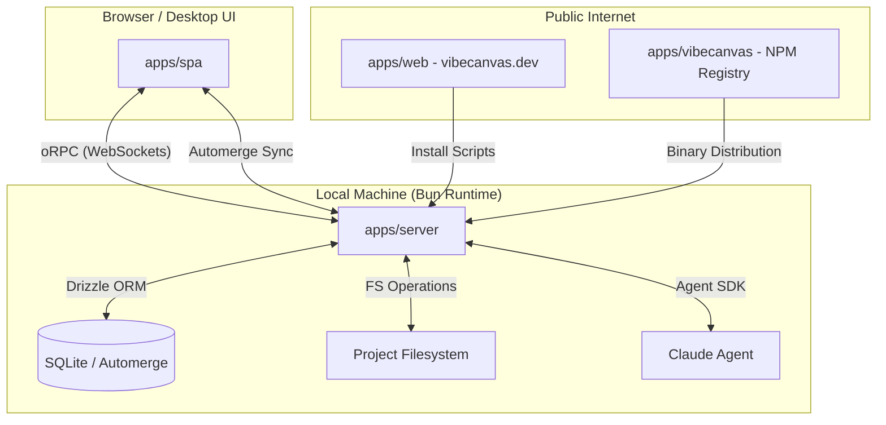

# Apps Big Picture

Vibecanvas is composed of several applications that work together to provide a visual development environment for AI agents. The `apps/` folder contains the deployable units that wire the **Functional Core** to the **Imperative Shell**.

## Application Landscape

```
apps/
├── vibecanvas/ # NPM Distribution Wrapper (CLI entry point)
├── server/     # Orchestration Layer (oRPC, Automerge, Local FS, Agents)
├── spa/        # User Interface (SolidJS + PixiJS Canvas + CRDT Client)
└── web/        # Public Presence (Astro Documentation & Landing Page)
```

## The Big Picture: How they Link

Vibecanvas follows a **Client-Server-CRDT** architecture designed for a local-first, agent-centric experience.

### 1. The Orchestration Layer (`apps/server`)
The server is the "brain" of the local installation. It is a Bun-based application that:
- **Exposes APIs**: Uses **oRPC** over WebSockets for type-safe communication with the SPA.
- **Hosts Automerge**: Provides the `automerge-repo` storage and network bridge, allowing the SPA to sync canvas state to a local SQLite database.
- **Runs Agents**: Interfaces with the **Claude Agent SDK** to spawn and manage AI sessions.
- **Local File Access**: Directly reads/writes to the project filesystem via the `Functional Core`.
- **Static Hosting**: In production, it serves the compiled `SPA` assets.

### 2. The User Interface (`apps/spa`)
The SPA is the primary user environment.
- **Visual Canvas**: Uses **PixiJS** for an infinite, high-performance drawing surface.
- **Local-First Sync**: Uses **Automerge** to maintain a Conflict-free Replicated Data Type (CRDT) of the canvas. It connects to the `server` to persist changes.
- **Reactive UI**: Built with **SolidJS** for fast, granular updates.
- **Unified Interaction**: Combines traditional chat with visual wireframes and file tree manipulation.

### 3. The NPM Entry Point (`apps/vibecanvas`)
This is the package published to NPM. It acts as a shell that:
- Handles **Installation**: Detects the user's platform and ensures the correct Bun binary is available.
- **CLI Proxy**: Forwards commands (like `vibecanvas serve` or `vibecanvas upgrade`) to the `server` implementation.

### 4. The Docs & Landing Page (`apps/web`)
A static **Astro** site hosted at `vibecanvas.dev`.
- **Documentation**: Serves as the source of truth for setup, guides, and FAQ.
- **Landing Page**: Provides the "curl" install scripts and marketing overview.

## Connectivity Diagram



## Common Integration Patterns

- **API Contracts**: All communication between `spa` and `server` is governed by `@vibecanvas/core-contract`.
- **Functional Injection**: Apps build a `TPortal` (dependency object) and pass it to `@vibecanvas/core` controllers.
- **Local-First**: The SPA can function partially even if the WebSocket is briefly disconnected, thanks to Automerge and IndexedDB, but relies on the server for system-level actions (AI, File system).
