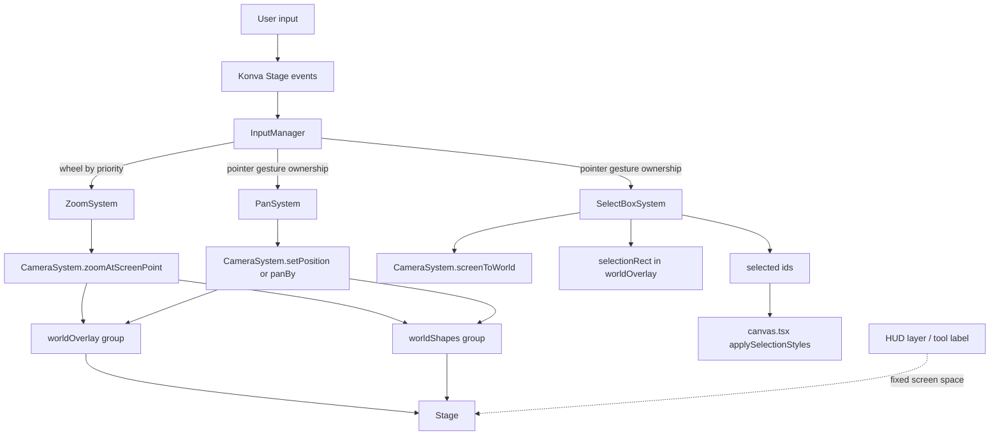

# Canvas Feature Spec (Frontend / Konva)

## Table of Contents

1. [Overview](#overview)
2. [Current Scope](#current-scope)
3. [Core Architecture](#core-architecture)
4. [Event and Input Model](#event-and-input-model)
5. [Camera and Coordinate Spaces](#camera-and-coordinate-spaces)
6. [How Selection Works](#how-selection-works)
7. [How Pan and Zoom Work](#how-pan-and-zoom-work)
8. [How to Modify the Canvas Safely](#how-to-modify-the-canvas-safely)
9. [File Index](#file-index)
10. [Data Flow](#data-flow)

## Overview

The current `apps/frontend` canvas is a Konva-based interaction sandbox with a small but intentional architecture:

- `Canvas.tsx` bootstraps the Konva stage and wires layers, demo shapes, camera, and input systems.
- `Canvas.tsx` bootstraps the Konva stage and wires grid, world layers, camera, and input systems.
- `InputManager` owns event routing and ensures only one pointer gesture system is active at a time.
- `CameraSystem` owns world transform state (`x`, `y`, `scale`) and applies it to world groups.
- Input systems like pan, select-box, and zoom are small modules that mutate camera state or transient overlay state.

The important idea: the canvas is already split into runtime concerns, so new behaviors should be added as new input systems or services instead of putting more conditionals directly into `canvas.tsx`.

## Current Scope

Today the frontend canvas supports:

- a Konva stage mounted inside `apps/frontend/src/feature/canvas/components/canvas.tsx`
- world-space demo shapes rendered inside a transformable world group
- a screen-space grid layer that redraws from camera state so panning/zooming still feels spatial
- marquee selection with a dashed selection rectangle
- drag-to-pan using middle mouse, `Space`, or `hand` tool
- touchpad/two-finger panning via wheel events
- `ctrl+wheel` zoom around the pointer
- active tool display from `store.activeTool`

Current limitations:

- shapes are still demo nodes, not Automerge-backed canvas elements
- the canvas currently has no persistent shapes rendered yet
- there is no drag-selection/move system yet
- there is no resize/rotate/draw-shape system yet
- zoom percent and camera state are not surfaced in UI beyond internal runtime state

## Core Architecture

The current canvas is divided into 4 layers of responsibility.

### 1. Stage Bootstrap

`apps/frontend/src/feature/canvas/components/canvas.tsx`

This file currently:

- creates the Konva `Stage`
- creates three layers:
- creates four layers:
  - grid layer
  - shapes layer
  - overlay layer
  - HUD layer
- creates two world groups:
  - `worldShapes`
  - `worldOverlay`
- registers those world groups with the camera
- creates and registers input systems

Screen-fixed UI like tool labels belongs in the HUD layer.
World-space visuals like shapes and selection rect belong in world groups managed by the camera.
The grid is the special case: it stays on its own screen-space layer, but redraws from camera state so it visually tracks camera movement.

### 2. Camera

`apps/frontend/src/feature/canvas/service/camera-system.ts`

The camera is the source of truth for viewport transform.

It stores:

- `x`
- `y`
- `scale`

It does not listen to user input directly. It only:

- registers world nodes that should move/scale together
- applies transform updates to those nodes
- converts coordinates between screen space and world space

### 3. Input Router

`apps/frontend/src/feature/canvas/service/input-manager.ts`

The input manager owns raw event routing.

It listens to Konva stage events and keyboard events once, then forwards them to input systems.

Important behavior:

- pointer gestures are exclusive: one system owns a drag at a time
- wheel and keyboard events can fall through by priority
- higher-priority systems get first chance to handle events
- `true` from `onWheel` / `onKeyDown` / `onKeyUp` means handled, stop routing
- `false` or `undefined` means let lower-priority systems try

### 4. Input Systems

Current input systems live in `apps/frontend/src/feature/canvas/service/`:

- `pan-system.ts`
- `select-box-system.ts`
- `zoom-system.ts`
- `grid-renderer.ts`

Each one is small and focused. This is the main extension point for future canvas behavior.

## Event and Input Model

The event model is intentionally split by gesture type.

### Pointer Gestures

Handled through:

- `canStart()`
- `onStart()`
- `onMove()`
- `onEnd()`
- `onCancel()`

Flow:

1. `InputManager` receives pointer down from Konva.
2. Systems are checked in priority order.
3. First system whose `canStart()` matches becomes the active system.
4. Only that system receives move/end/cancel events until gesture finishes.

This is what prevents select-box and pan from both trying to own the same drag.

### Wheel and Keyboard

These are not exclusive in the same way.

Flow:

1. Manager tries active system first.
2. If not handled, manager tries registered systems by priority.
3. First system returning `true` claims the event.

Current example:

- `ZoomSystem` handles `ctrl+wheel`
- `PanSystem` handles plain wheel/two-finger touchpad movement

## Camera and Coordinate Spaces

There are two coordinate spaces in the current canvas.

### Screen Space

- raw pointer positions from Konva stage
- HUD text / fixed overlays
- wheel anchor position for zoom input

### World Space

- actual shapes
- selection marquee rectangle
- future drag/move/resize geometry

The camera translates between them.

Important rule:

- if a visual element moves with the canvas, treat it as world space
- if a visual element stays pinned to the viewport, treat it as screen space

This is why the selection rectangle is inside `worldOverlay`, not the HUD layer.
The grid does not live in world space, but it still uses camera `x/y/scale` to compute line offsets and spacing.

## How Selection Works

Selection is implemented by `apps/frontend/src/feature/canvas/service/select-box-system.ts`.

Flow:

1. System starts only when active tool is `select` and pointerdown hits empty stage.
2. Start pointer is converted from screen space to world space with `camera.screenToWorld()`.
3. The selection rectangle is drawn in world coordinates.
4. On move, current pointer is also converted to world coordinates.
5. The system updates `selectionRect` bounds and intersects it with selectable nodes.
6. Selected ids are pushed back into `canvas.tsx`, which updates visual highlight styles.

Important implication:

- any future drag/move/resize system should also operate in world space, not raw stage coordinates

## How Pan and Zoom Work

### Pan

`apps/frontend/src/feature/canvas/service/pan-system.ts`

Pan does not move the stage directly.
It updates camera position.

Supported pan inputs:

- middle mouse drag
- `Space` + drag
- `hand` tool + drag
- two-finger touchpad wheel scroll

For drag panning:

- system stores start pointer and start camera position
- move delta is added to camera position

For touchpad panning:

- wheel delta is converted into `camera.panBy(...)`

### Zoom

`apps/frontend/src/feature/canvas/service/zoom-system.ts`

Zoom handles `ctrl+wheel`.

It:

- reads current pointer position in screen space
- computes next clamped scale
- calls `camera.zoomAtScreenPoint(...)`

`zoomAtScreenPoint(...)` keeps the world point under the pointer stable while scale changes. That is the reason zoom feels anchored instead of jumping.

## How to Modify the Canvas Safely

Use these rules when changing the canvas.

### Add a New Interaction

Preferred path:

1. create a new input system in `apps/frontend/src/feature/canvas/service/`
2. add any new shared runtime dependencies to `input-systems.types.ts`
3. register the system in `canvas.tsx`
4. choose a clear priority relative to existing systems

Do not add large tool-specific conditionals directly into `InputManager`.

### Add a New World Overlay

If the overlay should move with panning/zooming:

- add it under `worldOverlay`
- use world coordinates
- convert pointer positions with camera helpers when needed

If it should stay pinned to viewport:

- add it to HUD layer or DOM outside Konva world groups

If it should look world-aware but stay cheap to render:

- keep it on a screen-space layer
- redraw it from camera state like the current grid

### Add New Shapes

If a shape should participate in selection:

- add it to the selectable node list in `canvas.tsx`
- ensure it has a stable `id()`

Future direction is to replace demo shapes with document-backed nodes, but the selection contract remains the same.

### Add Keyboard or Wheel Shortcuts

Implement them inside an input system.

Use the fallthrough rule:

- return `true` if the system handled the event
- return `false` if another lower-priority system should still get a chance

### Change Pan/Zoom Behavior

Do it in `CameraSystem`, `PanSystem`, or `ZoomSystem` first.

Avoid:

- directly mutating stage transform for world movement
- mixing screen-space and world-space math in `canvas.tsx`

## File Index

### Main Entry

- `apps/frontend/src/feature/canvas/components/canvas.tsx`

### Services

- `apps/frontend/src/feature/canvas/service/input-manager.ts`
- `apps/frontend/src/feature/canvas/service/camera-system.ts`
- `apps/frontend/src/feature/canvas/service/grid-renderer.ts`
- `apps/frontend/src/feature/canvas/service/input-systems.types.ts`
- `apps/frontend/src/feature/canvas/service/pan-system.ts`
- `apps/frontend/src/feature/canvas/service/select-box-system.ts`
- `apps/frontend/src/feature/canvas/service/zoom-system.ts`

### Related State

- `apps/frontend/src/store.ts`
- `apps/frontend/src/feature/floating-canvas-toolbar/components/FloatingCanvasToolbar.tsx`
- `apps/frontend/src/feature/floating-canvas-toolbar/types/toolbar.types.ts`

## Data Flow

