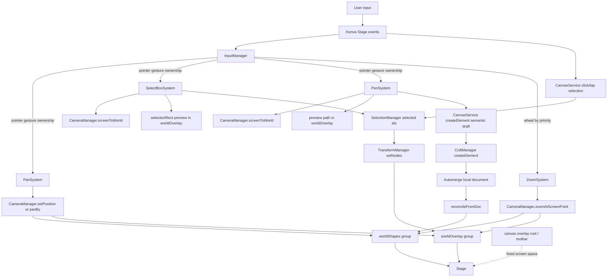

# Canvas Feature Spec (Frontend / Konva)

## Table of Contents

1. [Overview](#overview)
2. [Current Scope](#current-scope)
3. [Core Architecture](#core-architecture)
4. [Event and Input Model](#event-and-input-model)
5. [Camera and Coordinate Spaces](#camera-and-coordinate-spaces)
6. [How Selection Works](#how-selection-works)
7. [How Pan and Zoom Work](#how-pan-and-zoom-work)
8. [How to Modify the Canvas Safely](#how-to-modify-the-canvas-safely)
9. [File Index](#file-index)
10. [Data Flow](#data-flow)

## Overview

The current `apps/frontend` canvas is a Konva-based interaction sandbox with a small but intentional architecture:

- `Canvas.tsx` is only a thin Solid wrapper that mounts and destroys `CanvasService`.
- `CanvasService` is the high-level entry point. It owns Konva lifecycle, shared context, managers, and systems.
- managers are controllers for shared canvas runtime concerns such as camera and input routing.
- systems are classes that handle a concrete canvas module: they react to input and may also own runtime visuals for that module.
- systems may also own canvas-local HTML/JSX overlays rendered into a service-owned overlay root.
- utils contain helper functions with little or no risky side effects.

The important idea: the canvas is already split into runtime concerns, so new behaviors should be added as new input systems or services instead of putting more conditionals directly into `canvas.tsx`.

## Current Scope

Today the frontend canvas supports:

- a Konva stage owned by `apps/frontend/src/feature/canvas/service/canvas.service.ts`
- a canvas-local HTML overlay root owned by `apps/frontend/src/feature/canvas/service/canvas.service.ts`
- world-space content rendered inside transformable world groups
- a screen-space grid layer that redraws from camera state so panning/zooming still feels spatial
- marquee selection with a dashed selection rectangle owned by `SelectBoxSystem`
- click/tap selection and empty-stage clear handled by `CanvasService`
- shared selected-id state owned by `SelectionManager`
- a shared blue `Konva.Transformer` owned by `TransformManager`
- shift/cmd/ctrl click multi-select for selectable persistent nodes
- freehand pen strokes rendered with `perfect-freehand`, with local preview during drag and CRDT-backed persistence on commit
- drag-to-pan using middle mouse, `Space`, or `hand` tool
- touchpad/two-finger panning via wheel events
- `ctrl+wheel` zoom around the pointer
- a canvas-local toolbar rendered by `ToolSystem`

Current limitations:

- the canvas currently persists pen strokes only; other shape types are not rendered yet
- transform handles are visible for selected pen nodes, but transform changes are not persisted yet
- there is no drag-selection/move persistence system yet
- there is no resize/rotate persistence yet for document elements
- zoom percent and camera state are not surfaced in UI beyond internal runtime state
- only sidebar visibility remains global; tool and grid state are canvas-local

## Core Architecture

The current canvas is divided into 4 layers of responsibility.

### 1. Service

`apps/frontend/src/feature/canvas/service/canvas.service.ts`

This service currently:

- creates DOM roots for Konva and canvas-local overlays
- creates the Konva `Stage`
- creates three layers:
  - grid layer
  - shapes layer
  - overlay layer
- creates two world groups:
  - `worldShapes`
  - `worldOverlay`
- registers those world groups with the camera
- creates managers and registers systems
- owns resize observation and canvas cleanup
- owns canvas-local state such as active tool and grid visibility
- exposes a runtime API to systems through context
- mounts transient preview nodes into `worldOverlay`
- delegates semantic element persistence into `CrdtManager`
- handles Konva click/tap selection routing
- resolves selectable nodes from persistent scene nodes in `worldShapes`

Screen-fixed UI like toolbars belongs in the DOM overlay root.
World-space visuals like shapes and selection rect belong in world groups managed by the camera.
The grid is the special case: it stays on its own screen-space layer, but redraws from camera state so it visually tracks camera movement.

`apps/frontend/src/feature/canvas/components/canvas.tsx` should stay thin and only:

- mount `CanvasService`
- pass only truly global integrations into it (currently sidebar visibility)
- destroy it on cleanup

### 2. Managers

Current managers live in `apps/frontend/src/feature/canvas/managers/`.

#### Camera Manager

`apps/frontend/src/feature/canvas/managers/camera.manager.ts`

The camera is the source of truth for viewport transform.

It stores:

- `x`
- `y`
- `scale`

It does not listen to user input directly. It only:

- registers world nodes that should move/scale together
- applies transform updates to those nodes
- converts coordinates between screen space and world space

#### Input Manager

`apps/frontend/src/feature/canvas/managers/input.manager.ts`

The input manager owns raw event routing.

It listens to Konva stage events and keyboard events once, then forwards them to input systems.

Important behavior:

- pointer gestures are exclusive: one system owns a drag at a time
- wheel and keyboard events can fall through by priority
- higher-priority systems get first chance to handle events
- `true` from `onWheel` / `onKeyDown` / `onKeyUp` means handled, stop routing
- `false` or `undefined` means let lower-priority systems try

#### CRDT Manager

`apps/frontend/src/feature/canvas/managers/crdt.manager.ts`

The CRDT manager owns document persistence and document-to-Konva reconciliation.

It currently:

- accepts semantic element drafts from `CanvasService`
- writes those drafts into the local Automerge document
- listens for document change events
- reconciles persistent pen elements from document state into `worldShapes`
- marks persistent pen nodes with canvas runtime metadata such as selectable/transformable flags

#### Selection Manager

`apps/frontend/src/feature/canvas/managers/selection.manager.ts`

The selection manager owns shared selection state only.

It currently:

- stores selected node ids
- supports `clear()`, `selectOnly()`, `setSelectedIds()`, and `isSelected()`
- supports pruning selected ids against the currently available scene nodes
- notifies runtime subscribers when selection changes

It does not own transformer UI or persistent node lifecycle.

#### Transform Manager

`apps/frontend/src/feature/canvas/managers/transform.manager.ts`

The transform manager owns the shared `Konva.Transformer` visual.

It currently:

- creates and mounts one blue dashed `Konva.Transformer` into `worldOverlay`
- attaches that transformer to the currently selected transformable nodes
- exposes hooks for `transformstart`, `transform`, and `transformend`
- keeps transform UI separate from selection state and CRDT persistence

### 3. Systems

Current systems live in `apps/frontend/src/feature/canvas/systems/`:

- `pan.system.ts`
- `pen.system.ts`
- `select-box.system.ts`
- `zoom.system.ts`
- `system.abstract.ts`

Each system should own one module/part of the canvas.

A system is expected to have:

- input handling fields/hooks
- optional root-level runtime lifecycle hooks: `mount()`, `update()`, `unmount()`
- internal state if needed

`system.abstract.ts` is the base shape for class-based systems.

`CanvasService` uses systems in two ways:

- input hooks are adapted into `InputManager`
- lifecycle hooks are called directly by `CanvasService` through `mount`, `update`, and `unmount`

Systems should own transient module-local visuals themselves. For example:

- `PenSystem` owns its preview `Konva.Path`
- `SelectBoxSystem` owns its selection marquee `Konva.Rect`
- `ToolSystem` owns the floating toolbar rendered through Solid's `render()` into the canvas overlay root

Persistent document-backed visuals are still derived from CRDT state by `CrdtManager`, not passed around as raw `Konva.Node` source-of-truth objects.

### 4. Utils

Helpers live in `apps/frontend/src/feature/canvas/utils/`.

Current examples:

- `canvas-debug.ts`
- `grid-renderer.ts`
- `stroke-renderer.ts`

These should stay low-risk and focused on helper work rather than owning runtime lifecycle.

## Event and Input Model

The event model is intentionally split by gesture type.

### Pointer Gestures

Handled through:

- `canStart()`
- `onStart()`
- `onMove()`
- `onEnd()`
- `onCancel()`

Flow:

1. `InputManager` receives pointer down from Konva.
2. Systems are checked in priority order.
3. First system whose `canStart()` matches becomes the active system.
4. Only that system receives move/end/cancel events until gesture finishes.

This is what prevents select-box and pan from both trying to own the same drag.

### Wheel and Keyboard

These are not exclusive in the same way.

Flow:

1. Manager tries active system first.
2. If not handled, manager tries registered systems by priority.
3. First system returning `true` claims the event.

Current example:

- `ZoomSystem` handles `ctrl+wheel`
- `PanSystem` handles plain wheel/two-finger touchpad movement
- `PenSystem` claims pointer gestures only when active tool is `pen`
- `ToolSystem` owns keyboard shortcuts, local tool state, and toolbar overlay rendering

## Camera and Coordinate Spaces

There are two coordinate spaces in the current canvas.

### Screen Space

- raw pointer positions from Konva stage
- HUD text / fixed overlays
- wheel anchor position for zoom input

### World Space

- actual shapes
- selection marquee rectangle
- future drag/move/resize geometry

The camera translates between them.

Important rule:

- if a visual element moves with the canvas, treat it as world space
- if a visual element stays pinned to the viewport, treat it as screen space

This is why the selection rectangle is inside `worldOverlay`, not the HUD layer.
The grid does not live in world space, but it still uses camera `x/y/scale` to compute line offsets and spacing.

## How Selection Works

Selection is split between `CanvasService`, `SelectionManager`, `SelectBoxSystem`, and `TransformManager`.

Flow:

1. `CanvasService` handles Konva `click` / `tap` events for empty-stage clear and node click selection.
2. `SelectionManager` is the shared source of truth for selected ids.
3. `SelectBoxSystem` starts only when active tool is `select` and pointerdown hits empty stage.
4. Start pointer is converted from screen space to world space with `camera.screenToWorld()`.
5. `SelectBoxSystem` updates its own `Konva.Rect` preview node in world coordinates.
6. On move, current pointer is also converted to world coordinates.
7. The system updates the marquee bounds and intersects it with selectable nodes from `CanvasService`.
8. `SelectionManager` updates selected ids.
9. `TransformManager` reacts to selected ids and shows a shared blue transformer box for transformable nodes.

Important implication:

- any future drag/move/resize system should also operate in world space, not raw stage coordinates
- selection state and transform visuals are separate concerns

## How Pan and Zoom Work

### Pan

`apps/frontend/src/feature/canvas/systems/pan.system.ts`

Pan does not move the stage directly.
It updates camera position.

Supported pan inputs:

- middle mouse drag
- `Space` + drag
- `hand` tool + drag
- two-finger touchpad wheel scroll

For drag panning:

- system stores start pointer and start camera position
- move delta is added to camera position

For touchpad panning:

- wheel delta is converted into `camera.panBy(...)`

### Zoom

`apps/frontend/src/feature/canvas/systems/zoom.system.ts`

Zoom handles `ctrl+wheel`.

It:

- reads current pointer position in screen space
- computes next clamped scale
- calls `camera.zoomAtScreenPoint(...)`

`zoomAtScreenPoint(...)` keeps the world point under the pointer stable while scale changes. That is the reason zoom feels anchored instead of jumping.

## How Pen Works

Pen is implemented by `apps/frontend/src/feature/canvas/systems/pen.system.ts` and `apps/frontend/src/feature/canvas/utils/stroke-renderer.ts`.

Flow:

1. Active tool is `pen`.
2. Pointer positions are converted from screen space to world space through the camera.
3. `PenSystem` collects raw world points locally during drag.
4. `utils/stroke-renderer.ts` passes those points into `perfect-freehand` and turns the outline into SVG path data.
5. `PenSystem` owns a transient preview `Konva.Path` mounted in `worldOverlay` while drawing.
6. On pointer up, `PenSystem` serializes the stroke into semantic pen data and calls `CanvasService.createElement(...)`.
7. `CanvasService` delegates that semantic draft to `CrdtManager.createElement(...)`.
8. `CrdtManager` writes the new element into the local Automerge document.
9. The local Automerge change event triggers reconcile, and `CrdtManager` creates or updates the persistent `Konva.Path` in `worldShapes`.

Important rule:

- local runtime stores raw points only during the gesture
- persistence should pass semantic document payloads through `CanvasService`, not raw `Konva.Node` instances
- the right persisted model is raw points + style, not only the final SVG path

## How to Modify the Canvas Safely

Use these rules when changing the canvas.

### Add a New Interaction

Preferred path:

1. create a new system in `apps/frontend/src/feature/canvas/systems/`
2. add any new shared runtime dependencies to `types/canvas-context.types.ts`
3. register the system in `service/canvas.service.ts`
4. choose a clear priority relative to existing systems

Do not add large tool-specific conditionals directly into `InputManager`.
Do not move Konva object ownership back into the Solid component.

When a concern is shared orchestration rather than a canvas module, prefer a manager over a system.
When a concern owns canvas-local HTML UI, render it from the owning system via the overlay root rather than from page-level Solid JSX.
When a concern owns a transient world-space visual, let the system create its preview `Konva.Node` and mount it through `CanvasService`.
When committing persistent state, pass semantic data into `CanvasService`, then let a manager like `CrdtManager` persist and reconcile it.
When a concern owns shared transform UI, prefer a dedicated manager like `TransformManager` instead of mixing that logic into selection state.

### Add a New World Overlay

If the overlay should move with panning/zooming:

- add it under `worldOverlay`
- use world coordinates
- convert pointer positions with camera helpers when needed

If it should stay pinned to viewport:

- add it to HUD layer or DOM outside Konva world groups

If it should look world-aware but stay cheap to render:

- keep it on a screen-space layer
- redraw it from camera state like the current grid

### Add New Shapes

If a shape should participate in selection:

- mark the persistent node as selectable when reconciling it into `worldShapes`
- ensure it has a stable `id()`

If a shape should show transform handles:

- mark the node as transformable
- let `TransformManager` attach the shared transformer when that node is selected
- keep transformer UI separate from document persistence

For transient drawing previews:

- let the owning system create the preview node
- mount it via `mountPreviewNode(...)`
- clean it up in `unmount()` or gesture cancel/end

For persistent shapes:

- serialize the shape into semantic document data
- call `createElement(...)` from the system
- let `CrdtManager` turn the document element back into a persistent Konva node

The selection contract remains the same: persistent Konva nodes need stable ids and must be registered as selectable.

### Add Keyboard or Wheel Shortcuts

Implement them inside an input system.

Use the fallthrough rule:

- return `true` if the system handled the event
- return `false` if another lower-priority system should still get a chance

### Change Pan/Zoom Behavior

Do it in the camera manager or the relevant pan/zoom system first.

Avoid:

- directly mutating stage transform for world movement
- mixing screen-space and world-space math in `canvas.tsx`

## File Index

### Main Entry

- `apps/frontend/src/feature/canvas/components/canvas.tsx`

### Services

- `apps/frontend/src/feature/canvas/service/canvas.service.ts`

### Managers

- `apps/frontend/src/feature/canvas/managers/input.manager.ts`
- `apps/frontend/src/feature/canvas/managers/camera.manager.ts`
- `apps/frontend/src/feature/canvas/managers/crdt.manager.ts`
- `apps/frontend/src/feature/canvas/managers/selection.manager.ts`
- `apps/frontend/src/feature/canvas/managers/transform.manager.ts`

### Systems

- `apps/frontend/src/feature/canvas/systems/system.abstract.ts`
- `apps/frontend/src/feature/canvas/systems/pen.system.ts`
- `apps/frontend/src/feature/canvas/systems/pan.system.ts`
- `apps/frontend/src/feature/canvas/systems/select-box.system.ts`
- `apps/frontend/src/feature/canvas/systems/tool.system.ts`
- `apps/frontend/src/feature/canvas/systems/zoom.system.ts`

### Utils

- `apps/frontend/src/feature/canvas/utils/canvas-debug.ts`
- `apps/frontend/src/feature/canvas/utils/grid-renderer.ts`
- `apps/frontend/src/feature/canvas/utils/stroke-renderer.ts`

### Types

- `apps/frontend/src/feature/canvas/types/canvas-context.types.ts`

### Related State

- `apps/frontend/src/store.ts`
- `apps/frontend/src/feature/canvas/components/FloatingCanvasToolbar.tsx`
- `apps/frontend/src/feature/canvas/components/toolbar.types.ts`

## Data Flow

