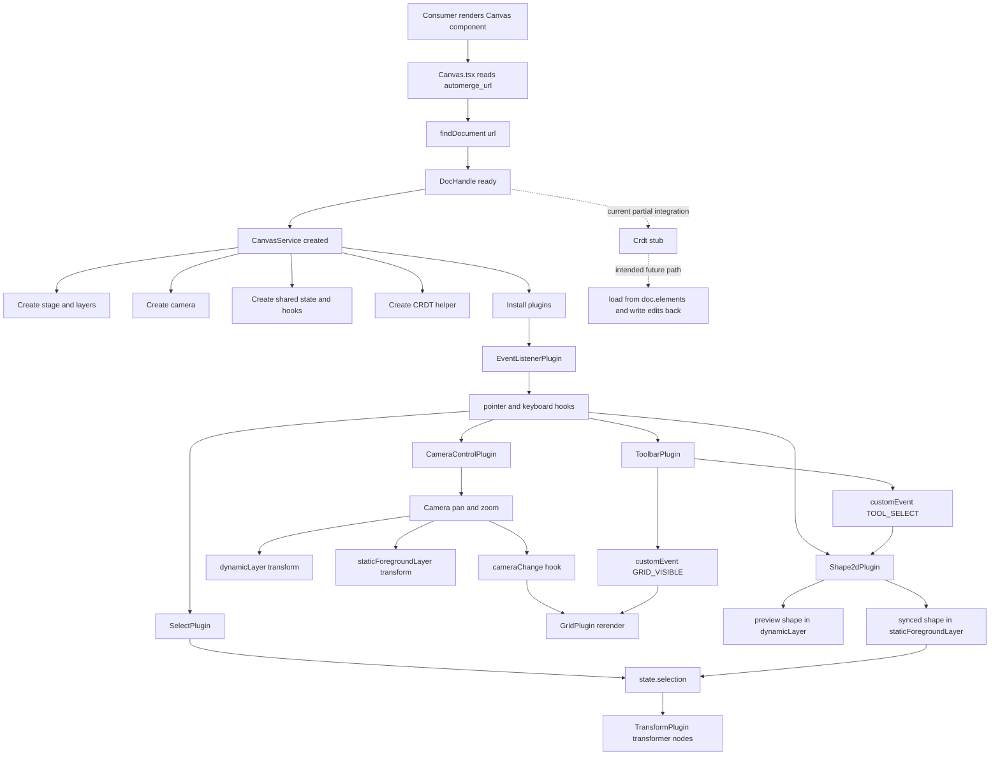

# Canvas Package Spec (`@vibecanvas/canvas`)

## Table of Contents

1. [Overview](#overview)
2. [What the Package Is Today](#what-the-package-is-today)
3. [Design Principles](#design-principles)
4. [Architecture](#architecture)
5. [Runtime Layers](#runtime-layers)
6. [Plugin System](#plugin-system)
7. [Input and Event Flow](#input-and-event-flow)
8. [Camera and Coordinate Spaces](#camera-and-coordinate-spaces)
9. [Selection and Transform Behavior](#selection-and-transform-behavior)
10. [Shape Creation and Scene Behavior](#shape-creation-and-scene-behavior)
11. [Automerge and CRDT Role](#automerge-and-crdt-role)
12. [How to Extend the Package](#how-to-extend-the-package)
13. [Current Gaps and WIP Areas](#current-gaps-and-wip-areas)
14. [File Index](#file-index)
15. [Data Flow](#data-flow)

## Overview

`@vibecanvas/canvas` is a reusable canvas runtime package built around:

- Konva for canvas rendering
- SolidJS for DOM overlays
- a small hook-based plugin system for behavior composition
- Automerge document lookup as the startup source for a canvas session

The package should be understood as a plugin-driven canvas shell, not yet a full document-driven editor.

The most important idea is separation of responsibilities:

- `Canvas.tsx` handles app-facing lifecycle and async document loading.
- `CanvasService` owns the Konva runtime, shared state, layers, and plugin context.
- plugins own features such as event wiring, grid rendering, camera control, toolbar UI, selection, transforms, and shape behaviors.
- `Camera` owns viewport math and applies transforms, but does not decide input policy.
- Automerge currently boots the session and exposes the document handle, but is not yet the live rendering source of truth.

## What the Package Is Today

Today this package already provides:

- a public `Canvas` component exported from `packages/canvas/src/index.ts`
- async Automerge document discovery from a backend canvas row
- a Konva stage with three layers
- a split between screen-space layers and world-space layers
- plugin-owned behavior via shared hooks
- wheel pan and pointer-anchored zoom
- a viewport-aware grid that redraws from camera state
- a plugin-owned Solid toolbar overlay
- selection rectangle and shared transform handles
- rectangle preview creation and basic drag/transform behavior for synced shapes
- a demo scene plugin that mounts example rectangles

Important constraint:

- the runtime is only partially connected to the CRDT document; most visible scene behavior is still local/demo behavior rather than fully loaded from `TCanvasDoc`

## Design Principles

### 1. Keep the host component thin

`packages/canvas/src/components/Canvas.tsx` should stay focused on:

- reading `canvas.automerge_url`
- resolving the `DocHandle`
- creating and destroying `CanvasService`
- surfacing loading/error UI to the caller

It should not accumulate feature logic.

### 2. Put shared runtime concerns in `CanvasService`

`CanvasService` is the runtime kernel. If something is shared across multiple features, it belongs here or in the plugin context, not inside one feature plugin.

Examples:

- stage creation
- layer creation
- camera construction
- runtime store
- hook channels
- resize observation
- plugin installation order

### 3. Put feature behavior in plugins

Feature logic should be composed by plugins instead of hardcoded into `CanvasService`.

Examples:

- event bridging
- camera interaction
- grid rendering
- toolbar overlay
- selection logic
- transform visuals
- shape-specific creation behavior

### 4. Treat viewport math as a first-class concern

The camera is the source of truth for pan and zoom state.

- input plugins decide when to pan/zoom
- `Camera` decides how transforms are applied
- screen-space and world-space visuals should not be mixed casually

### 5. Prefer hooks and custom events over direct cross-plugin coupling

Plugins communicate through shared hook channels and `customEvent` messages.

Current examples:

- toolbar emits `CustomEvents.TOOL_SELECT`
- toolbar emits `CustomEvents.GRID_VISIBLE`
- grid listens for grid visibility changes
- shape plugin listens for tool selection changes

### 6. Keep Automerge integration behind an explicit boundary

Automerge is already present, but document-driven rendering is incomplete.

That means new work should respect the current direction:

- do not bypass the document model with ad-hoc global state
- do not treat the demo scene as the final architecture
- connect future scene loading/saving through `DocHandle`, `Crdt`, and `TCanvasDoc`

## Architecture

The current architecture is best described in four layers:

1. `Canvas.tsx` - app-facing host and lifecycle bridge
2. `CanvasService` - runtime kernel
3. plugins - modular behavior units
4. Automerge services - document bootstrap and persistence plumbing

High-level flow:

```text
Consumer renders <Canvas />
  -> Canvas resolves Automerge DocHandle from canvas.automerge_url
  -> Canvas constructs CanvasService(container, onToggleSidebar, docHandle)
  -> CanvasService creates stage, layers, camera, state, hooks, CRDT helper
  -> CanvasService installs plugins
  -> EventListenerPlugin republishes raw events into hook channels
  -> feature plugins react and update Konva/DOM runtime state
```

## Runtime Layers

`packages/canvas/src/services/canvas/Canvas.service.ts` creates three Konva layers:

- `staticBackgroundLayer`
- `staticForegroundLayer`
- `dynamicLayer`

These layers are intentional and form the rendering contract.

### `staticBackgroundLayer`

Use this for screen-space background visuals that should not be moved by the camera transform.

Current usage:

- grid rendering

The grid still reacts to camera state, but it is recomputed rather than moved as world geometry.

### `staticForegroundLayer`

Use this for foreground content that should visually follow camera transforms but stay logically separate from the main world layer.

Current usage:

- synced/selectable shapes added by `Shape2dPlugin.syncShape()`

Important detail: `Camera` applies position and scale to both `dynamicLayer` and `staticForegroundLayer`.

### `dynamicLayer`

Use this for world-space runtime visuals and interaction helpers.

Current usage:

- selection rectangle
- transformer
- shape preview while drawing
- clone-drag temporary shapes

### Why the split matters

The key mental model is:

- some visuals are derived from the viewport and should be redrawn in screen space
- some visuals are part of the interactive world and should move with pan/zoom
- some transient interaction helpers belong in the same transformed space as content

If you blur those roles, pan/zoom, selection, and future CRDT reconciliation become much harder to reason about.

## Plugin System

Plugins are defined by `packages/canvas/src/plugins/interface.ts`.

Each plugin receives an `IPluginContext` containing:

- `stage`
- `staticBackgroundLayer`
- `staticForegroundLayer`
- `dynamicLayer`
- `camera`
- `state`
- `setState`
- `hooks`

### Installed plugins

`CanvasService` currently installs plugins in this order:

1. `EventListenerPlugin`
2. `GridPlugin`
3. `CameraControlPlugin`
4. `ToolbarPlugin`
5. `SelectPlugin`
6. `TransformPlugin`
7. `Shape2dPlugin`
8. `ExampleScenePlugin`

That order matters because earlier plugins often establish infrastructure that later plugins depend on.

### Hook types

The plugin runtime uses lightweight tapable-style hooks from `packages/canvas/src/tapable/`.

Current hook families include:

- lifecycle: `init`, `initAsync`, `destroy`, `resize`
- pointer: `pointerDown`, `pointerMove`, `pointerUp`, `pointerOut`, `pointerOver`, `pointerCancel`, `pointerWheel`
- keyboard: `keydown`, `keyup`
- runtime: `cameraChange`, `modeChange`, `customEvent`

Hook behavior is simple:

- `SyncHook` broadcasts to all listeners
- `AsyncParallelHook` waits for async plugin work during startup
- `SyncExitHook` supports early exits / return-aware event handling for custom events

### Plugin inventory

#### `EventListenerPlugin`

Bridges raw Konva stage and DOM keyboard events into hook calls.

- listens to stage pointer and wheel events
- listens to keyboard events on the stage container
- makes the stage container focusable
- cleans up listeners on destroy

This is the single raw event bridge. Other plugins should usually consume hooks, not register duplicate root listeners.

#### `CameraControlPlugin`

Owns wheel-based viewport control.

- `ctrl+wheel` zooms around the pointer
- plain wheel pans by delta
- emits `cameraChange` after camera updates

#### `GridPlugin`

Owns the background grid.

- renders into `staticBackgroundLayer`
- computes spacing from camera zoom
- computes offsets from camera position
- rerenders on `cameraChange`
- toggles visibility from `CustomEvents.GRID_VISIBLE`

#### `ToolbarPlugin`

Owns the floating DOM toolbar.

- mounts a Solid component into an absolutely positioned DOM node attached to the stage container
- tracks active tool locally
- tracks grid visibility locally
- maps tool selection into runtime `CanvasMode`
- updates cursor style from runtime mode
- supports keyboard shortcuts and temporary `Space` hand mode
- emits custom events to inform other plugins

This is the main example of plugin-owned DOM overlay UI.

#### `SelectPlugin`

Owns marquee selection.

- creates a dashed translucent `Konva.Rect`
- only operates while canvas mode is `SELECT`
- starts marquee only when pointerdown hits the stage itself
- uses `dynamicLayer.getRelativePointerPosition()` for world-relative coordinates
- collects intersecting top-level nodes from `staticForegroundLayer`
- writes selected nodes into shared runtime state

#### `TransformPlugin`

Owns the shared `Konva.Transformer`.

- mounts one transformer into `dynamicLayer`
- reacts to shared `state.selection`
- blocks bubbling from transformer click/pointerdown

This keeps transform UI separate from selection logic.

#### `Shape2dPlugin`

Owns 2D shape preview and interaction glue.

Currently it:

- listens for active tool changes through `CustomEvents.TOOL_SELECT`
- starts rectangle preview creation while mode is `DRAW_CREATE`
- updates preview size on pointer move
- commits by converting back to `select` mode and syncing the created shape into the scene
- supports click selection on shapes
- supports shift-multiselect behavior through selection array updates
- supports `alt+drag` clone-drag for synced shapes
- mirrors drag and transform updates into a shape's `backendData` attribute

Important limitation:

- it updates local `backendData`, but does not yet persist those edits back into the Automerge document

#### `ExampleScenePlugin`

Creates demo rectangles and syncs them into the scene at startup.

This is scaffolding, not the intended long-term source of truth.

#### `GroupPlugin`

Exists as a stub but is not currently installed.

This signals the intended direction for first-class group behavior, matching the `groups` collection already present in `TCanvasDoc`.

## Input and Event Flow

Input flow is intentionally centralized.

### Raw event path

```text
Konva stage / stage container
  -> EventListenerPlugin
  -> plugin hooks
  -> feature plugins react
```

### Pointer flow

Current pointer interactions are cooperative rather than managed by a strict exclusive input command system.

Today:

- plugins independently tap pointer hooks
- plugins self-check runtime mode and event target before acting
- `Canvas.input.ts` exists but is empty, so there is no centralized gesture ownership system yet

This is an important WIP area. When interactions become more complex, a more explicit ownership/routing model will likely be needed.

### Keyboard flow

Keyboard events are currently handled mainly by `ToolbarPlugin`.

Supported behaviors include:

- `Space` hold for temporary hand mode
- `Cmd/Ctrl+B` sidebar toggle
- tool shortcuts from `toolbar.types.ts`
- `g` to toggle grid
- `Escape` to switch back to `select`

### Custom event flow

Plugins also communicate through typed custom events:

- `GRID_VISIBLE`
- `TOOL_SELECT`

This is the package's current cross-plugin coordination pattern.

## Camera and Coordinate Spaces

`packages/canvas/src/services/canvas/Camera.ts` owns:

- `x`
- `y`
- `zoom`

And exposes:

- `pan(deltaX, deltaY)`
- `zoomAtScreenPoint(scale, screenPoint)`

### What the camera controls

The camera applies transforms to:

- `dynamicLayer`
- `staticForegroundLayer`

It does not transform `staticBackgroundLayer`.

### Coordinate model

There are effectively two spaces in the runtime.

#### Screen space

- stage size
- pointer position from `stage.getPointerPosition()`
- DOM toolbar placement
- grid line placement after viewport derivation

#### World-relative space

- shapes and preview shapes
- selection rectangle
- transformer-attached nodes
- pointer positions obtained from `dynamicLayer.getRelativePointerPosition()`

### Why zoom feels anchored

`zoomAtScreenPoint()` computes the world point under the pointer before changing scale, then adjusts camera position so that same world point stays under the pointer after zoom.

That is the correct pattern for pointer-anchored zoom and should be preserved.

## Selection and Transform Behavior

Selection is shared state, while transform UI is a separate visual concern.

### Selection state

`CanvasService` owns a small Solid store with:

- `mode`
- `theme`
- `selection`

`selection` currently stores actual Konva nodes, not ids.

That makes the current runtime simple, but it also means selection is still local runtime state rather than durable document state.

### Marquee selection flow

1. Canvas mode must be `SELECT`.
2. Pointer down must hit the stage background.
3. `SelectPlugin` shows its selection rectangle in `dynamicLayer`.
4. Pointer movement updates the marquee size in world-relative coordinates.
5. `SelectPlugin` intersects the marquee against top-level nodes in `staticForegroundLayer`.
6. Matching nodes are written into `state.selection`.
7. `TransformPlugin` updates the shared transformer nodes.

### Transform behavior

The transformer is purely runtime UI right now.

- it follows current selection
- it does not own persistence
- shape transform handlers update local `backendData` on the node itself

This means transform visuals work, but persistent document updates are still incomplete.

## Shape Creation and Scene Behavior

The current scene pipeline is partly real and partly scaffolding.

### Rectangle creation flow today

1. Toolbar selects a shape tool such as `rectangle`.
2. `ToolbarPlugin` maps that tool to `CanvasMode.DRAW_CREATE`.
3. `Shape2dPlugin` listens to `pointerDown` and creates a preview rect.
4. `pointerMove` resizes the preview.
5. `pointerUp` clones the preview, destroys the temporary node, and resets the tool back to `select`.
6. `Shape2dPlugin.syncShape()` wires the resulting Konva shape into selection, drag, clone-drag, and transform behavior.
7. The synced shape is added to `staticForegroundLayer`.

### Shape data model

Shapes carry a `backendData` attribute containing a `TElement` from `@vibecanvas/shell/automerge`.

That means the runtime is already aligned with the shared canvas document model, including fields like:

- `id`
- `x`
- `y`
- `angle`
- `zIndex`
- `parentGroupId`
- `data`
- `style`

### Scene loading status

`CanvasService` already has a private `loadCanvas()` method outline and a `Crdt` instance, but they are not yet the main scene pipeline.

So the current visible world is mostly:

- demo scene rectangles from `ExampleScenePlugin`
- locally created rectangles from `Shape2dPlugin`

not a full reconcile of `doc.elements`.

## Automerge and CRDT Role

Automerge bootstrap lives in `packages/canvas/src/services/automerge.ts`.

That service currently handles:

- singleton repo creation
- IndexedDB persistence
- WebSocket sync to `/automerge`
- cached document handles
- loading persisted documents from `localStorage`
- document lookup by `AutomergeUrl`

### Startup flow

`Canvas.tsx` uses `findDocument(url)` to wait for the document handle before constructing the canvas runtime.

### Document shape

The underlying shared document type is `TCanvasDoc` from `packages/imperative-shell/src/automerge/types/canvas-doc.ts`.

Important design choices already present there:

- unified `elements` map for all drawings and widgets
- first-class `groups`
- fractional `zIndex`
- `parentGroupId` for nesting
- a single `TElement` union covering rect, ellipse, diamond, arrow, line, pen, text, image, chat, filetree, terminal, and file

### Current CRDT limitation

`packages/canvas/src/services/canvas/Crdt.ts` is only a stub, and `CanvasService.loadCanvas()` is not yet implemented.

So today:

- the document is loaded
- the runtime can inspect the document
- but the package is not yet reconciling the full scene from `doc.elements`
- drag/transform edits are not yet committed back through CRDT helpers

## How to Extend the Package

Use these rules to keep new work aligned with the current architecture.

### Add a new feature behavior

Preferred path:

1. create a new plugin in `packages/canvas/src/plugins/`
2. use `IPluginContext` instead of reaching into `CanvasService` internals
3. register the plugin in `CanvasService`
4. use hooks and custom events for coordination

Prefer this for:

- new tools
- new canvas interaction behavior
- new overlay UI
- new scene decoration
- new viewport-derived visuals

### Add a new shared runtime capability

If multiple plugins need it, add it to `CanvasService` and the plugin context.

Examples:

- a scene registry
- document mutation helpers
- selection helpers beyond raw node arrays
- a proper input ownership manager

### Add new viewport math

Put math and transform application in `Camera`, not in feature plugins.

Examples:

- zoom limits
- coordinate conversion helpers
- fit-to-bounds helpers
- centering or framing APIs

### Add a new DOM overlay

Mount it from a plugin, following the toolbar pattern.

- create an absolutely positioned DOM mount element
- append it to `stage.container()`
- render Solid into that node
- clean it up on `destroy`

Do not move overlay UI back into `Canvas.tsx` unless it is truly outside canvas runtime ownership.

### Add a new shape type

The intended path is:

1. add or reuse the relevant `TElement.data.type` in the shared canvas document model
2. add shape creation and preview logic in a plugin such as `Shape2dPlugin` or a more specialized plugin
3. make sure the created Konva node carries `backendData`
4. wire selection/drag/transform behavior through the shared runtime pattern
5. eventually connect creation and edits to CRDT persistence instead of leaving them local-only

For geometric shapes, keep a strong separation between:

- preview node creation
- synced runtime node behavior
- CRDT/document persistence

### Add scene loading from the document

Do not continue expanding `ExampleScenePlugin`.

Instead:

- implement `Crdt` as the document read/write boundary
- implement `CanvasService.loadCanvas()` or an equivalent reconcile pipeline
- read `doc.elements` and `doc.groups`
- instantiate plugins/renderers from semantic element data
- keep `TCanvasDoc` as the source of truth

### Add new plugin-to-plugin coordination

Prefer one of these:

- new hook channel if the event is runtime-wide
- new typed `CustomEvents` entry if the event is feature-level and discrete

Avoid tight direct imports between feature plugins when a runtime message is enough.

## Current Gaps and WIP Areas

This package is clearly mid-transition. The spec should reflect that honestly.

Current incomplete areas:

- `Canvas.input.ts` is empty; no formal input-command or gesture-ownership system exists yet
- `Crdt.ts` is only a stub
- `CanvasService.loadCanvas()` is outlined but unused
- `ExampleScenePlugin` still supplies demo content
- shape edits update local node `backendData`, but not the Automerge document
- only rectangle creation is meaningfully scaffolded in `Shape2dPlugin`
- `GroupPlugin` exists but is not implemented or installed
- `selection` stores live Konva nodes rather than document ids
- toolbar/store integration is still package-local and partly stubbed, such as `sidebarVisible: () => true`

These are not accidental rough edges. They show the package is evolving from a canvas runtime shell into a real document-backed editor.

## File Index

### Public entry

- `packages/canvas/src/index.ts`
- `packages/canvas/src/components/Canvas.tsx`

### Runtime kernel

- `packages/canvas/src/services/canvas/Canvas.service.ts`
- `packages/canvas/src/services/canvas/Camera.ts`
- `packages/canvas/src/services/canvas/Crdt.ts`
- `packages/canvas/src/services/canvas/interface.ts`
- `packages/canvas/src/services/canvas/enum.ts`
- `packages/canvas/src/services/canvas/Canvas.input.ts`

### Automerge bootstrap

- `packages/canvas/src/services/automerge.ts`

### Plugin contracts

- `packages/canvas/src/plugins/interface.ts`
- `packages/canvas/src/custom-events.ts`

### Installed plugins

- `packages/canvas/src/plugins/EventListener.plugin.ts`
- `packages/canvas/src/plugins/Grid.plugin.ts`
- `packages/canvas/src/plugins/CameraControl.plugin.ts`
- `packages/canvas/src/plugins/Toolbar.plugin.ts`
- `packages/canvas/src/plugins/Select.plugin.ts`
- `packages/canvas/src/plugins/Transform.plugin.ts`
- `packages/canvas/src/plugins/Shape2d.plugin.ts`
- `packages/canvas/src/plugins/ExampleScene.plugin.ts`

### Future / partial plugins

- `packages/canvas/src/plugins/Group.plugin.ts`

### Toolbar UI

- `packages/canvas/src/components/FloatingCanvasToolbar/index.tsx`
- `packages/canvas/src/components/FloatingCanvasToolbar/ToolButton.tsx`
- `packages/canvas/src/components/FloatingCanvasToolbar/toolbar.types.ts`

### Hook implementation

- `packages/canvas/src/tapable/AsyncParallelHook.ts`
- `packages/canvas/src/tapable/SyncHook.ts`
- `packages/canvas/src/tapable/SyncExitHook.ts`
- `packages/canvas/src/tapable/SyncWaterfallHook.ts`

### Shared document model reference

- `packages/imperative-shell/src/automerge/types/canvas-doc.ts`

## Data Flow


