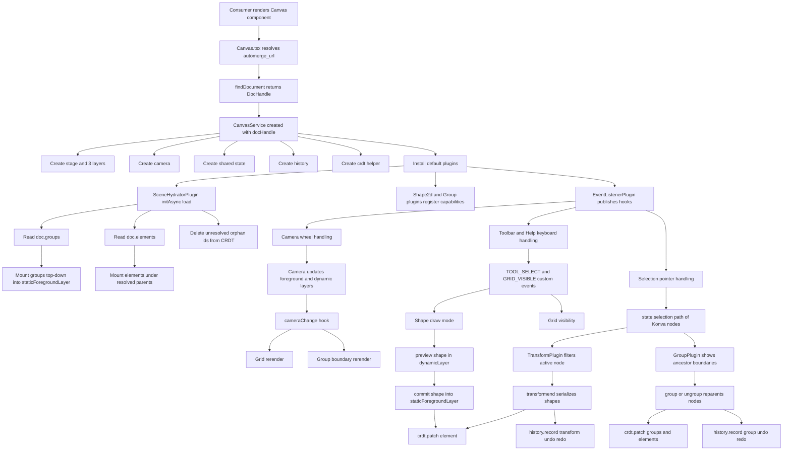

# Canvas Package Spec (`@vibecanvas/canvas`)

## Table of Contents

1. [Overview](#overview)
2. [What the Package Is Today](#what-the-package-is-today)
3. [Design Principles](#design-principles)
4. [Architecture](#architecture)
5. [Runtime Layers](#runtime-layers)
6. [Plugin System](#plugin-system)
7. [Input, Selection, and Transform Flow](#input-selection-and-transform-flow)
8. [Grouping Model](#grouping-model)
9. [CRDT and Scene Hydration](#crdt-and-scene-hydration)
10. [Toolbar, Help, and Keyboard Shortcuts](#toolbar-help-and-keyboard-shortcuts)
11. [Testing Strategy](#testing-strategy)
12. [How to Extend the Package](#how-to-extend-the-package)
13. [Current Gaps and WIP Areas](#current-gaps-and-wip-areas)
14. [File Index](#file-index)
15. [Data Flow](#data-flow)

## Overview

`@vibecanvas/canvas` is a reusable Konva-based canvas runtime with:

- a thin Solid host component for document loading
- a `CanvasService` runtime kernel
- hook-based plugins for most behavior
- Automerge-backed document hydration and mutation helpers
- test coverage around selection, grouping, transforms, and CRDT patching

The package is no longer just a canvas shell with demo rectangles.

Today it can:

- boot from a real `DocHandle<TCanvasDoc>`
- hydrate groups and shapes from `doc.groups` and `doc.elements`
- write grouped/ungrouped/shape edits back through a CRDT helper
- maintain local undo/redo history for grouping and transform workflows

It is still not a full editor yet, but it has crossed from mostly demo runtime into partial document-backed behavior.

## What the Package Is Today

The current package provides:

- public `Canvas` component exported from `packages/canvas/src/index.ts`
- async Automerge document lookup from `canvas.automerge_url`
- Konva stage with three intentional layers
- camera pan and pointer-anchored zoom
- viewport-derived background grid
- Solid toolbar and help overlays mounted by plugins
- marquee selection and depth-aware nested selection
- shared transformer UI
- grouping and ungrouping with CRDT updates
- scene hydration from `TCanvasDoc`
- CRDT patch and delete helpers with deep partial updates
- package-level tests under `packages/canvas/tests`

Important current boundary:

- document hydration exists, but live bidirectional reconciliation is still incomplete; startup hydration and targeted mutation writes are implemented, while broad reactive scene syncing is not.

## Design Principles

### 1. Keep `Canvas.tsx` thin

`packages/canvas/src/components/Canvas.tsx` should stay responsible for:

- resolving `props.canvas.automerge_url`
- showing loading/error fallback UI
- creating and destroying `CanvasService`
- passing app callbacks like `onToggleSidebar`

It should not absorb canvas feature logic.

### 2. Put shared runtime infrastructure in `CanvasService`

`CanvasService` owns the shared runtime kernel:

- stage and layer creation
- camera construction
- Solid store state
- history and CRDT helpers
- hook channels
- plugin installation
- resize handling

If multiple features need access to something, it should live in the plugin context instead of being hidden inside one plugin.

### 3. Put feature behavior in plugins

Most behavior belongs in plugins, not in the host component and not directly in `CanvasService`.

Current examples:

- event bridging
- viewport controls
- grid rendering
- toolbar overlay
- help overlay
- selection rules
- transform UI
- shape creation
- grouping behavior
- initial scene hydration

### 4. Treat layers and coordinate spaces as first-class architecture

The runtime deliberately separates:

- screen-space derived visuals
- world-space persisted content
- world-space transient interaction UI

Pan/zoom behavior stays understandable only if these concerns remain separate.

### 5. Prefer hooks and custom events over direct plugin coupling

Plugins should coordinate through shared runtime channels first.

Current custom events:

- `GRID_VISIBLE`
- `TOOL_SELECT`
- `ELEMENT_POINTERCLICK`
- `ELEMENT_POINTERDOWN`
- `ELEMENT_POINTERDBLCLICK`

### 6. Keep document access behind `Crdt` and plugin capabilities

Plugins should not mutate Automerge documents ad hoc.

The intended boundaries are:

- `Crdt` for patch/delete document writes
- capability functions for turning document entities into Konva nodes and back
- hydrator plugins for scene bootstrapping

## Architecture

The package is organized into four runtime layers:

1. `Canvas.tsx` - app-facing lifecycle bridge
2. `CanvasService` - runtime kernel
3. plugins - modular behavior units
4. Automerge + CRDT helpers - document read/write boundary

High-level flow:

```text
Consumer renders <Canvas />
  -> Canvas.tsx resolves Automerge DocHandle from canvas.automerge_url
  -> Canvas.tsx creates CanvasService(container, docHandle, defaultPlugins)
  -> CanvasService creates stage, layers, camera, store, history, hooks, crdt
  -> plugins register capabilities and event behavior
  -> SceneHydratorPlugin reads doc.groups/doc.elements and mounts the scene
  -> user interactions update Konva state and selected CRDT records
```

### `Canvas.tsx`

`packages/canvas/src/components/Canvas.tsx`:

- loads the Automerge document with `findDocument()`
- destroys and recreates `CanvasService` when the active handle changes
- passes `defaultPlugins({ onToggleSidebar })`
- surfaces loading and error states to the DOM

Unlike the earlier version of the package, the resolved `DocHandle` is now directly passed into `CanvasService` and used by the runtime.

### `CanvasService`

`packages/canvas/src/services/canvas/Canvas.service.ts` creates:

- `stage`
- `staticBackgroundLayer`
- `staticForegroundLayer`
- `dynamicLayer`
- `camera`
- Solid store state with `mode`, `theme`, and `selection`
- `history`
- `crdt`
- hook instances for lifecycle, pointer, keyboard, camera, and custom events

It also exposes plugin `capabilities`, which are how plugins layer shape/group support onto the runtime without hardcoding everything in the service.

## Runtime Layers

The layer split is the rendering contract.

### `staticBackgroundLayer`

Use for screen-space visuals derived from the viewport.

Current use:

- `GridPlugin`

This layer is not camera-transformed.

### `staticForegroundLayer`

Use for document-backed world content.

Current uses:

- hydrated top-level and nested groups
- hydrated and newly created shapes

The camera applies position and scale transforms to this layer.

### `dynamicLayer`

Use for transient world-space interaction UI.

Current uses:

- marquee selection rectangle
- transformer
- group boundary boxes
- draw-preview shape
- clone-drag preview nodes

The camera also applies position and scale transforms to this layer.

### Why the split matters

The mental model is:

- `staticBackgroundLayer` = viewport-derived decorations
- `staticForegroundLayer` = persistent scene content
- `dynamicLayer` = temporary interaction affordances

That separation is what makes selection, group boundaries, transforms, and hydration easier to reason about.

## Plugin System

Plugins are defined in `packages/canvas/src/plugins/interface.ts`.

Each plugin receives an `IPluginContext` containing:

- `stage`
- `staticBackgroundLayer`
- `staticForegroundLayer`
- `dynamicLayer`
- `camera`
- `state`
- `setState`
- `history`
- `crdt`
- `hooks`
- `capabilities`

### Hook families

The runtime uses lightweight tapable-style hooks from `packages/canvas/src/tapable/`:

- lifecycle: `init`, `initAsync`, `destroy`, `resize`
- pointer: `pointerDown`, `pointerMove`, `pointerUp`, `pointerOut`, `pointerOver`, `pointerCancel`, `pointerWheel`
- keyboard: `keydown`, `keyup`
- runtime: `cameraChange`, `customEvent`

### Default plugins

`defaultPlugins()` currently installs plugins in this order:

1. `EventListenerPlugin`
2. `GridPlugin`
3. `CameraControlPlugin`
4. `HistoryControlPlugin`
5. `ToolbarPlugin`
6. `HelpPlugin`
7. `SelectPlugin`
8. `TransformPlugin`
9. `Shape2dPlugin`
10. `GroupPlugin`
11. `SceneHydratorPlugin`

Important notes:

- `ExampleScenePlugin` still exists, but it is not part of the default runtime anymore.
- `SceneHydratorPlugin` is the current startup path for real document content.

### Plugin responsibilities

#### `EventListenerPlugin`

Owns root input bridging.

- republishes stage pointer and wheel events into hooks
- attaches keyboard listeners to `stage.container()`
- makes the container focusable
- removes listeners on destroy

#### `GridPlugin`

Owns the viewport-aware background grid.

- renders into `staticBackgroundLayer`
- derives major/minor spacing from camera zoom
- re-renders on `cameraChange`
- toggles visibility from `GRID_VISIBLE`

#### `CameraControlPlugin`

Owns wheel-driven camera behavior.

- `ctrl+wheel` zooms at the pointer
- normal wheel pans
- emits `cameraChange` after updates

#### `HistoryControlPlugin`

Owns keyboard-triggered history commands.

- `Cmd/Ctrl+Z` undo
- `Cmd/Ctrl+Shift+Z` redo

#### `ToolbarPlugin`

Owns the floating toolbar overlay.

- mounts a Solid toolbar into the stage container
- tracks active tool and grid visibility
- maps tools into `CanvasMode`
- emits `TOOL_SELECT` and `GRID_VISIBLE`
- handles shortcuts like `Space`, `Escape`, letters, digits, and `Cmd/Ctrl+B`

#### `HelpPlugin`

Owns the help overlay.

- mounts a Solid help widget into the stage container
- opens on `?`

#### `SelectPlugin`

Owns selection rules.

- marquee-selects top-level nodes
- single-click selects the currently focused depth path
- double-click drills one level deeper into nested groups
- `Shift+click` toggles the focused depth item in selection
- writes selected Konva nodes into shared state

#### `TransformPlugin`

Owns the shared `Konva.Transformer`.

- mounts one transformer into `dynamicLayer`
- filters selection for nested group focus
- persists shape transforms back through `crdt.patch()` on transform end
- records transform undo/redo history

#### `Shape2dPlugin`

Owns current 2D shape support.

- responds to `TOOL_SELECT`
- supports draw-preview creation flow for rectangles
- registers capability functions for shape creation, serialization, and update
- wires shape click, drag, double-click, clone-drag, and CRDT patch behavior

Important limitation:

- `supportedTypes` includes `rect`, `diamond`, and `ellipse`, but only rectangle creation/update serialization is meaningfully implemented right now.

#### `GroupPlugin`

Owns grouping behavior and group-specific visual affordances.

- exposes group capability functions
- creates dashed group boundary boxes in `dynamicLayer`
- handles `Cmd/Ctrl+G` and `Cmd/Ctrl+Shift+G`
- preserves absolute child positions while reparenting
- writes group and element parent updates through `crdt.patch()`
- records undo/redo history for group and ungroup actions
- manages which nodes are draggable based on current focused selection depth

#### `SceneHydratorPlugin`

Owns initial scene load from the current document.

- reads `doc.groups` and `doc.elements`
- mounts groups top-down into `staticForegroundLayer`
- mounts elements after their parents exist
- deletes orphan groups/elements from CRDT if they cannot be resolved

This is the main document-backed scene bootstrap path today.

## Input, Selection, and Transform Flow

Input flow is centralized at the root listener level and then delegated through hooks.

### Raw event path

```text
Konva stage / stage.container()
  -> EventListenerPlugin
  -> hook calls
  -> feature plugins react
```

### Keyboard behavior

Current keyboard behaviors include:

- `Space` hold for temporary hand tool
- `Esc` to return to select
- number and letter tool shortcuts from `toolbar.types.ts`
- `G` toggle grid
- `?` open help
- `Cmd/Ctrl+B` toggle sidebar
- `Cmd/Ctrl+Z` undo
- `Cmd/Ctrl+Shift+Z` redo
- `Cmd/Ctrl+G` group
- `Cmd/Ctrl+Shift+G` ungroup

### Selection model

Selection state currently stores live Konva nodes in `state.selection`.

That means:

- selection is runtime-local, not persisted
- nested selection is represented as a path like `[outerGroup, innerGroup, leafShape]`
- transformer filtering can target only the deepest active node while group boundary boxes remain visible for ancestor groups

### Selection behavior

`SelectPlugin` currently supports:

1. click a child of a group -> select the current focused path depth, usually the outer group first
2. double-click the same content -> drill deeper by one level
3. `Shift+click` -> toggle the focused node at the current depth
4. drag empty space -> marquee-select top-level nodes only

This gives the package an intentional depth-navigation model for nested groups instead of simple flat hit selection.

### Transform behavior

`TransformPlugin` uses one shared transformer.

- single selected group -> hide transformer border and rely on group boundary visuals
- multi-selection -> dashed transformer border
- single selected shape -> standard transformer border

On `transformstart`, it snapshots original serialized elements.
On `transformend`, it:

- serializes the updated shapes
- patches CRDT with new element data
- records an undo/redo history entry

## Grouping Model

Grouping is now a first-class workflow in this package.

### Group creation

`GroupPlugin.group()`:

- computes a bounding frame from selected nodes
- creates or reuses a Konva group
- reparents selected nodes into that group
- preserves absolute child positions during reparenting
- disables child dragging when nested under the group
- writes a new `TGroup` plus updated child `parentGroupId` values to CRDT
- records undo/redo history unless explicitly disabled

### Group removal

`GroupPlugin.ungroup()`:

- moves children back to the parent container
- preserves absolute child positions
- re-enables dragging for shapes that return to a draggable level
- patches child `parentGroupId` values
- deletes the group from CRDT
- records undo/redo history unless explicitly disabled

### Group boundaries

Selected groups show dashed boundary rectangles in `dynamicLayer`.

These are derived visuals, not persisted scene nodes.
They update on:

- camera changes
- group drag and transform changes
- selection changes

## CRDT and Scene Hydration

Automerge bootstrap still lives in `packages/canvas/src/services/automerge.ts`, but the runtime now uses document data more directly than before.

### `Crdt` helper

`packages/canvas/src/services/canvas/Crdt.ts` is no longer a stub.

It currently provides:

- `patch({ elements, groups })`
- `deleteById({ elementIds, groupIds })`

Key implementation details:

- patch payloads are deep partials keyed by `id`
- missing items are inserted
- existing items are updated minimally using `microdiff`
- omitted siblings are preserved
- nested object and array updates are merged without replacing entire entities

### Scene hydration path

`SceneHydratorPlugin` is the current startup loader.

Flow:

1. read `doc.groups` and `doc.elements`
2. mount groups top-down into their parent group or the foreground layer
3. mount elements once their parent group exists
4. delete unresolved orphan groups/elements from the document

This means startup now trusts `TCanvasDoc` as the scene source for supported groups and shapes.

### Current document write paths

The package writes back to CRDT for:

- created rectangles
- drag updates for shapes
- transform updates for shapes
- group creation
- ungroup
- scene-hydrator orphan cleanup

### Current document limits

The package does not yet provide:

- a live subscription/reconcile layer that reacts to remote document changes after startup
- complete shape support for all `TElement.data.type` variants
- robust z-index ordering from document data
- persisted selection state

## Toolbar, Help, and Keyboard Shortcuts

The package uses plugin-owned Solid overlays instead of placing richer UI into Konva nodes.

### Toolbar

`ToolbarPlugin` mounts `FloatingCanvasToolbar` and exposes the current tool model.

Toolbar tools include:

- `hand`
- `select`
- `rectangle`
- `diamond`
- `ellipse`
- `arrow`
- `line`
- `pen`
- `text`
- `image`
- `chat`
- `filesystem`
- `terminal`

Important limitation:

- the toolbar exposes more tools than the runtime currently implements. Rectangle, selection, grouping, transforms, and history are the most complete workflows today.

### Help

`HelpPlugin` mounts `CanvasHelp`, which documents the current tool and shortcut vocabulary.

The help content intentionally calls out that rectangle, selection, grouping, and history are the most complete flows.

## Testing Strategy

Tests live in `packages/canvas/tests` and focus on runtime behavior instead of only unit-level helpers.

### Harness

`packages/canvas/tests/test-setup.ts` provides a canvas harness that:

- creates a DOM container
- stubs `ResizeObserver`
- mounts `CanvasService` inside a Solid root
- exposes stage and all three layers
- supports scene initialization hooks

### Covered areas

#### `services/canvas/Crdt.test.ts`

Verifies:

- insert behavior for missing entities
- minimal nested partial patch behavior
- sibling preservation
- group patch updates
- targeted deletion

#### `plugins/SceneHydratorPlugin.test.ts`

Verifies:

- top-down hydration of nested groups and elements
- unresolved orphan groups/elements are removed from CRDT

#### `plugins/GroupPlugin.test.ts`

Verifies:

- grouping preserves child absolute positions under pan/zoom
- ungrouping preserves absolute positions
- CRDT `parentGroupId` updates are correct
- group and ungroup actions support undo/redo

#### `plugins/SelectionPlugin.test.ts`

Verifies:

- top-level group selection from child hits
- depth drilling with double-click
- mixed top-level multi-selection with `Shift+click`
- nested-group boundary and transformer behavior across scenario scenes

#### `plugins/TransformPlugin.test.ts`

Verifies:

- undo after resize restores absolute position and size

### Scenario fixtures

`packages/canvas/tests/scenarios/` contains reusable scene builders for:

- outer group selected from child hits
- nested groups with leaf shapes
- mixed top-level groups plus top-level shape

These fixtures encode the intended interaction semantics for selection depth and transformer targeting.

## How to Extend the Package

### Add a new behavior

Preferred path:

1. create or extend a plugin in `packages/canvas/src/plugins/`
2. use `IPluginContext`
3. expose shared helpers through `context.capabilities` only when needed across plugins
4. coordinate through hooks or custom events

### Add a new shared runtime capability

If multiple plugins need it, add it to `CanvasService` and `IPluginContext`.

Good examples:

- scene registry helpers
- shape factory registry
- document subscription/reconcile utilities
- selection helpers that work on ids instead of raw nodes

### Add a new shape type

Preferred path:

1. add capability support in `Shape2dPlugin` or a more specialized plugin
2. implement `createShapeFromTElement`
3. implement `toElement`
4. implement `updateShapeFromTElement`
5. make sure hydration and write paths both work
6. add tests under `packages/canvas/tests`

Do not stop at toolbar exposure only.

### Add new document-driven behavior

Preferred path:

- extend `SceneHydratorPlugin` or add a reconcile plugin
- keep CRDT writes inside `Crdt`
- avoid bypassing the document model with ad hoc plugin state

### Add a new overlay UI

Follow the toolbar/help pattern:

- create a DOM mount node
- append it to `stage.container()`
- render Solid into it
- clean it up on `destroy`

## Current Gaps and WIP Areas

The package is more capable than before, but it is still mid-build.

Current incomplete or rough areas:

- `Canvas.input.ts` is still empty; there is no formal gesture ownership system
- scene hydration is startup-only, not a full reactive reconcile loop
- selection still stores live Konva nodes instead of durable ids
- toolbar exposes many tools that have no real runtime implementation yet
- shape creation/update support is effectively rectangle-first today
- `Shape2dPlugin.supportedTypes` is broader than the actual implemented factories
- `ToolbarPlugin` still hardcodes `sidebarVisible: () => true`
- runtime state still contains `theme`, but theme-specific behavior is minimal
- document ordering, richer widgets, and deeper content types from `TCanvasDoc` are not fully hydrated yet
- `ExampleScenePlugin` remains in the repo as scaffolding/reference code

## File Index

### Public entry

- `packages/canvas/src/index.ts`
- `packages/canvas/src/components/Canvas.tsx`

### Runtime kernel

- `packages/canvas/src/services/canvas/Canvas.service.ts`
- `packages/canvas/src/services/canvas/Camera.ts`
- `packages/canvas/src/services/canvas/Crdt.ts`
- `packages/canvas/src/services/canvas/History.ts`
- `packages/canvas/src/services/canvas/interface.ts`
- `packages/canvas/src/services/canvas/enum.ts`
- `packages/canvas/src/services/canvas/Canvas.input.ts`

### Automerge bootstrap

- `packages/canvas/src/services/automerge.ts`

### Plugin contracts and registry

- `packages/canvas/src/plugins/interface.ts`
- `packages/canvas/src/plugins/index.ts`
- `packages/canvas/src/custom-events.ts`

### Default runtime plugins

- `packages/canvas/src/plugins/EventListener.plugin.ts`
- `packages/canvas/src/plugins/Grid.plugin.ts`
- `packages/canvas/src/plugins/CameraControl.plugin.ts`
- `packages/canvas/src/plugins/HistoryControl.plugin.ts`
- `packages/canvas/src/plugins/Toolbar.plugin.ts`
- `packages/canvas/src/plugins/Help.plugin.ts`
- `packages/canvas/src/plugins/Select.plugin.ts`
- `packages/canvas/src/plugins/Transform.plugin.ts`
- `packages/canvas/src/plugins/Shape2d.plugin.ts`
- `packages/canvas/src/plugins/Group.plugin.ts`
- `packages/canvas/src/plugins/SceneHydrator.plugin.ts`

### Reference / non-default plugin

- `packages/canvas/src/plugins/ExampleScene.plugin.ts`

### Overlay UI

- `packages/canvas/src/components/FloatingCanvasToolbar/index.tsx`
- `packages/canvas/src/components/FloatingCanvasToolbar/ToolButton.tsx`
- `packages/canvas/src/components/FloatingCanvasToolbar/toolbar.types.ts`
- `packages/canvas/src/components/CanvasHelp/index.tsx`
- `packages/canvas/src/components/CanvasHelp/help.data.ts`

### Hook implementation

- `packages/canvas/src/tapable/AsyncParallelHook.ts`
- `packages/canvas/src/tapable/SyncHook.ts`
- `packages/canvas/src/tapable/SyncExitHook.ts`
- `packages/canvas/src/tapable/interfaces.ts`
- `packages/canvas/src/tapable/index.ts`

### Tests

- `packages/canvas/tests/test-setup.ts`
- `packages/canvas/tests/services/canvas/Crdt.test.ts`
- `packages/canvas/tests/plugins/SceneHydratorPlugin.test.ts`
- `packages/canvas/tests/plugins/GroupPlugin.test.ts`
- `packages/canvas/tests/plugins/SelectionPlugin.test.ts`
- `packages/canvas/tests/plugins/TransformPlugin.test.ts`
- `packages/canvas/tests/scenarios/01-select-outer-group-from-child.ts`
- `packages/canvas/tests/scenarios/02-nested-groups-leaf-shapes.ts`
- `packages/canvas/tests/scenarios/03-top-level-mixed-selection.ts`

### Shared document model reference

- `packages/imperative-shell/src/automerge/types/canvas-doc.ts`

## Data Flow


