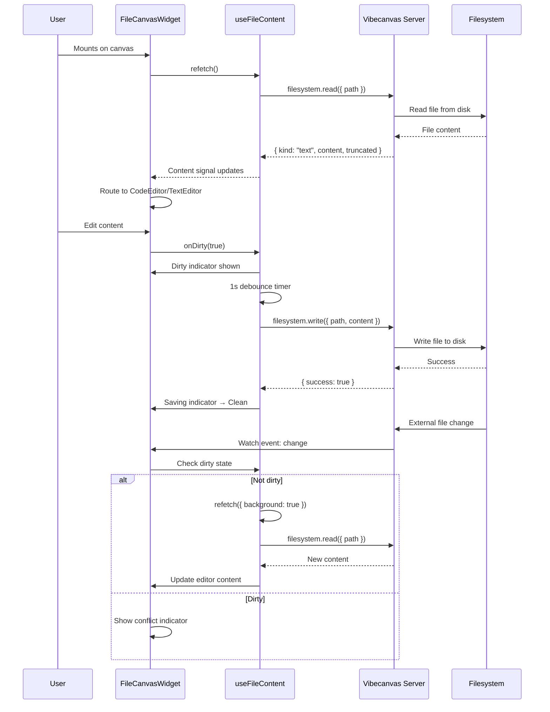

# File Widget Spec (CodeMirror Editor + Filesystem Sync)

## Table of Contents

1. [Overview](#overview)
2. [Requirements](#requirements)
3. [Current Assumptions and Constraints](#current-assumptions-and-constraints)
4. [End-to-End User Flow](#end-to-end-user-flow)
5. [Contracts and Data Shapes](#contracts-and-data-shapes)
6. [Backend Implementation](#backend-implementation)
7. [SPA Implementation](#spa-implementation)
8. [Component Architecture](#component-architecture)
9. [State and Sync Lifecycle](#state-and-sync-lifecycle)
10. [Error Handling](#error-handling)
11. [Performance and UX Notes](#performance-and-ux-notes)
12. [Testing and Verification](#testing-and-verification)
13. [File Map](#file-map)
14. [Data Flow Diagram](#data-flow-diagram)

## Overview

File is a CRDT-backed canvas widget that embeds an editable code/text editor directly onto the drawing surface. It provides:

- **Editable CodeMirror 6 editor** for `code`, `markdown`, and `text` renderer types
- **Plain text editor** for simple text files
- **Placeholder viewer** for binary formats (image, pdf, audio, video, unknown)
- **Live filesystem sync** via `filesystem.watch` with conflict detection
- **Debounced auto-save** with dirty/saving/conflict status indicators
- **Syntax highlighting** based on file extension via lazy-loaded `@codemirror/lang-*` packages

Architecture summary:

- Geometry and transforms (`x/y/w/h/angle/scale`) live in the Automerge canvas doc as `elements[id].data.type = "file"`.
- File element data stores `path` (filesystem path) and `renderer` (file type).
- Content fetching and write-back use `filesystem.read` and `filesystem.write` oRPC routes.
- File watching uses `filesystem.watch` with keepalive mechanism for real-time external change detection.
- Editor UI uses CodeMirror 6 with vibecanvas terminal theme.

## Requirements

- Users can create a file widget by dragging a file from the filetree onto the canvas (via `setup.file-drop.ts`).
- File widgets support standard canvas interactions: select, move, resize, rotate, clone, delete.
- On mount, file content is fetched via `filesystem.read` and displayed in the appropriate viewer.
- Editable renderers (`code`, `markdown`, `text`):
  - Show CodeMirror 6 editor with syntax highlighting for code/markdown
  - Show plain textarea for text
  - Track dirty state and debounced auto-save (1s delay)
- Status indicators in header: `dirty`, `saving`, `conflict`
- External file changes detected via `filesystem.watch`:
  - If clean: auto-refresh content
  - If dirty: show conflict indicator until user saves or discards
- File deletion detection (`rename` event) shows "File deleted" placeholder
- Truncated files (>512KB) show banner and disable editing

## Current Assumptions and Constraints

- File widgets are read-write for text-based content only.
- Binary files (image, pdf, audio, video) are read-only placeholders.
- No collaborative editing (single-user CRDT for file content).
- No LSP integration (deferred to future phase).
- Default file widget dimensions: determined by drag-drop or default size.
- Watch keepalive interval: 10 seconds.
- Auto-save debounce: 1000ms.

## End-to-End User Flow

1. User drags a file from the filetree onto the canvas.
2. SPA `setup.file-drop.ts` resolves file path and renderer type, creates CRDT element with `{ type: "file", path, renderer }`.
3. `FileElement` renderable mounts DOM overlay.
4. `FileCanvasWidget` mounts, calls `useFileContent` hook.
5. `useFileContent.refetch()` fetches content via `filesystem.read`.
6. Content displayed in appropriate viewer based on renderer + content kind:
   - `code`/`markdown`/`text` + text content → `CodeEditor`
   - `text` + text content → `TextEditor` (plain textarea)
   - All others → `PlaceholderViewer`
7. User edits content in editor:
   - Sets `dirty` state immediately
   - Debounced auto-save triggers after 1s of inactivity
   - Calls `filesystem.write` to persist to disk
8. External file change detected via watch:
   - If not dirty: background refresh, update editor content
   - If dirty: show conflict indicator
9. User clicks close button: removes CRDT element and cleans up watch

## Contracts and Data Shapes

### CRDT Element (`packages/imperative-shell/src/automerge/types/canvas-doc.ts`)

```ts
type TFileData = {
  type: 'file'
  w: number
  h: number
  isCollapsed: boolean
  path: string
  renderer: 'pdf' | 'image' | 'text' | 'code' | 'markdown' | 'audio' | 'video' | 'unknown'
}
```

Included in `TElementData` union, `TWidgetType`, and `isWidget(...)` type guard.

### Filesystem Contract (`packages/core-contract/src/filesystem.contract.ts`)

#### filesystem.read

```ts
// Input
{ query: { path: string, maxBytes?: number } }  // maxBytes defaults to 524288 (512KB)

// Output — one of:
{ kind: "text", content: string, truncated: boolean }   // text file
{ kind: "binary", preview: string | null, size: number } // binary file
{ type: string, message: string }                        // error
```

#### filesystem.write

```ts
// Input
{ query: { path: string, content: string } }

// Output — one of:
{ success: true }                                        // write succeeded
{ type: string, message: string }                        // error
```

#### filesystem.watch

```ts
// Input
{ path: string, watchId: string }

// Output — event iterator of:
{ eventType: "rename" | "change", fileName: string }
```

#### filesystem.keepaliveWatch / unwatch

```ts
// Input
{ watchId: string }

// Output
boolean (keepaliveWatch) | void (unwatch)
```

### SPA Content Hook (`apps/spa/src/features/file-widget/hooks/use-file-content.ts`)

```ts
type TFileContent =
  | { kind: "text"; content: string; truncated: boolean }
  | { kind: "binary"; preview: string | null; size: number }
  | null;

type TUseFileContent = {
  content: Accessor<TFileContent>
  loading: Accessor<boolean>
  error: Accessor<string | null>
  dirty: Accessor<boolean>
  saving: Accessor<boolean>
  setDirty: (next: boolean) => void
  refetch: (options?: { background?: boolean }) => Promise<void>
  save: (nextContent: string) => Promise<boolean>
}
```

## Backend Implementation

### Server Filesystem Handlers (`apps/server/src/apis/api.filesystem.ts`)

All handlers use the filesystem contract:

- `read`: reads file content via `Bun.file().text()` or `Bun.file().bytes()`, detects text vs binary, truncates if exceeds `maxBytes`.
- `write`: writes content to disk via `Bun.write(path, content)`.
- `watch`: returns SSE iterator via `EventIterator` for filesystem change events.
- `keepaliveWatch`: validates watch is still alive.
- `unwatch`: cleans up watch resources.

All handlers use `resolveToProjectDir` to scope paths to the project directory.

## SPA Implementation

### Content Hook (`apps/spa/src/features/file-widget/hooks/use-file-content.ts`)

`useFileContent(path: Accessor<string>)` — reactive hook for file content lifecycle:

- `refetch(options?)`: fetches content, supports background mode (skip loading state if content already exists).
- `save(nextContent)`: writes content via `filesystem.write`, handles errors.
- Signals: `content`, `loading`, `error`, `dirty`, `saving`.

### Extension to Language Mapping (`apps/spa/src/features/file-widget/util/ext-to-language.ts`)

```ts
async function getLanguageExtension(path: string): Promise<Extension | null>
```

Maps file extension to CodeMirror language support via lazy imports:

- `.js`, `.jsx` → `@codemirror/lang-javascript` (jsx: true)
- `.ts`, `.tsx` → `@codemirror/lang-javascript` (jsx: true, typescript: true)
- `.json` → `@codemirror/lang-json`
- `.css`, `.scss`, `.less` → `@codemirror/lang-css`
- `.html` → `@codemirror/lang-html`
- `.py` → `@codemirror/lang-python`
- `.sql` → `@codemirror/lang-sql`
- `.rs` → `@codemirror/lang-rust`
- `.md`, `.mdx` → `@codemirror/lang-markdown`
- `.yaml`, `.yml` → `@codemirror/lang-yaml`
- `.xml`, `.svg` → `@codemirror/lang-xml`
- Default → null (plain text)

## Component Architecture

### Layer 1: Content Hook (`hooks/use-file-content.ts`)

Headless reactive logic for content lifecycle:

- Signals: `content`, `loading`, `error`, `dirty`, `saving`, `setDirty`.
- Methods: `refetch()`, `save()`.
- Background refresh mode for watch change events (preserves editor state).

### Layer 2: Viewers (`components/viewers/`)

Three viewer components based on content type:

1. **CodeEditor** (`code-editor.tsx`)
   - CodeMirror 6 editable editor
   - Features: line numbers, syntax highlighting, bracket matching, auto-close, search, undo/redo, fold gutter
   - Language compartment for dynamic reconfiguration on path change
   - Read-only compartment for truncated files
   - Debounced auto-save (1s)
   - Vibecanvas terminal theme

2. **TextEditor** (`text-editor.tsx`)
   - Simple `<textarea>` for plain text
   - Debounced auto-save (1s)
   - Disabled when truncated

3. **PlaceholderViewer** (`placeholder-viewer.tsx`)
   - File icon or warning icon (if deleted)
   - Shows renderer type and file path

### Layer 3: Canvas Widget (`components/file-canvas-widget.tsx`)

Main widget component that orchestrates everything:

- Header bar: renderer badge, filename, status indicators (`dirty`, `saving`, `conflict`), close button
- Body: Switch/Match routing to appropriate viewer
- Watch management: starts `filesystem.watch` on mount, handles `change` and `rename` events
- Conflict detection: shows conflict indicator when file changes externally while dirty
- Deleted detection: shows "File deleted" state when file is renamed/moved

### Layer 4: Canvas Renderable (`apps/spa/src/features/canvas-crdt/renderables/elements/file/file.class.ts`)

`FileElement extends AElement<"file">` — Pixi.js renderable for canvas integration.

- Supports actions: setPosition, move, rotate, scale, resize, clone, delete, select, deselect, setStyle
- Mounts DOM overlay via dynamic import of `FileCanvasWidget`
- Computes screen bounds for overlay positioning

### File Drop Integration (`apps/spa/src/features/canvas-crdt/canvas/setup.file-drop.ts`)

Handles file drag-drop onto canvas:

- Extracts file path and renderer type from drop event
- Creates CRDT element with file data

## State and Sync Lifecycle

- CRDT element lifecycle:
  - Created: `setup.file-drop.ts` writes `doc.elements[id]` with file data (path, renderer).
  - Patched: `element.patch.ts` handles create/update/delete via standard Automerge patch flow.
  - Deleted: element removed from canvas + CRDT.
- Content lifecycle:
  - Fetched on mount via `filesystem.read`.
  - Updated on watch `change` event (if not dirty).
  - Saved on debounced auto-save trigger via `filesystem.write`.
- Watch lifecycle:
  - Started on mount with unique `watchId`.
  - Keepalive ping every 10 seconds.
  - Stopped on unmount or widget close.
- Dirty state:
  - Set true on any editor content change.
  - Cleared on successful save or content refresh.
- Conflict state:
  - Set true when watch `change` event fires while dirty.
  - Cleared on next successful save.

## Error Handling

- Read failure: shows error message in widget body, preserves previous content.
- Write failure: shows error message, preserves dirty state, allows retry.
- Watch failure: logs error, widget continues with static content.
- Truncated file: shows banner, disables editing.
- File deleted (rename event): shows "File deleted" placeholder, disables editing.

## Performance and UX Notes

- Background refresh mode skips loading state to prevent editor remount during watch updates.
- Debounced auto-save (1s) prevents excessive write calls.
- Keepalive interval (10s) prevents watch timeouts.
- Language compartment reconfiguration avoids full editor recreation on path change.
- CodeMirror theme matches vibecanvas terminal aesthetic (no border radius, monospace).
- Editor content update uses CodeMirror transaction dispatch for smooth updates.

## Testing and Verification

- `bun --filter @vibecanvas/spa build`
- `bun --filter @vibecanvas/server test`

### Manual Smoke Checklist

- Drag file from filetree onto canvas and verify CRDT element created.
- Verify content loads and displays in correct viewer based on renderer type.
- Edit content and verify dirty indicator appears.
- Wait for auto-save and verify saving indicator, then clean state.
- Modify file externally and verify content refreshes (when clean).
- Modify file externally while dirty and verify conflict indicator.
- Click close and verify CRDT element removed and watch cleaned up.
- Resize, move, rotate file widget and verify canvas interactions work.
- Test truncated file (>512KB) and verify editing disabled.

## File Map

### Contracts

- `packages/core-contract/src/filesystem.contract.ts` (filesystem routes: read, write, watch, keepaliveWatch, unwatch)

### CRDT Types

- `packages/imperative-shell/src/automerge/types/canvas-doc.ts` (`TFileData` with path and renderer)

### Server APIs

- `apps/server/src/apis/api.filesystem.ts` (filesystem handlers)

### SPA File Widget Feature

- `apps/spa/src/features/file-widget/hooks/use-file-content.ts` (content hook)
- `apps/spa/src/features/file-widget/components/file-canvas-widget.tsx` (main widget)
- `apps/spa/src/features/file-widget/components/viewers/code-editor.tsx` (CodeMirror editor)
- `apps/spa/src/features/file-widget/components/viewers/text-editor.tsx` (plain text editor)
- `apps/spa/src/features/file-widget/components/viewers/placeholder-viewer.tsx` (placeholder)
- `apps/spa/src/features/file-widget/util/ext-to-language.ts` (extension mapping)

### SPA Canvas Integration

- `apps/spa/src/features/canvas-crdt/renderables/elements/file/file.class.ts` (FileElement renderable)
- `apps/spa/src/features/canvas-crdt/canvas/setup.file-drop.ts` (file drop handling)
- `apps/spa/src/features/canvas-crdt/canvas/element.patch.ts` (element factory includes file)

## Data Flow Diagram

```mermaid
flowchart TD
  U1[User drags file from filetree] --> D1[setup.file-drop.ts]
  D1 --> CRDT[Write CRDT file element]
  CRDT --> Mount[FileElement mounts overlay]
  
  Mount --> W1[FileCanvasWidget mounts]
  W1 --> Fetch[useFileContent.refetch()]
  Fetch --> Read[filesystem.read path]
  Read --> Content{content kind?}
  
  Content -->|text| Router{renderer type?}
  Router -->|code| CE[CodeEditor - CodeMirror]
  Router -->|markdown| CE
  Router -->|text| TE[TextEditor - textarea]
  Content -->|binary| PV[PlaceholderViewer]
  
  CE --> Edit[User edits content]
  Edit --> Dirty[setDirty(true)]
  Dirty --> Debounce[1s debounce]
  Debounce --> Save[filesystem.write path]
  Save --> Clean[setDirty(false)]
  
  W1 --> Watch[filesystem.watch path]
  Watch --> Event{watch event?}
  Event -->|change + clean| Refetch[background refetch]
  Refetch --> Update[Editor content update]
  Event -->|change + dirty| Conflict[setHasConflict(true)]
  Event -->|rename| Deleted[setIsDeleted(true)]
```


