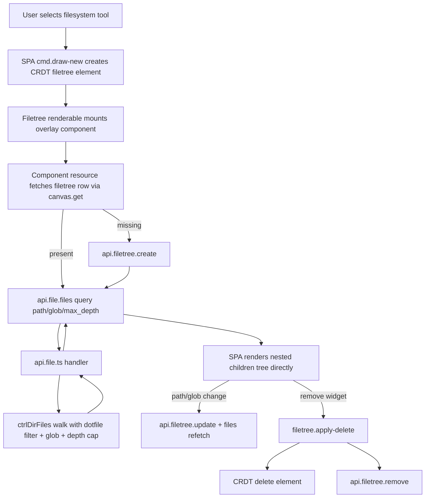

# Filetree Fullstack Spec

## Table of Contents

1. [Overview](#overview)
2. [Requirements](#requirements)
3. [Assumptions](#assumptions)
4. [User Flow](#user-flow)
5. [Data Contracts and Shapes](#data-contracts-and-shapes)
6. [Backend Implementation](#backend-implementation)
7. [SPA Implementation](#spa-implementation)
8. [Performance and Safety](#performance-and-safety)
9. [Error Handling](#error-handling)
10. [Testing and Verification](#testing-and-verification)
11. [File Map](#file-map)
12. [Data Flow Diagram](#data-flow-diagram)

## Overview

The Filetree feature is a canvas widget that lets users browse project files from inside the infinite canvas.

It is implemented as:

- A CRDT element (`type: "filetree"`) for position/size/selection behavior on canvas.
- A backend database row (`filetrees` table) for widget metadata (title, path, lock, glob filter).
- A filesystem listing API (`project.dir.files`) returning a nested tree (`children[]`) for rendering.
- A Solid DOM overlay component for interactive UI (path controls, glob input, folder expansion).

The feature follows the existing Functional Core / Imperative Shell architecture and keeps widget-specific backend state at component level (Solid resource), not global store.

## Requirements

- Users can create a filetree widget from the drawing toolbar (`filesystem` tool).
- Widget appears on canvas, draggable/resizable/rotatable like other elements.
- Widget stores metadata in `filetrees` table (`id`, `canvas_id`, `path`, `title`, `locked`, `glob_pattern`).
- Widget can:
  - set base path,
  - jump to home,
  - go to parent,
  - apply optional glob filter.
- Filesystem response must be nested and directly renderable by SPA.
- Recursive traversal must be depth-limited (default `max_depth = 5`) to avoid OOM.
- Dotfiles are excluded server-side.

## Assumptions

- Filetree widget data is local-widget state and does not need global store mirroring.
- Directory endpoints return union outputs (`success | { type, message }`) and should not throw for normal contract errors.
- Field names in directory node payload remain snake_case (`is_dir`) for contract consistency.
- Glob behavior is best-effort path matching and runs during traversal.

## User Flow

1. User selects `filesystem` tool and clicks canvas.
2. SPA creates CRDT element `filetree` (position + dimensions).
3. Filetree overlay component mounts.
4. Component fetches current filetree DB row by `canvasId + filetreeId`.
5. If row does not exist, component creates one with default home path.
6. Component requests `project.dir.files` with `{ path, glob_pattern?, max_depth: 5 }`.
7. Server returns nested tree; SPA renders it directly.
8. User edits path/glob; component updates DB row and refetches tree.
9. User removes widget; CRDT element is deleted and backend filetree row is removed.

## Data Contracts and Shapes

### Filetree CRUD contract (`packages/core-contract/src/filetree.contract.ts`)

- Create input:
  - `id: string`
  - `canvas_id: string`
  - `title: string`
  - `path: string`
  - `locked?: boolean`
  - `glob_pattern?: string`
- Update body:
  - `title?: string`
  - `path?: string`
  - `locked?: boolean`
  - `glob_pattern?: string | null`

### Project directory files contract (`packages/core-contract/src/project-dir.contract.ts`)

- Input query:
  - `path: string`
  - `glob_pattern?: string`
  - `max_depth?: number`
- Output success:

```ts
type TDirNode = {
  name: string;
  path: string;
  is_dir: boolean;
  children: TDirNode[];
};

type TDirFilesResponse = {
  root: string;
  children: TDirNode[];
};
```

- Output error:
  - `{ type: string; message: string }`

## Backend Implementation

### Functional Core

#### Filetree controllers (`packages/functional-core/src/filetree`)

- `ctrl.create-filetree.ts`
  - Inserts schema-aligned row using caller-provided `id`.
- `ctrl.update-filetree.ts`
  - Updates allowed fields only (`title`, `path`, `locked`, `glob_pattern`).
  - Updates `updated_at`.
- `ctrl.delete-filetree.ts`
  - Deletes by id.

#### Project FS tree controller (`packages/functional-core/src/project-fs/ctrl.dir-files.ts`)

- Validates path exists and is directory.
- Recursively traverses filesystem with:
  - dotfile filtering (`!name.startsWith(".")`),
  - optional glob matcher,
  - max depth guard (`max_depth ?? 5`).
- Returns nested `children[]` tree; no flat `relative_path` list.

### Server API

#### `apps/server/src/apis/api.file.ts`

- Exposes `file.files` endpoint.
- Passes `path`, `glob_pattern`, `max_depth` into `ctrlDirFiles`.
- Returns contract-safe error object (`{ type, message }`) when controller fails.

#### `apps/server/src/apis/api.filetree.ts`

- CRUD wrappers around functional-core filetree controllers.
- Publishes DB events via `dbUpdatePublisher` on insert/update/delete for `filetrees` rows.

## SPA Implementation

### Canvas element wiring

- Filetree element class is registered in renderable patching and doc-sync creation paths:
  - `canvas/element.patch.ts`
  - `canvas/setup.doc-sync.ts`
- Drawing command supports tool `filesystem` in:
  - `input-commands/cmd.draw-new.ts`

### Renderable + Overlay

- Pixi renderable:
  - `renderables/elements/filetree/filetree.class.ts`
- Solid overlay UI:
  - `features/filetree/components/filetree.tsx`
  - `features/filetree/components/filetree-header.tsx`

Overlay behavior:

- Uses stage-to-screen transforms and ticker updates for positioning.
- Supports drag interactions through renderable action dispatch.
- Uses `createResource` to fetch filetree row at component level.
- Creates missing row once on mount (guarded effect).
- Calls `project.dir.files` to render nested nodes directly.
- Tracks open folders by `node.path`.

### Store policy

- Filetree rows are intentionally not kept in global `src/store.ts`.
- Global DB events in `Canvas.tsx` continue syncing canonical shared slices (canvas/chats), not widget-local filetree state.

## Performance and Safety

- Depth limit (`max_depth`, default 5) prevents runaway recursion and OOM.
- Server-side filtering reduces payload size before network transfer.
- Nested response avoids expensive client rebuild from flat entries.
- Widget-level resource ownership avoids unnecessary global reactive churn.

## Error Handling

- Directory handlers return typed error objects, not throws, for expected failures.
- UI displays fallback message from endpoint error union.
- Filetree delete shows toast when backend delete fails.
- Initial filetree row creation is guarded to avoid repeated create attempts.

## Testing and Verification

- `bun --filter @vibecanvas/core test`
  - validates functional-core behavior.
- `bun --filter @vibecanvas/spa build`
  - compile/build validation for SPA integration.
- Manual smoke:
  - run `bun server:dev` + `bun client:dev`,
  - create filetree widget,
  - switch path/glob,
  - verify nested rendering and depth-limited traversal on large directories.

## File Map

### Contracts

- `packages/core-contract/src/filetree.contract.ts`
- `packages/core-contract/src/project-dir.contract.ts`

### Functional Core

- `packages/functional-core/src/filetree/ctrl.create-filetree.ts`
- `packages/functional-core/src/filetree/ctrl.update-filetree.ts`
- `packages/functional-core/src/filetree/ctrl.delete-filetree.ts`
- `packages/functional-core/src/project-fs/ctrl.dir-files.ts`
- `packages/functional-core/src/project-fs/index.ts`

### Server

- `apps/server/src/apis/api.filetree.ts`
- `apps/server/src/apis/api.file.ts`

### SPA

- `apps/spa/src/features/canvas-crdt/input-commands/cmd.draw-new.ts`
- `apps/spa/src/features/canvas-crdt/canvas/element.patch.ts`
- `apps/spa/src/features/canvas-crdt/canvas/setup.doc-sync.ts`
- `apps/spa/src/features/canvas-crdt/renderables/elements/filetree/filetree.class.ts`
- `apps/spa/src/features/canvas-crdt/renderables/elements/filetree/filetree.apply-delete.ts`
- `apps/spa/src/features/filetree/components/filetree.tsx`
- `apps/spa/src/features/filetree/components/filetree-header.tsx`
- `apps/spa/src/features/floating-selection-menu/components/SelectionStyleMenu.tsx`

## Data Flow Diagram


