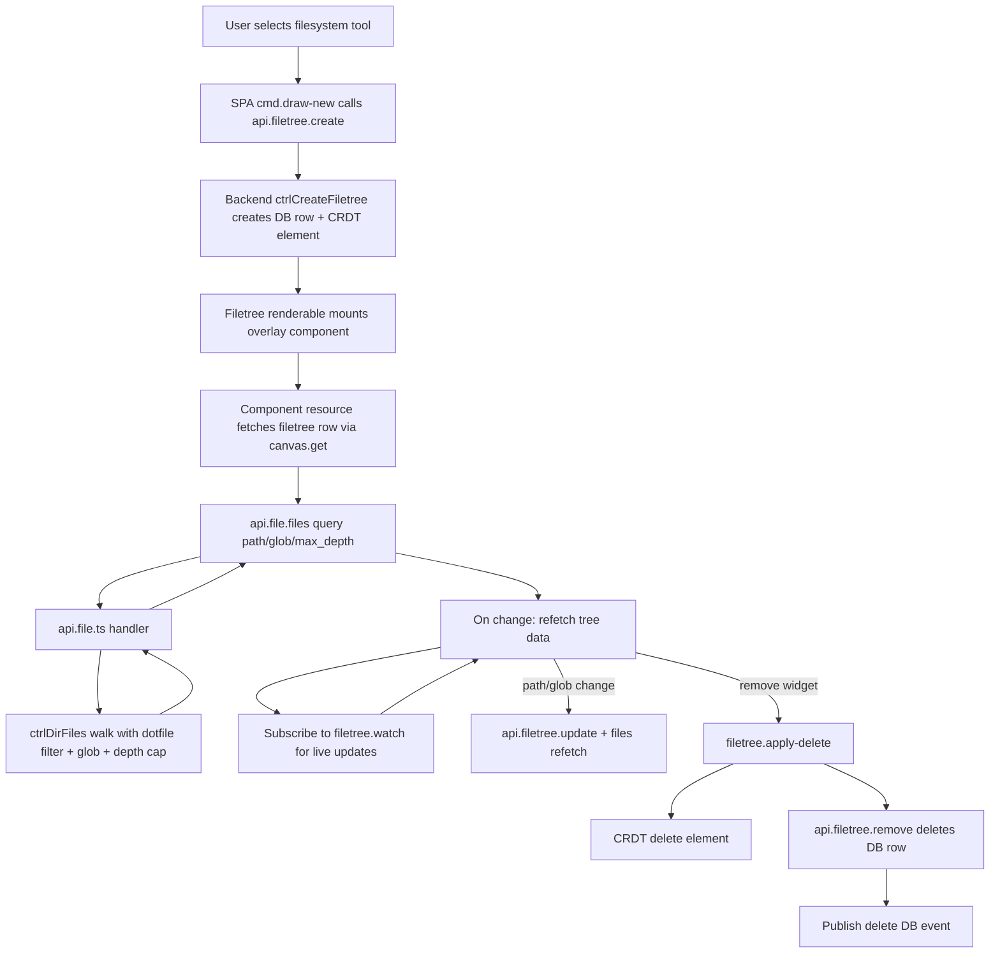

# Filetree Fullstack Spec

## Table of Contents

1. [Overview](#overview)
2. [Requirements](#requirements)
3. [Assumptions](#assumptions)
4. [User Flow](#user-flow)
5. [Data Contracts and Shapes](#data-contracts-and-shapes)
6. [Backend Implementation](#backend-implementation)
7. [SPA Implementation](#spa-implementation)
8. [Performance and Safety](#performance-and-safety)
9. [Error Handling](#error-handling)
10. [Testing and Verification](#testing-and-verification)
11. [File Map](#file-map)
12. [Data Flow Diagram](#data-flow-diagram)

## Overview

The Filetree feature is a canvas widget that lets users browse project files from inside the infinite canvas.

It is implemented as:

- A CRDT element (`type: "filetree"`) for position/size/selection behavior on canvas.
- A backend database row (`filetrees` table) for widget metadata (title, path, lock, glob filter).
- A filesystem listing API (`file.files`) returning a nested tree (`children[]`) for rendering.
- A filesystem watching API (`filetree.watch/unwatch`) for live updates when files change.
- A Solid DOM overlay component for interactive UI (path controls, glob input, folder expansion).

The feature follows the existing Functional Core / Imperative Shell architecture and keeps widget-specific backend state at component level (Solid resource), not global store.

## Requirements

- Users can create a filetree widget from the drawing toolbar (`filesystem` tool).
- Widget appears on canvas, draggable/resizable/rotatable like other elements.
- Widget stores metadata in `filetrees` table (`id`, `canvas_id`, `path`, `title`, `locked`, `glob_pattern`).
- Widget can:
  - set base path,
  - jump to home,
  - go to parent,
  - apply optional glob filter,
  - drag file/folder rows into chat composer for `@path` mentions.
- Filesystem response must be nested and directly renderable by SPA.
- Filesystem watching for live updates when files change in the watched directory.
- Recursive traversal must be depth-limited (default `max_depth = 5`) to avoid OOM.
- Dotfiles are excluded server-side.

## Assumptions

- Filetree widget data is local-widget state and does not need global store mirroring.
- Directory endpoints return union outputs (`success | { type, message }`) and should not throw for normal contract errors.
- Field names in directory node payload remain snake_case (`is_dir`) for contract consistency.
- Glob behavior is best-effort path matching and runs during traversal.

## User Flow

1. User selects `filesystem` tool and clicks canvas.
2. SPA creates filetree via `api.filetree.create` which creates both DB row and CRDT element.
3. Filetree overlay component mounts.
4. Component fetches current filetree DB row via `canvas.get` (which includes `fileTrees` array).
5. Component requests `file.files` with `{ path, glob_pattern?, max_depth: 5 }`.
6. Server returns nested tree; SPA renders it directly.
7. Component subscribes to `filetree.watch` for live filesystem updates.
8. User edits path/glob; component updates DB row and refetches tree.
9. User removes widget; CRDT element is deleted via `applyDelete` and backend filetree row is removed via `api.filetree.remove`.

## Data Contracts and Shapes

### Database Schema (`filetrees` table)

```ts
{
  id: string;           // Primary key
  canvas_id: string;    // Foreign key to canvas
  path: string;         // Current directory path
  title: string;        // Widget title (default: "File Tree")
  locked: boolean;      // Whether widget is locked
  glob_pattern: string | null;  // Optional glob filter
  created_at: Date;
  updated_at: Date;
}
```

### Filetree CRUD contract (`packages/core-contract/src/filetree.contract.ts`)

- **Create input:**
  - `canvas_id: string`
  - `path?: string`
  - `x: number`
  - `y: number`
- **Update body:**
  - `title?: string`
  - `path?: string`
  - `locked?: boolean`
  - `glob_pattern?: string | null`
- **Watch input:**
  - `params: { uuid: string, path: string }`
- **Watch output:** Event stream of `{ eventType: 'rename' | 'change', fileName: string }`

### File/Directory contract (`packages/core-contract/src/file.contract.ts`)

- **`file.home`** - Returns `{ path: string }` or error union
- **`file.list`** - Input: `{ path: string, omitFiles?: boolean }`, Output: `{ current: string, parent: string | null, children: TDirChild[] }` or error
- **`file.files`** - Input: `{ path: string, glob_pattern?: string, max_depth?: number }`, Output: `TDirFilesResponse` or error
- **`file.put`** - Upload base64 file

### Directory files response shape

```ts
type TDirNode = {
  name: string;
  path: string;
  is_dir: boolean;
  children: TDirNode[];
};

type TDirFilesResponse = {
  root: string;
  children: TDirNode[];
};
```

## Backend Implementation

### Functional Core (`packages/functional-core/src/filetree/`)

#### `ctrl.create-filetree.ts`
- Creates filetree database row with generated UUID
- Creates Automerge CRDT element via `repo.find()` and `handle.change()`
- On Automerge failure, rolls back by deleting the DB row
- Returns created filetree row

#### `ctrl.update-filetree.ts`
- Updates allowed fields: `title`, `path`, `locked`, `glob_pattern`
- Always updates `updated_at` timestamp
- Returns updated row or NOT_FOUND error

#### `ctrl.delete-filetree.ts`
- Deletes filetree row by ID
- Returns `{ id, deleted: true }` or NOT_FOUND error

### File/Directory controllers (`packages/functional-core/src/file/`)

#### `ctrl.dir-home.ts`
- Returns user's home directory path using `os.homedir()`

#### `ctrl.dir-list.ts`
- Lists directory contents (files and/or directories)
- Returns `{ current, parent, children: [{ name, path, isDir }] }`
- Supports `omitFiles` option for directory-only listings

#### `ctrl.dir-files.ts`
- Recursively traverses directory tree with:
  - **Dotfile filtering:** Excludes entries starting with "."
  - **Glob matching:** Optional pattern matching on file names and paths
  - **Depth limit:** `max_depth` (default 5) prevents runaway recursion
- Returns nested `children[]` tree structure
- Glob patterns support `*`, `?`, and `**` wildcards

### Server API (`apps/server/src/apis/`)

#### `api.filetree.ts`
- **`create`** - Wraps `ctrlCreateFiletree`, publishes `insert` DB event
- **`update`** - Wraps `ctrlUpdateFiletree`, publishes `update` DB event
- **`remove`** - Wraps `ctrlDeleteFiletree`, publishes `delete` DB event
- **`watch`** - Async generator using `FileSystemWatcher` for live filesystem events
- **`unwatch`** - Unregisters a filesystem watcher

#### `api.file.ts`
- **`home`** - Returns home directory path
- **`list`** - Lists directory with parent reference
- **`files`** - Returns nested tree via `ctrlDirFiles`
- **`put`** - Stores base64 image files

### Filesystem Watcher (`packages/imperative-shell/src/filesystem-watcher/`)

#### `srv.filesystem-watcher.ts`
- Uses Node.js `fs.watch()` for efficient filesystem monitoring
- Supports multiple listeners per path (reference counted)
- Publishes events via oRPC `EventPublisher`
- Events: `{ eventType: 'rename' | 'change', fileName: string }`
- Automatic cleanup on listener disconnect or errors

## SPA Implementation

### Canvas element wiring

Filetree element class is registered in:
- `canvas/element.patch.ts` - Creates `FiletreeElement` instances from CRDT data
- `canvas/setup.doc-sync.ts` - Handles filetree type in doc sync and drawing tools
- `input-commands/cmd.draw-new.ts` - Supports `filesystem` tool for creating filetrees

### Renderable + Overlay

#### Pixi renderable (`renderables/elements/filetree/filetree.class.ts`)
- Extends `AElement<"filetree">`
- Creates DOM overlay div anchored to canvas position
- Syncs overlay bounds via Pixi ticker (60fps viewport tracking)
- Supports all standard actions: move, resize, rotate, scale, delete, select
- Renders SolidJS `Filetree` component into overlay

#### Solid overlay UI (`features/filetree/components/`)

**`filetree.tsx`**
- Fetches filetree row via `createResource` + `canvas.get`
- Fetches directory tree via `createResource` + `file.files`
- Subscribes to `filetree.watch` for live updates (with cleanup)
- Lazy-loads subdirectory children on folder expand
- Path navigation: Home, Up, Apply path, Pick folder (via dialog)
- Glob pattern input with debounced updates
- Tree rendering with folder/file icons and expand/collapse
- Each row is a native HTML5 drag source emitting `application/x-vibecanvas-filetree-node` and `text/plain` (`@path`) payloads
- Drag support via pointer events on header

**`filetree-header.tsx`**
- Title, subtitle (current path), collapse and remove buttons
- Pointer event handlers for widget dragging

#### Delete handler (`filetree.apply-delete.ts`)
- Calls `api.filetree.remove` to delete backend row
- Shows toast on error
- Returns CRDT changes for element deletion

### Store policy

- Filetree rows are intentionally not kept in global `src/store.ts`.
- Global DB events in `Canvas.tsx` continue syncing canonical shared slices (canvas/chats), not widget-local filetree state.

## Performance and Safety

- **Depth limit** (`max_depth`, default 5) prevents runaway recursion and OOM.
- **Server-side filtering** reduces payload size before network transfer.
- **Nested response** avoids expensive client rebuild from flat entries.
- **Widget-level resource ownership** avoids unnecessary global reactive churn.
- **Filesystem watching** is reference-counted and cleaned up on unmount.
- **Lazy loading** of subdirectory contents on expand.

## Error Handling

- Directory handlers return typed error objects, not throws, for expected failures.
- UI displays fallback message from endpoint error union.
- Filetree delete shows toast when backend delete fails.
- Watch subscription cleanup on component unmount or path change.

## Testing and Verification

- `bun --filter @vibecanvas/core test`
  - validates functional-core behavior.
- `bun --filter @vibecanvas/spa build`
  - compile/build validation for SPA integration.
- Manual smoke:
  - run `bun server:dev` + `bun client:dev`,
  - create filetree widget,
  - switch path/glob,
  - verify nested rendering and depth-limited traversal on large directories,
  - verify live updates when files change,
  - drag rows from filetree into chat composer and verify mention insertion.

## File Map

### Contracts

- `packages/core-contract/src/filetree.contract.ts` - Filetree CRUD + watch
- `packages/core-contract/src/file.contract.ts` - File/directory operations

### Functional Core

- `packages/functional-core/src/filetree/ctrl.create-filetree.ts`
- `packages/functional-core/src/filetree/ctrl.update-filetree.ts`
- `packages/functional-core/src/filetree/ctrl.delete-filetree.ts`
- `packages/functional-core/src/file/ctrl.dir-home.ts`
- `packages/functional-core/src/file/ctrl.dir-list.ts`
- `packages/functional-core/src/file/ctrl.dir-files.ts`

### Imperative Shell

- `packages/imperative-shell/src/filesystem-watcher/srv.filesystem-watcher.ts`
- `packages/imperative-shell/src/database/schema.ts` - `filetrees` table

### Server

- `apps/server/src/apis/api.filetree.ts` - Filetree CRUD + watch handlers
- `apps/server/src/apis/api.file.ts` - File/directory handlers
- `apps/server/src/apis/api.db.ts` - DB event publisher

### SPA

- `apps/spa/src/features/canvas-crdt/input-commands/cmd.draw-new.ts` - Tool support
- `apps/spa/src/features/canvas-crdt/canvas/element.patch.ts` - Element creation
- `apps/spa/src/features/canvas-crdt/canvas/setup.doc-sync.ts` - Doc sync + tool handling
- `apps/spa/src/features/canvas-crdt/renderables/elements/filetree/filetree.class.ts`
- `apps/spa/src/features/canvas-crdt/renderables/elements/filetree/filetree.apply-delete.ts`
- `apps/spa/src/features/filetree/components/filetree.tsx`
- `apps/spa/src/features/filetree/components/filetree-header.tsx`
- `apps/spa/src/types/backend.types.ts` - `TBackendFileTree` type

## Data Flow Diagram


