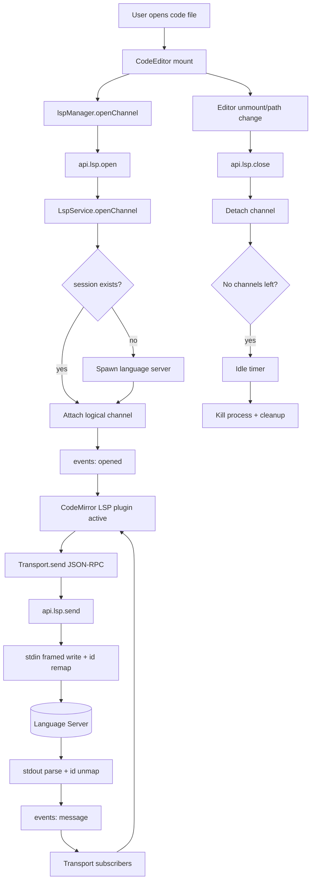
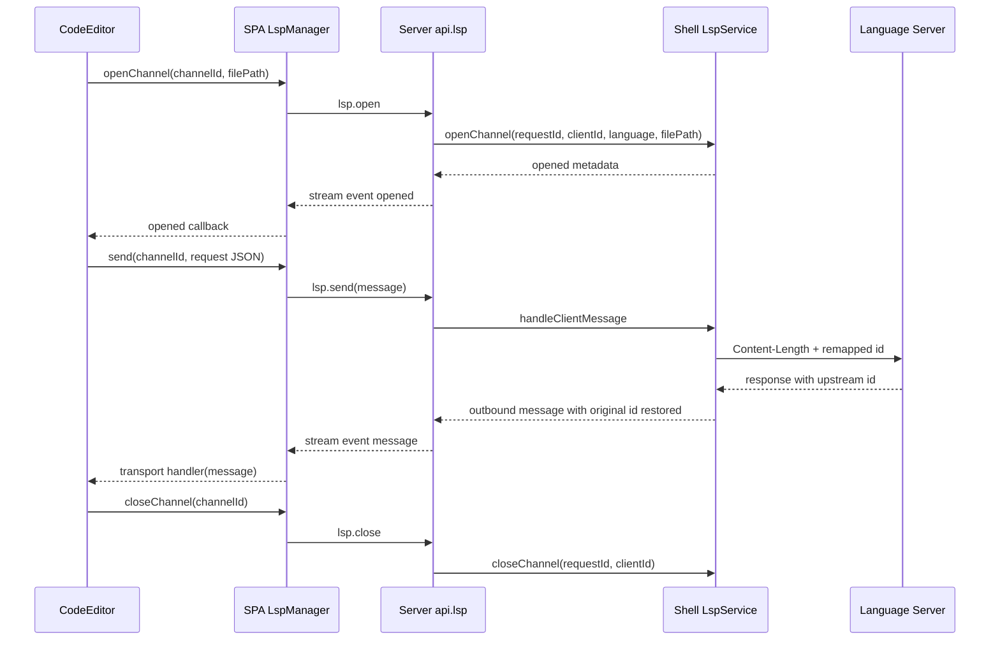

# LSP Spec (Shared `/api` Transport + CodeMirror Integration)

## Table of Contents

1. [Overview](#overview)
2. [Requirements](#requirements)
3. [Current Assumptions and Constraints](#current-assumptions-and-constraints)
4. [End-to-End User Flow](#end-to-end-user-flow)
5. [Contracts and Data Shapes](#contracts-and-data-shapes)
6. [Backend Implementation](#backend-implementation)
7. [SPA Implementation](#spa-implementation)
8. [Service and Component Architecture](#service-and-component-architecture)
9. [Session and Message Lifecycle](#session-and-message-lifecycle)
10. [Error Handling](#error-handling)
11. [Performance and Resource Notes](#performance-and-resource-notes)
12. [Testing and Verification](#testing-and-verification)
13. [File Map](#file-map)
14. [Data Flow Diagram](#data-flow-diagram)

## Overview

LSP support provides autocomplete, hover, diagnostics, and navigation features in the file widget CodeMirror editor.

This implementation uses:

- **Single shared WebSocket** (`/api`) for all RPC traffic.
- **Logical LSP channels** per editor instance (`channelId`) over that shared transport.
- **Pooled language server sessions** in backend, keyed by `(language, projectRoot)`.
- **CodeMirror `@codemirror/lsp-client`** with a custom Transport adapter.

The design intentionally keeps protocol payloads as raw JSON-RPC strings (`message: string`) to avoid over-typing every LSP method.

## Requirements

- A code editor can open a logical LSP channel for a file path.
- Multiple editors can share one backend LSP process when language + root match.
- Closing an editor detaches only that logical channel.
- Closing the socket request context detaches all channels for that request.
- JSON-RPC request IDs are remapped so multiple channels can safely share one server process.
- SPA should infer language from file extension using shared language mapping.
- Node-based language servers are lazily installed into vibecanvas config/workspace directory when missing globally (unless disabled via env).

## Current Assumptions and Constraints

- LSP RPC contract is minimal and passthrough-focused.
- `language` is required at contract level; SPA resolves it from extension mapping.
- CodeMirror integration currently targets file widget code editor.
- Not every language server has full parity lazy-install logic; all listed servers are represented in server-info modules, with varying spawn/install depth.
- Idle session shutdown uses timeout-based cleanup when no channels are attached.

## End-to-End User Flow

1. User opens a code file in file widget.
2. `CodeEditor` creates a `channelId` and requests `lspManagerService.openChannel(...)`.
3. SPA manager infers language from shared extension map and calls `api.lsp.open`.
4. Server `api.lsp.open` calls shell `LspService.openChannel(...)`.
5. `LspService` validates input, resolves project root, reuses or spawns backend session, and attaches channel.
6. SPA constructs `LSPClient` + custom Transport and installs `client.plugin(fileUri, languageId)`.
7. Editor actions produce JSON-RPC requests; transport forwards via `api.lsp.send`.
8. Backend reads/writes stdio framed LSP messages, remaps IDs, and routes responses/events back to channel via `api.lsp.events`.
9. On editor close/path switch, SPA calls `api.lsp.close`; backend detaches channel and may idle-shutdown session.
10. On websocket request close, server calls `closeLspChannelsForRequest(...)` for bulk cleanup.

## Contracts and Data Shapes

### LSP Contract (`packages/core-contract/src/lsp.contract.ts`)

Minimal router:

- `open`
  - Input: `{ channelId: string, filePath: string, language: string, rootHint?: string }`
  - Output: `{ success: true } | { type: string, message: string }`
- `send`
  - Input: `{ channelId: string, message: string }`
  - Output: `{ success: true } | { type: string, message: string }`
- `close`
  - Input: `{ channelId: string }`
  - Output: `{ success: true }`
- `events`
  - Input: `{}`
  - Output stream event union:
    - `{ type: "opened", channelId, language, projectRoot }`
    - `{ type: "message", channelId, message }`
    - `{ type: "error", channelId, message }`

### Shell Service Input/Output (`packages/imperative-shell/src/lsp/srv.lsp.ts`)

- `openChannel({ requestId, clientId, language, filePath, rootHint? })`
- `handleClientMessage({ requestId, clientId, message })`
- `closeChannel({ requestId, clientId })`
- `closeAllForRequest(requestId)`
- `setOutboundSender(...)`

Where `message` is raw JSON-RPC payload and protocol keys remain untouched aside from controlled `id` remapping.

## Backend Implementation

### API Layer (`apps/server/src/apis/api.lsp.ts`)

- Thin handler mapping contract calls to service methods.
- Request-scoped event publishing using `EventPublisher` keyed by `requestId`.
- Outbound service payloads converted to contract events:
  - Opened metadata event
  - Raw message event
  - Error event
- Exposes `closeLspChannelsForRequest(requestId)` used by websocket close hook.

### Socket Lifecycle Hook (`apps/server/src/server.ts`)

- On `/api` websocket close:
  - Calls `closeLspChannelsForRequest(ws.data.requestId)`
  - Then closes standard oRPC handler context

### Shell Service (`packages/imperative-shell/src/lsp/srv.lsp.ts`)

- Manages:
  - Session pool map (`sessionKey -> sessionState`)
  - Attachment map (`requestId::clientId -> attachmentState`)
  - Request remap map (`upstreamId -> original client id + attachment`)
- Implements:
  - idempotent open behavior
  - root resolution
  - create/reuse session
  - stdio framing (`Content-Length`) read/write
  - response routing + fallback broadcast
  - detach/idle timer/shutdown cleanup

### Server Registry (`packages/imperative-shell/src/lsp/srv.lsp-server-info.ts` + `server-info/*`)

- Split per-language server definitions in `server-info/lsp.<lang>.ts`.
- Shared helpers in `server-info/lsp.shared.ts`:
  - `NearestRoot(...)`
  - local Node package install helpers
  - process spawn helpers
- Aggregator file imports each server one-by-one and exports `LspServerInfoByLanguage`.

## SPA Implementation

### Manager (`apps/spa/src/services/lsp-manager.ts`)

- Owns one lazy event stream subscription to `api.lsp.events`.
- Routes incoming events by `channelId` to registered listeners.
- Exposes channel lifecycle methods:
  - `openChannel(...)`
  - `send(channelId, message)`
  - `closeChannel(channelId)`
- Uses shared extension map from `@vibecanvas/shell/lsp/language`.

### Transport (`apps/spa/src/services/lsp-transport.ts`)

- Implements CodeMirror `Transport` interface:
  - `send(message)` -> manager send
  - `subscribe/unsubscribe(handler)` -> manager channel message listeners

### Code Editor (`apps/spa/src/features/file-widget/components/viewers/code-editor.tsx`)

- Adds `lspCompartment` for plugin hot-reconfigure.
- On mount/path changes:
  - opens channel
  - creates `LSPClient({ extensions: languageServerExtensions() })`
  - connects custom transport
  - installs `client.plugin(fileUri, languageId)`
- On cleanup:
  - disconnects client
  - disposes transport
  - closes channel

### Language Helpers (`apps/spa/src/features/file-widget/util/ext-to-language.ts`)

- `getLanguageExtension(path)` for syntax highlighting extension.
- `getLanguageId(path)` for LSP language id.

## Service and Component Architecture

### Layer 1: Contract + API

- Minimal RPC surface in `lsp.contract.ts`.
- Thin API translation in `api.lsp.ts`.

### Layer 2: Shell LSP Service

- Stateful process/session/attachment manager.
- Protocol-aware ID remap and framing.

### Layer 3: SPA Manager + Transport

- Request/event orchestration in `lsp-manager.ts`.
- CodeMirror transport adapter in `lsp-transport.ts`.

### Layer 4: CodeEditor Integration

- Compartment-based runtime plugin config.
- Channel lifecycle tied to editor lifecycle.

## Session and Message Lifecycle

- Session key: `${language}:${projectRoot}`.
- Attachment key: `${requestId}::${clientId}`.
- Client request flow:
  1. Parse outbound JSON message.
  2. If message has `id`, replace with generated upstream numeric id.
  3. Store mapping `(upstreamId -> attachment + original id)`.
  4. Write framed message to server stdin.
- Server response flow:
  1. Parse framed stdout messages.
  2. If response `id` matches remap entry, restore original client id.
  3. Route to originating channel.
  4. If no remap (notification), broadcast to attached channels for that session.

## Error Handling

- Open/send failures return union error payloads (`{ type, message }`) from API handlers.
- Service throws explicit errors for missing attachment/session or invalid input.
- Unknown/non-JSON outgoing payloads are still forwarded as raw `message` events.
- Spawn failures surface as open errors and do not create leaked attachments.

## Performance and Resource Notes

- Session pooling reduces repeated process spawn cost.
- Idle timeout cleans unused sessions automatically.
- Shared `/api` websocket avoids extra socket churn per editor.
- LSP plugin compartment reconfigure avoids full editor recreation.
- Lazy language server install minimizes startup time and installs only used servers.

## Testing and Verification

### Automated

- `bun test ./packages/imperative-shell/src/lsp/*.test.ts`
  - idempotency
  - root resolution
  - nearest-root behavior
  - session reuse
  - request-id remap
  - request-scoped close isolation
- `bun --filter @vibecanvas/server test`
- `bun --filter @vibecanvas/spa build`

### Manual Smoke Checklist

- Open `.ts` file in file widget and verify hover/completion.
- Open `.py` file and verify LSP responses.
- Open two editors in same project and verify warm reuse (single server session expected).
- Close one editor and verify other keeps LSP working.
- Close all editors and verify idle shutdown behavior in logs.
- Force websocket reconnect and verify channels are re-opened correctly by UI lifecycle.

## File Map

### Contracts

- `packages/core-contract/src/lsp.contract.ts`
- `packages/core-contract/src/index.ts`

### Server API

- `apps/server/src/apis/api.lsp.ts`
- `apps/server/src/api-router.ts`
- `apps/server/src/server.ts` (request-close cleanup hook)

### Shell Service

- `packages/imperative-shell/src/lsp/srv.lsp.ts`
- `packages/imperative-shell/src/lsp/srv.lsp-server-info.ts`
- `packages/imperative-shell/src/lsp/server-info/lsp.shared.ts`
- `packages/imperative-shell/src/lsp/server-info/lsp.*.ts`
- `packages/imperative-shell/src/lsp/language.ts`

### SPA

- `apps/spa/src/services/lsp-manager.ts`
- `apps/spa/src/services/lsp-transport.ts`
- `apps/spa/src/features/file-widget/components/viewers/code-editor.tsx`
- `apps/spa/src/features/file-widget/util/ext-to-language.ts`

### Tests

- `packages/imperative-shell/src/lsp/srv.lsp.test.ts`
- `packages/imperative-shell/src/lsp/srv.lsp-server-info.test.ts`

## Data Flow Diagram

