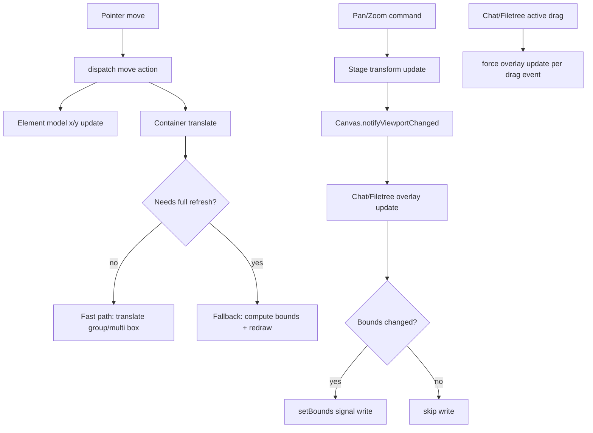

# Canvas Performance Spec

## Table of Contents

1. [Overview](#overview)
2. [Goals](#goals)
3. [Applied Optimizations](#applied-optimizations)
4. [Why These Patterns Exist](#why-these-patterns-exist)
5. [Invariants and Guardrails](#invariants-and-guardrails)
6. [Remaining Work](#remaining-work)
7. [Verification](#verification)
8. [File Map](#file-map)
9. [Data Flow Diagram](#data-flow-diagram)

## Overview

This document records the performance optimizations already applied in this branch, with rationale and constraints.

It exists to answer: "Why is this code written this way?" and to prevent accidental regressions when future refactors touch canvas interaction and overlay sync paths.

Scope currently focuses on `apps/spa/src/features/canvas-crdt` (selection/drag/multi-select/overlays) plus related chat/filetree overlay behavior.

## Goals

- Reduce frame-time spikes during drag-heavy interactions.
- Reduce idle CPU churn on weaker laptops.
- Preserve interaction quality (especially drag smoothness).
- Keep CRDT persistence semantics unchanged (writes still batched at gesture boundaries).

## Applied Optimizations

### 1) Skip geometry redraw on move actions (high ROI)

**Files**

- `apps/spa/src/features/canvas-crdt/renderables/elements/rect/rect.apply-move.ts`
- `apps/spa/src/features/canvas-crdt/renderables/elements/line/line.apply-move.ts`
- `apps/spa/src/features/canvas-crdt/renderables/elements/rect/rect.apply-move.test.ts`
- `apps/spa/src/features/canvas-crdt/renderables/elements/line/line.apply-move.test.ts`

**What changed**

- Move handlers no longer call `redraw()` on every pointer frame.
- They update element coordinates and translate container transforms directly.
- Rect-family move uses **applied post-clamp delta** to keep container and model aligned at bounds.

**Why**

- Move gestures are translation-only; geometry does not change.
- Rebuilding graphics every move frame is wasted CPU/GPU work.

### 2) Drag-selection fast path for transform visuals

**Files**

- `apps/spa/src/features/canvas-crdt/input-commands/cmd.drag-selection.ts`
- `apps/spa/src/features/canvas-crdt/renderables/transform-box/multi-transform-box.ts`

**What changed**

- Added applied-delta analysis during drag.
- Added fast path: translate virtual-group containers and multi-selection box directly.
- Added fallback: when deltas are non-uniform or bounds indicate non-translation behavior, do full recompute/redraw.
- Added `MultiTransformBox.translateBy(dx, dy)` and reset transient offset in authoritative `redraw()`.

**Why**

- Per-frame `computeGroupBounds()+redraw()` was hot during multi-drag.
- Most frames are pure translation and can avoid geometry rebuild.

### 3) Idle-loop reductions for overlays and devtools

**Files**

- `apps/spa/src/features/canvas-crdt/canvas/canvas.ts`
- `apps/spa/src/features/canvas-crdt/input-commands/cmd.pan.ts`
- `apps/spa/src/features/canvas-crdt/input-commands/cmd.zoom.ts`
- `apps/spa/src/features/canvas-crdt/input-commands/cmd.pan-drag.ts`
- `apps/spa/src/features/canvas-crdt/renderables/elements/chat/chat.class.ts`
- `apps/spa/src/features/canvas-crdt/renderables/elements/filetree/filetree.class.ts`

**What changed**

- `@pixi/devtools` is loaded only in dev mode.
- Added viewport notification channel on `Canvas`:
  - `onViewportChange(listener)`
  - `notifyViewportChanged()`
- Pan/zoom commands notify viewport changes when stage transforms update.
- Removed per-frame ticker polling for chat/filetree overlay bounds sync.
- Overlays now update on:
  - local element transform/redraw events,
  - viewport-change notifications.
- Added bounds-diff guards to skip redundant `setBounds` signal updates.

**Why**

- Continuous per-frame overlay sync caused idle heat even when user was not interacting.
- Event-driven updates preserve correctness while reducing idle reactive churn.

### 4) Drag smoothness follow-up (targeted)

**Files**

- `apps/spa/src/features/canvas-crdt/renderables/elements/chat/chat.class.ts`
- `apps/spa/src/features/canvas-crdt/renderables/elements/filetree/filetree.class.ts`

**What changed**

- Reintroduced per-drag-event overlay updates only during active drag via forced `updateOverlayBounds(true)` in `onDrag` handlers.

**Why**

- Fully event-driven idle model is good for thermals, but drag needed per-event overlay updates to remain visually smooth.
- This keeps smooth drag without restoring global idle ticker loops.

## Why These Patterns Exist

- **Move without redraw**: translation is a transform update, not a geometry mutation.
- **Applied delta over raw delta**: clamping can alter effective movement; raw deltas cause container/model drift at bounds.
- **Fast-path + guarded fallback**: use cheap path for common case, keep correctness path for edge cases.
- **Event-driven overlays**: poll-based sync is simple but expensive at idle; push-based sync scales better.
- **Bounds diffing**: reactive systems still cost work on identical writes; compare first.
- **Drag-only forced updates**: preserve user-perceived smoothness where latency is visible.

## Invariants and Guardrails

- CRDT write timing remains boundary-based (`pointerup`) for interaction commands.
- Visual fast paths must not change persisted change sets.
- Overlay alignment must remain correct across pan/zoom/resize/rotate.
- Any optimization that skips redraw must ensure transform boxes remain authoritative after fallback/final redraw.
- Avoid reintroducing global per-frame ticker loops for overlay sync.

## Remaining Work

Not yet implemented (tracked in `plans/performance/canvas-performance-plan.md`):

- TransformBox geometry caching/refactor.
- TextElement rerasterization/style-assignment reductions.
- Patch-aware redraw gating in `element.patch.ts`.
- Selection diffing optimizations in `setup.doc-sync.ts`.
- Additional virtual-group cache invalidation narrowing.

## Verification

Current checks run during these optimizations:

- `bun --filter @vibecanvas/spa test`

Existing targeted tests:

- `apps/spa/src/features/canvas-crdt/renderables/elements/rect/rect.apply-move.test.ts`
- `apps/spa/src/features/canvas-crdt/renderables/elements/line/line.apply-move.test.ts`
- `apps/spa/src/features/canvas-crdt/canvas/element.patch.test.ts`

Manual smoke checklist:

- Drag single elements (rect/ellipse/diamond/line/arrow/image/text/chat/filetree) and verify smoothness.
- Drag multi-selection and grouped targets; check transform visuals track correctly.
- Pan/zoom and verify chat/filetree DOM overlays stay aligned.
- Let canvas idle on weaker hardware and verify reduced heat vs prior behavior.

## File Map

- `apps/spa/src/features/canvas-crdt/renderables/elements/rect/rect.apply-move.ts`
- `apps/spa/src/features/canvas-crdt/renderables/elements/line/line.apply-move.ts`
- `apps/spa/src/features/canvas-crdt/input-commands/cmd.drag-selection.ts`
- `apps/spa/src/features/canvas-crdt/renderables/transform-box/multi-transform-box.ts`
- `apps/spa/src/features/canvas-crdt/canvas/canvas.ts`
- `apps/spa/src/features/canvas-crdt/input-commands/cmd.pan.ts`
- `apps/spa/src/features/canvas-crdt/input-commands/cmd.zoom.ts`
- `apps/spa/src/features/canvas-crdt/input-commands/cmd.pan-drag.ts`
- `apps/spa/src/features/canvas-crdt/renderables/elements/chat/chat.class.ts`
- `apps/spa/src/features/canvas-crdt/renderables/elements/filetree/filetree.class.ts`
- `plans/performance/canvas-performance-plan.md`

## Data Flow Diagram

