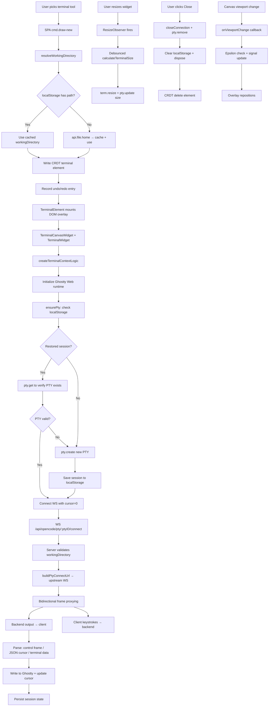
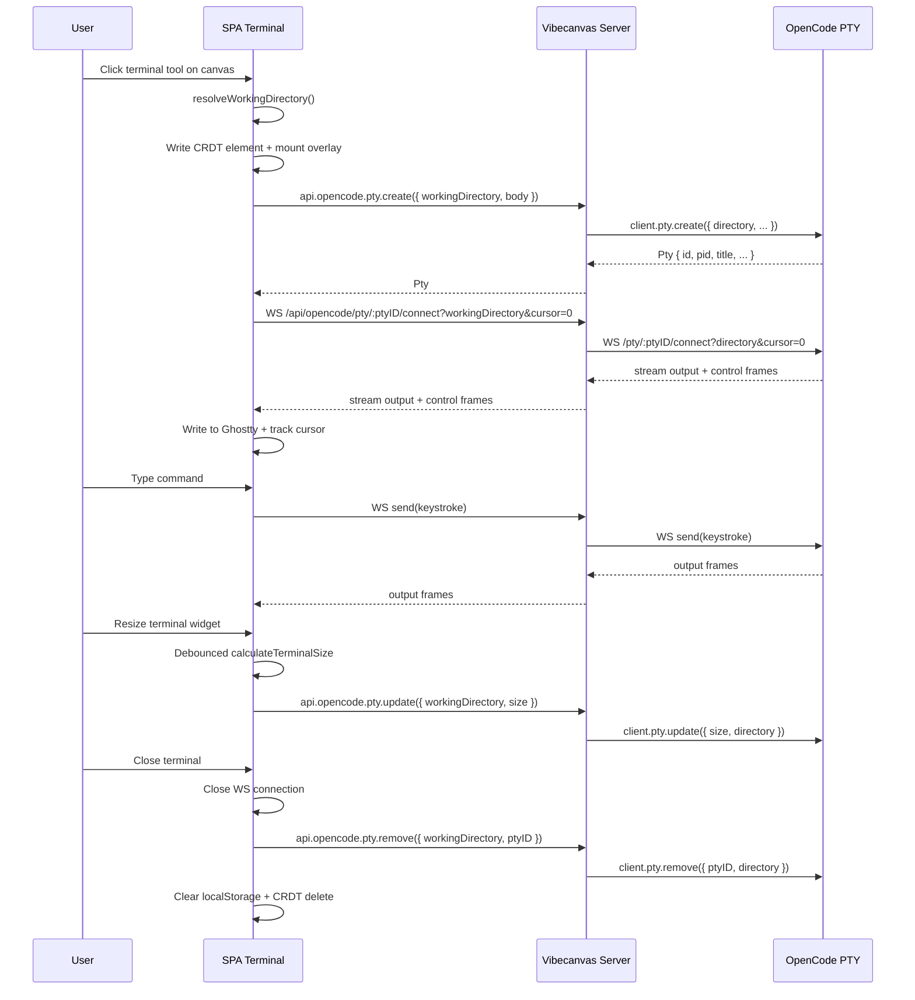

# Terminal Fullstack Spec (OpenCode PTY + Canvas Widget)

## Table of Contents

1. [Overview](#overview)
2. [Requirements](#requirements)
3. [Current Assumptions and Constraints](#current-assumptions-and-constraints)
4. [End-to-End User Flow](#end-to-end-user-flow)
5. [Contracts and Data Shapes](#contracts-and-data-shapes)
6. [Backend Implementation](#backend-implementation)
7. [SPA Implementation](#spa-implementation)
8. [Component Architecture](#component-architecture)
9. [State and Sync Lifecycle](#state-and-sync-lifecycle)
10. [Error Handling](#error-handling)
11. [Performance and UX Notes](#performance-and-ux-notes)
12. [Testing and Verification](#testing-and-verification)
13. [File Map](#file-map)
14. [Data Flow Diagram](#data-flow-diagram)

## Overview

Terminal is a CRDT-backed canvas widget that embeds a Ghostty Web terminal connected to an OpenCode PTY session directly onto the drawing surface.

### Rebase + Compatibility Update (2026-02-26)

- Branch rebased on `main` at `v0.1.5` (`Refactor/orpc http`).
- Server RPC transport now stays on oRPC fetch/HTTP (`@orpc/server/fetch`) instead of `/api` WebSocket.
- Direct terminal PTY streaming remains a dedicated WebSocket passthrough at `/api/opencode/pty/:ptyID/connect`.
- PTY WS proxy now requires `workingDirectory` query param and forwards it to OpenCode as `directory` when building upstream PTY connect URL.

Architecture summary:

- Geometry and transforms (`x/y/w/h/angle/scale`) live in the Automerge canvas doc as `elements[id].data.type = "terminal"`.
- Terminal element data stores `workingDirectory` (filesystem path) which scopes PTY operations to a directory.
- PTY lifecycle (create, get, update, remove, list) is managed through `api.opencode.pty.*` oRPC routes scoped by `workingDirectory`.
- PTY stream I/O uses a dedicated WebSocket passthrough at `/api/opencode/pty/:ptyID/connect`.
- Terminal UI uses `ghostty-web` runtime for full terminal emulation (cursor, colors, scrollback).
- Session state (`ptyID`, `cursor`, `rows`, `cols`, `title`, `scrollY`) is persisted in `localStorage` per `terminalKey` for reconnect/refresh restoration.
- Terminal is **fully decoupled from chat context** — it does not require a chat widget or `chatId`. PTY scoping uses `workingDirectory` directly.

The design is hybrid local-first: CRDT handles visual placement/collaboration of the widget, while PTY process management and I/O streaming are delegated to the OpenCode backend through the Vibecanvas server as a typed gateway.

## Requirements

- Users can create a terminal widget from the toolbar tool `terminal` (keyboard shortcut `j`).
- Terminal widgets support standard canvas interactions: select, move, resize, rotate, clone, delete.
- Creating a terminal resolves a `workingDirectory` from:
  - `localStorage['vibecanvas-last-working-directory']`, or
  - `localStorage['vibecanvas-filetree-last-path']`, or
  - server-side home directory via `api.file.home`.
- Terminal element is purely CRDT-based (no dedicated database table).
- Terminal lifecycle operations:
  - On mount: restore existing PTY session from localStorage, or create new PTY via `api.opencode.pty.create`.
  - On reconnect: replay from cursor `0` (full replay) to ensure initial prompt context is never missed.
  - On resize: debounced `api.opencode.pty.update({ size })` to sync terminal dimensions with backend PTY.
  - On close: `api.opencode.pty.remove` + clear localStorage state.
- Terminal stream connects via WebSocket with bidirectional frame proxying (binary + text).
- Cursor tracking supports both authoritative control frames (`0x00` + JSON) and heuristic byte-length increments.

## Current Assumptions and Constraints

- PTY sessions are scoped by OpenCode `directory` parameter, mapped from the terminal element's `workingDirectory` field.
- PTY WS replay semantics follow OpenCode behavior (cursor query value, server-driven stream replay).
- One PTY instance per terminal widget. Each widget creates and manages its own PTY lifecycle independently.
- Terminal elements have no dedicated backend database table. All persistence is through CRDT elements + localStorage session state.
- PTY proxy handlers use `getPtyClient(opencodeService, workingDirectory)` which creates/caches OpenCode clients keyed by `pty:{workingDirectory}`, separate from chat-scoped clients.
- Ghostty Web runtime is initialized once (shared promise) across all terminal instances in the SPA.
- Terminal delete applies CRDT removal immediately; PTY remove is widget-local via the close button.

## End-to-End User Flow

1. User selects `terminal` tool (or presses `j`) and clicks canvas.
2. SPA `cmd.draw-new` resolves a `workingDirectory` via `resolveWorkingDirectory()`.
   - Checks `localStorage['vibecanvas-last-working-directory']`, then `localStorage['vibecanvas-filetree-last-path']`.
   - Falls back to `api.file.home` (cached after first call).
3. Terminal CRDT element is created with `{ type: "terminal", w: 720, h: 420, isCollapsed: false, workingDirectory }`.
4. Element is written to Automerge doc and undo/redo entry is recorded.
5. `TerminalElement` renderable mounts DOM overlay into `#canvas-overlay-entrypoint`.
6. `TerminalCanvasWidget` renders with header bar (title, close button) and embedded `TerminalWidget`.
7. `TerminalWidget` creates `createTerminalContextLogic` which initializes Ghostty Web, creates or restores PTY, and opens WebSocket stream.
8. User types in terminal; keystrokes are sent to PTY via WebSocket; output frames are written to Ghostty terminal.
9. On resize (container or canvas zoom), terminal dimensions are recalculated and pushed to backend via debounced `pty.update`.
10. On close button click, PTY is removed, localStorage cleared, and CRDT delete is dispatched.

## Contracts and Data Shapes

### CRDT Element (`packages/imperative-shell/src/automerge/types/canvas-doc.ts`)

```ts
type TTerminalData = {
  type: 'terminal';
  w: number;
  h: number;
  isCollapsed: boolean;
  workingDirectory: string;
};
```

Included in `TElementData` union, `TWidgetType`, and `isWidget(...)` type guard.

### PTY Contract (`packages/core-contract/src/opencode.contract.ts`)

Type derivations from OpenCode SDK:

```ts
type TPtyListOutput = TMethodData<OpencodeClient["pty"]["list"]>;
type TPtyCreateOutput = TMethodData<OpencodeClient["pty"]["create"]>;
type TPtyGetOutput = TMethodData<OpencodeClient["pty"]["get"]>;
type TPtyUpdateOutput = TMethodData<OpencodeClient["pty"]["update"]>;
type TPtyRemoveOutput = TMethodData<OpencodeClient["pty"]["remove"]>;
```

Input schemas:

- `ptyScopedInputSchema`: `{ workingDirectory: string }` — base scope for all PTY operations.
- `ptyCreateInputSchema`: extends scoped with optional `body: { command?, args?, cwd?, title?, env? }`.
- `ptyPathInputSchema`: extends scoped with `path: { ptyID: string }`.
- `ptyUpdateInputSchema`: extends path input with `body: { title?, size?: { rows: int, cols: int } }`.

Routes under `opencode.pty`:

- `opencode.pty.list` — list PTY sessions for a working directory.
- `opencode.pty.create` — create a new PTY session.
- `opencode.pty.get` — get a specific PTY by ID.
- `opencode.pty.update` — update PTY title or size.
- `opencode.pty.remove` — remove a PTY session.

### PTY Core Shape (OpenCode SDK)

```ts
type Pty = {
  id: string;
  title: string;
  command: string;
  args: string[];
  cwd: string;
  status: "running" | "exited";
  pid: number;
};
```

### SPA Terminal Session State (`apps/spa/src/services/opencode-pty.ts`)

```ts
type TTerminalSessionState = {
  terminalKey: string;
  workingDirectory: string;
  ptyID: string;
  cursor: number;
  rows: number;
  cols: number;
  title: string;
  scrollY?: number;
};
```

Persisted in `localStorage` under key `vibecanvas-terminal-session:{terminalKey}`.

## Backend Implementation

### Server PTY Proxy Handlers (`apps/server/src/apis/api.opencode.ts`)

All PTY handlers use `getPtyClient(opencodeService, workingDirectory)` which creates/caches an OpenCode client keyed by `pty:{workingDirectory}`. Each handler forwards to the corresponding `client.pty.*` method with `directory: workingDirectory`.

- `ptyList`: calls `client.pty.list({ directory })`.
- `ptyCreate`: calls `client.pty.create({ directory, ...body })`.
- `ptyGet`: calls `client.pty.get({ ptyID, directory })`.
- `ptyUpdate`: calls `client.pty.update({ ptyID, directory, ...body })`.
- `ptyRemove`: calls `client.pty.remove({ ptyID, directory })`.

All handlers reuse `throwFromOpencodeError` for error translation to oRPC error codes (`NOT_FOUND`, `BAD_REQUEST`, `OPENCODE_ERROR`).

### WebSocket Passthrough (`apps/server/src/server.ts`)

Server route for PTY stream proxying:

- Endpoint: `/api/opencode/pty/:ptyID/connect?workingDirectory=...&cursor=...`
- WebSocket upgrade path matched by `isPtyConnectPath` regex: `/^\/api\/opencode\/pty\/[^/]+\/connect$/`.
- On upgrade:
  1. Extracts `ptyID` from path via `extractPtyIdFromPath`.
  2. Validates `workingDirectory` query param (closes with `1008` if missing).
  3. Builds upstream URL via `buildPtyConnectUrl({ opencodeService, ptyID, directory: workingDirectory, cursor })`.
  4. Opens backend WebSocket to OpenCode PTY endpoint.
- Bidirectional frame proxying:
  - Backend → client: raw frames forwarded directly (`ws.send(event.data)`).
  - Client → backend: frames queued if backend WS is still connecting, then flushed on open.
- Close propagation: backend close → client close (with code/reason); client close → backend close.
- Error handling: backend error → client close with code `1011`.
- Frame types preserved: binary (`arraybuffer`) and text frames pass through unmodified.

`buildPtyConnectUrl` helper constructs upstream URL as `/pty/{ptyID}/connect?directory=...&cursor=...` against the OpenCode server base URL.

## SPA Implementation

### PTY Service (`apps/spa/src/services/opencode-pty.ts`)

`OpencodePtyService` class wraps oRPC client calls, all scoped by `workingDirectory`:

- `list(workingDirectory)` — list PTY sessions.
- `create(workingDirectory, body?)` — create PTY with optional command/args/cwd/title/env.
- `get(workingDirectory, ptyID)` — get specific PTY.
- `update(workingDirectory, ptyID, body)` — update title or size.
- `remove(workingDirectory, ptyID)` — remove PTY.
- `connect(args: TPtyConnectArgs)` — opens WebSocket to `/api/opencode/pty/:ptyID/connect` with callbacks for open/close/error/message. Returns `{ socket, close, send }`.

Exported as singleton `opencodePtyService`.

### Cursor Extraction Helpers

Three-layer cursor parsing for OpenCode stream metadata:

1. `extractCursorFromControlFrame(data)` — binary control frames: first byte `0x00`, remainder is JSON with `cursor` field.
2. `extractCursorFromMessageData(data)` — string or ArrayBuffer containing JSON with `cursor` at root or nested under `meta/state/payload/data/event`.
3. `extractCursorFromJson(value)` — recursive JSON cursor extraction across nested keys.

### Session Persistence Helpers

- `saveTerminalSessionState(state)` — writes to `localStorage`.
- `loadTerminalSessionState(terminalKey)` — reads, validates (checks `terminalKey`, `ptyID`, `workingDirectory` presence), returns typed state or null.
- `clearTerminalSessionState(terminalKey)` — removes from `localStorage`.
- `buildPtyWebSocketUrl(args)` — constructs WS URL with protocol detection, `workingDirectory`, and `cursor` query params.

### Working Directory Resolution (`cmd.draw-new.ts`)

```ts
async function resolveWorkingDirectory(): Promise<string>
```

Resolution order:
1. `localStorage['vibecanvas-last-working-directory']`
2. `localStorage['vibecanvas-filetree-last-path']`
3. `api.file.home` (server call, cached in `homeDirectoryCache` module var)

Also stores resolved directory back to `localStorage` via `setLastWorkingDirectory`.

## Component Architecture

### Layer 1: Terminal Context Logic (`apps/spa/src/features/terminal/context/terminal.context.tsx`)

`createTerminalContextLogic(args: { terminalKey, workingDirectory, title? })` — headless reactive logic (no DOM). Returns:

- `status` signal: `"idle" | "connecting" | "connected" | "error"`.
- `errorMessage` signal.
- `terminalTitle` derived memo.
- `removeTerminal()` async cleanup function.
- `setTerminalRootRef(el)` — ref setter for Ghostty mount target.
- `setResizeHostRef(el)` — ref setter for ResizeObserver target.

Lifecycle on mount:
1. Initialize Ghostty Web runtime (shared singleton promise).
2. Create `GhosttyTerminal` with dark theme, JetBrains Mono font, 13px, 10k scrollback.
3. Wire `onData` → WS send, `onResize` → state persist + backend push.
4. Set up `ResizeObserver` on resize host.
5. Call `ensurePty()` to create or restore PTY.

**`ensurePty` flow:**
1. Check `localStorage` for restored session state via `loadTerminalSessionState(terminalKey)`.
2. If found, verify PTY exists via `api.opencode.pty.get`.
3. If valid, restore size/scrollY and connect WS with `cursor: 0` (full replay).
4. If invalid, clear stale state and fall through to create.
5. Create new PTY via `api.opencode.pty.create`, save initial state, connect WS with `cursor: 0`.

**WebSocket frame handling:**
- `ArrayBuffer` → `handleBinaryFrame` (control frame cursor check, then decode + write to Ghostty).
- `Blob` → convert to ArrayBuffer, then handle as binary.
- `string` → JSON cursor check, then write to Ghostty.
- Cursor tracking: authoritative cursor from control/JSON frames takes precedence; heuristic byte-length increment used only before first authoritative cursor arrives.

Cleanup on unmount: persist state, close WS, disconnect ResizeObserver, dispose Ghostty terminal.

### Layer 2: Terminal Widget (`apps/spa/src/features/terminal/components/terminal-widget.tsx`)

`TerminalWidget(props: { terminalKey, workingDirectory, title?, showChrome? })` — thin view component.

- Creates `createTerminalContextLogic(props)`.
- Renders:
  - Optional chrome header (title + status + close button) when `showChrome !== false`.
  - Ghostty mount div (`ref={setTerminalRootRef}`).
  - Error message bar.
- Resize host ref on outer container (`ref={setResizeHostRef}`).

### Layer 3: Canvas Overlay Widget (`apps/spa/src/features/terminal/components/terminal-canvas-widget.tsx`)

`TerminalCanvasWidget(props)` — positioned overlay for canvas embedding.

- Accepts reactive `bounds` accessor for screen-space positioning.
- Renders absolutely positioned div with `left/top/width/height` + `transform` (translate, rotate, scale).
- Header bar with drag handle (pointer capture for move) and close button.
- Embeds `TerminalWidget` with `showChrome={false}`.

### Layer 4: Canvas Renderable (`apps/spa/src/features/canvas-crdt/renderables/elements/terminal/terminal.class.ts`)

`TerminalElement extends AElement<"terminal">` — Pixi.js renderable for canvas integration.

- Supports actions: setPosition, move, rotate, scale, resize, clone, delete, select, deselect, setStyle.
- Mounts DOM overlay into `#canvas-overlay-entrypoint` via dynamic import of `TerminalCanvasWidget`.
- Uses `createComponent(TerminalCanvasWidget, props)` to preserve Solid component lifecycle across reactive re-renders (prevents WS disconnect loops).
- Passes `terminalKey: this.element.id` and `workingDirectory: this.element.data.workingDirectory` to the canvas widget.
- `getScreenBounds()` computes screen-space bounds from Pixi stage transform.
- `updateOverlayBounds()` updates Solid signal only when bounds change beyond epsilon (`0.01`).
- `setupViewportSync()` subscribes to canvas viewport changes for overlay repositioning.
- Pixi placeholder graphics for hit area and debug visibility.
- Header drag: pointer capture → compute delta / scale → dispatch move → commit CRDT on pointer up.
- Close button: dispatches delete action → applies CRDT changes.

**`terminal.apply-delete.ts`:**
- Removes element from canvas via `canvas.removeElement(id)`.
- Returns CRDT delete change `Change.delete(["elements", id])`.

### Standalone Panel (`apps/spa/src/pages/session/terminal-panel.tsx`)

`TerminalPanel(props: { terminalKey, workingDirectory })` — full-page wrapper.

- Simple `<section>` with `TerminalWidget` for non-canvas terminal views.

## State and Sync Lifecycle

- CRDT element lifecycle:
  - Created: `cmd.draw-new` writes `doc.elements[id]` with terminal data (including `workingDirectory`).
  - Patched: `element.patch.ts` handles create/update/delete via standard Automerge patch flow.
  - Deleted: `terminal.apply-delete` removes from canvas + CRDT.
  - Undo/redo: recorded on creation with `structuredClone(element)` for redo.
- Terminal session state (localStorage):
  - Persisted on every state change (cursor update, resize, scroll).
  - Keyed by `terminalKey` (which is the CRDT element ID for canvas widgets).
  - Restored on mount; PTY existence verified via `pty.get` before reconnect.
  - Cleared on explicit close or when stored PTY no longer exists.
- PTY stream lifecycle:
  - Connected on mount after PTY create or restore.
  - Streaming: frames proxied bidirectionally through server.
  - Disconnected on unmount, close button, or error.
- Connection state signals:
  - `idle` → initial state and after WS close.
  - `connecting` → WS opening.
  - `connected` → WS open and healthy.
  - `error` → WS error or PTY creation failure.

## Error Handling

- PTY creation failure: sets status to `error`, shows "Failed to create terminal session".
- PTY restore failure (get returns error): clears stale session state, creates fresh PTY transparently.
- WS stream error: sets status to `error`, shows "Terminal stream failed".
- WS abnormal close (code !== 1000): logs warning, shows disconnect message with code and reason.
- Working directory resolution failure: shows error toast "Failed to resolve working directory".
- Server PTY proxy errors: translated through `throwFromOpencodeError` to oRPC error codes.
- Missing `workingDirectory` on WS connect: server closes with code `1008`.
- OpenCode service not ready: server closes with code `1013`.
- Invalid PTY path: server closes with code `1008`.
- Backend PTY WS error: server closes client with code `1011`.
- Terminal host missing on mount: sets status to `error`, shows "Terminal host is missing".

## Performance and UX Notes

- Overlay bounds updates are throttled by change detection (`BOUNDS_EPSILON = 0.01`) to avoid unnecessary signal churn.
- Terminal resize is debounced (120ms) on both local resize calculation and backend size push.
- Ghostty runtime initialized once across all terminal instances via shared promise.
- Cell size reads from renderer metrics with fallback constants (8x18) to avoid layout thrashing.
- Client frames queued during backend WS connecting phase to prevent data loss.
- Cursor replay always starts from `0` on mount to guarantee initial prompt context is present.
- `createComponent` used instead of direct JSX to preserve Solid lifecycle across reactive re-renders (prevents WS disconnect loops on viewport changes).
- Default terminal element dimensions: 720x420 pixels.
- Default terminal grid: 24 rows x 80 cols. Minimum: 8 rows x 20 cols.
- Scrollback buffer: 10,000 lines.
- Home directory resolved from server is cached in module-level variable to avoid repeated calls.

## Testing and Verification

- `bun --filter @vibecanvas/spa build`
- `bun --filter @vibecanvas/server test`

### Automated Tests

**Server tests (`apps/server/src/apis/api.opencode.pty.test.ts`):**
- `buildPtyConnectUrl` includes encoded pty ID, directory, and cursor query params.
- `requireChatContext` throws `ORPCError` when chat is missing.
- `requireChatContext` returns chat and client when valid.

**SPA service tests (`apps/spa/src/services/opencode-pty.test.ts`):**
- `extractCursorFromJson` reads nested cursor from various JSON shapes (`data`, `payload.meta`).
- `extractCursorFromMessageData` handles string and ArrayBuffer payloads.
- `extractCursorFromControlFrame` reads binary control frame payload (`0x00` prefix + JSON).
- Session state roundtrip: save → load → verify equality (with `terminalKey` + `workingDirectory`).
- `buildPtyWebSocketUrl` includes `workingDirectory` and `cursor` query params with proper URL encoding.

**Canvas patch tests (`apps/spa/src/features/canvas-crdt/canvas/element.patch.test.ts`):**
- `TerminalElement` is mocked and tested through the general element factory path.

### Manual Smoke Checklist

- Create terminal widget and verify CRDT element appears in Automerge doc with `workingDirectory`.
- Verify terminal resolves working directory from localStorage fallback chain.
- Verify terminal connects to PTY and displays shell prompt.
- Type commands and verify output renders correctly.
- Resize terminal widget and verify rows/cols update on backend.
- Pan/zoom canvas and verify terminal overlay repositions correctly (no WS disconnect).
- Close terminal and verify PTY is removed and localStorage cleared.
- Refresh page with existing terminal and verify session restores (full replay from cursor 0).
- Delete terminal via CRDT delete and verify overlay is cleaned up.
- Move, rotate, clone terminal widget and verify standard canvas interactions work.
- Create terminal without any prior working directory and verify home directory fallback.

## File Map

### Contracts

- `packages/core-contract/src/opencode.contract.ts` (PTY routes: list, create, get, update, remove)

### CRDT Types

- `packages/imperative-shell/src/automerge/types/canvas-doc.ts` (`TTerminalData` with `workingDirectory`)
- `packages/imperative-shell/src/automerge/index.ts` (exports `TTerminalData`)

### Server APIs

- `apps/server/src/apis/api.opencode.ts` (PTY proxy handlers + `buildPtyConnectUrl` + `getPtyClient`)
- `apps/server/src/server.ts` (PTY WebSocket passthrough endpoint)

### SPA Terminal Feature

- `apps/spa/src/features/terminal/context/terminal.context.tsx` (headless terminal logic)
- `apps/spa/src/features/terminal/components/terminal-widget.tsx` (view component)
- `apps/spa/src/features/terminal/components/terminal-canvas-widget.tsx` (canvas overlay wrapper)

### SPA Services

- `apps/spa/src/services/opencode-pty.ts` (PTY service, cursor helpers, session state persistence)

### SPA Pages

- `apps/spa/src/pages/session/terminal-panel.tsx` (standalone terminal panel)

### SPA Canvas Integration

- `apps/spa/src/features/canvas-crdt/renderables/elements/terminal/terminal.class.ts` (TerminalElement renderable)
- `apps/spa/src/features/canvas-crdt/renderables/elements/terminal/terminal.apply-delete.ts` (CRDT delete)
- `apps/spa/src/features/canvas-crdt/input-commands/cmd.draw-new.ts` (terminal creation + working directory resolution)
- `apps/spa/src/features/canvas-crdt/canvas/element.patch.ts` (element factory includes terminal)
- `apps/spa/src/features/canvas-crdt/canvas/setup.doc-sync.ts` (doc init includes terminal)

### Toolbar

- `apps/spa/src/features/floating-drawing-toolbar/types/toolbar.types.ts` (Tool type + shortcut `j`)
- `apps/spa/src/features/floating-drawing-toolbar/components/FloatingDrawingToolbar.tsx` (SquareTerminal icon)

### Tests

- `apps/server/src/apis/api.opencode.pty.test.ts`
- `apps/spa/src/services/opencode-pty.test.ts`
- `apps/spa/src/features/canvas-crdt/canvas/element.patch.test.ts` (terminal mock)

## Data Flow Diagram




